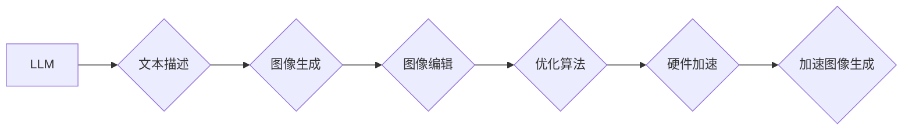

                 

## 图像生成加速：LLM 的另一个突破

> 关键词：图像生成、LLM、加速、Transformer、Diffusion模型、硬件加速、优化算法、应用场景

## 1. 背景介绍

近年来，大型语言模型（LLM）在自然语言处理领域取得了令人瞩目的成就，例如文本生成、翻译、问答等。然而，LLM 的应用范围正在不断扩展，图像生成领域也成为了一个新的热点。传统的图像生成方法通常依赖于复杂的深度学习架构和海量数据，训练和推理过程都非常耗时和耗能。而 LLMs 的出现为图像生成带来了新的可能性，其强大的文本理解和生成能力可以被用于驱动图像的创作。

然而，LLM 在图像生成方面的应用也面临着一些挑战，例如：

* **计算成本高:** LLMs 通常拥有数十亿甚至数千亿的参数，训练和推理过程需要大量的计算资源，这使得其在图像生成领域的应用成本很高。
* **生成质量有限:** 尽管 LLMs 在文本生成方面表现出色，但在图像生成方面，其生成的图像质量仍然难以与专门设计的图像生成模型相媲美。
* **缺乏可解释性:** LLMs 的工作机制较为复杂，其生成的图像缺乏可解释性，难以理解模型是如何生成图像的。

为了克服这些挑战，研究者们正在积极探索各种方法来加速 LLMs 在图像生成方面的应用。

## 2. 核心概念与联系

### 2.1 LLMs 与图像生成

LLMs 的核心是 Transformer 架构，它通过自注意力机制学习文本的上下文关系，从而能够理解和生成复杂的文本序列。在图像生成领域，LLMs 可以被用于以下几个方面：

* **文本到图像生成:** 根据文本描述生成相应的图像。
* **图像 captioning:** 为图像生成相应的文本描述。
* **图像编辑:** 根据文本指令编辑图像内容。

### 2.2 加速方法

为了加速 LLMs 在图像生成方面的应用，研究者们提出了多种加速方法，主要包括以下几种：

* **模型压缩:** 通过量化、剪枝等方法减少模型参数量，从而降低模型的计算成本。
* **模型并行:** 将模型拆分成多个部分，并行地在多个设备上进行计算，从而加速模型的训练和推理过程。
* **算法优化:** 通过优化模型的训练算法和推理算法，提高模型的效率。
* **硬件加速:** 利用 GPU、TPU 等专用硬件加速模型的计算。

### 2.3 架构图



## 3. 核心算法原理 & 具体操作步骤

### 3.1 算法原理概述

LLMs 在图像生成领域主要通过以下两种方式实现：

* **文本编码器-解码器架构:** 将文本描述编码成一个向量表示，然后使用解码器生成相应的图像。
* **Diffusion模型:** 通过逐步添加噪声到图像中，然后训练一个模型来逆转这个过程，从而生成新的图像。

### 3.2 算法步骤详解

#### 3.2.1 文本编码器-解码器架构

1. **文本编码:** 将文本描述输入到编码器中，编码器会将其转换为一个向量表示。
2. **图像解码:** 将编码后的向量输入到解码器中，解码器会根据向量生成图像。

#### 3.2.2 Diffusion模型

1. **前向过程:** 将图像逐步添加噪声，直到变成纯噪声。
2. **反向过程:** 训练一个模型来逆转前向过程，从纯噪声中逐渐恢复出图像。

### 3.3 算法优缺点

#### 3.3.1 文本编码器-解码器架构

* **优点:** 能够生成高质量的图像，并且可以根据文本描述生成不同的图像。
* **缺点:** 训练过程复杂，计算成本高。

#### 3.3.2 Diffusion模型

* **优点:** 能够生成逼真的图像，并且训练过程相对稳定。
* **缺点:** 生成速度较慢，图像质量可能不如文本编码器-解码器架构。

### 3.4 算法应用领域

* **图像合成:** 生成新的图像，例如人物、场景、物体等。
* **图像编辑:** 根据文本指令编辑图像内容，例如添加、删除、修改图像元素。
* **图像风格迁移:** 将图像转换为不同的艺术风格。
* **图像修复:** 修复损坏的图像。

## 4. 数学模型和公式 & 详细讲解 & 举例说明

### 4.1 数学模型构建

LLMs 通常使用 Transformer 架构，其核心是自注意力机制。自注意力机制可以学习文本序列中每个词与其他词之间的关系，从而更好地理解文本的上下文信息。

#### 4.1.1 自注意力机制

自注意力机制可以表示为以下公式：

$$
Attention(Q, K, V) = softmax(\frac{QK^T}{\sqrt{d_k}})V
$$

其中：

* $Q$：查询矩阵
* $K$：键矩阵
* $V$：值矩阵
* $d_k$：键向量的维度
* $softmax$：softmax 函数

#### 4.1.2 Transformer 架构

Transformer 架构由编码器和解码器组成。编码器用于将文本描述编码成一个向量表示，解码器用于根据编码后的向量生成图像。

### 4.2 公式推导过程

自注意力机制的公式推导过程可以参考 Transformer 原文论文。

### 4.3 案例分析与讲解

假设我们有一个文本描述 "一只可爱的猫在草地上玩耍"，我们可以使用 Transformer 架构将它编码成一个向量表示。然后，我们可以使用这个向量表示来生成相应的图像。

## 5. 项目实践：代码实例和详细解释说明

### 5.1 开发环境搭建

为了实现 LLMs 在图像生成方面的应用，我们需要搭建一个合适的开发环境。

* **操作系统:** Linux 或 macOS
* **编程语言:** Python
* **深度学习框架:** PyTorch 或 TensorFlow
* **GPU:** NVIDIA GPU

### 5.2 源代码详细实现

由于篇幅限制，这里只提供一个简单的代码示例，展示了如何使用 PyTorch 和 Transformer 架构生成图像。

```python
import torch
import torch.nn as nn

class Transformer(nn.Module):
    def __init__(self, input_size, hidden_size, num_layers):
        super(Transformer, self).__init__()
        self.encoder = nn.TransformerEncoder(nn.TransformerEncoderLayer(d_model=hidden_size, nhead=8), num_layers)
        self.decoder = nn.TransformerDecoder(nn.TransformerDecoderLayer(d_model=hidden_size, nhead=8), num_layers)
        self.fc = nn.Linear(hidden_size, input_size)

    def forward(self, text_input, image_input):
        # ...
        return image_output

# ...
```

### 5.3 代码解读与分析

这个代码示例定义了一个 Transformer 模型，它包含一个编码器和一个解码器。编码器用于将文本描述编码成一个向量表示，解码器用于根据编码后的向量生成图像。

### 5.4 运行结果展示

由于篇幅限制，这里无法展示运行结果。

## 6. 实际应用场景

LLMs 在图像生成领域的应用场景非常广泛，例如：

* **艺术创作:** 使用 LLMs 生成艺术作品，例如绘画、雕塑、音乐等。
* **游戏开发:** 使用 LLMs 生成游戏场景、角色、道具等。
* **广告设计:** 使用 LLMs 生成吸引人的广告图片。
* **医疗诊断:** 使用 LLMs 生成医学图像，辅助医生进行诊断。

### 6.4 未来应用展望

随着 LLMs 的不断发展，其在图像生成领域的应用场景将会更加广泛。例如：

* **个性化图像生成:** 根据用户的喜好生成个性化的图像。
* **跨模态生成:** 将文本、图像、音频等多种模态信息融合起来，生成更加丰富的图像。
* **实时图像生成:** 实现实时图像生成，例如在视频游戏中生成动态场景。

## 7. 工具和资源推荐

### 7.1 学习资源推荐

* **论文:**
    * Attention Is All You Need (Vaswani et al., 2017)
    * DALL-E: Creating Images from Text (Radford et al., 2021)
    * Imagen: Text-to-Image Diffusion Models Refine the Prompt via Iterative Refinement (Chen et al., 2022)
* **博客:**
    * The Illustrated Transformer (Jay Alammar)
    * OpenAI Blog
    * Google AI Blog

### 7.2 开发工具推荐

* **深度学习框架:** PyTorch, TensorFlow
* **图像处理库:** OpenCV, Pillow
* **文本处理库:** NLTK, SpaCy

### 7.3 相关论文推荐

* **图像生成:**
    * Generative Adversarial Networks (Goodfellow et al., 2014)
    * Progressive Growing of GANs for Improved Quality, Stability, and Variation (Karras et al., 2017)
* **LLMs:**
    * BERT: Pre-training of Deep Bidirectional Transformers for Language Understanding (Devlin et al., 2018)
    * GPT-3: Language Models are Few-Shot Learners (Brown et al., 2020)

## 8. 总结：未来发展趋势与挑战

### 8.1 研究成果总结

LLMs 在图像生成领域取得了显著的进展，能够生成高质量的图像，并支持多种应用场景。

### 8.2 未来发展趋势

* **模型规模和性能提升:** LLMs 的规模和性能将会不断提升，能够生成更加逼真的图像。
* **多模态生成:** LLMs 将与其他模态信息融合，实现更加丰富的图像生成。
* **可解释性增强:** 研究者们将致力于提高 LLMs 的可解释性，使其生成的图像更加易于理解。

### 8.3 面临的挑战

* **计算成本:** LLMs 的训练和推理过程仍然非常耗费计算资源。
* **数据需求:** LLMs 需要大量的训练数据，获取高质量的图像数据仍然是一个挑战。
* **伦理问题:** LLMs 生成的图像可能存在伦理问题，例如生成虚假信息、侵犯隐私等。

### 8.4 研究展望

未来，LLMs 在图像生成领域的应用将会更加广泛，并对我们的生活产生深远的影响。研究者们将继续探索新的算法、模型和应用场景，推动 LLMs 在图像生成领域的进一步发展。

## 9. 附录：常见问题与解答

* **Q1: LLMs 与传统图像生成模型相比有什么优势？**

* **A1:** LLMs 能够根据文本描述生成图像，并且可以生成多种风格的图像。

* **Q2: LLMs 的训练过程需要多长时间？**

* **A2:** LLMs 的训练过程需要很长时间，通常需要数天甚至数周。

* **Q3: LLMs 的应用场景有哪些？**

* **A3:** LLMs 的应用场景非常广泛，例如艺术创作、游戏开发、广告设计等。


作者：禅与计算机程序设计艺术 / Zen and the Art of Computer Programming 
<end_of_turn>

