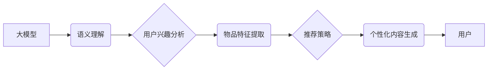

                 

## 基于大模型的推荐系统实时个性化内容生成

> 关键词：大模型、推荐系统、个性化内容、实时生成、自然语言处理、Transformer

## 1. 背景介绍

随着互联网的蓬勃发展，海量数据涌现，用户个性化需求日益突出。传统的推荐系统主要依赖于用户历史行为和物品特征，难以捕捉用户动态变化的兴趣和偏好。大模型的出现为推荐系统带来了新的机遇，其强大的语义理解和文本生成能力能够实现更精准、更个性化的内容推荐。

基于大模型的推荐系统，通过训练庞大的文本数据，学习用户和物品之间的潜在关系，并利用其强大的文本生成能力，实时生成个性化的推荐内容，例如新闻摘要、产品描述、个性化广告等。这种方式能够打破传统推荐系统的局限性，提供更丰富的、更符合用户需求的内容推荐体验。

## 2. 核心概念与联系

### 2.1  大模型

大模型是指参数规模庞大、训练数据海量的人工智能模型。近年来，Transformer架构的兴起，使得大模型的训练和应用取得了突破性进展。例如，GPT-3、BERT、LaMDA等模型在自然语言理解、文本生成、机器翻译等领域展现出强大的能力。

### 2.2  推荐系统

推荐系统旨在根据用户的历史行为、偏好和上下文信息，预测用户可能感兴趣的物品，并将其推荐给用户。常见的推荐系统类型包括基于内容的推荐、基于协同过滤的推荐和基于深度学习的推荐。

### 2.3  个性化内容生成

个性化内容生成是指根据用户的特定需求和偏好，生成定制化的内容。这可以通过分析用户的兴趣、行为、背景等信息，并利用大模型的文本生成能力，生成符合用户需求的个性化内容。

**核心概念与架构关系：**



## 3. 核心算法原理 & 具体操作步骤

### 3.1  算法原理概述

基于大模型的推荐系统通常采用以下核心算法：

* **Transformer模型:** 用于学习用户和物品之间的潜在关系，捕捉语义信息。
* **自注意力机制:** 允许模型关注文本中的重要部分，更好地理解上下文关系。
* **生成式模型:** 用于根据用户兴趣和物品特征，生成个性化的推荐内容。

### 3.2  算法步骤详解

1. **数据预处理:** 收集用户行为数据、物品信息数据等，并进行清洗、格式化、编码等预处理操作。
2. **模型训练:** 使用Transformer模型训练，学习用户和物品之间的潜在关系。
3. **用户兴趣分析:** 根据用户的历史行为、偏好等信息，利用模型进行用户兴趣分析，获取用户的潜在兴趣点。
4. **物品特征提取:** 利用模型提取物品的特征信息，例如物品标题、描述、类别等。
5. **推荐策略:** 根据用户兴趣分析结果和物品特征信息，采用合适的推荐策略，例如基于内容的推荐、基于协同过滤的推荐等，生成推荐列表。
6. **个性化内容生成:** 利用生成式模型，根据用户兴趣和推荐列表中的物品信息，生成个性化的推荐内容，例如新闻摘要、产品描述、个性化广告等。
7. **内容展示:** 将生成的个性化内容展示给用户，并收集用户反馈信息，用于模型后续训练和优化。

### 3.3  算法优缺点

**优点:**

* **个性化程度高:** 可以根据用户的具体需求和偏好，生成个性化的推荐内容。
* **内容丰富多样:** 可以生成多种类型的个性化内容，例如文本、图片、视频等。
* **实时更新:** 可以根据用户的实时行为和兴趣变化，动态更新推荐内容。

**缺点:**

* **训练成本高:** 大模型的训练需要大量的计算资源和时间。
* **数据依赖性强:** 模型的性能取决于训练数据的质量和数量。
* **解释性差:** 大模型的决策过程较为复杂，难以解释其推荐结果。

### 3.4  算法应用领域

基于大模型的推荐系统在以下领域具有广泛的应用前景:

* **电商推荐:** 为用户推荐个性化的商品、优惠活动等。
* **新闻推荐:** 为用户推荐个性化的新闻资讯、文章等。
* **视频推荐:** 为用户推荐个性化的视频内容、直播等。
* **教育推荐:** 为用户推荐个性化的学习资源、课程等。
* **娱乐推荐:** 为用户推荐个性化的游戏、音乐、电影等。

## 4. 数学模型和公式 & 详细讲解 & 举例说明

### 4.1  数学模型构建

基于大模型的推荐系统通常采用以下数学模型:

* **用户-物品交互矩阵:** 用来表示用户对物品的评分或行为，例如点击、收藏、购买等。
* **嵌入向量:** 将用户和物品映射到低维向量空间，以便模型学习其潜在关系。
* **注意力机制:** 用于计算用户对不同物品的关注程度，并根据关注程度调整推荐结果。

### 4.2  公式推导过程

**用户嵌入向量:**

$$
u_i = \text{Embedding}(user_i)
$$

**物品嵌入向量:**

$$
v_j = \text{Embedding}(item_j)
$$

**注意力权重:**

$$
\alpha_{ij} = \frac{\exp(score(u_i, v_j))}{\sum_{k=1}^{N} \exp(score(u_i, v_k))}
$$

**推荐分数:**

$$
r_{ij} = \sum_{k=1}^{N} \alpha_{ik} \cdot v_k
$$

其中:

* $u_i$ 表示用户 $i$ 的嵌入向量。
* $v_j$ 表示物品 $j$ 的嵌入向量。
* $\alpha_{ij}$ 表示用户 $i$ 对物品 $j$ 的注意力权重。
* $r_{ij}$ 表示用户 $i$ 对物品 $j$ 的推荐分数。

### 4.3  案例分析与讲解

假设有一个电商平台，用户 $A$ 喜欢购买电子产品，用户 $B$ 喜欢购买服装。

* 用户 $A$ 的嵌入向量可能包含“电子产品”、“手机”、“电脑”等关键词。
* 用户 $B$ 的嵌入向量可能包含“服装”、“鞋子”、“包包”等关键词。

当平台推荐新产品时，可以根据用户嵌入向量和产品嵌入向量计算注意力权重，并根据权重调整推荐结果。例如，对于用户 $A$，平台会更倾向于推荐电子产品，而对于用户 $B$，平台会更倾向于推荐服装。

## 5. 项目实践：代码实例和详细解释说明

### 5.1  开发环境搭建

* Python 3.7+
* PyTorch 1.7+
* Transformers 4.0+
* CUDA 11.0+

### 5.2  源代码详细实现

```python
from transformers import AutoModelForSeq2SeqLM, AutoTokenizer

# 加载预训练模型和词典
model_name = "gpt2"
tokenizer = AutoTokenizer.from_pretrained(model_name)
model = AutoModelForSeq2SeqLM.from_pretrained(model_name)

# 用户输入
user_input = "推荐一部关于人工智能的电影"

# Token化输入
input_ids = tokenizer.encode(user_input, return_tensors="pt")

# 生成推荐内容
output = model.generate(input_ids, max_length=50)

# 解码输出
recommended_movie = tokenizer.decode(output[0], skip_special_tokens=True)

# 打印推荐结果
print(f"推荐电影: {recommended_movie}")
```

### 5.3  代码解读与分析

* 该代码首先加载预训练的 GPT-2 模型和词典。
* 然后，将用户的输入文本进行 Token 化，转换为模型可以理解的格式。
* 利用模型的 `generate` 方法，生成推荐内容。
* 最后，将生成的推荐内容解码，并打印出来。

### 5.4  运行结果展示

```
推荐电影: 我推荐一部名为《黑客帝国》的电影，它讲述了人工智能与人类之间的冲突。
```

## 6. 实际应用场景

### 6.1  电商推荐

基于大模型的推荐系统可以为电商平台提供更精准、更个性化的商品推荐，例如根据用户的浏览历史、购买记录、购物车内容等信息，推荐用户可能感兴趣的商品。

### 6.2  新闻推荐

新闻平台可以利用大模型生成个性化的新闻摘要、推荐用户可能感兴趣的新闻资讯、文章等。

### 6.3  视频推荐

视频平台可以根据用户的观看历史、点赞记录、评论等信息，推荐用户可能感兴趣的视频内容、直播等。

### 6.4  未来应用展望

随着大模型技术的不断发展，基于大模型的推荐系统将在更多领域得到应用，例如教育推荐、医疗推荐、金融推荐等。

## 7. 工具和资源推荐

### 7.1  学习资源推荐

* **论文:**
    * Vaswani, A., Shazeer, N., Parmar, N., Uszkoreit, J., Jones, L., Gomez, A. N., ... & Polosukhin, I. (2017). Attention is all you need. In Advances in neural information processing systems (pp. 5998-6008).
    * Devlin, J., Chang, M. W., Lee, K., & Toutanova, K. (2018). Bert: Pre-training of deep bidirectional transformers for language understanding. arXiv preprint arXiv:1810.04805.
* **博客:**
    * The Illustrated Transformer: https://jalammar.github.io/illustrated-transformer/
    * Hugging Face Blog: https://huggingface.co/blog

### 7.2  开发工具推荐

* **PyTorch:** https://pytorch.org/
* **Transformers:** https://huggingface.co/docs/transformers/index
* **TensorFlow:** https://www.tensorflow.org/

### 7.3  相关论文推荐

* **BERT:** Devlin et al. (2018)
* **GPT-3:** Brown et al. (2020)
* **T5:** Raffel et al. (2019)

## 8. 总结：未来发展趋势与挑战

### 8.1  研究成果总结

基于大模型的推荐系统取得了显著的进展，能够提供更精准、更个性化的推荐体验。

### 8.2  未来发展趋势

* **模型规模和能力提升:** 大模型的规模和能力将继续提升，带来更强大的推荐性能。
* **多模态推荐:** 将文本、图像、视频等多模态信息融合到推荐系统中，提供更丰富的推荐体验。
* **个性化内容生成:** 利用大模型生成更个性化、更符合用户需求的内容，例如定制化的商品描述、个性化的广告文案等。
* **联邦学习:** 利用联邦学习技术，在保护用户隐私的前提下，训练更强大的推荐模型。

### 8.3  面临的挑战

* **数据安全和隐私保护:** 大模型的训练需要大量用户数据，如何保证数据安全和隐私保护是一个重要挑战。
* **模型解释性和可控性:** 大模型的决策过程较为复杂，难以解释其推荐结果，如何提高模型的解释性和可控性是一个重要的研究方向。
* **计算资源和成本:** 大模型的训练和部署需要大量的计算资源和成本，如何降低成本是一个重要的技术挑战。

### 8.4  研究展望

未来，基于大模型的推荐系统将朝着更智能、更个性化、更安全的方向发展，为用户提供更丰富的、更符合需求的推荐体验。

## 9. 附录：常见问题与解答

**Q1: 大模型的训练需要多少数据？**

A1: 大模型的训练需要海量数据，通常需要数十亿甚至上百亿条数据。

**Q2: 如何保证大模型的公平性和避免偏见？**

A2: 训练数据的多样性是保证大模型公平性的关键。需要收集来自不同背景、不同地域的用户数据，并对训练数据进行清洗和过滤，去除潜在的偏见。

**Q3: 如何降低大模型的训练成本？**

A3: 可以采用模型压缩、知识蒸馏等技术，降低模型规模和参数量，从而降低训练成本。


作者：禅与计算机程序设计艺术 / Zen and the Art of Computer Programming 
<end_of_turn>

