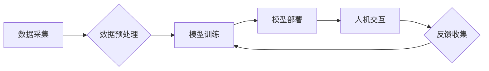

                 

## 增强智能：人机协同，拓展认知边界

> 关键词：增强智能、人机协同、认知拓展、深度学习、自然语言处理、计算机视觉、算法原理、应用场景、未来趋势

### 1. 背景介绍

人类文明的进步离不开对认知能力的不断提升。从语言的诞生到文字的出现，再到科学技术的革新，每一次的突破都源于我们对世界进行理解和解释的能力的增强。而随着人工智能技术的飞速发展，我们正站在一个新的历史节点上，即将迎来一场深刻的人机协同革命。

增强智能（Augmented Intelligence，简称AI）的概念应运而生。它不再是单纯地模仿人类智能，而是更侧重于**提升人类智能**，通过人机协同，拓展人类认知边界。AI技术可以帮助我们更快、更准确地处理信息，洞察复杂问题，激发创造力，最终实现人类智慧的全面提升。

### 2. 核心概念与联系

**2.1 增强智能的核心概念**

增强智能的核心概念是**人机协同**。它强调人与机器之间的相互补充和协作，发挥各自的优势，共同完成更复杂的任务。

* **人类优势:** 拥有创造力、批判性思维、情感理解等高阶认知能力。
* **机器优势:** 拥有强大的计算能力、海量数据处理能力、快速学习和适应能力。

**2.2 人机协同的架构**

增强智能的架构通常包括以下几个关键部分：

* **数据采集与处理:** 收集来自各种来源的数据，并进行清洗、预处理等操作，为AI模型提供训练数据。
* **模型训练与优化:** 利用深度学习等算法训练AI模型，使其能够识别模式、做出预测和决策。
* **人机交互界面:** 提供用户友好的交互方式，让用户能够与AI模型进行自然、直观的沟通。
* **反馈机制:** 收集用户反馈，并将其用于模型的持续优化和改进。

**2.3 人机协同的流程图**



### 3. 核心算法原理 & 具体操作步骤

**3.1 算法原理概述**

增强智能的核心算法主要包括深度学习、自然语言处理、计算机视觉等领域的技术。

* **深度学习:** 通过多层神经网络模拟人类大脑的学习过程，能够从海量数据中自动提取特征，并进行复杂模式识别和预测。
* **自然语言处理:** 使计算机能够理解和处理人类语言，包括文本分析、机器翻译、语音识别等应用。
* **计算机视觉:** 使计算机能够“看”世界，理解图像和视频信息，包括图像识别、物体检测、场景理解等应用。

**3.2 算法步骤详解**

以深度学习为例，其训练过程可以概括为以下步骤：

1. **数据准备:** 收集并预处理训练数据，将其转换为模型能够理解的格式。
2. **模型构建:** 根据任务需求设计神经网络结构，包括层数、节点数量、激活函数等参数。
3. **模型训练:** 利用训练数据，通过反向传播算法调整模型参数，使其能够准确地预测输出。
4. **模型评估:** 使用测试数据评估模型的性能，并根据评估结果进行模型调优。
5. **模型部署:** 将训练好的模型部署到实际应用场景中，用于进行预测或决策。

**3.3 算法优缺点**

* **优点:** 能够处理复杂数据，自动提取特征，学习能力强，性能优异。
* **缺点:** 需要大量数据进行训练，训练时间长，模型解释性差，容易受到数据偏差的影响。

**3.4 算法应用领域**

深度学习算法广泛应用于各个领域，例如：

* **医疗诊断:** 辅助医生诊断疾病，提高诊断准确率。
* **金融风险控制:** 识别金融风险，降低损失。
* **智能客服:** 提供24小时在线服务，提高客户满意度。
* **自动驾驶:** 帮助车辆感知周围环境，实现自动驾驶。

### 4. 数学模型和公式 & 详细讲解 & 举例说明

**4.1 数学模型构建**

深度学习模型通常基于神经网络结构，其数学模型可以表示为一系列的线性变换和非线性激活函数。

* **线性变换:** 用于将输入数据映射到不同的特征空间。
* **非线性激活函数:** 用于引入非线性关系，提高模型的表达能力。

**4.2 公式推导过程**

深度学习模型的训练过程基于梯度下降算法，其核心公式为：

$$
\theta = \theta - \alpha \frac{\partial L}{\partial \theta}
$$

其中：

* $\theta$ 表示模型参数。
* $\alpha$ 表示学习率。
* $L$ 表示损失函数，用于衡量模型预测结果与真实值的差距。
* $\frac{\partial L}{\partial \theta}$ 表示损失函数对模型参数的梯度。

**4.3 案例分析与讲解**

以图像分类为例，假设我们有一个包含猫和狗的图像数据集。我们可以使用卷积神经网络（CNN）来训练一个图像分类模型。

CNN模型的结构包括多个卷积层、池化层和全连接层。卷积层用于提取图像特征，池化层用于降低特征维度，全连接层用于进行分类决策。

训练过程中，模型会根据图像数据和标签进行迭代更新，最终能够将新的图像分类为猫或狗。

### 5. 项目实践：代码实例和详细解释说明

**5.1 开发环境搭建**

* **操作系统:** Ubuntu 20.04 LTS
* **编程语言:** Python 3.8
* **深度学习框架:** TensorFlow 2.0
* **其他工具:** Jupyter Notebook、Git

**5.2 源代码详细实现**

```python
import tensorflow as tf

# 定义模型结构
model = tf.keras.models.Sequential([
    tf.keras.layers.Conv2D(32, (3, 3), activation='relu', input_shape=(28, 28, 1)),
    tf.keras.layers.MaxPooling2D((2, 2)),
    tf.keras.layers.Conv2D(64, (3, 3), activation='relu'),
    tf.keras.layers.MaxPooling2D((2, 2)),
    tf.keras.layers.Flatten(),
    tf.keras.layers.Dense(10, activation='softmax')
])

# 编译模型
model.compile(optimizer='adam',
              loss='sparse_categorical_crossentropy',
              metrics=['accuracy'])

# 加载数据集
(x_train, y_train), (x_test, y_test) = tf.keras.datasets.mnist.load_data()

# 数据预处理
x_train = x_train.astype('float32') / 255.0
x_test = x_test.astype('float32') / 255.0
x_train = x_train.reshape((x_train.shape[0], 28, 28, 1))
x_test = x_test.reshape((x_test.shape[0], 28, 28, 1))

# 训练模型
model.fit(x_train, y_train, epochs=5)

# 评估模型
loss, accuracy = model.evaluate(x_test, y_test)
print('Test loss:', loss)
print('Test accuracy:', accuracy)
```

**5.3 代码解读与分析**

这段代码实现了使用TensorFlow框架训练一个简单的图像分类模型。

* 首先定义了模型结构，包括卷积层、池化层和全连接层。
* 然后编译模型，指定优化器、损失函数和评价指标。
* 加载MNIST数据集，并进行数据预处理。
* 训练模型，并评估模型性能。

**5.4 运行结果展示**

训练完成后，模型能够将新的图像分类为0-9的数字。

### 6. 实际应用场景

**6.1 医疗诊断辅助**

增强智能可以帮助医生更快、更准确地诊断疾病。例如，AI算法可以分析病人的影像数据，识别肿瘤、骨折等异常情况，辅助医生做出诊断。

**6.2 金融风险控制**

增强智能可以帮助金融机构识别和控制风险。例如，AI算法可以分析交易数据，识别欺诈行为，并进行风险评估。

**6.3 智能客服**

增强智能可以提供24小时在线客服服务，提高客户满意度。例如，AI聊天机器人可以回答客户常见问题，提供产品信息，并引导客户解决问题。

**6.4 自动驾驶**

增强智能是自动驾驶的关键技术之一。AI算法可以帮助车辆感知周围环境，识别障碍物、行人、交通信号等，并做出相应的决策。

**6.5 未来应用展望**

随着人工智能技术的不断发展，增强智能将在更多领域得到应用，例如：

* **教育:** 个性化学习、智能辅导
* **科研:** 数据分析、模型预测
* **艺术:** 内容创作、风格迁移
* **生活:** 智能家居、个性化推荐

### 7. 工具和资源推荐

**7.1 学习资源推荐**

* **书籍:**
    * 《深度学习》
    * 《人工智能：一种现代方法》
    * 《机器学习实战》
* **在线课程:**
    * Coursera: 深度学习
    * edX: 人工智能
    * Udacity: 自动驾驶工程师

**7.2 开发工具推荐**

* **深度学习框架:** TensorFlow, PyTorch, Keras
* **编程语言:** Python
* **数据处理工具:** Pandas, NumPy

**7.3 相关论文推荐**

* 《ImageNet Classification with Deep Convolutional Neural Networks》
* 《Attention Is All You Need》
* 《BERT: Pre-training of Deep Bidirectional Transformers for Language Understanding》

### 8. 总结：未来发展趋势与挑战

**8.1 研究成果总结**

近年来，增强智能领域取得了显著进展，深度学习算法在图像识别、自然语言处理、语音识别等领域取得了突破性成果。

**8.2 未来发展趋势**

* **模型更加强大:** 模型规模将继续扩大，性能将进一步提升。
* **应用更加广泛:** 增强智能将应用于更多领域，例如医疗、教育、金融等。
* **人机协作更加紧密:** 人和机器将更加紧密地协作，共同完成复杂任务。

**8.3 面临的挑战**

* **数据安全和隐私保护:** 增强智能需要大量数据进行训练，如何保证数据安全和隐私保护是一个重要挑战。
* **算法解释性和可信度:** 深度学习模型的决策过程往往难以解释，如何提高算法的解释性和可信度是一个关键问题。
* **伦理和社会影响:** 增强智能的应用可能会带来一些伦理和社会问题，例如就业问题、算法偏见等，需要引起重视和探讨。

**8.4 研究展望**

未来，增强智能研究将继续朝着更加安全、可靠、可解释的方向发展，并与其他技术融合，例如量子计算、生物智能等，为人类社会带来更多福祉。

### 9. 附录：常见问题与解答

**9.1 如何选择合适的增强智能算法？**

选择合适的增强智能算法需要根据具体任务需求进行考虑。例如，图像分类任务可以使用卷积神经网络，文本分析任务可以使用循环神经网络或Transformer网络。

**9.2 如何解决数据偏差问题？**

数据偏差是深度学习模型的一个常见问题，可以通过以下方法进行解决：

* 使用更加多样化的训练数据。
* 使用数据增强技术，例如图像旋转、裁剪等。
* 使用正则化技术，例如Dropout、L1正则化等，防止模型过拟合。

**9.3 如何提高算法的解释性和可信度？**

提高算法的解释性和可信度可以通过以下方法：

* 使用可解释的机器学习模型，例如决策树、线性回归等。
* 使用可视化技术，例如特征重要性分析、模型可视化等，帮助理解模型的决策过程。
* 进行严格的模型评估和验证，确保模型的可靠性和准确性。


作者：禅与计算机程序设计艺术 / Zen and the Art of Computer Programming 
<end_of_turn>

