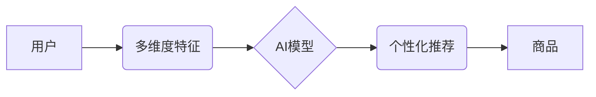

                 

## 多维度个性化:AI电商搜索的精准营销

> 关键词：电商搜索、个性化推荐、多维度特征、机器学习、深度学习、自然语言处理、精准营销

## 1. 背景介绍

在当今数字经济时代，电商平台已成为人们获取商品和服务的首选渠道。然而，随着电商平台商品数量的激增，用户在海量商品中寻找所需产品变得越来越困难。传统的关键词匹配搜索方式难以满足用户个性化需求，导致用户体验下降，转化率降低。因此，如何实现精准的商品推荐，提升用户搜索体验，成为电商平台亟待解决的关键问题。

多维度个性化搜索技术应运而生，它通过对用户行为、偏好、环境等多方面信息的分析，构建用户个性化画像，并根据用户画像精准推荐相关商品。这种技术能够有效提升用户搜索体验，提高商品转化率，为电商平台带来更大的商业价值。

## 2. 核心概念与联系

### 2.1  个性化推荐

个性化推荐是指根据用户的历史行为、偏好、兴趣等信息，为用户推荐个性化的商品或服务。其核心目标是提高用户满意度和转化率。

### 2.2  多维度特征

多维度特征是指从多个角度对用户进行描述的特征集合。这些特征可以包括用户 demographics 信息（年龄、性别、职业等）、行为特征（浏览历史、购买记录、评价行为等）、兴趣特征（关注商品类别、喜欢的品牌等）、环境特征（地理位置、设备类型等）。

### 2.3  AI技术

人工智能技术在个性化推荐中扮演着至关重要的角色。通过机器学习、深度学习、自然语言处理等技术，可以从海量用户数据中挖掘出隐藏的模式和规律，构建更精准的用户画像，并进行个性化商品推荐。

**核心概念架构图**



## 3. 核心算法原理 & 具体操作步骤

### 3.1  算法原理概述

多维度个性化搜索算法通常基于协同过滤、内容过滤、混合过滤等推荐算法，并结合深度学习技术进行特征提取和模型训练。

* **协同过滤:** 基于用户之间或商品之间相似性的推荐算法。例如，如果用户A和用户B都喜欢商品X，那么当用户A浏览商品Y时，系统可能会推荐商品Y给用户B。
* **内容过滤:** 基于商品的属性和用户偏好的推荐算法。例如，如果用户A喜欢运动类商品，那么系统可能会推荐其他运动类商品给用户A。
* **混合过滤:** 将协同过滤和内容过滤相结合的推荐算法。

### 3.2  算法步骤详解

1. **数据收集:** 收集用户行为数据、商品属性数据等。
2. **数据预处理:** 对数据进行清洗、转换、特征工程等处理。
3. **模型训练:** 选择合适的推荐算法，并根据训练数据进行模型训练。
4. **个性化推荐:** 根据用户的特征和历史行为，利用训练好的模型进行个性化商品推荐。
5. **效果评估:** 对推荐结果进行评估，并根据评估结果进行模型优化。

### 3.3  算法优缺点

**优点:**

* 能够提供个性化的商品推荐，提升用户体验。
* 能够提高商品转化率，增加电商平台收入。
* 能够帮助用户发现新的商品和服务。

**缺点:**

* 需要大量的用户数据进行训练，数据质量对算法效果至关重要。
* 算法可能会出现冷启动问题，即对于新用户或新商品难以进行准确推荐。
* 算法可能会出现数据孤岛问题，即不同数据源之间无法有效整合。

### 3.4  算法应用领域

多维度个性化搜索算法广泛应用于电商平台、社交媒体、内容推荐等领域。

## 4. 数学模型和公式 & 详细讲解 & 举例说明

### 4.1  数学模型构建

多维度个性化搜索算法通常采用基于矩阵分解的协同过滤模型，例如：

* **用户-商品评分矩阵:** 将用户和商品作为行和列，用户对商品的评分作为矩阵元素。
* **隐因子模型:** 假设用户和商品之间存在一些不可见的隐因子，这些隐因子决定了用户对商品的评分。

### 4.2  公式推导过程

假设用户u对商品i的评分为r<sub>ui</sub>，用户u的隐因子向量为p<sub>u</sub>，商品i的隐因子向量为q<sub>i</sub>，则用户u对商品i的评分可以表示为：

$$r_{ui} = p_u \cdot q_i + \epsilon$$

其中，$\epsilon$为误差项。

通过最小化预测评分与实际评分之间的误差，可以学习到用户和商品的隐因子向量。

### 4.3  案例分析与讲解

例如，假设用户A对电影A评分为5，对电影B评分为3，用户B对电影A评分为4，对电影B评分为5。我们可以构建一个用户-商品评分矩阵，并使用矩阵分解算法学习到用户和电影的隐因子向量。

通过学习到的隐因子向量，我们可以预测用户A对电影C的评分，以及用户B对电影D的评分。

## 5. 项目实践：代码实例和详细解释说明

### 5.1  开发环境搭建

* Python 3.x
* TensorFlow/PyTorch
* Scikit-learn
* Pandas
* Numpy

### 5.2  源代码详细实现

```python
# 导入必要的库
import tensorflow as tf
from sklearn.metrics import mean_squared_error

# 定义用户-商品评分矩阵
ratings = tf.constant([[5, 3], [4, 5]])

# 定义隐因子维度
latent_dim = 2

# 定义模型
class RecommenderModel(tf.keras.Model):
    def __init__(self, latent_dim):
        super(RecommenderModel, self).__init__()
        self.user_embeddings = tf.keras.layers.Embedding(input_dim=ratings.shape[0], output_dim=latent_dim)
        self.item_embeddings = tf.keras.layers.Embedding(input_dim=ratings.shape[1], output_dim=latent_dim)

    def call(self, user_ids, item_ids):
        user_embeddings = self.user_embeddings(user_ids)
        item_embeddings = self.item_embeddings(item_ids)
        return tf.reduce_sum(user_embeddings * item_embeddings, axis=1)

# 实例化模型
model = RecommenderModel(latent_dim)

# 定义损失函数和优化器
optimizer = tf.keras.optimizers.Adam()
loss_fn = tf.keras.losses.MeanSquaredError()

# 训练模型
epochs = 10
for epoch in range(epochs):
    with tf.GradientTape() as tape:
        predictions = model(tf.range(ratings.shape[0]), tf.range(ratings.shape[1]))
        loss = loss_fn(ratings, predictions)
    gradients = tape.gradient(loss, model.trainable_variables)
    optimizer.apply_gradients(zip(gradients, model.trainable_variables))

# 评估模型
predictions = model(tf.range(ratings.shape[0]), tf.range(ratings.shape[1]))
rmse = tf.sqrt(mean_squared_error(ratings, predictions))
print(f"RMSE: {rmse.numpy()}")
```

### 5.3  代码解读与分析

* 代码首先导入必要的库，并定义用户-商品评分矩阵。
* 然后定义一个推荐模型，该模型使用嵌入层来学习用户和商品的隐因子向量。
* 模型训练使用Adam优化器和均方误差损失函数。
* 训练完成后，使用均方根误差（RMSE）来评估模型性能。

### 5.4  运行结果展示

运行代码后，可以得到模型的RMSE值，该值越小，模型的预测精度越高。

## 6. 实际应用场景

### 6.1  电商平台商品推荐

* 基于用户浏览历史、购买记录、评价行为等多维度特征，为用户推荐个性化的商品。
* 提升用户搜索体验，提高商品转化率。

### 6.2  社交媒体内容推荐

* 基于用户兴趣、好友关系、社交行为等多维度特征，为用户推荐个性化的内容。
* 提升用户粘性，增加平台活跃度。

### 6.3  内容平台个性化推荐

* 基于用户阅读历史、观看记录、点赞行为等多维度特征，为用户推荐个性化的内容。
* 提升用户阅读体验，增加内容平台收入。

### 6.4  未来应用展望

随着人工智能技术的不断发展，多维度个性化搜索技术将应用于更多领域，例如：

* **医疗保健:** 为患者推荐个性化的医疗方案。
* **教育:** 为学生推荐个性化的学习资源。
* **金融:** 为用户推荐个性化的理财产品。

## 7. 工具和资源推荐

### 7.1  学习资源推荐

* **书籍:**
    * 《推荐系统实践》
    * 《深度学习》
* **在线课程:**
    * Coursera: Recommender Systems
    * Udacity: Deep Learning Nanodegree

### 7.2  开发工具推荐

* **Python:** 
    * TensorFlow
    * PyTorch
    * Scikit-learn
* **Spark:** 
    * MLlib

### 7.3  相关论文推荐

* **Collaborative Filtering for Implicit Feedback Datasets**
* **Deep Learning for Recommender Systems**
* **Hybrid Recommender Systems: A Survey**

## 8. 总结：未来发展趋势与挑战

### 8.1  研究成果总结

多维度个性化搜索技术在电商平台、社交媒体、内容推荐等领域取得了显著成果，能够有效提升用户体验和商业价值。

### 8.2  未来发展趋势

* **更精准的个性化推荐:** 通过更深入的用户画像分析和更先进的推荐算法，实现更精准的个性化推荐。
* **跨平台个性化推荐:** 将用户数据整合到多个平台，实现跨平台的个性化推荐。
* **解释性推荐:** 使推荐结果更透明可解释，帮助用户理解推荐背后的逻辑。

### 8.3  面临的挑战

* **数据隐私保护:** 如何在保证用户隐私的前提下进行数据分析和个性化推荐。
* **算法公平性:** 如何避免算法产生偏见，确保推荐结果公平公正。
* **模型可解释性:** 如何提高推荐算法的可解释性，帮助用户理解推荐背后的逻辑。

### 8.4  研究展望

未来，多维度个性化搜索技术将继续朝着更精准、更智能、更可解释的方向发展，为用户提供更个性化、更丰富的体验。

## 9. 附录：常见问题与解答

* **Q: 多维度个性化搜索算法需要多少数据才能训练？**
* **A:** 训练效果与数据量密切相关，一般来说，需要至少几千条用户行为数据才能进行有效训练。

* **Q: 多维度个性化搜索算法会产生冷启动问题吗？**
* **A:** 会，对于新用户或新商品，算法难以进行准确推荐。

* **Q: 如何解决多维度个性化搜索算法的公平性问题？**
* **A:** 可以通过数据预处理、算法设计等方式来缓解算法偏见。


作者：禅与计算机程序设计艺术 / Zen and the Art of Computer Programming 
<end_of_turn>

