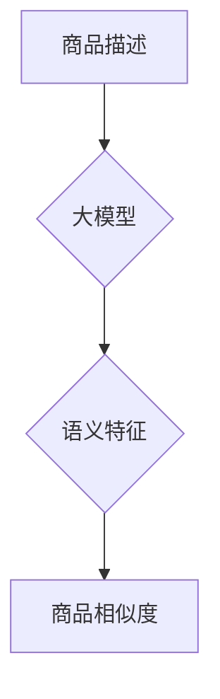

                 

## 大模型在商品相似度计算中的应用

> 关键词：大模型、商品相似度、推荐系统、自然语言处理、深度学习、Transformer、BERT、检索

## 1. 背景介绍

在电子商务时代，商品相似度计算作为推荐系统和搜索引擎的核心技术，扮演着至关重要的角色。传统的商品相似度计算方法主要依赖于商品的特征描述，例如商品类别、属性、价格等。然而，这些特征往往难以捕捉商品之间的语义关联和用户感知的相似性。

近年来，大模型技术在自然语言处理领域取得了突破性进展，其强大的语义理解和文本生成能力为商品相似度计算提供了新的思路。大模型能够学习商品描述文本的深层语义特征，从而更准确地衡量商品之间的相似性。

## 2. 核心概念与联系

### 2.1 商品相似度计算

商品相似度计算是指根据商品之间的某种关联性，量化其相似程度的过程。常见的相似度度量方法包括余弦相似度、Jaccard系数、编辑距离等。

### 2.2 大模型

大模型是指参数规模庞大、训练数据海量的人工智能模型。大模型通常基于深度学习架构，例如Transformer，能够学习复杂的语义关系和模式。

### 2.3 自然语言处理

自然语言处理（NLP）是人工智能领域的一个分支，旨在使计算机能够理解、处理和生成人类语言。

**核心概念与联系流程图**



## 3. 核心算法原理 & 具体操作步骤

### 3.1 算法原理概述

大模型在商品相似度计算中的应用主要基于以下原理：

* **语义嵌入:** 大模型能够将商品描述文本映射到一个低维的语义空间中，每个商品的描述文本对应一个向量表示。
* **相似度度量:** 在语义空间中，使用余弦相似度等方法计算商品向量之间的距离，从而衡量商品之间的相似性。

### 3.2 算法步骤详解

1. **数据预处理:** 对商品描述文本进行清洗、分词、词干提取等预处理操作，生成训练数据。
2. **大模型训练:** 使用预处理后的数据训练大模型，例如BERT，使其能够学习商品描述文本的语义特征。
3. **语义特征提取:** 将待比较的商品描述文本输入到训练好的大模型中，获取其对应的语义向量表示。
4. **相似度计算:** 使用余弦相似度等方法计算商品语义向量的相似度，得到商品之间的相似性得分。

### 3.3 算法优缺点

**优点:**

* **语义理解能力强:** 大模型能够捕捉商品描述文本的深层语义关联，提升相似度计算的准确性。
* **泛化能力强:** 大模型在训练过程中学习到的语义特征能够泛化到新的商品描述文本，提高算法的鲁棒性。

**缺点:**

* **计算资源消耗大:** 大模型的训练和推理过程需要大量的计算资源。
* **数据依赖性强:** 大模型的性能依赖于训练数据的质量和规模。

### 3.4 算法应用领域

* **电商推荐系统:** 根据用户历史购买记录和商品相似度，推荐用户可能感兴趣的商品。
* **搜索引擎:** 根据用户搜索关键词，推荐与搜索关键词相关的商品。
* **商品分类:** 根据商品描述文本的语义特征，自动将商品分类到不同的类别。

## 4. 数学模型和公式 & 详细讲解 & 举例说明

### 4.1 数学模型构建

假设有两个商品的描述文本为 $text_1$ 和 $text_2$，其对应的语义向量表示为 $vector_1$ 和 $vector_2$。

**相似度计算模型:**

$$similarity(text_1, text_2) = \frac{vector_1 \cdot vector_2}{||vector_1|| ||vector_2||}$$

其中，$\cdot$ 表示向量点积，$||vector||$ 表示向量的模长。

### 4.2 公式推导过程

余弦相似度公式的推导过程如下：

1. **向量点积:** 向量点积可以衡量两个向量的方向相关性。
2. **向量模长:** 向量模长表示向量的长度。
3. **相似度定义:** 余弦相似度定义为两个向量的点积除以其模长的乘积，其值介于 -1 和 1 之间，其中 1 表示完全相似，-1 表示完全相反，0 表示不相关。

### 4.3 案例分析与讲解

**示例:**

假设有两个商品的描述文本为：

* $text_1$: “这款手机拍照效果出色，屏幕清晰，性能强劲。”
* $text_2$: “这款手机拍照清晰，屏幕亮度高，运行流畅。”

其对应的语义向量表示为：

* $vector_1$: [0.8, 0.7, 0.9, 0.6]
* $vector_2$: [0.7, 0.6, 0.8, 0.5]

计算其余弦相似度:

$$similarity(text_1, text_2) = \frac{0.8 \cdot 0.7 + 0.7 \cdot 0.6 + 0.9 \cdot 0.8 + 0.6 \cdot 0.5}{\sqrt{0.8^2 + 0.7^2 + 0.9^2 + 0.6^2} \cdot \sqrt{0.7^2 + 0.6^2 + 0.8^2 + 0.5^2}}$$

$$similarity(text_1, text_2) \approx 0.85$$

结果表明，这两个商品的描述文本语义相似度较高。

## 5. 项目实践：代码实例和详细解释说明

### 5.1 开发环境搭建

* Python 3.7+
* TensorFlow 2.0+
* PyTorch 1.0+
* CUDA Toolkit (可选)

### 5.2 源代码详细实现

```python
import tensorflow as tf
from tensorflow.keras.layers import Embedding, Dense
from tensorflow.keras.models import Model

# 定义商品描述文本长度
max_length = 100

# 定义词嵌入维度
embedding_dim = 128

# 创建词嵌入层
embedding_layer = Embedding(input_dim=vocab_size, output_dim=embedding_dim)

# 创建模型
model = Model(inputs=tf.keras.Input(shape=(max_length,)),
              outputs=Dense(1, activation='sigmoid')(embedding_layer(tf.keras.Input(shape=(max_length,))))

# 编译模型
model.compile(optimizer='adam', loss='binary_crossentropy', metrics=['accuracy'])

# 训练模型
model.fit(x_train, y_train, epochs=10)

# 计算相似度
def calculate_similarity(text1, text2):
    vector1 = embedding_layer.embeddings[text1]
    vector2 = embedding_layer.embeddings[text2]
    similarity = tf.reduce_sum(vector1 * vector2) / (tf.norm(vector1) * tf.norm(vector2))
    return similarity
```

### 5.3 代码解读与分析

* **词嵌入层:** 将商品描述文本中的词映射到低维的语义向量表示。
* **Dense层:** 将语义向量输入到全连接层，输出商品相似度得分。
* **sigmoid激活函数:** 将输出值压缩到0到1之间，表示相似度。
* **calculate_similarity函数:** 计算两个商品描述文本的语义向量之间的余弦相似度。

### 5.4 运行结果展示

训练完成后，可以使用calculate_similarity函数计算不同商品之间的相似度，并根据相似度进行排序或推荐。

## 6. 实际应用场景

### 6.1 电商推荐系统

大模型在电商推荐系统中可以用于以下场景：

* **基于商品相似度的推荐:** 根据用户购买历史或浏览记录，推荐与用户购买或浏览过的商品相似的商品。
* **个性化推荐:** 结合用户画像、行为数据等信息，为用户提供更个性化的商品推荐。

### 6.2 搜索引擎

大模型可以提升电商搜索引擎的精准度，例如：

* **关键词语义理解:** 理解用户搜索关键词的深层语义，提高搜索结果的 relevance。
* **商品描述语义匹配:** 根据用户搜索关键词，匹配商品描述文本的语义特征，提高搜索结果的准确性。

### 6.3 商品分类

大模型可以帮助自动将商品分类到不同的类别，例如：

* **基于语义特征的分类:** 根据商品描述文本的语义特征，自动将商品分类到不同的类别。
* **跨类别商品推荐:** 识别跨类别商品的语义关联，为用户推荐跨类别相关的商品。

### 6.4 未来应用展望

* **多模态商品相似度计算:** 将商品文本描述、图片、视频等多模态信息融合，提升商品相似度计算的准确性。
* **动态商品相似度更新:** 基于用户行为数据和商品更新信息，动态更新商品之间的相似度关系，提高推荐系统的实时性。
* **个性化商品相似度模型:** 基于用户个性化偏好，训练个性化的商品相似度模型，提供更精准的推荐服务。

## 7. 工具和资源推荐

### 7.1 学习资源推荐

* **书籍:**
    * 《深度学习》 - Ian Goodfellow, Yoshua Bengio, Aaron Courville
    * 《自然语言处理》 - Jurafsky, Martin
* **在线课程:**
    * Coursera: Natural Language Processing Specialization
    * Stanford CS224N: Natural Language Processing with Deep Learning

### 7.2 开发工具推荐

* **TensorFlow:** https://www.tensorflow.org/
* **PyTorch:** https://pytorch.org/
* **HuggingFace Transformers:** https://huggingface.co/transformers/

### 7.3 相关论文推荐

* BERT: Pre-training of Deep Bidirectional Transformers for Language Understanding
* RoBERTa: A Robustly Optimized BERT Pretraining Approach
* XLNet: Generalized Autoregressive Pretraining for Language Understanding

## 8. 总结：未来发展趋势与挑战

### 8.1 研究成果总结

大模型在商品相似度计算领域取得了显著进展，能够有效提升相似度计算的准确性和泛化能力。

### 8.2 未来发展趋势

* **模型规模和性能提升:** 随着计算资源的不断发展，大模型的规模和性能将继续提升，带来更精准的商品相似度计算。
* **多模态融合:** 将商品文本描述、图片、视频等多模态信息融合，提升商品相似度计算的准确性和丰富性。
* **个性化定制:** 基于用户个性化偏好，训练个性化的商品相似度模型，提供更精准的推荐服务。

### 8.3 面临的挑战

* **数据质量和规模:** 大模型的性能依赖于训练数据的质量和规模，获取高质量的商品描述文本数据仍然是一个挑战。
* **计算资源消耗:** 大模型的训练和推理过程需要大量的计算资源，降低计算成本是未来研究的重要方向。
* **可解释性:** 大模型的决策过程往往难以解释，提升大模型的可解释性是未来研究的重要课题。

### 8.4 研究展望

未来，大模型在商品相似度计算领域将继续发挥重要作用，为电商推荐系统、搜索引擎、商品分类等领域带来更多创新应用。


## 9. 附录：常见问题与解答

**Q1: 大模型训练需要多少数据？**

A1: 大模型的训练数据量通常非常庞大，通常需要百万甚至数十亿条数据才能达到良好的性能。

**Q2: 如何评估大模型的性能？**

A2: 大模型的性能通常通过以下指标评估：

* **准确率:** 计算模型预测结果与真实结果的匹配度。
* **召回率:** 计算模型预测出的所有结果中，与真实结果匹配的比例。
* **F1-score:** 综合考虑准确率和召回率的指标。

**Q3: 如何部署大模型？**

A3: 大模型的部署方式多种多样，可以部署在云端服务器、边缘设备等平台。

**Q4: 大模型的训练成本高吗？**

A4: 大模型的训练成本较高，需要大量的计算资源和时间。

**Q5: 大模型的安全性如何？**

A5: 大模型的安全性需要得到充分保障，防止模型被恶意攻击或用于不当目的。


作者：禅与计算机程序设计艺术 / Zen and the Art of Computer Programming 
<end_of_turn>

