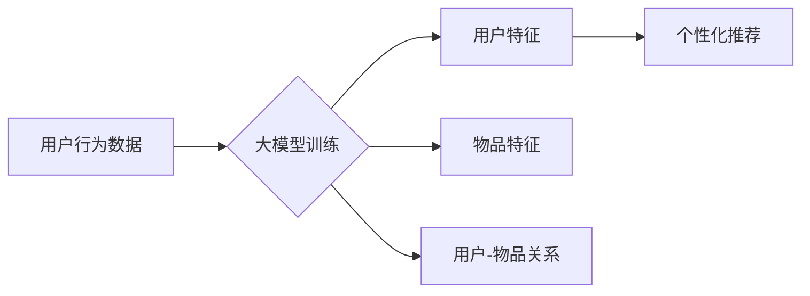

                 

## 大模型在推荐系统中的应用：潜力与挑战

> 关键词：大模型、推荐系统、深度学习、Transformer、个性化推荐、冷启动问题、数据隐私

## 1. 背景介绍

推荐系统作为互联网时代的重要组成部分，旨在根据用户的历史行为、偏好和上下文信息，预测用户可能感兴趣的内容，并将其推荐给用户。传统的推荐系统主要依赖于协同过滤、内容过滤和基于规则的方法，但这些方法在面对海量数据和用户多样化需求时，往往表现力不足。

近年来，深度学习技术的快速发展为推荐系统带来了新的机遇。大模型，作为深度学习领域的重要突破，凭借其强大的学习能力和泛化能力，在推荐系统领域展现出巨大的潜力。大模型能够学习到更复杂的用户行为模式和内容特征，从而提供更精准、个性化的推荐结果。

## 2. 核心概念与联系

### 2.1 大模型

大模型是指参数规模庞大、训练数据海量、计算资源消耗巨大的深度学习模型。与传统深度学习模型相比，大模型拥有更强的表达能力和泛化能力，能够学习到更复杂的模式和关系。

### 2.2 推荐系统

推荐系统是根据用户的历史行为、偏好和上下文信息，预测用户可能感兴趣的内容，并将其推荐给用户的技术系统。推荐系统广泛应用于电商、社交媒体、视频平台等领域，帮助用户发现感兴趣的内容，提高用户体验。

### 2.3 核心联系

大模型在推荐系统中发挥着关键作用，主要体现在以下几个方面：

* **特征学习:** 大模型能够学习到更丰富的用户和物品特征，例如用户的兴趣爱好、购买历史、浏览记录，以及物品的类别、属性、描述等。
* **关系建模:** 大模型能够学习到用户和物品之间的复杂关系，例如用户对特定类别的物品的偏好、物品之间的相似度等。
* **个性化推荐:** 基于学习到的用户和物品特征以及关系，大模型能够为每个用户提供个性化的推荐结果。

**Mermaid 流程图**



## 3. 核心算法原理 & 具体操作步骤

### 3.1 算法原理概述

大模型在推荐系统中的应用主要基于深度学习算法，其中Transformer模型由于其强大的序列建模能力，在推荐系统领域得到了广泛应用。Transformer模型通过自注意力机制学习用户和物品之间的关系，并通过多头注意力机制捕捉不同层次的特征信息，从而实现更精准的推荐。

### 3.2 算法步骤详解

1. **数据预处理:** 收集用户行为数据，例如点击、浏览、购买等行为，并进行清洗、转换和编码。
2. **模型构建:** 根据具体任务需求，选择合适的Transformer模型架构，例如BERT、GPT、T5等。
3. **模型训练:** 使用预处理后的数据训练Transformer模型，通过反向传播算法优化模型参数。
4. **模型评估:** 使用测试数据评估模型性能，常用的指标包括准确率、召回率、NDCG等。
5. **模型部署:** 将训练好的模型部署到线上环境，并进行实时推荐。

### 3.3 算法优缺点

**优点:**

* **强大的学习能力:** Transformer模型能够学习到更复杂的模式和关系，从而实现更精准的推荐。
* **高效的序列建模:** 自注意力机制能够有效地捕捉用户和物品之间的关系，并处理长序列数据。
* **可解释性:** 通过分析注意力权重，可以了解模型对哪些特征更加关注，从而提高模型的可解释性。

**缺点:**

* **计算资源消耗大:** 训练大模型需要大量的计算资源和时间。
* **数据依赖性强:** 模型性能受训练数据质量和规模影响较大。
* **冷启动问题:** 对新用户和新物品的推荐效果可能较差。

### 3.4 算法应用领域

Transformer模型在推荐系统领域有着广泛的应用，例如：

* **电商推荐:** 推荐商品、优惠券、促销活动等。
* **社交媒体推荐:** 推荐好友、话题、文章等。
* **视频平台推荐:** 推荐视频、直播、用户等。
* **音乐平台推荐:** 推荐歌曲、专辑、艺术家等。

## 4. 数学模型和公式 & 详细讲解 & 举例说明

### 4.1 数学模型构建

Transformer模型的核心是自注意力机制，其数学模型可以表示为：

$$
Attention(Q, K, V) = softmax(\frac{QK^T}{\sqrt{d_k}})V
$$

其中：

* $Q$：查询矩阵
* $K$：键矩阵
* $V$：值矩阵
* $d_k$：键向量的维度
* $softmax$：softmax函数

### 4.2 公式推导过程

自注意力机制的目的是计算查询向量与键向量的相似度，并根据相似度对值向量进行加权求和。

1. 计算查询向量与键向量的点积，并进行归一化处理。
2. 使用softmax函数将点积结果转换为概率分布。
3. 将概率分布与值向量进行加权求和，得到最终的注意力输出。

### 4.3 案例分析与讲解

假设我们有一个用户行为数据，包含用户的点击记录和物品的类别信息。我们可以使用Transformer模型学习用户对不同类别的物品的偏好，并根据用户的历史行为预测用户可能感兴趣的物品类别。

在训练过程中，我们可以将用户的点击记录作为查询向量，物品的类别信息作为键向量和值向量。通过自注意力机制，模型可以学习到用户对不同类别的物品的偏好程度，并根据用户的历史行为预测用户可能感兴趣的物品类别。

## 5. 项目实践：代码实例和详细解释说明

### 5.1 开发环境搭建

* Python 3.7+
* PyTorch 1.7+
* CUDA 10.2+
* 其他依赖库：transformers, numpy, pandas等

### 5.2 源代码详细实现

```python
import torch
from transformers import BertModel, BertTokenizer

# 加载预训练模型和词典
model_name = "bert-base-uncased"
tokenizer = BertTokenizer.from_pretrained(model_name)
model = BertModel.from_pretrained(model_name)

# 预处理数据
def preprocess_data(text):
    inputs = tokenizer(text, return_tensors="pt")
    return inputs

# 模型推理
def predict(text):
    inputs = preprocess_data(text)
    outputs = model(**inputs)
    return outputs.last_hidden_state

# 运行示例
text = "我想要买一部手机"
outputs = predict(text)
print(outputs.shape)
```

### 5.3 代码解读与分析

* 代码首先加载预训练的BERT模型和词典。
* 然后定义一个预处理函数，将文本转换为模型输入格式。
* 模型推理函数使用预处理后的文本作为输入，并返回模型的输出结果。
* 最后，代码演示了如何使用模型预测文本的语义表示。

### 5.4 运行结果展示

运行代码后，会输出模型输出结果的形状，例如：

```
torch.Size([1, 128, 768])
```

这表示模型输出的语义表示是一个三维张量，其中第一维表示批次大小，第二维表示序列长度，第三维表示词向量的维度。

## 6. 实际应用场景

### 6.1 电商推荐

大模型在电商推荐系统中可以实现个性化商品推荐、跨界商品推荐、新品推荐等功能，提升用户购物体验和转化率。例如，阿里巴巴的淘宝平台使用大模型进行商品推荐，能够根据用户的浏览历史、购买记录、兴趣标签等信息，推荐用户可能感兴趣的商品。

### 6.2 内容推荐

大模型可以用于推荐新闻、文章、视频、音乐等内容，帮助用户发现感兴趣的内容，提高用户粘性和活跃度。例如，腾讯的微信平台使用大模型进行内容推荐，能够根据用户的阅读习惯、关注公众号、朋友圈互动等信息，推荐用户可能感兴趣的内容。

### 6.3 社交推荐

大模型可以用于推荐好友、群组、话题等社交内容，帮助用户拓展社交圈，提高用户互动和参与度。例如，Facebook使用大模型进行社交推荐，能够根据用户的兴趣爱好、好友关系、社交行为等信息，推荐用户可能感兴趣的朋友和群组。

### 6.4 未来应用展望

大模型在推荐系统领域的应用前景广阔，未来可能在以下方面得到进一步发展：

* **更精准的个性化推荐:** 通过更深入地学习用户行为和偏好，实现更精准的个性化推荐。
* **跨模态推荐:** 将文本、图像、音频等多种模态信息融合，实现更丰富的推荐体验。
* **实时推荐:** 利用大模型的实时推理能力，实现更及时、更精准的推荐。
* **可解释性增强:** 通过改进模型结构和训练方法，提高模型的可解释性，帮助用户理解推荐结果背后的逻辑。

## 7. 工具和资源推荐

### 7.1 学习资源推荐

* **书籍:**
    * Deep Learning by Ian Goodfellow, Yoshua Bengio, and Aaron Courville
    * Natural Language Processing with PyTorch by Yoav Goldberg
* **在线课程:**
    * Stanford CS224N: Natural Language Processing with Deep Learning
    * DeepLearning.AI: TensorFlow Specialization

### 7.2 开发工具推荐

* **框架:** PyTorch, TensorFlow
* **库:** transformers, numpy, pandas
* **平台:** Google Colab, AWS SageMaker

### 7.3 相关论文推荐

* Attention Is All You Need (Vaswani et al., 2017)
* BERT: Pre-training of Deep Bidirectional Transformers for Language Understanding (Devlin et al., 2018)
* T5: Text-to-Text Transfer Transformer (Raffel et al., 2019)

## 8. 总结：未来发展趋势与挑战

### 8.1 研究成果总结

大模型在推荐系统领域取得了显著的成果，能够实现更精准、个性化的推荐，提升用户体验和商业价值。

### 8.2 未来发展趋势

未来，大模型在推荐系统领域将朝着以下方向发展：

* **模型规模和能力提升:** 随着计算资源的不断发展，大模型的规模和能力将进一步提升，能够学习到更复杂的模式和关系。
* **多模态融合:** 大模型将融合文本、图像、音频等多种模态信息，实现更丰富的推荐体验。
* **个性化程度提升:** 大模型将更加深入地学习用户的行为和偏好，实现更精准的个性化推荐。
* **可解释性增强:** 研究者将致力于提高大模型的可解释性，帮助用户理解推荐结果背后的逻辑。

### 8.3 面临的挑战

大模型在推荐系统领域也面临一些挑战：

* **数据隐私:** 大模型的训练需要大量用户数据，如何保护用户隐私是一个重要问题。
* **计算资源消耗:** 训练大模型需要大量的计算资源，成本较高。
* **冷启动问题:** 对新用户和新物品的推荐效果可能较差。
* **模型可解释性:** 大模型的决策过程较为复杂，难以解释，这可能会影响用户信任。

### 8.4 研究展望

未来，研究者将继续探索大模型在推荐系统领域的应用，并致力于解决上述挑战，推动推荐系统技术的发展。


## 9. 附录：常见问题与解答

**Q1: 大模型的训练需要多少数据？**

A1: 大模型的训练数据量通常非常庞大，通常需要数百万甚至数十亿条数据。

**Q2: 如何评估大模型的推荐效果？**

A2: 常用的评估指标包括准确率、召回率、NDCG等。

**Q3: 如何解决大模型的冷启动问题？**

A3: 可以使用一些冷启动策略，例如基于内容过滤、基于协同过滤、基于知识图谱等。

**Q4: 如何提高大模型的可解释性？**

A4: 可以使用一些可解释性分析方法，例如注意力机制分析、特征重要性分析等。


作者：禅与计算机程序设计艺术 / Zen and the Art of Computer Programming 
<end_of_turn>

