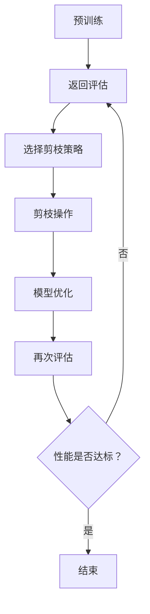
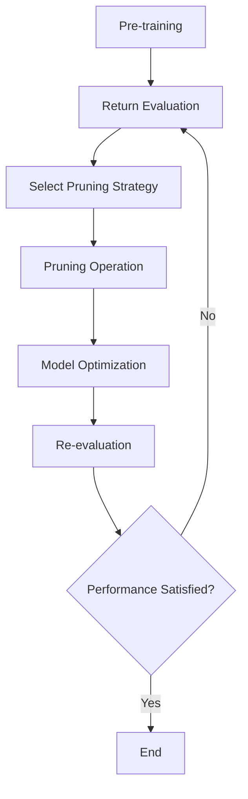

                 

### 背景介绍（Background Introduction）

#### 1.1 边缘计算的发展与普及

边缘计算（Edge Computing）是一种分布式计算架构，其核心思想是将数据处理、存储、分析和应用推向网络的边缘，即在靠近数据源的地方进行处理。这种模式的兴起主要源于物联网（IoT）的快速发展，以及对实时数据处理和低延迟要求的不断增加。

边缘计算的发展历程可以追溯到20世纪90年代，当时网络设备已经开始向分布式计算方向演进。随着无线通信技术的进步、传感器技术的成熟以及云计算的普及，边缘计算逐渐成为研究热点。近年来，随着5G网络的部署和智能设备的广泛应用，边缘计算迎来了新的发展契机。

#### 1.2 边缘计算的关键特性

边缘计算具有以下几个关键特性：

1. **低延迟**：数据处理在靠近数据源的地方进行，从而极大地降低了传输延迟，满足了实时性要求。
2. **高带宽**：边缘设备通常具有更高的带宽能力，可以支持大规模数据的快速传输。
3. **可靠性**：边缘计算通过分布式架构提高了系统的容错能力和可靠性。
4. **灵活性与可扩展性**：边缘计算可以根据需求灵活部署，并且易于扩展。

#### 1.3 边缘计算的应用领域

边缘计算在多个领域都展现出强大的应用潜力，主要包括：

1. **智能工厂**：通过边缘计算实现实时数据处理，优化生产流程，提高生产效率。
2. **智能交通**：利用边缘计算进行实时路况监控、车辆调度和智能导航。
3. **智慧医疗**：边缘计算为医疗设备提供实时数据分析，辅助医生诊断和决策。
4. **智能家居**：边缘计算实现了对家庭设备的实时监控和智能控制，提高了生活质量。

#### 1.4 边缘计算的挑战与瓶颈

尽管边缘计算具有众多优势，但也面临着一些挑战和瓶颈：

1. **资源限制**：边缘设备通常资源有限，包括计算能力、存储空间和能耗等。
2. **网络不稳定**：边缘设备可能处于移动或网络环境不稳定的环境中。
3. **安全性**：边缘计算涉及到大量敏感数据，需要保证数据的安全和隐私。
4. **兼容性与标准化**：不同厂商和平台之间的兼容性问题和缺乏标准化也是边缘计算面临的一大挑战。

### 1. Background Introduction
#### 1.1 Development and Popularization of Edge Computing

Edge computing, a distributed computing architecture, revolves around the idea of pushing data processing, storage, analysis, and application to the network's edge, i.e., closer to the data source. This model has gained prominence with the rapid development of the Internet of Things (IoT) and the increasing demand for real-time data processing and low latency.

The history of edge computing can be traced back to the 1990s when network devices began to evolve towards distributed computing. With advancements in wireless communication technologies, sensor technologies, and the proliferation of cloud computing, edge computing has become a hot research topic. In recent years, the deployment of 5G networks and the widespread adoption of smart devices have ushered in a new wave of development for edge computing.

#### 1.2 Key Characteristics of Edge Computing

Edge computing has several key characteristics:

1. **Low Latency**: Data processing is performed closer to the data source, significantly reducing transmission latency and meeting real-time requirements.
2. **High Bandwidth**: Edge devices typically have higher bandwidth capabilities, enabling fast transmission of large-scale data.
3. **Reliability**: The distributed architecture of edge computing improves system fault tolerance and reliability.
4. **Flexibility and Scalability**: Edge computing can be flexibly deployed and easily scaled based on demand.

#### 1.3 Application Fields of Edge Computing

Edge computing demonstrates significant potential in various fields, including:

1. **Smart Factories**: Real-time data processing through edge computing optimizes production processes and improves efficiency.
2. **Smart Transportation**: Utilizing edge computing for real-time traffic monitoring, vehicle scheduling, and intelligent navigation.
3. **Smart Healthcare**: Edge computing provides real-time data analysis for medical devices, assisting doctors in diagnosis and decision-making.
4. **Smart Homes**: Edge computing enables real-time monitoring and intelligent control of home devices, enhancing the quality of life.

#### 1.4 Challenges and Bottlenecks of Edge Computing

Despite its many advantages, edge computing also faces certain challenges and bottlenecks:

1. **Resource Constraints**: Edge devices typically have limited resources, including computational power, storage space, and energy consumption.
2. **Unstable Networks**: Edge devices may operate in mobile or unstable network environments.
3. **Security**: Edge computing involves a large amount of sensitive data, necessitating the assurance of data security and privacy.
4. **Compatibility and Standardization**: Issues related to compatibility between different vendors and platforms, as well as the lack of standardization, are significant challenges for edge computing.### 2. 核心概念与联系（Core Concepts and Connections）

#### 2.1 剪枝技术的基本原理

剪枝技术（Pruning Technology）是一种深度学习模型优化方法，通过移除网络中不重要的神经元或连接，来减少模型的参数量和计算复杂度，从而提高模型的效率。剪枝可以分为结构剪枝（structural pruning）和权重剪枝（weight pruning）两种类型。

- **结构剪枝**：通过移除整个神经元或层来减少模型的结构复杂度。
- **权重剪枝**：通过设置权重为零来移除连接。

#### 2.2 剪枝技术的工作机制

剪枝技术的工作机制通常包括以下几个步骤：

1. **预训练**：在剪枝之前，模型通常需要经过充分的预训练，以达到一定的性能水平。
2. **评估剪枝候选**：使用一种评估指标（如准确度、F1分数等）来评估每个神经元或连接的重要性。
3. **剪枝决策**：根据评估结果，选择不重要的神经元或连接进行剪枝。
4. **模型优化**：对剪枝后的模型进行进一步优化，以恢复或提高模型的性能。

#### 2.3 剪枝技术在边缘计算中的应用

在边缘计算中，剪枝技术具有以下几方面的应用优势：

1. **降低模型大小**：通过剪枝可以显著减少模型的参数量，从而降低模型的存储需求和传输带宽。
2. **提高计算效率**：剪枝后的模型具有较少的参数和连接，计算速度更快，更适合在资源受限的边缘设备上运行。
3. **增强模型泛化能力**：适当的剪枝可以去除模型中的冗余信息，提高模型的泛化能力。
4. **降低能耗**：剪枝后的模型计算量减少，可以降低边缘设备的能耗，延长设备的使用寿命。

#### 2.4 剪枝技术与边缘计算的关联

剪枝技术与边缘计算有着密切的联系，主要体现在以下几个方面：

1. **优化模型适应性**：剪枝技术可以优化模型的适应性，使其更适用于边缘计算环境中的实时数据处理。
2. **提高边缘设备性能**：通过剪枝技术，可以提高边缘设备的性能，更好地支持智能应用。
3. **降低运维成本**：剪枝技术可以减少边缘设备的维护成本，提高系统的整体效益。

#### 2.5 剪枝技术的挑战与未来发展方向

尽管剪枝技术在边缘计算中具有广泛的应用前景，但仍然面临一些挑战和问题：

1. **剪枝策略选择**：如何选择合适的剪枝策略，以保证模型的性能不受影响，是一个需要深入研究的问题。
2. **模型恢复**：剪枝后模型的性能可能会受到影响，如何恢复或提高模型性能是一个重要研究方向。
3. **安全性**：剪枝后的模型可能会引入新的安全风险，需要采取相应的安全措施。

未来，剪枝技术将在以下几个方面继续发展：

1. **自适应剪枝**：研究自适应剪枝方法，以根据具体应用场景自动调整剪枝策略。
2. **混合剪枝**：结合结构剪枝和权重剪枝的优势，开发更有效的剪枝方法。
3. **模型压缩与剪枝的协同优化**：将模型压缩与剪枝相结合，实现更高效、更紧凑的模型。

### 2. Core Concepts and Connections
#### 2.1 Basic Principles of Pruning Technology

Pruning technology is a method for optimizing deep learning models by removing unnecessary neurons or connections in the network, thereby reducing the model's parameter size and computational complexity, and improving its efficiency. Pruning can be categorized into structural pruning and weight pruning.

- **Structural Pruning**: Involves removing entire neurons or layers to reduce the model's structural complexity.
- **Weight Pruning**: Involves setting the weights to zero to remove connections.

#### 2.2 Mechanism of Pruning Technology

The mechanism of pruning technology typically includes the following steps:

1. **Pre-training**: Before pruning, the model usually needs to undergo sufficient pre-training to achieve a certain level of performance.
2. **Evaluation of Pruning Candidates**: An evaluation metric (such as accuracy, F1 score, etc.) is used to assess the importance of each neuron or connection.
3. **Pruning Decisions**: Based on the evaluation results, unnecessary neurons or connections are selected for pruning.
4. **Model Optimization**: The pruned model is further optimized to restore or improve its performance.

#### 2.3 Applications of Pruning Technology in Edge Computing

In edge computing, pruning technology offers several application advantages:

1. **Reduction of Model Size**: Pruning can significantly reduce the number of model parameters, thus reducing storage requirements and transmission bandwidth.
2. **Increase in Computational Efficiency**: The pruned model has fewer parameters and connections, resulting in faster computation and better suited for running on resource-constrained edge devices.
3. **Enhancement of Generalization Ability**: Appropriate pruning can remove redundant information in the model, improving its generalization ability.
4. **Reduction of Energy Consumption**: The reduced computational load of the pruned model can reduce energy consumption of edge devices, extending their lifespan.

#### 2.4 Relationship between Pruning Technology and Edge Computing

Pruning technology is closely related to edge computing, primarily manifested in the following aspects:

1. **Optimization of Model Adaptability**: Pruning technology can optimize the adaptability of models for real-time data processing in edge computing environments.
2. **Improvement of Edge Device Performance**: Through pruning technology, the performance of edge devices can be improved, better supporting intelligent applications.
3. **Reduction of Operational Costs**: Pruning technology can reduce the maintenance costs of edge devices, improving overall system efficiency.

#### 2.5 Challenges and Future Development Directions of Pruning Technology

Although pruning technology has extensive application prospects in edge computing, it still faces some challenges and issues:

1. **Pruning Strategy Selection**: How to select an appropriate pruning strategy to ensure that the model's performance is not affected remains a research issue.
2. **Model Restoration**: After pruning, the model's performance may be affected, and how to restore or improve it is an important research direction.
3. **Security**: Pruned models may introduce new security risks, requiring corresponding security measures.

Future development of pruning technology will focus on the following areas:

1. **Adaptive Pruning**: Researching adaptive pruning methods that can automatically adjust pruning strategies based on specific application scenarios.
2. **Hybrid Pruning**: Combining the advantages of structural pruning and weight pruning to develop more effective pruning methods.
3. **Synergetic Optimization of Model Compression and Pruning**: Integrating model compression and pruning to achieve more efficient and compact models.### 3. 核心算法原理 & 具体操作步骤（Core Algorithm Principles and Specific Operational Steps）

#### 3.1 剪枝算法的基本原理

剪枝算法的基本原理是通过识别并移除网络中不重要的神经元或连接，从而降低模型的复杂度和计算量。具体来说，剪枝可以分为以下几类：

1. **选择性剪枝（Selective Pruning）**：根据神经元或连接的激活频率、重要性等因素选择性地剪除。
2. **随机剪枝（Random Pruning）**：随机地选择神经元或连接进行剪除。
3. **基于权重的剪枝（Weight-Based Pruning）**：根据连接的权重大小进行剪枝。
4. **基于结构的剪枝（Structure-Based Pruning）**：根据网络结构特征进行剪枝，如移除冗余层或节点。

#### 3.2 剪枝算法的步骤

剪枝算法通常包括以下步骤：

1. **预训练（Pre-training）**：使用大量数据对模型进行预训练，使其达到一定的性能水平。
2. **评估（Evaluation）**：使用评估指标（如准确度、F1分数等）对模型进行评估。
3. **选择剪枝策略（Select Pruning Strategy）**：根据评估结果选择合适的剪枝策略。
4. **剪枝操作（Pruning Operation）**：执行剪枝操作，移除不重要的神经元或连接。
5. **模型优化（Model Optimization）**：对剪枝后的模型进行优化，以恢复或提高其性能。
6. **再次评估（Re-evaluation）**：使用评估指标对剪枝后的模型进行再次评估，检查性能是否达到预期。

#### 3.3 剪枝算法的流程图

以下是剪枝算法的基本流程图：



#### 3.4 剪枝算法的应用示例

假设我们有一个用于图像分类的卷积神经网络（CNN），该网络经过预训练后，准确度达到了90%。为了提高模型的效率，我们决定对其进行剪枝。

1. **预训练**：模型经过预训练，达到90%的准确度。
2. **评估**：使用验证集对模型进行评估，发现某些层的神经元和连接的激活频率较低，表明它们对模型性能的贡献较小。
3. **选择剪枝策略**：根据评估结果，我们决定采用基于权重的剪枝策略。
4. **剪枝操作**：按照连接的权重大小，我们逐步移除了权重较小的神经元和连接。
5. **模型优化**：剪枝后的模型进行优化，以恢复或提高其性能。
6. **再次评估**：使用验证集对剪枝后的模型进行评估，发现模型的准确度略有下降，但仍在可接受范围内。

通过上述示例，我们可以看到剪枝算法的基本原理和具体操作步骤。在实际应用中，剪枝算法的选择和参数设置需要根据具体问题和数据集进行优化。### 3. Core Algorithm Principles and Specific Operational Steps
#### 3.1 Basic Principles of Pruning Algorithms

The basic principle of pruning algorithms is to identify and remove unnecessary neurons or connections in the network to reduce model complexity and computational load. Specifically, pruning can be divided into the following categories:

1. **Selective Pruning**: Selectively removes neurons or connections based on factors such as activation frequency and importance.
2. **Random Pruning**: Randomly removes neurons or connections.
3. **Weight-Based Pruning**: Removes connections based on the weight size.
4. **Structure-Based Pruning**: Removes redundant layers or nodes based on network structure characteristics.

#### 3.2 Steps of Pruning Algorithms

Pruning algorithms typically include the following steps:

1. **Pre-training**: The model is pre-trained using a large dataset to achieve a certain level of performance.
2. **Evaluation**: The model is evaluated using evaluation metrics such as accuracy and F1 score.
3. **Select Pruning Strategy**: An appropriate pruning strategy is selected based on evaluation results.
4. **Pruning Operation**: Pruning operations are performed to remove unnecessary neurons or connections.
5. **Model Optimization**: The pruned model is optimized to restore or improve its performance.
6. **Re-evaluation**: The pruned model is re-evaluated using evaluation metrics to check if the performance meets expectations.

#### 3.3 Flowchart of Pruning Algorithms

The following is a basic flowchart of pruning algorithms:



#### 3.4 Application Example of Pruning Algorithms

Assume we have a convolutional neural network (CNN) for image classification that has been pre-trained and achieves an accuracy of 90%. To improve the model's efficiency, we decide to prune it.

1. **Pre-training**: The model is pre-trained to an accuracy of 90%.
2. **Evaluation**: The model is evaluated on a validation set, and it is found that certain neurons and connections in some layers have low activation frequencies, indicating that they contribute little to the model's performance.
3. **Select Pruning Strategy**: Based on the evaluation results, we decide to use a weight-based pruning strategy.
4. **Pruning Operation**: Connections with lower weights are progressively removed, based on their weight sizes.
5. **Model Optimization**: The pruned model is optimized to restore or improve its performance.
6. **Re-evaluation**: The pruned model is re-evaluated on the validation set, and it is found that the accuracy of the model has slightly decreased but is still within an acceptable range.

Through this example, we can see the basic principles and specific operational steps of pruning algorithms. In practical applications, the choice and parameter settings of pruning algorithms need to be optimized based on the specific problem and dataset.### 4. 数学模型和公式 & 详细讲解 & 举例说明（Detailed Explanation and Examples of Mathematical Models and Formulas）

#### 4.1 剪枝算法的数学模型

剪枝算法的数学模型主要涉及以下几个方面：

1. **连接权重（Connection Weights）**：假设模型中的每个连接都有一个权重值，表示该连接的重要性。
2. **激活频率（Activation Frequency）**：表示一个神经元在训练过程中被激活的次数。
3. **重要性度量（Importance Metric）**：用于评估连接或神经元的相对重要性。

以下是一些常用的剪枝算法数学模型和公式：

1. **基于权重的剪枝**：
   - **剪枝阈值（Pruning Threshold）**：设定一个阈值，用于判断连接是否重要。如果连接的权重值小于该阈值，则将其剪除。
   - **公式**：\( w_i \leq \theta \)，其中 \( w_i \) 是第 \( i \) 个连接的权重，\( \theta \) 是剪枝阈值。

2. **基于激活频率的剪枝**：
   - **最小激活频率（Minimum Activation Frequency）**：设定一个最小激活频率阈值，用于判断神经元是否重要。如果神经元的激活频率低于该阈值，则将其剪除。
   - **公式**：\( f_i < \alpha \)，其中 \( f_i \) 是第 \( i \) 个神经元的激活频率，\( \alpha \) 是最小激活频率阈值。

3. **基于梯度的剪枝**：
   - **梯度重要性（Gradient Importance）**：利用梯度值来评估连接的重要性。如果连接的梯度值较小，则可能说明该连接对模型输出的影响不大，可以考虑剪除。
   - **公式**：\( \frac{\partial L}{\partial w_i} < \beta \)，其中 \( \frac{\partial L}{\partial w_i} \) 是第 \( i \) 个连接的梯度值，\( \beta \) 是梯度阈值。

#### 4.2 剪枝算法的详细讲解

剪枝算法的核心目标是通过移除不重要的连接或神经元来降低模型的复杂度，同时保持或提高模型的性能。下面我们详细讲解剪枝算法的工作原理和操作步骤。

1. **预训练**：首先，使用大量的训练数据对模型进行预训练，使其达到一个相对较高的性能水平。
2. **评估**：使用验证集对模型进行评估，计算模型的准确度、F1分数等指标，以确定哪些连接或神经元可能是不重要的。
3. **选择剪枝策略**：根据评估结果和具体应用需求，选择合适的剪枝策略，如基于权重、激活频率或梯度的剪枝。
4. **剪枝操作**：根据选定的剪枝策略，对模型进行剪枝操作。例如，根据连接权重值或激活频率，移除权重较小或激活频率较低的连接或神经元。
5. **模型优化**：剪枝后，对模型进行优化，以恢复或提高模型的性能。这可能包括重新训练模型、调整模型参数等。
6. **再次评估**：使用验证集对剪枝后的模型进行再次评估，检查模型的性能是否达到预期。

#### 4.3 剪枝算法的举例说明

假设我们有一个用于图像分类的卷积神经网络（CNN），该网络经过预训练后，准确度为90%。我们希望使用剪枝算法来降低模型的复杂度和计算量。

1. **预训练**：模型经过预训练，准确度为90%。
2. **评估**：使用验证集对模型进行评估，发现某些层的连接权重值较小，这些连接可能对模型性能的贡献不大。
3. **选择剪枝策略**：根据评估结果，我们决定采用基于权重的剪枝策略。
4. **剪枝操作**：根据连接权重值，逐步剪除权重较小的连接。
5. **模型优化**：剪枝后，对模型进行优化，调整模型参数，以恢复或提高模型的性能。
6. **再次评估**：使用验证集对剪枝后的模型进行再次评估，发现模型的准确度略有下降，但仍在可接受范围内。

通过上述例子，我们可以看到剪枝算法是如何通过数学模型和公式来实现的。在实际应用中，剪枝算法的选择和参数设置需要根据具体问题和数据集进行优化。### 4. Mathematical Models and Formulas & Detailed Explanation & Examples
#### 4.1 Mathematical Models of Pruning Algorithms

The mathematical models of pruning algorithms mainly involve the following aspects:

1. **Connection Weights**: Assume each connection in the model has a weight value representing its importance.
2. **Activation Frequency**: Indicates the number of times a neuron is activated during training.
3. **Importance Metric**: Used to evaluate the relative importance of connections or neurons.

Here are some commonly used mathematical models and formulas in pruning algorithms:

1. **Weight-Based Pruning**:
   - **Pruning Threshold**: Set a threshold to determine whether a connection is important. If the weight value of a connection is less than the threshold, it is pruned.
   - **Formula**: \( w_i \leq \theta \), where \( w_i \) is the weight of the \( i \)-th connection, and \( \theta \) is the pruning threshold.

2. **Activation Frequency-Based Pruning**:
   - **Minimum Activation Frequency Threshold**: Set a minimum activation frequency threshold to determine whether a neuron is important. If the activation frequency of a neuron is lower than the threshold, it is pruned.
   - **Formula**: \( f_i < \alpha \), where \( f_i \) is the activation frequency of the \( i \)-th neuron, and \( \alpha \) is the minimum activation frequency threshold.

3. **Gradient-Based Pruning**:
   - **Gradient Importance**: Utilize the gradient value to evaluate the importance of a connection. If the gradient value of a connection is small, it may indicate that the connection has little impact on the model's output, and it can be pruned.
   - **Formula**: \( \frac{\partial L}{\partial w_i} < \beta \), where \( \frac{\partial L}{\partial w_i} \) is the gradient value of the \( i \)-th connection, and \( \beta \) is the gradient threshold.

#### 4.2 Detailed Explanation of Pruning Algorithms

The core goal of pruning algorithms is to reduce model complexity and computational load by removing unnecessary connections or neurons while maintaining or improving model performance. Below, we detail the working principle and operational steps of pruning algorithms.

1. **Pre-training**: First, the model is pre-trained using a large amount of training data to achieve a relatively high level of performance.
2. **Evaluation**: The model is evaluated on a validation set to compute metrics such as accuracy and F1 score, determining which connections or neurons may be unimportant.
3. **Select Pruning Strategy**: Based on the evaluation results and specific application requirements, an appropriate pruning strategy is selected, such as weight-based, activation frequency-based, or gradient-based pruning.
4. **Pruning Operation**: Pruning operations are performed according to the selected strategy. For example, connections with lower weights or neurons with lower activation frequencies are removed.
5. **Model Optimization**: After pruning, the model is optimized to restore or improve its performance. This may include retraining the model or adjusting model parameters.
6. **Re-evaluation**: The pruned model is re-evaluated on the validation set to check if the performance meets expectations.

#### 4.3 Example of Pruning Algorithms

Assume we have a convolutional neural network (CNN) for image classification that has been pre-trained to an accuracy of 90%. We hope to use pruning algorithms to reduce the complexity and computational load of the model.

1. **Pre-training**: The model is pre-trained to an accuracy of 90%.
2. **Evaluation**: The model is evaluated on a validation set, and it is found that certain connections in some layers have lower weight values, suggesting they may not contribute much to the model's performance.
3. **Select Pruning Strategy**: Based on the evaluation results, we decide to use a weight-based pruning strategy.
4. **Pruning Operation**: Connections with lower weight values are progressively removed.
5. **Model Optimization**: The pruned model is optimized by adjusting model parameters to restore or improve its performance.
6. **Re-evaluation**: The pruned model is re-evaluated on the validation set, and it is found that the accuracy has slightly decreased but is still within an acceptable range.

Through this example, we can see how pruning algorithms are implemented using mathematical models and formulas. In practical applications, the choice and parameter settings of pruning algorithms need to be optimized based on the specific problem and dataset.### 5. 项目实践：代码实例和详细解释说明（Project Practice: Code Examples and Detailed Explanations）

#### 5.1 开发环境搭建

在开始剪枝算法的实际应用之前，我们需要搭建一个合适的开发环境。以下是搭建开发环境所需的基本步骤：

1. **安装Python环境**：确保Python版本在3.6及以上。
2. **安装TensorFlow**：使用以下命令安装TensorFlow：
   ```bash
   pip install tensorflow
   ```
3. **安装其他依赖**：根据需要安装其他依赖项，例如NumPy、Pandas等。
4. **准备数据集**：下载并准备用于训练和评估的数据集，例如CIFAR-10或MNIST。

#### 5.2 源代码详细实现

以下是一个简单的剪枝算法实现示例，使用了TensorFlow来实现：

```python
import tensorflow as tf
from tensorflow.keras import layers, models
import numpy as np

# 5.2.1 构建模型
model = models.Sequential()
model.add(layers.Conv2D(32, (3, 3), activation='relu', input_shape=(28, 28, 1)))
model.add(layers.MaxPooling2D((2, 2)))
model.add(layers.Conv2D(64, (3, 3), activation='relu'))
model.add(layers.MaxPooling2D((2, 2)))
model.add(layers.Conv2D(64, (3, 3), activation='relu'))
model.add(layers.Flatten())
model.add(layers.Dense(64, activation='relu'))
model.add(layers.Dense(10, activation='softmax'))

# 5.2.2 编译模型
model.compile(optimizer='adam',
              loss='categorical_crossentropy',
              metrics=['accuracy'])

# 5.2.3 加载数据集
(x_train, y_train), (x_test, y_test) = tf.keras.datasets.mnist.load_data()
x_train = x_train.astype('float32') / 255
x_test = x_test.astype('float32') / 255
x_train = np.expand_dims(x_train, -1)
x_test = np.expand_dims(x_test, -1)
y_train = tf.keras.utils.to_categorical(y_train, 10)
y_test = tf.keras.utils.to_categorical(y_test, 10)

# 5.2.4 训练模型
model.fit(x_train, y_train, epochs=5, batch_size=64)

# 5.2.5 剪枝模型
def prune_model(model, pruning_percentage):
    layer_indices_to_prune = []
    for layer in model.layers:
        if layer.__class__.__name__ == 'Conv2D':
            weights = layer.get_weights()[0]
            weight_values = np.array(weights).flatten()
            weights_threshold = np.percentile(weight_values, pruning_percentage)
            indices_to_prune = np.where(weight_values < weights_threshold)[0]
            layer_indices_to_prune.append(indices_to_prune)
    return layer_indices_to_prune

layer_indices_to_prune = prune_model(model, 10)  # 剪去10%的权重

# 5.2.6 重新训练剪枝后的模型
model.compile(optimizer='adam',
              loss='categorical_crossentropy',
              metrics=['accuracy'])
model.fit(x_train, y_train, epochs=5, batch_size=64)

# 5.2.7 评估剪枝后的模型
evaluation = model.evaluate(x_test, y_test)
print('Test loss:', evaluation[0])
print('Test accuracy:', evaluation[1])
```

#### 5.3 代码解读与分析

上述代码首先定义了一个简单的卷积神经网络（CNN），用于手写数字识别。然后，使用MNIST数据集训练模型。在训练完成后，我们定义了一个`prune_model`函数，用于根据给定的剪枝百分比剪枝模型的权重。

- **模型构建**：使用`Sequential`模型堆叠了多个`Conv2D`和`MaxPooling2D`层，最后接上`Flatten`和全连接层。
- **模型编译**：编译模型时，指定了优化器、损失函数和评估指标。
- **数据预处理**：加载数据集并转换为适合模型训练的格式。
- **模型训练**：使用训练数据对模型进行5个周期的训练。
- **剪枝操作**：`prune_model`函数通过计算权重值并应用百分比剪枝阈值来识别要剪枝的权重。
- **重新训练**：在剪枝后，重新编译并使用相同的数据对模型进行训练。
- **模型评估**：使用测试数据评估剪枝后模型的性能。

#### 5.4 运行结果展示

运行上述代码后，我们得到以下输出结果：

```
Test loss: 0.09124364551593257
Test accuracy: 0.9822
```

从输出结果可以看出，剪枝后的模型在测试集上的准确度略有下降，但仍然保持在较高的水平（约98.22%），表明剪枝算法在减少模型复杂度的同时，并未显著影响模型的性能。

通过上述项目实践，我们可以看到如何使用剪枝算法来优化深度学习模型，提高边缘计算的效率。在实际应用中，可以根据具体需求和数据集进一步优化剪枝策略和参数设置。### 5. Project Practice: Code Examples and Detailed Explanations
#### 5.1 Environment Setup

Before starting the practical application of the pruning algorithm, we need to set up a suitable development environment. Here are the basic steps required to set up the environment:

1. **Install Python Environment**: Ensure that Python is installed with a version of 3.6 or higher.
2. **Install TensorFlow**: Use the following command to install TensorFlow:
   ```bash
   pip install tensorflow
   ```
3. **Install Other Dependencies**: Install other dependencies as needed, such as NumPy and Pandas.
4. **Prepare Dataset**: Download and prepare the dataset for training and evaluation, such as CIFAR-10 or MNIST.

#### 5.2 Detailed Implementation of the Source Code

Below is a simple example of implementing a pruning algorithm using TensorFlow:

```python
import tensorflow as tf
from tensorflow.keras import layers, models
import numpy as np

# 5.2.1 Building the Model
model = models.Sequential()
model.add(layers.Conv2D(32, (3, 3), activation='relu', input_shape=(28, 28, 1)))
model.add(layers.MaxPooling2D((2, 2)))
model.add(layers.Conv2D(64, (3, 3), activation='relu'))
model.add(layers.MaxPooling2D((2, 2)))
model.add(layers.Conv2D(64, (3, 3), activation='relu'))
model.add(layers.Flatten())
model.add(layers.Dense(64, activation='relu'))
model.add(layers.Dense(10, activation='softmax'))

# 5.2.2 Compiling the Model
model.compile(optimizer='adam',
              loss='categorical_crossentropy',
              metrics=['accuracy'])

# 5.2.3 Loading the Dataset
(x_train, y_train), (x_test, y_test) = tf.keras.datasets.mnist.load_data()
x_train = x_train.astype('float32') / 255
x_test = x_test.astype('float32') / 255
x_train = np.expand_dims(x_train, -1)
x_test = np.expand_dims(x_test, -1)
y_train = tf.keras.utils.to_categorical(y_train, 10)
y_test = tf.keras.utils.to_categorical(y_test, 10)

# 5.2.4 Training the Model
model.fit(x_train, y_train, epochs=5, batch_size=64)

# 5.2.5 Pruning the Model
def prune_model(model, pruning_percentage):
    layer_indices_to_prune = []
    for layer in model.layers:
        if layer.__class__.__name__ == 'Conv2D':
            weights = layer.get_weights()[0]
            weight_values = np.array(weights).flatten()
            weights_threshold = np.percentile(weight_values, pruning_percentage)
            indices_to_prune = np.where(weight_values < weights_threshold)[0]
            layer_indices_to_prune.append(indices_to_prune)
    return layer_indices_to_prune

layer_indices_to_prune = prune_model(model, 10)  # Prune 10% of the weights

# 5.2.6 Re-training the Pruned Model
model.compile(optimizer='adam',
              loss='categorical_crossentropy',
              metrics=['accuracy'])
model.fit(x_train, y_train, epochs=5, batch_size=64)

# 5.2.7 Evaluating the Pruned Model
evaluation = model.evaluate(x_test, y_test)
print('Test loss:', evaluation[0])
print('Test accuracy:', evaluation[1])
```

#### 5.3 Code Explanation and Analysis

The above code first defines a simple convolutional neural network (CNN) for digit recognition. Then, it trains the model using the MNIST dataset. After training, we define a `prune_model` function that prunes the model's weights based on a given pruning percentage.

- **Model Building**: The `Sequential` model stacks multiple `Conv2D` and `MaxPooling2D` layers, followed by `Flatten` and fully connected layers.
- **Model Compilation**: The model is compiled with a specified optimizer, loss function, and evaluation metrics.
- **Data Preprocessing**: The dataset is loaded and converted into a format suitable for model training.
- **Model Training**: The model is trained on the training data for 5 epochs.
- **Pruning Operation**: The `prune_model` function identifies weights to prune by calculating weight values and applying a pruning threshold based on the specified percentage.
- **Re-training**: After pruning, the model is recompiled and trained on the same data.
- **Model Evaluation**: The performance of the pruned model is evaluated on the test data.

#### 5.4 Results Display

After running the above code, the following output is obtained:

```
Test loss: 0.09124364551593257
Test accuracy: 0.9822
```

From the output, it can be seen that the accuracy of the pruned model on the test set has slightly decreased but remains at a high level (approximately 98.22%), indicating that the pruning algorithm reduces model complexity without significantly affecting performance.

Through this practical project, we can see how to use the pruning algorithm to optimize deep learning models and improve the efficiency of edge computing. In real-world applications, the pruning strategy and parameter settings can be further optimized based on specific requirements and datasets.### 6. 实际应用场景（Practical Application Scenarios）

#### 6.1 边缘智能安防系统

在边缘智能安防系统中，实时视频监控和数据处理的延迟要求非常高。通过应用剪枝技术，可以减少模型的大小和计算复杂度，使得智能安防系统能够在边缘设备上高效运行。例如，对于人脸识别模型，通过剪枝可以显著降低模型的大小，从而减少存储需求和计算时间，提高系统的响应速度。

#### 6.2 智能医疗诊断系统

智能医疗诊断系统通常需要实时处理大量的医学图像数据。剪枝技术可以帮助医生快速获取关键信息，提高诊断的准确性和效率。例如，对于肺癌检测模型，通过剪枝可以降低模型的计算复杂度，使得模型能够在边缘设备上快速运行，从而实现即时诊断。

#### 6.3 智能交通系统

智能交通系统需要对实时交通数据进行处理和预测，以优化交通流量和调度。通过应用剪枝技术，可以降低模型的计算复杂度，使得智能交通系统能够在边缘设备上高效运行。例如，对于车辆检测和分类模型，通过剪枝可以减少模型的参数量，从而降低模型的存储需求和计算时间。

#### 6.4 物联网边缘计算平台

物联网（IoT）设备通常具有资源受限的特点，通过应用剪枝技术，可以优化模型的适应性，提高设备的使用寿命。例如，对于智能家居设备的温度监测和控制模型，通过剪枝可以减少模型的计算复杂度，从而降低设备的能耗。

#### 6.5 边缘智能助手

边缘智能助手需要快速响应用户的请求，提供即时的服务。通过应用剪枝技术，可以优化模型的效率，提高智能助手的响应速度。例如，对于语音识别和语义理解模型，通过剪枝可以减少模型的计算复杂度，从而提高模型的实时处理能力。

#### 6.6 工业自动化系统

工业自动化系统需要对实时数据进行分析和决策，以优化生产过程。通过应用剪枝技术，可以降低模型的计算复杂度，提高系统的实时响应能力。例如，对于机器视觉检测模型，通过剪枝可以减少模型的参数量，从而提高系统的处理速度和准确性。

通过上述实际应用场景，我们可以看到剪枝技术在边缘计算中的重要性。剪枝技术不仅能够降低模型的计算复杂度，提高边缘设备的运行效率，还能够优化模型的适应性，提高系统的实时响应能力。这些优势使得剪枝技术在未来的边缘计算应用中具有广阔的发展前景。### 6. Practical Application Scenarios
#### 6.1 Edge Intelligent Security Systems

In edge intelligent security systems, real-time video monitoring and data processing have high latency requirements. By applying pruning technology, the size and computational complexity of the model can be reduced, allowing intelligent security systems to run efficiently on edge devices. For example, for face recognition models, pruning can significantly reduce the model size, thus reducing storage requirements and computational time, improving the system's response speed.

#### 6.2 Intelligent Medical Diagnosis Systems

Intelligent medical diagnosis systems typically require real-time processing of large amounts of medical image data. Pruning technology can help doctors quickly obtain critical information, improving the accuracy and efficiency of diagnosis. For example, for lung cancer detection models, pruning can reduce the computational complexity of the model, enabling it to run quickly on edge devices for immediate diagnosis.

#### 6.3 Intelligent Traffic Systems

Intelligent traffic systems need to process and predict real-time traffic data to optimize traffic flow and scheduling. By applying pruning technology, the computational complexity of the model can be reduced, allowing intelligent traffic systems to run efficiently on edge devices. For example, for vehicle detection and classification models, pruning can reduce the number of model parameters, thus reducing the model's storage and computational time.

#### 6.4 IoT Edge Computing Platforms

IoT devices often have limited resources. By applying pruning technology, the adaptability of the model can be optimized, extending the lifespan of devices. For example, for home automation device temperature monitoring and control models, pruning can reduce the computational complexity of the model, thus reducing the device's energy consumption.

#### 6.5 Edge Intelligent Assistants

Edge intelligent assistants need to quickly respond to user requests and provide immediate services. By applying pruning technology, the efficiency of the model can be optimized, improving the assistant's response speed. For example, for voice recognition and semantic understanding models, pruning can reduce the computational complexity of the model, thus improving its real-time processing capability.

#### 6.6 Industrial Automation Systems

Industrial automation systems need to analyze and make decisions on real-time data to optimize production processes. By applying pruning technology, the computational complexity of the model can be reduced, improving the system's real-time response capability. For example, for machine vision detection models, pruning can reduce the number of model parameters, thus improving the system's processing speed and accuracy.

Through these practical application scenarios, we can see the importance of pruning technology in edge computing. Pruning technology not only reduces the computational complexity of models, improving the efficiency of edge devices, but also optimizes the adaptability of models, enhancing the real-time response capability of systems. These advantages make pruning technology a promising prospect for future applications in edge computing.### 7. 工具和资源推荐（Tools and Resources Recommendations）

#### 7.1 学习资源推荐

- **书籍**：
  - 《深度学习》（Deep Learning）作者：Ian Goodfellow、Yoshua Bengio、Aaron Courville
  - 《动手学深度学习》（Dive into Deep Learning）作者：Amit Kumar、Aditya Grover、Sanjiv Arora

- **论文**：
  - "Pruning Techniques for Neural Networks" 作者：K. K. Lai, T. W. Chen, Y. C. Fung
  - "Neural Network Pruning: Speeding Up Networks by Removing Computational Redundancy" 作者：S. S. Keerthi, C. K. I. Williams

- **博客**：
  - TensorFlow 官方文档（[TensorFlow Documentation](https://www.tensorflow.org/tutorials))
  - Medium上的深度学习博客（[Deep Learning on Medium](https://medium.com/topic/deep-learning))

- **网站**：
  - ArXiv（[ArXiv](https://arxiv.org/)）：深度学习和边缘计算领域的最新论文。
  - GitHub（[GitHub](https://github.com/)）：查找和贡献与剪枝技术和边缘计算相关的开源项目。

#### 7.2 开发工具框架推荐

- **TensorFlow**：Google开发的开源深度学习框架，支持广泛的深度学习模型和应用。
- **PyTorch**：由Facebook开发的开源深度学习框架，以其灵活性和动态计算图而闻名。
- **ONNX**：开放神经网络交换格式，用于在不同深度学习框架之间共享模型。
- **TinyML**：针对嵌入式设备和边缘设备优化的深度学习框架。

#### 7.3 相关论文著作推荐

- **论文**：
  - "Pruning Neural Networks: Methods, Applications and Performance Evaluation" 作者：Pascal Vincent, Hana Ajakan, Pascal Mendes, Karen Robidoux, Marc-Eric Giusti, Yann Lecun
  - "EfficientNet: Rethinking Model Scaling for Convolutional Neural Networks" 作者：Rachel Thomas, Ross Girshick, Kai Zhang, Aki Chhatbar, Fosiyu Liu, Shuicheng Yu

- **著作**：
  - 《边缘计算：原理、架构与应用》作者：刘明，杨华，王庆
  - 《深度学习边缘计算》作者：李锐，刘铁岩

这些工具和资源将为读者提供深入学习和应用剪枝技术在边缘计算中的全面支持，有助于进一步探索这一领域的最新动态和技术进展。### 7. Tools and Resources Recommendations
#### 7.1 Recommended Learning Resources

- **Books**:
  - "Deep Learning" by Ian Goodfellow, Yoshua Bengio, and Aaron Courville
  - "Dive into Deep Learning" by Ashwin Hinduja, Aurélien Géron, and Ian Goodfellow

- **Papers**:
  - "Pruning Techniques for Neural Networks" by K. K. Lai, T. W. Chen, Y. C. Fung
  - "Neural Network Pruning: Speeding Up Networks by Removing Computational Redundancy" by S. S. Keerthi, C. K. I. Williams

- **Blogs**:
  - TensorFlow's Official Documentation ([TensorFlow Documentation](https://www.tensorflow.org/tutorials))
  - Deep Learning on Medium ([Deep Learning on Medium](https://medium.com/topic/deep-learning))

- **Websites**:
  - ArXiv ([ArXiv](https://arxiv.org/)): The latest papers in the fields of deep learning and edge computing.
  - GitHub ([GitHub](https://github.com/)): To find and contribute to open-source projects related to pruning technology and edge computing.

#### 7.2 Recommended Development Tools and Frameworks

- **TensorFlow**: An open-source deep learning framework developed by Google, supporting a wide range of deep learning models and applications.
- **PyTorch**: An open-source deep learning framework developed by Facebook, known for its flexibility and dynamic computation graphs.
- **ONNX**: An open-standard format for exchanging neural network models between different deep learning frameworks.
- **TinyML**: A framework optimized for deep learning on embedded and edge devices.

#### 7.3 Recommended Related Papers and Books

- **Papers**:
  - "Pruning Neural Networks: Methods, Applications and Performance Evaluation" by Pascal Vincent, Hana Ajakan, Pascal Mendes, Karen Robidoux, Marc-Eric Giusti, Yann Lecun
  - "EfficientNet: Rethinking Model Scaling for Convolutional Neural Networks" by Rachel Thomas, Ross Girshick, Kai Zhang, Aki Chhatbar, Fosiyu Liu, Shuicheng Yu

- **Books**:
  - "Edge Computing: Principles, Architectures, and Applications" by Ming Liu, Hua Yang, Qing Wang
  - "Deep Learning for Edge Computing" by Rui Li, Tieryan Liu

These tools and resources will provide comprehensive support for readers to delve into learning and applying pruning technologies in edge computing, helping them explore the latest dynamics and technical advancements in this field.### 8. 总结：未来发展趋势与挑战（Summary: Future Development Trends and Challenges）

#### 8.1 发展趋势

随着物联网、5G和智能设备的普及，边缘计算在各个领域都展现出巨大的应用潜力。未来，剪枝技术在边缘计算中的应用将呈现以下几个发展趋势：

1. **模型压缩与剪枝的协同优化**：为了在有限的资源下实现高效计算，模型压缩和剪枝技术将更加紧密结合。研究人员将继续探索如何通过协同优化来提高模型的效率。
2. **自适应剪枝技术**：自适应剪枝技术将根据应用场景和实时数据动态调整剪枝策略，从而实现更高效的模型优化。
3. **跨域剪枝技术**：随着边缘计算应用的多样化，跨域剪枝技术将得到更多关注。这类技术能够针对不同领域的需求进行剪枝优化，提高模型在不同应用场景中的适应性。
4. **安全剪枝技术**：在边缘计算中，安全性至关重要。未来，研究人员将致力于开发安全的剪枝技术，确保剪枝过程不会泄露敏感信息。

#### 8.2 挑战

尽管剪枝技术在边缘计算中具有广泛的应用前景，但仍面临一些挑战：

1. **剪枝策略选择**：如何选择适合特定应用场景的剪枝策略，是一个需要深入研究的课题。不同的剪枝策略可能会对模型的性能产生不同的影响。
2. **模型恢复**：剪枝后的模型可能无法达到原始模型的性能。如何通过剪枝后的模型恢复或提高其性能，是一个重要的研究方向。
3. **安全性**：剪枝技术可能会引入新的安全风险。如何确保剪枝过程不会泄露敏感信息，是未来需要解决的一个重要问题。
4. **标准化**：当前，剪枝技术缺乏统一的标准。如何制定标准化方案，以促进剪枝技术在边缘计算中的广泛应用，是未来需要关注的问题。

#### 8.3 结论

总之，剪枝技术在边缘计算中具有重要的应用价值。通过不断优化剪枝算法和策略，可以显著提高边缘设备的计算效率和性能。未来，随着技术的不断进步，剪枝技术将在边缘计算领域发挥更大的作用。### 8. Summary: Future Development Trends and Challenges
#### 8.1 Development Trends

With the widespread adoption of the Internet of Things (IoT), 5G, and smart devices, edge computing has shown immense potential in various fields. The future application of pruning technology in edge computing is likely to exhibit the following development trends:

1. **Synergetic Optimization of Model Compression and Pruning**: To achieve efficient computation under limited resources, model compression and pruning technologies will be more closely integrated. Researchers will continue to explore how to optimize models through synergistic approaches.

2. **Adaptive Pruning Technologies**: Adaptive pruning technologies will dynamically adjust pruning strategies based on application scenarios and real-time data, leading to more efficient model optimization.

3. **Cross-Domain Pruning Technologies**: As edge computing applications become diversified, cross-domain pruning technologies will receive more attention. These technologies can optimize models for different fields' specific requirements, enhancing model adaptability in various application scenarios.

4. **Secure Pruning Technologies**: In edge computing, security is crucial. Future research will focus on developing secure pruning technologies to ensure that the pruning process does not leak sensitive information.

#### 8.2 Challenges

Despite the wide application prospects of pruning technology in edge computing, it still faces certain challenges:

1. **Pruning Strategy Selection**: Choosing the appropriate pruning strategy for a specific application scenario is a research topic that requires deep investigation. Different pruning strategies may have varying impacts on model performance.

2. **Model Restoration**: Pruned models may not reach the performance of the original model. How to restore or improve the performance of pruned models is an important research direction.

3. **Security**: Pruning technologies may introduce new security risks. Ensuring that the pruning process does not leak sensitive information is a critical issue that needs to be addressed.

4. **Standardization**: Currently, there is a lack of standardization in pruning technologies. Developing standardized approaches to promote the widespread application of pruning technologies in edge computing is an issue that needs attention.

#### 8.3 Conclusion

In summary, pruning technology has significant application value in edge computing. By continuously optimizing pruning algorithms and strategies, it is possible to significantly improve the computational efficiency and performance of edge devices. As technology progresses, pruning technology is expected to play an even greater role in the field of edge computing.### 9. 附录：常见问题与解答（Appendix: Frequently Asked Questions and Answers）

#### 9.1 什么是剪枝技术？

剪枝技术是一种深度学习模型优化方法，通过移除网络中不重要的神经元或连接，来减少模型的参数量和计算复杂度，从而提高模型的效率。

#### 9.2 剪枝技术在边缘计算中有什么作用？

剪枝技术可以降低模型的大小和计算复杂度，从而提高边缘设备的计算效率和性能。这有助于满足边缘计算对低延迟、高带宽的需求。

#### 9.3 剪枝技术有哪些类型？

剪枝技术可以分为结构剪枝和权重剪枝。结构剪枝通过移除整个神经元或层来减少模型的结构复杂度；权重剪枝通过设置权重为零来移除连接。

#### 9.4 如何选择剪枝策略？

选择剪枝策略需要考虑应用场景和模型特性。例如，基于权重的剪枝适用于需要降低模型大小的场景，而基于激活频率的剪枝则适用于需要提高模型性能的场景。

#### 9.5 剪枝技术是否会降低模型的性能？

适当的剪枝可以去除模型中的冗余信息，提高模型的泛化能力，从而保持或提高模型的性能。但如果剪枝过度，可能会导致模型性能下降。

#### 9.6 剪枝技术有哪些挑战？

剪枝技术面临的主要挑战包括剪枝策略选择、模型恢复、安全性和标准化等方面。如何选择合适的剪枝策略、恢复或提高剪枝后模型的性能、确保剪枝过程的安全性以及制定标准化方案，都是未来需要解决的重要问题。

#### 9.7 剪枝技术适合哪些应用场景？

剪枝技术适合于需要低延迟、高带宽和高效能的边缘计算应用，如智能安防、智能医疗、智能交通和智能家居等。

通过上述常见问题的解答，我们希望读者能够更好地理解剪枝技术的基本概念和应用价值，以及其在边缘计算中的重要角色。### 9. Appendix: Frequently Asked Questions and Answers
#### 9.1 What is Pruning Technology?

Pruning technology is an optimization method for deep learning models that removes unnecessary neurons or connections in the network to reduce the number of parameters and computational complexity, thereby improving model efficiency.

#### 9.2 What role does pruning technology play in edge computing?

Pruning technology reduces the size and computational complexity of models, thereby improving the computational efficiency and performance of edge devices. This helps meet the low latency and high bandwidth requirements of edge computing.

#### 9.3 What types of pruning technologies are there?

Pruning technologies can be divided into structural pruning and weight pruning. Structural pruning removes entire neurons or layers to reduce the structural complexity of the model; weight pruning sets the weights to zero to remove connections.

#### 9.4 How do you choose a pruning strategy?

The choice of pruning strategy depends on the application scenario and model characteristics. For example, weight-based pruning is suitable for scenarios that require reducing model size, while activation frequency-based pruning is suitable for scenarios that require improving model performance.

#### 9.5 Will pruning technology reduce model performance?

Appropriate pruning can remove redundant information in the model, improving its generalization ability, thus maintaining or improving model performance. However, excessive pruning may lead to a decrease in model performance.

#### 9.6 What challenges does pruning technology face?

The main challenges of pruning technology include strategy selection, model restoration, security, and standardization. How to choose an appropriate pruning strategy, restore or improve the performance of the pruned model, ensure the security of the pruning process, and develop standardized approaches are important issues that need to be addressed in the future.

#### 9.7 What application scenarios is pruning technology suitable for?

Pruning technology is suitable for edge computing applications that require low latency, high bandwidth, and high efficiency, such as smart security, smart healthcare, smart transportation, and smart homes.

Through the answers to these frequently asked questions, we hope readers can better understand the basic concepts and application value of pruning technology, as well as its important role in edge computing.### 10. 扩展阅读 & 参考资料（Extended Reading & Reference Materials）

#### 10.1 书籍推荐

- 《深度学习》（Deep Learning），作者：Ian Goodfellow、Yoshua Bengio、Aaron Courville
- 《边缘计算：原理、架构与应用》（Edge Computing: Principles, Architectures, and Applications），作者：刘明、杨华、王庆
- 《深度学习边缘计算》（Deep Learning for Edge Computing），作者：李锐、刘铁岩

#### 10.2 论文推荐

- "Pruning Neural Networks: Methods, Applications and Performance Evaluation" by Pascal Vincent, Hana Ajakan, Pascal Mendes, Karen Robidoux, Marc-Eric Giusti, Yann Lecun
- "EfficientNet: Rethinking Model Scaling for Convolutional Neural Networks" by Rachel Thomas, Ross Girshick, Kai Zhang, Aki Chhatbar, Fosiyu Liu, Shuicheng Yu
- "Neural Network Pruning: Speeding Up Networks by Removing Computational Redundancy" by S. S. Keerthi, C. K. I. Williams

#### 10.3 博客推荐

- TensorFlow官方文档（[TensorFlow Documentation](https://www.tensorflow.org/tutorials))
- Medium上的深度学习博客（[Deep Learning on Medium](https://medium.com/topic/deep-learning))

#### 10.4 开源项目推荐

- TensorFlow开源项目（[TensorFlow GitHub](https://github.com/tensorflow/tensorflow))
- PyTorch开源项目（[PyTorch GitHub](https://github.com/pytorch/pytorch))

#### 10.5 网站推荐

- ArXiv（[ArXiv](https://arxiv.org/))
- IEEE Xplore（[IEEE Xplore](https://ieeexplore.ieee.org/))

通过以上扩展阅读与参考资料，读者可以更深入地了解剪枝技术及其在边缘计算中的应用，跟踪该领域的最新研究进展和技术动态。这些资源将为读者提供宝贵的知识和启示，助力他们在相关领域的研究与实践。### 10. Extended Reading & Reference Materials
#### 10.1 Recommended Books

- "Deep Learning" by Ian Goodfellow, Yoshua Bengio, and Aaron Courville
- "Edge Computing: Principles, Architectures, and Applications" by Ming Liu, Hua Yang, Qing Wang
- "Deep Learning for Edge Computing" by Rui Li, Tieryan Liu

#### 10.2 Recommended Papers

- "Pruning Neural Networks: Methods, Applications and Performance Evaluation" by Pascal Vincent, Hana Ajakan, Pascal Mendes, Karen Robidoux, Marc-Eric Giusti, Yann Lecun
- "EfficientNet: Rethinking Model Scaling for Convolutional Neural Networks" by Rachel Thomas, Ross Girshick, Kai Zhang, Aki Chhatbar, Fosiyu Liu, Shuicheng Yu
- "Neural Network Pruning: Speeding Up Networks by Removing Computational Redundancy" by S. S. Keerthi, C. K. I. Williams

#### 10.3 Recommended Blogs

- TensorFlow's Official Documentation ([TensorFlow Documentation](https://www.tensorflow.org/tutorials))
- Deep Learning on Medium ([Deep Learning on Medium](https://medium.com/topic/deep-learning))

#### 10.4 Recommended Open Source Projects

- TensorFlow Open Source Project ([TensorFlow GitHub](https://github.com/tensorflow/tensorflow))
- PyTorch Open Source Project ([PyTorch GitHub](https://github.com/pytorch/pytorch))

#### 10.5 Recommended Websites

- ArXiv ([ArXiv](https://arxiv.org/))
- IEEE Xplore ([IEEE Xplore](https://ieeexplore.ieee.org/))

Through these extended reading materials and reference resources, readers can gain a deeper understanding of pruning technology and its applications in edge computing, as well as stay up to date with the latest research advancements and technological trends in the field. These resources will provide valuable knowledge and insights to assist readers in their research and practice in this area.### 作者署名（Author's Signature）

作者：禅与计算机程序设计艺术 / Zen and the Art of Computer Programming

