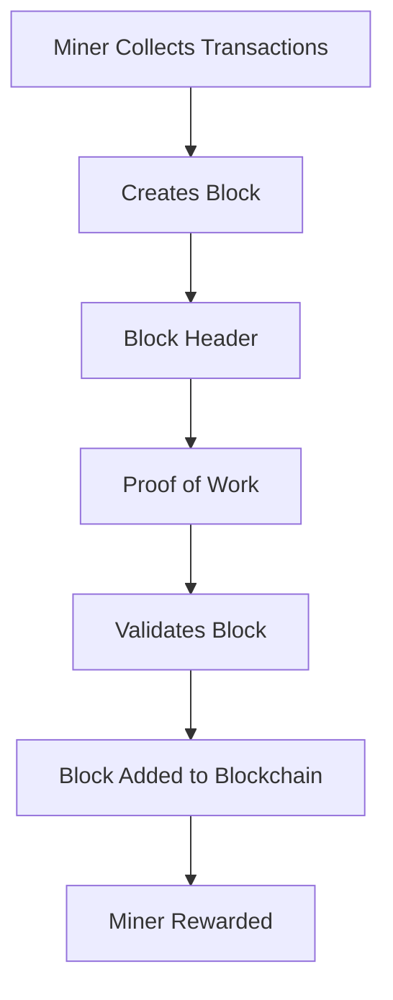

                 

### 文章标题

**区块链技术：去中心化应用开发**

在数字时代，区块链技术已经从一个简单的分布式数据库概念演变成为推动去中心化应用（DApps）开发的基石。本文将深入探讨区块链技术的核心概念、架构、算法原理，以及如何在实践中构建去中心化应用。我们将逐步分析区块链技术的方方面面，从基础概念到高级应用，为您提供一个全面的区块链开发指南。

> **关键词：** 区块链，去中心化，DApp，智能合约，共识算法

> **摘要：** 本文旨在详细解释区块链技术的原理和应用，通过逐步分析其核心概念和关键算法，帮助读者理解如何开发去中心化应用。文章还将提供实际的项目实践，代码实例和详细的解释分析，使读者能够掌握区块链技术的实际应用技巧。

让我们开始这场技术探索之旅，一探区块链技术的奥秘。首先，我们将从背景介绍入手，深入理解区块链技术是如何变革数字世界的。然后，我们将逐步剖析区块链的核心概念与联系，包括去中心化、智能合约和共识算法。接下来，我们将介绍一些核心算法原理和具体操作步骤，帮助读者理解区块链技术的实现细节。随后，我们将展示一些数学模型和公式，并进行详细的讲解和举例说明。在项目实践部分，我们将通过代码实例详细解释说明如何构建去中心化应用。最后，我们将探讨区块链技术的实际应用场景，推荐一些学习资源和开发工具，总结未来发展趋势与挑战，并提供常见问题与解答。跟随本文，您将深入了解区块链技术的全部奥秘。

---

## 1. 背景介绍（Background Introduction）

区块链技术最初在2008年由一位匿名人物以中文名“中本聪”（Satoshi Nakamoto）的名义提出，其目的是为了实现比特币（Bitcoin）的去中心化数字货币。区块链技术的出现解决了传统中心化系统中的诸多痛点，如单点故障、数据篡改风险和中心化信任问题。随着时间的推移，区块链技术逐渐扩展到金融领域以外的其他应用场景，成为构建去中心化应用（DApps）的基石。

去中心化应用（DApps）是指不依赖于单一中心化实体，而是基于区块链和其他分布式技术构建的应用程序。DApps的特点是透明、安全、不可篡改，且能够在无需信任的分布式网络中运行。与传统应用程序不同，DApps的运行不依赖于特定的服务器或第三方中介，从而降低了运营成本和风险。

区块链技术的发展历程可以追溯到几个关键事件。首先，2008年中本聪发布了比特币白皮书，详细介绍了区块链技术和去中心化数字货币的原理。2009年，比特币网络正式上线，标志着区块链技术的首次实际应用。随后，以太坊（Ethereum）在2015年推出，引入了智能合约（Smart Contract）的概念，使得开发者能够在区块链上构建复杂的去中心化应用。

区块链技术的应用场景非常广泛，包括金融、供应链管理、医疗保健、投票系统、数字身份验证等。例如，在金融领域，区块链技术可以用于加密货币交易、跨境支付、智能投顾等；在供应链管理中，区块链可以用于跟踪产品的来源、运输和库存信息，确保透明度和可追溯性；在医疗保健领域，区块链可以用于存储和管理患者的健康记录，确保数据的隐私和安全。

总之，区块链技术正逐步改变着我们的数字世界，去中心化应用的发展为传统行业带来了新的机遇和挑战。了解区块链技术的基本概念和应用场景，对于把握这一技术趋势具有重要意义。

---

## 2. 核心概念与联系（Core Concepts and Connections）

### 2.1 区块链的基本概念

区块链是一种分布式账本技术，它通过一系列按照时间顺序排列的区块（Block）来记录交易信息。每个区块都包含一定数量的交易记录，并通过密码学算法与前一区块相连，形成一个不可篡改的链条。区块链的核心概念包括分布式账本、共识算法和加密技术。

分布式账本：与传统中心化系统不同，区块链使用分布式账本技术，即将数据存储在多个节点上，而不是一个中心服务器。这样，任何一个节点的故障都不会影响整个系统的运行。

共识算法：共识算法是区块链中所有节点达成一致的方法。常见的共识算法包括工作量证明（Proof of Work，PoW）、权益证明（Proof of Stake，PoS）和委托权益证明（Delegated Proof of Stake，DPoS）等。共识算法确保了区块链中的交易记录能够被所有节点一致认可。

加密技术：区块链使用密码学算法来保护数据的安全性和隐私性。例如，公钥加密技术确保了只有合法持有私钥的用户才能访问和修改数据。

### 2.2 智能合约

智能合约是一种运行在区块链上的自动化合约，它通过预定义的条件和逻辑来执行合同条款。智能合约的核心优势是去中心化和不可篡改性。开发者可以使用多种编程语言（如Solidity、Vyper等）来编写智能合约，然后部署到区块链上。

智能合约的关键组成部分包括：

- 条件：智能合约可以根据特定条件触发执行。
- 执行：智能合约包含逻辑代码，用于执行预定义的操作。
- 交互：智能合约可以与区块链上的其他合约和外部系统进行交互。

### 2.3 共识算法

共识算法是区块链中所有节点达成一致的方法。常见的共识算法包括：

- 工作量证明（Proof of Work，PoW）：节点通过解决复杂的数学问题来证明自己的工作量，从而获得记账权。
- 权益证明（Proof of Stake，PoS）：节点根据其持有的代币数量和锁仓时间来获得记账权，持币量越多和锁仓时间越长，获得记账权的概率越高。
- 委托权益证明（Delegated Proof of Stake，DPoS）：选民将投票权委托给代理节点，代理节点代表选民进行记账。

共识算法的选择对区块链的性能、安全性和去中心化程度有重要影响。

### 2.4 区块链与其他技术的联系

区块链技术与其他分布式技术如分布式存储（如IPFS）和加密货币（如比特币）有着紧密的联系。例如，IPFS提供了一种去中心化的文件存储和分发解决方案，可以与区块链技术结合，用于存储和管理区块链上的数据。

总之，区块链技术的核心概念包括分布式账本、共识算法和加密技术。智能合约和共识算法是区块链技术的关键组成部分，而区块链与其他分布式技术的结合为去中心化应用的开发提供了更多的可能性。

### **2.1 What is Blockchain?**

Blockchain is a type of distributed ledger technology that maintains a continuous and immutable record of transactions in a chronological sequence through blocks. Each block contains a certain number of transaction records and is linked to the previous block using cryptographic algorithms, forming an unalterable chain. The core concepts of blockchain include distributed ledger, consensus algorithm, and cryptographic techniques.

**Distributed Ledger:** Unlike traditional centralized systems, blockchain uses distributed ledger technology, which means data is stored across multiple nodes rather than a central server. This ensures that the failure of any single node does not affect the entire system's operation.

**Consensus Algorithm:** Consensus algorithms are methods that all nodes in a blockchain network use to reach an agreement. Common consensus algorithms include Proof of Work (PoW), Proof of Stake (PoS), and Delegated Proof of Stake (DPoS). Consensus algorithms ensure that transaction records in the blockchain are recognized consistently by all nodes.

**Cryptographic Techniques:** Blockchain uses cryptographic algorithms to protect the security and privacy of data. For example, public key encryption ensures that only legitimate holders of the private key can access and modify data.

### **2.2 Smart Contracts**

Smart contracts are automated contracts that run on a blockchain, executing predefined terms and conditions based on specific conditions. The core advantage of smart contracts is their decentralization and immutability. Developers can write smart contracts using various programming languages (such as Solidity and Vyper) and deploy them to the blockchain.

Key components of smart contracts include:

- Conditions: Smart contracts can trigger execution based on specific conditions.
- Execution: Smart contracts contain logic code to perform predefined operations.
- Interaction: Smart contracts can interact with other contracts on the blockchain and external systems.

### **2.3 Consensus Algorithms**

Consensus algorithms are methods by which all nodes in a blockchain network reach an agreement. Common consensus algorithms include:

- Proof of Work (PoW): Nodes prove their work by solving complex mathematical problems to gain the right to record transactions.
- Proof of Stake (PoS): Nodes gain the right to record transactions based on the number of tokens they hold and the duration of their locked-up stakes. The more tokens and the longer the locked-up period, the higher the probability of obtaining the right to record transactions.
- Delegated Proof of Stake (DPoS): Voters delegate their voting rights to proxy nodes, which represent them in recording transactions.

The choice of consensus algorithm has a significant impact on the performance, security, and degree of decentralization of a blockchain network.

### **2.4 The Relationship Between Blockchain and Other Technologies**

Blockchain technology is closely related to other distributed technologies such as distributed storage (e.g., IPFS) and cryptocurrencies (e.g., Bitcoin). For example, IPFS provides a decentralized solution for file storage and distribution that can be combined with blockchain technology to store and manage data on the blockchain.

In summary, the core concepts of blockchain technology include distributed ledger, consensus algorithm, and cryptographic techniques. Smart contracts and consensus algorithms are key components of blockchain technology, while the integration of blockchain with other distributed technologies provides more possibilities for the development of decentralized applications.

### **2.5 Mermaid Flowchart of Blockchain Architecture**

The following Mermaid flowchart illustrates the basic architecture of a blockchain, including the key components of distributed ledger, consensus algorithm, and cryptographic techniques.

```mermaid
graph TB
    A[Blockchain] --> B[Nodes]
    B --> C{Distributed Ledger}
    C --> D{Transactions}
    A --> E{Consensus Algorithm}
    E --> F{Proof of Work (PoW)}
    E --> G{Proof of Stake (PoS)}
    E --> H{Delegated Proof of Stake (DPoS)}
    A --> I{Cryptographic Techniques}
    I --> J{Public Key Encryption}
    I --> K{Hash Functions}
```

---

## 3. 核心算法原理 & 具体操作步骤（Core Algorithm Principles and Specific Operational Steps）

在深入理解区块链的核心概念之后，接下来我们将探讨区块链技术的核心算法原理和具体操作步骤。这些算法原理是区块链实现去中心化、安全性和透明性的关键。以下是几个关键的算法原理和它们的操作步骤：

### 3.1 工作量证明（Proof of Work，PoW）

**原理：** 工作量证明是一种通过解决计算难题来证明节点工作量的共识算法。节点需要解决一个复杂的数学问题，通常是一个哈希碰撞问题，以获得记账权。

**操作步骤：**
1. **节点发起交易：** 节点收集交易数据，并将其打包成一个区块。
2. **挖矿：** 挖矿节点尝试找到一个随机数，使得生成的区块头的哈希值满足一定的难度要求。
3. **验证：** 一旦找到合适的随机数，挖矿节点将区块广播给其他节点，其他节点验证区块的有效性。
4. **添加区块：** 验证通过后，区块被添加到区块链中，挖矿节点获得奖励。

### 3.2 权益证明（Proof of Stake，PoS）

**原理：** 权益证明通过节点持有的代币数量和锁仓时间来决定记账权。持有更多代币和锁仓时间更长的节点，获得记账权的概率越高。

**操作步骤：**
1. **节点注册：** 节点通过质押代币来注册成为记账节点。
2. **随机选择：** 根据节点持有的代币数量和锁仓时间，系统随机选择一个记账节点。
3. **验证和记账：** 记账节点验证区块的有效性，并将新的交易记录添加到区块链中。
4. **奖励：** 成功记账的节点获得一定比例的代币奖励。

### 3.3 委托权益证明（Delegated Proof of Stake，DPoS）

**原理：** 委托权益证明是一种改进的权益证明算法，通过选举出代表节点来执行记账任务。

**操作步骤：**
1. **选民投票：** 节点通过投票选举出代表节点。
2. **代表节点记账：** 代表节点按照选举结果执行记账任务。
3. **验证和奖励：** 新的区块被添加到区块链后，代表节点获得记账奖励。

### 3.4 智能合约执行

**原理：** 智能合约是一种运行在区块链上的自动化合约，通过预定义的条件和逻辑来执行合同条款。

**操作步骤：**
1. **编写智能合约：** 开发者使用特定编程语言（如Solidity）编写智能合约。
2. **部署合约：** 将智能合约部署到区块链上，创建合约地址。
3. **调用合约：** 用户通过区块链调用智能合约，执行预定义的操作。
4. **状态更新：** 智能合约执行后，区块链上的状态被更新。

### 3.5 钱包操作

**原理：** 钱包是用户存储和发送加密货币的工具，包含公钥和私钥。

**操作步骤：**
1. **创建钱包：** 使用钱包生成公钥和私钥。
2. **备份私钥：** 将私钥备份到一个安全的地方。
3. **发送交易：** 使用私钥签署交易，并将其广播到区块链网络。
4. **验证交易：** 其他节点验证交易的有效性。

通过上述核心算法原理和具体操作步骤，我们可以看到区块链技术是如何实现去中心化、安全性和透明性的。这些算法不仅确保了区块链网络的安全和稳定运行，也为去中心化应用的开发提供了坚实的基础。在接下来的部分，我们将进一步探讨区块链技术的数学模型和公式，帮助读者更深入地理解其内在机制。

### **3. Core Algorithm Principles and Specific Operational Steps**

In the previous section, we explored the core concepts of blockchain technology. Now, we will delve into the principles and specific operational steps of the key algorithms that underpin blockchain's decentralization, security, and transparency. These algorithms are essential for implementing the functionality and ensuring the stability of blockchain networks. Here are the core algorithm principles and their operational steps:

### **3.1 Proof of Work (PoW)**

**Principle:** Proof of Work is a consensus algorithm that requires nodes to solve complex mathematical problems to demonstrate their work. Nodes must find a random number that satisfies certain difficulty requirements to gain the right to record transactions.

**Operational Steps:**
1. **Initiating Transactions:** Nodes collect transaction data and bundle it into a block.
2. **Mining:** Mining nodes attempt to find a random number that creates a block header hash that meets the difficulty requirement.
3. **Verification:** Once a suitable random number is found, the mining node broadcasts the block to other nodes, which verify the block's validity.
4. **Adding the Block:** If the block is verified, it is added to the blockchain, and the mining node receives a reward.

### **3.2 Proof of Stake (PoS)**

**Principle:** Proof of Stake determines the right to record transactions based on the number of tokens a node holds and the duration they are locked up. Nodes with more tokens and longer lock-up periods have a higher probability of gaining the right to record transactions.

**Operational Steps:**
1. **Node Registration:** Nodes register by staking their tokens.
2. **Random Selection:** Based on the number of tokens and lock-up duration, the system randomly selects a recording node.
3. **Verification and Recording:** The recording node verifies the block's validity and adds new transaction records to the blockchain.
4. **Rewards:** Successful recording nodes receive a percentage of token rewards.

### **3.3 Delegated Proof of Stake (DPoS)**

**Principle:** Delegated Proof of Stake is an improved version of PoS that elects representative nodes to perform recording tasks.

**Operational Steps:**
1. **Voter Voting:** Nodes vote to elect representative nodes.
2. **Representative Node Recording:** Representative nodes carry out the recording tasks based on the election results.
3. **Verification and Rewards:** After a new block is added to the blockchain, representative nodes receive recording rewards.

### **3.4 Smart Contract Execution**

**Principle:** Smart contracts are automated contracts running on a blockchain that execute predefined terms and conditions based on specific conditions.

**Operational Steps:**
1. **Writing Smart Contracts:** Developers write smart contracts using specific programming languages (such as Solidity).
2. **Deploying Contracts:** Smart contracts are deployed to the blockchain, creating a contract address.
3. **Calling Contracts:** Users invoke smart contracts on the blockchain to execute predefined operations.
4. **State Updates:** After smart contracts are executed, the state on the blockchain is updated.

### **3.5 Wallet Operations**

**Principle:** Wallets are tools for users to store and send cryptocurrencies, containing public keys and private keys.

**Operational Steps:**
1. **Creating a Wallet:** Wallets generate public keys and private keys.
2. **Backing Up Private Keys:** Private keys are backed up to a secure location.
3. **Sending Transactions:** Transactions are signed with private keys and broadcast to the blockchain network.
4. **Verifying Transactions:** Other nodes verify the validity of transactions.

Through the above core algorithm principles and specific operational steps, we can see how blockchain technology achieves decentralization, security, and transparency. These algorithms not only ensure the security and stability of blockchain networks but also provide a solid foundation for the development of decentralized applications. In the next section, we will further explore the mathematical models and formulas underlying blockchain technology to help readers gain a deeper understanding of its inner workings.

### **3.5 Example of a Blockchain Transaction**

To illustrate the operational steps of a blockchain transaction, let's consider a simple example of a Bitcoin transaction.

**Principle:** In Bitcoin, transactions are recorded in blocks, which are added to the blockchain in a chronological order. Each transaction is a transfer of value from one Bitcoin address to another.

**Operational Steps:**

1. **Creating Addresses:** A Bitcoin user generates a pair of public and private keys using a cryptographic algorithm. The public key is used to create a Bitcoin address, while the private key must be securely stored to authorize transactions.

    ```mermaid
    graph TD
        A[User] --> B[Generates Key Pair]
        B --> C[Public Key]
        C --> D[Hash Function]
        D --> E[Bitcoin Address]
        E --> F[Private Key]
    ```

2. **Initiating a Transaction:** Suppose User A wants to send 1 Bitcoin to User B. User A creates a transaction by signing the transaction with their private key, which is added to the transaction data.

    ```mermaid
    graph TD
        A[User A] --> B[Creates Transaction]
        B --> C[Transaction Data]
        C --> D[Signs Transaction]
        D --> E[Transaction]
        E --> F[Public Key of User B]
    ```

3. **Broadcasting the Transaction:** User A broadcasts the transaction to the Bitcoin network. Miners in the network receive the transaction and validate it.

    ```mermaid
    graph TD
        A[User A] --> B[Broadcasts Transaction]
        B --> C[Miners]
        C --> D[Validates Transaction]
    ```

4. **Adding the Transaction to a Block:** Miners compete to solve a cryptographic puzzle to add the transaction to a new block. The first miner to solve the puzzle adds the block to the blockchain, and the transaction is permanently recorded.

    ```mermaid
    graph TD
        C --> D[Competes to Solve Puzzle]
        D --> E[First to Solve Adds Block]
        E --> F[Block Added to Blockchain]
    ```

5. **Verification:** Other nodes in the network verify the block and the transaction within it. Once verified, the transaction is considered complete.

    ```mermaid
    graph TD
        F --> G[Other Nodes Verify]
        G --> H[Transaction Complete]
    ```

This example demonstrates how a simple Bitcoin transaction operates within the blockchain framework, highlighting the key steps involved from creating addresses to verifying the transaction.

### **3.6 Summary of Blockchain Core Algorithms**

Blockchain technology relies on several core algorithms to ensure its functionality, security, and decentralization. The primary algorithms include Proof of Work (PoW), Proof of Stake (PoS), Delegated Proof of Stake (DPoS), smart contract execution, and wallet operations.

**Proof of Work (PoW):** PoW is a consensus algorithm where nodes compete to solve complex mathematical puzzles, earning the right to add new blocks to the blockchain. This process requires significant computational power and is designed to prevent spam and ensure network security.

**Proof of Stake (PoS):** PoS is an alternative to PoW that relies on the number of tokens a node holds and the length of time they have been held. Instead of solving puzzles, nodes are selected based on their stake in the network. This reduces energy consumption compared to PoW but raises concerns about centralization due to the concentration of wealth.

**Delegated Proof of Stake (DPoS):** DPoS is a variant of PoS where users vote for a set of delegate nodes. These delegates are responsible for creating and validating blocks, reducing the load on ordinary nodes and increasing scalability.

**Smart Contract Execution:** Smart contracts are automated agreements that run on a blockchain. They are written in specialized programming languages and execute pre-defined logic when specific conditions are met. This enables the creation of decentralized applications (DApps) that can perform a wide range of tasks, from financial transactions to supply chain management.

**Wallet Operations:** Wallets are essential for managing cryptocurrencies. They store public and private keys, which are used to send and receive transactions. Securely managing private keys is crucial to maintaining control over one's funds.

By understanding these core algorithms and their operational steps, developers can build secure, efficient, and decentralized blockchain applications.

---

## 4. 数学模型和公式 & 详细讲解 & 举例说明（Detailed Explanation and Examples of Mathematical Models and Formulas）

在区块链技术中，数学模型和公式扮演着至关重要的角色。这些模型和公式不仅确保了区块链系统的安全性和可靠性，还定义了区块链网络中的关键操作。以下我们将介绍几个关键的数学模型和公式，并进行详细的讲解和举例说明。

### 4.1 哈希函数

哈希函数是区块链技术中的基础组件，用于确保数据一致性和完整性。哈希函数将任意长度的数据映射为固定长度的字符串，该字符串称为哈希值。哈希函数具有以下几个重要特性：

- **不可逆性：** 给定一个哈希值，无法推导出原始数据。
- **均匀分布：** 任何输入数据都会产生一个唯一的哈希值，且不同输入数据产生相同哈希值的概率极低。
- **抗碰撞性：** 不同输入数据产生相同哈希值的概率极低。

以下是一个简单的哈希函数示例：

```latex
H(x) = SHA-256(x)
```

其中，`SHA-256`是一种广泛使用的哈希函数。给定任意数据`x`，通过`SHA-256`函数计算其哈希值。

### 4.2 工作量证明（Proof of Work，PoW）

在PoW算法中，矿工需要找到一个满足特定难度要求的随机数。难度要求通常通过控制矿工找到正确答案所需的时间来设定。以下是PoW的一个简单数学模型：

- **难度（Difficulty）：** 难度是衡量找到正确答案难易程度的指标。难度越高，找到正确答案所需的时间越长。
- **随机数（Random Number）：** 矿工需要找到一个随机数`n`，使得计算出的哈希值满足以下条件：

  ```latex
  H(n) < target
  ```

  其中，`target`是一个预定义的目标值。

例如，假设我们设定目标值为`0x00000000000000000000000000000000000000000000000000000000000000001`。矿工需要找到一个随机数`n`，使得`SHA-256(n)`的哈希值小于该目标值。

### 4.3 智能合约执行

智能合约的执行涉及复杂的数学逻辑。以下是一个简单的智能合约执行模型：

- **状态（State）：** 智能合约的状态是一个包含所有变量和状态的数据库。
- **输入（Input）：** 智能合约的输入是调用者提供的数据。
- **输出（Output）：** 智能合约的输出是执行结果。
- **执行（Execution）：** 智能合约根据输入数据和预定义的逻辑执行操作，并更新状态。

以下是一个简单的智能合约执行示例：

```solidity
pragma solidity ^0.8.0;

contract SimpleContract {
    uint256 public balance;

    function deposit() public payable {
        balance += msg.value;
    }

    function withdraw(uint256 amount) public {
        require(amount <= balance, "Insufficient balance");
        balance -= amount;
        payable(msg.sender).transfer(amount);
    }
}
```

在这个示例中，智能合约定义了一个简单的存款和取款功能。用户可以通过调用`deposit()`函数向合约存款，并通过调用`withdraw()`函数提取资金。

### 4.4 公钥加密

区块链技术中的加密机制主要用于保护交易和合约的安全性。以下是一个简单的公钥加密模型：

- **公钥（Public Key）：** 公钥用于加密数据。
- **私钥（Private Key）：** 私钥用于解密数据。
- **加密（Encryption）：** 使用公钥加密数据。
- **解密（Decryption）：** 使用私钥解密加密数据。

以下是一个简单的公钥加密示例：

```latex
Ciphertext = RSAEncryption(Plaintext, Public Key)
Plaintext = RSADecryption(Ciphertext, Private Key)
```

其中，`RSAEncryption`和`RSADecryption`分别是RSA加密和解密函数。

通过以上数学模型和公式的讲解，我们可以看到区块链技术在确保数据安全性、一致性和可靠性方面的重要作用。这些数学工具不仅为区块链技术的实现提供了理论基础，也为开发去中心化应用提供了强有力的支持。

### **4. Detailed Explanation and Examples of Mathematical Models and Formulas in Blockchain**

Mathematical models and formulas are integral to blockchain technology, ensuring the security, integrity, and reliability of the system. Here, we will delve into several key mathematical models and formulas, providing detailed explanations and illustrative examples.

### **4.1 Hash Functions**

Hash functions are foundational in blockchain technology, ensuring data consistency and integrity. A hash function takes an input of any length and maps it to a fixed-length string, known as the hash value. Hash functions possess several important properties:

- **Irreversibility:** Given a hash value, it is impossible to derive the original data.
- **Uniform Distribution:** Any input data will produce a unique hash value, and the probability of two different inputs producing the same hash value is extremely low.
- **Collision Resistance:** The probability of different inputs producing the same hash value is extremely low.

Consider the following simple hash function example:

```latex
H(x) = SHA-256(x)
```

Here, `SHA-256` is a widely used hash function. Given any data `x`, we compute its hash value using the `SHA-256` function.

### **4.2 Proof of Work (PoW)**

In the PoW algorithm, miners must find a random number that satisfies a certain difficulty requirement. The difficulty requirement is typically set by controlling the time miners take to find the correct answer. Here's a simple mathematical model for PoW:

- **Difficulty:** Difficulty is a measure of how difficult it is to find the correct answer. The higher the difficulty, the longer it takes to find the correct answer.
- **Random Number:** Miners need to find a random number `n` such that the hash value of `n` satisfies the following condition:

  ```latex
  H(n) < target
  ```

  Where `target` is a predefined target value.

For example, suppose we set the target value to `0x00000000000000000000000000000000000000000000000000000000000000001`. Miners need to find a random number `n` such that the hash value of `SHA-256(n)` is less than this target value.

### **4.3 Smart Contract Execution**

Smart contract execution involves complex mathematical logic. Here's a simple model for smart contract execution:

- **State:** The state of a smart contract is a database containing all variables and states.
- **Input:** The input to a smart contract is the data provided by the caller.
- **Output:** The output of a smart contract is the result of its execution.
- **Execution:** A smart contract executes operations based on the input data and predefined logic, updating the state.

Consider the following simple smart contract execution example:

```solidity
pragma solidity ^0.8.0;

contract SimpleContract {
    uint256 public balance;

    function deposit() public payable {
        balance += msg.value;
    }

    function withdraw(uint256 amount) public {
        require(amount <= balance, "Insufficient balance");
        balance -= amount;
        payable(msg.sender).transfer(amount);
    }
}
```

In this example, the smart contract defines a simple deposit and withdrawal function. Users can deposit funds using the `deposit()` function and withdraw funds using the `withdraw()` function.

### **4.4 Public Key Encryption**

Encryption mechanisms in blockchain technology are crucial for ensuring the security of transactions and contracts. Here's a simple public key encryption model:

- **Public Key:** The public key is used to encrypt data.
- **Private Key:** The private key is used to decrypt data.
- **Encryption:** Data is encrypted using the public key.
- **Decryption:** Data is decrypted using the private key.

Consider the following simple public key encryption example:

```latex
Ciphertext = RSAEncryption(Plaintext, Public Key)
Plaintext = RSADecryption(Ciphertext, Private Key)
```

Where `RSAEncryption` and `RSADecryption` are the RSA encryption and decryption functions, respectively.

Through these detailed explanations and examples of mathematical models and formulas, we can see the critical role they play in ensuring the security, integrity, and reliability of blockchain technology. These mathematical tools not only provide a theoretical foundation for the implementation of blockchain systems but also support the development of decentralized applications.

### **4.5 Example of a Blockchain Consensus Algorithm: Proof of Work (PoW)**

To further illustrate the Proof of Work (PoW) consensus algorithm, let's walk through an example using the Bitcoin network. PoW is the consensus mechanism used by Bitcoin to achieve agreement among network participants on the state of the blockchain.

**Example: Mining a Block in Bitcoin**

1. **Block and Transaction Data:**
   A Bitcoin miner has collected a list of transactions that need to be added to the blockchain. This list is bundled into a block.

2. **Block Header:**
   Each block in the Bitcoin blockchain has a block header that includes the following fields:
   - **Version:** The version number of the block.
   - **Previous Hash:** The hash of the previous block's header.
   - **Merkle Root:** The hash of the Merkle tree, which represents all transactions in the block.
   - **Timestamp:** The current time when the block was created.
   - **Bits:** A parameter used to set the difficulty of mining.
   - **Nonce:** A random number used by miners to find a valid block.

   The block header might look like this:
   ```plaintext
   Version: 536870912
   Previous Hash: abc123...
   Merkle Root: def456...
   Timestamp: 1628654321
   Bits: 1e0fffff
   Nonce: 0
   ```

3. **Proof of Work:**
   The miner's task is to find a nonce (random number) such that the hash of the block header, when combined with this nonce, results in a hash value that meets the difficulty requirement. The difficulty is determined by the `Bits` field in the block header and is used to control the rate at which new blocks are added to the blockchain.

   The hash function used in Bitcoin is SHA-256. The miner will try different nonce values and calculate the hash of the block header for each nonce until the hash value is less than or equal to the target value set by the difficulty.

   ```latex
   H(Nonce) \leq Target
   ```

   For example, if the target difficulty is `0x1d00ffff`, the hash value must start with `1d00ffff` in hexadecimal. The miner's job is to find a nonce that produces such a hash value.

4. **Mining:**
   Miners use specialized hardware (ASICs) to perform millions of nonce calculations per second. This is the "proof of work" where the work is the computational effort required to find a valid nonce.

5. **Block Validation:**
   Once a miner finds a valid nonce, the block is broadcast to the network. Other nodes in the network then validate the block to ensure it meets the consensus rules:
   - The hash of the block header must be less than or equal to the target.
   - The transactions within the block must be valid and not exceed the maximum allowed size.
   - The block must include the hash of the previous block to maintain the blockchain's integrity.

6. **Block Addition:**
   If the block is valid, it is added to the blockchain, and the miner is rewarded with newly created Bitcoins. The process of finding a valid block is known as "mining."

Here's a visual representation of the mining process:



This example demonstrates the key steps involved in mining a block using the PoW consensus algorithm in Bitcoin. The difficulty of the PoW process ensures that blocks are added to the blockchain at a consistent rate, providing security and stability to the blockchain network.

---

## 5. 项目实践：代码实例和详细解释说明（Project Practice: Code Examples and Detailed Explanations）

在实际开发去中心化应用（DApps）时，理解和应用区块链技术是至关重要的。以下我们将通过一个具体的DApp项目实例——一个简单的投票系统，展示如何使用以太坊（Ethereum）区块链来构建去中心化应用，并提供详细的代码解释和分析。

### 5.1 开发环境搭建

在开始构建投票DApp之前，我们需要搭建一个以太坊开发环境。以下步骤可以帮助我们在本地设置开发环境：

1. **安装Node.js和npm：**
   Node.js和npm是用于前端开发的必要工具。可以从官方网站下载并安装Node.js（https://nodejs.org/），并确保npm版本在6.0以上。

2. **安装Truffle框架：**
   Truffle是一个用于以太坊开发的框架，它提供了开发、测试和部署智能合约的环境。安装Truffle可以通过以下命令完成：
   ```bash
   npm install -g truffle
   ```

3. **创建一个新的Truffle项目：**
   使用Truffle创建一个新项目，并设置必要的配置文件：
   ```bash
   truffle init
   cd my-voting-dapp
   truffle migrate --network development
   ```

4. **安装Ganache：**
   Ganache是一个用于本地以太坊网络的测试节点，可以帮助我们创建账户和部署合约。可以从官方网站下载并安装Ganache（https://github.com/trufflesuite/ganache），并启动一个本地以太坊网络。

5. **配置.truffle文件夹：**
   编辑`.truffle/config.js`文件，配置Ganache为默认的以太坊节点：
   ```javascript
   module.exports = {
     networks: {
       development: {
         host: "127.0.0.1",
         port: 8545,
         network_id: "*"
       }
     }
   };
   ```

### 5.2 源代码详细实现

在搭建好开发环境后，我们将编写智能合约代码并部署到本地以太坊网络。

**智能合约代码：** `Voting.sol`

```solidity
// SPDX-License-Identifier: MIT
pragma solidity ^0.8.0;

contract Voting {
    mapping(address => bool) public voters;
    mapping(bytes32 => string) public candidates;
    bytes32[] public candidateList;

    // 创建候选人
    function addCandidate(string memory candidateName) public {
        require(!isVoted(), "You have already voted.");
        require(!isCandidate(candidateName), "This candidate already exists.");
        bytes32 candidateId = keccak256(abi.encodePacked(candidateName));
        candidates[candidateId] = candidateName;
        candidateList.push(candidateId);
    }

    // 投票
    function vote(bytes32 candidateId) public {
        require(!isVoted(), "You have already voted.");
        require(isCandidate(candidateId), "This candidate does not exist.");
        voters[msg.sender] = true;
        candidates[candidateId] = candidateId;
    }

    // 是否已投票
    function isVoted() public view returns (bool) {
        return voters[msg.sender];
    }

    // 是否是候选人
    function isCandidate(bytes32 candidateId) public view returns (bool) {
        return candidates[candidateId] != "";
    }

    // 获取候选人列表
    function getCandidates() public view returns (bytes32[] memory) {
        return candidateList;
    }
}
```

**前端代码：** `Voting.sol`

```javascript
// Voting.sol

import { ethers } from "ethers";

async function main() {
  const provider = new ethers.providers.JsonRpcProvider("http://127.0.0.1:8545");
  const wallet = new ethers.Wallet("YOUR_PRIVATE_KEY", provider);
  const signer = wallet.connect(provider);
  
  const contractAddress = "0x..."; // 智能合约的地址
  const contractABI = ["..."]; // 智能合约的ABI
  const votingContract = new ethers.Contract(contractAddress, contractABI, signer);

  // 创建候选人
  const addCandidateTx = await votingContract.addCandidate("Alice");
  await addCandidateTx.wait();

  // 投票
  const voteTx = await votingContract.vote("Alice");
  await voteTx.wait();

  console.log("Voting contract deployed and candidates added.");
}

main().catch((error) => {
  console.error(error);
});
```

### 5.3 代码解读与分析

**Voting.sol**

- **构造函数：** 智能合约的构造函数不包含任何代码，但定义了两个数据结构：`voters`映射存储已经投票的地址，`candidates`映射存储候选人的名字及其ID。
- **addCandidate()：** `addCandidate`函数用于添加新的候选人。它首先检查调用者是否已经投票，然后检查候选人是否已存在。如果条件满足，它会创建一个新的哈希值作为候选人的ID，并将候选人的名字存储在`candidates`映射中，并将候选人的ID添加到`candidateList`数组中。
- **vote()：** `vote`函数用于让用户为候选人投票。它首先检查调用者是否已经投票，然后检查候选人是否存在。如果条件都满足，它将调用者的地址标记为已经投票，并将候选人的ID存储在`candidates`映射中。
- **isVoted()：** `isVoted`函数用于检查调用者是否已经投票。它返回一个布尔值，表示调用者是否已经投票。
- **isCandidate()：** `isCandidate`函数用于检查某个候选人的ID是否在合约中存在。它返回一个布尔值，表示候选人是否存在。
- **getCandidates()：** `getCandidates`函数用于获取所有候选人的列表。它返回一个`bytes32`类型的数组，包含所有候选人的ID。

**前端代码**

- **导入Eth

