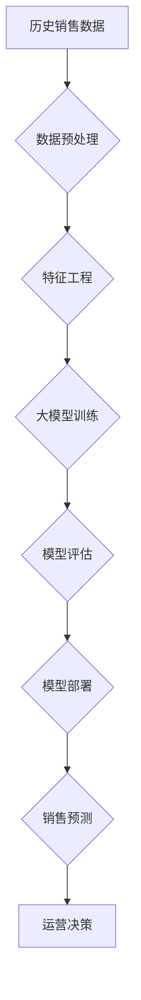

                 

## 大模型在电商平台销售预测中的应用

> 关键词：大模型、销售预测、电商平台、机器学习、深度学习、时间序列分析、自然语言处理

## 1. 背景介绍

在当今数据爆炸的时代，电商平台面临着日益激烈的竞争压力。准确预测商品销售量是电商平台运营的关键环节，它直接影响着库存管理、价格策略、营销活动等多个方面。传统的销售预测方法往往依赖于历史数据和经验判断，难以捕捉到复杂市场变化的趋势。近年来，随着深度学习技术的快速发展，大模型在各个领域展现出强大的应用潜力，也为电商平台销售预测带来了新的机遇。

大模型，是指参数规模庞大、训练数据海量的人工智能模型。它们能够学习到更复杂的模式和关系，从而实现更精准的预测。在电商平台销售预测领域，大模型可以利用海量商品信息、用户行为数据、市场趋势数据等多源数据，构建更精细的预测模型，提升预测准确率，帮助电商平台优化运营策略。

## 2. 核心概念与联系

### 2.1 销售预测

销售预测是指根据历史数据、市场趋势和相关因素，预测未来一段时间内商品的销售量。它是一个复杂的过程，需要考虑多种因素的影响，例如季节性、促销活动、竞争对手情况等。

### 2.2 大模型

大模型是指参数规模庞大、训练数据海量的人工智能模型。它们通常基于深度学习架构，例如Transformer、BERT等，能够学习到更复杂的模式和关系。

### 2.3 电商平台数据

电商平台拥有海量用户行为数据、商品信息数据、市场趋势数据等，这些数据是构建销售预测模型的重要基础。

**大模型在电商平台销售预测中的应用架构**



## 3. 核心算法原理 & 具体操作步骤

### 3.1 算法原理概述

大模型在电商平台销售预测中主要采用基于深度学习的时间序列分析算法。这些算法能够捕捉到时间序列数据中的复杂模式和趋势，并进行预测。常见的算法包括：

* **LSTM (Long Short-Term Memory)**：一种专门用于处理时间序列数据的循环神经网络，能够学习到长期依赖关系。
* **GRU (Gated Recurrent Unit)**：一种改进的循环神经网络，相较于LSTM更简洁高效。
* **Transformer**：一种基于注意力机制的深度学习模型，能够捕捉到序列数据中的长距离依赖关系。

### 3.2 算法步骤详解

1. **数据收集和预处理**: 收集历史销售数据、用户行为数据、商品信息数据等，并进行清洗、转换、归一化等预处理操作。
2. **特征工程**: 从原始数据中提取特征，例如商品类别、价格、促销活动、季节性等，构建更丰富的特征向量。
3. **模型训练**: 选择合适的深度学习模型，例如LSTM、GRU或Transformer，并利用训练数据进行模型训练。
4. **模型评估**: 使用测试数据评估模型的预测准确率，并进行调参优化。
5. **模型部署**: 将训练好的模型部署到线上环境，用于实时销售预测。

### 3.3 算法优缺点

**优点**:

* 能够捕捉到复杂的时间序列模式和趋势。
* 预测精度高，能够提供更准确的销售预测结果。
* 可扩展性强，能够处理海量数据。

**缺点**:

* 训练成本高，需要大量的计算资源和训练数据。
* 模型解释性差，难以理解模型的决策过程。
* 对数据质量要求高，数据噪声和缺失值会影响模型性能。

### 3.4 算法应用领域

* **商品库存管理**: 预测商品未来销量，优化库存水平，避免缺货或积压。
* **价格策略**: 根据预测销量，制定动态价格策略，提高利润率。
* **营销活动**: 预测营销活动的效果，优化营销预算和推广策略。
* **供应链管理**: 预测商品需求，优化生产计划和物流配送。

## 4. 数学模型和公式 & 详细讲解 & 举例说明

### 4.1 数学模型构建

在销售预测中，常用的数学模型包括ARIMA模型、SARIMA模型和Prophet模型。

* **ARIMA模型**: Autoregressive Integrated Moving Average模型，是一种经典的时间序列分析模型，能够捕捉到时间序列中的自回归、差分和移动平均关系。
* **SARIMA模型**: Seasonal ARIMA模型，是ARIMA模型的扩展，能够处理具有季节性特征的时间序列数据。
* **Prophet模型**: 由Facebook开发的开源时间序列预测模型，能够处理具有趋势、季节性和异常值的时间序列数据。

### 4.2 公式推导过程

ARIMA模型的公式推导过程较为复杂，这里只列出其基本形式：

$$
y_t = c + \phi_1 y_{t-1} + \phi_2 y_{t-2} + ... + \phi_p y_{t-p} + \theta_1 \epsilon_{t-1} + \theta_2 \epsilon_{t-2} + ... + \theta_q \epsilon_{t-q} + \epsilon_t
$$

其中：

* $y_t$ 是时间t的观测值。
* $c$ 是截距项。
* $\phi_i$ 是自回归系数。
* $p$ 是自回归阶数。
* $\theta_i$ 是移动平均系数。
* $q$ 是移动平均阶数。
* $\epsilon_t$ 是白噪声误差项。

### 4.3 案例分析与讲解

假设我们想要预测某商品未来一周的销量，可以使用ARIMA模型进行预测。首先，我们需要收集该商品的历史销量数据，并进行数据预处理和特征工程。然后，选择合适的ARIMA模型参数，例如p、d、q值。最后，利用训练数据训练ARIMA模型，并使用测试数据评估模型的预测准确率。

## 5. 项目实践：代码实例和详细解释说明

### 5.1 开发环境搭建

* Python 3.x
* TensorFlow 或 PyTorch 深度学习框架
* Pandas 数据处理库
* Matplotlib 数据可视化库
* Scikit-learn 机器学习库

### 5.2 源代码详细实现

```python
import pandas as pd
from sklearn.model_selection import train_test_split
from tensorflow.keras.models import Sequential
from tensorflow.keras.layers import LSTM, Dense

# 数据加载和预处理
data = pd.read_csv('sales_data.csv')
data['Date'] = pd.to_datetime(data['Date'])
data = data.set_index('Date')
data = data['Sales'].values.reshape(-1, 1)

# 数据分割
train_data, test_data = train_test_split(data, test_size=0.2)

# 模型构建
model = Sequential()
model.add(LSTM(units=50, return_sequences=True, input_shape=(train_data.shape[1], 1)))
model.add(LSTM(units=50))
model.add(Dense(1))

# 模型编译
model.compile(loss='mean_squared_error', optimizer='adam')

# 模型训练
model.fit(train_data, train_data, epochs=100, batch_size=32)

# 模型评估
predictions = model.predict(test_data)

# 结果展示
print(predictions)
```

### 5.3 代码解读与分析

* 代码首先加载销售数据，并进行数据预处理和特征工程。
* 然后，使用TensorFlow框架构建LSTM模型，并进行模型编译和训练。
* 最后，使用训练好的模型对测试数据进行预测，并展示预测结果。

### 5.4 运行结果展示

运行代码后，会输出预测结果，例如未来一周的商品销量预测值。

## 6. 实际应用场景

大模型在电商平台销售预测中的应用场景非常广泛，例如：

* **个性化推荐**: 根据用户的历史购买记录和浏览行为，预测用户对不同商品的兴趣，提供个性化商品推荐。
* **促销活动优化**: 预测不同促销活动的效果，优化促销策略和预算分配。
* **库存管理**: 预测商品未来销量，优化库存水平，避免缺货或积压。
* **价格动态调整**: 根据预测销量和市场竞争情况，动态调整商品价格，提高利润率。

### 6.4 未来应用展望

随着大模型技术的不断发展，其在电商平台销售预测中的应用将更加广泛和深入。未来，大模型可能能够：

* 更好地理解用户需求和市场趋势，提供更精准的销售预测结果。
* 结合其他人工智能技术，例如自然语言处理和计算机视觉，实现更智能的销售预测系统。
* 帮助电商平台制定更有效的运营策略，提高运营效率和盈利能力。

## 7. 工具和资源推荐

### 7.1 学习资源推荐

* **书籍**:
    * 深度学习
    * 自然语言处理
    * 时间序列分析
* **在线课程**:
    * Coursera
    * edX
    * Udacity

### 7.2 开发工具推荐

* **Python**: 
* **TensorFlow**: 
* **PyTorch**: 
* **Keras**: 

### 7.3 相关论文推荐

* **Attention Is All You Need**: 
* **BERT: Pre-training of Deep Bidirectional Transformers for Language Understanding**: 
* **Prophet: Forecasting at Scale**: 

## 8. 总结：未来发展趋势与挑战

### 8.1 研究成果总结

大模型在电商平台销售预测领域取得了显著的成果，能够提供更精准的预测结果，帮助电商平台优化运营策略。

### 8.2 未来发展趋势

未来，大模型在电商平台销售预测领域将朝着以下方向发展：

* 模型精度提升: 通过更复杂的模型架构和更海量的训练数据，进一步提升预测精度。
* 应用场景拓展: 将大模型应用到更多电商平台的业务场景，例如个性化推荐、促销活动优化等。
* 模型解释性增强: 研究更有效的模型解释方法，提高模型的可解释性和可信度。

### 8.3 面临的挑战

大模型在电商平台销售预测领域也面临一些挑战：

* 数据质量问题: 大模型对数据质量要求较高，数据噪声和缺失值会影响模型性能。
* 计算资源需求: 训练大模型需要大量的计算资源，成本较高。
* 模型解释性问题: 大模型的决策过程较为复杂，难以理解模型的决策逻辑。

### 8.4 研究展望

未来，需要进一步研究大模型在电商平台销售预测领域的应用，解决数据质量问题、降低计算成本、增强模型解释性等挑战，推动大模型技术在电商领域的更广泛应用。

## 9. 附录：常见问题与解答

* **Q1: 大模型的训练需要多长时间？**

A1: 大模型的训练时间取决于模型规模、训练数据量和计算资源等因素，通常需要几天到几周甚至更长时间。

* **Q2: 如何评估大模型的预测精度？**

A2: 常用的评估指标包括均方误差 (MSE)、平均绝对误差 (MAE) 和 R-squared 等。

* **Q3: 如何解决大模型的数据质量问题？**

A3: 可以通过数据清洗、数据增强和数据标注等方法提高数据质量。


作者：禅与计算机程序设计艺术 / Zen and the Art of Computer Programming 
<end_of_turn>

