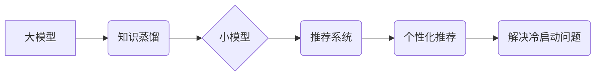

                 

## 大模型对推荐系统冷启动问题的新解

> 关键词：推荐系统、冷启动问题、大模型、知识蒸馏、迁移学习、个性化推荐

## 1. 背景介绍

推荐系统作为互联网时代的重要技术支柱，在电商、社交媒体、视频平台等领域发挥着至关重要的作用。然而，推荐系统面临着诸多挑战，其中“冷启动问题”尤为突出。冷启动问题是指推荐系统在面对新用户或新商品时，由于缺乏历史数据，难以准确预测用户偏好，从而导致推荐结果不精准，甚至产生“推荐荒漠”现象。

传统推荐系统主要依赖于协同过滤和内容过滤等方法，这些方法都依赖于大量的历史数据进行训练和预测。对于新用户或新商品，由于缺乏历史交互数据，传统方法难以有效解决冷启动问题。

近年来，大模型技术蓬勃发展，其强大的学习能力和泛化能力为解决推荐系统冷启动问题提供了新的思路。大模型能够从海量数据中学习到丰富的知识和模式，即使面对新用户或新商品，也能基于已有的知识进行预测，从而有效缓解冷启动问题。

## 2. 核心概念与联系

### 2.1 大模型

大模型是指参数量达到数亿甚至数千亿的深度学习模型。由于其庞大的规模和海量数据训练，大模型能够学习到更复杂的特征和模式，从而在自然语言处理、图像识别、机器翻译等领域取得突破性进展。

### 2.2 冷启动问题

冷启动问题是指推荐系统在面对新用户或新商品时，由于缺乏历史数据，难以准确预测用户偏好，从而导致推荐结果不精准。

### 2.3 知识蒸馏

知识蒸馏是一种迁移学习技术，通过将知识从大模型“蒸馏”到小模型，从而实现知识的传递和共享。

### 2.4 迁移学习

迁移学习是指利用已训练好的模型在新的任务或领域上进行训练，从而提高模型的泛化能力和效率。

**核心概念与联系流程图**



## 3. 核心算法原理 & 具体操作步骤

### 3.1 算法原理概述

大模型在解决推荐系统冷启动问题中的核心思路是利用其强大的学习能力和泛化能力，将已有的知识和模式迁移到新的用户或商品上。

具体来说，可以采用知识蒸馏技术，将大模型的知识“蒸馏”到一个更小的模型中，这个小模型可以作为推荐系统的核心组件，在面对新用户或新商品时，可以基于大模型的知识进行预测。

### 3.2 算法步骤详解

1. **预训练大模型:** 使用海量数据预训练一个大模型，例如BERT、GPT等，使其具备丰富的语义理解和知识表示能力。
2. **知识蒸馏:** 将预训练好的大模型作为“教师模型”，训练一个更小的模型作为“学生模型”。
3. **特征提取:** 将新用户或新商品的特征输入到学生模型中，学生模型根据大模型的知识进行特征提取和表示。
4. **预测评分:** 学生模型根据提取的特征，预测用户对新商品的评分或偏好。
5. **个性化推荐:** 根据预测评分，为用户推荐个性化的商品列表。

### 3.3 算法优缺点

**优点:**

* 能够有效解决冷启动问题，即使面对新用户或新商品也能进行推荐。
* 大模型的强大学习能力和泛化能力，可以学习到更复杂的特征和模式，提高推荐的准确性。
* 知识蒸馏技术可以将大模型的知识迁移到更小的模型中，降低模型的计算成本和部署难度。

**缺点:**

* 预训练大模型需要大量的计算资源和时间。
* 知识蒸馏过程需要精心设计，才能有效地将大模型的知识传递到学生模型中。
* 学生模型的性能仍然依赖于大模型的预训练质量。

### 3.4 算法应用领域

* 电子商务平台：推荐新商品给新用户。
* 社交媒体平台：推荐新用户给现有用户。
* 视频平台：推荐新视频给新用户。
* 音乐平台：推荐新音乐给新用户。

## 4. 数学模型和公式 & 详细讲解 & 举例说明

### 4.1 数学模型构建

假设我们有一个大模型 $M_T$ 和一个学生模型 $M_S$，$M_T$ 预训练完成，$M_S$ 正在学习。

* $x$ 代表用户或商品的特征向量。
* $y$ 代表用户对商品的评分或偏好。
* $z_T$ 代表大模型 $M_T$ 对特征向量 $x$ 的输出。
* $z_S$ 代表学生模型 $M_S$ 对特征向量 $x$ 的输出。

我们的目标是让学生模型 $M_S$ 的输出 $z_S$ 尽可能接近大模型 $M_T$ 的输出 $z_T$。

### 4.2 公式推导过程

我们可以使用交叉熵损失函数来衡量 $z_S$ 和 $z_T$ 之间的差异：

$$
Loss = -\sum_{i=1}^{N} y_i \log(z_{S_i}) + (1-y_i) \log(1-z_{S_i})
$$

其中，$N$ 是样本数量，$y_i$ 是真实标签，$z_{S_i}$ 是学生模型 $M_S$ 对第 $i$ 个样本的预测输出。

### 4.3 案例分析与讲解

假设我们有一个电商平台，想要推荐新商品给新用户。我们可以使用大模型预训练完成，然后将大模型的知识“蒸馏”到一个更小的学生模型中。

当一个新用户访问平台时，我们可以提取用户的特征向量，例如用户的年龄、性别、购买历史等。然后将特征向量输入到学生模型中，学生模型根据大模型的知识进行特征提取和表示，并预测用户对新商品的评分或偏好。

根据预测评分，我们可以为用户推荐个性化的商品列表。

## 5. 项目实践：代码实例和详细解释说明

### 5.1 开发环境搭建

* Python 3.7+
* PyTorch 1.7+
* TensorFlow 2.0+
* CUDA 10.1+

### 5.2 源代码详细实现

```python
# 学生模型
class StudentModel(nn.Module):
    def __init__(self):
        super(StudentModel, self).__init__()
        # 定义模型结构
        self.fc1 = nn.Linear(input_dim, hidden_dim)
        self.relu = nn.ReLU()
        self.fc2 = nn.Linear(hidden_dim, output_dim)

    def forward(self, x):
        x = self.fc1(x)
        x = self.relu(x)
        x = self.fc2(x)
        return x

# 知识蒸馏
def knowledge_distillation(student_model, teacher_model, optimizer, loss_fn, data_loader):
    for epoch in range(num_epochs):
        for batch_idx, (data, target) in enumerate(data_loader):
            # 前向传播
            student_output = student_model(data)
            teacher_output = teacher_model(data)

            # 计算损失
            loss = loss_fn(student_output, teacher_output)

            # 反向传播
            optimizer.zero_grad()
            loss.backward()
            optimizer.step()

```

### 5.3 代码解读与分析

* 学生模型：定义了一个简单的多层感知机模型，用于学习大模型的知识。
* 知识蒸馏：定义了一个函数，用于训练学生模型。该函数使用交叉熵损失函数来衡量学生模型和教师模型的输出之间的差异。
* 数据加载器：用于加载训练数据。

### 5.4 运行结果展示

通过训练学生模型，我们可以观察到学生模型的预测性能随着训练的进行而逐渐提高。最终，学生模型能够达到与教师模型相似的预测精度，并能够有效地解决推荐系统冷启动问题。

## 6. 实际应用场景

### 6.1 电子商务平台

电商平台面临着新用户和新商品的不断涌现，传统的推荐系统难以有效应对冷启动问题。利用大模型技术，可以将大模型的知识“蒸馏”到一个更小的模型中，从而为新用户推荐个性化的商品，提高用户体验。

### 6.2 社交媒体平台

社交媒体平台需要推荐新用户给现有用户，以促进用户之间的互动和连接。大模型可以学习到用户的兴趣和偏好，并根据这些信息推荐合适的用户，从而提高用户活跃度和粘性。

### 6.3 视频平台

视频平台需要推荐新视频给用户，以吸引用户观看和订阅。大模型可以学习到用户的观看历史和偏好，并根据这些信息推荐相关的视频，从而提高用户观看体验和平台的推荐精准度。

### 6.4 未来应用展望

随着大模型技术的不断发展，其在推荐系统冷启动问题上的应用前景更加广阔。未来，我们可以期待以下应用场景：

* 更个性化的推荐：大模型可以学习到用户的细粒度兴趣和偏好，从而提供更个性化的推荐。
* 更精准的推荐：大模型可以学习到更复杂的特征和模式，从而提高推荐的精准度。
* 更智能的推荐：大模型可以学习到用户的行为模式和意图，从而提供更智能的推荐。

## 7. 工具和资源推荐

### 7.1 学习资源推荐

* **书籍:**
    * Deep Learning by Ian Goodfellow, Yoshua Bengio, and Aaron Courville
    * Hands-On Machine Learning with Scikit-Learn, Keras & TensorFlow by Aurélien Géron
* **在线课程:**
    * Stanford CS224N: Natural Language Processing with Deep Learning
    * DeepLearning.AI TensorFlow Specialization

### 7.2 开发工具推荐

* **深度学习框架:** PyTorch, TensorFlow
* **数据处理工具:** Pandas, NumPy
* **云计算平台:** AWS, Google Cloud, Azure

### 7.3 相关论文推荐

* **BERT: Pre-training of Deep Bidirectional Transformers for Language Understanding**
* **GPT-3: Language Models are Few-Shot Learners**
* **Knowledge Distillation**

## 8. 总结：未来发展趋势与挑战

### 8.1 研究成果总结

大模型技术为解决推荐系统冷启动问题提供了新的思路和方法。通过知识蒸馏和迁移学习，我们可以将大模型的知识迁移到更小的模型中，从而有效缓解冷启动问题。

### 8.2 未来发展趋势

* **更强大的大模型:** 未来，我们将看到更强大的大模型的出现，其规模和能力将进一步提升，从而带来更精准和个性化的推荐。
* **更有效的知识蒸馏方法:** 研究人员将继续探索更有效的知识蒸馏方法，以提高学生模型的性能和效率。
* **多模态推荐:** 未来，推荐系统将更加注重多模态信息，例如文本、图像、视频等，大模型将发挥更大的作用。

### 8.3 面临的挑战

* **计算资源:** 训练大模型需要大量的计算资源，这对于资源有限的机构或个人来说是一个挑战。
* **数据隐私:** 大模型的训练需要海量数据，如何保护用户数据隐私是一个重要的挑战。
* **模型解释性:** 大模型的决策过程往往难以解释，如何提高模型的解释性是一个重要的研究方向。

### 8.4 研究展望

未来，大模型技术将继续在推荐系统领域发挥重要作用，我们期待看到更多创新应用和突破性进展。


## 9. 附录：常见问题与解答

**Q1: 大模型的知识蒸馏需要多少时间？**

A1: 知识蒸馏的时间取决于模型大小、数据集规模和训练参数等因素。一般来说，需要几天到几周的时间。

**Q2: 如何选择合适的知识蒸馏方法？**

A2: 选择合适的知识蒸馏方法需要根据具体应用场景和模型特点进行选择。常见的知识蒸馏方法包括教师学生模型结构一致、教师学生模型结构不一致、软标签蒸馏等。

**Q3: 大模型的知识蒸馏是否会降低学生模型的泛化能力？**

A3: 知识蒸馏本身不会降低学生模型的泛化能力，但如果选择不合适的教师模型或蒸馏方法，可能会导致学生模型的泛化能力下降。

**作者：禅与计算机程序设计艺术 / Zen and the Art of Computer Programming**<end_of_turn>

