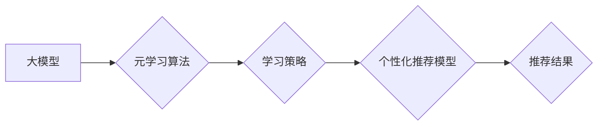

                 

## 大模型推荐中的元学习方法

> 关键词：元学习、大模型、推荐系统、迁移学习、个性化推荐

## 1. 背景介绍

推荐系统作为信息过滤和个性化内容展示的重要工具，在电商、社交媒体、视频平台等领域发挥着越来越重要的作用。随着大规模数据和深度学习技术的快速发展，大模型在推荐系统领域展现出强大的潜力，能够学习更复杂的用户偏好和物品关系，从而提供更精准、个性化的推荐结果。然而，大模型的训练成本高昂，且需要海量数据进行微调，这对于一些小规模数据集或新兴领域来说是一个挑战。

元学习（Meta-Learning）作为一种机器学习的范式，旨在学习如何学习，能够通过少量数据快速适应新的任务。将元学习方法应用于大模型推荐系统，可以有效解决上述问题，实现更灵活、高效的推荐模型训练和部署。

## 2. 核心概念与联系

元学习的核心思想是学习一个通用的学习策略，能够在新的任务上快速适应和学习。它通过在多个相关任务上进行训练，学习到一种能够泛化到新任务的知识表示。

在推荐系统中，元学习可以帮助我们构建更灵活、更适应个性化需求的推荐模型。

**元学习与大模型推荐的联系：**

* **数据效率:** 元学习可以利用少量数据快速训练推荐模型，降低大模型训练的成本和时间。
* **任务适应性:** 元学习可以帮助推荐模型快速适应新的用户群体、物品类别或推荐场景，提高推荐系统的泛化能力。
* **个性化推荐:** 元学习可以学习每个用户的个性化偏好，提供更精准、更个性化的推荐结果。

**元学习在推荐系统中的应用架构：**



## 3. 核心算法原理 & 具体操作步骤

### 3.1  算法原理概述

元学习算法的核心是学习一个通用的学习策略，该策略能够在新的任务上快速适应和学习。常见的元学习算法包括：

* **Model-Agnostic Meta-Learning (MAML):** MAML 通过在多个任务上进行训练，学习一个模型参数的初始值，使得在新的任务上只需要进行少量梯度更新即可达到较好的性能。
* **Prototypical Networks:** Prototypical Networks 将每个类别的样本聚类成原型，并在新的样本上计算与原型之间的距离，从而进行分类。
* **Matching Networks:** Matching Networks 通过学习一个匹配函数，将新的样本与训练数据进行匹配，从而进行分类或回归。

### 3.2  算法步骤详解

以MAML算法为例，其训练步骤如下：

1. **初始化模型参数:** 为推荐模型初始化参数。
2. **训练支持集:** 从训练数据中随机抽取多个任务的训练集（支持集），每个任务包含少量样本。
3. **更新模型参数:** 在每个支持集中进行梯度下降，更新模型参数，使得模型在该任务上表现良好。
4. **评估模型性能:** 在每个任务的测试集（查询集）上评估模型性能，并根据性能进行模型参数更新。
5. **重复步骤2-4:** 重复上述步骤，直到模型在所有任务上的性能达到预期水平。

### 3.3  算法优缺点

**优点:**

* 数据效率高，能够利用少量数据进行训练。
* 任务适应性强，能够快速适应新的任务。
* 能够学习到更通用的学习策略，提高模型的泛化能力。

**缺点:**

* 训练复杂度较高，需要更多的计算资源。
* 算法参数的选择对模型性能有较大影响。

### 3.4  算法应用领域

元学习算法在推荐系统领域具有广泛的应用前景，例如：

* **个性化推荐:** 学习每个用户的个性化偏好，提供更精准的推荐结果。
* **新用户推荐:** 为新用户快速构建推荐模型，提供个性化的推荐服务。
* **动态推荐:** 适应用户行为和环境变化，提供更及时、更相关的推荐。

## 4. 数学模型和公式 & 详细讲解 & 举例说明

### 4.1  数学模型构建

MAML算法的目标是学习一个模型参数的初始值，使得在新的任务上只需要进行少量梯度更新即可达到较好的性能。

假设我们有N个任务，每个任务包含一个训练集和一个测试集。模型参数为θ，每个任务的损失函数为L_i(θ)。MAML的目标函数为：

$$
J(\theta) = \frac{1}{N} \sum_{i=1}^{N} L_i(\theta)
$$

其中，J(θ)是模型参数θ的损失函数，表示在所有任务上的平均损失。

### 4.2  公式推导过程

MAML算法通过在多个任务上进行训练，学习一个模型参数的初始值，使得在新的任务上只需要进行少量梯度更新即可达到较好的性能。

具体来说，MAML算法使用梯度下降法更新模型参数，但与传统的梯度下降法不同，MAML算法在更新模型参数时，会考虑所有任务的损失函数。

MAML算法的更新公式为：

$$
\theta = \theta - \alpha \nabla_{\theta} J(\theta)
$$

其中，α是学习率，∇θJ(θ)是模型参数θ关于损失函数J(θ)的梯度。

### 4.3  案例分析与讲解

假设我们有一个推荐系统，需要为不同的用户群体提供个性化的推荐。我们可以使用MAML算法训练一个推荐模型，该模型能够学习到不同用户群体的偏好，并快速适应新的用户群体。

具体来说，我们可以将用户群体划分为多个任务，每个任务对应一个用户群体。然后，我们可以使用MAML算法在这些任务上进行训练，学习一个模型参数的初始值。

当遇到新的用户群体时，我们可以使用学习到的模型参数初始值，并在该用户群体的少量数据上进行少量梯度更新，即可构建一个针对该用户群体的推荐模型。

## 5. 项目实践：代码实例和详细解释说明

### 5.1  开发环境搭建

* Python 3.7+
* PyTorch 1.7+
* CUDA 10.2+

### 5.2  源代码详细实现

```python
import torch
import torch.nn as nn

class MetaLearner(nn.Module):
    def __init__(self, input_size, hidden_size, output_size):
        super(MetaLearner, self).__init__()
        self.fc1 = nn.Linear(input_size, hidden_size)
        self.fc2 = nn.Linear(hidden_size, output_size)

    def forward(self, x):
        x = torch.relu(self.fc1(x))
        x = self.fc2(x)
        return x

# 定义元学习训练函数
def meta_train(model, optimizer, train_loader, epochs):
    for epoch in range(epochs):
        for batch_idx, (support_data, query_data, labels) in enumerate(train_loader):
            # 前向传播
            support_output = model(support_data)
            query_output = model(query_data)

            # 计算损失
            loss = nn.MSELoss()(support_output, labels)

            # 反向传播
            optimizer.zero_grad()
            loss.backward()
            optimizer.step()

# 定义元学习测试函数
def meta_test(model, test_loader):
    # 在测试集上评估模型性能
    correct = 0
    total = 0
    with torch.no_grad():
        for data, labels in test_loader:
            output = model(data)
            _, predicted = torch.max(output.data, 1)
            total += labels.size(0)
            correct += (predicted == labels).sum().item()
    return correct / total

# 实例化模型、优化器和训练数据
model = MetaLearner(input_size=10, hidden_size=50, output_size=1)
optimizer = torch.optim.Adam(model.parameters(), lr=0.001)
train_loader = ... # 训练数据加载器
test_loader = ... # 测试数据加载器

# 元学习训练
meta_train(model, optimizer, train_loader, epochs=10)

# 元学习测试
accuracy = meta_test(model, test_loader)
print(f"Accuracy: {accuracy}")
```

### 5.3  代码解读与分析

* **MetaLearner类:** 定义了元学习模型，包含两个全连接层。
* **meta_train函数:** 定义了元学习训练函数，使用梯度下降法更新模型参数。
* **meta_test函数:** 定义了元学习测试函数，在测试集上评估模型性能。
* **实例化模型、优化器和训练数据:** 实例化模型、优化器和训练数据加载器。
* **元学习训练:** 调用meta_train函数进行元学习训练。
* **元学习测试:** 调用meta_test函数进行元学习测试，并打印模型准确率。

### 5.4  运行结果展示

运行上述代码后，可以得到模型在测试集上的准确率。

## 6. 实际应用场景

### 6.1  个性化推荐

元学习可以学习每个用户的个性化偏好，提供更精准的推荐结果。例如，可以根据用户的浏览历史、购买记录、评分等信息，学习用户的兴趣爱好，并推荐与之相关的商品或内容。

### 6.2  新用户推荐

对于新用户，由于缺乏历史数据，传统的推荐系统难以提供个性化的推荐。元学习可以利用少量新用户的行为数据，快速学习用户的偏好，并提供初步的推荐。

### 6.3  动态推荐

用户行为和环境变化不断发生，传统的推荐系统难以及时适应这些变化。元学习可以学习用户的动态变化，并根据最新的信息提供更及时、更相关的推荐。

### 6.4  未来应用展望

元学习在推荐系统领域具有巨大的潜力，未来可以应用于更多场景，例如：

* **跨领域推荐:** 利用元学习学习不同领域的知识，实现跨领域推荐。
* **多模态推荐:** 利用元学习学习文本、图像、音频等多模态数据，提供更丰富的推荐结果。
* **交互式推荐:** 利用元学习学习用户的反馈信息，实现交互式推荐，不断优化推荐结果。

## 7. 工具和资源推荐

### 7.1  学习资源推荐

* **论文:**
    * Model-Agnostic Meta-Learning for Fast Adaptation of Deep Networks
    * Prototypical Networks for Few-Shot Learning
    * Matching Networks for One Shot Learning
* **博客:**
    * https://blog.openai.com/meta-learning/
    * https://towardsdatascience.com/meta-learning-a-comprehensive-guide-98873028069c

### 7.2  开发工具推荐

* **PyTorch:** https://pytorch.org/
* **TensorFlow:** https://www.tensorflow.org/

### 7.3  相关论文推荐

* **Meta-Learning with Differentiable Convex Optimization:** https://arxiv.org/abs/1803.02999
* **Learning to Learn by Gradient Descent by Gradient Descent:** https://arxiv.org/abs/1703.03467
* **Meta-Learning for Few-Shot Text Classification:** https://arxiv.org/abs/1809.01227

## 8. 总结：未来发展趋势与挑战

### 8.1  研究成果总结

元学习在推荐系统领域取得了显著的成果，能够提高推荐系统的效率和准确性。

### 8.2  未来发展趋势

* **更有效的元学习算法:** 研究更有效的元学习算法，提高模型的泛化能力和数据效率。
* **多模态元学习:** 研究多模态元学习，学习不同类型的用户数据，提供更丰富的推荐结果。
* **联邦元学习:** 研究联邦元学习，在保护用户隐私的前提下进行推荐系统训练。

### 8.3  面临的挑战

* **算法复杂度:** 元学习算法的复杂度较高，需要更多的计算资源。
* **数据标注:** 元学习算法需要大量的标注数据，数据标注成本较高。
* **模型解释性:** 元学习模型的解释性较差，难以理解模型的决策过程。

### 8.4  研究展望

未来，元学习在推荐系统领域将继续发展，并应用于更多场景。研究者将致力于解决元学习算法的挑战，并开发更有效的、更可解释的元学习模型，为用户提供更个性化、更精准的推荐服务。

## 9. 附录：常见问题与解答

**Q1: 元学习与迁移学习有什么区别？**

**A1:** 元学习和迁移学习都是机器学习的范式，但它们的目标不同。迁移学习的目标是将已学习到的知识应用于新的任务，而元学习的目标是学习如何学习，能够快速适应新的任务。

**Q2: 元学习算法的训练成本高吗？**

**A2:** 元学习算法的训练成本确实较高，因为它需要在多个任务上进行训练。但是，与传统的训练方法相比，元学习算法能够利用更少的训练数据，因此在某些情况下，元学习算法的训练成本可能更低。

**Q3: 元学习模型的解释性如何？**

**A3:** 元学习模型的解释性较差，难以理解模型的决策过程。这是因为元学习模型学习的是一个通用的学习策略，而不是一个针对特定任务的模型。


作者：禅与计算机程序设计艺术 / Zen and the Art of Computer Programming 
<end_of_turn>

