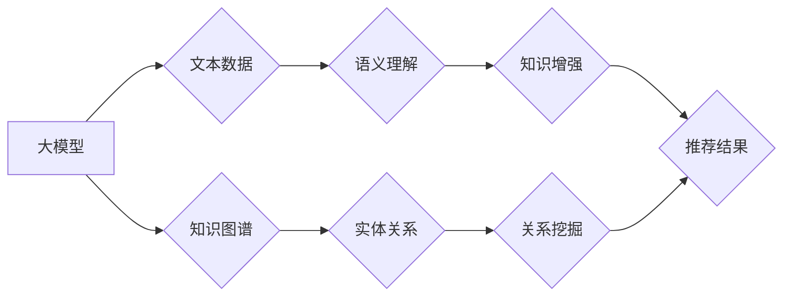

                 

## 大模型推荐中的知识图谱融合应用新方式

> 关键词：大模型、知识图谱、推荐系统、融合应用、实体关系、语义理解

## 1. 背景介绍

推荐系统作为信息过滤和个性化服务的重要组成部分，在电商、社交媒体、新闻资讯等领域发挥着越来越重要的作用。传统的推荐系统主要依赖用户行为数据，例如点击、购买、评分等，但这些数据往往缺乏语义信息，难以捕捉用户潜在需求和兴趣。

近年来，大模型的快速发展为推荐系统带来了新的机遇。大模型凭借其强大的语义理解和知识表示能力，能够从文本数据中提取丰富的语义信息，提升推荐系统的精准度和个性化程度。知识图谱作为一种结构化的知识表示形式，能够有效地存储和组织实体和关系信息，为大模型提供更丰富的知识背景。

将大模型与知识图谱融合，可以构建更智能、更精准的推荐系统。这种融合方式能够有效地弥补大模型和知识图谱各自的不足，发挥各自的优势，从而实现推荐系统的性能提升。

## 2. 核心概念与联系

### 2.1  大模型

大模型是指参数规模庞大、训练数据海量的人工智能模型，通常拥有数十亿甚至数千亿个参数。大模型通过深度学习技术，能够学习到复杂的语义关系和模式，实现强大的文本理解、生成和推理能力。

### 2.2  知识图谱

知识图谱是一种结构化的知识表示形式，由实体、关系和属性组成。实体代表现实世界中的事物，关系描述实体之间的联系，属性提供实体的描述信息。知识图谱能够有效地存储和组织大量知识，并支持复杂的知识推理和查询。

### 2.3  融合应用

将大模型与知识图谱融合，可以实现以下几种应用方式：

* **知识增强:** 利用知识图谱丰富大模型的知识背景，提升大模型的语义理解能力和推荐精准度。
* **关系挖掘:** 通过大模型对文本数据进行分析，挖掘出用户兴趣和商品之间的潜在关系，为推荐提供更精准的依据。
* **个性化推荐:** 基于用户历史行为和知识图谱中的实体关系，为用户提供个性化的商品推荐。

**Mermaid 流程图**



## 3. 核心算法原理 & 具体操作步骤

### 3.1  算法原理概述

大模型与知识图谱融合的推荐算法通常基于以下原理：

* **嵌入式表示:** 将实体和关系映射到低维向量空间，以便大模型能够进行语义计算和关系推理。
* **知识蒸馏:** 利用大模型的知识，训练一个更小的知识图谱嵌入模型，提高模型的效率和可解释性。
* **多模态融合:** 将文本数据和知识图谱中的实体关系信息融合，构建更全面的用户兴趣模型。

### 3.2  算法步骤详解

1. **数据预处理:** 对文本数据进行清洗、分词、词向量化等预处理操作，并构建知识图谱。
2. **实体识别和关系抽取:** 利用大模型对文本数据进行实体识别和关系抽取，提取出用户兴趣相关的实体和关系。
3. **嵌入式表示学习:** 利用大模型训练实体和关系的嵌入式表示，并将其与知识图谱中的实体关系信息结合。
4. **推荐模型训练:** 基于融合后的实体关系信息和用户行为数据，训练推荐模型，例如基于深度学习的推荐模型。
5. **推荐结果输出:** 利用训练好的推荐模型，对用户进行个性化推荐。

### 3.3  算法优缺点

**优点:**

* 能够有效地利用知识图谱中的结构化知识，提升推荐系统的精准度和个性化程度。
* 能够捕捉用户潜在需求和兴趣，提供更精准的商品推荐。
* 能够提升大模型的语义理解能力和知识表示能力。

**缺点:**

* 知识图谱的构建和维护成本较高。
* 实体识别和关系抽取任务的准确率仍然存在提升空间。
* 融合算法的复杂度较高，需要专业的技术人员进行开发和维护。

### 3.4  算法应用领域

大模型与知识图谱融合的推荐算法在以下领域具有广泛的应用前景:

* **电商推荐:** 为用户推荐个性化的商品，提升用户购物体验。
* **新闻推荐:** 为用户推荐个性化的新闻资讯，满足用户信息需求。
* **社交媒体推荐:** 为用户推荐个性化的好友和内容，提升用户社交体验。
* **教育推荐:** 为学生推荐个性化的学习资源，提升学习效率。

## 4. 数学模型和公式 & 详细讲解 & 举例说明

### 4.1  数学模型构建

假设我们有一个知识图谱 $G = (E, R)$, 其中 $E$ 是实体集合，$R$ 是关系集合。每个实体 $e \in E$ 都有一个嵌入向量 $e_v \in R^d$, 每个关系 $r \in R$ 也有一个嵌入向量 $r_v \in R^d$.

### 4.2  公式推导过程

**实体关系嵌入:**

$$
r_v(e_1, e_2) = f(e_1_v, e_2_v, r_v)
$$

其中 $f$ 是一个非线性函数，例如多层感知机 (MLP)。

**知识增强:**

$$
e_v' = e_v + \sum_{r \in R(e)} \alpha_r \cdot r_v
$$

其中 $R(e)$ 是实体 $e$ 所参与的关系集合，$\alpha_r$ 是关系 $r$ 的权重。

### 4.3  案例分析与讲解

**举例说明:**

假设我们有一个知识图谱，其中实体包括 "张三"、"李四"、"北京"、"上海"，关系包括 "居住在"、 "工作在"。

* 实体嵌入: 将 "张三"、"李四"、"北京"、"上海" 映射到低维向量空间，例如 $d = 100$.
* 关系嵌入: 将 "居住在"、 "工作在" 映射到低维向量空间。
* 知识增强: 利用 "张三" 和 "居住在" 的关系嵌入，更新 "张三" 的实体嵌入向量。

## 5. 项目实践：代码实例和详细解释说明

### 5.1  开发环境搭建

* Python 3.7+
* PyTorch 1.7+
* TensorFlow 2.0+
* CUDA 10.2+
* GPU

### 5.2  源代码详细实现

```python
import torch
import torch.nn as nn

class KG_Embedding(nn.Module):
    def __init__(self, embedding_dim, num_entities, num_relations):
        super(KG_Embedding, self).__init__()
        self.entity_embeddings = nn.Embedding(num_entities, embedding_dim)
        self.relation_embeddings = nn.Embedding(num_relations, embedding_dim)

    def forward(self, entities, relations):
        entity_embeddings = self.entity_embeddings(entities)
        relation_embeddings = self.relation_embeddings(relations)
        return entity_embeddings, relation_embeddings

# ... 其他代码实现 ...
```

### 5.3  代码解读与分析

* `KG_Embedding` 类定义了一个知识图谱嵌入模型，包含实体嵌入层和关系嵌入层。
* `forward` 方法接收实体和关系的输入，并返回对应的嵌入向量。

### 5.4  运行结果展示

* 通过训练模型，可以得到实体和关系的嵌入向量。
* 利用这些嵌入向量，可以进行知识推理、关系挖掘和推荐等任务。

## 6. 实际应用场景

### 6.1  电商推荐

* 利用知识图谱中的商品属性和用户购买历史，为用户推荐个性化的商品。
* 挖掘用户兴趣和商品之间的潜在关系，例如 "用户喜欢购买 A 类商品，也可能喜欢购买 B 类商品"。

### 6.2  新闻推荐

* 利用知识图谱中的新闻主题和用户阅读历史，为用户推荐个性化的新闻资讯。
* 挖掘新闻之间的相关性，例如 "新闻 A 和新闻 B 涉及相同的事件"。

### 6.3  社交媒体推荐

* 利用知识图谱中的用户兴趣和社交关系，为用户推荐个性化的好友和内容。
* 挖掘用户兴趣和好友之间的潜在关系，例如 "用户 A 和用户 B 共同关注的主题"。

### 6.4  未来应用展望

* **多模态融合:** 将文本数据、图像数据、视频数据等多模态信息融合，构建更全面的用户兴趣模型。
* **动态知识更新:** 利用实时数据更新知识图谱，使推荐系统更加实时和精准。
* **个性化解释:** 为用户提供推荐结果的解释，提升用户对推荐系统的信任度。

## 7. 工具和资源推荐

### 7.1  学习资源推荐

* **书籍:**
    * 《深度学习》 by Ian Goodfellow, Yoshua Bengio, Aaron Courville
    * 《自然语言处理》 by Dan Jurafsky, James H. Martin
* **在线课程:**
    * Coursera: Deep Learning Specialization
    * Stanford CS224N: Natural Language Processing with Deep Learning

### 7.2  开发工具推荐

* **框架:**
    * PyTorch
    * TensorFlow
* **库:**
    * SpaCy
    * NLTK
* **知识图谱工具:**
    * Neo4j
    * RDF4J

### 7.3  相关论文推荐

* **Knowledge Graph Embedding:**
    * TransE: Modeling Relational Data with Embeddings
    * RotatE: Knowledge Graph Embedding by Relational Rotation in Complex Space
* **Recommender Systems:**
    * Collaborative Filtering for Implicit Feedback Datasets
    * Deep Learning for Recommender Systems


## 8. 总结：未来发展趋势与挑战

### 8.1  研究成果总结

大模型与知识图谱融合的推荐算法取得了显著的成果，能够有效地提升推荐系统的精准度和个性化程度。

### 8.2  未来发展趋势

* **更强大的大模型:** 随着大模型技术的不断发展，将会有更强大的大模型应用于推荐系统，提升推荐系统的性能。
* **更丰富的知识图谱:** 知识图谱的规模和丰富程度将不断提升，为推荐系统提供更全面的知识背景。
* **更智能的融合算法:** 将会有更智能的融合算法被开发出来，更好地融合大模型和知识图谱的优势。

### 8.3  面临的挑战

* **数据质量:** 知识图谱的构建和维护需要高质量的数据，而高质量数据的获取和维护成本较高。
* **算法复杂度:** 融合大模型和知识图谱的算法往往比较复杂，需要专业的技术人员进行开发和维护。
* **可解释性:** 大模型的决策过程往往难以解释，这可能会影响用户对推荐系统的信任度。

### 8.4  研究展望

未来，大模型与知识图谱融合的推荐算法将朝着更智能、更精准、更可解释的方向发展。

## 9. 附录：常见问题与解答

* **Q1: 大模型与知识图谱融合的推荐算法相比于传统的推荐算法有什么优势？**

* **A1:** 大模型与知识图谱融合的推荐算法能够有效地利用知识图谱中的结构化知识，提升推荐系统的精准度和个性化程度。

* **Q2: 如何构建一个高质量的知识图谱？**

* **A2:** 构建高质量的知识图谱需要从多个方面入手，例如数据收集、数据清洗、实体识别、关系抽取等。

* **Q3: 大模型与知识图谱融合的推荐算法有哪些应用场景？**

* **A3:** 大模型与知识图谱融合的推荐算法在电商推荐、新闻推荐、社交媒体推荐等领域具有广泛的应用前景。


作者：禅与计算机程序设计艺术 / Zen and the Art of Computer Programming<end_of_turn>

