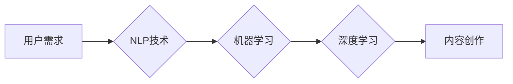

                 

## 如何利用技术能力进行内容创作

> 关键词：人工智能、内容创作、自然语言处理、机器学习、深度学习、文本生成、代码生成、工具推荐

## 1. 背景介绍

在数字时代，内容是王道。无论是新闻、博客、社交媒体还是商业营销，高质量的内容都至关重要。然而，内容创作是一个耗时费力的过程，需要大量的创意、写作技巧和专业知识。随着人工智能技术的飞速发展，越来越多的工具和平台利用人工智能技术辅助内容创作，为人们提供了一种更便捷、高效的方式。

## 2. 核心概念与联系

### 2.1 自然语言处理 (NLP)

自然语言处理 (NLP) 是人工智能的一个分支，致力于使计算机能够理解、处理和生成人类语言。NLP 涉及许多技术，例如：

* **词法分析:** 将文本分解成单词或短语。
* **语法分析:** 分析文本的语法结构。
* **语义分析:** 理解文本的含义。
* **文本生成:** 生成新的文本内容。

### 2.2 机器学习 (ML) 和深度学习 (DL)

机器学习 (ML) 和深度学习 (DL) 是人工智能的核心技术，它们使计算机能够从数据中学习模式和规律。在内容创作领域，ML 和 DL 可以用于：

* **文本分类:** 将文本归类到不同的类别。
* **文本摘要:** 生成文本的简短摘要。
* **机器翻译:** 将文本从一种语言翻译成另一种语言。
* **风格迁移:** 将文本改写成不同的风格。

**核心概念与联系流程图:**



## 3. 核心算法原理 & 具体操作步骤

### 3.1 算法原理概述

文本生成算法的核心是利用统计模型预测下一个词的出现概率。常见的文本生成算法包括：

* **n-gram 模型:** 基于词序列的统计规律预测下一个词。
* **循环神经网络 (RNN):** 能够处理序列数据，并学习长距离依赖关系。
* **Transformer:** 基于注意力机制，能够更有效地捕捉文本中的语义关系。

### 3.2 算法步骤详解

以 Transformer 为例，文本生成步骤如下：

1. **词嵌入:** 将文本中的每个词转换为向量表示。
2. **编码器:** 将输入文本序列编码成一个上下文向量。
3. **解码器:** 根据上下文向量和已生成的文本序列，预测下一个词的概率分布。
4. **采样:** 从概率分布中采样得到下一个词。
5. **重复步骤 3 和 4，直到生成指定长度的文本。**

### 3.3 算法优缺点

**优点:**

* 能够生成流畅、自然的文本。
* 可以学习复杂的语言模式和语义关系。

**缺点:**

* 需要大量的训练数据。
* 计算成本较高。
* 难以控制生成的文本内容。

### 3.4 算法应用领域

* **机器翻译:** 将文本从一种语言翻译成另一种语言。
* **文本摘要:** 生成文本的简短摘要。
* **聊天机器人:** 与用户进行自然语言对话。
* **内容创作:** 生成新闻报道、故事、诗歌等各种文本内容。

## 4. 数学模型和公式 & 详细讲解 & 举例说明

### 4.1 数学模型构建

Transformer 模型的核心是注意力机制，它允许模型关注输入序列中与当前词相关的部分。注意力机制的数学模型可以表示为：

$$
Attention(Q, K, V) = softmax(\frac{QK^T}{\sqrt{d_k}})V
$$

其中：

* $Q$ 是查询矩阵。
* $K$ 是键矩阵。
* $V$ 是值矩阵。
* $d_k$ 是键向量的维度。

### 4.2 公式推导过程

注意力机制的 softmax 函数用于计算每个键向量与查询向量的相似度，并将其归一化到一个概率分布。然后，将概率分布与值矩阵相乘，得到每个词的加权和，作为该词的上下文表示。

### 4.3 案例分析与讲解

例如，假设我们有一个句子 "The cat sat on the mat"，我们想要生成下一个词。

* $Q$ 是当前词 "mat" 的词嵌入向量。
* $K$ 是所有词的词嵌入向量。
* $V$ 是所有词的词嵌入向量。

注意力机制会计算每个词与 "mat" 的相似度，并得到一个概率分布。例如，"cat" 的相似度可能较高，因此 "cat" 的值向量在加权和中会占更大的比例。最终，模型会根据加权和预测下一个词的概率分布，例如 "The"、"dog"、"table" 等。

## 5. 项目实践：代码实例和详细解释说明

### 5.1 开发环境搭建

* Python 3.7+
* TensorFlow 或 PyTorch
* CUDA 和 cuDNN (可选，用于 GPU 加速)

### 5.2 源代码详细实现

```python
import tensorflow as tf

# 定义 Transformer 模型
class Transformer(tf.keras.Model):
    def __init__(self, vocab_size, embedding_dim, num_heads, num_layers):
        super(Transformer, self).__init__()
        self.embedding = tf.keras.layers.Embedding(vocab_size, embedding_dim)
        self.transformer_layers = tf.keras.layers.StackedRNNCells([
            tf.keras.layers.Attention(num_heads=num_heads)
            for _ in range(num_layers)
        ])

    def call(self, inputs):
        # 词嵌入
        embedded = self.embedding(inputs)
        # Transformer 层
        output = self.transformer_layers(embedded)
        return output

# 实例化模型
model = Transformer(vocab_size=10000, embedding_dim=128, num_heads=8, num_layers=6)

# 训练模型
# ...

# 生成文本
# ...
```

### 5.3 代码解读与分析

* **词嵌入:** 将每个词转换为向量表示，以便模型理解。
* **Transformer 层:** 利用注意力机制学习文本序列中的语义关系。
* **训练模型:** 使用训练数据训练模型，使其能够预测下一个词的概率分布。
* **生成文本:** 根据训练好的模型，输入一个词或短语，模型会预测下一个词，并以此类推，生成一段文本。

### 5.4 运行结果展示

训练好的模型可以用于生成各种文本内容，例如：

* **新闻报道:**

> "当地时间 2023 年 10 月 26 日，中国成功发射了新的载人飞船，标志着中国航天事业迈上了新的台阶。"

* **故事:**

> "在一个遥远的星球上，住着一只名叫皮皮的小狗。皮皮非常聪明，它喜欢探索未知的世界。"

* **诗歌:**

> "秋风萧瑟，落叶飘零，
> 月色朦胧，夜空星闪。"

## 6. 实际应用场景

### 6.1 内容营销

* **自动生成广告文案:** 根据目标受众和产品信息，自动生成吸引人的广告文案。
* **创作社交媒体内容:** 自动生成引人入胜的帖子、评论和回复，提高社交媒体互动率。
* **撰写博客文章:** 根据关键词和主题，自动生成高质量的博客文章，节省时间和精力。

### 6.2 教育培训

* **自动生成学习材料:** 根据课程内容，自动生成习题、练习题和测试题。
* **个性化学习辅导:** 根据学生的学习进度和水平，自动生成个性化的学习辅导内容。
* **虚拟教学助手:** 利用聊天机器人技术，为学生提供24小时的学习辅导和答疑服务。

### 6.3 文艺创作

* **辅助诗歌创作:** 根据主题和风格，自动生成诗歌的开头或结尾，激发创作灵感。
* **创作剧本:** 根据故事梗概，自动生成剧本的对话和场景描述。
* **生成音乐歌词:** 根据音乐风格和旋律，自动生成歌词。

### 6.4 未来应用展望

随着人工智能技术的不断发展，内容创作将更加智能化、个性化和自动化。未来，我们可以期待：

* **更流畅、更自然的文本生成:** 模型能够更好地理解和模仿人类的语言表达方式。
* **更个性化的内容创作:** 模型能够根据用户的喜好和需求，生成定制化的内容。
* **跨模态内容创作:** 模型能够生成不仅仅是文本，还包括图像、音频和视频等多种形式的内容。

## 7. 工具和资源推荐

### 7.1 学习资源推荐

* **斯坦福大学 CS224N 自然语言处理课程:** https://web.stanford.edu/class/cs224n/
* **Hugging Face Transformers 库:** https://huggingface.co/transformers/
* **OpenAI GPT-3 API:** https://openai.com/api/

### 7.2 开发工具推荐

* **TensorFlow:** https://www.tensorflow.org/
* **PyTorch:** https://pytorch.org/
* **Jupyter Notebook:** https://jupyter.org/

### 7.3 相关论文推荐

* **Attention Is All You Need:** https://arxiv.org/abs/1706.03762
* **BERT: Pre-training of Deep Bidirectional Transformers for Language Understanding:** https://arxiv.org/abs/1810.04805

## 8. 总结：未来发展趋势与挑战

### 8.1 研究成果总结

近年来，人工智能在内容创作领域取得了显著进展，特别是 Transformer 模型的出现，使得文本生成更加流畅自然。

### 8.2 未来发展趋势

未来，内容创作将更加智能化、个性化和自动化。

* **更强大的模型:** 模型参数规模将进一步扩大，能够学习更复杂的语言模式和语义关系。
* **多模态内容创作:** 模型将能够生成不仅仅是文本，还包括图像、音频和视频等多种形式的内容。
* **个性化内容创作:** 模型将能够根据用户的喜好和需求，生成定制化的内容。

### 8.3 面临的挑战

* **数据质量:** 模型的性能取决于训练数据的质量，高质量的数据是训练模型的关键。
* **伦理问题:** 内容创作的自动化可能会带来一些伦理问题，例如内容的真实性、原创性和偏见问题。
* **可解释性:** 许多深度学习模型的决策过程难以解释，这可能会导致人们对模型的信任度降低。

### 8.4 研究展望

未来研究方向包括：

* 开发更强大的、更可解释的文本生成模型。
* 研究内容创作的伦理问题，并制定相应的规范和标准。
* 探索多模态内容创作的新方法和技术。

## 9. 附录：常见问题与解答

**Q1: 如何选择合适的文本生成模型？**

**A1:** 选择合适的模型取决于具体的应用场景和需求。例如，对于需要生成流畅、自然的文本，可以选择 Transformer 模型；对于需要快速生成文本，可以选择 RNN 模型。

**Q2: 如何训练文本生成模型？**

**A2:** 训练文本生成模型需要大量的文本数据和计算资源。可以使用开源的预训练模型进行微调，也可以从头开始训练模型。

**Q3: 如何避免文本生成模型生成低质量或不准确的文本？**

**A3:** 提高文本生成模型的质量需要从以下几个方面入手：

* 使用高质量的训练数据。
* 优化模型的架构和参数。
* 使用适当的评估指标进行模型评估。

**Q4: 文本生成模型会取代人类作家吗？**

**A4:** 文本生成模型可以辅助人类作家完成一些重复性的工作，例如生成草稿或翻译文本，但它并不能完全取代人类作家。人类作家拥有创造力和想象力，能够创作出独一无二的文本内容。


作者：禅与计算机程序设计艺术 / Zen and the Art of Computer Programming 
<end_of_turn>

