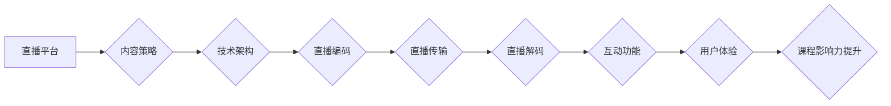

                 

## 如何利用直播平台增加课程影响

> 关键词：直播平台、课程影响力、互动式学习、数据分析、内容策略、技术架构、用户体验

## 1. 背景介绍

在线教育的蓬勃发展为学习者提供了更加灵活、便捷的学习方式。然而，传统的在线课程模式往往缺乏互动性，难以激发学生的学习兴趣和参与度。直播平台的出现为在线教育带来了新的机遇，其实时互动、即时反馈的特点能够有效提升课程的吸引力和影响力。

直播平台的优势在于：

* **实时互动:** 直播平台允许老师与学生进行实时互动，解答学生疑问，进行即时反馈，增强学习的参与感和积极性。
* **增强参与度:** 直播平台可以通过弹幕、投票、问答等互动功能，提高学生的参与度，使学习不再单向被动。
* **内容多样化:** 直播平台可以融合多种内容形式，例如视频、音频、文字、图片等，使课程内容更加丰富多彩，更易于理解和记忆。
* **数据分析:** 直播平台可以收集学生观看、互动、反馈等数据，帮助老师了解学生的学习情况，及时调整教学策略，提高课程效果。

## 2. 核心概念与联系

直播平台的应用在课程影响力提升方面，主要涉及以下核心概念：

* **互动式学习:** 直播平台通过实时互动、即时反馈等方式，将学习过程转变为一种积极参与的体验，增强学生的学习兴趣和主动性。
* **内容策略:**  针对不同目标人群和课程内容，制定合理的直播内容策略，包括直播主题、时长、频率、互动方式等，以最大化课程的影响力。
* **技术架构:** 直播平台需要具备稳定的技术架构，包括直播编码、传输、解码、互动功能等，以确保直播的流畅性和稳定性。
* **用户体验:**  良好的用户体验是直播平台成功的关键，包括直播界面设计、互动功能便捷性、观看体验流畅度等。

**Mermaid 流程图:**



## 3. 核心算法原理 & 具体操作步骤

### 3.1  算法原理概述

直播平台的核心算法主要涉及以下几个方面：

* **视频编码算法:** 将视频信号压缩成更小的数据包，以便高效传输。常见的视频编码算法包括H.264、H.265等。
* **音频编码算法:** 将音频信号压缩成更小的数据包，以便高效传输。常见的音频编码算法包括AAC、MP3等。
* **直播流传输协议:**  用于传输直播视频和音频数据，常见的协议包括RTMP、WebRTC等。
* **互动功能实现算法:**  实现直播平台的弹幕、投票、问答等互动功能，需要使用消息队列、数据库等技术。

### 3.2  算法步骤详解

1. **视频采集:** 使用摄像头采集视频信号。
2. **视频编码:** 使用视频编码算法将视频信号压缩成数据包。
3. **音频采集:** 使用麦克风采集音频信号。
4. **音频编码:** 使用音频编码算法将音频信号压缩成数据包。
5. **数据打包:** 将视频和音频数据包打包成直播流数据。
6. **流传输:** 使用直播流传输协议将直播流数据传输到直播平台服务器。
7. **数据解码:** 直播平台服务器使用相应的解码算法将直播流数据解码成视频和音频信号。
8. **视频和音频播放:** 直播平台将解码后的视频和音频信号播放给观看者。
9. **互动功能处理:** 直播平台处理观看者的互动请求，例如弹幕、投票、问答等，并及时反馈给观看者。

### 3.3  算法优缺点

**优点:**

* **实时性强:** 直播平台能够实现实时视频和音频传输，满足用户对实时交互的需求。
* **互动性高:** 直播平台可以通过多种互动功能，增强用户参与度和学习体验。
* **内容丰富:** 直播平台可以融合多种内容形式，使课程内容更加丰富多彩。

**缺点:**

* **技术复杂:** 直播平台的建设和维护需要复杂的网络技术和服务器架构。
* **带宽需求高:** 直播平台需要较高的带宽资源，才能保证直播的流畅性。
* **延迟问题:** 直播平台可能会出现延迟问题，影响用户体验。

### 3.4  算法应用领域

直播平台的应用领域非常广泛，除了在线教育之外，还包括：

* **直播电商:**  商家通过直播平台展示商品，与消费者进行实时互动，促进商品销售。
* **游戏直播:**  玩家通过直播平台分享游戏过程，与其他玩家互动，建立社区。
* **音乐直播:**  音乐人通过直播平台进行音乐表演，与粉丝互动，推广音乐作品。
* **新闻直播:**  媒体机构通过直播平台进行新闻报道，及时传递信息，增强新闻的影响力。

## 4. 数学模型和公式 & 详细讲解 & 举例说明

### 4.1  数学模型构建

直播平台的课程影响力可以看作是一个复杂的系统，其影响力大小取决于多个因素的综合作用。我们可以构建一个数学模型来描述这些因素之间的关系：

$$
Influence = f(Content, Interaction, Technology, UserExperience)
$$

其中：

* **Influence:** 课程影响力
* **Content:** 课程内容质量
* **Interaction:** 互动程度
* **Technology:** 技术架构质量
* **UserExperience:** 用户体验

### 4.2  公式推导过程

由于课程影响力是一个多因素综合影响的结果，很难用一个简单的公式精确描述。我们可以通过分析每个因素对课程影响力的贡献度，并建立相应的数学模型来进行量化分析。

例如，我们可以假设课程内容质量对课程影响力的贡献度为α，互动程度对课程影响力的贡献度为β，技术架构质量对课程影响力的贡献度为γ，用户体验对课程影响力的贡献度为δ。那么，我们可以将公式简化为：

$$
Influence = α * Content + β * Interaction + γ * Technology + δ * UserExperience
$$

### 4.3  案例分析与讲解

假设我们有一个在线编程课程，其内容质量较高，互动程度也比较高，但技术架构存在一些问题，导致直播体验不佳。在这种情况下，我们可以通过分析公式来判断课程影响力的主要制约因素。

由于α和β的值都比较高，说明课程内容质量和互动程度对课程影响力有较大的贡献。而γ的值较低，说明技术架构问题对课程影响力有一定的制约。因此，为了提升课程影响力，我们需要重点解决技术架构问题，提高直播体验。

## 5. 项目实践：代码实例和详细解释说明

### 5.1  开发环境搭建

直播平台的开发环境搭建需要考虑以下几个方面：

* **操作系统:**  可以选择Linux或Windows操作系统。
* **编程语言:**  常用的编程语言包括Java、Python、Go等。
* **数据库:**  可以选择MySQL、MongoDB等数据库。
* **消息队列:**  可以选择Kafka、RabbitMQ等消息队列。
* **直播流传输协议:**  可以选择RTMP、WebRTC等协议。

### 5.2  源代码详细实现

由于直播平台的代码实现非常复杂，这里只提供一个简单的直播流传输代码示例，使用Python语言和RTMP协议：

```python
import rtmplib

# 连接到RTMP服务器
server_url = "rtmp://your_rtmp_server_address"
stream_name = "your_stream_name"
client = rtmplib.RTMPClient(server_url)
client.connect()

# 发布直播流
client.publish(stream_name)

# 发送视频和音频数据
# ...

# 断开连接
client.close()
```

### 5.3  代码解读与分析

这段代码使用rtmplib库连接到RTMP服务器，并发布一个名为"your_stream_name"的直播流。

* `rtmplib.RTMPClient(server_url)`: 创建一个RTMP客户端对象，连接到指定的RTMP服务器地址。
* `client.connect()`: 连接到RTMP服务器。
* `client.publish(stream_name)`: 发布一个名为"your_stream_name"的直播流。
* `# 发送视频和音频数据`: 需要根据具体的视频和音频数据格式，使用相应的代码进行发送。
* `client.close()`: 断开连接到RTMP服务器。

### 5.4  运行结果展示

运行这段代码后，将会连接到RTMP服务器，并发布一个名为"your_stream_name"的直播流。

## 6. 实际应用场景

### 6.1  在线教育平台

在线教育平台可以利用直播平台进行在线课程直播，提高课程的互动性和参与度。例如，老师可以通过直播平台解答学生疑问，进行实时反馈，并与学生进行互动讨论。

### 6.2  企业培训平台

企业培训平台可以利用直播平台进行内部培训，提高培训的效率和效果。例如，公司可以邀请专家进行线上直播培训，并与员工进行互动交流。

### 6.3  个人知识分享平台

个人知识分享平台可以利用直播平台进行知识分享，扩大知识传播的影响力。例如，个人可以利用直播平台分享自己的学习经验、技能技巧等。

### 6.4  未来应用展望

随着直播技术的不断发展，直播平台在课程影响力提升方面的应用场景将会更加广泛。例如，未来可能会出现：

* **虚拟现实直播:**  利用虚拟现实技术，打造沉浸式的直播体验，使学习者身临其境。
* **人工智能直播:**  利用人工智能技术，实现智能化的直播互动，例如自动生成字幕、智能问答等。
* **个性化直播:**  根据学生的学习情况和兴趣爱好，定制个性化的直播课程内容。

## 7. 工具和资源推荐

### 7.1  学习资源推荐

* **直播平台技术文档:**  各大直播平台都提供详细的技术文档，可以帮助开发者了解直播平台的架构、功能和接口。
* **开源直播平台项目:**  例如Open Broadcaster Software (OBS)、FFmpeg等，可以帮助开发者学习直播平台的开发技术。
* **在线课程:**  例如Coursera、Udemy等平台上，提供有关直播平台技术和开发的在线课程。

### 7.2  开发工具推荐

* **IDE:**  例如Eclipse、IntelliJ IDEA等，可以帮助开发者编写和调试直播平台代码。
* **调试工具:**  例如GDB、LLDB等，可以帮助开发者调试直播平台代码。
* **网络监控工具:**  例如Wireshark、tcpdump等，可以帮助开发者监控直播流的传输情况。

### 7.3  相关论文推荐

* **Real-Time Video Streaming over the Internet:**  介绍了实时视频流传输的技术原理和方法。
* **Low-Latency Video Streaming for Interactive Applications:**  介绍了低延迟视频流传输的技术，适用于互动式直播应用。
* **Adaptive Bitrate Streaming for Video on Demand:**  介绍了自适应码率流媒体技术，可以根据网络带宽动态调整视频码率，保证流畅播放。

## 8. 总结：未来发展趋势与挑战

### 8.1  研究成果总结

直播平台在课程影响力提升方面取得了显著的成果，例如：

* **提高了课程的互动性和参与度:** 直播平台的实时互动功能，可以增强学生的学习兴趣和积极性。
* **丰富了课程内容形式:** 直播平台可以融合多种内容形式，使课程内容更加生动有趣。
* **提高了课程的效率和效果:** 直播平台可以帮助老师及时解答学生疑问，并根据学生的学习情况进行调整教学策略。

### 8.2  未来发展趋势

直播平台在未来将继续朝着以下几个方向发展：

* **更加智能化:** 利用人工智能技术，实现智能化的直播互动，例如自动生成字幕、智能问答等。
* **更加个性化:** 根据学生的学习情况和兴趣爱好，定制个性化的直播课程内容。
* **更加沉浸式:** 利用虚拟现实技术，打造沉浸式的直播体验，使学习者身临其境。

### 8.3  面临的挑战

直播平台的发展也面临着一些挑战：

* **技术复杂性:** 直播平台的建设和维护需要复杂的网络技术和服务器架构。
* **带宽需求高:** 直播平台需要较高的带宽资源，才能保证直播的流畅性。
* **延迟问题:** 直播平台可能会出现延迟问题，影响用户体验。
* **内容质量控制:**  需要建立有效的机制，保证直播内容的质量和安全性。

### 8.4  研究展望

未来，我们需要继续研究直播平台的技术架构、互动功能、用户体验等方面，以解决直播平台面临的挑战，并推动直播平台在课程影响力提升方面的应用。


## 9. 附录：常见问题与解答

### 9.1  直播平台的带宽需求如何计算？

直播平台的带宽需求取决于多个因素，例如直播视频分辨率、码率、直播人数等。一般来说，可以根据以下公式进行估算：

$$
Bandwidth = Resolution * FrameRate * Bitrate * NumberOfUsers
$$

其中：

* **Resolution:** 视频分辨率，例如720p、1080p等。
* **FrameRate:** 视频帧率，例如24fps、30fps等。
* **Bitrate:** 视频码率，例如2Mbps、5Mbps等。
* **NumberOfUsers:** 直播观看人数。

### 9.2  如何解决直播平台的延迟问题？

直播平台的延迟问题可以通过以下几种方法解决：

* **优化网络架构:**  使用低延迟的网络协议和传输路径。
* **使用边缘计算:** 将直播内容处理和传输部署到更靠近用户的边缘节点。
* **使用缓存技术:**  将直播内容缓存到用户的本地设备或CDN节点，减少网络传输延迟。

### 9.3  如何保证直播平台内容的质量和安全性？

直播平台需要建立有效的机制，保证直播内容的质量和安全性，例如：

* **内容审核:**  对直播内容进行审核，过滤违规内容。
* **用户认证:**  对直播用户进行身份认证，防止恶意用户发布虚假信息。
* **数据加密:**  对直播数据进行加密，防止数据泄露。


作者：禅与计算机程序设计艺术 / Zen and the Art of Computer Programming 
<end_of_turn>

