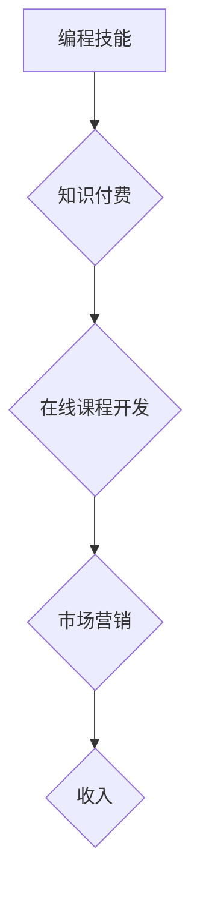

                 

# 如何将编程技能转化为高利润的在线课程

> 关键词：编程技能、在线课程、知识付费、课程开发、市场营销、技术趋势、教学设计、收入模式

## 1. 背景介绍

在当今数字时代，编程技能已成为一项炙手可热的技能，其应用领域不断扩展，对人才的需求也日益增长。作为一名拥有丰富编程经验的专业人士，你可能已经积累了宝贵的知识和技能，但如何将这些知识转化为可观的收入呢？开发和销售在线编程课程是一个极具潜力的选择。

在线教育市场近年来蓬勃发展，人们越来越倾向于通过线上平台学习新技能。编程领域也不例外，越来越多的学习者通过在线课程来掌握编程知识和技能。这为拥有编程技能的专业人士提供了将知识变现的绝佳机会。

## 2. 核心概念与联系

### 2.1 知识付费

知识付费是指将知识、技能或经验等知识产权以付费的方式提供给学习者。在线课程作为一种知识付费模式，通过提供高质量的学习内容和服务，为学习者提供价值，并获得相应的收益。

### 2.2 在线课程开发

在线课程开发是指将知识和技能以数字化形式打包成可供在线学习的课程。这包括课程内容的策划、录制、编辑、制作和发布等环节。

### 2.3 市场营销

市场营销是指通过各种渠道推广和销售在线课程，吸引目标学习者。这包括课程宣传、广告投放、社交媒体营销、内容营销等策略。

**Mermaid 流程图**



## 3. 核心算法原理 & 具体操作步骤

### 3.1 算法原理概述

在线课程开发是一个系统工程，需要遵循一定的算法和步骤来确保课程质量和市场竞争力。

**课程开发算法**

1. **需求分析:** 首先要明确目标学习者的需求，包括他们的学习目标、知识水平、学习习惯等。
2. **内容策划:** 根据需求分析结果，制定课程内容框架，确定课程主题、章节结构、学习内容等。
3. **内容制作:** 将课程内容以视频、音频、文本、图片等多种形式制作出来，并进行编辑和排版。
4. **平台发布:** 将课程上传到在线学习平台，设置课程价格、销售模式等。
5. **推广营销:** 通过各种渠道推广课程，吸引目标学习者。
6. **学员服务:** 提供学员咨询、答疑、反馈等服务，提升学员学习体验。

### 3.2 算法步骤详解

**需求分析:**

* **市场调研:** 分析目标学习者的需求、竞争对手的课程内容、市场趋势等。
* **问卷调查:** 对目标学习者进行问卷调查，了解他们的学习目标、知识水平、学习习惯等。
* **访谈:** 对目标学习者进行访谈，深入了解他们的需求和痛点。

**内容策划:**

* **确定课程主题:** 选择一个有市场需求、符合自身专业特长的课程主题。
* **制定课程框架:** 将课程内容按照逻辑顺序划分章节，并确定每个章节的学习目标和内容。
* **撰写课程脚本:** 为每个章节编写详细的课程脚本，包括讲解内容、案例分析、练习题等。

**内容制作:**

* **录制视频:** 使用专业的摄像设备和软件录制课程视频，确保画面清晰、音质优良。
* **制作音频:** 使用专业的录音设备和软件录制课程音频，确保音质清晰、朗朗上口。
* **编写文本:** 将课程内容以文本形式编写出来，并进行排版和编辑。

**平台发布:**

* **选择平台:** 选择合适的在线学习平台，例如 Udemy、Coursera、Skillshare 等。
* **上传课程:** 将课程内容上传到平台，并设置课程价格、销售模式等。
* **优化课程页面:** 制作吸引人的课程页面，包括课程介绍、课程内容、学员评价等。

**推广营销:**

* **社交媒体营销:** 在社交媒体平台上推广课程，例如 Facebook、Twitter、LinkedIn 等。
* **内容营销:** 创建博客文章、视频、音频等内容，分享课程知识和价值，吸引目标学习者。
* **付费广告:** 在 Google、Facebook 等平台投放付费广告，精准触达目标学习者。

**学员服务:**

* **在线答疑:** 提供在线答疑服务，解答学员的学习疑问。
* **学员论坛:** 建立学员论坛，方便学员交流学习心得和经验。
* **反馈收集:** 定期收集学员反馈，不断改进课程内容和教学质量。

### 3.3 算法优缺点

**优点:**

* **可重复利用:** 一旦开发完成，课程内容可以重复销售，获得持续的收入。
* **低成本运营:** 相比线下培训，在线课程运营成本更低。
* **全球化市场:** 在线课程可以面向全球学习者，扩大市场规模。

**缺点:**

* **课程开发成本高:** 开发高质量的在线课程需要投入大量时间和精力。
* **市场竞争激烈:** 在线课程市场竞争激烈，需要不断创新和提升课程质量。
* **学员粘性低:** 在线学习的学员粘性相对较低，需要不断提供优质服务和内容来提高学员留存率。

### 3.4 算法应用领域

在线课程开发算法广泛应用于各个领域，例如：

* **编程教育:** 教授编程语言、软件开发、数据科学等知识和技能。
* **职业技能培训:** 提供职场技能培训，例如沟通技巧、领导力、项目管理等。
* **个人兴趣爱好:** 分享个人兴趣爱好知识，例如摄影、绘画、音乐等。

## 4. 数学模型和公式 & 详细讲解 & 举例说明

### 4.1 数学模型构建

在线课程的收入模型可以抽象为一个数学模型：

**收入 = 课程价格 * 销售量**

其中：

* 课程价格：课程的单价。
* 销售量：课程的销售数量。

### 4.2 公式推导过程

为了最大化收入，需要考虑以下因素：

* **课程价格:** 课程价格需要根据市场需求、课程价值、竞争对手价格等因素进行设定。
* **销售量:** 销售量受课程质量、市场推广、学员体验等因素影响。

**优化目标:**

最大化收入

**优化变量:**

课程价格、销售量

**约束条件:**

课程成本、市场需求、竞争对手价格等

### 4.3 案例分析与讲解

假设有一门编程课程，其开发成本为 $1000，目标市场为 1000 名学习者。

* **方案一:** 课程价格设定为 $10，预计销售量为 500 名。
* **方案二:** 课程价格设定为 $20，预计销售量为 250 名。

**方案一收入:** $10 * 500 = $5000

**方案二收入:** $20 * 250 = $5000

从以上案例分析可以看出，在相同收入的情况下，两种方案的课程价格和销售量不同。

## 5. 项目实践：代码实例和详细解释说明

### 5.1 开发环境搭建

开发在线课程需要搭建相应的开发环境，包括：

* **电脑:** 具备足够的配置，能够流畅运行开发软件。
* **软件:** 录制视频、编辑音频、制作文本、上传课程等软件。
* **网络:** 稳定可靠的网络连接，确保视频录制、音频上传、课程发布等操作顺利进行。

### 5.2 源代码详细实现

由于在线课程开发涉及多个环节，每个环节的代码实现方式不同，这里只列举一个简单的视频录制和编辑代码示例：

```python
# 使用 OpenCV 库录制视频
import cv2

# 打开摄像头
cap = cv2.VideoCapture(0)

# 设置视频录制参数
fourcc = cv2.VideoWriter_fourcc(*'XVID')
out = cv2.VideoWriter('output.avi', fourcc, 20.0, (640, 480))

while(True):
    # 读取摄像头画面
    ret, frame = cap.read()

    # 写入视频文件
    out.write(frame)

    # 显示摄像头画面
    cv2.imshow('frame',frame)

    # 按 'q' 键退出
    if cv2.waitKey(1) & 0xFF == ord('q'):
        break

# 释放资源
cap.release()
out.release()
cv2.destroyAllWindows()
```

### 5.3 代码解读与分析

这段代码使用 OpenCV 库录制视频，并将其保存为 AVI 格式的文件。

* `cv2.VideoCapture(0)` 打开默认摄像头。
* `cv2.VideoWriter_fourcc(*'XVID')` 设置视频编码格式为 XVID。
* `cv2.VideoWriter('output.avi', fourcc, 20.0, (640, 480))` 创建视频写入对象，文件名、编码格式、帧率和分辨率。
* `while(True)` 循环读取摄像头画面，并将其写入视频文件。
* `cv2.waitKey(1)` 等待 1 毫秒，并检查键盘输入。
* `if cv2.waitKey(1) & 0xFF == ord('q'):` 如果按下 'q' 键，则退出循环。
* `cap.release()`, `out.release()`, `cv2.destroyAllWindows()` 释放资源。

### 5.4 运行结果展示

运行这段代码后，将录制视频保存为 `output.avi` 文件。

## 6. 实际应用场景

### 6.1 在线课程平台

在线课程平台是开发和销售在线课程的理想平台，例如 Udemy、Coursera、Skillshare 等。

### 6.2 个人网站

个人网站也可以作为销售在线课程的平台，例如博客、个人工作室网站等。

### 6.3 社交媒体

社交媒体平台，例如 Facebook、Twitter、LinkedIn 等，也可以作为推广和销售在线课程的渠道。

### 6.4 未来应用展望

随着互联网技术的不断发展，在线课程将更加普及和多元化。未来，在线课程将更加注重互动性和个性化，例如：

* **虚拟现实 (VR) 和增强现实 (AR) 技术:** 将 VR 和 AR 技术应用于在线课程，提供更加沉浸式的学习体验。
* **人工智能 (AI) 技术:** 利用 AI 技术个性化推荐课程、自动生成学习内容、提供智能答疑等。
* **区块链技术:** 利用区块链技术保障课程版权和学员证书的真实性。

## 7. 工具和资源推荐

### 7.1 学习资源推荐

* **Udacity:** https://www.udacity.com/
* **Coursera:** https://www.coursera.org/
* **edX:** https://www.edx.org/
* **Khan Academy:** https://www.khanacademy.org/

### 7.2 开发工具推荐

* **Camtasia:** https://www.techsmith.com/camtasia.html
* **OBS Studio:** https://obsproject.com/
* **Adobe Premiere Pro:** https://www.adobe.com/products/premiere.html
* **Canva:** https://www.canva.com/

### 7.3 相关论文推荐

* **The Impact of Online Learning on Student Achievement:** https://eric.ed.gov/?id=EJ1039917
* **A Review of Online Learning Theories and Models:** https://www.researchgate.net/publication/329544644_A_Review_of_Online_Learning_Theories_and_Models

## 8. 总结：未来发展趋势与挑战

### 8.1 研究成果总结

在线课程开发算法已经取得了显著的成果，为学习者提供了便捷、高效的学习方式，也为编程技能的传播和应用提供了新的平台。

### 8.2 未来发展趋势

未来，在线课程将更加注重互动性和个性化，将更加广泛地应用于各个领域。

### 8.3 面临的挑战

在线课程市场竞争激烈，需要不断创新和提升课程质量。同时，如何保障课程质量和学员权益也是一个需要解决的问题。

### 8.4 研究展望

未来，需要进一步研究在线课程的个性化推荐算法、互动学习模式、虚拟现实和增强现实技术应用等方面，以提升在线课程的学习效果和用户体验。

## 9. 附录：常见问题与解答

### 9.1 如何选择合适的在线学习平台？

选择在线学习平台需要考虑以下因素：

* **平台规模和用户群体:** 选择拥有大量用户和活跃社区的平台，可以获得更多学习资源和交流机会。
* **课程质量和内容:** 选择提供高质量课程的平台，课程内容要符合自己的学习目标和兴趣。
* **平台收费模式:** 选择适合自己的收费模式，例如订阅制、课程购买制等。

### 9.2 如何提高在线课程的学习效果？

提高在线课程的学习效果可以采取以下措施：

* **制定学习计划:** 制定合理的学习计划，并坚持执行。
* **积极参与互动:** 积极参与课程论坛、直播互动等活动，与老师和同学交流学习心得。
* **复习巩固:** 定期复习课程内容，并进行练习和测试。

### 9.3 如何推广和销售在线课程？

推广和销售在线课程可以采取以下措施：

* **社交媒体营销:** 在社交媒体平台上分享课程内容、宣传课程价值。
* **内容营销:** 创建博客文章、视频、音频等内容，分享课程知识和经验。
* **付费广告:** 在 Google、Facebook 等平台投放付费广告，精准触达目标学习者。


作者：禅与计算机程序设计艺术 / Zen and the Art of Computer Programming 
<end_of_turn>

