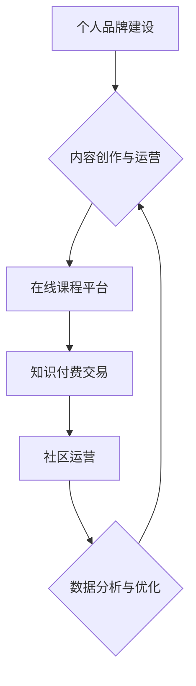

                 

## 如何打造个人知识付费商业帝国

> 关键词：知识付费、个人品牌、内容创作、在线课程、社区运营、商业模式、技术架构、数据分析

### 1. 背景介绍

知识经济时代，信息爆炸，知识成为最宝贵的资源。个人知识付费商业模式的兴起，为知识创作者提供了新的盈利途径，也为学习者提供了更高效、更个性化的学习方式。近年来，知识付费市场蓬勃发展，涌现出众多成功案例，例如罗辑思维、李开复、三剑客等。

### 2. 核心概念与联系

**2.1 知识付费商业模式**

知识付费商业模式是指知识创作者将自己的知识、技能、经验等以付费的方式提供给学习者，并从中获取收益的商业模式。

**2.2 个人品牌建设**

个人品牌是知识付费商业模式的基础。知识创作者需要通过持续输出优质内容、建立个人影响力、与粉丝互动等方式，打造自己的个人品牌。

**2.3 内容创作与运营**

优质内容是知识付费的核心驱动力。知识创作者需要根据目标受众的需求，创作具有价值、实用性和吸引力的内容。

**2.4 在线课程平台**

在线课程平台是知识付费商业模式的载体。知识创作者可以通过选择合适的平台，将自己的课程进行线上发布和销售。

**2.5 社区运营**

社区运营可以帮助知识创作者与粉丝建立更紧密的联系，形成知识付费生态圈。

**2.6 数据分析与优化**

数据分析可以帮助知识创作者了解用户的学习行为、内容偏好等信息，从而优化内容创作和运营策略。

**Mermaid 流程图**



### 3. 核心算法原理 & 具体操作步骤

**3.1 算法原理概述**

知识付费商业模式的核心算法原理是基于用户需求和内容价值的匹配机制。通过分析用户的学习行为、内容偏好等数据，推荐合适的课程和内容，提高用户学习体验和付费意愿。

**3.2 算法步骤详解**

1. **用户画像构建:** 收集用户的学习历史、兴趣爱好、职业背景等数据，构建用户画像。
2. **内容特征提取:** 对课程内容进行分析，提取关键词、主题、难度等级等特征。
3. **推荐算法:** 基于用户画像和内容特征，使用协同过滤、内容过滤、深度学习等推荐算法，推荐合适的课程和内容。
4. **个性化推荐:** 根据用户的学习进度、反馈等信息，进行个性化推荐，提高推荐精准度。
5. **持续优化:** 通过分析用户的学习行为和反馈，不断优化推荐算法和内容策略。

**3.3 算法优缺点**

**优点:**

* **提高用户体验:** 通过精准推荐，帮助用户找到感兴趣和有价值的内容。
* **提升付费转化率:** 推荐合适的课程，提高用户付费意愿。
* **促进内容传播:** 通过推荐机制，帮助优质内容获得更多曝光。

**缺点:**

* **数据依赖:** 推荐算法需要大量用户数据进行训练和优化。
* **算法偏差:** 推荐算法可能会存在偏差，导致推荐结果不准确。
* **用户隐私:** 用户数据收集和使用需要谨慎处理，保护用户隐私。

**3.4 算法应用领域**

* **在线教育平台:** 推荐课程、学习资源、学习计划等。
* **内容平台:** 推荐文章、视频、音频等内容。
* **电商平台:** 推荐商品、优惠活动等。
* **社交媒体:** 推荐好友、群组、话题等。

### 4. 数学模型和公式 & 详细讲解 & 举例说明

**4.1 数学模型构建**

知识付费商业模式的数学模型可以基于用户价值和内容价值的匹配度进行构建。

**用户价值:** 可以通过用户学习时长、学习进度、付费行为等指标进行量化。

**内容价值:** 可以通过内容的质量、受欢迎程度、用户评价等指标进行量化。

**匹配度:** 可以使用余弦相似度、皮尔逊相关系数等指标进行计算。

**4.2 公式推导过程**

假设用户 $u$ 的学习行为特征向量为 $u_f$, 内容 $c$ 的特征向量为 $c_f$, 则用户 $u$ 对内容 $c$ 的匹配度 $sim(u,c)$ 可以使用余弦相似度公式计算:

$$sim(u,c) = \frac{u_f \cdot c_f}{||u_f|| ||c_f||}$$

其中:

* $u_f \cdot c_f$ 表示用户 $u$ 和内容 $c$ 的点积。
* $||u_f||$ 和 $||c_f||$ 分别表示用户 $u$ 和内容 $c$ 的特征向量长度。

**4.3 案例分析与讲解**

假设一个用户 $u$ 的学习行为特征向量为 $[0.8, 0.5, 0.2]$, 一个内容 $c$ 的特征向量为 $[0.6, 0.7, 0.3]$, 则他们的匹配度为:

$$sim(u,c) = \frac{(0.8 \times 0.6) + (0.5 \times 0.7) + (0.2 \times 0.3)}{ \sqrt{0.8^2 + 0.5^2 + 0.2^2} \times \sqrt{0.6^2 + 0.7^2 + 0.3^2}} \approx 0.75$$

该结果表明用户 $u$ 和内容 $c$ 的匹配度较高，用户 $u$ 可能会对内容 $c$ 感兴趣。

### 5. 项目实践：代码实例和详细解释说明

**5.1 开发环境搭建**

* **操作系统:** Linux, macOS, Windows
* **编程语言:** Python
* **框架:** Flask, Django
* **数据库:** MySQL, PostgreSQL
* **云服务:** AWS, Azure, GCP

**5.2 源代码详细实现**

以下是一个简单的 Python 代码示例，演示如何使用 Flask 框架构建一个知识付费平台的 API 接口:

```python
from flask import Flask, request, jsonify

app = Flask(__name__)

# 模拟用户数据
users = {
    1: {"name": "用户1", "email": "user1@example.com"},
    2: {"name": "用户2", "email": "user2@example.com"},
}

# 模拟课程数据
courses = {
    1: {"title": "Python 入门", "price": 99},
    2: {"title": "机器学习基础", "price": 199},
}

@app.route('/users', methods=['GET'])
def get_users():
    return jsonify(users)

@app.route('/courses', methods=['GET'])
def get_courses():
    return jsonify(courses)

@app.route('/purchase', methods=['POST'])
def purchase_course():
    data = request.get_json()
    user_id = data.get('user_id')
    course_id = data.get('course_id')

    # 模拟购买逻辑
    if user_id and course_id:
        return jsonify({"message": "购买成功"})
    else:
        return jsonify({"error": "参数错误"}), 400

if __name__ == '__main__':
    app.run(debug=True)
```

**5.3 代码解读与分析**

* 该代码使用 Flask 框架构建了一个简单的 API 接口。
* `/users` 接口用于获取用户数据。
* `/courses` 接口用于获取课程数据。
* `/purchase` 接口用于模拟用户购买课程的逻辑。

**5.4 运行结果展示**

运行该代码后，可以使用 curl 或 Postman 等工具访问 API 接口，获取数据或模拟购买操作。

### 6. 实际应用场景

**6.1 在线教育平台**

知识付费商业模式广泛应用于在线教育平台，例如 Coursera, Udemy, edX 等。这些平台提供各种类型的在线课程，用户可以通过付费的方式学习。

**6.2 内容创作平台**

一些内容创作平台，例如 Medium, Substack, Patreon 等，也采用知识付费模式。内容创作者可以通过发布付费文章、视频、音频等内容，获取收益。

**6.3 个人品牌推广**

个人品牌可以通过知识付费模式，与粉丝建立更紧密的联系，并获取收益。例如，一些专家学者会通过线上课程、付费咨询等方式，推广自己的个人品牌。

**6.4 未来应用展望**

随着人工智能、虚拟现实等技术的不断发展，知识付费商业模式将更加多元化、个性化。例如，未来可能出现基于人工智能的个性化学习推荐、虚拟现实沉浸式学习体验等新模式。

### 7. 工具和资源推荐

**7.1 学习资源推荐**

* **书籍:**
    * 《知识付费商业模式》
    * 《互联网思维》
    * 《内容营销》
* **课程:**
    * Coursera: 知识付费商业模式
    * Udemy: 内容营销
* **博客:**
    * 知乎: 知识付费
    * 36氪: 互联网创业

**7.2 开发工具推荐**

* **编程语言:** Python, JavaScript
* **框架:** Flask, Django, React
* **数据库:** MySQL, PostgreSQL
* **云服务:** AWS, Azure, GCP

**7.3 相关论文推荐**

* **知识付费商业模式研究**
* **内容推荐算法**
* **数据分析与优化**

### 8. 总结：未来发展趋势与挑战

**8.1 研究成果总结**

知识付费商业模式已经成为一种重要的商业模式，为知识创作者和学习者提供了新的机遇。

**8.2 未来发展趋势**

* **个性化学习:** 基于人工智能和数据分析，提供更加个性化的学习体验。
* **沉浸式学习:** 利用虚拟现实、增强现实等技术，打造更加沉浸式的学习体验。
* **社区化学习:** 建立更加活跃的学习社区，促进知识共享和互动。

**8.3 面临的挑战**

* **内容质量:** 确保知识付费内容的质量和价值。
* **用户信任:** 建立用户对知识付费平台的信任。
* **商业模式创新:** 探索更加可持续的商业模式。

**8.4 研究展望**

未来研究可以关注以下方面:

* **人工智能在知识付费中的应用:** 如何利用人工智能技术，提高知识付费内容的质量、推荐精准度和用户体验。
* **知识付费商业模式的创新:** 探索更加多元化、个性化的知识付费商业模式。
* **知识付费平台的生态建设:** 如何构建更加完善的知识付费平台生态系统，促进知识共享和创新。

### 9. 附录：常见问题与解答

**9.1 如何选择合适的知识付费平台？**

选择知识付费平台需要考虑以下因素:

* **平台用户群体:** 平台的用户群体是否与你的目标受众一致。
* **平台功能:** 平台是否提供你需要的功能，例如课程发布、支付处理、用户管理等。
* **平台收费标准:** 平台的收费标准是否合理，是否符合你的预期。

**9.2 如何打造个人品牌？**

打造个人品牌需要以下步骤:

* **确定目标受众:** 确定你的目标受众是谁，他们的兴趣爱好、需求是什么。
* **打造个人形象:** 塑造一个独特的个人形象，展现你的专业技能、价值观和个性。
* **输出优质内容:** 持续输出高质量的内容，例如文章、视频、音频等，吸引目标受众的关注。
* **与粉丝互动:** 与粉丝建立良好的互动关系，例如回复评论、举办线上活动等。


作者：禅与计算机程序设计艺术 / Zen and the Art of Computer Programming 
<end_of_turn>

