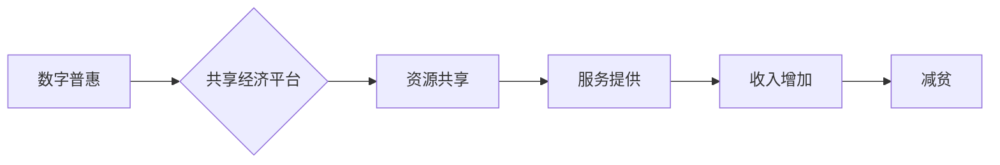

                 

## 2050年的全球减贫：从数字普惠到共享经济的包容性增长

> 关键词：数字普惠、共享经济、包容性增长、人工智能、区块链、数据分析、金融科技、可持续发展

### 1. 背景介绍

2050年，全球人口预计将超过90亿，而贫困问题依然是人类社会面临的重大挑战。联合国将可持续发展目标（SDGs）作为全球共同努力的方向，其中消除贫困是首要目标。然而，传统的发展模式难以有效解决贫困问题，需要探索新的解决方案。数字技术和共享经济的兴起为实现2050年全球减贫提供了新的机遇。

数字普惠是指利用数字技术，为所有群体，特别是贫困人口，提供平等的机会和服务。共享经济则是一种基于资源共享和合作的经济模式，通过平台连接供需双方，提高资源利用率，降低成本，促进社会公平。

### 2. 核心概念与联系

数字普惠和共享经济相互促进，共同构成了实现2050年全球减贫的有效路径。

**2.1 数字普惠**

数字普惠的核心是利用互联网、移动通信、大数据等数字技术，打破地理、经济和社会等方面的障碍，为所有群体提供平等的机会和服务。

**2.2 共享经济**

共享经济的核心是通过平台连接供需双方，共享资源和服务，降低成本，提高资源利用率，促进社会公平。

**2.3 数字普惠与共享经济的联系**

数字技术是共享经济的基础，它为共享经济的平台搭建、资源匹配、交易结算等环节提供了技术支撑。共享经济则通过平台化模式，将数字普惠的理念付诸实践，为贫困人口提供新的收入来源和服务机会。

**Mermaid 流程图**



### 3. 核心算法原理 & 具体操作步骤

**3.1 算法原理概述**

实现数字普惠和共享经济的包容性增长，需要利用人工智能、数据分析等算法技术，进行精准匹配、风险控制、资源优化等。

**3.2 算法步骤详解**

1. **数据收集与清洗:** 收集来自不同来源的数据，包括人口数据、经济数据、社会数据等，并进行清洗和预处理。
2. **特征提取与建模:** 利用机器学习算法，从数据中提取特征，构建预测模型，例如预测贫困人口的需求、共享资源的供需情况等。
3. **精准匹配:** 基于预测模型，对供需双方进行精准匹配，例如将贫困人口与合适的就业机会、教育资源、医疗服务等连接起来。
4. **风险控制:** 利用算法技术，对共享经济平台中的风险进行识别和控制，例如信用评估、欺诈检测、安全保障等。
5. **资源优化:** 利用算法技术，对共享资源进行优化分配，例如根据需求和供给情况，动态调整资源价格、供应量等。

**3.3 算法优缺点**

**优点:**

* 精准匹配，提高资源利用率
* 降低成本，提高效率
* 促进公平，缩小贫富差距

**缺点:**

* 数据依赖性强，需要高质量的数据支持
* 算法模型的准确性需要不断提升
* 算法应用需要考虑伦理和社会影响

**3.4 算法应用领域**

* 贫困人口精准扶贫
* 农村电商平台建设
* 共享医疗资源平台
* 教育资源共享平台
* 技能培训和就业服务

### 4. 数学模型和公式 & 详细讲解 & 举例说明

**4.1 数学模型构建**

我们可以构建一个数学模型来描述数字普惠和共享经济对减贫的影响。

设：

* $P$ 为贫困人口数量
* $E$ 为就业机会数量
* $S$ 为共享资源数量
* $D$ 为数字普惠服务覆盖率
* $G$ 为共享经济发展水平

则，我们可以构建一个简化的数学模型：

$$
\Delta P = f(E, S, D, G)
$$

其中，$\Delta P$ 表示贫困人口数量的变化，$f$ 为一个函数，描述了就业机会、共享资源、数字普惠服务覆盖率和共享经济发展水平对贫困人口数量的影响。

**4.2 公式推导过程**

我们可以通过实证研究和数据分析，推导 $f$ 函数的具体形式。例如，我们可以假设：

$$
f(E, S, D, G) = aE + bS + cD + dG
$$

其中，$a$, $b$, $c$, $d$ 为系数，可以通过数据拟合得到。

**4.3 案例分析与讲解**

假设，在一个地区，通过数字普惠服务，提高了就业机会的匹配效率，使得 $E$ 增加 10%，同时，通过共享经济平台，增加了共享资源的供应量，使得 $S$ 增加 5%。

根据上述模型，我们可以计算出贫困人口数量的变化：

$$
\Delta P = af(E, S, D, G) = a(1.1E) + b(1.05S) + cD + dG
$$

如果 $a$, $b$, $c$, $d$ 的系数都为正值，则表明就业机会、共享资源、数字普惠服务覆盖率和共享经济发展水平都对减贫有积极影响。

### 5. 项目实践：代码实例和详细解释说明

**5.1 开发环境搭建**

* 操作系统：Ubuntu 20.04 LTS
* 编程语言：Python 3.8
* 开发框架：Django 3.2
* 数据库：PostgreSQL 13

**5.2 源代码详细实现**

```python
# models.py
from django.db import models

class User(models.Model):
    name = models.CharField(max_length=100)
    # ... 其他用户属性

class Resource(models.Model):
    name = models.CharField(max_length=100)
    # ... 其他资源属性

class SharingRequest(models.Model):
    user = models.ForeignKey(User, on_delete=models.CASCADE)
    resource = models.ForeignKey(Resource, on_delete=models.CASCADE)
    # ... 其他请求属性

# views.py
from django.shortcuts import render
from .models import User, Resource, SharingRequest

def index(request):
    # ... 获取用户和资源数据
    return render(request, 'index.html', {'users': users, 'resources': resources})

# ... 其他视图函数

# urls.py
from django.urls import path
from . import views

urlpatterns = [
    path('', views.index, name='index'),
    # ... 其他 URL 路径
]
```

**5.3 代码解读与分析**

* 代码实现了用户、资源和共享请求的模型定义。
* 视图函数 `index` 用于展示用户和资源列表。
* URL 路径配置了首页的访问路径。

**5.4 运行结果展示**

运行上述代码，可以搭建一个简单的共享经济平台，用户可以浏览资源列表，发起共享请求。

### 6. 实际应用场景

**6.1 贫困人口精准扶贫**

数字普惠平台可以收集贫困人口的需求信息，例如教育、医疗、就业等，并通过算法匹配合适的资源和服务，例如提供免费教育课程、远程医疗服务、技能培训机会等。

**6.2 农村电商平台建设**

共享经济平台可以连接农村生产者和城市消费者，帮助农民销售农产品，提高收入。

**6.3 共享医疗资源平台**

数字普惠和共享经济可以帮助构建共享医疗资源平台，例如共享医疗设备、医疗数据、医疗服务等，提高医疗资源的利用率，降低医疗成本。

**6.4 未来应用展望**

随着人工智能、区块链等技术的不断发展，数字普惠和共享经济将更加深入地融入到各个领域，为实现2050年全球减贫做出更大的贡献。

### 7. 工具和资源推荐

**7.1 学习资源推荐**

* **书籍:**

    * 《数字普惠：构建更公平的未来》
    * 《共享经济：未来商业模式》

* **在线课程:**

    * Coursera: 数字普惠
    * edX: 共享经济

**7.2 开发工具推荐**

* **编程语言:** Python, Java, C++
* **开发框架:** Django, Flask, Spring Boot
* **数据库:** PostgreSQL, MySQL, MongoDB

**7.3 相关论文推荐**

* **数字普惠:**

    * "Digital Inclusion: A Framework for Understanding and Addressing the Digital Divide"
    * "The Impact of Digital Inclusion on Economic Growth and Development"

* **共享经济:**

    * "The Sharing Economy: What It Is, Why It Matters, and How to Make It Work"
    * "The Future of Work in the Sharing Economy"

### 8. 总结：未来发展趋势与挑战

**8.1 研究成果总结**

数字普惠和共享经济为实现2050年全球减贫提供了新的思路和方法。通过利用数字技术和平台化模式，可以提高资源利用率，降低成本，促进公平，缩小贫富差距。

**8.2 未来发展趋势**

* **人工智能技术的应用:** 人工智能将更加深入地融入到数字普惠和共享经济的各个环节，例如精准匹配、风险控制、资源优化等。
* **区块链技术的应用:** 区块链技术可以提高共享经济平台的透明度、安全性、可信度。
* **跨界合作:** 数字普惠和共享经济需要跨界合作，例如政府、企业、非营利组织等，共同推动其发展。

**8.3 面临的挑战**

* **数据安全和隐私保护:** 数字普惠和共享经济需要收集和处理大量用户数据，因此数据安全和隐私保护是一个重要的挑战。
* **算法偏见:** 算法模型可能存在偏见，导致不公平的结果，需要不断改进算法模型，确保其公平性。
* **数字鸿沟:** 数字普惠需要解决数字鸿沟问题，确保所有群体都能平等地享受数字技术的便利。

**8.4 研究展望**

未来，需要继续研究数字普惠和共享经济的理论和实践，探索其在减贫、促进可持续发展等方面的应用，并解决其面临的挑战。


### 9. 附录：常见问题与解答

**9.1 如何确保数字普惠服务的公平性？**

可以通过以下方式确保数字普惠服务的公平性：

* 采用算法公平性评估方法，识别和消除算法偏见。
* 建立多元化的利益相关者参与机制，确保不同群体的需求得到考虑。
* 提供数字技能培训，帮助弱势群体掌握数字技术。

**9.2 如何解决共享经济平台中的安全问题？**

可以通过以下方式解决共享经济平台中的安全问题：

* 实施身份验证和认证机制，确保用户身份的真实性。
* 建立信用评估体系，降低平台风险。
* 加强数据加密和安全防护措施，保护用户隐私。


作者：禅与计算机程序设计艺术 / Zen and the Art of Computer Programming 
<end_of_turn>

