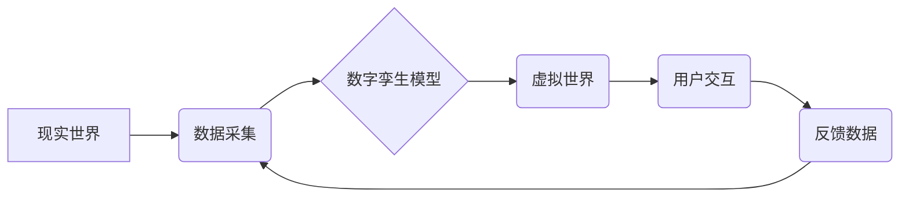

                 

## 2050年的数字孪生：从数字分身到元宇宙生活的虚实融合

> 关键词：数字孪生、元宇宙、虚实融合、人工智能、物联网、云计算、区块链、沉浸式体验

### 1. 背景介绍

2050年，科技发展已进入一个全新的阶段。人工智能、物联网、云计算、区块链等技术的融合，为我们构建了一个更加智能、互联、沉浸式的数字世界。在这个世界里，数字孪生将不再是概念，而是每个人生活的一部分，它将成为我们与现实世界交互、体验和创造的桥梁，连接着虚拟与现实，构建着更加丰富多彩的元宇宙生活。

数字孪生技术，是指利用物理世界的数据和模型，在虚拟世界中构建一个与现实世界实时同步的虚拟模型。它可以模拟现实世界的各种场景和行为，并进行预测和分析，为我们提供更加精准、高效的决策支持。

元宇宙，则是指一个基于互联网、虚拟现实、增强现实等技术的虚拟世界，它将融合现实世界中的社交、娱乐、工作等多种活动，构建一个更加沉浸式、交互式的虚拟体验空间。

数字孪生和元宇宙的结合，将为我们带来前所未有的体验和可能性。

### 2. 核心概念与联系

#### 2.1 数字孪生

数字孪生是一个虚拟的、实时更新的模型，它可以反映现实世界中的物理实体的状态、行为和演变。它可以包含实体的几何形状、物理属性、传感器数据、运行状态等信息，并通过与现实世界的数据实时同步，保持一致性。

#### 2.2 元宇宙

元宇宙是一个虚拟世界，它是一个由虚拟现实、增强现实、区块链、人工智能等技术构建的沉浸式体验空间。它将融合现实世界中的社交、娱乐、工作等多种活动，构建一个更加丰富多彩的虚拟世界。

#### 2.3 联系

数字孪生是构建元宇宙的基础，它为元宇宙提供了虚拟世界的基础模型和数据支撑。

**Mermaid 流程图**



### 3. 核心算法原理 & 具体操作步骤

#### 3.1 算法原理概述

数字孪生的核心算法原理包括数据采集、模型构建、仿真模拟和预测分析等。

* **数据采集:** 从现实世界中采集实体的各种数据，包括传感器数据、图像数据、文本数据等。
* **模型构建:** 基于采集到的数据，构建一个虚拟的实体模型，该模型可以包含实体的几何形状、物理属性、运行状态等信息。
* **仿真模拟:** 利用模型，模拟实体在不同环境和条件下的行为，预测其未来的状态和演变趋势。
* **预测分析:** 基于仿真模拟的结果，进行预测分析，为现实世界提供决策支持。

#### 3.2 算法步骤详解

1. **数据采集:** 使用传感器、摄像头、麦克风等设备，从现实世界中采集实体的数据。
2. **数据预处理:** 对采集到的数据进行清洗、转换、格式化等处理，使其符合模型构建的要求。
3. **模型构建:** 选择合适的模型构建方法，例如3D建模、物理仿真、机器学习等，构建实体的虚拟模型。
4. **模型训练:** 利用预处理后的数据，对模型进行训练，使其能够准确地反映实体的真实状态和行为。
5. **仿真模拟:** 利用训练好的模型，模拟实体在不同环境和条件下的行为，预测其未来的状态和演变趋势。
6. **预测分析:** 分析仿真模拟的结果，为现实世界提供决策支持。

#### 3.3 算法优缺点

**优点:**

* 可以模拟现实世界中的复杂场景和行为，提供更加精准的预测分析结果。
* 可以帮助我们更好地理解实体的运行机制，发现潜在的问题和风险。
* 可以为现实世界提供决策支持，提高效率和效益。

**缺点:**

* 需要大量的传感器数据和计算资源，成本较高。
* 模型的构建和训练需要专业技术人员，难度较高。
* 模型的精度和可靠性取决于数据的质量和模型的复杂度。

#### 3.4 算法应用领域

数字孪生技术在各个领域都有广泛的应用，例如：

* **制造业:** 模拟生产过程，优化生产流程，提高生产效率。
* **医疗保健:** 模拟人体器官和疾病，辅助医生诊断和治疗。
* **城市规划:** 模拟城市交通、环境等情况，优化城市规划。
* **能源:** 模拟能源生产和消耗，优化能源管理。

### 4. 数学模型和公式 & 详细讲解 & 举例说明

#### 4.1 数学模型构建

数字孪生的数学模型可以根据具体应用场景进行构建，常用的模型包括：

* **状态空间模型:** 描述实体的状态和行为变化的数学模型，通常用微分方程或差分方程表示。
* **概率模型:** 描述实体状态和行为的不确定性的数学模型，通常用概率分布函数表示。
* **神经网络模型:** 利用神经网络算法学习实体的状态和行为模式的数学模型。

#### 4.2 公式推导过程

以状态空间模型为例，其基本形式为：

$$
\dot{x}(t) = f(x(t), u(t))
$$

$$
y(t) = h(x(t))
$$

其中：

* $x(t)$ 是实体的状态向量。
* $u(t)$ 是输入信号。
* $y(t)$ 是输出信号。
* $f(x(t), u(t))$ 是状态方程，描述状态随时间的变化。
* $h(x(t))$ 是输出方程，描述输出信号与状态的关系。

#### 4.3 案例分析与讲解

例如，模拟一个汽车的运动状态，可以建立一个状态空间模型，其中状态向量包括汽车的位置、速度、加速度等信息，输入信号包括油门踏板、刹车踏板等信息，输出信号包括汽车的速度、方向等信息。

通过对状态空间模型进行仿真模拟，可以预测汽车在不同路况和驾驶条件下的运动状态，例如预测汽车的刹车距离、行驶轨迹等。

### 5. 项目实践：代码实例和详细解释说明

#### 5.1 开发环境搭建

数字孪生项目开发环境通常包括：

* **操作系统:** Linux、Windows、macOS 等。
* **编程语言:** Python、C++、Java 等。
* **开发工具:** IDE、文本编辑器、版本控制系统等。
* **数据存储:** 数据库、文件系统等。
* **云计算平台:** AWS、Azure、GCP 等。

#### 5.2 源代码详细实现

以下是一个简单的数字孪生项目代码实例，使用Python语言实现了一个简单的球体的运动模拟：

```python
import numpy as np
import matplotlib.pyplot as plt
from matplotlib.animation import FuncAnimation

# 参数设置
g = 9.8  # 重力加速度
dt = 0.01  # 时间步长
t_max = 10  # 模拟时间

# 初始条件
x = 0
y = 1
vx = 0
vy = 0

# 创建动画
fig, ax = plt.subplots()
line, = ax.plot([], [], 'ro')
ax.set_xlim(-1, 1)
ax.set_ylim(-1, 2)
ax.set_title('球体运动模拟')

def update(frame):
    global x, y, vx, vy

    # 更新速度
    vy -= g * dt

    # 更新位置
    x += vx * dt
    y += vy * dt

    # 更新线条数据
    line.set_data([x], [y])

    return line,

# 创建动画
ani = FuncAnimation(fig, update, frames=int(t_max / dt), interval=10, blit=True)

plt.show()
```

#### 5.3 代码解读与分析

* 该代码首先定义了模拟球体的运动所需的物理参数，例如重力加速度、时间步长等。
* 然后，定义了球体的初始条件，例如位置、速度等。
* 接着，使用matplotlib库创建了一个动画，并定义了更新函数`update`，该函数在每次动画帧更新时执行。
* 在`update`函数中，根据物理公式更新球体的速度和位置，并更新动画线条的数据。
* 最后，使用`FuncAnimation`函数创建动画，并显示动画。

#### 5.4 运行结果展示

运行该代码后，将显示一个球体在竖直方向下落运动的动画。

### 6. 实际应用场景

#### 6.1 智能制造

数字孪生可以用于模拟生产线，优化生产流程，提高生产效率。例如，可以模拟不同机器的运行状态，预测机器故障，提前进行维护，避免生产停滞。

#### 6.2 智能医疗

数字孪生可以用于模拟人体器官和疾病，辅助医生诊断和治疗。例如，可以模拟心脏的结构和功能，预测心脏病的风险，为医生提供个性化的治疗方案。

#### 6.3 智能城市

数字孪生可以用于模拟城市交通、环境等情况，优化城市规划。例如，可以模拟城市交通流量，预测交通拥堵，优化交通信号灯控制，缓解交通压力。

#### 6.4 未来应用展望

数字孪生技术在未来将有更广泛的应用，例如：

* **虚拟培训:** 利用数字孪生构建虚拟环境，进行模拟培训，例如模拟飞行训练、手术模拟等。
* **个性化服务:** 利用数字孪生构建用户个性化模型，提供个性化服务，例如个性化推荐、个性化医疗等。
* **元宇宙体验:** 数字孪生将成为元宇宙体验的基础，为用户提供更加沉浸式、交互式的虚拟体验。

### 7. 工具和资源推荐

#### 7.1 学习资源推荐

* **书籍:**
    * 《数字孪生：从概念到实践》
    * 《数字孪生技术》
* **在线课程:**
    * Coursera: Digital Twins Specialization
    * edX: Digital Twin Technology

#### 7.2 开发工具推荐

* **3D建模软件:** Blender, Maya, 3ds Max
* **仿真软件:** Simulink, ANSYS, COMSOL
* **数据分析工具:** Python, R, Tableau

#### 7.3 相关论文推荐

* **Digital Twins: Concepts and Opportunities**
* **Digital Twin Technology: A Comprehensive Review**
* **Applications of Digital Twins in Industry 4.0**

### 8. 总结：未来发展趋势与挑战

#### 8.1 研究成果总结

数字孪生技术已经取得了显著的成果，在各个领域都有广泛的应用。

#### 8.2 未来发展趋势

* **更加智能化:** 利用人工智能技术，使数字孪生更加智能化，能够自动学习和适应环境变化。
* **更加融合化:** 与其他技术融合，例如区块链、物联网、边缘计算等，构建更加完整的数字孪生生态系统。
* **更加个性化:** 为每个用户构建个性化的数字孪生模型，提供更加个性化的服务。

#### 8.3 面临的挑战

* **数据获取和管理:** 数字孪生需要大量的传感器数据，如何获取、存储、管理这些数据是一个挑战。
* **模型构建和训练:** 如何构建更加准确、高效的数字孪生模型，是一个技术难题。
* **安全和隐私:** 数字孪生涉及到大量个人数据，如何保障数据安全和隐私是一个重要问题。

#### 8.4 研究展望

未来，数字孪生技术将继续发展，为我们带来更加智能、便捷、丰富的体验。

### 9. 附录：常见问题与解答

#### 9.1 什么是数字孪生？

数字孪生是指利用物理世界的数据和模型，在虚拟世界中构建一个与现实世界实时同步的虚拟模型。

#### 9.2 数字孪生有什么应用场景？

数字孪生在各个领域都有广泛的应用，例如智能制造、智能医疗、智能城市等。

#### 9.3 如何构建数字孪生？

构建数字孪生需要以下步骤：

1. 数据采集
2. 模型构建
3. 仿真模拟
4. 预测分析


作者：禅与计算机程序设计艺术 / Zen and the Art of Computer Programming 
<end_of_turn>

