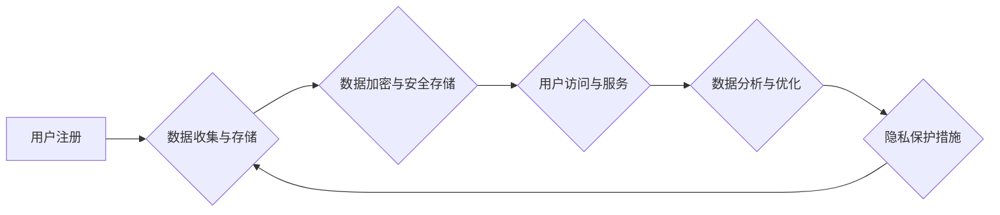

                 

## 心理咨询领域知识付费要重视隐私保护

> 关键词：心理咨询、知识付费、隐私保护、数据安全、加密技术、伦理规范、法律法规、用户信任

## 1. 背景介绍

近年来，随着互联网技术的快速发展和普及，知识付费行业蓬勃发展，心理咨询领域也逐渐成为其中热门的细分领域。越来越多的用户通过线上平台寻求心理咨询服务，而心理咨询平台也开始利用知识付费模式，提供付费课程、咨询套餐等服务。

然而，心理咨询涉及到用户最私密的内心世界，其数据具有高度敏感性。在知识付费模式下，用户数据安全和隐私保护问题显得尤为重要。如果平台未能妥善处理用户数据，将可能导致用户隐私泄露、信息滥用等严重后果，损害用户信任，甚至引发法律纠纷。

## 2. 核心概念与联系

### 2.1 心理咨询数据

心理咨询数据是指在心理咨询过程中产生的各种信息，包括用户个人信息、咨询内容、情绪状态、治疗方案等。这些数据对于理解用户心理状态、制定治疗方案具有重要意义，但也因其敏感性而需要得到严格保护。

### 2.2 知识付费模式

知识付费模式是指通过提供付费内容或服务，获取收益的商业模式。在心理咨询领域，知识付费模式主要体现在以下几种形式：

* **付费课程:** 提供心理咨询相关的知识和技能培训课程。
* **在线咨询套餐:** 提供一定数量的在线心理咨询服务套餐。
* **会员服务:** 提供付费会员服务，享受更优质的心理咨询资源和服务。

### 2.3 隐私保护

隐私保护是指保护个人信息不被未经授权的访问、使用、披露或修改的行为。在数字时代，隐私保护问题日益突出，尤其是在涉及个人敏感信息的领域，如心理咨询。

### 2.4 数据安全

数据安全是指保护数据免受未经授权的访问、使用、披露、修改或销毁的行为。数据安全是隐私保护的基础，只有确保数据安全，才能有效保护用户隐私。

**Mermaid 流程图**



## 3. 核心算法原理 & 具体操作步骤

### 3.1 算法原理概述

在心理咨询领域知识付费平台中，数据安全和隐私保护需要采用多种技术手段和措施。其中，数据加密技术是核心算法之一。

数据加密技术通过将原始数据转换为不可识别的密文，防止未经授权的访问和使用。常见的加密算法包括：

* **对称加密算法:** 使用相同的密钥加密和解密数据，例如AES、DES等。
* **非对称加密算法:** 使用一对密钥（公钥和私钥）加密和解密数据，例如RSA、ECC等。

### 3.2 算法步骤详解

1. **数据收集与存储:** 平台收集用户数据，包括个人信息、咨询内容等，并将其存储在安全服务器上。
2. **数据加密:** 平台使用加密算法将用户数据加密，生成密文。
3. **数据安全存储:** 平台将加密后的密文安全存储，并采取物理和逻辑安全措施防止数据泄露。
4. **用户访问与服务:** 当用户需要访问其数据时，平台使用用户的身份验证信息解密密文，恢复原始数据。
5. **数据分析与优化:** 平台可以对加密后的数据进行分析，例如用户咨询偏好、情绪变化等，但不能直接访问原始数据，保证用户隐私安全。
6. **隐私保护措施:** 平台需要制定完善的隐私保护政策，明确用户数据的使用范围、安全措施等，并定期进行安全评估和漏洞修复。

### 3.3 算法优缺点

**优点:**

* **有效保护用户隐私:** 数据加密技术可以有效防止未经授权的访问和使用，保护用户隐私安全。
* **增强用户信任:** 平台采用数据加密技术可以增强用户信任，提高用户粘性。
* **符合法律法规:** 许多国家和地区都有相关法律法规对个人数据保护进行规定，数据加密技术可以帮助平台遵守法律法规。

**缺点:**

* **技术复杂性:** 数据加密技术需要专业的技术人员进行实施和维护，成本较高。
* **性能影响:** 数据加密和解密过程会增加计算量，可能影响平台性能。
* **密钥管理:** 密钥管理是数据加密的关键环节，需要采取严格的安全措施防止密钥泄露。

### 3.4 算法应用领域

数据加密技术广泛应用于各种领域，包括：

* **金融行业:** 保护银行账户信息、交易数据等敏感信息。
* **医疗行业:** 保护患者医疗记录、个人健康信息等隐私数据。
* **电商行业:** 保护用户购物信息、支付信息等个人数据。
* **社交媒体:** 保护用户聊天记录、个人资料等隐私信息。

## 4. 数学模型和公式 & 详细讲解 & 举例说明

### 4.1 数学模型构建

在数据加密领域，常用的数学模型是密码学模型。密码学模型主要包括以下几个方面：

* **明文和密文:** 明文是指原始数据，密文是指经过加密后的不可识别的形式。
* **密钥:** 密钥是加密和解密过程中的重要参数，用于控制加密和解密算法。
* **加密算法:** 加密算法是将明文转换为密文的数学函数。
* **解密算法:** 解密算法是将密文转换为明文的数学函数。

### 4.2 公式推导过程

常见的加密算法，例如AES算法，其加密和解密过程涉及复杂的数学运算，包括置换、置换逆、线性变换、非线性变换等。这些运算基于有限域、多项式环等数学结构，并通过密钥进行控制。

### 4.3 案例分析与讲解

例如，RSA算法是一种非对称加密算法，它使用两个不同的密钥：公钥和私钥。公钥可以用于加密数据，而只有对应的私钥才能解密数据。RSA算法的安全性基于大数分解的困难性。

假设Alice想要发送加密信息给Bob。Alice可以使用Bob的公钥将信息加密，然后发送给Bob。Bob可以使用自己的私钥解密信息。

**公式:**

* **加密公式:** $C = M^e \pmod{n}$
* **解密公式:** $M = C^d \pmod{n}$

其中：

* $M$ 是明文
* $C$ 是密文
* $e$ 是公钥指数
* $d$ 是私钥指数
* $n$ 是模数

## 5. 项目实践：代码实例和详细解释说明

### 5.1 开发环境搭建

心理咨询平台的开发环境需要具备以下条件：

* **操作系统:** Linux、Windows等
* **编程语言:** Python、Java等
* **数据库:** MySQL、PostgreSQL等
* **云服务平台:** AWS、Azure、GCP等

### 5.2 源代码详细实现

以下是一个使用Python语言实现数据加密的简单代码示例：

```python
from cryptography.fernet import Fernet

# 生成密钥
key = Fernet.generate_key()

# 创建Fernet对象
cipher = Fernet(key)

# 加密数据
message = "This is a secret message".encode()
encrypted_message = cipher.encrypt(message)

# 解密数据
decrypted_message = cipher.decrypt(encrypted_message)

# 打印结果
print("加密后的数据:", encrypted_message)
print("解密后的数据:", decrypted_message.decode())
```

### 5.3 代码解读与分析

* **`from cryptography.fernet import Fernet`:** 导入Fernet加密库。
* **`key = Fernet.generate_key()`:** 生成一个随机密钥。
* **`cipher = Fernet(key)`:** 创建一个Fernet对象，使用生成的密钥进行加密和解密。
* **`message = "This is a secret message".encode()`:** 将要加密的消息转换为字节格式。
* **`encrypted_message = cipher.encrypt(message)`:** 使用Fernet对象加密消息。
* **`decrypted_message = cipher.decrypt(encrypted_message)`:** 使用Fernet对象解密消息。
* **`print("加密后的数据:", encrypted_message)`:** 打印加密后的密文。
* **`print("解密后的数据:", decrypted_message.decode())`:** 打印解密后的明文。

### 5.4 运行结果展示

运行以上代码，将输出加密后的密文和解密后的明文。

## 6. 实际应用场景

### 6.1 用户数据加密

心理咨询平台可以对用户个人信息、咨询内容等敏感数据进行加密存储，防止未经授权的访问和使用。

### 6.2 数据传输加密

用户与平台之间的数据传输过程可以采用HTTPS协议进行加密，确保数据在传输过程中不被窃取。

### 6.3 数据备份加密

平台可以对数据备份进行加密，防止备份数据被盗用或泄露。

### 6.4 第三方服务加密

平台与第三方服务（例如支付平台、短信平台等）进行数据交互时，可以采用加密技术保护数据安全。

## 7. 工具和资源推荐

### 7.1 学习资源推荐

* **书籍:**
    * 《密码学原理与实践》
    * 《现代密码学》
* **在线课程:**
    * Coursera: Cryptography I
    * edX: Introduction to Cryptography

### 7.2 开发工具推荐

* **Python:**
    * cryptography
    * pycryptodome
* **Java:**
    * Bouncy Castle
    * Java Cryptography Architecture (JCA)

### 7.3 相关论文推荐

* **"A Survey of Privacy-Preserving Techniques for Healthcare Data"**
* **"Differential Privacy: A Primer"**

## 8. 总结：未来发展趋势与挑战

### 8.1 研究成果总结

近年来，在心理咨询领域知识付费平台的隐私保护方面取得了显著进展。数据加密技术、匿名化技术、联邦学习等技术被广泛应用，有效提升了用户数据安全和隐私保护水平。

### 8.2 未来发展趋势

未来，心理咨询领域知识付费平台的隐私保护将朝着以下方向发展：

* **更强大的加密算法:** 研究和开发更安全、更有效的加密算法，应对不断演变的网络安全威胁。
* **隐私计算:** 利用隐私计算技术，在不泄露原始数据的情况下，实现数据分析和共享。
* **区块链技术:** 利用区块链技术的去中心化和不可篡改特性，构建更加安全可靠的隐私保护机制。

### 8.3 面临的挑战

心理咨询领域知识付费平台的隐私保护仍然面临一些挑战：

* **技术复杂性:** 隐私保护技术需要专业的技术人员进行实施和维护，成本较高。
* **法律法规:** 不同国家和地区的法律法规对个人数据保护的规定有所不同，平台需要遵守相关法律法规，并及时更新隐私保护措施。
* **用户意识:** 一些用户对隐私保护意识不足，需要加强用户教育和宣传。

### 8.4 研究展望

未来，需要加强对心理咨询领域知识付费平台隐私保护的研究，探索更有效的技术手段和解决方案，保障用户隐私安全，促进平台健康发展。

## 9. 附录：常见问题与解答

### 9.1 如何选择合适的加密算法？

选择合适的加密算法需要根据具体应用场景和需求进行考虑。例如，对安全性要求较高的场景，可以选择RSA等非对称加密算法；对性能要求较高的场景，可以选择AES等对称加密算法。

### 9.2 如何妥善保管密钥？

密钥是加密和解密的关键，需要妥善保管，防止泄露。可以采用以下措施：

* 使用硬件安全模块存储密钥。
* 使用多因素身份验证保护密钥访问。
* 定期备份密钥，并存储在安全的地方。

### 9.3 如何应对数据泄露事件？

一旦发生数据泄露事件，平台需要及时采取以下措施：

* 调查事件原因，找出漏洞。
* 通知受影响的用户，并提供必要的帮助。
* 修复漏洞，加强安全措施。
* 向相关部门报告事件。


作者：禅与计算机程序设计艺术 / Zen and the Art of Computer Programming 
<end_of_turn>

