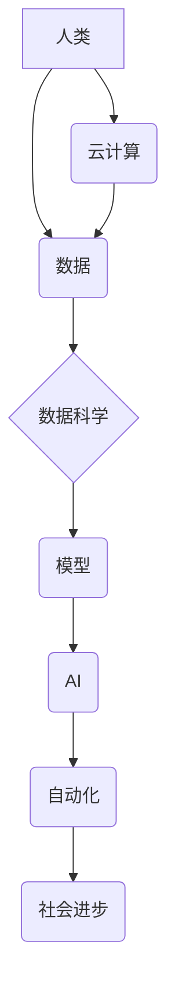

                 

## 技能和培训：为人类计算时代做好准备

> 关键词：人工智能、机器学习、深度学习、数据科学、云计算、软件工程、编程

### 1. 背景介绍

我们正处在一个前所未有的时代，计算技术正在以指数级速度发展，深刻地改变着人类社会。人工智能（AI）、机器学习（ML）、深度学习（DL）等技术的飞速进步，正在推动着第四次工业革命的到来。在这个新时代，计算能力将成为人类社会发展的重要驱动力，对个人和社会都提出了新的挑战和机遇。

为了在人类计算时代取得成功，我们需要具备新的技能和知识，并不断进行学习和提升。传统的教育模式和技能体系已经无法满足新时代的需求，我们需要重新思考和构建新的学习路径。

### 2. 核心概念与联系

**2.1 人类计算时代**

人类计算时代是指计算技术与人类智慧深度融合的时代。在这个时代，计算能力将不再局限于机器，而是与人类的认知能力、创造力、情感智能等有机结合，共同推动社会进步。

**2.2 核心概念**

* **人工智能 (AI):** 使计算机能够像人类一样学习、推理和解决问题的能力。
* **机器学习 (ML):** 一种人工智能技术，通过算法从数据中学习，不断改进其性能。
* **深度学习 (DL):** 一种更高级的机器学习技术，利用多层神经网络模拟人类大脑的学习过程。
* **数据科学:** 从海量数据中提取有价值信息，并用于决策和分析的学科。
* **云计算:** 通过互联网提供计算资源、存储空间和软件服务的模式。

**2.3 核心概念联系**



**2.4 技能需求**

人类计算时代对人才提出了新的技能需求，包括：

* **编程技能:** 能够熟练掌握至少一种编程语言，并能够进行软件开发和系统设计。
* **数据分析技能:** 能够从海量数据中提取有价值信息，并进行分析和解读。
* **机器学习技能:** 能够理解和应用机器学习算法，并进行模型训练和评估。
* **人工智能应用技能:** 能够将人工智能技术应用于实际问题，并开发出创新解决方案。
* **跨学科合作能力:** 能够与不同领域的专家进行有效沟通和合作。

### 3. 核心算法原理 & 具体操作步骤

**3.1 算法原理概述**

机器学习算法是一种能够从数据中学习并改进其性能的算法。常见的机器学习算法包括：

* **监督学习:** 利用标记数据训练模型，预测未知数据。
* **无监督学习:** 从未标记数据中发现模式和结构。
* **强化学习:** 通过试错学习，在环境中获得最大奖励。

**3.2 算法步骤详解**

以监督学习为例，其基本步骤如下：

1. **数据收集和预处理:** 收集相关数据，并进行清洗、转换和特征工程等预处理工作。
2. **模型选择:** 根据具体问题选择合适的机器学习模型。
3. **模型训练:** 利用标记数据训练模型，调整模型参数，使其能够准确预测未知数据。
4. **模型评估:** 利用测试数据评估模型的性能，并进行调优。
5. **模型部署:** 将训练好的模型部署到实际应用场景中。

**3.3 算法优缺点**

不同的机器学习算法具有不同的优缺点，需要根据具体问题选择合适的算法。

* **优点:** 能够自动学习数据模式，无需人工编程，能够处理海量数据，具有强大的预测能力。
* **缺点:** 需要大量标记数据进行训练，模型解释性较差，容易受到数据噪声的影响。

**3.4 算法应用领域**

机器学习算法广泛应用于各个领域，例如：

* **图像识别:** 自动识别图像中的物体、场景和人脸。
* **自然语言处理:** 理解和生成人类语言，例如机器翻译、文本摘要和聊天机器人。
* **推荐系统:** 根据用户行为和偏好推荐相关商品或内容。
* **金融风险控制:** 识别和预测金融风险，例如欺诈检测和信用评分。

### 4. 数学模型和公式 & 详细讲解 & 举例说明

**4.1 数学模型构建**

机器学习算法通常基于数学模型进行构建。例如，线性回归模型可以表示为：

$$y = w_0 + w_1x_1 + w_2x_2 + ... + w_nx_n + \epsilon$$

其中：

* $y$ 是预测值
* $w_0, w_1, w_2, ..., w_n$ 是模型参数
* $x_1, x_2, ..., x_n$ 是输入特征
* $\epsilon$ 是误差项

**4.2 公式推导过程**

模型参数的学习过程通常通过优化算法进行，例如梯度下降法。梯度下降法的目标是找到使模型预测误差最小化的参数值。

**4.3 案例分析与讲解**

假设我们想要预测房价，输入特征包括房屋面积、房间数量、地理位置等。我们可以使用线性回归模型进行预测，并通过梯度下降法训练模型参数。

### 5. 项目实践：代码实例和详细解释说明

**5.1 开发环境搭建**

* 安装 Python 语言和相关库，例如 NumPy、Pandas、Scikit-learn 等。
* 选择合适的 IDE 或文本编辑器进行代码编写。

**5.2 源代码详细实现**

```python
import pandas as pd
from sklearn.linear_model import LinearRegression
from sklearn.model_selection import train_test_split

# 加载数据
data = pd.read_csv("house_price_data.csv")

# 分割数据
X = data[['area', 'rooms', 'location']]
y = data['price']
X_train, X_test, y_train, y_test = train_test_split(X, y, test_size=0.2)

# 创建线性回归模型
model = LinearRegression()

# 训练模型
model.fit(X_train, y_train)

# 预测测试数据
y_pred = model.predict(X_test)

# 评估模型性能
print("模型性能:", model.score(X_test, y_test))
```

**5.3 代码解读与分析**

* 代码首先加载房价数据，并进行特征和目标变量的分割。
* 然后创建线性回归模型，并使用训练数据进行模型训练。
* 训练完成后，使用测试数据进行模型预测，并评估模型性能。

**5.4 运行结果展示**

运行代码后，会输出模型的性能指标，例如 R-squared 值。R-squared 值表示模型对目标变量的解释能力，值越高表示模型解释能力越强。

### 6. 实际应用场景

**6.1 医疗诊断**

机器学习算法可以用于分析患者的医疗影像数据，辅助医生进行疾病诊断。

**6.2 金融风险管理**

机器学习算法可以用于识别和预测金融风险，例如欺诈检测和信用评分。

**6.3 自动驾驶**

机器学习算法可以用于训练自动驾驶汽车的感知系统，使其能够识别道路环境和做出决策。

**6.4 未来应用展望**

随着人工智能技术的不断发展，机器学习算法将在更多领域得到应用，例如个性化教育、智能家居、精准农业等。

### 7. 工具和资源推荐

**7.1 学习资源推荐**

* **在线课程:** Coursera、edX、Udacity 等平台提供丰富的机器学习课程。
* **书籍:** 《机器学习》 (周志华)、《深度学习》 (Ian Goodfellow) 等书籍是机器学习领域的经典著作。
* **开源库:** Scikit-learn、TensorFlow、PyTorch 等开源库提供了丰富的机器学习工具和算法。

**7.2 开发工具推荐**

* **Python:** 作为机器学习领域的编程语言，Python 拥有丰富的库和工具。
* **Jupyter Notebook:** 用于交互式编程和数据可视化的工具。
* **Git:** 用于代码版本控制的工具。

**7.3 相关论文推荐**

* **《ImageNet Classification with Deep Convolutional Neural Networks》:** 
AlexNet 模型的论文，标志着深度学习的兴起。
* **《Attention Is All You Need》:** 
Transformer 模型的论文，推动了自然语言处理领域的进步。

### 8. 总结：未来发展趋势与挑战

**8.1 研究成果总结**

近年来，人工智能领域取得了显著的进展，机器学习算法在各个领域得到了广泛应用。

**8.2 未来发展趋势**

* **模型更加强大:** 模型规模和复杂度将继续增加，能够解决更复杂的问题。
* **数据更加丰富:** 数据收集和处理技术将不断进步，提供更多高质量的数据。
* **应用更加广泛:** 机器学习算法将应用于更多领域，例如医疗、教育、金融等。

**8.3 面临的挑战**

* **数据隐私和安全:** 如何保护数据隐私和安全是机器学习应用面临的重要挑战。
* **算法解释性和可信度:** 如何提高机器学习算法的解释性和可信度，使其能够被公众接受。
* **伦理问题:** 机器学习算法的应用可能引发伦理问题，例如算法偏见和就业影响。

**8.4 研究展望**

未来，机器学习研究将继续朝着更强大、更安全、更可解释的方向发展。

### 9. 附录：常见问题与解答

**9.1 什么是机器学习？**

机器学习是一种人工智能技术，通过算法从数据中学习，不断改进其性能。

**9.2 如何学习机器学习？**

可以通过在线课程、书籍、开源库等方式学习机器学习。

**9.3 机器学习有哪些应用场景？**

机器学习应用于各个领域，例如图像识别、自然语言处理、推荐系统等。


作者：禅与计算机程序设计艺术 / Zen and the Art of Computer Programming 
<end_of_turn>

