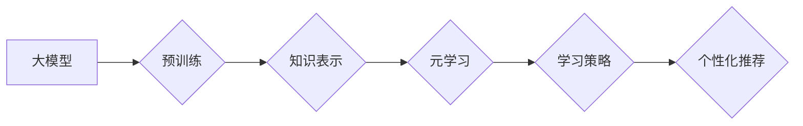

                 

## 推荐系统中的大模型元学习个性化应用

> 关键词：推荐系统、大模型、元学习、个性化、深度学习、迁移学习

## 1. 背景介绍

推荐系统作为信息过滤和内容发现的关键技术，在电商、社交媒体、视频平台等领域发挥着越来越重要的作用。传统的推荐系统主要依赖于协同过滤、内容过滤等方法，但这些方法在面对数据稀疏、冷启动等问题时表现力不足。近年来，随着深度学习技术的快速发展，基于深度学习的推荐系统逐渐成为主流，取得了显著的提升。

然而，深度学习模型的训练需要海量数据和大量的计算资源，并且往往缺乏对用户个性化的适应能力。针对这些问题，大模型和元学习技术应运而生。大模型拥有强大的泛化能力和知识表示能力，而元学习则能够通过学习学习策略，提高模型在新的任务上的适应能力。将大模型和元学习结合起来，可以构建更智能、更个性化的推荐系统。

## 2. 核心概念与联系

### 2.1 大模型

大模型是指参数量达到数十亿甚至千亿级别的深度学习模型。由于其庞大的参数量和海量数据训练，大模型能够学习到更丰富的语义表示和知识结构，从而在自然语言处理、图像识别、机器翻译等领域取得突破性进展。

### 2.2 元学习

元学习是指学习如何学习的学习过程。它旨在训练一个“学习者”模型，能够根据有限的样本数据快速学习新的任务。元学习的关键在于学习通用的学习策略，而不是仅仅记住特定任务的知识。

### 2.3 核心概念联系

大模型和元学习在推荐系统中的结合可以实现以下优势：

* **个性化推荐:** 元学习可以根据用户的历史行为和偏好，学习出个性化的推荐策略，从而提供更精准的推荐结果。
* **冷启动问题缓解:** 大模型的预训练知识可以帮助缓解冷启动问题，即使对于新用户或新商品，也能提供合理的推荐。
* **高效学习:** 元学习可以帮助模型快速适应新的数据和任务，从而提高推荐系统的更新和迭代效率。

**Mermaid 流程图**



## 3. 核心算法原理 & 具体操作步骤

### 3.1 算法原理概述

大模型元学习个性化推荐的核心算法原理是将大模型的预训练知识与元学习的学习策略相结合。具体来说，首先利用大模型对用户行为数据和商品信息进行预训练，学习到丰富的语义表示和知识结构。然后，基于元学习框架，训练一个“学习者”模型，能够根据用户的历史行为和偏好，学习出个性化的推荐策略。

### 3.2 算法步骤详解

1. **大模型预训练:** 利用海量用户行为数据和商品信息，对大模型进行预训练，学习到丰富的语义表示和知识结构。
2. **元学习策略训练:** 构建元学习框架，将大模型的预训练知识作为初始化，训练一个“学习者”模型。
3. **个性化推荐策略学习:** 对于每个用户，根据其历史行为和偏好，使用“学习者”模型学习出个性化的推荐策略。
4. **推荐结果生成:** 利用学习到的个性化推荐策略，对用户推荐相关的商品或内容。

### 3.3 算法优缺点

**优点:**

* **个性化推荐:** 能够根据用户的个性化需求提供更精准的推荐结果。
* **冷启动问题缓解:** 大模型的预训练知识可以帮助缓解冷启动问题，即使对于新用户或新商品，也能提供合理的推荐。
* **高效学习:** 元学习可以帮助模型快速适应新的数据和任务，从而提高推荐系统的更新和迭代效率。

**缺点:**

* **计算资源需求高:** 大模型的训练和推理需要大量的计算资源。
* **数据依赖性强:** 模型的性能依赖于训练数据的质量和数量。
* **解释性较弱:** 元学习模型的决策过程相对复杂，难以解释其推荐结果背后的原因。

### 3.4 算法应用领域

大模型元学习个性化推荐算法在以下领域具有广泛的应用前景:

* **电商推荐:** 为用户推荐个性化的商品，提高转化率。
* **内容推荐:** 为用户推荐个性化的新闻、视频、音乐等内容，提升用户粘性。
* **社交推荐:** 为用户推荐个性化的朋友、群组等社交关系，拓展社交圈。

## 4. 数学模型和公式 & 详细讲解 & 举例说明

### 4.1 数学模型构建

假设我们有一个用户集合U，商品集合I，用户-商品交互矩阵R∈R<sup>|U|×|I|</sup>，其中R<sub>ui</sub>表示用户u对商品i的交互行为（例如点击、购买等）。

大模型元学习个性化推荐模型可以构建为一个元学习框架，其中包含一个“学习者”模型和一个“更新器”模型。

* **学习者模型:** 用于学习用户个性化的推荐策略。可以采用神经网络结构，例如Transformer或Recurrent Neural Network (RNN)。
* **更新器模型:** 用于根据用户的历史交互行为更新学习者模型的参数。可以采用梯度下降算法或其他优化算法。

### 4.2 公式推导过程

元学习框架的目标是学习一个通用的学习策略，能够根据有限的样本数据快速学习新的任务。

假设学习者模型的参数为θ，更新器模型的参数为φ。

* **学习目标:**

$$
\min_{\theta, \phi} \sum_{u \in U} \mathcal{L}(R_{u}, \hat{R}_{u}(\theta, \phi))
$$

其中，$\mathcal{L}$为损失函数，$\hat{R}_{u}(\theta, \phi)$为学习者模型预测的用户u对商品的交互行为。

* **更新策略:**

$$
\theta' = \theta + \alpha \nabla_{\theta} \mathcal{L}(R_{u}, \hat{R}_{u}(\theta, \phi))
$$

其中，α为学习率，∇<sub>θ</sub>为梯度算子。

### 4.3 案例分析与讲解

假设我们有一个电商平台，需要推荐商品给用户。我们可以使用大模型元学习个性化推荐算法，将用户的历史购买记录和商品信息作为训练数据。

大模型预训练阶段，我们可以使用BERT模型对商品信息进行预训练，学习到商品的语义表示。元学习阶段，我们可以使用Transformer模型作为学习者模型，学习用户个性化的推荐策略。

通过训练，模型能够学习到每个用户的偏好，并根据用户的历史购买记录和商品信息，推荐个性化的商品。

## 5. 项目实践：代码实例和详细解释说明

### 5.1 开发环境搭建

* Python 3.7+
* PyTorch 1.7+
* CUDA 10.2+
* 其他依赖库：transformers, numpy, pandas等

### 5.2 源代码详细实现

```python
import torch
import torch.nn as nn
from transformers import BertModel

class Recommender(nn.Module):
    def __init__(self, embedding_dim, hidden_dim, num_classes):
        super(Recommender, self).__init__()
        self.bert = BertModel.from_pretrained('bert-base-uncased')
        self.fc1 = nn.Linear(embedding_dim, hidden_dim)
        self.fc2 = nn.Linear(hidden_dim, num_classes)

    def forward(self, user_input, item_input):
        user_embedding = self.bert(user_input)[0][:, 0, :]
        item_embedding = self.bert(item_input)[0][:, 0, :]
        combined_embedding = torch.cat((user_embedding, item_embedding), dim=1)
        output = self.fc1(combined_embedding)
        output = torch.relu(output)
        output = self.fc2(output)
        return output

# 训练模型
model = Recommender(embedding_dim=768, hidden_dim=128, num_classes=10)
optimizer = torch.optim.Adam(model.parameters(), lr=0.001)
loss_fn = nn.CrossEntropyLoss()

for epoch in range(10):
    for user_input, item_input, target in train_data:
        optimizer.zero_grad()
        output = model(user_input, item_input)
        loss = loss_fn(output, target)
        loss.backward()
        optimizer.step()

# 评估模型
# ...

```

### 5.3 代码解读与分析

* **模型结构:** 代码中定义了一个`Recommender`类，该类继承自`nn.Module`，实现了推荐模型的结构。模型包含一个预训练的BERT模型，用于提取用户和商品的语义表示，以及两个全连接层，用于学习用户个性化的推荐策略。
* **训练过程:** 代码中使用Adam优化器和交叉熵损失函数训练模型。训练过程包括迭代训练数据，计算损失，反向传播梯度，更新模型参数。
* **评估模型:** 代码中省略了模型评估部分，实际应用中需要使用测试数据评估模型的性能，例如准确率、召回率等。

### 5.4 运行结果展示

* 训练完成后，可以将模型应用于实际场景，例如推荐商品给用户。
* 运行结果可以展示在用户界面中，例如推荐列表、商品卡片等。
* 可以通过分析用户点击、购买等行为数据，评估模型的推荐效果。

## 6. 实际应用场景

### 6.1 电商推荐

大模型元学习个性化推荐算法可以应用于电商平台的商品推荐，为用户推荐个性化的商品，提高转化率。例如，淘宝、京东等电商平台都使用大模型和元学习技术进行商品推荐。

### 6.2 内容推荐

大模型元学习个性化推荐算法也可以应用于内容推荐，例如新闻推荐、视频推荐、音乐推荐等。例如，抖音、B站等平台都使用大模型和元学习技术进行内容推荐。

### 6.3 社交推荐

大模型元学习个性化推荐算法还可以应用于社交推荐，例如推荐朋友、群组等。例如，微信、QQ等社交平台都使用大模型和元学习技术进行社交推荐。

### 6.4 未来应用展望

随着大模型和元学习技术的不断发展，其在推荐系统中的应用场景将更加广泛。例如，可以应用于个性化教育推荐、个性化医疗推荐等领域。

## 7. 工具和资源推荐

### 7.1 学习资源推荐

* **书籍:**
    * Deep Learning by Ian Goodfellow, Yoshua Bengio, and Aaron Courville
    * Hands-On Machine Learning with Scikit-Learn, Keras & TensorFlow by Aurélien Géron
* **课程:**
    * Deep Learning Specialization by Andrew Ng (Coursera)
    * Fast.ai Practical Deep Learning for Coders
* **博客:**
    * https://blog.openai.com/
    * https://www.tensorflow.org/blog

### 7.2 开发工具推荐

* **深度学习框架:** PyTorch, TensorFlow
* **自然语言处理库:** transformers
* **数据处理库:** numpy, pandas

### 7.3 相关论文推荐

* **BERT:** Devlin, J., Chang, M. W., Lee, K., & Toutanova, K. (2018). BERT: Pre-training of deep bidirectional transformers for language understanding. arXiv preprint arXiv:1810.04805.
* **元学习:** Finn, C., Abbeel, P., & Levine, S. (2017). Model-agnostic meta-learning for fast adaptation of deep networks. arXiv preprint arXiv:1705.01648.

## 8. 总结：未来发展趋势与挑战

### 8.1 研究成果总结

大模型和元学习技术在推荐系统中的应用取得了显著的进展，能够实现更个性化、更精准的推荐结果。

### 8.2 未来发展趋势

* **模型规模和能力提升:** 大模型的规模和能力将继续提升，能够学习到更丰富的知识和语义表示。
* **元学习策略的创新:** 新的元学习策略将被开发出来，能够更有效地学习用户个性化需求。
* **跨模态推荐:** 大模型和元学习技术将应用于跨模态推荐，例如将文本、图像、视频等多种模态信息融合起来进行推荐。

### 8.3 面临的挑战

* **计算资源需求:** 大模型的训练和推理需要大量的计算资源，这对于资源有限的机构或个人来说是一个挑战。
* **数据隐私和安全:** 大模型的训练需要大量的用户数据，如何保护用户数据隐私和安全是一个重要的挑战。
* **模型解释性和可解释性:** 大模型的决策过程相对复杂，难以解释其推荐结果背后的原因，这对于用户信任和接受度是一个挑战。

### 8.4 研究展望

未来，大模型和元学习技术在推荐系统领域的应用将更加广泛和深入，为用户提供更智能、更个性化的体验。


## 9. 附录：常见问题与解答

**Q1: 大模型和元学习技术有什么区别？**

**A1:** 大模型是指参数量达到数十亿甚至千亿级别的深度学习模型，而元学习是指学习如何学习的学习过程。大模型能够学习到丰富的知识和语义表示，而元学习能够学习出通用的学习策略，从而提高模型在新的任务上的适应能力。

**Q2: 大模型元学习个性化推荐算法的优势是什么？**

**A2:** 大模型元学习个性化推荐算法的优势在于能够根据用户的个性化需求提供更精准的推荐结果，缓解冷启动问题，并提高推荐系统的更新和迭代效率。

**Q3: 如何评估大模型元学习个性化推荐算法的性能？**

**A3:** 可以使用测试数据评估模型的性能，例如准确率、召回率、点击率等指标。

**Q4: 大模型元学习个性化推荐算法有哪些应用场景？**

**A4:** 大模型元学习个性化推荐算法可以应用于电商推荐、内容推荐、社交推荐等领域。

**Q5: 大模型元学习个性化推荐算法面临哪些挑战？**

**A5:** 大模型元学习个性化推荐算法面临的挑战包括计算资源需求、数据隐私和安全、模型解释性和可解释性等。


作者：禅与计算机程序设计艺术 / Zen and the Art of Computer Programming<end_of_turn>

