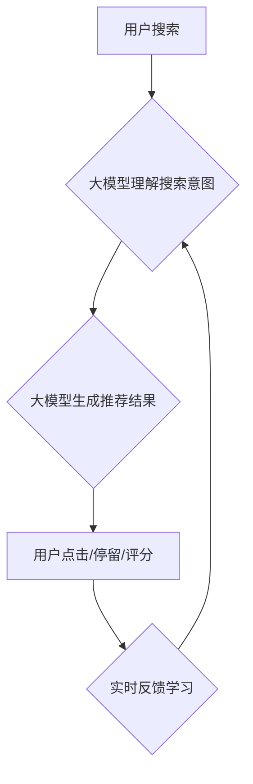

                 

## 搜索推荐的实时反馈学习：大模型策略

> 关键词：搜索推荐、实时反馈学习、大模型、强化学习、用户行为、个性化推荐

## 1. 背景介绍

在当今数据爆炸的时代，搜索引擎和推荐系统已成为人们获取信息和发现内容的重要途径。传统的搜索推荐系统主要依赖于基于内容的过滤和协同过滤等方法，这些方法往往难以捕捉用户细粒度的兴趣偏好和动态变化。随着深度学习技术的快速发展，大模型在自然语言处理、计算机视觉等领域取得了突破性进展，为搜索推荐领域带来了新的机遇。

实时反馈学习 (Real-Time Feedback Learning) 是一种新兴的搜索推荐技术，它利用用户在搜索和浏览过程中的实时反馈信息，不断优化推荐模型，以提供更精准、更个性化的推荐结果。大模型的强大能力可以有效地处理海量用户数据和复杂特征，为实时反馈学习提供了强大的支持。

## 2. 核心概念与联系

### 2.1  实时反馈学习

实时反馈学习的核心思想是利用用户在搜索和浏览过程中的实时反馈信息，例如点击、停留时间、评分等，来不断调整和优化推荐模型。这种反馈机制可以帮助推荐系统更准确地理解用户的兴趣偏好，并提供更符合用户需求的推荐结果。

### 2.2  大模型

大模型是指参数规模庞大、训练数据海量的人工智能模型。大模型通常具有强大的泛化能力和表示能力，能够学习到更复杂的特征和模式。在搜索推荐领域，大模型可以用于理解用户搜索意图、挖掘用户兴趣偏好、生成个性化推荐结果等。

### 2.3  核心概念关系

实时反馈学习和大模型在搜索推荐领域相互促进，形成了一个良性循环。大模型可以有效地处理海量用户数据和复杂特征，为实时反馈学习提供强大的数据支撑和模型能力。而实时反馈学习则可以帮助大模型不断学习和优化，提高推荐效果。

**Mermaid 流程图**



## 3. 核心算法原理 & 具体操作步骤

### 3.1  算法原理概述

实时反馈学习算法通常基于强化学习 (Reinforcement Learning) 的原理。在强化学习中，推荐系统被视为一个智能体，用户行为被视为奖励信号。通过不断学习用户反馈，推荐系统可以调整自己的策略，以最大化获得奖励。

### 3.2  算法步骤详解

1. **初始化推荐模型:**  首先，需要初始化一个推荐模型，例如基于深度学习的推荐模型。
2. **用户搜索:** 用户输入搜索关键词，推荐系统根据用户历史行为和搜索关键词生成推荐结果。
3. **用户反馈:** 用户对推荐结果进行交互，例如点击、停留时间、评分等。
4. **奖励信号:** 根据用户反馈，生成相应的奖励信号。例如，用户点击推荐结果可以获得正向奖励，用户不点击则获得负向奖励。
5. **模型更新:** 利用强化学习算法，根据奖励信号更新推荐模型的参数，以提高推荐效果。
6. **循环迭代:** 重复步骤2-5，不断学习和优化推荐模型。

### 3.3  算法优缺点

**优点:**

* **个性化推荐:**  实时反馈学习可以根据用户的实时反馈，提供更个性化的推荐结果。
* **动态调整:**  推荐系统可以根据用户行为的变化，动态调整推荐策略，以适应用户的不断变化的兴趣偏好。
* **持续优化:**  通过不断学习用户反馈，推荐系统可以持续优化推荐效果。

**缺点:**

* **数据依赖:**  实时反馈学习算法依赖于大量的用户反馈数据，如果没有足够的反馈数据，算法效果可能会受到影响。
* **冷启动问题:**  对于新用户或新商品，由于缺乏历史反馈数据，实时反馈学习算法难以提供准确的推荐结果。
* **反馈延迟:**  用户反馈可能存在一定的延迟，这可能会影响推荐系统的实时性。

### 3.4  算法应用领域

实时反馈学习算法广泛应用于搜索推荐、电商推荐、内容推荐等领域。例如，在搜索引擎中，实时反馈学习可以帮助搜索引擎更准确地理解用户的搜索意图，并提供更相关的搜索结果。在电商平台中，实时反馈学习可以帮助电商平台推荐更符合用户需求的商品。

## 4. 数学模型和公式 & 详细讲解 & 举例说明

### 4.1  数学模型构建

在实时反馈学习中，通常使用马尔可夫决策过程 (Markov Decision Process, MDP) 来建模推荐系统。MDP 由以下几个组成部分组成：

* **状态空间 (State Space):**  表示推荐系统可能处于的各种状态，例如用户当前的兴趣偏好、浏览历史等。
* **动作空间 (Action Space):**  表示推荐系统可以采取的各种动作，例如推荐某个商品、展示某个广告等。
* **转移概率 (Transition Probability):**  表示从一个状态到另一个状态的概率，取决于用户采取的动作。
* **奖励函数 (Reward Function):**  表示用户采取某个动作后获得的奖励，例如用户点击推荐结果获得正向奖励，用户不点击则获得负向奖励。

### 4.2  公式推导过程

强化学习的目标是找到一个最优策略，使得推荐系统在长期内获得最大的总奖励。最优策略可以通过动态规划 (Dynamic Programming) 或蒙特卡罗方法 (Monte Carlo Methods) 来求解。

**Bellman 方程:**

$$
V(s) = \max_a \left[ R(s, a) + \gamma \sum_{s'} P(s' | s, a) V(s') \right]
$$

其中：

* $V(s)$ 表示状态 $s$ 的价值函数。
* $R(s, a)$ 表示在状态 $s$ 执行动作 $a$ 后获得的奖励。
* $\gamma$ 表示折扣因子，控制未来奖励的权重。
* $P(s' | s, a)$ 表示从状态 $s$ 执行动作 $a$ 后转移到状态 $s'$ 的概率。

### 4.3  案例分析与讲解

假设一个推荐系统需要推荐电影给用户。

* **状态空间:** 用户的观看历史、评分记录、年龄、性别等。
* **动作空间:** 推荐不同的电影。
* **转移概率:** 用户观看电影后，可能会对其他电影产生兴趣，或者对某些类型的电影失去兴趣。
* **奖励函数:** 用户观看电影后，可能会给出评分，或者点击观看更多电影。

通过训练强化学习模型，推荐系统可以学习到用户观看电影的偏好，并推荐更符合用户兴趣的电影。

## 5. 项目实践：代码实例和详细解释说明

### 5.1  开发环境搭建

* **操作系统:** Linux/macOS
* **编程语言:** Python
* **深度学习框架:** TensorFlow/PyTorch
* **其他工具:** Git、Docker

### 5*2 源代码详细实现

```python
# 导入必要的库
import tensorflow as tf

# 定义推荐模型
class RecommenderModel(tf.keras.Model):
    def __init__(self, embedding_dim, num_users, num_items):
        super(RecommenderModel, self).__init__()
        self.user_embedding = tf.keras.layers.Embedding(num_users, embedding_dim)
        self.item_embedding = tf.keras.layers.Embedding(num_items, embedding_dim)

    def call(self, user_id, item_id):
        user_embedding = self.user_embedding(user_id)
        item_embedding = self.item_embedding(item_id)
        return tf.reduce_sum(user_embedding * item_embedding, axis=-1)

# 训练模型
model = RecommenderModel(embedding_dim=64, num_users=1000, num_items=10000)
optimizer = tf.keras.optimizers.Adam()
loss_fn = tf.keras.losses.MeanSquaredError()

# 训练循环
for epoch in range(10):
    for user_id, item_id, rating in train_data:
        with tf.GradientTape() as tape:
            predictions = model(user_id, item_id)
            loss = loss_fn(ratings, predictions)
        gradients = tape.gradient(loss, model.trainable_variables)
        optimizer.apply_gradients(zip(gradients, model.trainable_variables))

# 保存模型
model.save("recommender_model.h5")

```

### 5.3  代码解读与分析

* **模型定义:**  代码定义了一个简单的推荐模型，使用嵌入层来表示用户和物品的特征。
* **训练模型:**  代码使用 Adam 优化器和均方误差损失函数来训练模型。
* **训练循环:**  代码使用训练数据进行迭代训练，并计算损失函数值。
* **保存模型:**  训练完成后，代码将模型保存为 h5 文件。

### 5.4  运行结果展示

训练完成后，可以使用保存的模型对新的用户和物品进行推荐。

## 6. 实际应用场景

### 6.1  电商推荐

实时反馈学习可以帮助电商平台推荐更符合用户需求的商品。例如，当用户浏览某个商品时，推荐系统可以根据用户的浏览历史、购买记录等信息，推荐其他用户也感兴趣的商品。

### 6.2  内容推荐

实时反馈学习可以帮助内容平台推荐更符合用户兴趣的内容。例如，当用户观看某个视频时，推荐系统可以根据用户的观看历史、点赞记录等信息，推荐其他用户也喜欢观看的视频。

### 6.3  搜索引擎推荐

实时反馈学习可以帮助搜索引擎推荐更相关的搜索结果。例如，当用户搜索某个关键词时，推荐系统可以根据用户的搜索历史、点击记录等信息，推荐其他用户也搜索过的相关结果。

### 6.4  未来应用展望

随着大模型技术的不断发展，实时反馈学习在搜索推荐领域的应用前景更加广阔。未来，实时反馈学习可以应用于更多场景，例如个性化教育推荐、医疗健康推荐等。

## 7. 工具和资源推荐

### 7.1  学习资源推荐

* **书籍:**
    * 《深度强化学习》
    * 《强化学习：算法、策略和应用》
* **在线课程:**
    * Coursera: 强化学习
    * Udacity: 深度强化学习

### 7.2  开发工具推荐

* **深度学习框架:** TensorFlow, PyTorch
* **数据处理工具:** Pandas, NumPy
* **云计算平台:** AWS, Azure, GCP

### 7.3  相关论文推荐

* **《Attention Is All You Need》**
* **《BERT: Pre-training of Deep Bidirectional Transformers for Language Understanding》**
* **《Transformer-XL: Attentive Language Models Beyond a Fixed-Length Context》**

## 8. 总结：未来发展趋势与挑战

### 8.1  研究成果总结

实时反馈学习和大模型在搜索推荐领域取得了显著的成果，能够提供更精准、更个性化的推荐结果。

### 8.2  未来发展趋势

* **模型规模和复杂度提升:**  未来，大模型的规模和复杂度将会进一步提升，能够学习到更丰富的用户特征和模式。
* **多模态融合:**  未来，实时反馈学习将与多模态数据融合，例如文本、图像、视频等，提供更全面的用户体验。
* **联邦学习:**  未来，联邦学习技术将应用于实时反馈学习，保护用户隐私的同时，实现数据共享和模型协同训练。

### 8.3  面临的挑战

* **数据安全和隐私保护:**  实时反馈学习依赖于大量的用户数据，如何保护用户隐私是一个重要的挑战。
* **冷启动问题:**  对于新用户或新商品，实时反馈学习算法难以提供准确的推荐结果，需要寻找新的解决方案。
* **算法效率:**  大模型训练和推理过程耗时较长，需要提高算法效率。

### 8.4  研究展望

未来，实时反馈学习和大模型将继续推动搜索推荐领域的创新发展，为用户提供更智能、更个性化的体验。


## 9. 附录：常见问题与解答

**Q1: 实时反馈学习和协同过滤有什么区别？**

**A1:**  协同过滤主要基于用户的历史行为，推荐与用户相似用户的喜好。而实时反馈学习则利用用户的实时反馈，不断调整推荐策略，更能适应用户的动态变化。

**Q2: 如何解决实时反馈学习中的冷启动问题？**

**A2:**  一些方法可以缓解冷启动问题，例如：

* 利用用户画像信息进行推荐。
* 利用内容特征进行推荐。
* 使用迁移学习技术，将已训练好的模型迁移到新的场景。

**Q3: 实时反馈学习的训练数据需要满足哪些条件？**

**A3:**  训练数据需要包含用户行为信息，例如点击、停留时间、评分等，以及相应的上下文信息，例如用户特征、商品特征等。数据需要真实、完整、多样化。


作者：禅与计算机程序设计艺术 / Zen and the Art of Computer Programming 
<end_of_turn>

