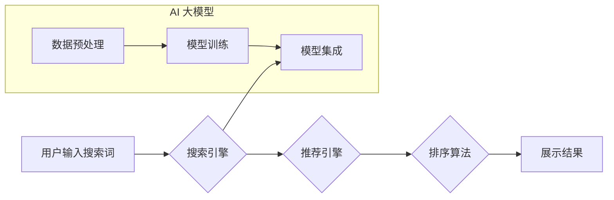

                 

## 1. 背景介绍

在当今数据爆炸的时代，电商平台面临着激烈的竞争。用户在海量商品中寻找所需产品，效率和精准度成为关键。传统的搜索推荐系统，基于规则和特征工程，难以满足用户个性化需求和快速变化的市场趋势。而近年来，人工智能（AI）技术，特别是大模型的快速发展，为电商平台带来了新的机遇。

AI 大模型，例如 Transformer、BERT 等，凭借其强大的语义理解和泛化能力，能够从海量数据中学习用户偏好、商品特征和市场趋势，从而构建更精准、更个性化的搜索推荐系统。

## 2. 核心概念与联系

### 2.1 搜索推荐系统

搜索推荐系统是电商平台的核心功能之一，旨在帮助用户快速找到所需商品。它通常由以下几个模块组成：

* **搜索引擎:** 处理用户搜索词，并返回相关商品列表。
* **推荐引擎:** 基于用户历史行为、商品特征等信息，推荐用户可能感兴趣的商品。
* **排序算法:** 对搜索结果和推荐结果进行排序，展示最相关的商品。
* **个性化引擎:** 根据用户画像和行为，个性化推荐商品。

### 2.2 AI 大模型

AI 大模型是指在海量数据上训练的深度学习模型，具有强大的泛化能力和语义理解能力。常见的 AI 大模型包括：

* **Transformer:** 用于自然语言处理任务，例如文本分类、机器翻译、问答系统等。
* **BERT:** 基于 Transformer 的模型，擅长理解上下文信息，在搜索推荐领域应用广泛。
* **GPT:** 生成式预训练模型，能够生成高质量的文本，例如商品描述、广告文案等。

### 2.3 融合架构

将 AI 大模型与搜索推荐系统融合，可以构建更智能、更精准的推荐系统。融合架构通常包括以下步骤：

1. **数据预处理:** 将原始数据清洗、转换、格式化，以便 AI 大模型训练。
2. **模型训练:** 使用海量数据训练 AI 大模型，例如 BERT，使其能够理解用户需求和商品特征。
3. **模型集成:** 将训练好的 AI 大模型与搜索推荐系统中的各个模块集成，例如搜索引擎、推荐引擎、排序算法等。
4. **系统评估:** 对融合后的系统进行评估，并不断优化模型参数和系统架构。



## 3. 核心算法原理 & 具体操作步骤

### 3.1 算法原理概述

在搜索推荐系统中，常用的算法包括：

* **基于内容的推荐:** 根据商品的特征，例如类别、品牌、价格等，推荐与用户历史行为相似的商品。
* **基于协同过滤的推荐:** 根据用户的历史行为，例如购买记录、浏览记录等，推荐与其他用户相似的人也喜欢的商品。
* **深度学习推荐:** 使用深度学习模型，例如 Transformer、BERT 等，学习用户偏好和商品特征，进行更精准的推荐。

### 3.2 算法步骤详解

以深度学习推荐为例，其具体操作步骤如下：

1. **数据收集:** 收集用户行为数据、商品特征数据等。
2. **数据预处理:** 清洗、转换、格式化数据，例如将文本数据转换为词向量。
3. **模型选择:** 选择合适的深度学习模型，例如 Transformer、BERT 等。
4. **模型训练:** 使用训练数据训练模型，并调整模型参数。
5. **模型评估:** 使用测试数据评估模型性能，例如准确率、召回率等。
6. **模型部署:** 将训练好的模型部署到生产环境中。

### 3.3 算法优缺点

**深度学习推荐算法**

* **优点:** 能够学习用户复杂偏好，推荐效果更精准。
* **缺点:** 需要海量数据训练，训练成本高，模型解释性差。

### 3.4 算法应用领域

深度学习推荐算法广泛应用于电商平台、视频网站、音乐平台等领域，例如：

* **商品推荐:** 推荐用户可能感兴趣的商品。
* **内容推荐:** 推荐用户可能感兴趣的视频、文章、音乐等内容。
* **广告推荐:** 推荐与用户兴趣相关的广告。

## 4. 数学模型和公式 & 详细讲解 & 举例说明

### 4.1 数学模型构建

深度学习推荐系统通常使用以下数学模型：

* **用户-商品交互矩阵:** 用来表示用户对商品的评分或行为，例如购买、浏览、点赞等。

* **嵌入向量:** 将用户和商品映射到低维向量空间，以便模型学习用户和商品之间的关系。

* **损失函数:** 用于衡量模型预测结果与真实结果之间的差异，例如均方误差（MSE）、交叉熵损失（Cross-Entropy Loss）等。

### 4.2 公式推导过程

以协同过滤推荐为例，其目标是预测用户对商品的评分。

假设用户 $u$ 对商品 $i$ 的评分为 $r_{ui}$，则可以使用以下公式预测用户 $u$ 对商品 $i$ 的评分：

$$
\hat{r}_{ui} = \mathbf{u} \cdot \mathbf{i} + b_u + b_i
$$

其中：

* $\mathbf{u}$ 是用户 $u$ 的嵌入向量。
* $\mathbf{i}$ 是商品 $i$ 的嵌入向量。
* $b_u$ 是用户 $u$ 的偏差项。
* $b_i$ 是商品 $i$ 的偏差项。

### 4.3 案例分析与讲解

假设用户 $u$ 购买了商品 $i_1$ 和 $i_2$，并对商品 $i_3$ 进行了浏览。可以使用协同过滤算法预测用户 $u$ 对商品 $i_3$ 的评分。

首先，需要训练模型，学习用户和商品的嵌入向量以及偏差项。然后，可以使用公式预测用户 $u$ 对商品 $i_3$ 的评分。

## 5. 项目实践：代码实例和详细解释说明

### 5.1 开发环境搭建

* **操作系统:** Linux 或 macOS
* **编程语言:** Python
* **深度学习框架:** TensorFlow 或 PyTorch
* **数据存储:** MySQL 或 MongoDB

### 5.2 源代码详细实现

```python
# 使用 TensorFlow 实现协同过滤推荐

import tensorflow as tf

# 定义用户-商品交互矩阵
ratings = tf.constant([[5, 4, 3],
                      [3, 5, 0],
                      [0, 0, 5]])

# 定义用户和商品的嵌入向量
user_embeddings = tf.Variable(tf.random.normal([3, 10]))
item_embeddings = tf.Variable(tf.random.normal([3, 10]))

# 计算预测评分
predictions = tf.matmul(user_embeddings, item_embeddings, transpose_b=True)

# 定义损失函数
loss = tf.reduce_mean(tf.square(predictions - ratings))

# 定义优化器
optimizer = tf.keras.optimizers.Adam()

# 训练模型
for epoch in range(100):
    with tf.GradientTape() as tape:
        loss_value = loss
    gradients = tape.gradient(loss_value, [user_embeddings, item_embeddings])
    optimizer.apply_gradients(zip(gradients, [user_embeddings, item_embeddings]))

# 打印预测结果
print(predictions)
```

### 5.3 代码解读与分析

* 代码首先定义了用户-商品交互矩阵 `ratings`。
* 然后定义了用户和商品的嵌入向量 `user_embeddings` 和 `item_embeddings`。
* 使用矩阵乘法计算预测评分 `predictions`。
* 定义了均方误差损失函数 `loss`，并使用 Adam 优化器训练模型。
* 最后打印预测结果 `predictions`。

### 5.4 运行结果展示

运行代码后，会输出预测评分矩阵 `predictions`，其中每个元素表示模型预测的用户对商品的评分。

## 6. 实际应用场景

### 6.1 电商平台商品推荐

AI 大模型融合的搜索推荐系统可以帮助电商平台实现个性化商品推荐，提高用户转化率和销售额。例如，根据用户的浏览历史、购买记录、购物车内容等信息，推荐用户可能感兴趣的商品。

### 6.2 内容平台内容推荐

AI 大模型可以帮助内容平台推荐用户可能感兴趣的视频、文章、音乐等内容，提高用户粘性和活跃度。例如，根据用户的观看历史、点赞记录、评论内容等信息，推荐用户可能感兴趣的视频。

### 6.3 广告平台广告推荐

AI 大模型可以帮助广告平台推荐与用户兴趣相关的广告，提高广告点击率和转化率。例如，根据用户的浏览历史、购买记录、社交行为等信息，推荐用户可能感兴趣的广告。

### 6.4 未来应用展望

AI 大模型融合的搜索推荐系统未来将应用于更多领域，例如：

* **医疗保健:** 推荐患者可能需要的医疗服务和药物。
* **教育:** 推荐学生可能感兴趣的课程和学习资源。
* **金融:** 推荐用户可能需要的金融产品和服务。

## 7. 工具和资源推荐

### 7.1 学习资源推荐

* **书籍:**
    * Deep Learning by Ian Goodfellow, Yoshua Bengio, and Aaron Courville
    * Hands-On Machine Learning with Scikit-Learn, Keras & TensorFlow by Aurélien Géron
* **在线课程:**
    * TensorFlow Tutorials: https://www.tensorflow.org/tutorials
    * PyTorch Tutorials: https://pytorch.org/tutorials/

### 7.2 开发工具推荐

* **深度学习框架:** TensorFlow, PyTorch
* **数据处理工具:** Pandas, NumPy
* **机器学习库:** Scikit-learn

### 7.3 相关论文推荐

* BERT: Pre-training of Deep Bidirectional Transformers for Language Understanding
* Transformer: Attention Is All You Need
* Collaborative Filtering for Recommender Systems

## 8. 总结：未来发展趋势与挑战

### 8.1 研究成果总结

AI 大模型融合的搜索推荐系统取得了显著成果，能够提供更精准、更个性化的推荐，提升用户体验和商业价值。

### 8.2 未来发展趋势

* **模型规模和能力提升:** 未来 AI 大模型将更加庞大，具备更强的语义理解和推理能力。
* **多模态融合:** 将文本、图像、音频等多模态数据融合，构建更全面的用户画像和商品理解。
* **个性化推荐增强:** 基于用户行为、偏好、上下文等信息，提供更精准、更个性化的推荐。
* **解释性增强:** 提高 AI 模型的解释性，帮助用户理解推荐结果背后的逻辑。

### 8.3 面临的挑战

* **数据质量和隐私:** 训练高质量的 AI 大模型需要海量数据，同时需要保证数据隐私和安全。
* **模型训练成本:** 训练大型 AI 模型需要大量的计算资源和时间，成本较高。
* **模型解释性:** AI 模型的决策过程通常是复杂的，难以解释，这可能会导致用户信任度下降。

### 8.4 研究展望

未来研究将重点关注以下方面:

* 开发更有效的训练方法，降低模型训练成本。
* 提高模型的解释性，增强用户信任度。
* 探索多模态融合的应用，构建更全面的推荐系统。
* 研究 AI 大模型在不同领域的应用，推动 AI 技术的落地。

## 9. 附录：常见问题与解答

### 9.1 如何选择合适的 AI 大模型？

选择合适的 AI 大模型需要根据具体应用场景和数据特点进行考虑。例如，对于文本分类任务，BERT 通常是一个不错的选择；对于图像识别任务，ResNet 或 Inception 是常用的模型。

### 9.2 如何评估 AI 大模型的性能？

常用的评估指标包括准确率、召回率、F1-score、AUC 等。选择合适的评估指标需要根据具体任务和数据特点进行考虑。

### 9.3 如何解决数据稀疏性问题？

数据稀疏性是推荐系统中常见的问题，可以使用以下方法进行解决：

* **协同过滤:** 利用用户和商品之间的交互关系进行推荐。
* **内容基推荐:** 利用商品的特征进行推荐。
* **混合推荐:** 将协同过滤和内容基推荐相结合。


作者：禅与计算机程序设计艺术 / Zen and the Art of Computer Programming 
<end_of_turn>

