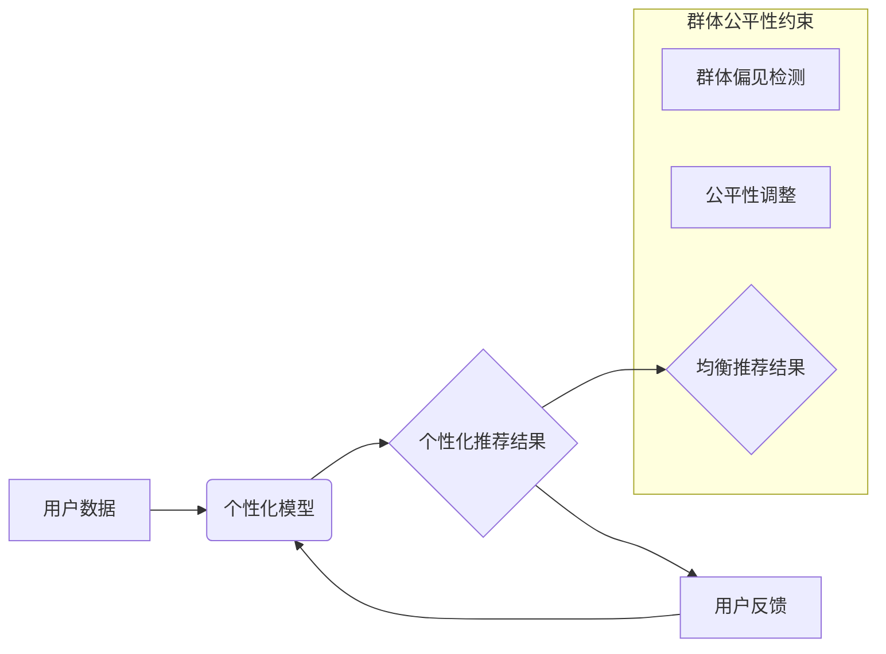

                 

## 搜索结果个性化与群体公平性的大模型均衡策略

> 关键词：大模型、搜索结果个性化、群体公平性、均衡策略、算法公平性、推荐系统、机器学习

## 1. 背景介绍

随着大模型技术的蓬勃发展，搜索引擎和推荐系统迎来了前所未有的机遇。大模型能够学习海量数据，生成更精准、更个性化的搜索结果和推荐内容，提升用户体验。然而，个性化推荐也带来了新的挑战，其中群体公平性问题尤为突出。

传统搜索引擎基于关键词匹配和页面排名算法，结果相对客观公正。而个性化推荐则根据用户的历史行为、偏好等信息，定制化推荐结果，可能导致“信息茧房”现象，用户只接触到符合自身偏好的信息，缺乏多元化视角，不利于社会认知的拓展和群体公平的实现。

## 2. 核心概念与联系

**2.1 个性化推荐**

个性化推荐是指根据用户的个人特征、行为模式等信息，定制化推荐内容，以满足用户的个性化需求。其核心目标是提高用户满意度和留存率。

**2.2 群体公平性**

群体公平性是指在推荐系统中，不同群体用户获得的推荐结果应该尽可能公平，避免因性别、种族、地域等因素导致的歧视或偏见。

**2.3 大模型均衡策略**

大模型均衡策略旨在在个性化推荐和群体公平性之间寻求平衡，通过算法设计和模型调优，实现个性化推荐的同时，保障不同群体用户获得公平、公正的推荐结果。

**2.4 Mermaid 流程图**



## 3. 核心算法原理 & 具体操作步骤

**3.1 算法原理概述**

大模型均衡策略的核心是通过引入群体公平性约束，在个性化推荐模型训练过程中，引导模型学习公平的推荐规则，避免产生群体偏见。常用的方法包括：

* **公平性度量指标:** 使用如公平性损失函数、均等机会指标等度量推荐结果的公平性，并将其作为模型训练的目标之一。
* **对抗训练:** 将公平性约束作为对抗目标，训练模型抵抗群体偏见的影响，提高模型的公平性鲁棒性。
* **正则化项:** 在模型损失函数中添加正则化项，惩罚模型学习到与群体公平性相违背的特征，引导模型学习更公平的表示。

**3.2 算法步骤详解**

1. **数据预处理:** 收集用户数据，并进行清洗、去噪、特征工程等处理，确保数据质量。
2. **公平性度量指标选择:** 根据具体应用场景选择合适的公平性度量指标，例如：
    * **Equalized Odds:** 衡量不同群体用户在正负样本预测准确率上的差异。
    * **Demographic Parity:** 衡量不同群体用户在推荐结果上的比例差异。
    * **Calibration:** 衡量不同群体用户在推荐结果上的置信度差异。
3. **模型训练:** 使用大模型框架，训练个性化推荐模型，并将其公平性度量指标作为损失函数的一部分。
4. **公平性调整:** 根据公平性度量指标的结果，对模型进行调整，例如：
    * **权重调整:** 对不同群体用户的权重进行调整，平衡不同群体用户的推荐结果。
    * **特征选择:** 选择与公平性相关的特征，并对其进行加权或过滤，减少模型对群体偏见特征的依赖。
5. **模型评估:** 使用测试集评估模型的性能，包括个性化推荐效果和公平性指标。
6. **迭代优化:** 根据评估结果，对模型进行迭代优化，不断提高模型的个性化推荐效果和公平性。

**3.3 算法优缺点**

* **优点:**
    * 能够有效地缓解群体偏见问题，提高推荐系统的公平性。
    * 能够兼顾个性化推荐和群体公平性，实现两者之间的平衡。
* **缺点:**
    * 需要大量的用户数据和计算资源进行训练。
    * 难以完全消除群体偏见，需要不断地进行模型优化和调整。

**3.4 算法应用领域**

* 搜索引擎结果个性化
* 内容推荐系统
* 社交网络推荐
* 医疗保健推荐
* 教育资源推荐

## 4. 数学模型和公式 & 详细讲解 & 举例说明

**4.1 数学模型构建**

假设我们有一个包含N个用户的推荐系统，每个用户属于一个特定的群体，例如性别、种族、年龄等。我们用$u_i$表示第i个用户，$g_i$表示第i个用户的群体标签，$r_{ui}$表示用户$u_i$对物品$i$的评分。我们的目标是构建一个推荐模型，能够同时满足以下两个目标：

* **个性化推荐:** 预测用户对物品的评分，并推荐用户可能感兴趣的物品。
* **群体公平性:** 确保不同群体用户获得公平的推荐结果，避免群体偏见。

**4.2 公式推导过程**

我们可以使用一个基于深度学习的推荐模型，例如多层感知机（MLP）或图神经网络（GNN），来实现上述目标。在模型训练过程中，我们使用以下损失函数：

$$L = \lambda_1 L_{personalization} + \lambda_2 L_{fairness}$$

其中：

* $L_{personalization}$ 是个性化推荐损失函数，例如均方误差（MSE）或二分类交叉熵损失函数。
* $L_{fairness}$ 是公平性损失函数，例如Equalized Odds损失函数或Demographic Parity损失函数。
* $\lambda_1$ 和 $\lambda_2$ 是权重参数，用于平衡个性化推荐和群体公平性的目标。

**4.3 案例分析与讲解**

假设我们有一个电影推荐系统，其中用户属于不同的性别群体。我们使用Equalized Odds损失函数来衡量公平性，目标是确保不同性别用户在正负样本预测准确率上没有显著差异。

在训练过程中，我们可以通过调整$\lambda_1$和$\lambda_2$的权重，来平衡个性化推荐和公平性目标。如果$\lambda_2$的值较大，则模型会更加注重公平性，可能会牺牲一些个性化推荐效果。反之，如果$\lambda_1$的值较大，则模型会更加注重个性化推荐，可能会导致群体偏见。

## 5. 项目实践：代码实例和详细解释说明

**5.1 开发环境搭建**

* Python 3.7+
* TensorFlow 2.x 或 PyTorch 1.x
* Jupyter Notebook 或 VS Code

**5.2 源代码详细实现**

```python
import tensorflow as tf

# 定义个性化推荐模型
class RecommenderModel(tf.keras.Model):
    def __init__(self, embedding_dim, num_users, num_items):
        super(RecommenderModel, self).__init__()
        self.user_embedding = tf.keras.layers.Embedding(num_users, embedding_dim)
        self.item_embedding = tf.keras.layers.Embedding(num_items, embedding_dim)

    def call(self, user_ids, item_ids):
        user_embeddings = self.user_embedding(user_ids)
        item_embeddings = self.item_embedding(item_ids)
        return tf.reduce_sum(user_embeddings * item_embeddings, axis=1)

# 定义公平性损失函数
def equalized_odds_loss(y_true, y_pred, group_labels):
    # 计算不同群体用户的预测结果
    group_preds = tf.gather(y_pred, group_labels)
    # 计算不同群体用户的损失
    group_losses = tf.keras.losses.binary_crossentropy(y_true, group_preds)
    # 计算平均损失
    return tf.reduce_mean(group_losses)

# 训练模型
model = RecommenderModel(embedding_dim=64, num_users=1000, num_items=1000)
optimizer = tf.keras.optimizers.Adam(learning_rate=0.001)
loss_fn = lambda y_true, y_pred: equalized_odds_loss(y_true, y_pred, group_labels)

# 训练循环
for epoch in range(10):
    for batch in data_loader:
        with tf.GradientTape() as tape:
            predictions = model(batch['user_ids'], batch['item_ids'])
            loss = loss_fn(batch['labels'], predictions)
        gradients = tape.gradient(loss, model.trainable_variables)
        optimizer.apply_gradients(zip(gradients, model.trainable_variables))

```

**5.3 代码解读与分析**

* 代码首先定义了一个个性化推荐模型，使用嵌入层来学习用户和物品的表示。
* 然后定义了一个公平性损失函数，使用Equalized Odds损失函数来衡量不同群体用户的预测结果的差异。
* 训练模型时，使用公平性损失函数作为损失函数的一部分，并通过调整权重参数来平衡个性化推荐和公平性目标。

**5.4 运行结果展示**

训练完成后，可以评估模型的性能，包括个性化推荐效果和公平性指标。可以使用测试集上的预测结果，计算模型的准确率、召回率、F1-score等指标。

## 6. 实际应用场景

**6.1 搜索引擎结果个性化**

搜索引擎可以根据用户的搜索历史、浏览记录、地理位置等信息，个性化推荐搜索结果，提高用户体验。

**6.2 内容推荐系统**

新闻、视频、音乐等内容平台可以根据用户的兴趣偏好，个性化推荐内容，提高用户粘性和活跃度。

**6.3 社交网络推荐**

社交网络平台可以根据用户的社交关系、兴趣爱好等信息，推荐新的朋友、群组或内容，增强用户互动和社交体验。

**6.4 医疗保健推荐**

医疗保健平台可以根据用户的病史、症状、生活习惯等信息，推荐相关的医疗服务、药物或健康资讯，提高医疗服务效率和用户满意度。

**6.5 教育资源推荐**

教育平台可以根据学生的学习进度、兴趣爱好等信息，推荐相关的学习资源、课程或辅导服务，个性化学习体验。

**6.4 未来应用展望**

随着大模型技术的不断发展，大模型均衡策略将在更多领域得到应用，例如：

* **个性化广告推荐:** 提高广告精准度，降低广告打扰。
* **金融服务推荐:** 提供个性化的理财建议和投资方案。
* **智能家居推荐:** 根据用户的行为模式，个性化推荐家居设备和服务。

## 7. 工具和资源推荐

**7.1 学习资源推荐**

* **书籍:**
    * Fairness in Machine Learning by Nishant Shah
    * The Master Algorithm by Pedro Domingos
* **论文:**
    * On the Dangers of Stochastic Parrots: Can Language Models Be Too Big?
    * Mitigating Bias in Machine Learning

**7.2 开发工具推荐**

* **TensorFlow:** https://www.tensorflow.org/
* **PyTorch:** https://pytorch.org/
* **Hugging Face Transformers:** https://huggingface.co/transformers/

**7.3 相关论文推荐**

* **Fairness through Awareness**
* **Adversarial Debiasing**
* **Learning Fair Representations**

## 8. 总结：未来发展趋势与挑战

**8.1 研究成果总结**

大模型均衡策略在解决搜索结果个性化与群体公平性之间的矛盾方面取得了显著进展。通过引入公平性约束和算法优化，能够有效地缓解群体偏见问题，提高推荐系统的公平性。

**8.2 未来发展趋势**

* **更有效的公平性度量指标:** 探索更精准、更全面地衡量推荐系统公平性的指标。
* **更鲁棒的公平性算法:** 研究更鲁棒、更有效的公平性算法，能够抵抗对抗攻击和数据分布变化的影响。
* **可解释性增强:** 提高大模型均衡策略的可解释性，帮助用户理解模型的决策过程，增强用户信任。

**8.3 面临的挑战**

* **数据偏见:** 现实世界数据往往存在偏见，难以完全消除数据偏见对模型的影响。
* **公平性定义:** 群体公平性的定义和衡量标准存在争议，需要进一步探讨和完善。
* **模型复杂性:** 大模型的复杂性使得其训练和调优难度较大，需要更强大的计算资源和算法技术。

**8.4 研究展望**

未来，大模型均衡策略的研究将继续深入，探索更有效的算法、更精准的度量指标和更完善的理论框架，推动推荐系统朝着更加公平、公正、可解释的方向发展。

## 9. 附录：常见问题与解答

**9.1 如何平衡个性化推荐和群体公平性？**

平衡个性化推荐和群体公平性是一个需要权衡的难题。可以通过调整公平性损失函数的权重，控制模型在个性化推荐和公平性方面的侧重程度。

**9.2 如何评估推荐系统的公平性？**

可以使用Equalized Odds、Demographic Parity等公平性度量指标来评估推荐系统的公平性。

**9.3 如何应对数据偏见问题？**

可以通过数据预处理、算法设计等方法来应对数据偏见问题。例如，可以使用数据清洗技术去除明显偏见的数据，或者使用对抗训练方法训练模型抵抗数据偏见的影响。


作者：禅与计算机程序设计艺术 / Zen and the Art of Computer Programming<end_of_turn>

