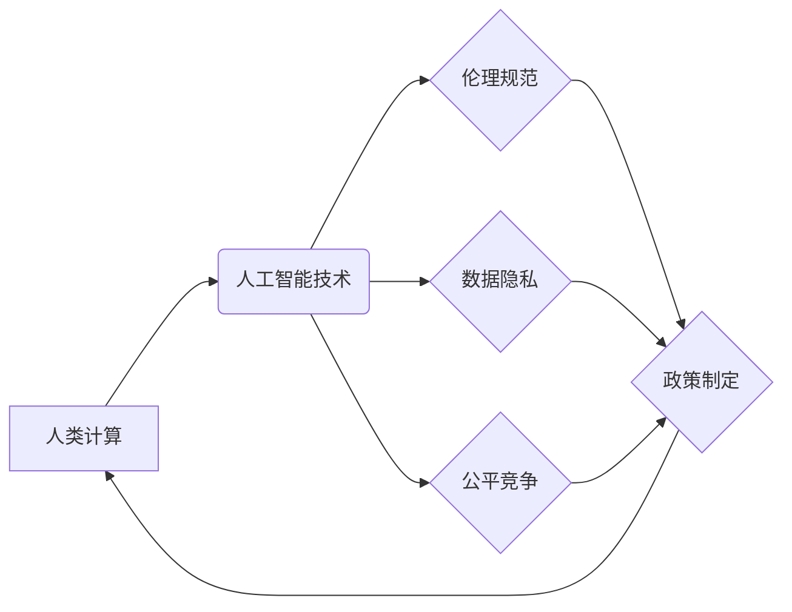

                 

## 政策与监管：引导人类计算的健康发展

> 关键词：人工智能、监管、伦理、可持续发展、数据隐私、算法透明度、公平性、法律框架、政策制定

### 1. 背景介绍

人类计算正处于一个前所未有的发展阶段。从语音助手到自动驾驶，从医疗诊断到金融交易，人工智能（AI）正在深刻地改变着我们的生活。然而，这种快速发展也带来了新的挑战和风险。算法偏差、数据隐私泄露、工作岗位替代等问题日益凸显，迫切需要制定有效的政策和监管机制，引导人类计算健康发展，确保其造福人类。

### 2. 核心概念与联系

**2.1 人类计算的本质**

人类计算是指利用计算机技术，特别是人工智能技术，模拟和增强人类的认知能力，解决复杂问题，提高生产效率和生活质量。它涵盖了广泛的领域，包括机器学习、深度学习、自然语言处理、计算机视觉等。

**2.2 政策与监管的作用**

政策和监管是引导人类计算发展的重要力量。它们可以：

* **设定伦理规范：** 确保人工智能技术应用符合人类价值观，避免造成社会伦理问题。
* **保护数据隐私：** 制定法律法规，保障个人数据安全，防止滥用和泄露。
* **促进公平竞争：** 建立公平的市场环境，避免垄断和不公平竞争。
* **引导技术发展方向：** 鼓励研究和开发安全、可靠、可解释的人工智能技术。

**2.3 核心概念关系图**

### 3. 核心算法原理 & 具体操作步骤

**3.1 算法原理概述**

本文将重点介绍机器学习算法，特别是深度学习算法，其原理和操作步骤。

机器学习算法是一种能够从数据中学习并不断改进的算法。它通过训练模型，使模型能够识别模式、做出预测或完成其他任务。深度学习算法是一种更高级的机器学习算法，它使用多层神经网络来模拟人类大脑的学习过程。

**3.2 算法步骤详解**

1. **数据收集和预处理:** 收集大量相关数据，并进行清洗、转换和特征工程等预处理步骤，以使数据适合模型训练。
2. **模型选择:** 根据任务需求选择合适的深度学习模型，例如卷积神经网络（CNN）、循环神经网络（RNN）或Transformer等。
3. **模型训练:** 使用训练数据训练模型，调整模型参数，使模型能够准确地识别模式或完成任务。
4. **模型评估:** 使用测试数据评估模型的性能，例如准确率、召回率、F1-score等指标。
5. **模型部署:** 将训练好的模型部署到实际应用场景中，例如用于图像识别、语音识别、自然语言处理等任务。

**3.3 算法优缺点**

**优点:**

* **高准确率:** 深度学习算法能够学习到复杂的模式，从而实现高准确率的预测和识别。
* **自动化学习:** 深度学习算法能够自动从数据中学习，无需人工特征工程。
* **可扩展性:** 深度学习模型可以轻松扩展到更大的数据集和更复杂的任务。

**缺点:**

* **数据依赖:** 深度学习算法需要大量数据进行训练，否则性能会下降。
* **计算资源消耗:** 训练深度学习模型需要大量的计算资源，例如GPU。
* **可解释性差:** 深度学习模型的决策过程难以解释，这可能导致信任问题。

**3.4 算法应用领域**

深度学习算法已广泛应用于各个领域，例如：

* **计算机视觉:** 图像识别、物体检测、图像分割、人脸识别等。
* **自然语言处理:** 文本分类、情感分析、机器翻译、对话系统等。
* **语音识别:** 语音转文本、语音助手等。
* **医疗诊断:** 疾病预测、影像分析、药物研发等。
* **金融分析:** 风险评估、欺诈检测、投资预测等。

### 4. 数学模型和公式 & 详细讲解 & 举例说明

**4.1 数学模型构建**

深度学习模型通常由多个神经网络层组成，每一层都包含多个神经元。每个神经元接收来自上一层的输入信号，并通过激活函数进行处理，输出到下一层。

**4.2 公式推导过程**

深度学习模型的训练过程基于梯度下降算法。目标函数通常是预测误差的平方和，梯度下降算法通过迭代更新模型参数，最小化目标函数值。

**损失函数:** $$L(w,b) = \frac{1}{N} \sum_{i=1}^{N} (y_i - \hat{y}_i)^2$$

其中：

* $w$ 和 $b$ 是模型参数。
* $N$ 是训练样本的数量。
* $y_i$ 是真实标签。
* $\hat{y}_i$ 是模型预测值。

**梯度:** $$\frac{\partial L}{\partial w} = \frac{1}{N} \sum_{i=1}^{N} 2(y_i - \hat{y}_i) \frac{\partial \hat{y}_i}{\partial w}$$

**参数更新:** $$w = w - \alpha \frac{\partial L}{\partial w}$$

其中：

* $\alpha$ 是学习率。

**4.3 案例分析与讲解**

例如，在图像分类任务中，深度学习模型可以学习到图像特征，并将其映射到不同的类别。训练过程中，模型会不断调整参数，使预测结果与真实标签越接近。

### 5. 项目实践：代码实例和详细解释说明

**5.1 开发环境搭建**

使用Python语言和深度学习框架TensorFlow或PyTorch搭建开发环境。

**5.2 源代码详细实现**

使用代码实现一个简单的图像分类模型，例如使用CNN分类手写数字。

**5.3 代码解读与分析**

解释代码中各个部分的功能，例如数据加载、模型定义、模型训练、模型评估等。

**5.4 运行结果展示**

展示模型训练过程中的损失曲线和准确率曲线，以及模型在测试集上的准确率。

### 6. 实际应用场景

**6.1 医疗诊断**

使用深度学习算法分析医学影像，辅助医生诊断疾病。

**6.2 金融风险评估**

使用深度学习算法分析金融数据，评估投资风险和欺诈行为。

**6.3 自动驾驶**

使用深度学习算法识别道路场景，控制车辆行驶。

**6.4 未来应用展望**

随着人工智能技术的不断发展，人类计算将在更多领域得到应用，例如个性化教育、智能制造、科学研究等。

### 7. 工具和资源推荐

**7.1 学习资源推荐**

* **书籍:** 《深度学习》
* **在线课程:** Coursera、edX、Udacity

**7.2 开发工具推荐**

* **深度学习框架:** TensorFlow、PyTorch
* **编程语言:** Python

**7.3 相关论文推荐**

* **ImageNet Classification with Deep Convolutional Neural Networks**

### 8. 总结：未来发展趋势与挑战

**8.1 研究成果总结**

人类计算取得了显著的进展，深度学习算法在多个领域取得了突破性成果。

**8.2 未来发展趋势**

* **模型更加强大:** 模型规模和能力将进一步提升，能够解决更复杂的任务。
* **算法更加高效:** 算法训练速度和效率将得到提高，降低计算成本。
* **应用更加广泛:** 人工智能技术将应用于更多领域，改变人们的生活方式。

**8.3 面临的挑战**

* **数据安全和隐私:** 人工智能算法依赖大量数据，如何保护数据安全和隐私是一个重要挑战。
* **算法可解释性:** 深度学习模型的决策过程难以解释，如何提高算法可解释性是一个关键问题。
* **伦理和社会影响:** 人工智能技术可能带来伦理和社会问题，需要制定相应的政策和规范。

**8.4 研究展望**

未来研究将重点关注解决上述挑战，开发更加安全、可靠、可解释的人工智能技术，并将其应用于造福人类的领域。

### 9. 附录：常见问题与解答

**9.1 如何选择合适的深度学习模型？**

选择合适的深度学习模型取决于具体的任务需求和数据特点。

**9.2 如何防止深度学习模型的过拟合？**

可以使用正则化技术、交叉验证等方法防止模型过拟合。

**9.3 如何评估深度学习模型的性能？**

可以使用准确率、召回率、F1-score等指标评估模型性能。

作者：禅与计算机程序设计艺术 / Zen and the Art of Computer Programming 
<end_of_turn>

