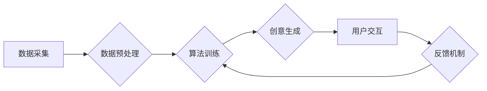

                 

##  数字化想象力培养皿设计师：AI激发的创意思维孵化器创造者

> 关键词：人工智能、创意思维、算法、数学模型、代码实现、应用场景、未来趋势

## 1. 背景介绍

在当今数据爆炸的时代，人类面临着前所未有的机遇和挑战。海量的数字信息蕴藏着无限的可能性，但如何有效地挖掘和利用这些信息，激发创新的火花，成为了摆在我们面前的关键问题。人工智能（AI）作为一种强大的工具，正在深刻地改变着我们与信息交互的方式，为我们提供了全新的视角和可能性。

传统的创意思维培养往往依赖于人类的经验和直觉，而AI技术的出现，为我们提供了全新的思路和方法。通过学习和分析海量数据，AI能够识别出人类难以察觉的模式和趋势，并以此为基础，生成新的创意和解决方案。

本篇文章将探讨如何利用AI技术构建一个“数字化想象力培养皿”，这是一个能够激发创意思维的孵化器，帮助我们更好地理解和利用数据，从而推动创新发展。

## 2. 核心概念与联系

### 2.1  数字化想象力

数字化想象力是指利用数字工具和技术，对现实世界进行重新构建和想象的能力。它不仅限于传统的视觉想象，还包括对数据、算法、模型等进行抽象和联想，从而产生新的创意和解决方案。

### 2.2  AI激发创意思维

AI技术能够通过以下方式激发创意思维：

* **数据挖掘和分析:** AI算法能够从海量数据中挖掘出隐藏的模式和趋势，为人类提供新的灵感和启示。
* **创意生成:** 基于深度学习技术，AI能够生成新的图像、文本、音乐等创意作品，为人类提供新的创作素材。
* **协同创新:** AI可以作为人类的创意伙伴，帮助人类进行头脑风暴、方案设计等协同创新活动。

### 2.3  孵化器架构

数字化想象力培养皿的设计需要考虑以下几个关键要素：

* **数据来源:** 培养皿需要获取丰富、高质量的数据，作为AI算法的训练素材和创意来源。
* **算法模型:** 需要选择合适的AI算法模型，例如生成对抗网络（GAN）、变分自编码器（VAE）等，以实现创意生成和数据分析的功能。
* **用户交互:** 培养皿需要提供友好的用户界面，方便用户输入创意指令、浏览生成结果、进行交互式创作。
* **评估机制:** 需要建立有效的评估机制，对AI生成的创意进行评价和反馈，不断优化算法模型和培养皿设计。

**Mermaid 流程图**



## 3. 核心算法原理 & 具体操作步骤

### 3.1  算法原理概述

本篇文章将重点介绍生成对抗网络（GAN）算法，它是一种能够生成逼真图像、文本、音乐等创意作品的AI算法。GAN由两个相互竞争的网络组成：生成器和鉴别器。

* **生成器:** 负责生成新的数据样本，例如图像、文本等。
* **鉴别器:** 负责判断数据样本是真实数据还是由生成器生成的伪造数据。

生成器和鉴别器在不断对抗中相互学习，最终生成器能够生成与真实数据几乎 indistinguishable 的数据样本。

### 3.2  算法步骤详解

1. **初始化:** 生成器和鉴别器网络的权重随机初始化。
2. **训练生成器:** 生成器根据随机噪声输入生成数据样本，并将样本输入鉴别器。
3. **训练鉴别器:** 鉴别器根据真实数据样本和生成器生成的样本进行训练，学习区分真实数据和伪造数据。
4. **更新生成器:** 根据鉴别器的反馈，更新生成器的权重，使其生成的样本能够更好地欺骗鉴别器。
5. **重复步骤2-4:** 循环进行上述步骤，直到生成器能够生成与真实数据几乎 indistinguishable 的数据样本。

### 3.3  算法优缺点

**优点:**

* **生成逼真数据:** GAN能够生成高质量、逼真的数据样本，例如图像、文本、音乐等。
* **应用广泛:** GAN在图像生成、文本生成、语音合成、药物设计等领域都有广泛的应用。

**缺点:**

* **训练困难:** GAN的训练过程比较复杂，容易陷入局部最优解，需要精心调参才能获得理想的结果。
* **模式坍缩:** 生成器可能会陷入模式坍缩，只生成一种或几种类型的样本，缺乏多样性。

### 3.4  算法应用领域

* **图像生成:** 生成逼真的图像，例如人脸、风景、物体等。
* **文本生成:** 生成高质量的文本，例如小说、诗歌、新闻报道等。
* **语音合成:** 生成逼真的语音，例如真人语音、虚拟助手等。
* **药物设计:** 生成新的药物分子，加速药物研发过程。

## 4. 数学模型和公式 & 详细讲解 & 举例说明

### 4.1  数学模型构建

GAN的数学模型主要包括生成器G和鉴别器D的损失函数。

* **生成器损失函数:** 生成器希望生成的数据样本能够被鉴别器误判为真实数据，因此其损失函数定义为鉴别器对生成样本的判别概率的负值。

$$
L_G = -log(D(G(z)))
$$

其中，$z$是随机噪声输入，$G(z)$是生成器生成的样本，$D(G(z))$是鉴别器对生成样本的判别概率。

* **鉴别器损失函数:** 鉴别器希望能够正确区分真实数据和生成样本，因此其损失函数定义为真实数据样本和生成样本的判别概率之差的平方。

$$
L_D = -log(D(x)) - log(1-D(G(z)))
$$

其中，$x$是真实数据样本。

### 4.2  公式推导过程

GAN的训练过程是一个最小化生成器损失函数，最大化鉴别器损失函数的过程。

通过梯度下降算法，不断更新生成器和鉴别器的权重，使得生成器生成的样本能够更好地欺骗鉴别器，而鉴别器能够更好地区分真实数据和生成样本。

### 4.3  案例分析与讲解

例如，在图像生成领域，可以使用GAN生成逼真的人脸图像。

训练数据可以是大量真实的人脸图像，生成器会学习这些图像的特征，并生成新的图像。鉴别器则会判断这些图像是否为真实的人脸图像。

通过不断的训练和对抗，生成器最终能够生成与真实人脸图像几乎 indistinguishable 的图像。

## 5. 项目实践：代码实例和详细解释说明

### 5.1  开发环境搭建

本项目使用Python语言进行开发，需要安装以下软件包：

* TensorFlow或PyTorch深度学习框架
* NumPy数值计算库
* Matplotlib数据可视化库

### 5.2  源代码详细实现

以下是一个简单的GAN代码示例，使用TensorFlow框架实现图像生成：

```python
import tensorflow as tf

# 定义生成器网络
def generator(z):
  # ...

# 定义鉴别器网络
def discriminator(x):
  # ...

# 定义损失函数和优化器
optimizer_G = tf.keras.optimizers.Adam(learning_rate=0.0002)
optimizer_D = tf.keras.optimizers.Adam(learning_rate=0.0002)
loss_fn = tf.keras.losses.BinaryCrossentropy()

# 训练循环
for epoch in range(num_epochs):
  for batch in dataset:
    # 训练生成器
    with tf.GradientTape() as tape_G:
      fake_images = generator(z)
      loss_G = loss_fn(tf.ones_like(discriminator(fake_images)), discriminator(fake_images))
    gradients_G = tape_G.gradient(loss_G, generator.trainable_variables)
    optimizer_G.apply_gradients(zip(gradients_G, generator.trainable_variables))

    # 训练鉴别器
    with tf.GradientTape() as tape_D:
      real_loss = loss_fn(tf.ones_like(discriminator(real_images)), discriminator(real_images))
      fake_loss = loss_fn(tf.zeros_like(discriminator(fake_images)), discriminator(fake_images))
      loss_D = real_loss + fake_loss
    gradients_D = tape_D.gradient(loss_D, discriminator.trainable_variables)
    optimizer_D.apply_gradients(zip(gradients_D, discriminator.trainable_variables))

# 保存生成器模型
generator.save("generator_model.h5")
```

### 5.3  代码解读与分析

* 代码首先定义了生成器和鉴别器网络的结构，可以使用不同的神经网络架构，例如卷积神经网络（CNN）或循环神经网络（RNN）。
* 然后定义了损失函数和优化器，用于训练生成器和鉴别器。
* 训练循环中，首先训练生成器，然后训练鉴别器，不断更新模型参数，使得生成器能够生成逼真的数据样本。
* 最后，保存训练好的生成器模型，以便后续使用。

### 5.4  运行结果展示

训练好的生成器模型可以用于生成新的数据样本，例如图像、文本等。

运行结果可以展示生成器生成的样本，并与真实数据样本进行比较，评估生成器的性能。

## 6. 实际应用场景

### 6.1  创意设计

* **图像生成:** 生成新的图像，例如产品设计、广告创意、艺术作品等。
* **文本生成:** 生成新的文本，例如故事、诗歌、剧本等。
* **音乐生成:** 生成新的音乐，例如背景音乐、主题曲等。

### 6.2  数据增强

* **图像增强:** 生成新的图像数据，用于训练图像识别模型，提高模型的泛化能力。
* **文本增强:** 生成新的文本数据，用于训练自然语言处理模型，例如机器翻译、文本摘要等。

### 6.3  个性化体验

* **个性化推荐:** 根据用户的喜好生成个性化的推荐内容，例如商品推荐、音乐推荐等。
* **个性化内容创作:** 根据用户的需求生成个性化的内容，例如新闻摘要、个性化故事等。

### 6.4  未来应用展望

* **虚拟现实和增强现实:** 生成逼真的虚拟场景和虚拟物体，增强用户体验。
* **自动驾驶:** 生成模拟驾驶场景，用于训练自动驾驶算法。
* **医疗保健:** 生成虚拟病人数据，用于训练医疗诊断模型。

## 7. 工具和资源推荐

### 7.1  学习资源推荐

* **书籍:**
    * 《Deep Learning》 by Ian Goodfellow, Yoshua Bengio, and Aaron Courville
    * 《Generative Deep Learning》 by David Foster
* **在线课程:**
    * Coursera: Deep Learning Specialization
    * Udacity: Deep Learning Nanodegree
* **博客和论坛:**
    * Towards Data Science
    * Reddit: r/MachineLearning

### 7.2  开发工具推荐

* **深度学习框架:** TensorFlow, PyTorch, Keras
* **数据可视化工具:** Matplotlib, Seaborn
* **代码编辑器:** VS Code, Jupyter Notebook

### 7.3  相关论文推荐

* **Generative Adversarial Networks** by Ian Goodfellow et al. (2014)
* **Improved Techniques for Training GANs** by Alec Radford et al. (2015)
* **Progressive Growing of GANs for Improved Quality, Stability, and Variation** by Tero Karras et al. (2017)

## 8. 总结：未来发展趋势与挑战

### 8.1  研究成果总结

数字化想象力培养皿的设计和构建是一个充满挑战和机遇的领域。

通过AI技术的不断发展，我们已经取得了一些重要的成果，例如生成逼真的图像、文本、音乐等。

这些成果为我们提供了新的思路和方法，推动了创意设计、数据增强、个性化体验等领域的创新发展。

### 8.2  未来发展趋势

* **模型增强:** 研究更强大的AI模型，能够生成更高质量、更多样化的创意作品。
* **跨模态生成:** 研究能够跨越不同模态（例如图像、文本、音频）进行创意生成的AI模型。
* **可解释性增强:** 研究更可解释的AI模型，以便更好地理解AI的决策过程，提高用户信任度。

### 8.3  面临的挑战

* **训练效率:** 训练大型AI模型需要大量的计算资源和时间，如何提高训练效率是一个重要的挑战。
* **数据安全:** AI模型的训练需要大量数据，如何保证数据的安全和隐私是一个重要的问题。
* **伦理问题:** AI生成的创意作品可能会引发伦理问题，例如版权问题、虚假信息问题等，需要认真思考和解决。

### 8.4  研究展望

数字化想象力培养皿的设计和构建是一个长期而持续的研究方向。

未来，我们将继续探索新的AI算法、新的应用场景，并积极应对挑战，推动AI技术更好地服务于人类社会。

## 9. 附录：常见问题与解答

### 9.1  Q1: GAN训练过程容易陷入局部最优解，如何解决这个问题？

**A1:** 

* 使用不同的初始化方法，例如随机初始化权重、使用预训练模型等。
* 使用不同的优化算法，例如Adam、RMSprop等。
* 使用正则化技术，例如Dropout、L2正则化等，防止模型过拟合。

### 9.2  Q2: 如何评估GAN生成的样本质量？

**A2:**

* 使用感知器测试，让人类评判生成的样本是否逼真。
* 使用客观评价指标，例如Inception Score、Fréchet Inception Distance等，量化生成的样本质量。

### 9.3  Q3: GAN的应用场景有哪些？

**A3:**

* 图像生成、文本生成、音乐生成
* 数据增强、个性化体验、虚拟现实和增强现实


作者：禅与计算机程序设计艺术 / Zen and the Art of Computer Programming 
<end_of_turn>

