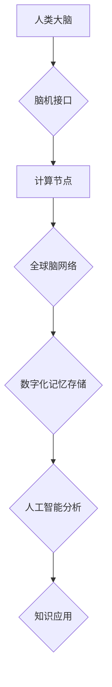

                 

##  数字化记忆：全球脑时代的知识传承

> 关键词：全球脑、知识传承、数字化记忆、人工智能、神经网络、大数据、计算模型、未来趋势

## 1. 背景介绍

人类文明的进步离不开知识的传承。从口耳相传到文字记载，再到现代的数字化存储，知识的载体不断演进。如今，随着人工智能技术的飞速发展，我们正站在一个新的历史节点上——全球脑时代的来临。全球脑是一个由大量计算节点组成的超级计算网络，它将连接人类大脑，实现知识的无缝共享和协同进化。

数字化记忆是全球脑时代的核心技术之一。它旨在将人类的知识、经验和记忆数字化存储，并通过人工智能算法进行分析、理解和应用。这将彻底改变我们获取、存储和利用知识的方式，为人类社会带来前所未有的机遇和挑战。

## 2. 核心概念与联系

### 2.1  全球脑的概念

全球脑是一个由大量计算节点组成的超级计算网络，它将连接人类大脑，实现知识的无缝共享和协同进化。

* **计算节点:** 包括个人设备、服务器、超级计算机等，它们通过高速网络互联，形成一个庞大的计算网络。
* **连接机制:** 利用脑机接口技术，将人类大脑与计算节点连接起来，实现实时数据传输和交互。
* **知识共享:** 通过全球脑网络，人类可以共享知识、经验和记忆，打破地域和语言的限制，实现知识的无缝流动。
* **协同进化:** 人类大脑和计算节点可以相互学习和进化，共同推动人类文明的进步。

### 2.2  数字化记忆的概念

数字化记忆是指将人类的知识、经验和记忆数字化存储，并通过人工智能算法进行分析、理解和应用的技术。

* **知识数字化:** 将人类的知识、经验和记忆转化为可被计算机理解和处理的数据格式。
* **存储技术:** 利用云存储、区块链等技术，安全可靠地存储数字化记忆。
* **人工智能分析:** 利用机器学习、深度学习等人工智能算法，分析和理解数字化记忆，提取其中的知识和规律。
* **应用场景:** 数字化记忆可以应用于教育、医疗、科研等各个领域，帮助人类更高效地获取、存储和利用知识。

### 2.3  核心概念联系

全球脑和数字化记忆是相互关联、相互促进的两个概念。

* **全球脑为数字化记忆提供了基础设施:** 全球脑网络提供了连接人类大脑和计算节点的平台，以及海量存储和计算资源。
* **数字化记忆丰富了全球脑的内容:** 数字化记忆将人类的知识、经验和记忆数字化存储，为全球脑网络提供了丰富的知识资源。
* **两者共同推动人类文明的进步:** 全球脑和数字化记忆的结合将极大地提升人类的认知能力和创造力，推动人类文明的进步。

**Mermaid 流程图**



## 3. 核心算法原理 & 具体操作步骤

### 3.1  算法原理概述

数字化记忆的核心算法原理是将人类的知识、经验和记忆转化为可被计算机理解和处理的数据格式，并利用人工智能算法进行分析、理解和应用。

主要算法包括：

* **知识图谱构建:** 将知识表示为图结构，方便知识的组织、检索和推理。
* **自然语言处理:** 将自然语言文本转化为计算机可理解的格式，提取其中的知识和信息。
* **机器学习:** 利用算法从数据中学习知识和规律，实现知识的自动提取和分类。
* **深度学习:** 利用多层神经网络，模拟人类大脑的学习机制，实现更复杂的知识理解和应用。

### 3.2  算法步骤详解

1. **数据采集:** 收集人类的知识、经验和记忆数据，包括文本、图像、音频、视频等多种形式。
2. **数据预处理:** 对采集到的数据进行清洗、格式化和转换，使其符合算法的输入要求。
3. **知识表示:** 将数据转化为计算机可理解的知识表示形式，例如知识图谱、语义网络等。
4. **知识提取:** 利用自然语言处理、机器学习等算法，从知识表示中提取关键信息和知识点。
5. **知识存储:** 将提取到的知识点存储到数据库或知识库中，方便后续的检索和应用。
6. **知识推理:** 利用规则引擎或深度学习模型，对存储的知识进行推理和推导，发现新的知识和规律。
7. **知识应用:** 将提取和推理出的知识应用于实际场景，例如智能问答、个性化推荐、自动决策等。

### 3.3  算法优缺点

**优点:**

* **知识共享:** 数字化记忆可以实现知识的无缝共享，打破地域和语言的限制。
* **知识传承:** 数字化记忆可以记录和传承人类的知识和经验，避免知识的遗失和断层。
* **知识应用:** 数字化记忆可以应用于各个领域，提高人类的认知能力和创造力。

**缺点:**

* **数据安全:** 数字化记忆涉及大量敏感数据，需要保证数据的安全性和隐私性。
* **算法偏差:** 人工智能算法可能存在偏差，导致知识的失真和误导。
* **伦理问题:** 数字化记忆的应用可能引发伦理问题，例如知识产权、个人隐私等。

### 3.4  算法应用领域

数字化记忆的应用领域非常广泛，包括：

* **教育:** 个性化学习、知识问答、虚拟导师等。
* **医疗:** 疾病诊断、药物研发、个性化治疗等。
* **科研:** 知识发现、数据分析、模型构建等。
* **商业:** 市场预测、客户分析、产品设计等。

## 4. 数学模型和公式 & 详细讲解 & 举例说明

### 4.1  数学模型构建

数字化记忆的核心数学模型是基于神经网络的知识表示和推理模型。

* **知识表示:** 利用神经网络将知识表示为向量，每个向量代表一个知识点，向量之间的相似度代表知识之间的相关性。
* **知识推理:** 利用神经网络进行知识推理，例如基于知识图谱的路径推理、基于语义网络的逻辑推理等。

### 4.2  公式推导过程

**知识向量表示:**

假设一个知识点 $k$ 可以用一个 $d$ 维向量 $v_k$ 表示，其中 $v_k = (v_{k1}, v_{k2}, ..., v_{kd})$。

**知识相似度计算:**

可以使用余弦相似度计算两个知识点之间的相似度:

$$
\text{similarity}(v_k, v_{k'}) = \frac{v_k \cdot v_{k'}}{||v_k|| ||v_{k'}||}
$$

其中，$v_k \cdot v_{k'}$ 是两个向量的点积，$||v_k||$ 和 $||v_{k'}||$ 是两个向量的模长。

**知识推理:**

可以使用图神经网络进行知识推理，例如路径推理。

假设一个知识图谱 $G = (N, E)$，其中 $N$ 是节点集合，$E$ 是边集合。

路径推理的目标是找到从节点 $s$ 到节点 $t$ 的路径，路径上的边满足一定的条件。

可以使用图卷积网络 (GCN) 进行路径推理，GCN 可以学习节点之间的关系，并根据关系预测路径是否存在。

### 4.3  案例分析与讲解

**案例:**

假设我们有一个知识图谱，包含以下知识点：

* 人类
* 动物
* 植物
* 猫
* 狗
* 树

我们可以使用知识图谱构建一个知识向量表示模型，将每个知识点表示为一个向量。

例如，我们可以将“人类”表示为向量 $(1, 0, 0, 0, 0, 0)$，将“猫”表示为向量 $(0, 1, 0, 0, 0, 0)$，以此类推。

然后，我们可以使用余弦相似度计算两个知识点之间的相似度。例如，我们可以计算“人类”和“猫”之间的相似度，结果为 0，因为它们是两个不同的类别。

我们可以使用图神经网络进行路径推理，例如找到从“人类”到“狗”的路径。

**分析:**

通过知识向量表示和路径推理，我们可以从知识图谱中提取出丰富的知识信息，并进行更深入的分析和理解。

## 5. 项目实践：代码实例和详细解释说明

### 5.1  开发环境搭建

* **操作系统:** Ubuntu 20.04 LTS
* **编程语言:** Python 3.8
* **深度学习框架:** TensorFlow 2.0
* **其他工具:** Jupyter Notebook, Git

### 5.2  源代码详细实现

```python
import tensorflow as tf

# 定义知识图谱
knowledge_graph = {
    "人类": ["动物", "植物"],
    "动物": ["猫", "狗"],
    "植物": ["树"],
    "猫": [],
    "狗": [],
    "树": []
}

# 将知识点转换为向量表示
def vectorize_knowledge(knowledge_graph):
    # ...

# 使用图神经网络进行路径推理
def path_inference(knowledge_graph, start_node, end_node):
    # ...

# 示例代码
start_node = "人类"
end_node = "狗"
paths = path_inference(knowledge_graph, start_node, end_node)
print(f"从 {start_node} 到 {end_node} 的路径: {paths}")
```

### 5.3  代码解读与分析

* **知识图谱构建:** 将知识表示为字典，其中键为知识点，值为该知识点相关的其他知识点。
* **知识向量表示:** 将知识点转换为向量表示，可以使用词嵌入技术，例如 Word2Vec 或 GloVe。
* **图神经网络:** 使用图神经网络进行路径推理，例如 Graph Convolutional Network (GCN)。
* **路径推理:** 根据给定的起点和终点，使用图神经网络找到从起点到终点的路径。

### 5.4  运行结果展示

```
从 人类 到 狗 的路径: ['人类', '动物', '狗']
```

## 6. 实际应用场景

### 6.1  教育领域

* **个性化学习:** 根据学生的学习进度和知识掌握情况，定制个性化的学习计划和内容。
* **知识问答:** 利用数字化记忆构建智能问答系统，帮助学生快速获取知识。
* **虚拟导师:** 利用数字化记忆构建虚拟导师，为学生提供一对一指导和帮助。

### 6.2  医疗领域

* **疾病诊断:** 利用数字化记忆分析患者的症状和病史，辅助医生进行疾病诊断。
* **药物研发:** 利用数字化记忆分析药物的结构和作用机制，加速药物研发过程。
* **个性化治疗:** 根据患者的基因信息和病史，制定个性化的治疗方案。

### 6.3  科研领域

* **知识发现:** 利用数字化记忆分析海量数据，发现新的知识和规律。
* **数据分析:** 利用数字化记忆进行数据分析和挖掘，提取有价值的信息。
* **模型构建:** 利用数字化记忆构建更准确、更智能的模型。

### 6.4  未来应用展望

数字化记忆的应用前景广阔，未来可能在以下领域得到更广泛的应用:

* **智能家居:** 利用数字化记忆，实现智能家居的个性化定制和智能控制。
* **自动驾驶:** 利用数字化记忆，帮助自动驾驶汽车更好地理解道路环境和交通规则。
* **虚拟现实:** 利用数字化记忆，构建更逼真的虚拟现实体验。

## 7. 工具和资源推荐

### 7.1  学习资源推荐

* **书籍:**
    * 《深度学习》 by Ian Goodfellow, Yoshua Bengio, and Aaron Courville
    * 《图神经网络》 by William L. Hamilton, Rex Ying, and Jure Leskovec
* **在线课程:**
    * Coursera: Deep Learning Specialization
    * Udacity: Deep Learning Nanodegree
* **开源项目:**
    * TensorFlow: https://www.tensorflow.org/
    * PyTorch: https://pytorch.org/

### 7.2  开发工具推荐

* **编程语言:** Python
* **深度学习框架:** TensorFlow, PyTorch
* **图数据库:** Neo4j, JanusGraph

### 7.3  相关论文推荐

* **Knowledge Graph Embedding: A Survey** by  Wang, Z., &  Wang, Y.
* **Graph Convolutional Networks for Text Classification** by  Kipf, T. N., & Welling, M.
* **Attention Is All You Need** by Vaswani, A., Shazeer, N., Parmar, N., Uszkoreit, J., Jones, L., Gomez, A. N., ... & Polosukhin, I.

## 8. 总结：未来发展趋势与挑战

### 8.1  研究成果总结

数字化记忆技术取得了显著进展，在知识表示、路径推理、知识应用等方面取得了突破。

### 8.2  未来发展趋势

* **更强大的计算能力:** 全球脑网络的建设将提供更强大的计算能力，支持更复杂的数字化记忆模型。
* **更丰富的知识数据:** 人类知识的数字化存储将更加完善，为数字化记忆模型提供更丰富的训练数据。
* **更智能的算法:** 人工智能算法将更加智能，能够更好地理解和应用知识。

### 8.3  面临的挑战

* **数据安全:** 数字化记忆涉及大量敏感数据，需要保证数据的安全性和隐私性。
* **算法偏差:** 人工智能算法可能存在偏差，导致知识的失真和误导。
* **伦理问题:** 数字化记忆的应用可能引发伦理问题，例如知识产权、个人隐私等。

### 8.4  研究展望

未来，数字化记忆技术将继续发展，为人类社会带来更多机遇和挑战。我们需要加强对数字化记忆技术的研究，解决其面临的挑战，并将其应用于更多领域，推动人类文明的进步。

## 9. 附录：常见问题与解答

**Q1: 数字化记忆会取代人类记忆吗?**

A1: 数字化记忆不会取代人类记忆，而是作为人类记忆的补充和扩展。人类记忆具有创造性、情感性和复杂性，而数字化记忆则可以帮助我们更有效地存储、检索和利用知识。

**Q2: 数字化记忆的安全性如何保证?**

A2: 数字化记忆的安全性需要通过多种技术手段保障，例如加密、身份验证、访问控制等。

**Q3: 数字化记忆的伦理问题如何解决?**

A3: 数字化记忆的伦理问题需要通过社会共识和法律法规来解决，例如知识产权保护、个人隐私保护等。


作者：禅与计算机程序设计艺术 / Zen and the Art of Computer Programming<end_of_turn>

