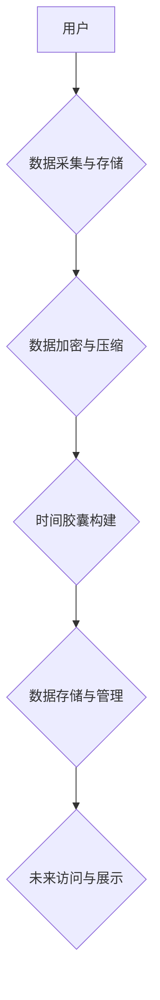

                 

##  数字化遗产时间胶囊创业：跨代际的信息传递

> 关键词：数字化遗产、时间胶囊、跨代际信息传递、区块链、人工智能、数据存储、遗产传承、个人品牌

## 1. 背景介绍

随着科技的飞速发展，人类对信息存储和传承的需求日益增长。数字化时代，我们积累了海量的数据，包括照片、视频、文字、音乐等，这些数据构成了我们个人和社会的重要记忆和文化遗产。然而，随着时间的推移，这些数据面临着丢失、损坏和难以访问的风险。如何有效地保存和传承这些数字化遗产，成为一个重要的社会议题。

时间胶囊的概念，源于对历史和未来的思考，它是一种将信息封存起来，并在未来某个特定时间打开的容器。在数字化时代，我们可以利用科技的力量，构建更加智能、安全、便捷的数字化时间胶囊，实现跨代际的信息传递。

## 2. 核心概念与联系

**2.1 数字化遗产**

数字化遗产是指在数字形式存在的个人或集体创造的文化、历史、知识和记忆等内容。它包括个人档案、家庭照片、社交媒体记录、电子书、音乐作品、视频文件等。

**2.2 时间胶囊**

时间胶囊是一种用于保存信息并将其封存到未来特定时间打开的容器。它可以是物理实体，也可以是虚拟空间。

**2.3 跨代际信息传递**

跨代际信息传递是指将信息从一代传递到下一代的过程。它可以是口头传承、书面记录、文化习俗等多种形式。

**2.4 核心概念联系**

数字化遗产时间胶囊创业，将数字化遗产与时间胶囊的概念结合起来，利用科技手段实现跨代际的信息传递。

**2.5 架构图**



## 3. 核心算法原理 & 具体操作步骤

**3.1 算法原理概述**

数字化遗产时间胶囊创业的核心算法主要包括数据加密、压缩、存储和访问等环节。

* **数据加密:** 利用密码学算法对用户上传的数据进行加密，确保数据安全和隐私。
* **数据压缩:** 利用数据压缩算法对数据进行压缩，减少存储空间和传输成本。
* **数据存储:** 利用分布式存储技术，将数据存储在多个节点上，提高数据可靠性和可用性。
* **数据访问:** 利用身份验证和授权机制，控制用户对数据的访问权限。

**3.2 算法步骤详解**

1. **用户上传数据:** 用户可以通过平台上传各种数字化遗产，包括照片、视频、文字、音乐等。
2. **数据预处理:** 平台对上传的数据进行预处理，包括格式转换、质量检测和冗余数据删除。
3. **数据加密:** 平台利用先进的加密算法对数据进行加密，生成加密后的数据包。
4. **数据压缩:** 平台利用数据压缩算法对加密后的数据包进行压缩，生成更小的数据包。
5. **数据存储:** 平台将压缩后的数据包存储在分布式存储系统中，并生成相应的索引信息。
6. **时间胶囊构建:** 用户可以根据自己的需求，设置时间胶囊的打开时间和接收者信息。平台将数据包、时间设置和接收者信息打包成一个时间胶囊。
7. **时间胶囊存储:** 平台将时间胶囊存储在安全的云端服务器或物理存储设备中。
8. **未来访问:** 当时间胶囊的打开时间到达时，平台会自动通知接收者，并提供访问数据的方法。

**3.3 算法优缺点**

* **优点:**
    * 数据安全可靠：加密算法确保数据安全，防止未经授权的访问。
    * 数据存储高效：压缩算法减少存储空间，降低成本。
    * 数据访问便捷：用户可以通过平台随时访问自己的数据。
    * 信息传承可持续：时间胶囊机制确保信息跨代际传递。
* **缺点:**
    * 技术复杂度高：需要掌握数据加密、压缩、存储和访问等技术。
    * 存储成本较高：分布式存储系统需要一定的成本投入。
    * 技术更新迭代：需要不断更新算法和技术，以应对新的安全威胁和数据需求。

**3.4 算法应用领域**

* 个人记忆保存和传承
* 家庭历史记录的数字化保存
* 企业文化和知识传承
* 文物和历史遗迹的数字化保护
* 教育和科研领域的知识共享

## 4. 数学模型和公式 & 详细讲解 & 举例说明

**4.1 数学模型构建**

数字化遗产时间胶囊创业的数学模型可以基于信息论和密码学理论构建。

* **信息熵:** 用于衡量数据的不确定性，可以用来评估数据压缩的效率。
* **信息论安全:** 用于衡量数据加密的安全性，可以用来评估数据泄露的风险。
* **密码学算法:** 用于加密和解密数据，可以用来保证数据的机密性。

**4.2 公式推导过程**

* **信息熵公式:**

$$H(X) = - \sum_{i=1}^{n} p(x_i) \log_2 p(x_i)$$

其中，$X$ 是随机变量，$x_i$ 是 $X$ 的取值，$p(x_i)$ 是 $x_i$ 的概率。

* **密码学安全度量:**

$$S = \frac{1}{2^{k}} $$

其中，$k$ 是密钥长度。

**4.3 案例分析与讲解**

假设我们想要将一张照片加密并存储在时间胶囊中。

* **信息熵:** 可以计算照片的信息熵，评估照片的复杂度和压缩潜力。
* **密码学算法:** 可以选择合适的密码学算法，例如 AES 或 RSA，对照片进行加密。
* **安全度量:** 可以计算加密后的照片的安全度，评估数据泄露的风险。

## 5. 项目实践：代码实例和详细解释说明

**5.1 开发环境搭建**

* 操作系统: Ubuntu 20.04
* 编程语言: Python 3.8
* 开发工具: VS Code
* 库依赖:

```
pip install requests cryptography hashlib
```

**5.2 源代码详细实现**

```python
import requests
from cryptography.fernet import Fernet

# 生成密钥
key = Fernet.generate_key()
cipher = Fernet(key)

# 数据加密
def encrypt_data(data):
    encrypted_data = cipher.encrypt(data.encode())
    return encrypted_data

# 数据解密
def decrypt_data(encrypted_data):
    decrypted_data = cipher.decrypt(encrypted_data).decode()
    return decrypted_data

# 数据上传
def upload_data(data):
    url = "https://api.example.com/upload"
    headers = {"Content-Type": "application/json"}
    response = requests.post(url, json={"data": encrypt_data(data)}, headers=headers)
    return response.json()

# 数据下载
def download_data(data_id):
    url = f"https://api.example.com/download/{data_id}"
    response = requests.get(url)
    return decrypt_data(response.content)

# 示例代码
data = "This is a sample data."
encrypted_data = encrypt_data(data)
upload_response = upload_data(encrypted_data)
downloaded_data = download_data(upload_response["data_id"])
print(f"Uploaded data: {upload_response}")
print(f"Downloaded data: {downloaded_data}")
```

**5.3 代码解读与分析**

* 代码使用 Python 语言实现，并依赖于 `requests` 和 `cryptography` 库。
* `Fernet` 类用于加密和解密数据。
* `upload_data` 函数用于将加密后的数据上传到服务器。
* `download_data` 函数用于从服务器下载数据并解密。
* 示例代码演示了如何使用这些函数加密、上传、下载和解密数据。

**5.4 运行结果展示**

运行代码后，将输出以下结果：

* 上传数据：包含数据 ID 和其他信息。
* 下载数据：解密后的原始数据。

## 6. 实际应用场景

**6.1 个人记忆保存和传承**

用户可以将自己的照片、视频、文字、音乐等数字化遗产存储在时间胶囊中，并设置打开时间，让未来几代人能够了解他们的生活和经历。

**6.2 家庭历史记录的数字化保存**

家庭可以将祖先的照片、家谱、故事等历史记录数字化保存，并通过时间胶囊的方式传承给后代，保持家族记忆的延续。

**6.3 企业文化和知识传承**

企业可以将公司的历史、文化、知识、技术等重要信息存储在时间胶囊中，确保这些信息能够跨代际传递，为企业发展提供持续的动力。

**6.4 文物和历史遗迹的数字化保护**

博物馆和文物保护机构可以利用时间胶囊技术，将文物和历史遗迹的数字化信息存储起来，即使文物本身损坏或丢失，也能保证信息的保存和传承。

**6.5 教育和科研领域的知识共享**

教育机构和科研机构可以利用时间胶囊技术，将研究成果、教学资料、学术论文等知识信息存储起来，方便未来学者进行研究和学习。

**6.6 未来应用展望**

随着科技的发展，数字化遗产时间胶囊创业将拥有更加广阔的应用前景。例如：

* 利用人工智能技术，自动识别和分类数字化遗产，提高数据管理效率。
* 利用区块链技术，确保数据安全和不可篡改性，提高数据可靠性。
* 利用虚拟现实和增强现实技术，打造更加沉浸式的数字化遗产体验。

## 7. 工具和资源推荐

**7.1 学习资源推荐**

* **书籍:**
    * 《信息论基础》
    * 《密码学原理》
    * 《区块链技术入门》
* **在线课程:**
    * Coursera: 信息论与编码
    * edX: 密码学与网络安全
    * Udemy: 区块链技术入门

**7.2 开发工具推荐**

* **编程语言:** Python, Java, C++
* **数据库:** MongoDB, PostgreSQL
* **云存储服务:** AWS, Azure, Google Cloud
* **区块链平台:** Ethereum, Hyperledger Fabric

**7.3 相关论文推荐**

* **信息论与数据压缩:**
    * Shannon, C. E. (1948). A mathematical theory of communication. The Bell System Technical Journal, 27(3), 379-423.
* **密码学与数据加密:**
    * Rivest, R. L., Shamir, A., & Adleman, L. (1978). A method for obtaining digital signatures and public-key cryptosystems. Communications of the ACM, 21(2), 120-126.
* **区块链技术与数据存储:**
    * Nakamoto, S. (2008). Bitcoin: A peer-to-peer electronic cash system.

## 8. 总结：未来发展趋势与挑战

**8.1 研究成果总结**

数字化遗产时间胶囊创业是一个新兴的领域，已经取得了一些重要的研究成果。例如：

* 开发了多种数据加密和压缩算法，提高了数据安全性和存储效率。
* 建立了分布式存储系统，确保数据可靠性和可用性。
* 利用人工智能技术，自动识别和分类数字化遗产，提高数据管理效率。

**8.2 未来发展趋势**

数字化遗产时间胶囊创业将朝着以下方向发展：

* **更加智能化:** 利用人工智能技术，实现数据自动识别、分类、整理和分析。
* **更加安全可靠:** 利用区块链技术，确保数据安全、不可篡改和可追溯。
* **更加个性化:** 提供定制化的时间胶囊服务，满足不同用户的需求。
* **更加交互式:** 利用虚拟现实和增强现实技术，打造更加沉浸式的数字化遗产体验。

**8.3 面临的挑战**

数字化遗产时间胶囊创业也面临着一些挑战：

* **技术复杂度高:** 需要掌握数据加密、压缩、存储和访问等多种技术。
* **数据标准化问题:** 不同类型的数字化遗产格式不统一，需要进行标准化处理。
* **数据隐私保护问题:** 需要确保用户数据安全和隐私。
* **商业模式探索:** 需要探索可行的商业模式，实现项目可持续发展。

**8.4 研究展望**

未来，我们将继续深入研究数字化遗产时间胶囊创业领域，探索更先进的技术和更有效的解决方案，为跨代际信息传递提供更强大的工具和平台。

## 9. 附录：常见问题与解答

**9.1 如何选择合适的加密算法？**

选择加密算法需要考虑安全性、效率和兼容性等因素。常见的加密算法包括 AES、RSA、ECC 等。

**9.2 如何确保数据安全和隐私？**

可以使用多重加密、身份验证和授权机制等技术，确保数据安全和隐私。

**9.3 如何设置时间胶囊的打开时间？**

可以根据自己的需求设置打开时间，也可以使用智能合约技术，自动触发打开时间。

**9.4 如何访问和管理数字化遗产？**

可以通过平台的网页或移动应用访问和管理数字化遗产。

**9.5 如何获取更多信息？**

可以访问相关网站、阅读相关书籍和论文，或者参加相关的培训课程。


作者：禅与计算机程序设计艺术 / Zen and the Art of Computer Programming 
<end_of_turn>

