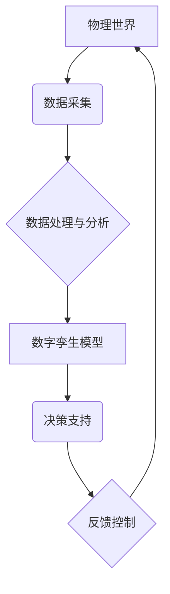

                 

## 数字孪生管理：虚实结合的新型管理模式

> 关键词：数字孪生、虚实融合、数据驱动、智能决策、模型仿真、工业互联网、物联网、云计算

## 1. 背景介绍

随着信息技术的飞速发展，物联网、云计算、大数据等技术的蓬勃兴起，为构建数字孪生提供了坚实的基础。数字孪生技术，作为一种将物理世界与数字世界相融合的创新技术，正在深刻地改变着各行各业的管理模式。它以虚拟模型模拟真实世界，并通过实时数据反馈进行动态更新，从而实现对物理资产、系统或过程的实时感知、分析和预测。

传统管理模式往往依赖于历史数据和经验判断，难以应对复杂、动态变化的现实环境。数字孪生管理模式则通过构建虚拟模型，实现对物理世界的实时模拟和分析，从而提供更精准、更有效的管理决策支持。

## 2. 核心概念与联系

数字孪生管理的核心概念包括：

* **数字孪生：**  是指基于物理资产、系统或过程的虚拟模型，通过实时数据连接和交互，实现与物理世界的实时同步和动态更新。
* **虚实融合：** 指数字孪生与物理世界之间的紧密结合，通过数据采集、传输、分析和反馈，实现虚拟模型与物理世界的实时交互和协同。
* **数据驱动：** 数字孪生管理的核心是数据，通过实时采集、分析和反馈物理世界的数据，驱动虚拟模型的更新和演化，从而实现对物理世界的精准感知和预测。
* **智能决策：** 数字孪生管理通过对虚拟模型的分析和预测，为管理决策提供更精准、更有效的支持，从而提高管理效率和决策准确性。

**数字孪生管理架构**



## 3. 核心算法原理 & 具体操作步骤

### 3.1  算法原理概述

数字孪生管理的核心算法主要包括数据采集、数据处理、模型构建、仿真模拟和决策分析等环节。

* **数据采集：** 利用传感器、摄像头、RFID等设备，实时采集物理世界的各种数据，包括温度、压力、流量、位置、状态等。
* **数据处理：** 对采集到的原始数据进行清洗、预处理、转换等操作，使其符合模型构建和分析的需要。
* **模型构建：** 基于物理世界的结构、功能和行为特征，构建数字孪生模型，并将其与数据处理环节相连接。
* **仿真模拟：** 利用数字孪生模型，模拟物理世界的各种场景和运行状态，并进行预测分析。
* **决策分析：** 分析仿真模拟的结果，为管理决策提供支持，并根据决策结果进行反馈控制。

### 3.2  算法步骤详解

1. **数据采集与预处理：** 利用传感器等设备采集物理世界的数据，并进行清洗、格式转换等预处理，确保数据质量和一致性。
2. **模型构建：** 根据物理世界的结构、功能和行为特征，构建数字孪生模型，可以使用3D建模、物理仿真等技术。
3. **数据融合与分析：** 将预处理后的数据与数字孪生模型相结合，进行数据融合和分析，例如使用机器学习算法进行预测分析。
4. **仿真模拟与预测：** 利用数字孪生模型进行仿真模拟，预测物理世界的运行状态和未来趋势，例如预测设备故障、优化生产流程等。
5. **决策支持与反馈控制：** 根据仿真模拟的结果，为管理决策提供支持，并根据决策结果对物理世界进行反馈控制，例如调整设备参数、优化生产计划等。

### 3.3  算法优缺点

**优点：**

* **实时感知：** 数字孪生可以实时感知物理世界的状态，并及时更新虚拟模型，实现对物理世界的精准监控。
* **预测分析：** 通过仿真模拟，可以预测物理世界的未来运行状态，为管理决策提供更精准的依据。
* **优化决策：** 数字孪生可以帮助管理者进行虚拟实验和场景模拟，优化决策方案，提高决策效率。
* **降低成本：** 通过预测故障、优化流程等方式，可以降低生产成本和运营成本。

**缺点：**

* **数据依赖：** 数字孪生模型的准确性依赖于数据质量，数据采集和处理环节需要保证数据准确性和完整性。
* **模型复杂性：** 构建复杂的数字孪生模型需要专业的技术人员和大量的计算资源。
* **技术成熟度：** 数字孪生技术还处于发展阶段，一些关键技术和应用场景仍需进一步探索和完善。

### 3.4  算法应用领域

数字孪生管理技术应用广泛，涵盖制造业、能源、交通、医疗、城市管理等多个领域。

* **制造业：** 用于产品设计、生产过程优化、设备故障预测、智能维护等。
* **能源：** 用于能源生产、输配电、能源管理等。
* **交通：** 用于交通流量预测、道路安全管理、智能交通系统等。
* **医疗：** 用于虚拟手术模拟、疾病诊断、个性化医疗等。
* **城市管理：** 用于城市规划、环境监测、公共安全管理等。

## 4. 数学模型和公式 & 详细讲解 & 举例说明

### 4.1  数学模型构建

数字孪生模型的构建可以采用多种数学模型，例如：

* **状态空间模型：** 用于描述系统状态的演化过程，可以用于预测系统未来的状态。
* **动力学模型：** 用于描述系统内部的物理过程，可以用于模拟系统行为。
* **概率模型：** 用于描述系统的不确定性，可以用于进行风险评估和决策分析。

### 4.2  公式推导过程

以状态空间模型为例，其基本形式如下：

$$
\dot{x}(t) = f(x(t), u(t), t)
$$

$$
y(t) = h(x(t), t)
$$

其中：

* $x(t)$ 是系统的状态向量。
* $u(t)$ 是系统的输入向量。
* $y(t)$ 是系统的输出向量。
* $f(x(t), u(t), t)$ 是系统的状态方程。
* $h(x(t), t)$ 是系统的输出方程。

通过对状态方程和输出方程的分析，可以推导出系统的动态特性，例如稳定性、响应时间等。

### 4.3  案例分析与讲解

例如，在制造业中，可以构建一个机器人的数字孪生模型，其状态向量包括机器人的位置、速度、姿态等信息，输入向量包括控制信号，输出向量包括机器人的动作和传感器数据。通过对状态空间模型的分析，可以预测机器人的运行状态，并进行故障诊断和预防维护。

## 5. 项目实践：代码实例和详细解释说明

### 5.1  开发环境搭建

数字孪生管理项目开发环境通常包括：

* **操作系统：** Linux、Windows等。
* **编程语言：** Python、C++、Java等。
* **数据库：** MySQL、MongoDB等。
* **云平台：** AWS、Azure、GCP等。
* **仿真工具：** Gazebo、Unity等。

### 5.2  源代码详细实现

以下是一个简单的数字孪生模型实现示例，使用Python语言和ROS框架：

```python
# 导入必要的库
import rospy
from sensor_msgs.msg import JointState

# 定义数字孪生模型类
class DigitalTwin:
    def __init__(self):
        # 初始化ROS节点
        rospy.init_node('digital_twin')
        # 订阅关节状态信息
        self.joint_state_sub = rospy.Subscriber('/joint_states', JointState, self.joint_state_callback)
        # 发布虚拟关节状态信息
        self.virtual_joint_pub = rospy.Publisher('/virtual_joint_states', JointState, queue_size=10)

    def joint_state_callback(self, msg):
        # 获取关节状态信息
        joint_names = msg.name
        joint_positions = msg.position
        # 更新虚拟关节状态
        virtual_joint_msg = JointState()
        virtual_joint_msg.name = joint_names
        virtual_joint_msg.position = joint_positions
        # 发布虚拟关节状态信息
        self.virtual_joint_pub.publish(virtual_joint_msg)

# 创建数字孪生模型实例
digital_twin = DigitalTwin()
# 启动ROS节点
rospy.spin()
```

### 5.3  代码解读与分析

该代码实现了一个简单的数字孪生模型，它订阅了机器人关节状态信息，并将其发布为虚拟关节状态信息。

* `rospy.init_node('digital_twin')` 初始化ROS节点。
* `rospy.Subscriber('/joint_states', JointState, self.joint_state_callback)` 订阅`/joint_states`话题，接收关节状态信息。
* `rospy.Publisher('/virtual_joint_states', JointState, queue_size=10)` 发布虚拟关节状态信息到`/virtual_joint_states`话题。
* `joint_state_callback`函数接收关节状态信息，并将其更新为虚拟关节状态信息。

### 5.4  运行结果展示

运行该代码后，可以观察到虚拟关节状态信息被发布到`/virtual_joint_states`话题，从而实现对机器人关节状态的虚拟模拟。

## 6. 实际应用场景

### 6.1  制造业

* **产品设计与仿真：** 利用数字孪生模型进行产品设计和仿真，优化产品结构和性能，降低研发成本。
* **生产过程优化：** 建立生产线数字孪生模型，分析生产过程中的瓶颈和效率问题，优化生产流程，提高生产效率。
* **设备故障预测与维护：** 利用传感器数据和机器学习算法，预测设备故障，提前进行维护，降低设备停机时间和维修成本。

### 6.2  能源

* **能源生产管理：** 建立能源生产设施数字孪生模型，实时监控生产状态，优化能源生产效率。
* **输配电系统优化：** 建立输配电系统数字孪生模型，预测电力需求，优化配电方案，提高电力系统可靠性。
* **能源管理与节能：** 建立建筑物数字孪生模型，分析能源消耗情况，优化能源使用方案，实现节能减排。

### 6.3  交通

* **交通流量预测与管理：** 建立城市交通网络数字孪生模型，预测交通流量，优化交通信号灯控制，缓解交通拥堵。
* **道路安全管理：** 利用传感器数据和机器学习算法，识别道路危险区域，提高道路安全。
* **智能交通系统：** 建立智能交通系统数字孪生模型，实现车辆自动驾驶、智能停车等功能。

### 6.4  未来应用展望

数字孪生管理技术在未来将得到更广泛的应用，例如：

* **个性化医疗：** 建立患者数字孪生模型，进行个性化疾病诊断和治疗方案制定。
* **智慧城市：** 建立城市数字孪生模型，实现城市管理的智能化和精细化。
* **工业互联网：** 数字孪生将成为工业互联网的重要组成部分，实现工业生产的智能化和数字化转型。

## 7. 工具和资源推荐

### 7.1  学习资源推荐

* **书籍：**
    * 《数字孪生：虚实融合的未来》
    * 《数字孪生技术与应用》
* **在线课程：**
    * Coursera: Digital Twin Technology
    * edX: Digital Twin Systems
* **网站：**
    * Digital Twin Consortium: https://www.digitaltwinconsortium.org/
    * IEEE Digital Twin Society: https://www.ieee-dtt.org/

### 7.2  开发工具推荐

* **ROS（Robot Operating System）：** 用于机器人开发的开源软件框架。
* **Gazebo：** 用于机器人仿真和模拟的开源工具。
* **Unity：** 用于游戏开发的跨平台游戏引擎，也可以用于数字孪生模型的构建。
* **AWS IoT Core：** 亚马逊云平台提供的物联网服务，可以用于数字孪生模型的数据采集和传输。

### 7.3  相关论文推荐

* **Digital Twins: Concepts, Architectures, and Applications**
* **A Survey on Digital Twin Technologies**
* **Digital Twin for Smart Manufacturing: A Review**

## 8. 总结：未来发展趋势与挑战

### 8.1  研究成果总结

数字孪生管理技术近年来取得了显著进展，在多个领域得到了广泛应用。

* **模型构建技术：** 数字孪生模型的构建技术不断发展，模型精度和复杂度不断提高。
* **数据分析技术：** 数据分析技术不断发展，可以对数字孪生模型的数据进行更深入的分析和挖掘。
* **仿真模拟技术：** 仿真模拟技术不断发展，可以模拟更复杂的场景和运行状态。

### 8.2  未来发展趋势

* **人工智能集成：** 将人工智能技术与数字孪生技术相结合，实现更智能的决策支持和自动化控制。
* **边缘计算支持：** 将数字孪生模型部署到边缘计算节点，实现更实时的数据处理和分析。
* **跨领域应用：** 数字孪生技术将应用于更多领域，例如医疗、教育、金融等。

### 8.3  面临的挑战

* **数据安全与隐私：** 数字孪生模型需要处理大量敏感数据，数据安全和隐私保护是一个重要挑战。
* **模型复杂度与计算资源：** 构建复杂的数字孪生模型需要大量的计算资源，如何降低模型复杂度和计算成本是一个关键问题。
* **标准化与互操作性：** 数字孪生技术缺乏统一的标准和规范，不同平台和系统的互操作性是一个挑战。

### 8.4  研究展望

未来，数字孪生管理技术将继续发展，并与其他新兴技术相结合，为各行各业带来更多创新应用。

## 9. 附录：常见问题与解答

**Q1：数字孪生与虚拟现实有什么区别？**

**A1：** 数字孪生和虚拟现实都是模拟现实世界的技术，但它们侧重点不同。虚拟现实主要关注用户沉浸式的体验，而数字孪生更注重对现实世界的实时感知和分析。

**Q2：数字孪生技术需要哪些硬件设备？**

**A2：** 数字孪生技术需要传感器、摄像头、网络设备等硬件设备，用于采集和传输现实世界的实时数据。

**Q3：数字孪生技术有哪些应用场景？**

**A3：** 数字孪生技术应用广泛，例如制造业、能源、交通、医疗等多个领域。

**作者：禅与计算机程序设计艺术 / Zen and the Art of Computer Programming**<end_of_turn>

