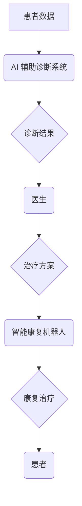

                 

## 未来的智慧医疗：2050年的AI辅助诊断与智能康复机器人

> 关键词：人工智能、医疗诊断、智能机器人、康复治疗、机器学习、深度学习、自然语言处理、计算机视觉

### 1. 背景介绍

医疗保健领域正在经历一场由人工智能 (AI) 和机器人技术驱动的革命。随着技术的不断进步，我们正迈向一个智慧医疗时代，其中 AI 辅助诊断和智能康复机器人将成为医疗保健不可或缺的一部分。

2050 年，我们预计将看到以下趋势：

* **AI 辅助诊断将更加精准和高效：** AI 算法将能够分析海量医疗数据，包括影像学数据、基因组数据和电子病历，以识别疾病的早期迹象，提高诊断准确率，并为医生提供个性化的治疗方案建议。
* **智能康复机器人将成为标准治疗手段：** 智能康复机器人将能够根据患者的具体需求提供个性化的康复治疗方案，帮助患者恢复功能，提高生活质量。
* **远程医疗将更加普及：** AI 辅助诊断和智能康复机器人将使远程医疗成为现实，让更多人能够获得高质量的医疗服务。

### 2. 核心概念与联系

**2.1 AI 辅助诊断**

AI 辅助诊断是指利用人工智能技术辅助医生进行疾病诊断。这包括：

* **图像分析：** AI 算法能够分析 X 光片、CT 扫描和 MRI 等影像学数据，识别肿瘤、骨折和其他异常。
* **基因组分析：** AI 算法能够分析基因组数据，识别疾病的遗传风险和潜在的治疗靶点。
* **自然语言处理：** AI 算法能够分析患者的病史、症状和体征描述，识别潜在的疾病。

**2.2 智能康复机器人**

智能康复机器人是指能够根据患者的具体需求提供个性化的康复治疗方案的机器人。这包括：

* **运动康复机器人：** 帮助患者恢复运动功能，例如行走、抓握和平衡。
* **言语康复机器人：** 帮助患者恢复语言和沟通能力。
* **认知康复机器人：** 帮助患者恢复认知功能，例如记忆、注意力和决策能力。

**2.3 架构图**



### 3. 核心算法原理 & 具体操作步骤

**3.1 算法原理概述**

AI 辅助诊断和智能康复机器人主要依赖以下核心算法：

* **机器学习：** 机器学习算法能够从数据中学习模式，并用于预测疾病风险、识别疾病特征和个性化治疗方案。
* **深度学习：** 深度学习算法是一种更高级的机器学习算法，能够处理更复杂的数据，例如图像和文本。
* **自然语言处理：** 自然语言处理算法能够理解和处理人类语言，用于分析患者的病史、症状和体征描述。
* **计算机视觉：** 计算机视觉算法能够分析图像数据，识别物体、场景和特征。

**3.2 算法步骤详解**

**3.2.1 机器学习算法**

1. **数据收集：** 收集大量医疗数据，例如影像学数据、基因组数据和电子病历。
2. **数据预处理：** 对数据进行清洗、转换和特征提取。
3. **模型训练：** 使用机器学习算法训练模型，例如支持向量机、决策树和神经网络。
4. **模型评估：** 使用测试数据评估模型的性能，例如准确率、召回率和 F1 分数。
5. **模型部署：** 将训练好的模型部署到实际应用环境中。

**3.2.2 深度学习算法**

深度学习算法的步骤与机器学习算法类似，但其模型结构更加复杂，通常包含多个隐藏层。

**3.2.3 自然语言处理算法**

1. **文本预处理：** 对文本数据进行清洗、分词和词性标注。
2. **特征提取：** 使用词向量、TF-IDF 等方法提取文本特征。
3. **模型训练：** 使用自然语言处理算法训练模型，例如循环神经网络和 Transformer。
4. **模型评估：** 使用测试数据评估模型的性能，例如准确率、召回率和 F1 分数。
5. **模型部署：** 将训练好的模型部署到实际应用环境中。

**3.3 算法优缺点**

**3.3.1 机器学习算法**

* **优点：** 能够从数据中学习模式，并进行预测；相对简单易于实现。
* **缺点：** 需要大量的数据进行训练；对数据质量要求较高；难以解释模型的决策过程。

**3.3.2 深度学习算法**

* **优点：** 能够处理更复杂的数据，例如图像和文本；性能通常优于传统机器学习算法。
* **缺点：** 需要更多的计算资源进行训练；对数据质量要求更高；难以解释模型的决策过程。

**3.3.3 自然语言处理算法**

* **优点：** 能够理解和处理人类语言；应用于医疗领域，例如分析患者病史和症状描述。
* **缺点：** 自然语言的复杂性使得算法训练难度较大；对数据标注要求较高。

**3.4 算法应用领域**

* **疾病诊断：** 识别肿瘤、骨折和其他疾病。
* **风险预测：** 预测患者患病风险。
* **个性化治疗：** 为患者提供个性化的治疗方案。
* **药物研发：** 发现新的药物靶点和药物候选物。
* **远程医疗：** 提供远程诊断和治疗服务。

### 4. 数学模型和公式 & 详细讲解 & 举例说明

**4.1 数学模型构建**

AI 辅助诊断和智能康复机器人通常使用以下数学模型：

* **线性回归模型：** 用于预测连续变量，例如患者的年龄、体重和血压。
* **逻辑回归模型：** 用于预测分类变量，例如患者是否患有某种疾病。
* **支持向量机模型：** 用于分类和回归问题，能够处理高维数据。
* **神经网络模型：** 用于处理复杂数据，例如图像和文本。

**4.2 公式推导过程**

例如，线性回归模型的公式如下：

$$
y = \beta_0 + \beta_1 x_1 + \beta_2 x_2 + ... + \beta_n x_n + \epsilon
$$

其中：

* $y$ 是预测变量
* $x_1, x_2, ..., x_n$ 是自变量
* $\beta_0, \beta_1, ..., \beta_n$ 是模型参数
* $\epsilon$ 是误差项

模型参数可以通过最小二乘法估计。

**4.3 案例分析与讲解**

例如，可以使用线性回归模型预测患者的患病风险。

假设我们收集了以下数据：

* 患者年龄
* 患者体重
* 患者血压
* 患者是否患有某种疾病

我们可以使用线性回归模型训练一个模型，预测患者是否患有某种疾病。

### 5. 项目实践：代码实例和详细解释说明

**5.1 开发环境搭建**

* 操作系统：Windows、macOS 或 Linux
* Python 版本：3.6 或更高版本
* 必要的库：NumPy、Pandas、Scikit-learn、TensorFlow 或 PyTorch

**5.2 源代码详细实现**

```python
# 导入必要的库
import numpy as np
from sklearn.linear_model import LogisticRegression

# 加载数据
data = np.loadtxt("data.csv", delimiter=",")

# 分割数据
X = data[:, :-1]
y = data[:, -1]

# 创建模型
model = LogisticRegression()

# 训练模型
model.fit(X, y)

# 预测结果
predictions = model.predict(X)

# 评估模型性能
accuracy = np.mean(predictions == y)
print("模型准确率:", accuracy)
```

**5.3 代码解读与分析**

* 首先，我们导入必要的库。
* 然后，我们加载数据并将其分割成特征 (X) 和标签 (y)。
* 接下来，我们创建 LogisticRegression 模型并使用 fit() 方法训练模型。
* 训练完成后，我们可以使用 predict() 方法预测新的数据。
* 最后，我们评估模型性能，例如计算准确率。

**5.4 运行结果展示**

运行代码后，将输出模型的准确率。

### 6. 实际应用场景

**6.1 AI 辅助诊断**

* **癌症筛查：** AI 算法能够分析影像学数据，识别癌症的早期迹象，提高筛查的准确率。
* **心血管疾病诊断：** AI 算法能够分析患者的电子病历和心电图数据，识别心血管疾病的风险。
* **神经退行性疾病诊断：** AI 算法能够分析患者的影像学数据和行为数据，识别阿尔茨海默病和其他神经退行性疾病的早期迹象。

**6.2 智能康复机器人**

* **中风康复：** 智能康复机器人能够帮助中风患者恢复运动功能，例如行走和抓握。
* **关节炎康复：** 智能康复机器人能够帮助关节炎患者进行关节运动，减轻疼痛和僵硬。
* **脊髓损伤康复：** 智能康复机器人能够帮助脊髓损伤患者进行肌肉训练，提高肢体功能。

**6.3 未来应用展望**

* **个性化医疗：** AI 辅助诊断和智能康复机器人将使医疗更加个性化，为每个患者提供最佳的治疗方案。
* **远程医疗：** AI 辅助诊断和智能康复机器人将使远程医疗更加普及，让更多人能够获得高质量的医疗服务。
* **医疗成本降低：** AI 辅助诊断和智能康复机器人将提高医疗效率，降低医疗成本。

### 7. 工具和资源推荐

**7.1 学习资源推荐**

* **在线课程：** Coursera、edX、Udacity 等平台提供 AI 和机器学习相关的在线课程。
* **书籍：** 《深度学习》、《机器学习实战》等书籍是学习 AI 和机器学习的经典教材。
* **开源项目：** TensorFlow、PyTorch 等开源项目提供了丰富的学习资源和代码示例。

**7.2 开发工具推荐**

* **Python：** Python 是 AI 和机器学习开发的常用语言。
* **Jupyter Notebook：** Jupyter Notebook 是一个交互式编程环境，方便进行 AI 和机器学习的开发和调试。
* **IDE：** VS Code、PyCharm 等 IDE 提供了丰富的 AI 和机器学习开发功能。

**7.3 相关论文推荐**

* **《ImageNet Classification with Deep Convolutional Neural Networks》**
* **《Attention Is All You Need》**
* **《BERT: Pre-training of Deep Bidirectional Transformers for Language Understanding》**

### 8. 总结：未来发展趋势与挑战

**8.1 研究成果总结**

近年来，AI 辅助诊断和智能康复机器人取得了显著进展，在医疗领域展现出巨大的潜力。

**8.2 未来发展趋势**

* **模型更加精准和高效：** 随着算法和计算能力的不断提升，AI 辅助诊断和智能康复机器人将更加精准和高效。
* **应用场景更加广泛：** AI 辅助诊断和智能康复机器人将应用于更多医疗领域，例如手术辅助、药物研发和健康管理。
* **个性化程度更高：** AI 辅助诊断和智能康复机器人将更加个性化，为每个患者提供最佳的治疗方案。

**8.3 面临的挑战**

* **数据安全和隐私保护：** AI 辅助诊断和智能康复机器人需要处理大量医疗数据，因此数据安全和隐私保护是一个重要的挑战。
* **算法解释性和可信度：** AI 算法的决策过程通常难以解释，这可能会影响医生的信任和患者的接受度。
* **伦理问题：** AI 辅助诊断和智能康复机器人可能会引发一些伦理问题，例如算法偏见和责任归属。

**8.4 研究展望**

未来，我们需要继续研究和探索 AI 辅助诊断和智能康复机器人的应用，以更好地服务于人类健康。


### 9. 附录：常见问题与解答

**9.1 AI 辅助诊断是否会取代医生？**

AI 辅助诊断不会取代医生，而是会成为医生的助手，帮助医生更加精准和高效地诊断疾病。

**9.2 智能康复机器人是否安全可靠？**

智能康复机器人经过严格的测试和验证，安全性可靠。

**9.3 AI 辅助诊断和智能康复机器人需要多长时间才能普及？**

AI 辅助诊断和智能康复机器人已经开始在一些医疗机构中应用，预计在未来几年内将会更加普及。


作者：禅与计算机程序设计艺术 / Zen and the Art of Computer Programming 
<end_of_turn>

