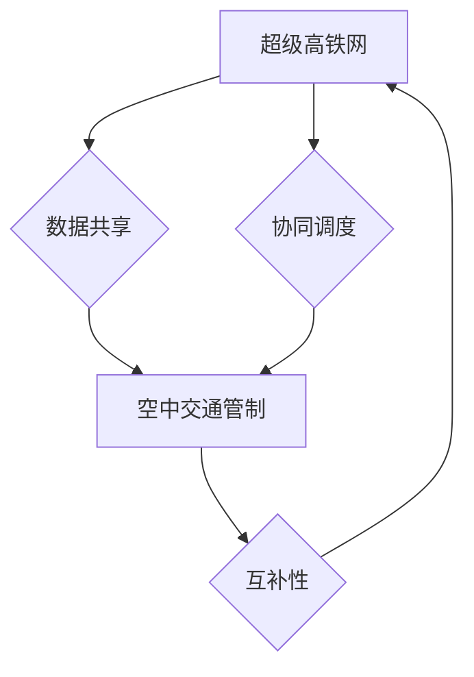

                 

## 未来的智能交通：2050年的超级高铁网与空中交通管制

> 关键词：智能交通、超级高铁网、空中交通管制、人工智能、机器学习、自动驾驶、5G网络、区块链、城市规划

### 1. 背景介绍

随着全球人口的持续增长和城市化的加速，交通拥堵已成为许多城市面临的严峻挑战。传统的交通系统难以满足日益增长的出行需求，同时也带来了环境污染和能源消耗等问题。因此，探索更加高效、智能、可持续的交通解决方案成为当务之急。

未来智能交通的目标是通过融合人工智能、物联网、大数据等先进技术，构建一个更加安全、便捷、高效的交通网络。其中，超级高铁网和空中交通管制将扮演着至关重要的角色。

### 2. 核心概念与联系

#### 2.1 超级高铁网

超级高铁网是指基于高速铁路基础设施，采用先进的磁悬浮、超导技术，实现极高速度、高频运行的铁路交通系统。其特点包括：

* **极高速度:** 超过500公里/小时，甚至达到1000公里/小时。
* **高频运行:** 每小时运行数十趟列车，实现高效的客流运输。
* **智能化控制:** 利用人工智能和机器学习技术，实现列车自动驾驶、智能调度、精准定位等功能。
* **绿色环保:** 采用清洁能源，减少碳排放，实现低碳出行。

#### 2.2 空中交通管制

空中交通管制是指利用雷达、通信、导航等技术，对飞机进行实时监控、引导和管理，确保空中交通安全和有序运行的系统。未来空中交通管制将朝着以下方向发展：

* **无人化管制:** 利用人工智能和机器学习技术，实现无人化管制，提高效率和安全性。
* **数据驱动:** 利用大数据分析和预测技术，优化飞行路径、提高空中交通流量。
* **一体化管制:** 将地面交通和空中交通进行一体化管制，实现更加高效的交通网络。

#### 2.3 核心概念联系

超级高铁网和空中交通管制将相互融合，形成一个更加智能、高效的未来交通系统。

* **数据共享:** 两者之间可以共享实时交通数据，例如列车位置、飞机飞行路径等，实现更加精准的交通管制。
* **协同调度:** 利用人工智能和机器学习技术，实现超级高铁网和空中交通管制的协同调度，优化交通流量，减少拥堵。
* **互补性:** 超级高铁网和空中交通管制可以互补，满足不同出行需求。例如，对于长途旅行，超级高铁网可以提供更加快捷的出行方式；对于短途旅行，空中交通管制可以提供更加灵活的出行方式。

**Mermaid 流程图**



### 3. 核心算法原理 & 具体操作步骤

#### 3.1 算法原理概述

未来智能交通系统将依赖于多种核心算法，例如：

* **路径规划算法:** 用于规划最优的出行路径，考虑因素包括时间、距离、交通流量等。
* **调度算法:** 用于优化交通流量，分配资源，避免拥堵。
* **预测算法:** 用于预测交通状况，例如拥堵时间、事故发生概率等，以便提前预警和调整出行计划。
* **控制算法:** 用于控制列车和飞机的运行，实现自动驾驶、安全保障等功能。

#### 3.2 算法步骤详解

以路径规划算法为例，其具体操作步骤如下：

1. **获取交通数据:** 收集实时交通数据，例如道路拥堵情况、交通信号灯状态、列车运行时间等。
2. **构建地图模型:** 将交通数据转化为地图模型，例如道路网络、交通设施等。
3. **定义目标:** 用户输入出发地和目的地，确定路径规划的目标。
4. **搜索路径:** 利用路径规划算法，例如 Dijkstra 算法、A* 算法等，搜索从出发地到目的地的最优路径。
5. **评估路径:** 对搜索到的路径进行评估，考虑因素包括时间、距离、交通流量等。
6. **输出结果:** 将最优路径输出给用户，并提供实时导航信息。

#### 3.3 算法优缺点

* **优点:** 能够快速、准确地规划出行路径，提高出行效率。
* **缺点:** 算法的复杂度较高，需要大量的计算资源。

#### 3.4 算法应用领域

路径规划算法广泛应用于智能交通系统，例如：

* **导航系统:** 为用户提供实时导航信息，规划最优出行路径。
* **自动驾驶系统:** 帮助自动驾驶车辆规划行驶路线，避开障碍物。
* **物流配送系统:** 优化物流配送路线，提高配送效率。

### 4. 数学模型和公式 & 详细讲解 & 举例说明

#### 4.1 数学模型构建

路径规划算法通常基于图论模型，将道路网络表示为图，其中节点代表路口或交叉口，边代表道路。

#### 4.2 公式推导过程

Dijkstra 算法是一种常用的路径规划算法，其核心思想是通过不断地更新距离值，找到从起点到终点的最短路径。

**公式:**

* $d(u)$: 节点 $u$ 到起点 $s$ 的距离
* $d(v)$: 节点 $v$ 到起点 $s$ 的距离
* $g(u,v)$: 从节点 $u$ 到节点 $v$ 的边权重

**算法步骤:**

1. 初始化：将起点 $s$ 的距离设置为 0，其他节点的距离设置为无穷大。
2. 选择距离最小的节点 $u$，并将其标记为已访问。
3. 对于节点 $u$ 的所有邻居节点 $v$，计算从起点 $s$ 到节点 $v$ 的距离 $d(u,v)$，如果 $d(u,v) < d(v)$，则更新 $d(v)$。
4. 重复步骤 2 和 3，直到到达终点 $t$。

#### 4.3 案例分析与讲解

假设有一个城市道路网络，起点为 A，终点为 B。

* A 到 B 的距离为 10。
* A 到 C 的距离为 5。
* C 到 B 的距离为 8。

使用 Dijkstra 算法，可以计算出从 A 到 B 的最短路径为 A -> C -> B，距离为 13。

### 5. 项目实践：代码实例和详细解释说明

#### 5.1 开发环境搭建

* 操作系统：Linux 或 Windows
* 编程语言：Python
* 库依赖：NetworkX、matplotlib

#### 5.2 源代码详细实现

```python
import networkx as nx
import matplotlib.pyplot as plt

# 创建图
graph = nx.Graph()
graph.add_edge('A', 'B', weight=10)
graph.add_edge('A', 'C', weight=5)
graph.add_edge('C', 'B', weight=8)

# 使用 Dijkstra 算法计算最短路径
shortest_path = nx.dijkstra_path(graph, source='A', target='B', weight='weight')

# 打印最短路径
print(f"最短路径: {shortest_path}")

# 绘制图
nx.draw(graph, with_labels=True, node_color='skyblue', node_size=500, font_size=10, font_weight='bold')
plt.show()
```

#### 5.3 代码解读与分析

* 使用 NetworkX 库创建图，并添加节点和边。
* 使用 Dijkstra 算法计算从起点 A 到终点 B 的最短路径。
* 打印最短路径。
* 使用 matplotlib 库绘制图，展示最短路径。

#### 5.4 运行结果展示

代码运行后，将输出最短路径为 ['A', 'C', 'B']，并绘制出包含最短路径的图。

### 6. 实际应用场景

#### 6.1 超级高铁网

* **城市间高铁连接:** 连接城市之间，实现快速、便捷的交通出行。
* **区域内高铁网络:** 建设区域内高铁网络，促进区域经济发展和人员流动。
* **旅游交通:** 为旅游出行提供更加快捷、舒适的交通方式。

#### 6.2 空中交通管制

* **民航交通:** 提高民航交通效率，减少飞行时间，降低运营成本。
* **货运航空:** 优化货运航空运输路线，提高运输效率。
* **空中救援:** 提高空中救援效率，缩短救援时间。

#### 6.3 未来应用展望

* **无人驾驶交通:** 超级高铁网和空中交通管制将为无人驾驶交通提供基础设施支持。
* **智能城市:** 智能交通系统将成为智能城市建设的重要组成部分。
* **绿色出行:** 智能交通系统将促进绿色出行，减少碳排放。

### 7. 工具和资源推荐

#### 7.1 学习资源推荐

* **书籍:**
    * 《人工智能：现代方法》
    * 《机器学习》
    * 《深度学习》
* **在线课程:**
    * Coursera
    * edX
    * Udacity

#### 7.2 开发工具推荐

* **编程语言:** Python, C++, Java
* **机器学习库:** TensorFlow, PyTorch, scikit-learn
* **数据可视化工具:** matplotlib, seaborn

#### 7.3 相关论文推荐

* **人工智能与交通运输:**
    * "Deep Reinforcement Learning for Autonomous Driving"
    * "Traffic Flow Prediction Using Deep Learning"
* **空中交通管制:**
    * "A Survey of Air Traffic Management Systems"
    * "Next Generation Air Transportation System (NextGen)"

### 8. 总结：未来发展趋势与挑战

#### 8.1 研究成果总结

未来智能交通系统将实现更加高效、安全、便捷的出行体验。

#### 8.2 未来发展趋势

* **更智能的算法:** 利用更先进的机器学习算法，提高交通预测精度、路径规划效率。
* **更强大的计算能力:** 利用云计算、边缘计算等技术，提供更加强大的计算能力，支持更复杂的算法和数据处理。
* **更完善的网络基础设施:** 建设更加完善的 5G 网络、物联网网络等基础设施，为智能交通系统提供数据传输和通信保障。

#### 8.3 面临的挑战

* **数据安全:** 智能交通系统需要处理大量敏感数据，数据安全问题需要得到有效解决。
* **伦理问题:** 智能交通系统涉及到伦理问题，例如自动驾驶车辆在紧急情况下如何做出决策。
* **技术标准:** 需要制定统一的技术标准，确保不同系统之间能够互联互通。

#### 8.4 研究展望

未来智能交通系统将继续朝着更加智能、高效、可持续的方向发展，为人类社会带来更加便捷、舒适的出行体验。

### 9. 附录：常见问题与解答

* **Q1: 智能交通系统会取代人类驾驶员吗？**

* **A1:** 智能交通系统可以辅助驾驶员，提高驾驶效率和安全性，但不会完全取代人类驾驶员。

* **Q2: 智能交通系统会增加交通拥堵吗？**

* **A2:** 智能交通系统可以优化交通流量，减少拥堵。

* **Q3: 智能交通系统会带来哪些新的工作机会？**

* **A3:** 智能交通系统将带来许多新的工作机会，例如人工智能工程师、数据分析师、自动驾驶技术员等。


作者：禅与计算机程序设计艺术 / Zen and the Art of Computer Programming 
<end_of_turn>

