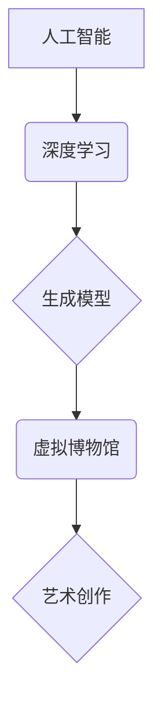

                 

## 未来的艺术创作：2050年的人工智能艺术家与虚拟博物馆

> 关键词：人工智能、艺术创作、虚拟博物馆、深度学习、生成模型、创意算法、数字艺术、未来趋势

## 1. 背景介绍

艺术创作一直是人类文明的重要组成部分，它反映了人类对世界的理解、情感和精神追求。随着科技的飞速发展，人工智能（AI）技术已经取得了令人瞩目的成就，并在各个领域展现出巨大的潜力。其中，AI在艺术创作领域的应用尤为引人注目，它不仅能够辅助人类艺术家创作，更可能成为独立的艺术创作者，为我们带来全新的艺术体验。

2050年，人工智能将更加成熟，其在艺术创作领域的应用将更加广泛和深入。我们将会看到：

* **AI艺术家创作出独一无二的艺术作品：** 借助深度学习和生成模型，AI能够学习和理解各种艺术风格，并根据自己的理解和算法生成全新的艺术作品。这些作品可能超越人类的想象，展现出前所未有的创意和美感。
* **虚拟博物馆成为艺术展示和交流的新平台：** 虚拟博物馆能够打破地域限制，让更多人能够欣赏到世界各地的艺术珍品。AI技术可以为虚拟博物馆提供个性化导览、互动体验和艺术鉴赏服务，提升用户体验。
* **艺术创作与消费模式发生改变：** AI将改变艺术创作和消费的模式，例如，AI可以根据用户的喜好生成定制化的艺术作品，用户可以参与到艺术创作过程中，共同创作出独一无二的作品。

## 2. 核心概念与联系

**2.1 核心概念**

* **人工智能 (AI):** 人工智能是指模拟人类智能行为的计算机系统，包括学习、推理、决策、感知和语言理解等能力。
* **深度学习 (Deep Learning):** 深度学习是人工智能的一个子领域，它利用多层神经网络来学习和处理复杂数据，例如图像、文本和音频。
* **生成模型 (Generative Model):** 生成模型是一种机器学习模型，它能够从已有的数据中学习模式，并生成新的数据，例如图像、文本和音乐。
* **虚拟博物馆 (Virtual Museum):** 虚拟博物馆是一种利用计算机技术模拟现实博物馆的虚拟环境，它可以展示艺术作品、历史文物和文化遗产，并提供互动体验和教育服务。

**2.2 核心概念联系**



**2.3 架构**

AI艺术家与虚拟博物馆的架构可以概括为以下几个部分：

* **数据采集与预处理:** 收集各种艺术作品的图像、文本、音频等数据，并进行预处理，例如图像裁剪、文本清洗等。
* **模型训练:** 利用深度学习算法训练生成模型，使其能够学习艺术风格和创作规律。
* **艺术作品生成:** 根据用户的需求或算法的随机性，生成新的艺术作品。
* **虚拟博物馆平台:** 建立虚拟博物馆平台，展示生成的艺术作品，并提供互动体验和艺术鉴赏服务。

## 3. 核心算法原理 & 具体操作步骤

**3.1 算法原理概述**

AI艺术家创作艺术作品的核心算法是生成模型，其中最常用的类型是基于变分自编码器（VAE）和生成对抗网络（GAN）的模型。

* **变分自编码器 (VAE):** VAE是一种将输入数据编码成低维表示，然后解码成输出数据的模型。在艺术创作中，VAE可以学习艺术风格的特征，并生成符合该风格的新作品。
* **生成对抗网络 (GAN):** GAN由两个网络组成：生成器和鉴别器。生成器生成新的艺术作品，鉴别器判断作品是否为真实作品。两者相互竞争，生成器不断改进，最终生成逼真的艺术作品。

**3.2 算法步骤详解**

1. **数据收集与预处理:** 收集大量艺术作品的图像数据，并进行预处理，例如裁剪、缩放、归一化等。
2. **模型构建:** 根据选择的算法，构建VAE或GAN模型。
3. **模型训练:** 利用训练数据训练模型，训练过程包括：
    * **编码阶段:** 将输入图像编码成低维表示。
    * **解码阶段:** 将低维表示解码成输出图像。
    * **对抗训练:** GAN模型的训练过程需要生成器和鉴别器相互竞争，生成器不断改进，生成更逼真的作品，鉴别器不断学习识别真实和伪造作品的差异。
4. **模型评估:** 利用测试数据评估模型的性能，例如图像质量、风格逼真度等。
5. **艺术作品生成:** 根据用户的需求或算法的随机性，利用训练好的模型生成新的艺术作品。

**3.3 算法优缺点**

**优点:**

* **创造力:** AI能够生成独一无二的艺术作品，超越人类的想象。
* **效率:** AI可以快速生成大量艺术作品，节省时间和成本。
* **个性化:** AI可以根据用户的需求生成定制化的艺术作品。

**缺点:**

* **缺乏情感:** AI生成的艺术作品可能缺乏人类的情感和内涵。
* **伦理问题:** AI艺术创作的伦理问题，例如作品的版权归属、艺术价值的评估等，需要进一步探讨。

**3.4 算法应用领域**

* **艺术创作:** 生成绘画、雕塑、音乐、文学等艺术作品。
* **游戏开发:** 生成游戏场景、角色、道具等。
* **电影制作:** 生成电影特效、场景、人物等。
* **设计领域:** 生成产品设计、建筑设计、服装设计等。

## 4. 数学模型和公式 & 详细讲解 & 举例说明

**4.1 数学模型构建**

生成模型的数学模型通常基于概率论和统计学，例如：

* **VAE:** 使用概率分布来表示输入数据和低维表示，并通过最大化似然函数来训练模型。
* **GAN:** 使用博弈论来描述生成器和鉴别器的竞争关系，并通过最小化鉴别器损失函数和最大化生成器损失函数来训练模型。

**4.2 公式推导过程**

由于篇幅限制，这里只列举一些关键公式，详细推导过程可以参考相关文献。

* **VAE:**

$$
\mathcal{L}_{VAE} = D_{KL}(q(z|x) || p(z)) + \mathbb{E}_{z \sim q(z|x)}[D(x, \mathcal{D}(z))]
$$

其中：

* $q(z|x)$ 是编码器输出的概率分布。
* $p(z)$ 是先验分布。
* $D(x, \mathcal{D}(z))$ 是重构损失函数。

* **GAN:**

$$
\mathcal{L}_{GAN} = \mathbb{E}_{x \sim p_{data}(x)}[log(D(x))] + \mathbb{E}_{z \sim p_z(z)}[log(1 - D(G(z)))]
$$

其中：

* $D(x)$ 是鉴别器对真实样本的预测概率。
* $G(z)$ 是生成器生成的样本。

**4.3 案例分析与讲解**

* **DeepDream:** 利用VAE模型，将图像进行多次卷积和反卷积操作，生成具有梦幻般效果的艺术作品。
* **StyleGAN:** 利用GAN模型，生成逼真的人脸图像，可以控制图像的风格、年龄、性别等特征。

## 5. 项目实践：代码实例和详细解释说明

**5.1 开发环境搭建**

* **操作系统:** Linux/macOS
* **编程语言:** Python
* **深度学习框架:** TensorFlow/PyTorch
* **其他工具:** Git、Jupyter Notebook

**5.2 源代码详细实现**

由于篇幅限制，这里只提供一个简单的VAE模型的代码示例，详细的代码实现可以参考相关开源项目。

```python
import tensorflow as tf

# 定义编码器
encoder = tf.keras.Sequential([
    tf.keras.layers.Conv2D(32, (3, 3), activation='relu', input_shape=(28, 28, 1)),
    tf.keras.layers.MaxPooling2D((2, 2)),
    tf.keras.layers.Conv2D(64, (3, 3), activation='relu'),
    tf.keras.layers.MaxPooling2D((2, 2)),
    tf.keras.layers.Flatten(),
    tf.keras.layers.Dense(128, activation='relu'),
    tf.keras.layers.Dense(latent_dim)
])

# 定义解码器
decoder = tf.keras.Sequential([
    tf.keras.layers.Dense(7 * 7 * 64, activation='relu'),
    tf.keras.layers.Reshape((7, 7, 64)),
    tf.keras.layers.Conv2DTranspose(64, (3, 3), strides=(2, 2), activation='relu'),
    tf.keras.layers.Conv2DTranspose(32, (3, 3), strides=(2, 2), activation='relu'),
    tf.keras.layers.Conv2D(1, (3, 3), activation='sigmoid')
])

# 定义VAE模型
vae = tf.keras.Model(inputs=encoder.input, outputs=decoder(encoder.output))

# 训练VAE模型
vae.compile(optimizer='adam', loss='binary_crossentropy')
vae.fit(x_train, x_train, epochs=10)

# 生成新的艺术作品
latent_vector = tf.random.normal(shape=(1, latent_dim))
generated_image = decoder(latent_vector)
```

**5.3 代码解读与分析**

* **编码器:** 将输入图像编码成低维表示。
* **解码器:** 将低维表示解码成输出图像。
* **VAE模型:** 将编码器和解码器组合成一个完整的模型。
* **训练过程:** 利用训练数据训练VAE模型，最小化重构损失和KL散度。
* **生成过程:** 利用随机生成的低维表示，通过解码器生成新的艺术作品。

**5.4 运行结果展示**

训练好的VAE模型可以生成具有特定风格的艺术作品。

## 6. 实际应用场景

**6.1 艺术创作辅助工具:**

AI可以帮助艺术家快速生成草图、探索不同的风格和构思，提高创作效率。

**6.2 个性化艺术品定制:**

用户可以根据自己的喜好，例如颜色、主题、风格等，定制独一无二的艺术作品。

**6.3 数字艺术品交易平台:**

AI生成的艺术作品可以作为数字资产进行交易，为艺术家和收藏家提供新的商业模式。

**6.4 教育和研究:**

AI艺术创作可以作为教育工具，帮助学生了解艺术创作的原理和流程，也可以用于艺术研究，探索新的艺术形式和表达方式。

**6.4 未来应用展望:**

* **跨界融合:** AI艺术创作将与其他领域融合，例如音乐、舞蹈、戏剧等，创造出更加丰富的艺术体验。
* **沉浸式体验:** AI将为用户提供更加沉浸式的艺术体验，例如虚拟现实和增强现实技术。
* **艺术与科技的共生:** AI将推动艺术与科技的融合发展，创造出全新的艺术形态和价值。

## 7. 工具和资源推荐

**7.1 学习资源推荐:**

* **书籍:**
    * 《深度学习》 by Ian Goodfellow, Yoshua Bengio, Aaron Courville
    * 《Generative Deep Learning》 by David Foster
* **在线课程:**
    * Coursera: Deep Learning Specialization
    * Udacity: Deep Learning Nanodegree
* **开源项目:**
    * TensorFlow: https://www.tensorflow.org/
    * PyTorch: https://pytorch.org/

**7.2 开发工具推荐:**

* **编程语言:** Python
* **深度学习框架:** TensorFlow, PyTorch
* **图像处理库:** OpenCV, Pillow
* **数据可视化工具:** Matplotlib, Seaborn

**7.3 相关论文推荐:**

* **Generative Adversarial Networks** by Ian Goodfellow et al. (2014)
* **Auto-Encoding Variational Bayes** by Diederik P. Kingma and Max Welling (2013)
* **StyleGAN** by Tero Karras et al. (2019)

## 8. 总结：未来发展趋势与挑战

**8.1 研究成果总结**

近年来，AI在艺术创作领域的应用取得了显著进展，例如生成逼真的图像、音乐和文本等。这些成果表明，AI已经具备一定的创造力和艺术表达能力。

**8.2 未来发展趋势**

* **更强大的生成模型:** 研究人员将继续开发更强大的生成模型，使其能够生成更加逼真、多样化的艺术作品。
* **更丰富的艺术形式:** AI将应用于更多艺术形式，例如舞蹈、戏剧、电影等，创造出更加丰富的艺术体验。
* **人机协作创作:** 人和AI将更加紧密地合作，共同创作出更加精彩的艺术作品。

**8.3 面临的挑战**

* **伦理问题:** AI艺术创作的伦理问题，例如作品的版权归属、艺术价值的评估等，需要进一步探讨。
* **技术瓶颈:** 现有的AI模型仍然无法完全模拟人类的创造力和想象力，需要进一步突破技术瓶颈。
* **社会接受度:** 人们对AI艺术创作的接受度还需要提高，需要通过教育和宣传，让更多人了解和理解AI艺术。

**8.4 研究展望**

未来，AI艺术创作将继续发展，并对艺术、文化和社会产生深远的影响。我们需要积极探索AI艺术创作的可能性，并解决其带来的挑战，让AI成为人类艺术创作的伙伴，共同创造更加美好的未来。

## 9. 附录：常见问题与解答

**9.1 AI生成的艺术作品是否具有艺术价值？**

这是一个复杂的问题，没有绝对的答案。AI生成的艺术作品是否具有艺术价值取决于多种因素，例如作品的创意、美感、表达力、文化背景等。

**9.2 AI艺术创作会取代人类艺术家吗？**

AI艺术创作可以辅助人类艺术家，提高创作效率和探索新的可能性，但它不会完全取代人类艺术家。人类艺术家拥有独特的创造力和情感表达能力，这些是AI难以替代的。

**9.3 如何保护AI艺术作品的版权？**

AI艺术作品的版权问题是一个新的挑战，需要制定新的法律法规和伦理规范来解决。

**9.4 AI艺术创作对社会有哪些影响？**

AI艺术创作将对艺术、文化、教育、娱乐等多个领域产生深远影响，它可以丰富人们的艺术体验，促进文化交流，推动社会进步。


作者：禅与计算机程序设计艺术 / Zen and the Art of Computer Programming<end_of_turn>

