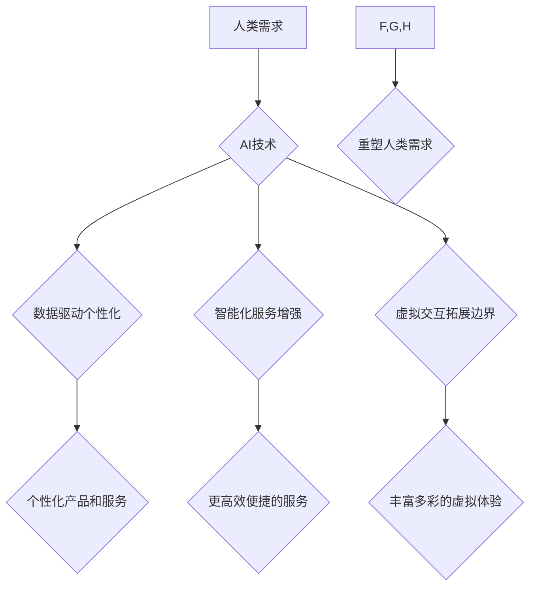

                 

## 欲望进化动力学：AI重塑的人类需求研究

> 关键词：人工智能、需求进化、欲望动力学、认知偏差、算法设计、伦理挑战

## 1. 背景介绍

人类需求的本质是驱动力，它指引着我们的行为、决策和社会发展。从生理需求到自我实现需求，人类的需求层次不断演变，并受到文化、社会和技术环境的影响。近年来，人工智能（AI）技术的飞速发展，正在深刻地改变着人类生活，并对人类需求产生着前所未有的影响。

传统需求理论主要关注人类的基本生理和社会需求，而AI技术的出现，带来了新的需求类型，例如对个性化体验、智能化服务和虚拟交互的需求。AI算法能够精准分析用户数据，预测用户需求，并提供定制化的解决方案，这使得人类对个性化和效率的需求得到更充分的满足。

然而，AI技术带来的需求变化也引发了一些伦理和社会问题。例如，AI算法可能加剧社会不平等，强化认知偏差，甚至操控用户行为。因此，深入研究AI重塑的人类需求，理解其背后的动力机制，对于构建更加公平、可持续的未来社会至关重要。

## 2. 核心概念与联系

### 2.1 欲望进化动力学

欲望进化动力学是一种将进化论原理应用于人类欲望研究的新兴理论。它认为，人类欲望的形成和演变，是自然选择的结果，旨在帮助个体生存和繁衍。

在AI时代，传统的生存需求和繁衍需求逐渐被新的需求所取代，例如对知识、创造力和自我实现的需求。AI技术为人类提供了更便捷、高效的工具，帮助个体获取知识、表达创造力和实现自我价值。

### 2.2 AI重塑需求的机制

AI技术通过以下机制重塑人类需求：

* **数据驱动个性化:** AI算法能够分析海量用户数据，精准识别用户的兴趣、偏好和需求，并提供个性化的产品和服务。
* **智能化服务增强:** AI驱动的智能助手、虚拟客服等，能够提供更加便捷、高效的智能化服务，满足人类对效率和便捷的需求。
* **虚拟交互拓展边界:** AI技术赋予虚拟角色和虚拟世界以更丰富的交互能力，满足人类对社交、娱乐和情感需求的拓展。

**Mermaid 流程图**



## 3. 核心算法原理 & 具体操作步骤

### 3.1 算法原理概述

**深度学习**是AI技术中的一种重要算法，它能够学习复杂的数据模式，并进行预测和分类。在需求预测领域，深度学习算法可以分析用户的行为数据、偏好数据和社会环境数据，预测用户的未来需求。

### 3.2 算法步骤详解

1. **数据收集和预处理:** 收集用户的行为数据、偏好数据和社会环境数据，并进行清洗、转换和特征提取。
2. **模型构建:** 选择合适的深度学习模型，例如循环神经网络（RNN）或卷积神经网络（CNN），并进行模型参数的初始化。
3. **模型训练:** 使用训练数据训练深度学习模型，调整模型参数，使模型能够准确预测用户的需求。
4. **模型评估:** 使用测试数据评估模型的预测精度，并进行模型调优。
5. **需求预测:** 将收集到的用户数据输入到训练好的模型中，预测用户的未来需求。

### 3.3 算法优缺点

**优点:**

* 能够学习复杂的数据模式，预测更加精准的需求。
* 能够处理海量数据，并进行实时预测。

**缺点:**

* 需要大量的训练数据，训练成本较高。
* 模型解释性较差，难以理解模型的决策过程。

### 3.4 算法应用领域

* **电商推荐:** 根据用户的购买历史、浏览记录和兴趣偏好，推荐个性化的商品。
* **内容推荐:** 根据用户的阅读习惯、观看记录和兴趣标签，推荐个性化的新闻、视频和文章。
* **广告投放:** 根据用户的兴趣和行为特征，精准投放广告，提高广告转化率。

## 4. 数学模型和公式 & 详细讲解 & 举例说明

### 4.1 数学模型构建

我们可以使用**马尔科夫链**来建模用户的需求演变过程。马尔科夫链是一种统计模型，它描述了系统在不同状态之间的转移概率。

在需求演变模型中，每个状态代表用户的需求类型，例如“娱乐需求”、“购物需求”或“社交需求”。状态之间的转移概率取决于用户的历史行为、当前环境和个体特征。

### 4.2 公式推导过程

假设用户处于状态 $i$，则用户在下一个时间步长转移到状态 $j$ 的概率为 $P(j|i)$。

马尔科夫链的转移概率矩阵 $P$ 可以表示为：

$$
P = \begin{bmatrix}
P(1|1) & P(1|2) & ... & P(1|n) \\
P(2|1) & P(2|2) & ... & P(2|n) \\
... & ... & ... & ... \\
P(n|1) & P(n|2) & ... & P(n|n)
\end{bmatrix}
$$

其中，$n$ 是状态总数。

### 4.3 案例分析与讲解

例如，我们可以构建一个简单的需求演变模型，描述用户的娱乐需求、购物需求和社交需求之间的转移关系。

假设用户在娱乐状态下，转移到购物状态的概率为 0.2，转移到社交状态的概率为 0.3，转移到娱乐状态的概率为 0.5。

我们可以将这些概率值填入转移概率矩阵中，并使用马尔科夫链的算法进行模拟，预测用户的需求演变趋势。

## 5. 项目实践：代码实例和详细解释说明

### 5.1 开发环境搭建

* Python 3.x
* TensorFlow 或 PyTorch 深度学习框架
* Jupyter Notebook 或 VS Code 开发环境

### 5.2 源代码详细实现

```python
import tensorflow as tf

# 定义需求演变模型
model = tf.keras.Sequential([
    tf.keras.layers.Dense(128, activation='relu', input_shape=(n_features,)),
    tf.keras.layers.Dense(64, activation='relu'),
    tf.keras.layers.Dense(n_classes, activation='softmax')
])

# 编译模型
model.compile(optimizer='adam',
              loss='sparse_categorical_crossentropy',
              metrics=['accuracy'])

# 训练模型
model.fit(X_train, y_train, epochs=10)

# 预测需求
predictions = model.predict(X_test)
```

### 5.3 代码解读与分析

* 我们使用 TensorFlow 框架构建了一个深度学习模型，包含两层全连接层和一层 softmax 输出层。
* 模型输入为用户的特征向量，输出为不同需求类型的概率分布。
* 我们使用 Adam 优化器、交叉熵损失函数和准确率指标进行模型训练。
* 训练完成后，我们可以使用模型预测用户的未来需求。

### 5.4 运行结果展示

训练结果可以展示在 Jupyter Notebook 中，包括训练损失、准确率以及预测结果等。

## 6. 实际应用场景

### 6.1 个性化推荐系统

AI技术可以分析用户的行为数据，预测用户的兴趣和需求，从而提供更加个性化的商品、内容和服务推荐。例如，电商平台可以根据用户的购买历史、浏览记录和评价数据，推荐个性化的商品；视频平台可以根据用户的观看记录和兴趣标签，推荐个性化的视频内容。

### 6.2 智能客服系统

AI驱动的智能客服系统可以自动处理用户的咨询和投诉，提高服务效率和客户满意度。例如，银行可以利用智能客服系统，自动回答用户的账户查询、转账和贷款申请等问题；航空公司可以利用智能客服系统，自动处理用户的航班查询、改签和退票等问题。

### 6.3 个性化教育系统

AI技术可以根据学生的学习进度、知识掌握情况和学习风格，提供个性化的学习内容和教学方案，提高学生的学习效率和兴趣。例如，在线教育平台可以利用AI技术，为每个学生定制个性化的学习计划和学习资源；学校可以利用AI技术，为每个学生提供个性化的辅导和评估。

### 6.4 未来应用展望

随着AI技术的不断发展，其对人类需求的影响将更加深远。未来，AI技术可能被应用于以下领域：

* **医疗保健:** AI可以帮助医生诊断疾病、制定治疗方案和预测患者的健康状况。
* **金融服务:** AI可以帮助金融机构进行风险评估、欺诈检测和投资决策。
* **交通运输:** AI可以帮助自动驾驶汽车进行路径规划、避障和决策。
* **城市管理:** AI可以帮助城市管理部门进行交通管理、环境监测和资源分配。

## 7. 工具和资源推荐

### 7.1 学习资源推荐

* **书籍:**
    * 《深度学习》 by Ian Goodfellow, Yoshua Bengio, and Aaron Courville
    * 《机器学习》 by Tom Mitchell
* **在线课程:**
    * Coursera: Machine Learning by Andrew Ng
    * Udacity: Deep Learning Nanodegree
* **博客和论坛:**
    * Towards Data Science
    * Machine Learning Mastery

### 7.2 开发工具推荐

* **Python:** 
    * TensorFlow
    * PyTorch
    * Keras
* **数据处理工具:**
    * Pandas
    * NumPy
* **可视化工具:**
    * Matplotlib
    * Seaborn

### 7.3 相关论文推荐

* **《Attention Is All You Need》:** https://arxiv.org/abs/1706.03762
* **《Generative Adversarial Networks》:** https://arxiv.org/abs/1406.2661
* **《Deep Reinforcement Learning》:** https://arxiv.org/abs/1602.09477

## 8. 总结：未来发展趋势与挑战

### 8.1 研究成果总结

AI技术正在深刻地重塑人类需求，并为我们提供了新的机遇和挑战。深度学习算法能够精准预测用户的需求，为个性化推荐、智能客服和个性化教育等领域提供强大的支持。

### 8.2 未来发展趋势

未来，AI技术将更加智能化、个性化和融合化。

* **更智能的AI算法:** 随着算法的不断改进，AI将能够更加精准地理解和预测用户的需求。
* **更个性化的服务:** AI将能够提供更加个性化的产品、内容和服务，满足用户的独特需求。
* **更融合的AI应用:** AI将与其他技术融合，例如物联网、大数据和云计算，构建更加智能和便捷的应用场景。

### 8.3 面临的挑战

AI技术的发展也面临着一些挑战，例如：

* **数据隐私和安全:** AI算法需要大量的数据进行训练，如何保护用户数据隐私和安全是一个重要的挑战。
* **算法偏见和公平性:** AI算法可能存在偏见，导致不公平的结果，需要进行算法的公平性评估和改进。
* **伦理和社会影响:** AI技术可能对人类社会产生深远的影响，需要进行伦理和社会规范的制定和完善。

### 8.4 研究展望

未来，我们需要更加深入地研究AI重塑人类需求的机制，并探索AI技术与人类社会和谐共生的路径。

## 9. 附录：常见问题与解答

**Q1: AI技术会取代人类吗？**

A1: AI技术可以自动化许多任务，但它并不会完全取代人类。AI擅长处理重复性、数据密集型任务，而人类擅长解决复杂问题、进行创造性思考和情感交流。未来，AI和人类将更加协同工作，共同创造更加美好的未来。

**Q2: 如何应对AI带来的伦理挑战？**

A2: 应对AI带来的伦理挑战需要多方共同努力，包括政府、企业、学术界和社会公众。我们需要制定相应的法律法规、伦理规范和社会准则，引导AI技术朝着更加安全、可持续的方向发展。

**Q3: 如何学习AI技术？**

A3: 学习AI技术有很多资源可以利用，例如在线课程、书籍、博客和论坛。建议从基础知识开始学习，逐步深入到更高级的算法和应用领域。


作者：禅与计算机程序设计艺术 / Zen and the Art of Computer Programming 
<end_of_turn>

