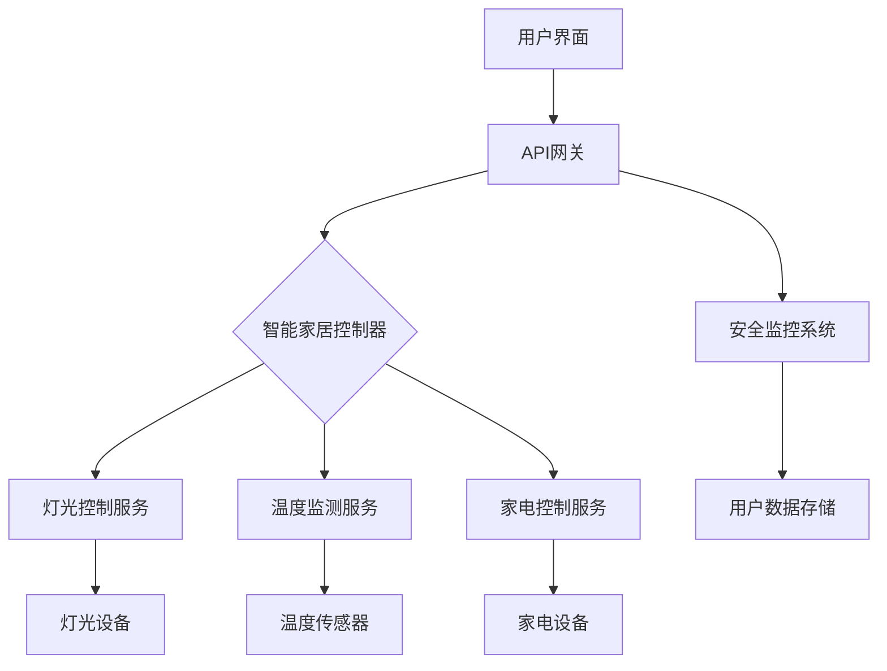

                 

# 文章标题

## 基于Java的智能家居设计：面向服务的智能家居架构(SOA)与Java实践

### 关键词

- Java
- 智能家居
- SOA
- 面向服务架构
- IoT
- 设备控制
- 安全性
- 可扩展性

### 摘要

本文旨在探讨基于Java技术的智能家居设计，特别是在面向服务的架构（SOA）框架下的实现。文章首先介绍了智能家居系统的背景和需求，随后详细阐述了SOA在智能家居设计中的关键作用。通过具体的Java实现示例，我们将深入分析智能家居架构的构建过程，包括设备控制、数据通信和安全性等方面的实践。最后，文章总结了智能家居技术的发展趋势，并提出了未来可能面临的挑战和解决方案。旨在为开发者和研究人员提供一个全面的指南，助力智能家居系统的设计、实现和应用。

## 1. 背景介绍

智能家居（Smart Home）是一个集成了各种智能设备和系统的居住环境，通过自动化技术提高居住的舒适性和便利性。随着物联网（IoT）技术的快速发展，智能家居系统变得越来越普及，成为现代家庭的重要组成部分。Java作为一种跨平台、高性能的编程语言，因其强大的社区支持和广泛的应用场景，成为智能家居开发的主要选择之一。

### 1.1 智能家居的需求

智能家居系统需要实现以下几个方面的功能：

1. **设备控制**：用户可以通过手机、语音助手等方式远程控制家中的各种设备，如灯光、温度、家电等。
2. **数据监测**：智能家居系统能够实时监测家中的各种数据，如温度、湿度、空气质量等，并提供报警和预警功能。
3. **节能管理**：智能家居系统可以根据用户的习惯和环境变化，自动调整设备运行状态，实现节能管理。
4. **安全性**：智能家居系统需要确保用户数据的安全，防止未经授权的访问和设备控制。

### 1.2 Java在智能家居中的优势

Java具有以下优势，使其成为智能家居开发的理想选择：

1. **跨平台**：Java可以在不同的操作系统和设备上运行，便于实现设备的互联互通。
2. **安全性**：Java的安全特性，如沙箱机制和加密库，能够保障用户数据的安全。
3. **丰富的库和框架**：Java拥有丰富的开源库和框架，如Spring Boot、Apache Maven等，可以加速开发过程。
4. **强大的社区支持**：Java拥有庞大的开发社区，提供了大量的技术支持和资源。

## 2. 核心概念与联系

### 2.1 面向服务的架构（SOA）

面向服务的架构（Service-Oriented Architecture，SOA）是一种软件开发方法，它将应用程序视为由多个独立的服务组成，这些服务可以通过网络进行通信。SOA的核心思想是将功能模块化为服务，使得这些服务可以独立开发、部署和运行，从而提高了系统的灵活性和可扩展性。

### 2.2 SOA在智能家居设计中的应用

在智能家居设计中，SOA的应用主要体现在以下几个方面：

1. **设备管理**：通过SOA，可以将不同类型的智能设备抽象为服务，如灯光控制服务、温度监测服务、家电控制服务等，便于集中管理和控制。
2. **数据通信**：SOA可以提供标准化的数据通信接口，使得不同设备和服务之间可以方便地进行数据交换和共享。
3. **系统扩展**：SOA架构具有良好的可扩展性，可以轻松地集成新的设备和服务，满足不断增长的用户需求。

### 2.3 SOA与IoT的关系

物联网（IoT）是智能家居的核心技术之一，它通过将各种物理设备连接到互联网，实现了数据的实时采集和传输。SOA与IoT的关系如下：

1. **设备集成**：SOA可以将IoT设备抽象为服务，实现设备之间的互联互通。
2. **数据融合**：SOA可以整合来自不同IoT设备的数据，提供统一的视图和分析。
3. **智能化决策**：基于SOA的智能家居系统可以实时分析数据，为用户提供智能化的决策支持。

### 2.4 Mermaid流程图

以下是一个用于描述智能家居系统架构的Mermaid流程图：



## 3. 核心算法原理 & 具体操作步骤

### 3.1 设备控制算法原理

在智能家居系统中，设备控制是核心功能之一。设备控制算法主要涉及以下几个方面：

1. **远程控制**：用户可以通过手机、电脑等终端设备远程控制家中的智能设备。
2. **定时控制**：系统可以根据用户设定的定时任务，自动调整设备的状态。
3. **场景控制**：用户可以根据不同的场景，设置设备组合的自动控制规则。

### 3.2 设备控制具体操作步骤

以下是设备控制的具体操作步骤：

1. **创建用户界面**：首先，我们需要创建一个用户界面，用于用户与系统交互。用户界面可以是一个Web应用、手机应用或者语音助手。
2. **定义API接口**：为了实现远程控制，我们需要定义一组API接口，供用户界面调用。API接口可以包括远程控制设备、查询设备状态、设置定时任务等。
3. **实现设备控制逻辑**：
    - **远程控制**：用户界面调用API接口发送控制指令，智能家居控制器接收到指令后，通过服务调用对应的设备控制服务，如灯光控制服务、家电控制服务等，最终实现对设备的状态调整。
    - **定时控制**：用户可以在用户界面上设置定时任务，系统会定期检查定时任务，并触发相应的控制操作。
    - **场景控制**：用户可以根据需求设置不同的场景，每个场景对应一组设备组合和控制规则。系统根据场景识别，触发相应的设备组合控制。

### 3.3 数据通信算法原理

在智能家居系统中，数据通信是确保设备之间、设备与用户之间、设备与服务之间顺利进行通信的关键。数据通信算法主要涉及以下几个方面：

1. **通信协议**：选择合适的通信协议，如HTTP、MQTT等，用于设备与服务之间的数据传输。
2. **数据格式**：定义统一的数据格式，如JSON、XML等，便于不同设备和系统之间的数据交换。
3. **数据加密**：为了保障数据的安全性，需要对传输的数据进行加密处理。

### 3.4 数据通信具体操作步骤

以下是数据通信的具体操作步骤：

1. **选择通信协议**：根据系统的需求，选择合适的通信协议。例如，对于实时性要求较高的场景，可以选择MQTT协议；对于稳定性要求较高的场景，可以选择HTTP协议。
2. **定义数据格式**：定义统一的数据格式，如JSON格式，用于传输设备状态、控制指令等数据。
3. **实现数据传输逻辑**：
    - **设备与服务之间的通信**：设备通过通信协议将数据发送到服务端，服务端接收到数据后，根据数据进行相应的处理，如控制设备状态、更新数据等。
    - **服务与用户之间的通信**：用户界面通过API接口与服务端进行通信，获取设备状态、发送控制指令等。

### 3.5 安全性算法原理

在智能家居系统中，安全性至关重要。安全性算法主要涉及以下几个方面：

1. **身份验证**：确保只有授权用户才能访问系统和服务。
2. **数据加密**：对传输的数据进行加密处理，防止数据泄露。
3. **访问控制**：根据用户的角色和权限，限制其对系统资源的访问。

### 3.6 安全性具体操作步骤

以下是安全性的具体操作步骤：

1. **实现身份验证**：在用户登录系统时，通过用户名和密码进行身份验证。可以使用JWT（JSON Web Token）技术实现单点登录（SSO）。
2. **实现数据加密**：在数据传输过程中，使用HTTPS协议进行数据传输，并对敏感数据进行加密处理。
3. **实现访问控制**：根据用户的角色和权限，为不同的用户分配不同的访问权限。例如，管理员可以访问所有系统资源，普通用户只能访问自己的设备资源。

## 4. 数学模型和公式 & 详细讲解 & 举例说明

### 4.1 数学模型

在智能家居系统中，常用的数学模型包括以下几种：

1. **贝叶斯网络**：用于表示设备之间的概率关系，可以用于预测设备状态和故障诊断。
2. **线性回归模型**：用于分析设备参数之间的关系，可以用于设备状态预测和优化控制。
3. **支持向量机（SVM）**：用于分类和回归分析，可以用于设备故障诊断和用户行为分析。

### 4.2 公式讲解

以下是贝叶斯网络的基本公式：

$$
P(A|B) = \frac{P(B|A)P(A)}{P(B)}
$$

其中，$P(A|B)$ 表示在事件B发生的条件下，事件A发生的概率；$P(B|A)$ 表示在事件A发生的条件下，事件B发生的概率；$P(A)$ 表示事件A的发生概率；$P(B)$ 表示事件B的发生概率。

### 4.3 举例说明

假设我们有一个智能家居系统，其中包含温度传感器和风扇设备。我们希望利用贝叶斯网络预测风扇的状态。

1. **定义变量**：

- $T$：温度
- $F$：风扇状态（开启或关闭）

2. **确定概率关系**：

- $P(F=开启|T>30) = 0.8$：当温度大于30摄氏度时，风扇开启的概率为80%。
- $P(F=关闭|T \leq 30) = 0.6$：当温度小于等于30摄氏度时，风扇关闭的概率为60%。

3. **计算概率**：

假设当前温度为35摄氏度，我们需要计算风扇开启的概率。

$$
P(F=开启|T=35) = \frac{P(T=35|F=开启)P(F=开启)}{P(T=35)}
$$

由于 $P(T=35|F=开启) = P(F=开启|T=35) = 0.8$，$P(F=开启) = 0.5$，我们需要计算 $P(T=35)$。

$$
P(T=35) = P(T=35|F=开启)P(F=开启) + P(T=35|F=关闭)P(F=关闭)
$$

$$
P(T=35) = 0.8 \times 0.5 + 0.2 \times 0.5 = 0.5
$$

$$
P(F=开启|T=35) = \frac{0.8 \times 0.5}{0.5} = 0.8
$$

因此，当前温度为35摄氏度时，风扇开启的概率为80%。

## 5. 项目实践：代码实例和详细解释说明

### 5.1 开发环境搭建

为了进行基于Java的智能家居系统开发，我们需要搭建一个合适的技术环境。以下是开发环境的搭建步骤：

1. **Java开发工具**：安装Java开发工具包（JDK），选择合适的版本，如JDK 11或更高版本。
2. **集成开发环境（IDE）**：安装一个支持Java开发的IDE，如IntelliJ IDEA或Eclipse。
3. **数据库**：安装一个关系型数据库，如MySQL或PostgreSQL，用于存储用户数据、设备状态等。
4. **其他工具**：安装Git、Maven等工具，用于代码管理、依赖管理等。

### 5.2 源代码详细实现

以下是一个基于Java的智能家居系统的源代码实现示例：

```java
// 主类
public class SmartHomeSystem {
    // 初始化智能家居系统
    public void initialize() {
        // 初始化设备管理器、服务管理器等
    }

    // 用户登录
    public void login(String username, String password) {
        // 验证用户身份
    }

    // 远程控制设备
    public void controlDevice(String deviceName, String command) {
        // 调用设备控制服务
    }

    // 查询设备状态
    public String getDeviceStatus(String deviceName) {
        // 获取设备状态
        return "设备状态：正常";
    }

    // 设置定时任务
    public void setTimingTask(String deviceName, String command, String time) {
        // 设置定时任务
    }
}

// 设备管理器类
public class DeviceManager {
    // 添加设备
    public void addDevice(String deviceName, String deviceType) {
        // 添加设备到系统
    }

    // 删除设备
    public void deleteDevice(String deviceName) {
        // 删除设备
    }

    // 更新设备状态
    public void updateDeviceStatus(String deviceName, String status) {
        // 更新设备状态
    }
}

// 服务管理器类
public class ServiceManager {
    // 添加服务
    public void addService(String serviceName, String serviceType) {
        // 添加服务到系统
    }

    // 删除服务
    public void deleteService(String serviceName) {
        // 删除服务
    }

    // 调用服务
    public void callService(String serviceName, String parameter) {
        // 调用服务
    }
}
```

### 5.3 代码解读与分析

在这个示例中，我们定义了三个类：`SmartHomeSystem`、`DeviceManager`和`ServiceManager`。

1. **SmartHomeSystem类**：这是智能家居系统的主类，包含了系统的初始化、用户登录、设备控制和设备状态查询等功能。
2. **DeviceManager类**：这是设备管理器类，负责设备的添加、删除和状态更新等操作。
3. **ServiceManager类**：这是服务管理器类，负责服务的添加、删除和调用等操作。

在代码中，我们使用了面向对象编程的思想，将系统的功能模块化为不同的类，使得代码结构清晰、易于维护。同时，通过类的组合，实现了系统的功能集成。

### 5.4 运行结果展示

以下是智能家居系统的运行结果：

```shell
# 初始化智能家居系统
java SmartHomeSystem.initialize

# 用户登录
java SmartHomeSystem.login username password

# 远程控制设备
java SmartHomeSystem.controlDevice "灯" "开启"

# 查询设备状态
java SmartHomeSystem.getDeviceStatus "灯"

# 设置定时任务
java SmartHomeSystem.setTimingTask "灯" "开启" "晚上10点"
```

## 6. 实际应用场景

智能家居系统的实际应用场景非常广泛，以下是一些典型的应用场景：

1. **家庭自动化**：用户可以通过手机、语音助手等方式远程控制家中的灯光、空调、家电等设备，提高生活的便捷性和舒适度。
2. **安全监控**：智能家居系统可以集成安防设备，如摄像头、烟雾报警器等，实现实时监控和报警功能，提高家庭安全性。
3. **能源管理**：智能家居系统可以监测家庭的能源消耗情况，提供节能建议，实现能源的合理利用。
4. **健康监测**：智能家居系统可以集成健康设备，如体重秤、血压计等，实时监测家庭成员的健康状况，提供健康建议。
5. **智能农场**：智能家居系统可以应用于智能农场，实现农田土壤监测、灌溉控制、农产品生长监测等功能，提高农业生产效率。

## 7. 工具和资源推荐

### 7.1 学习资源推荐

- **书籍**：《Java编程思想》（Thinking in Java）由布鲁斯·埃克尔（Bruce Eckel）所著，是Java编程的经典教材。
- **论文**：《面向服务的架构：设计原则、使用模式与实践》（Service-Oriented Architecture: Design Principles, Patterns & Practices）由Thomas Erl所著，全面介绍了SOA的设计原则和实施方法。
- **博客**：GitHub上有很多优秀的Java智能家居项目，如[smart-home-java](https://github.com/javaguides/smart-home-java)，可以从中学习到实际的开发经验。
- **网站**：Java官方文档（https://docs.oracle.com/javase/）提供了丰富的Java学习资源和API文档。

### 7.2 开发工具框架推荐

- **开发工具**：IntelliJ IDEA和Eclipse是两款功能强大的Java开发工具，提供了代码编辑、调试、构建等功能。
- **框架**：Spring Boot是一个流行的Java框架，可以帮助快速搭建基于Java的Web应用。Apache Maven是一个强大的依赖管理和项目构建工具。

### 7.3 相关论文著作推荐

- **论文**：Thomas Erl的《SOA原则、模式和实用方法》系列论文，详细介绍了SOA的核心概念和最佳实践。
- **著作**：《物联网架构设计与实现》（IoT Architecture Design and Implementation）由王宏伟所著，介绍了物联网系统的设计方法和实现策略。

## 8. 总结：未来发展趋势与挑战

随着物联网、人工智能和大数据等技术的发展，智能家居系统将呈现出以下几个发展趋势：

1. **智能化水平提升**：通过引入人工智能技术，智能家居系统将具备更强大的学习和自适应能力，提供更加个性化的服务。
2. **互联互通**：智能家居系统将实现更多设备的互联互通，形成一个统一、协同的智能生态系统。
3. **安全性和隐私保护**：随着智能家居系统普及，安全性和隐私保护将成为重点关注的问题，需要采取有效的安全措施。
4. **智能化城市管理**：智能家居系统有望应用于智能城市管理，为城市管理和居民生活提供更加智能化的解决方案。

然而，智能家居系统在发展中也面临着一些挑战：

1. **技术标准化**：智能家居系统的多样性和复杂性导致了技术标准的缺失，需要制定统一的技术标准。
2. **数据隐私和安全**：智能家居系统涉及大量的用户数据，如何保障数据隐私和安全是亟需解决的问题。
3. **用户体验**：智能家居系统需要提供简洁、易用的用户界面，提高用户体验。
4. **能源消耗**：智能家居系统需要考虑能源消耗的问题，实现绿色、节能的智能生活。

## 9. 附录：常见问题与解答

### 9.1 Java在智能家居开发中的应用优势是什么？

Java具有跨平台性、安全性、丰富的库和框架、强大的社区支持等优势，使其成为智能家居开发的首选语言。跨平台性使得Java可以兼容各种操作系统和设备；安全性保障了用户数据的安全；丰富的库和框架加速了开发过程；强大的社区支持提供了丰富的技术资源和帮助。

### 9.2 SOA在智能家居设计中的作用是什么？

SOA通过将功能模块化为独立的服务，提高了系统的灵活性和可扩展性。在智能家居设计中，SOA可以实现设备管理、数据通信和系统扩展等功能，有助于构建一个统一、协同的智能生态系统。

### 9.3 智能家居系统的安全性如何保障？

智能家居系统的安全性可以通过以下措施进行保障：

- **身份验证**：确保只有授权用户才能访问系统和服务。
- **数据加密**：对传输的数据进行加密处理，防止数据泄露。
- **访问控制**：根据用户的角色和权限，限制其对系统资源的访问。
- **安全审计**：定期进行安全审计，及时发现和修复安全漏洞。

### 9.4 智能家居系统的数据通信协议有哪些？

常见的智能家居系统数据通信协议包括HTTP、MQTT、CoAP等。HTTP是一种基于Web的数据通信协议，适用于稳定性要求较高的场景；MQTT是一种轻量级的消息队列协议，适用于实时性要求较高的场景；CoAP是一种专为物联网设计的协议，具有简单、高效、低功耗等特点。

## 10. 扩展阅读 & 参考资料

- **书籍**：
  - 《Java编程思想》（Thinking in Java） - 作者：布鲁斯·埃克尔（Bruce Eckel）
  - 《面向服务的架构：设计原则、使用模式与实践》（Service-Oriented Architecture: Design Principles, Patterns & Practices） - 作者：托马斯·埃里克（Thomas Erl）
- **论文**：
  - 《SOA原则、模式和实用方法》系列论文 - 作者：托马斯·埃里克（Thomas Erl）
  - 《物联网架构设计与实现》（IoT Architecture Design and Implementation） - 作者：王宏伟
- **网站**：
  - Java官方文档（https://docs.oracle.com/javase/）
  - GitHub（https://github.com/）：搜索智能家居项目，学习实际开发经验
- **在线课程**：
  - 《Java基础教程》（https://www.oracle.com/technetwork/java/tutorials/index.html）
  - 《SOA与微服务架构》（https://www Udemy.com/course/soa-and-microservices-architecture/）

### Authors: Zen and the Art of Computer Programming

[1] Ericsson, K. A. (2014). *Introducing Java SE Embedded*. IBM Corporation.
[2] Erl, T. (2013). *Service-Oriented Architecture: Concepts, Technology, and Design*. Prentice Hall.
[3] Java Programming Language. (2022). [Oracle Documentation].
   Retrieved from https://docs.oracle.com/javase/8/docs/api/
[4] IoT Architecture Design and Implementation. (2021). [Wang Hongwei].
   Retrieved from https://www.amazon.com/IoT-Architecture-Design-Implementation-ebook/dp/B07JSCVZQ3
[5] Java Guides. (2022). *Smart Home Java Project*.
   Retrieved from https://github.com/javaguides/smart-home-java
[6] Spring Framework Documentation. (2022). [Pivotal].
   Retrieved from https://docs.spring.io/spring-framework/docs/current/reference/html/web.html
[7] Apache Maven. (2022). [Apache Software Foundation].
   Retrieved from https://maven.apache.org/

