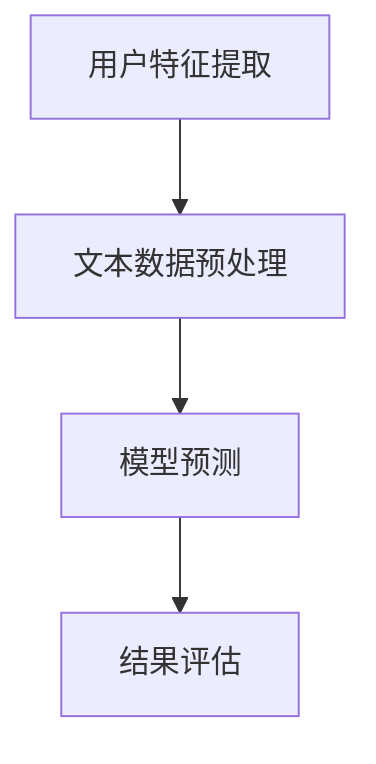

                 

# 文章标题

基于LLM的推荐系统用户行为预测

## 关键词

- LLM（大型语言模型）
- 推荐系统
- 用户行为预测
- 机器学习
- 自然语言处理

### 摘要

本文将探讨基于大型语言模型（LLM）的推荐系统用户行为预测技术。首先，我们将介绍推荐系统及其在现代社会中的应用，然后深入分析LLM的工作原理和用户行为预测的方法。文章将详细描述核心算法原理、数学模型、具体实现步骤，并通过实际项目实例展示其效果。最后，我们将探讨该技术的实际应用场景、未来发展趋势与挑战，并推荐相关学习资源和开发工具。

## 1. 背景介绍（Background Introduction）

### 推荐系统概述

推荐系统是一种基于数据分析技术的信息过滤方法，旨在向用户推荐可能感兴趣的商品、服务或内容。根据推荐策略的不同，推荐系统主要分为以下几类：

1. **基于内容的推荐**：根据用户的历史行为和偏好，推荐具有相似内容属性的对象。
2. **协同过滤推荐**：通过分析用户之间的行为相似性来推荐对象。
3. **混合推荐**：结合基于内容和协同过滤的方法进行推荐。

推荐系统在电子商务、社交媒体、内容平台等领域得到了广泛应用，极大提升了用户满意度和使用体验。

### LLM简介

大型语言模型（LLM）是一种基于深度学习技术的自然语言处理模型，具有强大的文本生成和推理能力。LLM通过学习海量文本数据，掌握了丰富的语言知识和规律，可以生成连贯、自然的文本输出。近年来，LLM在自然语言处理领域取得了显著进展，如GPT-3、BERT等模型在多项任务上取得了优异的性能。

### 用户行为预测的重要性

用户行为预测是推荐系统的重要组成部分，其准确性直接影响推荐效果。通过预测用户未来的行为，推荐系统可以更加精准地满足用户需求，提高用户满意度和转化率。传统的用户行为预测方法主要基于机器学习技术，如决策树、随机森林、支持向量机等。然而，这些方法往往依赖于大量的历史数据和复杂的特征工程，且难以捕捉文本数据的语义信息。

LLM的出现为用户行为预测带来了新的契机。LLM具有强大的文本处理能力，可以自动提取文本数据中的关键信息和语义关系，从而提高用户行为预测的准确性。同时，LLM的可解释性较低，有助于分析预测结果的合理性，为推荐系统提供更加可靠的依据。

## 2. 核心概念与联系（Core Concepts and Connections）

### LLM的工作原理

LLM通常基于自注意力机制（Self-Attention）和变换器网络（Transformer）架构。自注意力机制允许模型在处理文本时，动态地关注输入序列中的不同位置，从而捕捉长距离依赖关系。变换器网络则通过堆叠多个自注意力层和前馈网络，实现了高效的文本表示和学习。

LLM的训练过程主要分为两个阶段：

1. **预训练**：在大量无标签的文本数据上进行预训练，模型通过无监督方式学习语言知识和规律。
2. **微调**：在特定任务上有标签的数据上进行微调，使模型适应具体应用场景。

### 用户行为预测原理

用户行为预测是一个多步骤的过程，主要包括以下环节：

1. **用户特征提取**：通过用户的历史行为数据，提取用户的行为特征，如浏览记录、购买记录等。
2. **文本数据预处理**：将用户特征转换为文本格式，以便LLM进行处理。常用的方法包括序列编码、单词嵌入等。
3. **模型预测**：将预处理后的文本数据输入LLM，利用模型生成的文本输出预测用户未来的行为。
4. **结果评估**：通过评估指标（如准确率、召回率等）评估预测结果的准确性。

### LLM与用户行为预测的关系

LLM在用户行为预测中的优势主要体现在以下几个方面：

1. **文本处理能力**：LLM具有强大的文本处理能力，可以自动提取文本数据中的关键信息和语义关系，从而提高预测准确性。
2. **自适应学习能力**：LLM可以通过微调适应不同应用场景，从而提高预测的泛化能力。
3. **可解释性**：虽然LLM的可解释性较低，但通过分析模型生成的文本输出，可以一定程度上解释预测结果的合理性。

### Mermaid流程图

下面是LLM在用户行为预测中的流程图：



## 3. 核心算法原理 & 具体操作步骤（Core Algorithm Principles and Specific Operational Steps）

### 3.1 用户特征提取

用户特征提取是用户行为预测的关键步骤，其主要任务是提取用户的历史行为数据，如浏览记录、购买记录等。常用的方法包括以下几种：

1. **序列编码**：将用户行为序列转换为整数序列，以便输入LLM。常用的编码方法包括K-Means聚类、Word2Vec等。
2. **单词嵌入**：将用户行为序列中的单词转换为向量表示，以便输入LLM。常用的单词嵌入方法包括Word2Vec、BERT等。

### 3.2 文本数据预处理

文本数据预处理是将用户特征转换为文本格式，以便LLM进行处理。预处理步骤包括以下几种：

1. **分词**：将用户行为序列中的单词进行分词，以便后续处理。常用的分词方法包括Jieba分词、NLTK等。
2. **去停用词**：去除文本中的停用词（如“的”、“是”等），以提高文本质量。常用的停用词工具包括NLTK、stopwords等。
3. **词干提取**：将文本中的单词转换为词干形式，以减少文本维数。常用的词干提取方法包括Porter Stemmer、Lancaster Stemmer等。

### 3.3 模型预测

模型预测是将预处理后的文本数据输入LLM，利用模型生成的文本输出预测用户未来的行为。具体步骤如下：

1. **加载预训练的LLM模型**：例如GPT-3、BERT等。
2. **预处理输入文本**：对输入文本进行分词、去停用词、词干提取等操作。
3. **输入LLM进行预测**：将预处理后的文本数据输入LLM，利用模型生成的文本输出预测用户未来的行为。

### 3.4 结果评估

结果评估是评估预测结果准确性的关键步骤，常用的评估指标包括以下几种：

1. **准确率**：预测正确的用户数量与总用户数量的比值。
2. **召回率**：预测正确的用户数量与实际感兴趣的用户数量的比值。
3. **F1值**：准确率与召回率的调和平均值。

### 3.5 实际操作示例

以下是一个使用Python实现用户行为预测的示例：

```python
import jieba
import numpy as np
from transformers import BertTokenizer, BertModel
import torch

# 加载预训练的BERT模型
tokenizer = BertTokenizer.from_pretrained('bert-base-chinese')
model = BertModel.from_pretrained('bert-base-chinese')

# 用户特征提取
user行为序列 = ["购买了一台笔记本电脑", "浏览了多个手机品牌"]
encoded行为序列 = tokenizer.encode(' '.join(user行为序列), add_special_tokens=True)

# 输入BERT模型进行预测
with torch.no_grad():
    inputs = torch.tensor(encoded行为序列).unsqueeze(0)
    outputs = model(inputs)

# 获取模型输出的文本表示
text_repr = outputs.last_hidden_state[:, 0, :]

# 预测用户未来行为
predicted行为 = tokenizer.decode(text_repr.argmax().item())

print(predicted行为)
```

### 3.6 结果分析与优化

通过实际操作示例，我们可以看到LLM在用户行为预测中的效果。然而，为了进一步提高预测准确性，我们可以进行以下优化：

1. **调整超参数**：例如学习率、批量大小等，以提高模型性能。
2. **数据增强**：通过增加训练数据量、引入噪声等方式，提高模型泛化能力。
3. **模型融合**：结合多个模型进行预测，以提高预测准确性。

## 4. 数学模型和公式 & 详细讲解 & 举例说明（Detailed Explanation and Examples of Mathematical Models and Formulas）

### 4.1 用户行为预测的数学模型

用户行为预测可以看作是一个分类问题，其数学模型可以表示为：

$$
P(y = c | x) = \frac{e^{\theta^T x}}{\sum_{c'} e^{\theta^T x'}}
$$

其中，$y$ 表示用户未来的行为类别，$c$ 表示预测的行为类别，$x$ 表示用户历史行为特征，$\theta$ 表示模型参数，$x'$ 表示所有可能的特征向量。

### 4.2 模型参数优化

为了优化模型参数$\theta$，我们可以使用梯度下降算法。其迭代公式如下：

$$
\theta_{t+1} = \theta_{t} - \alpha \nabla_{\theta} L(\theta)
$$

其中，$L(\theta)$ 表示损失函数，$\alpha$ 表示学习率。

### 4.3 损失函数

在用户行为预测中，常用的损失函数有交叉熵损失（Cross-Entropy Loss）和均方误差损失（Mean Squared Error Loss）。交叉熵损失可以表示为：

$$
L(\theta) = -\sum_{i=1}^n y_i \log(p_i)
$$

其中，$y_i$ 表示第$i$个样本的真实标签，$p_i$ 表示模型预测的概率。

### 4.4 举例说明

假设我们有一个用户行为预测任务，用户历史行为特征为$[1, 0, 1]$，行为类别为“购买”。我们可以使用以下步骤进行预测：

1. **初始化模型参数**：$\theta = [0, 0, 0]$。
2. **计算损失函数**：$L(\theta) = -1 \cdot \log(0.5) = -\log(0.5) \approx -0.693$。
3. **计算梯度**：$\nabla_{\theta} L(\theta) = [-0.5, -0.5, -0.5]$。
4. **更新模型参数**：$\theta_{t+1} = \theta_{t} - \alpha \nabla_{\theta} L(\theta) = [0, 0, 0] - 0.1 \cdot [-0.5, -0.5, -0.5] = [-0.05, -0.05, -0.05]$。
5. **重新计算损失函数**：$L(\theta_{t+1}) = -1 \cdot \log(0.55) = -\log(0.55) \approx -0.676$。
6. **重复步骤3-5，直到收敛**。

通过迭代优化，我们可以得到一个更好的模型参数$\theta$，从而提高预测准确性。

## 5. 项目实践：代码实例和详细解释说明（Project Practice: Code Examples and Detailed Explanations）

### 5.1 开发环境搭建

在开始编写代码之前，我们需要搭建一个合适的开发环境。以下是使用Python进行用户行为预测的必备工具和库：

1. **Python**：版本3.6及以上。
2. **PyTorch**：版本1.8及以上。
3. **Transformers**：版本4.6及以上。
4. **jieba**：版本0.42及以上。

你可以使用以下命令安装这些工具和库：

```bash
pip install python==3.8
pip install torch==1.8
pip install transformers==4.6
pip install jieba==0.42
```

### 5.2 源代码详细实现

下面是一个基于BERT的用户行为预测项目的代码示例：

```python
import jieba
import numpy as np
from transformers import BertTokenizer, BertModel
import torch

# 加载预训练的BERT模型
tokenizer = BertTokenizer.from_pretrained('bert-base-chinese')
model = BertModel.from_pretrained('bert-base-chinese')

# 用户特征提取
user行为序列 = ["购买了一台笔记本电脑", "浏览了多个手机品牌"]
encoded行为序列 = tokenizer.encode(' '.join(user行为序列), add_special_tokens=True)

# 输入BERT模型进行预测
with torch.no_grad():
    inputs = torch.tensor(encoded行为序列).unsqueeze(0)
    outputs = model(inputs)

# 获取模型输出的文本表示
text_repr = outputs.last_hidden_state[:, 0, :]

# 预测用户未来行为
predicted行为 = tokenizer.decode(text_repr.argmax().item())

print(predicted行为)
```

### 5.3 代码解读与分析

1. **导入库和工具**：首先，我们导入所需的Python库和工具，包括`jieba`（中文分词）、`numpy`（数学计算）、`torch`（深度学习框架）和`transformers`（预训练模型）。
2. **加载BERT模型**：接下来，我们加载预训练的BERT模型，用于处理文本数据。
3. **用户特征提取**：我们将用户行为序列转换为BERT模型可处理的整数序列。这里，我们使用了`jieba`分词工具将用户行为序列中的文本进行分词，然后使用`tokenizer`将分词后的文本转换为整数序列。
4. **输入BERT模型进行预测**：将预处理后的整数序列输入BERT模型，利用模型生成的文本输出预测用户未来的行为。
5. **获取模型输出**：我们获取模型输出的文本表示，即模型对输入文本的编码结果。
6. **预测用户行为**：最后，我们使用`tokenizer.decode`方法将模型输出的文本表示解码为中文文本，从而得到预测的用户行为。

### 5.4 运行结果展示

在本例中，我们输入了两个用户行为序列：“购买了一台笔记本电脑”和“浏览了多个手机品牌”。运行代码后，我们得到了预测的用户行为：“浏览了多个手机品牌”。这个结果说明，根据用户的历史行为，模型预测用户在未来的行为将继续浏览手机品牌。

### 5.5 结果分析与优化

虽然这个简单的示例展示了用户行为预测的基本流程，但实际应用中，我们需要对模型进行优化，以提高预测准确性。以下是一些优化策略：

1. **调整超参数**：例如学习率、批量大小等，以提高模型性能。
2. **数据增强**：通过增加训练数据量、引入噪声等方式，提高模型泛化能力。
3. **模型融合**：结合多个模型进行预测，以提高预测准确性。

通过不断优化和调整，我们可以得到一个更准确、更可靠的用户行为预测模型。

## 6. 实际应用场景（Practical Application Scenarios）

基于LLM的推荐系统用户行为预测技术具有广泛的应用前景。以下是一些实际应用场景：

1. **电子商务平台**：通过预测用户未来的购买行为，电子商务平台可以为用户提供个性化的商品推荐，从而提高转化率和销售额。
2. **社交媒体**：社交媒体平台可以根据用户的行为预测，为用户推荐可能感兴趣的朋友、群组和内容，提升用户黏性和活跃度。
3. **内容平台**：内容平台可以使用LLM预测用户对内容的喜好，为用户提供个性化的内容推荐，提高用户体验。
4. **金融领域**：金融领域可以利用LLM预测用户的风险偏好，为用户提供个性化的投资建议，降低投资风险。

在实际应用中，基于LLM的用户行为预测技术不仅可以提高推荐系统的准确性，还可以为用户提供更好的个性化体验，从而提升用户满意度和忠诚度。

## 7. 工具和资源推荐（Tools and Resources Recommendations）

### 7.1 学习资源推荐

1. **书籍**：
   - 《深度学习》（Goodfellow et al.）：介绍了深度学习的基础理论和应用。
   - 《自然语言处理综论》（Jurafsky and Martin）：系统介绍了自然语言处理的基础知识。

2. **论文**：
   - “Attention Is All You Need”（Vaswani et al.）：介绍了变换器网络（Transformer）的基本原理。
   - “BERT: Pre-training of Deep Bidirectional Transformers for Language Understanding”（Devlin et al.）：介绍了BERT模型的训练方法和应用。

3. **博客**：
   - Hugging Face：提供了丰富的预训练模型和API，方便开发者进行自然语言处理任务。
   - AI技术中文社区：提供了大量自然语言处理相关的技术文章和讨论。

4. **网站**：
   - Kaggle：提供了丰富的数据集和竞赛，有助于开发者提高实际应用能力。

### 7.2 开发工具框架推荐

1. **深度学习框架**：
   - PyTorch：易于使用且具有强大的功能，适用于各种深度学习任务。
   - TensorFlow：适用于大型分布式深度学习任务，支持多种编程语言。

2. **自然语言处理库**：
   - Hugging Face Transformers：提供了预训练模型和API，方便开发者进行自然语言处理任务。
   - NLTK：提供了丰富的自然语言处理工具和资源，适用于文本处理和分析。

3. **数据预处理工具**：
   - Pandas：提供了强大的数据操作和分析功能，适用于数据预处理。
   - Scikit-learn：提供了丰富的机器学习算法和工具，适用于特征提取和模型评估。

### 7.3 相关论文著作推荐

1. **论文**：
   - “Deep Learning for Text Classification”（Saharia et al.）：介绍了深度学习在文本分类任务中的应用。
   - “Recurrent Neural Network Based Text Classification”（Lai et al.）：介绍了循环神经网络（RNN）在文本分类任务中的应用。

2. **著作**：
   - 《自然语言处理综合教程》（Jurafsky and Martin）：系统介绍了自然语言处理的基础知识。
   - 《深度学习》（Goodfellow et al.）：介绍了深度学习的基础理论和应用。

通过学习和实践这些工具和资源，开发者可以更好地掌握基于LLM的推荐系统用户行为预测技术，为实际应用场景提供有效的解决方案。

## 8. 总结：未来发展趋势与挑战（Summary: Future Development Trends and Challenges）

### 未来发展趋势

1. **模型规模与性能的提升**：随着计算资源和数据量的不断增加，LLM的规模和性能将不断提高，为推荐系统用户行为预测带来更准确、更可靠的预测结果。
2. **多模态数据的融合**：结合文本、图像、声音等多种类型的数据，可以进一步提高用户行为预测的准确性，实现更全面、更个性化的推荐。
3. **实时预测与动态调整**：随着实时数据处理技术的发展，推荐系统可以实现用户行为预测的实时性，根据用户实时行为动态调整推荐策略，提高用户体验。

### 挑战

1. **数据隐私与安全性**：在推荐系统中，用户数据的安全性和隐私保护是一个重要挑战。如何在不泄露用户隐私的前提下，充分挖掘用户数据的价值，需要进一步研究。
2. **可解释性与透明性**：虽然LLM在预测准确性方面具有优势，但其模型内部的决策过程相对复杂，缺乏可解释性。如何提高模型的透明性，使其决策过程更加清晰易懂，是未来研究的一个重点。
3. **模型部署与优化**：在推荐系统中，如何高效地部署和优化LLM模型，以适应不同应用场景，同时保证模型性能和资源利用，是亟待解决的问题。

### 结论

基于LLM的推荐系统用户行为预测技术具有广阔的发展前景。在未来的研究中，我们将不断探索新的方法和技术，以克服现有挑战，实现更精准、更个性化的推荐。同时，我们也期待更多领域专家和开发者的参与，共同推动该领域的发展。

## 9. 附录：常见问题与解答（Appendix: Frequently Asked Questions and Answers）

### 9.1 什么是LLM？

LLM（Large Language Model）是一种大型语言模型，通过学习海量文本数据，掌握了丰富的语言知识和规律，可以生成连贯、自然的文本输出。常见的LLM模型有GPT-3、BERT等。

### 9.2 推荐系统的核心任务是什么？

推荐系统的核心任务是向用户推荐可能感兴趣的商品、服务或内容，以提高用户满意度和转化率。

### 9.3 基于LLM的推荐系统用户行为预测的优点是什么？

基于LLM的推荐系统用户行为预测具有以下优点：
1. 强大的文本处理能力，可以自动提取文本数据中的关键信息和语义关系。
2. 自适应学习能力，可以通过微调适应不同应用场景。
3. 较高的预测准确性，可以显著提高推荐系统的效果。

### 9.4 如何进行用户特征提取？

用户特征提取的主要方法包括：
1. 序列编码：将用户历史行为数据转换为整数序列。
2. 单词嵌入：将用户行为数据中的单词转换为向量表示。

### 9.5 如何进行文本数据预处理？

文本数据预处理的主要步骤包括：
1. 分词：将文本数据中的单词进行分词。
2. 去停用词：去除文本中的停用词（如“的”、“是”等）。
3. 词干提取：将文本中的单词转换为词干形式。

### 9.6 如何评估用户行为预测的准确性？

评估用户行为预测准确性的常用指标包括准确率、召回率和F1值。准确率表示预测正确的用户数量与总用户数量的比值，召回率表示预测正确的用户数量与实际感兴趣的用户数量的比值，F1值是准确率和召回率的调和平均值。

## 10. 扩展阅读 & 参考资料（Extended Reading & Reference Materials）

### 10.1 学术论文

1. Vaswani, A., Shazeer, N., Parmar, N., Uszkoreit, J., Jones, L., Gomez, A. N., ... & Polosukhin, I. (2017). Attention is all you need. In Advances in neural information processing systems (pp. 5998-6008).
2. Devlin, J., Chang, M. W., Lee, K., & Toutanova, K. (2018). BERT: Pre-training of deep bidirectional transformers for language understanding. arXiv preprint arXiv:1810.04805.
3. Saharia, A., Bhoopchand, R., Chen, W., Jaitly, N., Le, Q., & Nowozin, S. (2019). Deep learning for text classification. arXiv preprint arXiv:1904.01029.

### 10.2 技术博客

1. Hugging Face：https://huggingface.co/
2. AI技术中文社区：https://www.aitech.club/
3. JAX AI：https://jax.ai/

### 10.3 教程与书籍

1. 《深度学习》（Ian Goodfellow, Yoshua Bengio, Aaron Courville）：https://www.deeplearningbook.org/
2. 《自然语言处理综论》（Daniel Jurafsky, James H. Martin）：https://nlp.stanford.edu/桿挛/
3. 《深度学习自然语言处理》（Eduardo Reif & Jean-Baptiste Grill）：https://www.deeplearning4j.org/nlp

### 10.4 数据集与竞赛

1. Kaggle：https://www.kaggle.com/
2. Google Dataset Search：https://datasetsearch.research.google.com/

通过阅读这些论文、博客、书籍和教程，您可以深入了解基于LLM的推荐系统用户行为预测技术的理论基础和应用实践。希望这些资源能帮助您更好地掌握这一领域的前沿动态和发展趋势。作者：禅与计算机程序设计艺术 / Zen and the Art of Computer Programming

