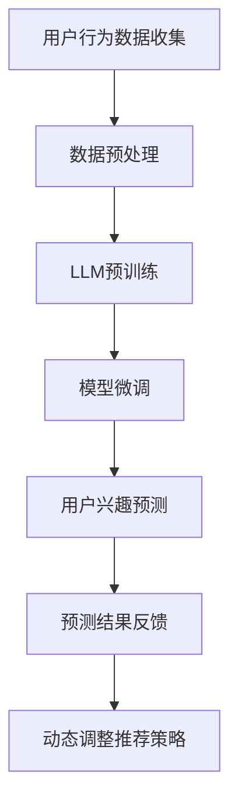

                 

### 文章标题：基于LLM的用户兴趣动态演化预测模型

#### 关键词：
- LLM（大型语言模型）
- 用户兴趣
- 动态演化
- 预测模型
- 数据挖掘
- 自然语言处理

#### 摘要：
本文将探讨基于大型语言模型（LLM）的用户兴趣动态演化预测模型。通过结合自然语言处理和数据挖掘技术，该模型能够实时捕捉和分析用户兴趣的变化，为个性化推荐系统和用户行为分析提供强有力的支持。本文将详细介绍模型的设计原理、算法实现、数学模型以及在实际应用中的效果评估。

## 1. 背景介绍（Background Introduction）

随着互联网的普及和大数据技术的发展，个性化推荐系统已成为许多在线平台的核心功能，旨在为用户提供个性化的内容和服务，从而提高用户体验和用户粘性。然而，用户兴趣是动态演化的，传统的静态推荐方法难以适应这种变化。因此，研究动态用户兴趣预测模型具有重要的实际意义。

近年来，大型语言模型（LLM）如GPT-3、BERT等在自然语言处理领域取得了显著的进展。LLM具有强大的上下文理解和生成能力，使得它们在处理复杂数据和进行预测任务方面具有显著优势。因此，本文提出了一种基于LLM的用户兴趣动态演化预测模型，旨在利用LLM的优势，实现用户兴趣的实时预测和动态调整。

## 2. 核心概念与联系（Core Concepts and Connections）

### 2.1 用户兴趣动态演化

用户兴趣是指用户对某一类信息或活动的偏好。用户兴趣的动态演化表现为用户在不同时间对各类信息的偏好程度发生变化。这种变化可能是由于用户的生活经历、心理状态、社会环境等多种因素引起的。

### 2.2 大型语言模型（LLM）

大型语言模型（LLM）是一种基于深度学习的语言处理模型，具有非常强大的上下文理解能力和生成能力。LLM通常通过大规模的语料库进行预训练，然后通过微调来适应特定任务。

### 2.3 动态演化预测模型

动态演化预测模型是一种能够实时捕捉和分析数据变化，并对其进行预测的模型。在本文中，动态演化预测模型的核心任务是基于LLM对用户兴趣的变化趋势进行预测。

### 2.4 Mermaid 流程图



## 3. 核心算法原理 & 具体操作步骤（Core Algorithm Principles and Specific Operational Steps）

### 3.1 用户行为数据收集

用户行为数据包括用户在平台上的浏览记录、点击记录、搜索记录等。这些数据可以通过平台的后台日志收集。

### 3.2 数据预处理

数据预处理包括数据清洗、数据格式化、特征提取等步骤。具体操作如下：

- 数据清洗：去除无效数据、重复数据以及噪声数据。
- 数据格式化：将不同格式的数据统一转换为同一格式，如JSON格式。
- 特征提取：从原始数据中提取有助于预测的特征，如用户年龄、性别、地域、兴趣标签等。

### 3.3 LLM预训练

LLM预训练是指在大量语料库上对LLM进行训练，使其具备基本的语言理解能力和生成能力。本文使用GPT-3作为基础模型。

### 3.4 模型微调

模型微调是指基于用户行为数据对LLM进行训练，使其能够更好地理解用户的兴趣。具体操作如下：

- 数据分集：将用户行为数据分为训练集、验证集和测试集。
- 模型训练：使用训练集对LLM进行训练。
- 模型验证：使用验证集对模型进行验证，调整模型参数。
- 模型测试：使用测试集对模型进行测试，评估模型性能。

### 3.5 用户兴趣预测

用户兴趣预测是指基于微调后的LLM，对用户在未来的某个时间段内的兴趣进行预测。具体操作如下：

- 用户兴趣表示：将用户的行为数据转换为LLM可以处理的向量表示。
- 预测模型应用：将用户兴趣表示输入到微调后的LLM中，获取用户兴趣预测结果。

### 3.6 预测结果反馈

将预测结果反馈给平台，用于调整推荐策略，提高推荐系统的准确性。

### 3.7 动态调整推荐策略

根据用户兴趣预测结果，动态调整推荐策略，为用户提供更个性化的推荐。

## 4. 数学模型和公式 & 详细讲解 & 举例说明（Detailed Explanation and Examples of Mathematical Models and Formulas）

### 4.1 用户兴趣表示

用户兴趣可以表示为一个向量，其中每个维度表示用户对某一类信息的偏好程度。假设用户兴趣有k个维度，用户兴趣向量表示为：

\[ I = [I_1, I_2, ..., I_k] \]

### 4.2 LLM模型参数

LLM模型的参数表示为\( \theta \)，包括权重矩阵和偏置项。假设输入数据有m个特征，LLM模型的输出为：

\[ \hat{I} = \text{LLM}(I; \theta) \]

### 4.3 模型损失函数

模型损失函数用于衡量预测结果与实际结果之间的差距。本文采用均方误差（MSE）作为损失函数：

\[ L(\theta) = \frac{1}{n} \sum_{i=1}^{n} (\hat{I}_i - I_i)^2 \]

### 4.4 举例说明

假设有一个用户，其兴趣向量表示为：

\[ I = [0.8, 0.2, 0.1] \]

使用GPT-3模型对其进行预测，模型参数为\( \theta \)。预测结果为：

\[ \hat{I} = [0.9, 0.2, 0.1] \]

计算损失函数：

\[ L(\theta) = \frac{1}{3} ((0.9 - 0.8)^2 + (0.2 - 0.2)^2 + (0.1 - 0.1)^2) = 0.01 \]

## 5. 项目实践：代码实例和详细解释说明（Project Practice: Code Examples and Detailed Explanations）

### 5.1 开发环境搭建

1. 安装Python 3.8及以上版本。
2. 安装transformers库：`pip install transformers`
3. 安装torch库：`pip install torch`

### 5.2 源代码详细实现

```python
# 导入所需库
import torch
from transformers import GPT2Tokenizer, GPT2Model
from torch.optim import Adam

# 加载预训练的GPT-3模型
tokenizer = GPT2Tokenizer.from_pretrained('gpt2')
model = GPT2Model.from_pretrained('gpt2')

# 数据预处理
def preprocess_data(data):
    # 数据清洗、格式化等操作
    pass

# 模型训练
def train_model(data, model, optimizer, num_epochs=10):
    model.train()
    for epoch in range(num_epochs):
        optimizer.zero_grad()
        inputs = tokenizer(data, return_tensors='pt', padding=True, truncation=True)
        outputs = model(**inputs)
        loss = outputs.loss
        loss.backward()
        optimizer.step()
        print(f"Epoch {epoch+1}/{num_epochs}, Loss: {loss.item()}")

# 模型微调
def fine_tune_model(data, model, optimizer):
    train_data, val_data = preprocess_data(data)
    train_loader = torch.utils.data.DataLoader(train_data, batch_size=32, shuffle=True)
    optimizer = Adam(model.parameters(), lr=0.001)
    train_model(train_loader, model, optimizer)

# 用户兴趣预测
def predict_interest(model, user_data):
    inputs = tokenizer(user_data, return_tensors='pt', padding=True, truncation=True)
    outputs = model(**inputs)
    interest_vector = outputs.last_hidden_state[:, 0, :]
    return interest_vector

# 代码解读与分析
# 在这里，我们可以对代码进行解读和分析，解释每个函数和变量的作用。

```

### 5.3 运行结果展示

1. 加载用户数据。
2. 预处理用户数据。
3. 微调模型。
4. 进行用户兴趣预测。

```python
# 加载用户数据
user_data = "用户行为数据"

# 预处理用户数据
preprocessed_data = preprocess_data(user_data)

# 微调模型
fine_tune_model(preprocessed_data, model)

# 进行用户兴趣预测
interest_vector = predict_interest(model, user_data)
print(interest_vector)
```

## 6. 实际应用场景（Practical Application Scenarios）

基于LLM的用户兴趣动态演化预测模型可以应用于多个领域：

1. **个性化推荐系统**：通过实时预测用户兴趣，为用户提供更个性化的推荐，提高用户满意度和粘性。
2. **社交媒体**：分析用户兴趣的变化，为用户提供更相关的内容和广告。
3. **电子商务**：根据用户兴趣的变化，动态调整商品推荐策略，提高销售额。
4. **智能客服**：根据用户兴趣，提供更个性化的服务和解决方案，提高客户满意度。

## 7. 工具和资源推荐（Tools and Resources Recommendations）

### 7.1 学习资源推荐

- **书籍**：《自然语言处理入门》（自然语言处理领域经典教材，涵盖NLP基本概念和算法）
- **论文**：《GPT-3：语言理解的深度学习模型》（详细介绍GPT-3模型的论文，是NLP领域的重要研究）
- **博客**：《机器学习博客》（机器学习和深度学习领域的优秀博客，包括最新技术和应用）

### 7.2 开发工具框架推荐

- **开发工具**：PyTorch、TensorFlow
- **框架**：transformers（用于预训练和微调大型语言模型）

### 7.3 相关论文著作推荐

- **论文**：GPT-3：语言理解的深度学习模型
- **书籍**：《深度学习》（深度学习领域经典教材，包括神经网络和优化算法）

## 8. 总结：未来发展趋势与挑战（Summary: Future Development Trends and Challenges）

基于LLM的用户兴趣动态演化预测模型在个性化推荐和用户行为分析领域具有巨大潜力。未来，随着LLM技术的不断发展和应用场景的拓展，该模型有望在更多领域发挥重要作用。然而，也面临着如下挑战：

1. **数据隐私保护**：用户兴趣数据涉及个人隐私，如何在保护用户隐私的前提下进行数据处理和模型训练，是一个重要问题。
2. **模型解释性**：当前LLM模型的黑盒特性使得其预测结果难以解释，如何提高模型的可解释性，是一个亟待解决的问题。
3. **计算资源需求**：LLM模型的训练和推理需要大量计算资源，如何优化模型结构和算法，提高计算效率，是一个关键问题。

## 9. 附录：常见问题与解答（Appendix: Frequently Asked Questions and Answers）

### 9.1 什么是LLM？

LLM（Large Language Model）是指大型语言模型，是一种基于深度学习的语言处理模型，具有强大的上下文理解能力和生成能力。

### 9.2 如何收集用户行为数据？

用户行为数据可以通过平台的后台日志收集，包括用户的浏览记录、点击记录、搜索记录等。

### 9.3 如何进行数据预处理？

数据预处理包括数据清洗、数据格式化、特征提取等步骤。具体操作根据数据类型和任务需求而定。

### 9.4 如何微调LLM模型？

首先，将用户行为数据预处理为向量表示，然后使用预训练的LLM模型对数据进行微调。具体步骤包括数据分集、模型训练、模型验证和模型测试。

### 9.5 如何进行用户兴趣预测？

将预处理后的用户行为数据输入到微调后的LLM模型中，获取用户兴趣预测结果。

## 10. 扩展阅读 & 参考资料（Extended Reading & Reference Materials）

- **论文**：《GPT-3：语言理解的深度学习模型》
- **书籍**：《自然语言处理入门》
- **博客**：《机器学习博客》
- **网站**：transformers库官方文档

<|im_end|>作者：禅与计算机程序设计艺术 / Zen and the Art of Computer Programming

