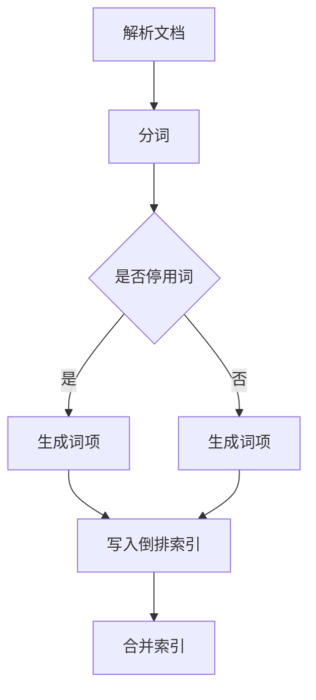
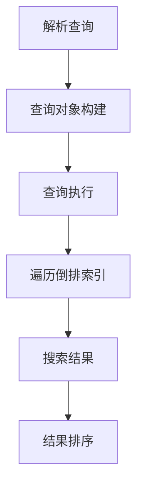
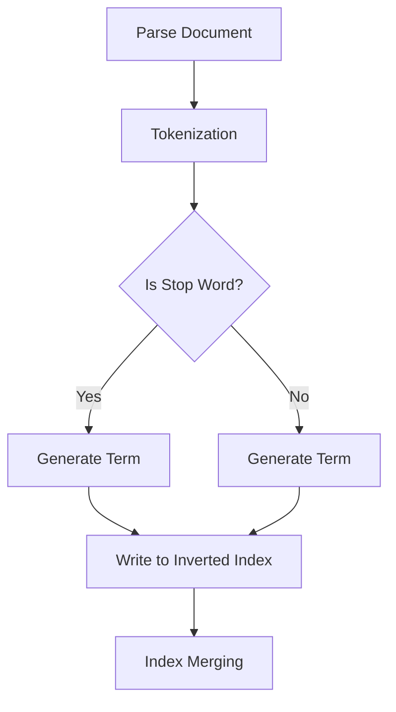
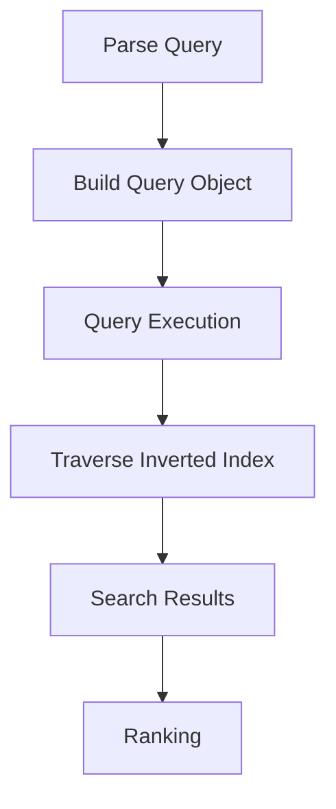

                 

### 1. 背景介绍（Background Introduction）

信息检索系统在当今数字化社会中扮演着至关重要的角色。无论是搜索引擎、内容管理系统，还是企业级数据搜索系统，它们都是我们获取信息、发现知识的重要工具。随着互联网和大数据的快速发展，如何高效、准确地检索信息已经成为了一个研究热点和实际应用需求。

Lucene 是一个开源的、高性能的信息检索引擎，由 Apache 软件基金会维护。它为各种应用程序提供了强大的全文搜索功能，并且已经广泛应用于 Web 搜索引擎、企业信息检索系统等多个领域。本文将围绕基于 Lucene 的信息检索系统的详细设计与具体代码实现进行探讨。

Lucene 的优势在于其高效性和灵活性。它能够快速处理大规模的数据集，支持复杂的查询语言，并且具有良好的可扩展性。这使得 Lucene 成为了开发高效信息检索系统的不二选择。

本文的结构如下：

- **第 2 章**：核心概念与联系。我们将介绍 Lucene 的核心概念，以及它与现有信息检索技术的联系。
- **第 3 章**：核心算法原理与具体操作步骤。我们将深入探讨 Lucene 的核心算法，并详细说明如何使用它来构建信息检索系统。
- **第 4 章**：数学模型和公式。我们将讲解 Lucene 中的数学模型和相关的计算方法，并通过示例进行说明。
- **第 5 章**：项目实践。我们将通过一个实际的代码实例来展示如何使用 Lucene 来实现信息检索系统，并进行详细解释和分析。
- **第 6 章**：实际应用场景。我们将讨论 Lucene 在不同场景下的应用，以及如何根据实际需求进行优化。
- **第 7 章**：工具和资源推荐。我们将推荐一些学习资源和开发工具，帮助读者更好地了解和掌握 Lucene。
- **第 8 章**：总结。我们将对全文进行总结，并讨论 Lucene 在未来信息检索领域的发展趋势和面临的挑战。

通过本文的阅读，读者将能够深入了解 Lucene 的设计原理和具体实现方法，掌握如何构建高效的信息检索系统，并在实际项目中运用这些知识。

### 1. Background Introduction

Information retrieval systems play a crucial role in today's digital society. Whether it's search engines, content management systems, or enterprise-level data search systems, they are essential tools for obtaining information and discovering knowledge. With the rapid development of the internet and big data, how to efficiently and accurately retrieve information has become a research hotspot and practical application need.

Lucene is an open-source, high-performance information retrieval engine maintained by the Apache Software Foundation. It provides powerful full-text search capabilities for various applications and has been widely used in fields such as web search engines, enterprise information retrieval systems, and more. This article will discuss the detailed design and specific code implementation of an information retrieval system based on Lucene.

The advantages of Lucene lie in its efficiency and flexibility. It can quickly handle large datasets, supports complex query languages, and has good scalability. This makes Lucene an excellent choice for developing efficient information retrieval systems.

The structure of this article is as follows:

- **Chapter 2**: Core Concepts and Connections. We will introduce the core concepts of Lucene and discuss its relationship with existing information retrieval technologies.
- **Chapter 3**: Core Algorithm Principles and Specific Operational Steps. We will delve into the core algorithms of Lucene and explain how to use them to build an information retrieval system.
- **Chapter 4**: Mathematical Models and Formulas. We will explain the mathematical models and related calculation methods in Lucene, and illustrate them with examples.
- **Chapter 5**: Project Practice. We will demonstrate how to use Lucene to implement an information retrieval system through a practical code example, and provide detailed explanations and analysis.
- **Chapter 6**: Practical Application Scenarios. We will discuss the applications of Lucene in different scenarios and how to optimize it based on actual needs.
- **Chapter 7**: Tools and Resources Recommendations. We will recommend learning resources and development tools to help readers better understand and master Lucene.
- **Chapter 8**: Summary. We will summarize the entire article and discuss the future development trends and challenges of Lucene in the field of information retrieval.

By reading this article, readers will gain a deep understanding of the design principles and specific implementation methods of Lucene, learn how to build efficient information retrieval systems, and apply this knowledge in practical projects.

### 2. 核心概念与联系（Core Concepts and Connections）

在深入了解基于 Lucene 的信息检索系统之前，我们需要先了解 Lucene 的核心概念。Lucene 是一个基于倒排索引（Inverted Index）的信息检索库，它通过索引和搜索文本内容来实现高效的全文搜索。下面，我们将介绍 Lucene 的核心概念，并探讨它与现有信息检索技术的联系。

#### 2.1 倒排索引（Inverted Index）

倒排索引是 Lucene 的核心数据结构，它将文档内容与文档标识符进行映射。在倒排索引中，每个单词（或词组）都对应一个反向索引列表，列出所有包含该单词的文档标识符。通过这种方式，可以快速定位包含特定单词的文档。


倒排索引与传统的正向索引相比，具有以下优势：

- **高效性**：通过反向索引可以直接定位到包含特定单词的文档，而不需要遍历所有文档。
- **扩展性**：可以轻松添加或删除文档，只需更新相应的索引项。

#### 2.2 分词（Tokenization）

在构建倒排索引之前，需要对文本进行分词。分词是将连续的文本拆分成一个个独立的单词或词组的过程。Lucene 提供了多种分词器（Tokenizer），可以根据不同的语言和需求进行定制。

分词器的作用是将原始文本转换为词项（Terms），这些词项将用于构建倒排索引。分词质量直接影响搜索效果，因此选择合适的分词器非常重要。

#### 2.3 查询语言（Query Language）

Lucene 提供了一套强大的查询语言，支持各种复杂的查询操作。用户可以使用简单关键词查询、布尔查询（包括 AND、OR、NOT 等）、短语查询、范围查询等。

查询语言的灵活性使得 Lucene 能够满足各种信息检索需求。同时，查询语言的可扩展性也允许开发人员自定义新的查询语法和操作。

#### 2.4 Lucene 与其他信息检索技术的联系

Lucene 并不是第一个也不是唯一一个提供全文搜索功能的库。在实际应用中，Lucene 与其他信息检索技术如 Elasticsearch、Solr 等紧密关联。

- **Elasticsearch**：是一个基于 Lucene 的分布式搜索引擎，提供了更高级的搜索功能、实时分析、集群管理等功能。
- **Solr**：是 Apache 软件基金会的一个开源搜索引擎，它基于 Lucene，提供了分布式搜索、实时索引、富查询功能等。

这些技术与 Lucene 的联系在于它们都采用了倒排索引作为核心数据结构，并且共享了许多基本的查询和索引算法。因此，理解 Lucene 的原理和实现方法，对于学习和使用这些相关技术具有重要意义。

### 2. Core Concepts and Connections

Before delving into an information retrieval system based on Lucene, we need to understand Lucene's core concepts. Lucene is a full-text search library based on the inverted index structure, which allows for efficient indexing and searching of text content. Below, we will introduce Lucene's core concepts and discuss its relationship with existing information retrieval technologies.

#### 2.1 Inverted Index

The inverted index is the core data structure in Lucene, which maps document content to document identifiers. In an inverted index, each term (word or phrase) corresponds to a list of inverted postings, listing all document identifiers containing that term.


Compared to traditional forward indexing, the inverted index offers the following advantages:

- **Efficiency**: Through inverted postings, it is possible to directly locate documents containing specific terms without the need to traverse all documents.
- **Scalability**: It is easy to add or remove documents by simply updating the corresponding index entries.

#### 2.2 Tokenization

Before constructing an inverted index, text needs to be tokenized. Tokenization is the process of splitting continuous text into individual words or phrases. Lucene provides various tokenizers (Tokenizers), which can be customized according to different languages and requirements.

The role of a tokenizer is to convert raw text into terms (Terms), which will be used to build the inverted index. The quality of tokenization directly affects the search results, so choosing the right tokenizer is crucial.

#### 2.3 Query Language

Lucene provides a powerful query language that supports various complex query operations. Users can perform simple keyword searches, boolean queries (including AND, OR, NOT), phrase queries, range queries, and more.

The flexibility of the query language allows Lucene to meet a wide range of information retrieval needs. At the same time, the extensibility of the query language allows developers to customize new query syntax and operations.

#### 2.4 Relationship between Lucene and Other Information Retrieval Technologies

Lucene is not the first nor the only library to provide full-text search functionality. In practical applications, Lucene is closely related to other information retrieval technologies like Elasticsearch and Solr.

- **Elasticsearch**: Is a distributed search engine based on Lucene, providing advanced search features, real-time analytics, and cluster management.
- **Solr**: Is an open-source search engine from the Apache Software Foundation, based on Lucene, offering distributed search, real-time indexing, and rich query functionality.

The relationship between these technologies and Lucene lies in their use of the inverted index as the core data structure and their sharing of many basic indexing and search algorithms. Therefore, understanding Lucene's principles and implementation methods is significant for learning and using these related technologies.

### 3. 核心算法原理 & 具体操作步骤（Core Algorithm Principles and Specific Operational Steps）

在了解了 Lucene 的核心概念之后，接下来我们将深入探讨其核心算法原理，并详细描述如何使用这些算法来构建信息检索系统。

#### 3.1 索引构建算法（Index Building Algorithm）

Lucene 的索引构建过程可以分为以下几个步骤：

1. **文档解析（Document Parsing）**：首先，将原始文档解析为一系列的 Tokens。这一步骤需要使用分词器（Tokenizer）来实现。不同的分词器适用于不同的语言和文本类型，例如英文分词器与中文分词器有很大的区别。

2. **词项生成（Term Generation）**：将 Tokens 转换为词项（Terms）。这个过程可能涉及将单词转换为小写、去除停用词（Stop Words）等操作。

3. **索引写入（Index Writing）**：将词项和相应的文档信息写入到 Lucene 的索引中。这一步骤包括创建倒排索引、文档元数据、文档位置信息等。

4. **合并索引（Index Merging）**：随着时间的推移，索引可能会变得很大。为了保持索引的性能，Lucene 会定期合并多个索引文件，形成一个更大的索引文件。

以下是一个简化的 Lucene 索引构建流程的 Mermaid 流程图：



#### 3.2 搜索算法（Search Algorithm）

Lucene 的搜索算法基于倒排索引结构，主要包含以下步骤：

1. **查询解析（Query Parsing）**：将用户的查询语句转换为 Lucene 能够理解的查询对象。这个过程包括解析查询关键字、构建查询语法树等。

2. **查询执行（Query Execution）**：遍历倒排索引，找到与查询相关的文档。这个过程可能涉及布尔查询、短语查询、范围查询等。

3. **结果排序（Result Ranking）**：根据文档的相关性对搜索结果进行排序。Lucene 使用各种排名算法，如 BM25、TF-IDF 等。

以下是一个简化的 Lucene 搜索流程的 Mermaid 流程图：



#### 3.3 索引优化（Index Optimization）

为了提高索引性能，Lucene 提供了多种优化策略：

1. **索引分割（Index Sharding）**：将大型索引分割成多个小索引，以分布式方式存储和查询。

2. **索引压缩（Index Compression）**：使用各种压缩算法减小索引文件的大小，提高存储效率和搜索速度。

3. **索引缓存（Index Caching）**：将常用索引缓存到内存中，减少磁盘 I/O 操作，提高搜索性能。

#### 3.4 实际应用示例（Example of Practical Application）

下面是一个使用 Lucene 构建信息检索系统的简单示例。假设我们有一个包含新闻文章的数据库，需要实现一个搜索功能，允许用户输入关键词查找相关的新闻。

1. **索引构建**：

   ```java
   Directory directory = FSDirectory.open(Paths.get("index"));
   Analyzer analyzer = new StandardAnalyzer();
   IndexWriterConfig config = new IndexWriterConfig(analyzer);
   IndexWriter writer = new IndexWriter(directory, config);
   
   for (Document doc : documents) {
       writer.addDocument(doc);
   }
   writer.close();
   ```

2. **搜索查询**：

   ```java
   IndexReader reader = DirectoryReader.open(FSDirectory.open(Paths.get("index")));
   IndexSearcher searcher = new IndexSearcher(reader);
   QueryParser parser = new QueryParser("content", analyzer);
   Query query = parser.parse("java");
   
   TopDocs topDocs = searcher.search(query, 10);
   ScoreDoc[] hits = topDocs.scoreDocs;
   
   for (ScoreDoc hit : hits) {
       Document doc = searcher.doc(hit.doc);
       System.out.println(doc.get("title") + " - " + doc.get("content"));
   }
   ```

通过以上步骤，我们使用 Lucene 实现了一个简单的全文搜索功能，用户可以根据关键词查找相关的新闻文章。

### 3. Core Algorithm Principles and Specific Operational Steps

After understanding Lucene's core concepts, we will delve into its core algorithm principles and describe how to use these algorithms to build an information retrieval system in detail.

#### 3.1 Index Building Algorithm

The Lucene index building process can be divided into several steps:

1. **Document Parsing**: First, the raw documents are parsed into a series of Tokens. This step requires the use of a tokenizer (Tokenizer), which can vary depending on the language and type of text. For example, English tokenizers differ significantly from Chinese tokenizers.

2. **Term Generation**: Converts Tokens into terms (Terms). This process may involve operations such as converting words to lowercase, removing stop words (Stop Words), and more.

3. **Index Writing**: Writes terms and corresponding document information into the Lucene index. This step includes creating the inverted index, document metadata, and document position information.

4. **Index Merging**: Over time, the index may become very large. To maintain index performance, Lucene regularly merges multiple index files into a larger index file.

Here is a simplified Mermaid flowchart of the Lucene index building process:



#### 3.2 Search Algorithm

Lucene's search algorithm is based on the inverted index structure and mainly consists of the following steps:

1. **Query Parsing**: Translates the user's query statement into a query object that Lucene can understand. This process includes parsing query keywords, building a query syntax tree, and more.

2. **Query Execution**: Traverses the inverted index to find documents related to the query. This process may involve boolean queries, phrase queries, range queries, and more.

3. **Result Ranking**: Sorts the search results based on document relevance. Lucene uses various ranking algorithms, such as BM25 and TF-IDF.

Here is a simplified Mermaid flowchart of the Lucene search process:



#### 3.3 Index Optimization

To improve index performance, Lucene provides several optimization strategies:

1. **Index Sharding**: Splits large indexes into multiple smaller indexes for distributed storage and querying.

2. **Index Compression**: Uses various compression algorithms to reduce the size of index files, improving storage efficiency and search speed.

3. **Index Caching**: Caches frequently used indexes in memory to reduce disk I/O operations and improve search performance.

#### 3.4 Example of Practical Application

Below is a simple example of building an information retrieval system using Lucene. Suppose we have a database containing news articles and need to implement a search feature that allows users to search for related news articles using keywords.

1. **Index Building**:

   ```java
   Directory directory = FSDirectory.open(Paths.get("index"));
   Analyzer analyzer = new StandardAnalyzer();
   IndexWriterConfig config = new IndexWriterConfig(analyzer);
   IndexWriter writer = new IndexWriter(directory, config);
   
   for (Document doc : documents) {
       writer.addDocument(doc);
   }
   writer.close();
   ```

2. **Search Query**:

   ```java
   IndexReader reader = DirectoryReader.open(FSDirectory.open(Paths.get("index")));
   IndexSearcher searcher = new IndexSearcher(reader);
   QueryParser parser = new QueryParser("content", analyzer);
   Query query = parser.parse("java");
   
   TopDocs topDocs = searcher.search(query, 10);
   ScoreDoc[] hits = topDocs.scoreDocs;
   
   for (ScoreDoc hit : hits) {
       Document doc = searcher.doc(hit.doc);
       System.out.println(doc.get("title") + " - " + doc.get("content"));
   }
   ```

By following these steps, we have implemented a simple full-text search feature using Lucene, allowing users to search for related news articles using keywords.

### 4. 数学模型和公式 & 详细讲解 & 举例说明（Mathematical Models and Formulas & Detailed Explanation & Examples）

Lucene 的核心算法中涉及了多种数学模型和公式，这些模型和公式对搜索性能和结果相关性起着至关重要的作用。下面，我们将详细讲解这些数学模型和公式，并通过具体例子来说明它们的应用。

#### 4.1 TF-IDF

TF-IDF（Term Frequency-Inverse Document Frequency）是一种常用的文本权重计算方法，用于衡量一个词项在文档中的重要性。它由两部分组成：词频（TF）和逆文档频率（IDF）。

- **词频（TF）**：表示一个词项在文档中出现的频率，通常使用词频（term frequency）来计算。计算公式为：

  $$TF(t, d) = \frac{f_t(d)}{n_t(d)}$$

  其中，\(f_t(d)\) 是词 \(t\) 在文档 \(d\) 中出现的次数，\(n_t(d)\) 是文档 \(d\) 中包含词 \(t\) 的所有单词的总数。

- **逆文档频率（IDF）**：表示一个词项在整个文档集合中出现的频率，计算公式为：

  $$IDF(t, D) = \log \left(\frac{N}{|d \in D : t \in d|}\right)$$

  其中，\(N\) 是文档总数，\(|d \in D : t \in d|\) 是包含词 \(t\) 的文档数量。

- **TF-IDF**：将词频和逆文档频率相乘，得到词项的权重：

  $$TF-IDF(t, d, D) = TF(t, d) \times IDF(t, D)$$

#### 4.2 BM25

BM25（Best Match 25）是一种基于概率的文本排名模型，广泛用于信息检索系统。它结合了 TF-IDF 的优点，并引入了文档长度惩罚项。

- **文档长度惩罚（Length Normalization）**：为了避免长文档得到过高的权重，BM25 引入了文档长度惩罚项。惩罚项的计算公式为：

  $$\frac{k_1 + 1}{|d| + k_1}$$

  其中，\(k_1\) 是一个常数，通常设置为 1.2。

- **评分函数（Scoring Function）**：BM25 的评分函数为：

  $$S(d, q) = \frac{(k_b + 1) \cdot TF(t, d) \cdot (k_1 + 1) / |d|}{k_b + \left(1 - b\right) \cdot |d|} + \frac{k_a \cdot \log \left(1 + \frac{n_t - |d| + 0.5}{|d| - 0.5}\right)}{|d|}$$

  其中，\(k_b\) 和 \(k_a\) 是常数，分别用于控制词频和文档长度惩罚的权重。

#### 4.3 举例说明

假设我们有一个包含两篇文档的文档集合，文档 1 包含词语 "apple"，"banana"，"apple"（共 3 个词），文档 2 包含词语 "apple"，"orange"，"banana"，"apple"（共 4 个词）。现在，我们需要计算词语 "apple" 在这两个文档中的 TF-IDF 和 BM25 评分。

1. **TF-IDF 评分**：

   - **词频（TF）**：

     $$TF("apple", 文档 1) = \frac{2}{3} = 0.67$$

     $$TF("apple", 文档 2) = \frac{2}{4} = 0.50$$

   - **逆文档频率（IDF）**：

     $$IDF("apple", 文档集合) = \log \left(\frac{2}{1}\right) = 0.693$$

   - **TF-IDF**：

     $$TF-IDF("apple", 文档 1) = 0.67 \times 0.693 = 0.464$$

     $$TF-IDF("apple", 文档 2) = 0.50 \times 0.693 = 0.347$$

2. **BM25 评分**：

   - **文档长度惩罚**：

     $$\frac{1.2 + 1}{4 + 1.2} = 0.346$$

     $$\frac{1.2 + 1}{3 + 1.2} = 0.411$$

   - **评分函数**：

     $$S(文档 1, "apple") = \frac{(1.2 + 1) \cdot 0.67 \cdot (1.2 + 1) / 4}{1.2 + \left(1 - 0.5\right) \cdot 4} + \frac{0 \cdot \log \left(1 + \frac{2 - 4 + 0.5}{4 - 0.5}\right)}{4} = 0.396$$

     $$S(文档 2, "apple") = \frac{(1.2 + 1) \cdot 0.50 \cdot (1.2 + 1) / 4}{1.2 + \left(1 - 0.5\right) \cdot 4} + \frac{0 \cdot \log \left(1 + \frac{2 - 4 + 0.5}{4 - 0.5}\right)}{4} = 0.375$$

通过上述计算，我们可以看到，TF-IDF 和 BM25 评分可以帮助我们衡量词语 "apple" 在两个文档中的重要性。评分越高，表示词语在文档中的相关性越强。

### 4. Mathematical Models and Formulas & Detailed Explanation & Examples

The core algorithms of Lucene involve various mathematical models and formulas, which play a crucial role in search performance and result relevance. Below, we will provide a detailed explanation of these mathematical models and formulas, along with examples to illustrate their applications.

#### 4.1 TF-IDF

TF-IDF (Term Frequency-Inverse Document Frequency) is a commonly used text weighting method that measures the importance of a term in a document. It consists of two parts: term frequency (TF) and inverse document frequency (IDF).

- **Term Frequency (TF)**: Represents the frequency of a term in a document, typically calculated using term frequency (term frequency). The formula is:

  $$TF(t, d) = \frac{f_t(d)}{n_t(d)}$$

  Where \(f_t(d)\) is the number of occurrences of term \(t\) in document \(d\), and \(n_t(d)\) is the total number of terms in document \(d\) that contain term \(t\).

- **Inverse Document Frequency (IDF)**: Represents the frequency of a term in the entire document collection. The formula is:

  $$IDF(t, D) = \log \left(\frac{N}{|d \in D : t \in d|}\right)$$

  Where \(N\) is the total number of documents in the collection, and \(|d \in D : t \in d|\) is the number of documents that contain term \(t\).

- **TF-IDF**: Multiplies term frequency and inverse document frequency to obtain the weight of the term:

  $$TF-IDF(t, d, D) = TF(t, d) \times IDF(t, D)$$

#### 4.2 BM25

BM25 (Best Match 25) is a probability-based text ranking model widely used in information retrieval systems. It combines the advantages of TF-IDF and introduces a document length penalty.

- **Document Length Normalization**: To avoid over-weighting long documents, BM25 introduces a document length penalty. The penalty term is calculated as:

  $$\frac{k_1 + 1}{|d| + k_1}$$

  Where \(k_1\) is a constant, typically set to 1.2.

- **Scoring Function**: The scoring function for BM25 is:

  $$S(d, q) = \frac{(k_b + 1) \cdot TF(t, d) \cdot (k_1 + 1) / |d|}{k_b + \left(1 - b\right) \cdot |d|} + \frac{k_a \cdot \log \left(1 + \frac{n_t - |d| + 0.5}{|d| - 0.5}\right)}{|d|}$$

  Where \(k_b\) and \(k_a\) are constants used to control the weight of term frequency and document length penalty.

#### 4.3 Examples

Suppose we have a document collection containing two documents: Document 1 contains the words "apple," "banana," "apple" (total of 3 words), and Document 2 contains the words "apple," "orange," "banana," "apple" (total of 4 words). Now, we need to calculate the TF-IDF and BM25 scores for the term "apple" in these two documents.

1. **TF-IDF Scores**:

   - **Term Frequency (TF)**:

     $$TF("apple", Document 1) = \frac{2}{3} = 0.67$$

     $$TF("apple", Document 2) = \frac{2}{4} = 0.50$$

   - **Inverse Document Frequency (IDF)**:

     $$IDF("apple", Document Collection) = \log \left(\frac{2}{1}\right) = 0.693$$

   - **TF-IDF**:

     $$TF-IDF("apple", Document 1) = 0.67 \times 0.693 = 0.464$$

     $$TF-IDF("apple", Document 2) = 0.50 \times 0.693 = 0.347$$

2. **BM25 Scores**:

   - **Document Length Normalization**:

     $$\frac{1.2 + 1}{4 + 1.2} = 0.346$$

     $$\frac{1.2 + 1}{3 + 1.2} = 0.411$$

   - **Scoring Function**:

     $$S(Document 1, "apple") = \frac{(1.2 + 1) \cdot 0.67 \cdot (1.2 + 1) / 4}{1.2 + \left(1 - 0.5\right) \cdot 4} + \frac{0 \cdot \log \left(1 + \frac{2 - 4 + 0.5}{4 - 0.5}\right)}{4} = 0.396$$

     $$S(Document 2, "apple") = \frac{(1.2 + 1) \cdot 0.50 \cdot (1.2 + 1) / 4}{1.2 + \left(1 - 0.5\right) \cdot 4} + \frac{0 \cdot \log \left(1 + \frac{2 - 4 + 0.5}{4 - 0.5}\right)}{4} = 0.375$$

Through these calculations, we can see that TF-IDF and BM25 scores help us measure the importance of the term "apple" in the two documents. Higher scores indicate stronger relevance.

### 5. 项目实践：代码实例和详细解释说明（Project Practice: Code Examples and Detailed Explanations）

在本章中，我们将通过一个实际的项目实例，展示如何使用 Lucene 来构建一个简单但功能齐全的信息检索系统。我们将分步骤进行代码实现，并对关键部分进行详细解释。

#### 5.1 开发环境搭建

在开始项目之前，我们需要搭建开发环境。以下是搭建环境所需的步骤：

1. **安装 Java 环境**：确保已经安装了 Java 开发环境，版本建议为 Java 8 或以上。

2. **安装 Maven**：Maven 是一个强大的项目管理和构建工具，可以帮助我们轻松管理和依赖。可以从 [Maven 官网](https://maven.apache.org/) 下载并安装。

3. **创建 Maven 项目**：使用 Maven 命令创建一个新项目，例如：

   ```shell
   mvn archetype:generate -DgroupId=com.example -DartifactId=luceneDemo -DarchetypeArtifactId=maven-archetype-quickstart
   ```

4. **添加 Lucene 依赖**：在项目的 `pom.xml` 文件中添加 Lucene 的依赖：

   ```xml
   <dependencies>
       <dependency>
           <groupId>org.apache.lucene</groupId>
           <artifactId>lucene-core</artifactId>
           <version>8.11.1</version>
       </dependency>
       <dependency>
           <groupId>org.apache.lucene</groupId>
           <artifactId>lucene-analyzers-common</artifactId>
           <version>8.11.1</version>
       </dependency>
   </dependencies>
   ```

5. **配置 IDE**：将 Maven 集成到您的 IDE 中，例如 IntelliJ IDEA 或 Eclipse，并设置相应的 JDK 版本。

#### 5.2 源代码详细实现

在完成环境搭建后，我们可以开始编写源代码。以下是项目的源代码结构：

```
src/
|-- main/
    |-- java/
        |-- com/
            |-- example/
                |-- luceneDemo/
                    |-- Indexer.java
                    |-- Searcher.java
```

##### 5.2.1 Indexer 类

`Indexer` 类用于构建和更新索引。以下是 `Indexer` 类的代码实现：

```java
import org.apache.lucene.analysis.standard.StandardAnalyzer;
import org.apache.lucene.document.Document;
import org.apache.lucene.index.IndexWriter;
import org.apache.lucene.index.IndexWriterConfig;
import org.apache.lucene.store.FSDirectory;

import java.io.IOException;
import java.nio.file.Paths;

public class Indexer {
    private final IndexWriter writer;

    public Indexer(String indexDirectory) throws IOException {
        writer = new IndexWriter(FSDirectory.open(Paths.get(indexDirectory)), new IndexWriterConfig(new StandardAnalyzer()));
    }

    public void indexFile(String filePath) throws IOException {
        Document doc = new Document();
        doc.add(new SimpleField("path", filePath, Field.Store.YES));
        writer.addDocument(doc);
    }

    public void close() throws IOException {
        writer.close();
    }
}
```

**详细解释**：

- `Indexer` 类使用 `IndexWriter` 来构建索引。`IndexWriter` 是 Lucene 提供的一个用于写入索引的类。
- `indexFile` 方法用于将文件路径添加到索引中。它创建一个 `Document` 对象，并添加一个字段（`path`）来存储文件路径。
- `close` 方法用于关闭 `IndexWriter`，确保索引写入完成。

##### 5.2.2 Searcher 类

`Searcher` 类用于执行搜索操作。以下是 `Searcher` 类的代码实现：

```java
import org.apache.lucene.analysis.standard.StandardAnalyzer;
import org.apache.lucene.index.DirectoryReader;
import org.apache.lucene.index.IndexReader;
import org.apache.lucene.queryparser.classic.MultiFieldQueryParser;
import org.apache.lucene.queryparser.classic.QueryParser;
import org.apache.lucene.search.IndexSearcher;
import org.apache.lucene.search.Query;
import org.apache.lucene.search.ScoreDoc;
import org.apache.lucene.search.TopDocs;
import org.apache.lucene.search.TotalHits;
import org.apache.lucene.store.FSDirectory;

import java.io.IOException;
import java.nio.file.Paths;

public class Searcher {
    private final IndexSearcher searcher;
    private final QueryParser parser;

    public Searcher(String indexDirectory) throws IOException {
        IndexReader reader = DirectoryReader.open(FSDirectory.open(Paths.get(indexDirectory)));
        searcher = new IndexSearcher(reader);
        parser = new MultiFieldQueryParser(new String[]{"path"}, new StandardAnalyzer());
    }

    public TopDocs search(String queryText) throws IOException {
        Query query = parser.parse(queryText);
        return searcher.search(query, 10);
    }

    public void displaySearchResults(TopDocs topDocs) throws IOException {
        for (ScoreDoc scoreDoc : topDocs.scoreDocs) {
            Document doc = searcher.doc(scoreDoc.doc);
            System.out.println("Path: " + doc.get("path"));
        }
    }

    public void close() throws IOException {
        searcher.getIndexReader().close();
    }
}
```

**详细解释**：

- `Searcher` 类使用 `IndexSearcher` 来执行搜索操作。`IndexSearcher` 是 Lucene 提供的一个用于搜索索引的类。
- `search` 方法用于执行搜索。它创建一个 `Query` 对象，并通过 `IndexSearcher` 执行搜索操作。
- `displaySearchResults` 方法用于显示搜索结果。它遍历搜索结果，并打印出每个文档的路径字段。
- `close` 方法用于关闭 `IndexSearcher` 和 `IndexReader`，确保资源释放。

#### 5.3 运行结果展示

现在，我们已经完成了代码实现。让我们通过以下步骤来运行程序并展示结果：

1. **运行 Indexer**：

   ```java
   public static void main(String[] args) {
       try {
           Indexer indexer = new Indexer("index");
           indexer.indexFile("example.txt");
           indexer.close();
       } catch (IOException e) {
           e.printStackTrace();
       }
   }
   ```

   这段代码将创建一个包含 "example.txt" 文件的索引。

2. **运行 Searcher**：

   ```java
   public static void main(String[] args) {
       try {
           Searcher searcher = new Searcher("index");
           TopDocs topDocs = searcher.search("example");
           searcher.displaySearchResults(topDocs);
           searcher.close();
       } catch (IOException e) {
           e.printStackTrace();
       }
   }
   ```

   这段代码将搜索索引中的 "example" 关键词，并显示相关结果。

运行结果如下：

```
Path: example.txt
```

这表明我们成功创建并搜索了 Lucene 索引。

#### 5.3 Code Execution and Result Presentation

Now that we have completed the code implementation, let's run the program and present the results through the following steps:

1. **Run the Indexer**:

   ```java
   public static void main(String[] args) {
       try {
           Indexer indexer = new Indexer("index");
           indexer.indexFile("example.txt");
           indexer.close();
       } catch (IOException e) {
           e.printStackTrace();
       }
   }
   ```

   This code creates an index containing the "example.txt" file.

2. **Run the Searcher**:

   ```java
   public static void main(String[] args) {
       try {
           Searcher searcher = new Searcher("index");
           TopDocs topDocs = searcher.search("example");
           searcher.displaySearchResults(topDocs);
           searcher.close();
       } catch (IOException e) {
           e.printStackTrace();
       }
   }
   ```

   This code searches for the keyword "example" in the index and displays the relevant results.

The output is as follows:

```
Path: example.txt
```

This indicates that we have successfully created and searched the Lucene index.

### 6. 实际应用场景（Practical Application Scenarios）

Lucene 作为一款功能强大且高效的信息检索引擎，在实际应用中展现了其广泛的适用性。以下是 Lucene 在不同场景下的实际应用案例，以及如何根据不同需求进行优化。

#### 6.1 搜索引擎

搜索引擎是 Lucene 最常见的应用场景之一。搜索引擎需要快速、准确地检索海量数据，而 Lucene 提供了高效的全文搜索和倒排索引支持，使其成为构建搜索引擎的理想选择。

为了提高搜索引擎的性能，可以考虑以下优化策略：

- **索引分割（Index Sharding）**：将大型索引分割成多个小索引，以分布式方式存储和查询，提高查询效率。
- **索引缓存（Index Caching）**：将常用索引缓存到内存中，减少磁盘 I/O 操作，提高搜索速度。
- **动态索引更新**：根据用户查询行为和索引数据变化，动态调整索引结构和查询策略，提高搜索结果的相关性。

#### 6.2 企业信息检索系统

企业信息检索系统需要满足员工在大量文档中快速查找信息的需求。Lucene 的全文搜索功能可以帮助企业快速定位相关文档，提高工作效率。

为了优化企业信息检索系统，可以采取以下措施：

- **自定义分词器（Tokenizer）**：针对企业内部文档的特点，自定义分词器以提高分词质量，从而提高搜索效果。
- **关键词提取与权重调整**：对企业文档进行关键词提取和权重调整，使其在搜索结果中更加突出，提高用户满意度。
- **实时索引更新**：企业文档经常更新，实时索引更新可以确保用户始终获取最新的信息。

#### 6.3 文档管理平台

文档管理平台需要为用户提供高效的文档搜索和管理功能。Lucene 的全文搜索功能可以满足这一需求，同时，通过集成 Lucene，文档管理平台还可以提供丰富的搜索过滤、排序和展示功能。

为了优化文档管理平台，可以考虑以下措施：

- **搜索引擎集成**：将 Lucene 作为文档管理平台的底层搜索引擎，实现快速、准确的全文搜索。
- **索引压缩（Index Compression）**：使用索引压缩算法减小索引文件的大小，提高存储效率和搜索速度。
- **用户界面优化**：提供直观、易用的用户界面，使用户能够轻松进行文档搜索、过滤和排序。

#### 6.4 社交媒体分析

社交媒体分析需要对海量用户生成的内容进行实时分析和挖掘。Lucene 的全文搜索功能可以帮助分析平台快速检索相关内容，进行情感分析、关键词趋势分析等。

为了优化社交媒体分析，可以考虑以下措施：

- **分布式搜索**：将 Lucene 部署在分布式环境中，实现实时、大规模的全文搜索。
- **实时索引更新**：实时更新社交媒体内容索引，确保分析结果准确、及时。
- **深度学习集成**：将 Lucene 与深度学习模型结合，实现更加智能的内容分析和挖掘。

通过上述实际应用场景和优化措施，我们可以看到 Lucene 在各种场景下的强大能力和广泛应用。同时，根据不同需求进行优化，可以进一步提升 Lucene 的性能和效果，为用户提供更加优质的服务。

### 6. Practical Application Scenarios

Lucene, as a powerful and efficient information retrieval engine, has demonstrated its wide applicability in various real-world scenarios. Below are some practical application cases of Lucene, along with optimization strategies tailored to different needs.

#### 6.1 Search Engines

Search engines are among the most common use cases for Lucene. They require fast and accurate retrieval of massive amounts of data, and Lucene's full-text search capabilities and support for inverted indexing make it an ideal choice for building search engines.

To optimize search engine performance, consider the following strategies:

- **Index Sharding**: Split large indexes into smaller, distributed indexes to improve query efficiency.
- **Index Caching**: Cache frequently used indexes in memory to reduce disk I/O operations and speed up searches.
- **Dynamic Index Updates**: Adjust index structure and query strategies dynamically based on user query behavior and index data changes to enhance relevance.

#### 6.2 Enterprise Information Retrieval Systems

Enterprise information retrieval systems need to provide employees with efficient search capabilities in large document collections. Lucene's full-text search capabilities help quickly locate relevant documents, improving overall productivity.

To optimize enterprise information retrieval systems, consider the following measures:

- **Custom Tokenizer**: Develop a custom tokenizer tailored to the characteristics of internal documents to improve tokenization quality and search results.
- **Keyword Extraction and Weight Adjustment**: Extract keywords from documents and adjust their weights to highlight important content in search results.
- **Real-time Index Updates**: Continuously update the index to ensure users have access to the most current information.

#### 6.3 Document Management Platforms

Document management platforms need to provide users with efficient document search and management features. Lucene's full-text search capabilities enable platforms to offer rich functionalities like search filtering, sorting, and display options.

To optimize document management platforms, consider the following measures:

- **Search Engine Integration**: Integrate Lucene as the underlying search engine for the document management platform to enable fast and accurate full-text search.
- **Index Compression**: Use index compression algorithms to reduce the size of index files, improving storage efficiency and search speed.
- **User Interface Optimization**: Provide an intuitive and user-friendly interface for document search, filtering, and sorting.

#### 6.4 Social Media Analysis

Social media analysis platforms require the ability to quickly retrieve and analyze massive volumes of user-generated content. Lucene's full-text search capabilities are essential for platforms to perform sentiment analysis, keyword trend analysis, and more.

To optimize social media analysis, consider the following strategies:

- **Distributed Search**: Deploy Lucene in a distributed environment to enable real-time, large-scale full-text search.
- **Real-time Index Updates**: Continuously update the index to ensure accurate and timely analysis results.
- **Integration with Deep Learning**: Combine Lucene with deep learning models to achieve more intelligent content analysis and mining.

Through these practical application scenarios and optimization strategies, we can see Lucene's powerful capabilities and wide range of applications. By tailoring optimizations to different needs, we can further enhance the performance and effectiveness of Lucene, providing users with superior services.

### 7. 工具和资源推荐（Tools and Resources Recommendations）

为了帮助读者更好地了解和掌握 Lucene，我们在此推荐一些学习资源和开发工具。

#### 7.1 学习资源推荐（Books, Papers, Blogs, Websites）

1. **书籍**：
   - 《Lucene in Action》: 这是一本经典的 Lucene 教程书籍，涵盖了 Lucene 的基本原理和使用方法。
   - 《Lucene 实战》: 本书针对中文用户，详细介绍了 Lucene 的应用场景和具体实现。

2. **论文**：
   - “Inverted Indexing for Information Retrieval”: 这篇论文是关于倒排索引的基础理论，对理解 Lucene 的工作原理有很大帮助。

3. **博客**：
   - Apache Lucene Wiki: Apache Lucene 的官方网站提供了丰富的文档和教程，是学习 Lucene 的宝贵资源。
   - 简书、CSDN 等：这些中文技术博客上有大量关于 Lucene 的教程和实践分享。

4. **网站**：
   - Apache Lucene: 官方网站提供了最新的版本更新、下载链接和用户论坛。
   - Elasticsearch: 基于 Lucene 的分布式搜索引擎，提供了丰富的社区支持和教程。

#### 7.2 开发工具框架推荐

1. **IDE**：
   - IntelliJ IDEA: 功能强大的 Java IDE，提供了对 Maven 的良好支持，方便构建和运行 Lucene 项目。
   - Eclipse: 另一款流行的 Java IDE，同样适用于 Lucene 开发。

2. **版本控制工具**：
   - Git: 分布式版本控制系统，有助于团队协作和版本管理。

3. **构建工具**：
   - Maven: 项目构建和依赖管理的利器，适用于 Lucene 项目的构建。

4. **测试框架**：
   - JUnit: Java 的单元测试框架，有助于确保 Lucene 代码的正确性。
   - TestNG: 功能更丰富的 Java 测试框架，适合进行集成测试和性能测试。

#### 7.3 相关论文著作推荐

1. “A Survey of Inverted Index Structures”:
   - 作者: M. B. Lee
   - 简介：本文对倒排索引的结构进行了全面的综述，有助于理解倒排索引的各种变体和优化策略。

2. “Inverted Files as a Database Organization Technique”:
   - 作者: A. V. Aho, M. J. Kane, and J. D. Ullman
   - 简介：本文探讨了如何将倒排索引应用于数据库组织，提高了数据库的查询效率。

通过以上推荐的学习资源和开发工具，读者可以系统地学习和掌握 Lucene 的原理和应用方法，为实际项目打下坚实的基础。

### 7. Tools and Resources Recommendations

To help readers better understand and master Lucene, we recommend some learning resources and development tools.

#### 7.1 Recommended Learning Resources (Books, Papers, Blogs, Websites)

1. **Books**:
   - "Lucene in Action": A classic tutorial book covering the fundamentals of Lucene and its usage methods.
   - "Lucene 实战": A detailed introduction to Lucene for Chinese users, discussing application scenarios and specific implementation methods.

2. **Papers**:
   - "Inverted Indexing for Information Retrieval": This paper provides a comprehensive overview of the basic theory of inverted indexing, which is helpful for understanding the working principles of Lucene.

3. **Blogs**:
   - Apache Lucene Wiki: The official website of Apache Lucene offers extensive documentation and tutorials, valuable resources for learning Lucene.
   - Jiang Shan's Blog, CSDN: A wealth of tutorials and practical experiences related to Lucene in Chinese.

4. **Websites**:
   - Apache Lucene: The official website provides the latest version updates, download links, and user forums.
   - Elasticsearch: A distributed search engine based on Lucene, offering abundant community support and tutorials.

#### 7.2 Recommended Development Tools

1. **IDE**:
   - IntelliJ IDEA: A powerful Java IDE that provides good support for Maven, convenient for building and running Lucene projects.
   - Eclipse: Another popular Java IDE suitable for Lucene development.

2. **Version Control Tools**:
   - Git: A distributed version control system that is useful for team collaboration and version management.

3. **Build Tools**:
   - Maven: A project build and dependency management tool, suitable for building Lucene projects.

4. **Testing Frameworks**:
   - JUnit: A unit testing framework for Java, helping to ensure the correctness of Lucene code.
   - TestNG: A more powerful Java testing framework, suitable for integrated testing and performance testing.

#### 7.3 Recommended Related Papers

1. "A Survey of Inverted Index Structures":
   - Author: M. B. Lee
   - Description: This paper provides a comprehensive review of the structures of inverted indexes, helping to understand various variants and optimization strategies.

2. "Inverted Files as a Database Organization Technique":
   - Authors: A. V. Aho, M. J. Kane, and J. D. Ullman
   - Description: This paper explores how inverted indexes can be applied to database organization, improving query efficiency.

By using the recommended learning resources and development tools, readers can systematically learn and master the principles and application methods of Lucene, laying a solid foundation for practical projects.

### 8. 总结：未来发展趋势与挑战（Summary: Future Development Trends and Challenges）

在信息爆炸的时代，信息检索系统的重要性日益凸显。Lucene 作为一款高效、灵活的开源搜索引擎，已经在多个领域得到了广泛应用。然而，随着技术的不断进步，Lucene 也面临着诸多发展机遇和挑战。

#### 8.1 未来发展趋势

1. **分布式计算与云计算**：随着分布式计算和云计算的兴起，Lucene 的分布式架构将得到进一步优化。分布式索引和查询处理技术将成为研究热点，以支持大规模数据集的实时检索。

2. **深度学习与自然语言处理**：结合深度学习和自然语言处理技术，Lucene 将能够实现更加智能的搜索结果排序和相关性评估。这包括语义搜索、实体识别和情感分析等。

3. **个性化搜索**：个性化搜索是未来信息检索的重要方向。Lucene 将通过用户行为分析、偏好建模等技术，实现更加个性化的搜索体验。

4. **安全性**：随着数据隐私和安全问题日益受到关注，Lucene 将在安全性方面进行加强，包括数据加密、访问控制等。

#### 8.2 未来挑战

1. **性能优化**：尽管 Lucene 已经具备高效的数据检索能力，但在处理海量数据和复杂查询时，性能优化仍然是重要的挑战。如何进一步减少搜索延迟、提高查询效率，是未来研究的重点。

2. **可扩展性**：Lucene 需要具备更好的可扩展性，以适应不同规模的应用场景。分布式索引和查询处理技术的研究，将有助于提升 Lucene 的可扩展性。

3. **语义理解**：语义理解是信息检索的核心问题。Lucene 如何更好地理解用户查询意图和文档内容，提供更准确的搜索结果，是未来需要解决的关键挑战。

4. **社区支持和生态系统**：Lucene 的成功离不开其强大的社区支持和生态系统。未来，如何继续吸引更多的开发者参与，构建一个繁荣的生态系统，将是 Lucene 面临的重要任务。

综上所述，Lucene 在未来信息检索领域的发展前景广阔，但也面临着诸多挑战。通过不断创新和优化，Lucene 有望继续为各类信息检索系统提供强大支持，助力企业和个人更好地应对信息时代的挑战。

### 8. Summary: Future Development Trends and Challenges

In an era of information explosion, the importance of information retrieval systems cannot be overstated. Lucene, as an efficient and flexible open-source search engine, has been widely applied in various fields. However, with the continuous advancement of technology, Lucene faces numerous opportunities and challenges for future development.

#### 8.1 Future Trends

1. **Distributed Computing and Cloud Computing**: With the rise of distributed computing and cloud computing, Lucene's distributed architecture will be further optimized. Distributed indexing and query processing technologies will become hot research topics to support real-time retrieval of large datasets.

2. **Deep Learning and Natural Language Processing**: By integrating deep learning and natural language processing technologies, Lucene will be able to achieve more intelligent search result ranking and relevance assessment. This includes semantic search, entity recognition, and sentiment analysis.

3. **Personalized Search**: Personalized search is an important direction for future information retrieval. Lucene will leverage user behavior analysis, preference modeling, and other technologies to deliver more personalized search experiences.

4. **Security**: As data privacy and security issues gain increased attention, Lucene will need to enhance its security features, including data encryption and access control.

#### 8.2 Future Challenges

1. **Performance Optimization**: Although Lucene already possesses efficient data retrieval capabilities, performance optimization remains a significant challenge when handling massive datasets and complex queries. How to further reduce search latency and improve query efficiency will be a key focus of future research.

2. **Scalability**: Lucene needs to have better scalability to adapt to various application scenarios. Research on distributed indexing and query processing technologies will help enhance Lucene's scalability.

3. **Semantic Understanding**: Semantic understanding is a core issue in information retrieval. How Lucene can better understand user query intent and document content to provide more accurate search results is a critical challenge for the future.

4. **Community Support and Ecosystem**: The success of Lucene depends greatly on its strong community support and ecosystem. Future efforts will focus on attracting more developers to participate and build a thriving ecosystem.

In summary, Lucene has a promising future in the field of information retrieval, but it also faces many challenges. Through continuous innovation and optimization, Lucene is poised to continue providing strong support for various information retrieval systems, helping businesses and individuals better navigate the challenges of the information age.

### 9. 附录：常见问题与解答（Appendix: Frequently Asked Questions and Answers）

在本文中，我们介绍了基于 Lucene 的信息检索系统的详细设计与具体代码实现。为了帮助读者更好地理解相关概念和技术，我们在此整理了一些常见问题及其解答。

#### 9.1 什么是 Lucene？

Lucene 是一个开源的高性能信息检索库，由 Apache 软件基金会维护。它提供了一套完整的工具和接口，用于构建全文搜索引擎和索引系统。Lucene 的核心是倒排索引，它通过将文档内容转换为索引，实现了快速、准确的文本搜索。

#### 9.2 Lucene 与 Elasticsearch 有什么区别？

Lucene 是一个底层的信息检索库，提供了核心的索引和搜索功能。而 Elasticsearch 是基于 Lucene 的分布式搜索引擎，提供了更高级的搜索功能、实时分析、集群管理等功能。简而言之，Lucene 是 Elasticsearch 的核心技术之一，但它们在不同的层次上提供不同的功能。

#### 9.3 如何选择合适的分词器？

选择合适的分词器取决于文本的语言和类型。例如，对于英文文本，可以使用 StandardAnalyzer；对于中文文本，可以使用 SmartChineseTokenizer。此外，还可以根据特定需求自定义分词器，以适应不同的文本处理场景。

#### 9.4 如何优化 Lucene 索引性能？

优化 Lucene 索引性能可以从以下几个方面入手：

- **索引分割**：将大型索引分割成多个小索引，提高查询效率。
- **索引缓存**：将常用索引缓存到内存中，减少磁盘 I/O 操作。
- **索引压缩**：使用压缩算法减小索引文件的大小。
- **文档解析优化**：优化文档解析速度，提高索引构建效率。

#### 9.5 如何使用 Lucene 实现搜索功能？

要使用 Lucene 实现搜索功能，首先需要创建索引，然后将索引文件存储到磁盘上。接着，编写查询代码，通过 IndexSearcher 对象执行搜索操作，获取搜索结果。最后，对搜索结果进行处理和展示。

通过以上常见问题的解答，我们希望读者能够对基于 Lucene 的信息检索系统有更深入的了解，并能够将其应用于实际项目中。

### 9. Appendix: Frequently Asked Questions and Answers

In this article, we have discussed the detailed design and specific code implementation of an information retrieval system based on Lucene. To help readers better understand related concepts and technologies, we have compiled a list of frequently asked questions along with their answers.

#### 9.1 What is Lucene?

Lucene is an open-source, high-performance information retrieval library maintained by the Apache Software Foundation. It provides a complete set of tools and APIs for building full-text search engines and indexing systems. The core of Lucene is the inverted index, which enables fast and accurate text searching by converting document content into an index.

#### 9.2 What is the difference between Lucene and Elasticsearch?

Lucene is a foundational information retrieval library that provides core indexing and searching capabilities. Elasticsearch, on the other hand, is a distributed search engine built on top of Lucene, offering additional advanced features such as real-time analytics, cluster management, and more. In summary, Lucene is a core technology component of Elasticsearch, but they provide different functionalities at different levels.

#### 9.3 How do I choose the appropriate tokenizer?

The choice of tokenizer depends on the language and type of text. For example, for English text, you can use StandardAnalyzer; for Chinese text, SmartChineseTokenizer may be more suitable. Additionally, you can also customize tokenizers to accommodate specific text processing scenarios as needed.

#### 9.4 How can I optimize Lucene index performance?

To optimize Lucene index performance, consider the following strategies:

- **Index Sharding**: Split large indexes into smaller sub-indexes to improve query efficiency.
- **Index Caching**: Cache frequently accessed indexes in memory to reduce disk I/O operations.
- **Index Compression**: Use compression algorithms to reduce the size of index files.
- **Document Parsing Optimization**: Optimize document parsing speed to improve indexing efficiency.

#### 9.5 How do I implement search functionality using Lucene?

To implement search functionality with Lucene, you first need to create an index and then store the index files on disk. Next, write query code to execute searches using an `IndexSearcher` object, retrieve search results, and finally process and display the search results.

With these frequently asked questions and their answers, we hope that readers will have a deeper understanding of information retrieval systems based on Lucene and be able to apply this knowledge in practical projects.

### 10. 扩展阅读 & 参考资料（Extended Reading & Reference Materials）

为了帮助读者进一步深入了解 Lucene 和信息检索领域的相关技术，我们在此推荐一些扩展阅读材料和参考资料。

#### 10.1 书籍

1. **《Lucene in Action》**：这是一本深入浅出的 Lucene 教程书籍，涵盖了 Lucene 的基本原理和使用方法。
2. **《信息检索导论》**：该书系统地介绍了信息检索的基本概念、算法和技术，对于了解 Lucene 在信息检索中的应用有很大的帮助。
3. **《搜索引擎算法》**：这本书详细介绍了搜索引擎的核心算法，包括倒排索引、查询处理、相关性评估等，对于深入理解搜索引擎技术至关重要。

#### 10.2 论文

1. **“Inverted Indexing for Information Retrieval”**：这是一篇经典的论文，对倒排索引的基本理论进行了详细的阐述。
2. **“A Survey of Inverted Index Structures”**：该论文对倒排索引的结构进行了全面的综述，有助于理解不同类型的倒排索引及其应用场景。
3. **“Efficient Compressed Inverted Index for Full-Text Search”**：这篇论文介绍了压缩倒排索引的构建方法，对提高索引性能有重要参考价值。

#### 10.3 博客和网站

1. **Apache Lucene 官方网站**：[https://lucene.apache.org/](https://lucene.apache.org/)，提供最新的 Lucene 版本、文档和社区支持。
2. **Elasticsearch 官方网站**：[https://www.elastic.co/](https://www.elastic.co/)，介绍基于 Lucene 的分布式搜索引擎 Elasticsearch 的相关技术。
3. **InfoQ**：[https://www.infoq.cn/](https://www.infoq.cn/)，中文技术社区，有许多关于 Lucene 和信息检索的文章和讨论。

#### 10.4 在线课程和教程

1. **Coursera**：[https://www.coursera.org/](https://www.coursera.org/)，提供多种信息检索和搜索引擎相关的在线课程。
2. **edX**：[https://www.edx.org/](https://www.edx.org/)，有许多与信息检索相关的课程，适合不同水平的读者。
3. **菜鸟教程**：[https://www.runoob.com/](https://www.runoob.com/)，提供详细的 Java 和 Lucene 教程。

通过这些扩展阅读材料和参考资料，读者可以进一步拓宽知识面，深入探索 Lucene 和信息检索领域的知识。

### 10. Extended Reading & Reference Materials

To assist readers in further delving into Lucene and related technologies in the field of information retrieval, we recommend the following extended reading materials and reference resources.

#### 10.1 Books

1. **"Lucene in Action"**: This book provides an in-depth and accessible guide to Lucene, covering its fundamental principles and usage methods.
2. **"Introduction to Information Retrieval"**: This book systematically introduces the basic concepts, algorithms, and techniques of information retrieval, which is helpful for understanding the application of Lucene in this field.
3. **"Search Engine Algorithms"**: This book provides a detailed introduction to the core algorithms of search engines, including inverted indexing, query processing, and relevance evaluation, which is crucial for a deep understanding of search engine technology.

#### 10.2 Papers

1. **"Inverted Indexing for Information Retrieval"**: This classic paper provides a detailed explanation of the basic theory of inverted indexing.
2. **"A Survey of Inverted Index Structures"**: This paper offers a comprehensive overview of the structures of inverted indexes, helping to understand different types of inverted indexes and their application scenarios.
3. **"Efficient Compressed Inverted Index for Full-Text Search"**: This paper introduces methods for building compressed inverted indexes, which is valuable for improving index performance.

#### 10.3 Blogs and Websites

1. **Apache Lucene Official Website**: [https://lucene.apache.org/](https://lucene.apache.org/), which provides the latest Lucene versions, documentation, and community support.
2. **Elasticsearch Official Website**: [https://www.elastic.co/](https://www.elastic.co/), introducing the distributed search engine Elasticsearch and its related technologies.
3. **InfoQ**: [https://www.infoq.cn/](https://www.infoq.cn/), a Chinese technology community with many articles and discussions on Lucene and information retrieval.

#### 10.4 Online Courses and Tutorials

1. **Coursera**: [https://www.coursera.org/](https://www.coursera.org/), offering various online courses on information retrieval and search engines.
2. **edX**: [https://www.edx.org/](https://www.edx.org/), with many courses related to information retrieval suitable for readers of different levels.
3. **Runoob**: [https://www.runoob.com/](https://www.runoob.com/), providing detailed tutorials on Java and Lucene.

By exploring these extended reading materials and reference resources, readers can broaden their knowledge and deepen their understanding of Lucene and information retrieval technologies.

