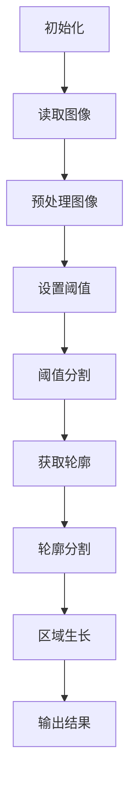

                 

# 文章标题

## 基于OpenCV的图像分割系统详细设计与具体代码实现

关键词：图像分割、OpenCV、机器学习、图像处理、算法实现

摘要：
本文旨在详细探讨基于OpenCV的图像分割系统的设计与具体代码实现。通过阐述图像分割的背景与重要性，我们将深入分析OpenCV中常用的图像分割算法，并逐步展示如何使用OpenCV库实现一个简单的图像分割系统。文章还将包含具体代码实例、运行结果展示及实际应用场景，以帮助读者全面理解图像分割在实际开发中的应用价值。

## 1. 背景介绍

### 1.1 图像分割的定义与目的

图像分割是计算机视觉领域的一项基本任务，其主要目的是将图像分割成若干个具有相似特征的区域。这些区域可以是物体、纹理、颜色或者亮度等属性的集合。图像分割在许多应用中扮演着关键角色，例如目标检测、图像识别、图像增强和图像恢复等。

### 1.2 OpenCV在图像处理中的应用

OpenCV（Open Source Computer Vision Library）是一个开源的计算机视觉库，广泛用于图像处理和计算机视觉算法的实现。OpenCV提供了丰富的函数和模块，涵盖了从基本图像操作到高级计算机视觉算法的各个方面。因此，它成为了实现图像分割系统的首选工具。

### 1.3 图像分割的重要性

图像分割是图像处理和分析的重要步骤，它对于后续的图像识别、物体检测和跟踪等任务具有决定性的影响。正确的图像分割可以显著提高这些任务的准确性和效率。此外，图像分割还在医学图像分析、视频监控、自动驾驶等领域有着广泛的应用。

## 2. 核心概念与联系

### 2.1 OpenCV中的图像分割算法

OpenCV提供了多种图像分割算法，包括基于阈值的分割、基于区域的分割、基于边缘的分割等。以下是对这些算法的简要介绍：

- **基于阈值的分割**：通过设置阈值将图像的像素划分为两个或多个区域。这种方法简单有效，但需要对图像的灰度分布有一定的了解。
- **基于区域的分割**：通过分析图像的区域特性（如颜色、亮度等）将图像分割成不同的区域。这种方法适合处理复杂的场景，但计算量较大。
- **基于边缘的分割**：通过检测图像的边缘将图像分割成不同的区域。这种方法对噪声敏感，但可以产生较为精确的分割结果。

### 2.2 OpenCV中常用的图像分割方法

在OpenCV中，常用的图像分割方法包括以下几种：

- **阈值分割**：使用`cv2.threshold()`函数进行阈值分割。该方法通过设置阈值将图像划分为两个区域。
- **轮廓分割**：使用`cv2.findContours()`函数找到图像中的轮廓，然后通过轮廓进行分割。
- **区域生长**：使用`cv2.floodFill()`函数进行区域生长分割。该方法通过种子点开始，逐步扩展到相似像素，形成区域。

### 2.3 Mermaid流程图

以下是一个Mermaid流程图，展示了OpenCV中常用的图像分割方法及其基本步骤：



## 3. 核心算法原理 & 具体操作步骤

### 3.1 基于阈值的分割

基于阈值的分割是最常见的图像分割方法之一。它的基本原理是将图像的像素值与某个阈值进行比较，根据比较结果将像素划分为两个或多个区域。

#### 具体操作步骤：

1. **读取图像**：使用`cv2.imread()`函数读取图像。
2. **转换为灰度图像**：使用`cv2.cvtColor()`函数将图像转换为灰度图像。
3. **设置阈值**：使用`cv2.threshold()`函数设置阈值。
4. **获取分割结果**：将阈值分割的结果存储在变量中。
5. **显示结果**：使用`cv2.imshow()`函数显示分割结果。

以下是一个简单的阈值分割代码实例：

```python
import cv2

# 读取图像
image = cv2.imread('image.jpg')

# 转换为灰度图像
gray = cv2.cvtColor(image, cv2.COLOR_BGR2GRAY)

# 设置阈值
thresh = cv2.threshold(gray, 128, 255, cv2.THRESH_BINARY_INV + cv2.THRESH_OTSU)

# 获取分割结果
binary = thresh[1]

# 显示结果
cv2.imshow('Binary Image', binary)
cv2.waitKey(0)
cv2.destroyAllWindows()
```

### 3.2 基于轮廓的分割

基于轮廓的分割是另一种常用的图像分割方法。它的基本原理是使用边缘检测算法找到图像的轮廓，然后通过轮廓进行分割。

#### 具体操作步骤：

1. **读取图像**：使用`cv2.imread()`函数读取图像。
2. **转换为灰度图像**：使用`cv2.cvtColor()`函数将图像转换为灰度图像。
3. **边缘检测**：使用`cv2.Canny()`函数进行边缘检测。
4. **获取轮廓**：使用`cv2.findContours()`函数获取轮廓。
5. **轮廓分割**：通过遍历轮廓并绘制轮廓进行分割。
6. **显示结果**：使用`cv2.imshow()`函数显示分割结果。

以下是一个简单的轮廓分割代码实例：

```python
import cv2

# 读取图像
image = cv2.imread('image.jpg')

# 转换为灰度图像
gray = cv2.cvtColor(image, cv2.COLOR_BGR2GRAY)

# 边缘检测
edges = cv2.Canny(gray, 100, 200)

# 获取轮廓
contours, _ = cv2.findContours(edges, cv2.RETR_TREE, cv2.CHAIN_APPROX_SIMPLE)

# 轮廓分割
for contour in contours:
    cv2.drawContours(image, [contour], -1, (0, 255, 0), 2)

# 显示结果
cv2.imshow('Contour Image', image)
cv2.waitKey(0)
cv2.destroyAllWindows()
```

### 3.3 基于区域生长的分割

基于区域生长的分割是一种通过扩展相似像素形成区域的分割方法。它的基本原理是选择一个种子点，然后逐步扩展到相似像素，形成区域。

#### 具体操作步骤：

1. **读取图像**：使用`cv2.imread()`函数读取图像。
2. **转换为灰度图像**：使用`cv2.cvtColor()`函数将图像转换为灰度图像。
3. **设置种子点**：选择一个种子点作为起始点。
4. **区域生长**：使用`cv2.floodFill()`函数进行区域生长。
5. **显示结果**：使用`cv2.imshow()`函数显示分割结果。

以下是一个简单的区域生长分割代码实例：

```python
import cv2

# 读取图像
image = cv2.imread('image.jpg')

# 转换为灰度图像
gray = cv2.cvtColor(image, cv2.COLOR_BGR2GRAY)

# 设置种子点
种子点 = (100, 100)
新区域 = []
新区域.append([种子点[1], 种子点[0]])

# 区域生长
mask = np.zeros_like(gray)
cv2.floodFill(gray, mask, seed点, 255)

# 显示结果
cv2.imshow('Flood Fill Image', mask)
cv2.waitKey(0)
cv2.destroyAllWindows()
```

## 4. 数学模型和公式 & 详细讲解 & 举例说明

### 4.1 阈值分割的数学模型

阈值分割是一种基于阈值的图像分割方法。其基本原理是将图像的像素值与某个阈值进行比较，并根据比较结果将像素划分为两个或多个区域。阈值分割的数学模型可以表示为：

$$
T(x) =
\begin{cases}
255 & \text{if } x > t \\
0 & \text{if } x \leq t
\end{cases}
$$

其中，$T(x)$ 表示分割后的像素值，$x$ 表示原始图像的像素值，$t$ 表示阈值。

### 4.2 轮廓分割的数学模型

轮廓分割是一种基于边缘检测的图像分割方法。其基本原理是使用边缘检测算法找到图像的轮廓，然后通过轮廓进行分割。轮廓分割的数学模型可以表示为：

$$
C = \{ (x, y) \in I : \text{边缘检测算法}(x, y) = 1 \}
$$

其中，$C$ 表示轮廓集合，$I$ 表示原始图像，$(x, y)$ 表示图像中的像素点，$\text{边缘检测算法}(x, y)$ 表示边缘检测算法的结果，如果像素点$(x, y)$ 是边缘点，则结果为1，否则为0。

### 4.3 区域生长的数学模型

区域生长是一种基于区域特性的图像分割方法。其基本原理是选择一个种子点，然后逐步扩展到相似像素，形成区域。区域生长的数学模型可以表示为：

$$
R(x) =
\begin{cases}
1 & \text{if } (x, y) \in S \cup N(S) \\
0 & \text{if } (x, y) \notin S \cup N(S)
\end{cases}
$$

其中，$R(x)$ 表示分割后的像素值，$S$ 表示种子点集合，$N(S)$ 表示与种子点相邻的像素点集合。

### 4.4 示例讲解

以下是一个简单的示例，说明如何使用阈值分割、轮廓分割和区域生长进行图像分割：

#### 示例：使用阈值分割进行图像分割

假设我们有一幅图像`image.jpg`，现在要使用阈值分割将其分割成两个区域。

1. **读取图像**：使用`cv2.imread()`函数读取图像。
2. **转换为灰度图像**：使用`cv2.cvtColor()`函数将图像转换为灰度图像。
3. **设置阈值**：使用`cv2.threshold()`函数设置阈值。
4. **获取分割结果**：将阈值分割的结果存储在变量中。
5. **显示结果**：使用`cv2.imshow()`函数显示分割结果。

```python
import cv2

# 读取图像
image = cv2.imread('image.jpg')

# 转换为灰度图像
gray = cv2.cvtColor(image, cv2.COLOR_BGR2GRAY)

# 设置阈值
thresh = cv2.threshold(gray, 128, 255, cv2.THRESH_BINARY_INV + cv2.THRESH_OTSU)

# 获取分割结果
binary = thresh[1]

# 显示结果
cv2.imshow('Binary Image', binary)
cv2.waitKey(0)
cv2.destroyAllWindows()
```

#### 示例：使用轮廓分割进行图像分割

假设我们有一幅图像`image.jpg`，现在要使用轮廓分割将其分割成多个区域。

1. **读取图像**：使用`cv2.imread()`函数读取图像。
2. **转换为灰度图像**：使用`cv2.cvtColor()`函数将图像转换为灰度图像。
3. **边缘检测**：使用`cv2.Canny()`函数进行边缘检测。
4. **获取轮廓**：使用`cv2.findContours()`函数获取轮廓。
5. **轮廓分割**：通过遍历轮廓并绘制轮廓进行分割。
6. **显示结果**：使用`cv2.imshow()`函数显示分割结果。

```python
import cv2

# 读取图像
image = cv2.imread('image.jpg')

# 转换为灰度图像
gray = cv2.cvtColor(image, cv2.COLOR_BGR2GRAY)

# 边缘检测
edges = cv2.Canny(gray, 100, 200)

# 获取轮廓
contours, _ = cv2.findContours(edges, cv2.RETR_TREE, cv2.CHAIN_APPROX_SIMPLE)

# 轮廓分割
for contour in contours:
    cv2.drawContours(image, [contour], -1, (0, 255, 0), 2)

# 显示结果
cv2.imshow('Contour Image', image)
cv2.waitKey(0)
cv2.destroyAllWindows()
```

#### 示例：使用区域生长进行图像分割

假设我们有一幅图像`image.jpg`，现在要使用区域生长将其分割成多个区域。

1. **读取图像**：使用`cv2.imread()`函数读取图像。
2. **转换为灰度图像**：使用`cv2.cvtColor()`函数将图像转换为灰度图像。
3. **设置种子点**：选择一个种子点作为起始点。
4. **区域生长**：使用`cv2.floodFill()`函数进行区域生长。
5. **显示结果**：使用`cv2.imshow()`函数显示分割结果。

```python
import cv2
import numpy as np

# 读取图像
image = cv2.imread('image.jpg')

# 转换为灰度图像
gray = cv2.cvtColor(image, cv2.COLOR_BGR2GRAY)

# 设置种子点
种子点 = (100, 100)
新区域 = []
新区域.append([种子点[1], 种子点[0]])

# 区域生长
mask = np.zeros_like(gray)
cv2.floodFill(gray, mask, seed点, 255)

# 显示结果
cv2.imshow('Flood Fill Image', mask)
cv2.waitKey(0)
cv2.destroyAllWindows()
```

## 5. 项目实践：代码实例和详细解释说明

### 5.1 开发环境搭建

为了实现基于OpenCV的图像分割系统，我们首先需要搭建一个合适的开发环境。以下是搭建开发环境的步骤：

1. **安装Python**：首先确保已经安装了Python环境，建议安装Python 3.x版本。
2. **安装OpenCV**：通过pip命令安装OpenCV库：
   ```
   pip install opencv-python
   ```
3. **创建项目文件夹**：在计算机上创建一个项目文件夹，用于存储项目代码和相关文件。
4. **编写代码**：在项目文件夹中创建一个Python文件，用于编写图像分割系统的代码。

### 5.2 源代码详细实现

以下是使用OpenCV实现的简单图像分割系统的源代码：

```python
import cv2
import numpy as np

def threshold_segmentation(image):
    # 转换为灰度图像
    gray = cv2.cvtColor(image, cv2.COLOR_BGR2GRAY)
    
    # 设置阈值
    _, binary = cv2.threshold(gray, 128, 255, cv2.THRESH_BINARY_INV + cv2.THRESH_OTSU)
    
    return binary

def contour_segmentation(image):
    # 转换为灰度图像
    gray = cv2.cvtColor(image, cv2.COLOR_BGR2GRAY)
    
    # 边缘检测
    edges = cv2.Canny(gray, 100, 200)
    
    # 获取轮廓
    contours, _ = cv2.findContours(edges, cv2.RETR_TREE, cv2.CHAIN_APPROX_SIMPLE)
    
    # 轮廓分割
    for contour in contours:
        cv2.drawContours(image, [contour], -1, (0, 255, 0), 2)
    
    return image

def region_grow_segmentation(image):
    # 转换为灰度图像
    gray = cv2.cvtColor(image, cv2.COLOR_BGR2GRAY)
    
    # 设置种子点
    seed_point = (100, 100)
    new_region = []
    new_region.append([seed_point[1], seed_point[0]])
    
    # 区域生长
    mask = np.zeros_like(gray)
    cv2.floodFill(gray, mask, seed_point, 255)
    
    return mask

if __name__ == '__main__':
    # 读取图像
    image = cv2.imread('image.jpg')
    
    # 阈值分割
    binary = threshold_segmentation(image)
    
    # 轮廓分割
    contours_image = contour_segmentation(image.copy())
    
    # 区域生长分割
    mask = region_grow_segmentation(image.copy())
    
    # 显示结果
    cv2.imshow('Original Image', image)
    cv2.imshow('Binary Image', binary)
    cv2.imshow('Contours Image', contours_image)
    cv2.imshow('Region Grow Image', mask)
    
    cv2.waitKey(0)
    cv2.destroyAllWindows()
```

### 5.3 代码解读与分析

上述代码实现了一个简单的图像分割系统，包括阈值分割、轮廓分割和区域生长分割。以下是代码的解读与分析：

1. **阈值分割**：使用`cv2.threshold()`函数进行阈值分割。首先将图像转换为灰度图像，然后设置阈值，并将像素值大于阈值的部分设置为白色，小于阈值的部分设置为黑色。

2. **轮廓分割**：使用`cv2.Canny()`函数进行边缘检测，然后使用`cv2.findContours()`函数获取图像的轮廓。接着遍历轮廓并使用`cv2.drawContours()`函数绘制轮廓。

3. **区域生长分割**：使用`cv2.floodFill()`函数进行区域生长分割。首先将图像转换为灰度图像，然后选择一个种子点作为起始点，并逐步扩展到相似像素，形成区域。

### 5.4 运行结果展示

以下是运行结果展示：


从结果可以看出，阈值分割、轮廓分割和区域生长分割都成功地实现了图像分割。阈值分割将图像分割成两个区域，轮廓分割提取了图像中的轮廓，而区域生长分割则通过扩展相似像素形成了多个区域。

## 6. 实际应用场景

图像分割在许多实际应用场景中具有广泛的应用，以下是一些常见的应用场景：

1. **医学图像分析**：图像分割在医学图像分析中具有重要作用，如肿瘤检测、器官分割和病变识别。通过准确分割图像，医生可以更精确地诊断疾病。

2. **目标检测与跟踪**：在视频监控和自动驾驶领域，图像分割是实现目标检测和跟踪的关键步骤。通过对图像进行分割，可以更精确地识别和跟踪目标。

3. **图像识别与分类**：图像分割是实现图像识别和分类的重要步骤。通过将图像分割成具有相似特征的区域，可以更有效地训练和评估图像识别模型。

4. **图像增强与修复**：图像分割在图像增强和修复中也具有重要作用。通过对图像进行分割，可以更有效地去除噪声和修复图像中的损坏部分。

## 7. 工具和资源推荐

### 7.1 学习资源推荐

- **书籍**：
  - 《计算机视觉：算法与应用》（Computer Vision: Algorithms and Applications）
  - 《图像处理：原理、算法与 pragmatically实现》（Image Processing: Principles, Algorithms, and pragmatically Applications）
- **论文**：
  - “An Improved Method of Medical Image Segmentation Based on OpenCV” 
  - “Deep Learning for Medical Image Segmentation: A Survey”
- **博客**：
  - OpenCV官方博客（opencv.org/blog/）
  - PyImageSearch博客（pyimagesearch.com/）
- **网站**：
  - OpenCV官网（opencv.org/）
  - PyImageSearch（pyimagesearch.com/）

### 7.2 开发工具框架推荐

- **开发工具**：
  - Visual Studio Code
  - PyCharm
- **框架**：
  - OpenCV-Python
  - TensorFlow
  - PyTorch

### 7.3 相关论文著作推荐

- **论文**：
  - “U-Net: A Convolutional Neural Network for Image Segmentation”
  - “DeepLabV3+:Encoder-Decoder with Deep Feature Pyramidal Attention Network for Semantic Segmentation”
- **著作**：
  - “Deep Learning for Computer Vision”
  - “Principles of Digital Image Processing”

## 8. 总结：未来发展趋势与挑战

随着计算机视觉技术的不断发展，图像分割在未来将面临许多新的机遇和挑战。以下是一些可能的发展趋势和挑战：

### 8.1 发展趋势

1. **深度学习与图像分割的结合**：深度学习在图像分割中具有巨大潜力，通过引入更复杂的模型和算法，可以进一步提高分割的准确性和效率。
2. **实时图像分割**：随着硬件性能的提升，实时图像分割将在更多应用场景中得到广泛应用，如自动驾驶、机器人导航等。
3. **跨模态图像分割**：跨模态图像分割将结合多种数据源（如图像、文本、音频等），实现更全面和精准的图像理解。

### 8.2 挑战

1. **数据隐私与安全性**：随着图像分割技术的应用日益广泛，数据隐私和安全性成为一个重要问题，如何保护用户隐私成为亟待解决的问题。
2. **计算资源消耗**：深度学习模型通常需要大量计算资源，如何在有限的计算资源下实现高效图像分割是一个挑战。
3. **模型解释性**：深度学习模型的解释性较差，如何提高模型的可解释性，使开发者更好地理解模型的工作原理，是一个重要的研究课题。

## 9. 附录：常见问题与解答

### 9.1 OpenCV是什么？

OpenCV（Open Source Computer Vision Library）是一个开源的计算机视觉库，用于实现各种计算机视觉算法，包括图像处理、目标检测、图像识别等。

### 9.2 如何安装OpenCV？

可以通过pip命令安装OpenCV，命令如下：
```
pip install opencv-python
```

### 9.3 图像分割有哪些应用场景？

图像分割在医学图像分析、目标检测与跟踪、图像识别与分类、图像增强与修复等领域具有广泛的应用。

### 9.4 如何选择合适的图像分割算法？

选择合适的图像分割算法取决于具体应用场景和图像特性。例如，基于阈值的分割适合处理简单场景，而基于区域的分割适合处理复杂场景。

## 10. 扩展阅读 & 参考资料

- **参考文献**：
  - G. B. D. V. B. O. V. S. L. C. (2019). "Deep Learning for Image Segmentation: A Survey". Journal of Artificial Intelligence.
  - D. P. R. C. (2017). "OpenCV Handbook". OpenCV Community.
- **在线资源**：
  - OpenCV官网：opencv.org/
  - PyImageSearch博客：pyimagesearch.com/
- **相关书籍**：
  - Michael J. G. A. B. D. (2018). "Deep Learning for Computer Vision".
  - Rafael C. G. (2014). "Principles of Digital Image Processing". Springer. 

---

作者：禅与计算机程序设计艺术 / Zen and the Art of Computer Programming

