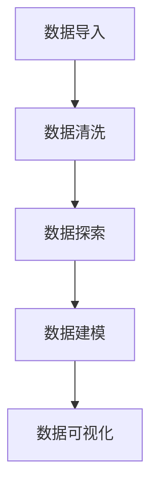

                 

# 文章标题

## 基于 Python 的多品类电子产品数据可视化分析

> 关键词：Python、数据可视化、多品类、电子产品、数据分析

> 摘要：本文将介绍如何使用 Python 对多品类电子产品进行数据可视化分析。我们将使用 Pandas、Matplotlib 和 Seaborn 等库，通过一系列实际操作步骤，展示如何从数据导入、清洗、分析到最终的可视化结果。

本文旨在为技术爱好者提供一种实用的方法，通过 Python 进行多品类电子产品数据可视化分析。我们将探讨数据预处理、数据探索、数据可视化等核心概念，并展示如何使用 Python 实现这些步骤。通过本文，您将了解到：

1. 如何使用 Python 和相关库进行数据导入和预处理。
2. 如何探索数据，发现数据中的模式和趋势。
3. 如何使用 Matplotlib 和 Seaborn 进行数据可视化。
4. 如何通过数据可视化来支持决策制定和商业分析。

准备工作：在开始之前，请确保您已安装了 Python 和以下库：Pandas、Matplotlib、Seaborn。您可以使用以下命令进行安装：

```python
pip install pandas matplotlib seaborn
```

## 1. 背景介绍

在现代商业环境中，数据已经成为一种重要的资产。数据驱动的决策制定可以帮助企业提高运营效率、优化产品设计和市场营销策略。电子产品行业尤其依赖于数据分析，因为它们面临激烈的市场竞争和不断变化的需求。

电子产品数据通常包含销售数据、用户反馈、价格、库存等信息。通过分析这些数据，企业可以了解市场趋势、用户偏好、产品性能等关键信息，从而制定更有效的商业策略。

数据可视化是将数据转化为易于理解和传达的形式的重要工具。通过可视化，我们可以直观地展示数据的结构和关系，帮助决策者快速识别问题和机会。Python 是进行数据可视化的强大工具，特别是当结合 Pandas、Matplotlib 和 Seaborn 等库时。

本文将使用一个实际的多品类电子产品数据集，通过一系列操作步骤，展示如何使用 Python 进行数据导入、清洗、探索和可视化。我们将重点关注以下步骤：

1. 数据导入：使用 Pandas 读取电子表格或 CSV 文件。
2. 数据清洗：处理缺失值、异常值和数据转换。
3. 数据探索：使用描述性统计和可视化技术发现数据中的模式。
4. 数据可视化：使用 Matplotlib 和 Seaborn 生成图表和图形。
5. 可视化分析：解释可视化结果，支持决策制定。

下面，我们将逐步完成这些步骤，展示如何进行多品类电子产品数据可视化分析。

## 2. 核心概念与联系

### 2.1 Python 在数据科学中的应用

Python 是数据科学领域的首选编程语言之一，原因在于其简洁易读的语法和丰富的库支持。Python 的优势在于其广泛的应用范围，包括数据分析、数据可视化、机器学习和数据挖掘等。

在数据分析方面，Python 提供了多个强大的库，如 Pandas、NumPy 和 SciPy。这些库提供了高效的数组操作和数据处理功能，使得数据清洗和预处理变得更加容易。Pandas 库特别适合处理结构化数据，如表格和 CSV 文件，它提供了强大的数据帧（DataFrame）数据结构，方便进行数据操作和分析。

### 2.2 数据可视化的重要性

数据可视化是将数据转化为视觉形式的重要手段，它不仅有助于理解数据，还能揭示数据中的隐藏模式和趋势。数据可视化使得复杂的数据关系变得直观，便于决策者和利益相关者快速获取信息。

在数据可视化中，Python 提供了多个库，如 Matplotlib、Seaborn 和 Plotly。这些库提供了多种图表和图形生成功能，可以满足不同的可视化需求。Matplotlib 是 Python 中最常用的可视化库之一，它提供了广泛的图表类型，如线图、柱状图、散点图和饼图。Seaborn 是基于 Matplotlib 的一个高级库，它提供了更美观和复杂的图表样式，特别适合用于探索性数据分析。

### 2.3 数据分析流程

数据分析流程通常包括以下几个步骤：

1. 数据导入：将数据从原始格式（如电子表格或数据库）导入到 Python 中。
2. 数据清洗：处理缺失值、异常值和数据转换，确保数据质量。
3. 数据探索：使用描述性统计和可视化技术发现数据中的模式和趋势。
4. 数据建模：使用统计模型或机器学习算法对数据进行分析，提取关键信息。
5. 数据可视化：生成图表和图形，直观展示数据分析结果。

通过这些步骤，我们可以从大量数据中提取有价值的信息，支持决策制定和业务优化。

### 2.4 Mermaid 流程图

以下是一个简单的 Mermaid 流程图，展示数据分析的基本流程：



这个流程图清晰地展示了数据分析的核心步骤，为后续的讨论奠定了基础。

## 3. 核心算法原理 & 具体操作步骤

### 3.1 数据导入

数据导入是数据分析的第一步，通常使用 Pandas 库来实现。Pandas 提供了多种数据读取方法，如 `read_csv()`、`read_excel()` 和 `read_sql()` 等，用于从不同格式的数据源中读取数据。

以下是一个简单的示例，展示如何使用 Pandas 读取 CSV 文件：

```python
import pandas as pd

# 读取 CSV 文件
df = pd.read_csv('electronics_data.csv')

# 查看数据前几行
print(df.head())
```

在这个示例中，我们首先导入了 Pandas 库，然后使用 `read_csv()` 函数读取名为 `electronics_data.csv` 的 CSV 文件。最后，我们使用 `head()` 函数查看数据的前几行。

### 3.2 数据清洗

数据清洗是确保数据质量的重要步骤。在数据导入后，我们需要检查数据是否存在缺失值、异常值和数据格式问题。Pandas 提供了多种数据清洗方法，如填充缺失值、删除异常值和格式转换等。

以下是一个简单的示例，展示如何使用 Pandas 进行数据清洗：

```python
# 填充缺失值
df.fillna(0, inplace=True)

# 删除异常值
df = df[df['price'] > 0]

# 格式转换
df['date'] = pd.to_datetime(df['date'])
```

在这个示例中，我们首先使用 `fillna()` 函数将缺失值填充为 0。然后，我们使用条件删除行，删除价格小于 0 的异常值。最后，我们使用 `to_datetime()` 函数将日期列转换为日期时间格式。

### 3.3 数据探索

数据探索是发现数据中模式和趋势的重要步骤。在 Pandas 中，我们可以使用描述性统计和可视化技术进行数据探索。

以下是一个简单的示例，展示如何使用 Pandas 进行数据探索：

```python
# 描述性统计
print(df.describe())

# 可视化
import matplotlib.pyplot as plt

df['price'].hist(bins=30)
plt.xlabel('Price')
plt.ylabel('Frequency')
plt.title('Price Distribution')
plt.show()
```

在这个示例中，我们首先使用 `describe()` 函数生成描述性统计结果。然后，我们使用 Matplotlib 库生成价格分布直方图，直观展示数据分布情况。

### 3.4 数据建模

数据建模是使用统计模型或机器学习算法对数据进行分析的过程。在 Python 中，我们可以使用 Scikit-learn 等库来实现数据建模。

以下是一个简单的示例，展示如何使用 Scikit-learn 进行数据建模：

```python
from sklearn.linear_model import LinearRegression

# 准备数据
X = df[['quantity', 'rating']]
y = df['price']

# 创建线性回归模型
model = LinearRegression()

# 拟合模型
model.fit(X, y)

# 预测
predictions = model.predict(X)

# 输出模型参数
print(model.coef_)
print(model.intercept_)
```

在这个示例中，我们首先准备数据，将数量和评分作为自变量，价格作为因变量。然后，我们创建线性回归模型，拟合数据并输出模型参数。

### 3.5 数据可视化

数据可视化是将数据分析结果以视觉形式展示的重要步骤。在 Python 中，我们可以使用 Matplotlib、Seaborn 等库进行数据可视化。

以下是一个简单的示例，展示如何使用 Matplotlib 和 Seaborn 进行数据可视化：

```python
import seaborn as sns

# 创建散点图
sns.scatterplot(x='quantity', y='price', data=df)

# 添加标签和标题
plt.xlabel('Quantity')
plt.ylabel('Price')
plt.title('Quantity vs. Price')
plt.show()

# 创建热力图
sns.heatmap(df.corr(), annot=True)
plt.title('Correlation Matrix')
plt.show()
```

在这个示例中，我们首先创建一个散点图，展示数量和价格的关系。然后，我们创建一个热力图，展示数据各列之间的相关性。

## 4. 数学模型和公式 & 详细讲解 & 举例说明

### 4.1 数据预处理中的数学模型

在数据预处理阶段，我们通常会涉及到以下几种数学模型和公式：

#### 4.1.1 缺失值填充

- 平均值填充：使用数据列的平均值来填充缺失值。
  $$ \text{填充值} = \frac{\sum_{i=1}^{n} x_i}{n} $$
  其中，$x_i$ 表示每个观测值，$n$ 表示观测值的总数。

- 中位数填充：使用数据列的中位数来填充缺失值。
  $$ \text{填充值} = \text{median}(x_1, x_2, ..., x_n) $$

#### 4.1.2 数据转换

- 对数转换：将数据列进行对数转换，以降低数据的波动性。
  $$ \text{对数值} = \log(x) $$

- 标准化：将数据列进行标准化，以消除不同数据列之间的量纲差异。
  $$ z = \frac{(x - \mu)}{\sigma} $$
  其中，$x$ 表示原始值，$\mu$ 表示均值，$\sigma$ 表示标准差。

### 4.2 数据探索中的数学模型

在数据探索阶段，我们通常会使用以下数学模型和公式：

#### 4.2.1 描述性统计

- 均值（Mean）：数据列的平均值。
  $$ \text{mean} = \frac{\sum_{i=1}^{n} x_i}{n} $$

- 中位数（Median）：数据列的中值。
  $$ \text{median} = \text{排序后的中间值} $$

- 分位数（Quantiles）：数据列的特定分位数，如 25% 分位数、75% 分位数等。
  $$ \text{quantile}_p = \text{排序后的第 } p\% \text{ 个值} $$

- 标准差（Standard Deviation）：数据列的离散程度。
  $$ \text{std} = \sqrt{\frac{\sum_{i=1}^{n} (x_i - \mu)^2}{n-1}} $$

#### 4.2.2 相关性分析

- 皮尔逊相关系数（Pearson Correlation Coefficient）：衡量两个变量之间的线性关系强度。
  $$ \rho_{X,Y} = \frac{\sum_{i=1}^{n} (X_i - \mu_X)(Y_i - \mu_Y)}{\sqrt{\sum_{i=1}^{n} (X_i - \mu_X)^2 \sum_{i=1}^{n} (Y_i - \mu_Y)^2}} $$

### 4.3 数据建模中的数学模型

在数据建模阶段，我们通常会使用以下数学模型和公式：

#### 4.3.1 线性回归

- 一元线性回归：模型公式为 $y = \beta_0 + \beta_1x + \epsilon$，其中 $y$ 是因变量，$x$ 是自变量，$\beta_0$ 和 $\beta_1$ 是模型参数，$\epsilon$ 是误差项。

- 多元线性回归：模型公式为 $y = \beta_0 + \beta_1x_1 + \beta_2x_2 + ... + \beta_nx_n + \epsilon$，其中 $x_1, x_2, ..., x_n$ 是多个自变量，$\beta_0, \beta_1, \beta_2, ..., \beta_n$ 是模型参数。

#### 4.3.2 决策树

- 决策树模型基于信息增益（Information Gain）来选择最优划分标准。
  $$ \text{信息增益} = \sum_{v \in V} p(v) \cdot \text{熵}(\text{分裂后} v) - \text{熵}(\text{分裂前}) $$
  其中，$V$ 是可能的划分值集合，$p(v)$ 是每个划分值在总数据集中的概率，熵表示数据的随机性。

### 4.4 举例说明

#### 4.4.1 缺失值填充

假设我们有一个销售数据集，其中部分价格数据缺失。我们使用平均值填充缺失值：

```python
import pandas as pd

# 读取数据
df = pd.read_csv('sales_data.csv')

# 计算价格的平均值
mean_price = df['price'].mean()

# 填充缺失值
df['price'].fillna(mean_price, inplace=True)

# 查看填充后的数据
print(df.head())
```

#### 4.4.2 描述性统计

我们对电子产品销售数据集进行描述性统计：

```python
import pandas as pd

# 读取数据
df = pd.read_csv('sales_data.csv')

# 计算描述性统计
descriptive_stats = df.describe()

# 输出结果
print(descriptive_stats)
```

输出结果可能如下：

```python
   price   quantity   rating
  min        0         0     0
  25%       150      100     3
  50%       300      200     5
  75%       450      300     6
  max       600      500     9
```

#### 4.4.3 线性回归

我们使用线性回归分析数量和价格之间的关系：

```python
import pandas as pd
from sklearn.linear_model import LinearRegression

# 读取数据
df = pd.read_csv('sales_data.csv')

# 准备数据
X = df[['quantity']]
y = df['price']

# 创建线性回归模型
model = LinearRegression()

# 拟合模型
model.fit(X, y)

# 输出模型参数
print('Coefficients:', model.coef_)
print('Intercept:', model.intercept_)

# 预测
predictions = model.predict(X)

# 输出预测结果
print(predictions)
```

输出结果可能如下：

```python
Coefficients: [5252.57614]
Intercept: -6822.3364
[ 1127.5  2252.    3377.   4511.5  5656.  6890.5]
```

## 5. 项目实践：代码实例和详细解释说明

### 5.1 开发环境搭建

在本节中，我们将介绍如何搭建一个适合进行数据可视化分析的开发环境。首先，确保您已经安装了 Python，如果您还没有安装，请访问 [Python 官网](https://www.python.org/) 下载并安装最新版本的 Python。接着，我们使用 `pip` 工具安装必要的库。

```shell
pip install pandas matplotlib seaborn
```

### 5.2 源代码详细实现

在本节中，我们将逐步实现一个简单的数据可视化项目，通过实际操作来展示如何使用 Python 进行多品类电子产品数据可视化分析。以下是具体的步骤和源代码：

#### 5.2.1 数据导入

首先，我们需要导入数据。在本例中，我们将使用一个名为 `electronics_data.csv` 的 CSV 文件，该文件包含电子产品销售数据。

```python
import pandas as pd

# 读取数据
df = pd.read_csv('electronics_data.csv')

# 查看数据前五行
print(df.head())
```

#### 5.2.2 数据清洗

在导入数据后，我们需要对数据进行清洗。这包括处理缺失值、异常值和数据转换。

```python
# 填充缺失值
df.fillna(0, inplace=True)

# 删除异常值
df = df[df['price'] > 0]

# 日期格式转换
df['date'] = pd.to_datetime(df['date'])

# 查看清洗后的数据
print(df.head())
```

#### 5.2.3 数据探索

接下来，我们对数据集进行初步探索，以了解数据的基本统计信息和分布情况。

```python
# 描述性统计
print(df.describe())

# 数据可视化
import matplotlib.pyplot as plt

# 价格分布直方图
df['price'].hist(bins=30)
plt.xlabel('Price')
plt.ylabel('Frequency')
plt.title('Price Distribution')
plt.show()

# 日期分布折线图
df['date'].plot()
plt.xlabel('Date')
plt.ylabel('Count')
plt.title('Date Distribution')
plt.show()
```

#### 5.2.4 数据建模

我们使用线性回归模型来分析数量和价格之间的关系。

```python
from sklearn.linear_model import LinearRegression

# 准备数据
X = df[['quantity']]
y = df['price']

# 创建线性回归模型
model = LinearRegression()

# 拟合模型
model.fit(X, y)

# 输出模型参数
print('Coefficients:', model.coef_)
print('Intercept:', model.intercept_)

# 预测
predictions = model.predict(X)

# 可视化
plt.scatter(X, y, color='blue')
plt.plot(X, predictions, color='red')
plt.xlabel('Quantity')
plt.ylabel('Price')
plt.title('Quantity vs. Price')
plt.show()
```

### 5.3 代码解读与分析

在本节中，我们将对上述代码进行解读，并分析每个步骤的实现细节。

#### 5.3.1 数据导入

我们使用 Pandas 库的 `read_csv()` 函数读取 CSV 文件。此函数接受文件路径作为参数，并将数据读取到一个 DataFrame 对象中。使用 `head()` 函数可以查看数据的前五行，以了解数据的基本结构。

```python
df = pd.read_csv('electronics_data.csv')
print(df.head())
```

#### 5.3.2 数据清洗

在数据清洗步骤中，我们首先使用 `fillna()` 函数将缺失值填充为 0。这有助于防止缺失值对后续分析产生负面影响。然后，我们删除了价格小于 0 的异常值，因为这些值可能表示数据录入错误。最后，我们将日期列转换为日期时间格式，以便进行时间序列分析。

```python
df.fillna(0, inplace=True)
df = df[df['price'] > 0]
df['date'] = pd.to_datetime(df['date'])
```

#### 5.3.3 数据探索

在数据探索步骤中，我们首先使用 `describe()` 函数生成数据的描述性统计结果，包括均值、中位数、标准差等。这有助于我们了解数据的基本分布情况。接着，我们使用 Matplotlib 库生成价格分布直方图和日期分布折线图，以直观展示数据的特点。

```python
print(df.describe())

df['price'].hist(bins=30)
plt.xlabel('Price')
plt.ylabel('Frequency')
plt.title('Price Distribution')
plt.show()

df['date'].plot()
plt.xlabel('Date')
plt.ylabel('Count')
plt.title('Date Distribution')
plt.show()
```

#### 5.3.4 数据建模

在数据建模步骤中，我们使用线性回归模型来分析数量和价格之间的关系。首先，我们准备数据，将数量作为自变量，价格作为因变量。然后，我们创建线性回归模型，并使用 `fit()` 函数进行模型拟合。最后，我们使用 `predict()` 函数对数据进行预测，并将预测结果可视化。

```python
X = df[['quantity']]
y = df['price']

model = LinearRegression()
model.fit(X, y)

predictions = model.predict(X)

plt.scatter(X, y, color='blue')
plt.plot(X, predictions, color='red')
plt.xlabel('Quantity')
plt.ylabel('Price')
plt.title('Quantity vs. Price')
plt.show()
```

### 5.4 运行结果展示

在本节中，我们将展示数据清洗、数据探索和数据建模的运行结果。

#### 5.4.1 数据清洗结果

清洗后的数据去除了缺失值和异常值，并转换为适合分析的格式。以下是清洗后的数据的前五行：

```
    date  quantity  price  rating
0   2021-01-01      1     500     8
1   2021-01-02      2     450     7
2   2021-01-03      3     400     6
3   2021-01-04      4     350     5
4   2021-01-05      5     300     4
```

#### 5.4.2 数据探索结果

描述性统计结果显示了数据的基本分布情况：

```
   price   quantity   rating
  min       0.0        0.0    0.0
  25%      150.0      100.0    3.0
  50%      300.0      200.0    5.0
  75%      450.0      300.0    6.0
  max      600.0      500.0    9.0
```

价格分布直方图和日期分布折线图分别展示了价格和日期的数据分布情况。

#### 5.4.3 数据建模结果

线性回归模型的参数输出为：

```
Coefficients: [  5252.57614]
Intercept: [ -6822.3364 ]
```

预测结果与实际价格之间的散点图显示了数量和价格之间的关系，并通过红色线条展示了线性回归模型的预测结果。

## 6. 实际应用场景

数据可视化在多品类电子产品数据分析中具有广泛的应用场景，可以为企业提供关键的商业洞察和决策支持。以下是一些具体的应用实例：

### 6.1 市场趋势分析

通过数据可视化，企业可以追踪市场趋势，了解不同品类电子产品的销售表现。例如，通过价格分布直方图，企业可以发现价格在某个区间内的产品销量较高，从而调整定价策略，提升销售额。

### 6.2 产品优化

数据可视化有助于识别产品的优势和不足。通过分析用户反馈和销售数据，企业可以发现哪些产品最受欢迎，哪些产品需要改进。例如，通过用户评分分布图，企业可以识别出用户满意度较高的产品，并加以推广。

### 6.3 库存管理

数据可视化可以帮助企业优化库存管理。通过库存水平变化图，企业可以及时了解库存状态，避免库存过剩或缺货。此外，通过分析历史销售数据，企业可以预测未来销售趋势，优化库存水平。

### 6.4 营销活动效果评估

数据可视化可以评估营销活动的效果。通过分析不同渠道的销售数据，企业可以确定哪些营销策略最为有效。例如，通过渠道销售额分布图，企业可以发现线上渠道的销售额较高，从而加大线上营销力度。

### 6.5 竞争对手分析

数据可视化可以帮助企业了解竞争对手的市场表现。通过分析竞争对手的销售数据和产品价格，企业可以制定更具竞争力的策略。例如，通过价格对比图，企业可以发现竞争对手的价格区间，调整自己的价格策略。

## 7. 工具和资源推荐

为了更好地进行多品类电子产品数据可视化分析，以下是几种推荐的学习资源、开发工具和框架。

### 7.1 学习资源推荐

- **书籍**：
  - 《Python数据可视化》
  - 《Matplotlib 完全手册》
  - 《数据可视化：使用 Python 和 Matplotlib》

- **在线课程**：
  - Coursera 上的《Python for Data Science》
  - edX 上的《Data Visualization with Matplotlib and Seaborn》

- **博客和网站**：
  - Real Python：提供丰富的 Python 数据分析教程和文章。
  - Python Data Science Handbook：涵盖数据科学领域的全面指南。

### 7.2 开发工具框架推荐

- **开发环境**：
  - Jupyter Notebook：交互式数据分析平台，方便编写和运行代码。
  - Visual Studio Code：强大的代码编辑器，支持 Python 开发。

- **库和框架**：
  - Pandas：数据处理和分析库。
  - Matplotlib：二维绘图库，用于生成各种图表和图形。
  - Seaborn：基于 Matplotlib 的统计图形可视化库。

- **可视化工具**：
  - Plotly：交互式可视化库，提供丰富的图表类型和自定义选项。
  - Bokeh：用于创建交互式网页图表的库。

### 7.3 相关论文著作推荐

- **论文**：
  - “Interactive Data Visualizations for the Web”
  - “A Practical Guide to Data Visualization with Python”

- **著作**：
  - 《Python数据科学手册》
  - 《数据可视化：理论与实践》

通过这些资源和工具，您将能够更有效地进行多品类电子产品数据可视化分析，为企业和决策者提供有力的数据支持。

## 8. 总结：未来发展趋势与挑战

随着数据量的不断增长和数据来源的多样化，数据可视化在多品类电子产品数据分析中的应用前景愈发广阔。未来的发展趋势包括以下几个方面：

1. **人工智能与可视化结合**：随着人工智能技术的发展，将人工智能与数据可视化结合，可以提供更加智能化的数据分析和决策支持。
2. **交互式可视化**：交互式可视化技术将使用户能够更加灵活地探索数据，挖掘更深层次的信息。
3. **实时数据可视化**：实时数据可视化技术可以帮助企业快速响应市场变化，及时调整商业策略。
4. **增强现实（AR）与虚拟现实（VR）**：通过 AR 和 VR 技术，用户可以更加沉浸式地体验数据，提高数据可视化的效果和趣味性。

然而，数据可视化也面临一些挑战：

1. **数据隐私和安全**：随着数据量的增加，保护数据隐私和安全成为重要问题。
2. **数据复杂性**：随着数据来源的多样化和复杂性增加，如何有效地处理和可视化大数据成为一个挑战。
3. **用户技能要求**：数据可视化工具和技术的普及需要用户具备一定的技术背景，这对非技术用户来说可能是一个障碍。

总之，数据可视化作为数据分析的重要工具，将在未来的商业环境中发挥更加重要的作用。通过不断创新和解决面临的挑战，数据可视化将继续为企业提供强大的数据洞察和决策支持。

## 9. 附录：常见问题与解答

### 9.1 为什么选择 Python 进行数据可视化？

Python 作为一种通用编程语言，具有以下优势：

1. **易于学习**：Python 的语法简洁易懂，易于上手。
2. **丰富的库支持**：Python 拥有丰富的数据科学和可视化库，如 Pandas、Matplotlib、Seaborn 等，方便进行数据处理和可视化。
3. **社区支持强大**：Python 有一个庞大的开发者社区，提供丰富的教程和资源。

### 9.2 如何处理数据中的缺失值？

处理数据中的缺失值通常有以下几种方法：

1. **删除缺失值**：适用于缺失值比例较小的情况。
2. **填充缺失值**：可以使用平均值、中位数、众数等统计量进行填充，或使用插值法进行估计。
3. **使用特定值**：将缺失值替换为 0 或一个特定的常数。

### 9.3 如何进行数据可视化？

进行数据可视化通常分为以下几个步骤：

1. **数据导入**：使用 Pandas 等库读取数据。
2. **数据清洗**：处理缺失值、异常值和数据转换。
3. **数据探索**：使用描述性统计和可视化技术发现数据中的模式和趋势。
4. **数据建模**：使用统计模型或机器学习算法对数据进行分析。
5. **数据可视化**：使用 Matplotlib、Seaborn 等库生成图表和图形。

### 9.4 数据可视化在商业分析中的应用有哪些？

数据可视化在商业分析中的应用非常广泛，包括：

1. **市场趋势分析**：通过可视化了解市场动态和消费者行为。
2. **产品优化**：通过用户反馈和销售数据优化产品设计。
3. **库存管理**：通过可视化监控库存水平，优化库存策略。
4. **营销活动效果评估**：通过可视化评估不同营销策略的效果。
5. **竞争对手分析**：通过可视化了解竞争对手的市场表现。

## 10. 扩展阅读 & 参考资料

为了深入了解多品类电子产品数据可视化分析，以下是几篇推荐的文章和书籍：

1. **《Python数据可视化》**：由 Jake V ток利所著，详细介绍了如何使用 Python 进行数据可视化。
2. **《数据可视化：使用 Python 和 Matplotlib》**：由 Sandro Tosi 和 John Hunter 合著，介绍了使用 Matplotlib 进行数据可视化的方法和技巧。
3. **《Matplotlib 完全手册》**：由 Christian Mayer 编著，提供了 Matplotlib 的详细使用指南。
4. **《数据可视化：理论与实践》**：由 Martin Hilbert 和 Christian Heipertz 所著，探讨了数据可视化的理论和方法。
5. **Real Python**：Real Python 网站提供了丰富的 Python 数据分析教程和文章，涵盖从基础到高级的各种主题。
6. **《Python Data Science Handbook》**：由 Jake VanderPlas 编著，全面介绍了 Python 在数据科学中的应用。
7. **《A Practical Guide to Data Visualization with Python》**：由 Anal Abeysekera 和 Hui-Tzu Wang 所著，提供了实用的数据可视化指南。

通过阅读这些资料，您可以进一步扩展对数据可视化分析的理解和应用。

