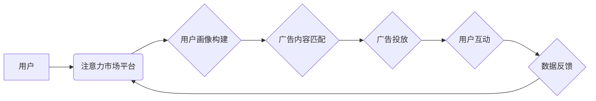

                 

## 注意力市场：元宇宙广告投放的新思路

> 关键词：元宇宙、广告投放、注意力经济、深度学习、个性化推荐、隐私保护、信任机制

## 1. 背景介绍

元宇宙概念的兴起，为广告投放领域带来了前所未有的机遇和挑战。传统广告模式在虚拟世界中面临着诸多难题，例如用户注意力分散、广告拦截率高、精准投放难度大等。而元宇宙的沉浸式体验、交互性强、用户数据丰富等特点，为广告投放提供了全新的可能性。

注意力经济是元宇宙广告投放的核心驱动力。在元宇宙中，用户的时间和注意力是宝贵的资源，广告主需要通过更具吸引力和个性化的方式，赢得用户的注意力。传统的广告模式难以满足这一需求，因此需要探索新的广告投放思路。

## 2. 核心概念与联系

### 2.1 注意力市场

注意力市场是一个虚拟化的平台，通过算法和数据分析，将用户的注意力作为商品进行交易。广告主可以根据用户的兴趣、行为和偏好，购买用户的注意力，从而实现精准投放和效果提升。

### 2.2 元宇宙广告投放

元宇宙广告投放是指在虚拟世界中，利用各种技术手段，向用户展示广告，并引导用户进行互动和消费。元宇宙广告投放的优势在于：

* **沉浸式体验:** 元宇宙的虚拟环境能够提供更沉浸式的体验，广告更容易吸引用户的注意力。
* **交互性强:** 用户可以在元宇宙中与广告进行互动，例如试用产品、参与游戏等，提升广告的参与度和转化率。
* **数据丰富:** 元宇宙平台可以收集用户的行为数据、兴趣偏好等信息，为广告投放提供更精准的依据。

### 2.3  注意力机制

注意力机制是深度学习领域的重要技术，能够帮助模型关注输入数据中最重要的部分，从而提高模型的性能。在元宇宙广告投放中，注意力机制可以用于：

* **用户画像构建:** 通过分析用户的行为数据和兴趣偏好，构建更精准的用户画像。
* **广告内容匹配:** 根据用户的画像，匹配最相关的广告内容，提高广告的点击率和转化率。
* **广告投放优化:** 通过监测广告的曝光率、点击率等指标，动态调整广告投放策略，优化广告效果。

**元宇宙广告投放架构**



## 3. 核心算法原理 & 具体操作步骤

### 3.1  算法原理概述

注意力市场中的广告投放算法主要基于以下几个核心原理：

* **用户画像构建:** 利用深度学习算法，从用户的行为数据、兴趣偏好等信息中，构建用户的个性化画像。
* **注意力预测:** 基于用户的画像和广告内容，预测用户对该广告的注意力水平。
* **广告排序:** 根据注意力预测结果，对广告进行排序，优先展示用户感兴趣的广告。
* **动态调整:**  根据广告的曝光率、点击率等指标，动态调整广告投放策略，优化广告效果。

### 3.2  算法步骤详解

1. **数据收集:** 收集用户的行为数据、兴趣偏好等信息，例如浏览历史、购买记录、社交互动等。
2. **数据预处理:** 对收集到的数据进行清洗、转换和特征提取，以便于算法训练和使用。
3. **用户画像构建:** 利用深度学习算法，例如深度神经网络，从用户的行为数据和兴趣偏好中，构建用户的个性化画像。
4. **注意力预测:** 基于用户的画像和广告内容，利用注意力机制，预测用户对该广告的注意力水平。
5. **广告排序:** 根据注意力预测结果，对广告进行排序，优先展示用户感兴趣的广告。
6. **广告投放:** 将排序后的广告展示给用户，并收集用户的互动数据，例如点击率、停留时间等。
7. **数据反馈:** 将收集到的用户互动数据反馈到算法模型中，用于模型的更新和优化。

### 3.3  算法优缺点

**优点:**

* **精准投放:** 基于用户画像和注意力预测，能够精准投放用户感兴趣的广告。
* **效果提升:** 通过优化广告排序和投放策略，能够提升广告的点击率、转化率等效果。
* **个性化体验:** 为用户提供个性化的广告体验，提升用户满意度。

**缺点:**

* **数据依赖:** 算法的性能依赖于数据的质量和数量。
* **隐私保护:** 用户数据收集和使用需要谨慎处理，以确保用户隐私的保护。
* **算法公平性:** 需要确保算法的公平性，避免出现歧视或偏见。

### 3.4  算法应用领域

注意力市场中的广告投放算法可以应用于各种领域，例如：

* **游戏广告:** 精准投放游戏广告，提高用户转化率。
* **电商广告:** 推广商品，提高销售额。
* **社交媒体广告:** 吸引用户关注，提升品牌知名度。
* **教育广告:** 推广教育资源，提高用户学习效率。

## 4. 数学模型和公式 & 详细讲解 & 举例说明

### 4.1  数学模型构建

注意力市场中的广告投放模型可以构建为一个多目标优化问题，目标函数包括：

* **点击率:**  衡量用户点击广告的概率。
* **转化率:** 衡量用户点击广告后完成目标行为的概率。
* **用户满意度:** 衡量用户对广告体验的满意度。

### 4.2  公式推导过程

点击率和转化率通常可以使用逻辑回归模型进行预测，用户满意度可以使用评分机制进行评估。

**点击率预测公式:**

$$
P(click) = \frac{1}{1 + exp(-(w_0 + w_1 * feature_1 + w_2 * feature_2 + ... + w_n * feature_n))}
$$

其中：

* $P(click)$ 是用户点击广告的概率。
* $w_0, w_1, w_2, ..., w_n$ 是模型参数。
* $feature_1, feature_2, ..., feature_n$ 是用户的特征向量。

**转化率预测公式:**

$$
P(conversion) = \frac{1}{1 + exp(-(w_0 + w_1 * feature_1 + w_2 * feature_2 + ... + w_n * feature_n))}
$$

其中：

* $P(conversion)$ 是用户点击广告后完成目标行为的概率。
* $w_0, w_1, w_2, ..., w_n$ 是模型参数。
* $feature_1, feature_2, ..., feature_n$ 是用户的特征向量。

**用户满意度评分公式:**

$$
Score = \alpha * click_score + \beta * conversion_score + \gamma * engagement_score
$$

其中：

* $Score$ 是用户对广告的满意度评分。
* $click_score$ 是用户点击广告的评分。
* $conversion_score$ 是用户完成目标行为的评分。
* $engagement_score$ 是用户与广告互动程度的评分。
* $\alpha, \beta, \gamma$ 是权重系数。

### 4.3  案例分析与讲解

假设一个电商平台想要在元宇宙中推广一款新产品。

1. **用户画像构建:** 通过分析用户的浏览历史、购买记录等数据，构建用户的兴趣偏好画像。例如，用户 A 经常购买电子产品，用户 B 经常购买服装。
2. **注意力预测:** 根据用户的画像和产品的属性，预测用户对该产品的注意力水平。例如，用户 A 对这款新产品的注意力水平较高，用户 B 的注意力水平较低。
3. **广告排序:** 根据注意力预测结果，将广告排序，优先展示给用户 A。
4. **广告投放:** 将排序后的广告展示给用户 A，并收集用户的互动数据。
5. **数据反馈:** 将收集到的用户互动数据反馈到算法模型中，用于模型的更新和优化。

## 5. 项目实践：代码实例和详细解释说明

### 5.1  开发环境搭建

* Python 3.7+
* TensorFlow 2.0+
* PyTorch 1.0+
* Jupyter Notebook

### 5.2  源代码详细实现

```python
# 用户画像构建
from sklearn.cluster import KMeans

# 训练用户画像模型
kmeans = KMeans(n_clusters=5)
user_features = [[feature1, feature2, feature3], ...]
kmeans.fit(user_features)
user_clusters = kmeans.labels_

# 注意力预测
from tensorflow.keras.models import Sequential
from tensorflow.keras.layers import Dense

# 构建注意力预测模型
model = Sequential()
model.add(Dense(64, activation='relu', input_shape=(user_features.shape[1],)))
model.add(Dense(32, activation='relu'))
model.add(Dense(1, activation='sigmoid'))

# 训练注意力预测模型
model.compile(optimizer='adam', loss='binary_crossentropy', metrics=['accuracy'])
model.fit(user_features, attention_labels, epochs=10)

# 广告排序
def sort_ads(user_features, model):
  # 使用注意力预测模型预测用户对每个广告的注意力水平
  attention_scores = model.predict(user_features)
  # 根据注意力水平排序广告
  sorted_ads = sorted(ads, key=lambda ad: attention_scores[ad], reverse=True)
  return sorted_ads

# 广告投放
# ...

```

### 5.3  代码解读与分析

* 用户画像构建部分使用KMeans算法将用户分成不同的群组，每个群组代表一个用户画像。
* 注意力预测部分使用深度神经网络模型预测用户对广告的注意力水平。
* 广告排序部分使用注意力预测结果对广告进行排序，优先展示用户感兴趣的广告。

### 5.4  运行结果展示

运行代码后，可以得到用户对不同广告的注意力预测结果，以及广告排序后的结果。

## 6. 实际应用场景

### 6.1 元宇宙游戏广告

在元宇宙游戏中，广告可以以更沉浸的方式融入游戏场景，例如虚拟海报、游戏道具广告等。注意力市场可以帮助游戏开发者精准投放广告，提高广告效果。

### 6.2 元宇宙电商广告

在元宇宙电商平台，用户可以虚拟试穿衣服、体验家具等，注意力市场可以帮助电商平台精准推荐用户感兴趣的商品，提高转化率。

### 6.3 元宇宙社交媒体广告

在元宇宙社交平台，用户可以创建虚拟形象、参加虚拟活动等，注意力市场可以帮助品牌精准投放广告，提升品牌知名度和用户互动。

### 6.4  未来应用展望

注意力市场在元宇宙中的应用前景广阔，未来可能发展出以下趋势：

* **更精准的广告投放:** 利用更先进的算法和数据分析技术，实现更精准的广告投放，提高广告效果。
* **更丰富的广告形式:** 开发更具吸引力和互动性的广告形式，例如虚拟体验广告、游戏化广告等。
* **更完善的信任机制:** 建立更完善的信任机制，保障用户隐私和数据安全，提升用户对广告的信任度。

## 7. 工具和资源推荐

### 7.1  学习资源推荐

* **书籍:**
    * 《深度学习》
    * 《机器学习》
    * 《注意力机制》
* **在线课程:**
    * Coursera: 深度学习
    * Udacity: 机器学习工程师
    * edX: 计算机视觉

### 7.2  开发工具推荐

* **Python:** 
    * TensorFlow
    * PyTorch
    * Scikit-learn
* **云平台:**
    * AWS
    * Azure
    * Google Cloud

### 7.3  相关论文推荐

* Attention Is All You Need
* Transformer Networks
* BERT: Pre-training of Deep Bidirectional Transformers for Language Understanding

## 8. 总结：未来发展趋势与挑战

### 8.1  研究成果总结

注意力市场为元宇宙广告投放提供了新的思路和方法，能够实现更精准、更个性化的广告投放，提升广告效果。

### 8.2  未来发展趋势

注意力市场的发展趋势包括：

* **更精准的广告投放:** 利用更先进的算法和数据分析技术，实现更精准的广告投放，提高广告效果。
* **更丰富的广告形式:** 开发更具吸引力和互动性的广告形式，例如虚拟体验广告、游戏化广告等。
* **更完善的信任机制:** 建立更完善的信任机制，保障用户隐私和数据安全，提升用户对广告的信任度。

### 8.3  面临的挑战

注意力市场的发展也面临着一些挑战：

* **数据隐私保护:** 如何保护用户数据隐私，避免数据泄露和滥用。
* **算法公平性:** 如何确保算法的公平性，避免出现歧视或偏见。
* **用户信任度:** 如何提升用户对广告的信任度，避免用户对广告产生抵触情绪。

### 8.4  研究展望

未来，注意力市场的研究方向包括：

* **更有效的注意力预测模型:** 开发更有效的注意力预测模型，提高广告投放的精准度。
* **更个性化的广告体验:** 开发更个性化的广告体验，满足用户的不同需求。
* **更完善的信任机制:** 建立更完善的信任机制，保障用户隐私和数据安全。

## 9. 附录：常见问题与解答

**Q1: 注意力市场如何保障用户隐私？**

A1: 注意力市场需要建立完善的隐私保护机制，例如数据加密、匿名化处理等，确保用户数据的安全和隐私。

**Q2: 注意力市场如何避免算法歧视？**

A2: 注意力市场需要采用公平算法，并定期进行算法评估，确保算法的公平性和公正性。

**Q3: 注意力市场如何提升用户信任度？**

A3: 注意力市场需要透明公开，让用户了解如何使用他们的数据，并提供用户控制权，例如用户可以选择接受或拒绝广告投放。


作者：禅与计算机程序设计艺术 / Zen and the Art of Computer Programming 
<end_of_turn>

