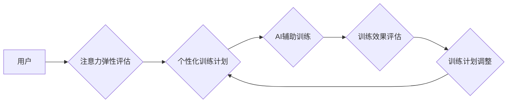

                 

## 注意力弹性健身房教练：AI辅助的认知适应训练师

> 关键词：注意力、认知适应、AI训练、弹性学习、神经网络、深度学习、可解释性

## 1. 背景介绍

在当今信息爆炸的时代，人类的注意力面临着前所未有的挑战。分散的信息流、不断涌现的通知和社交媒体的诱惑，使得我们难以集中精力，专注于重要的事情。这不仅影响了我们的学习效率和工作成果，也损害了我们的心理健康和生活质量。

认知适应训练 (Cognitive Adaptation Training, CAT) 是一种旨在增强注意力、记忆力和执行功能的训练方法。传统的CAT方法通常依赖于人工设计的练习和反馈，但这些方法往往缺乏个性化和灵活性。

近年来，人工智能 (AI) 技术的飞速发展为认知适应训练带来了新的机遇。AI 算法能够根据个人的学习情况动态调整训练难度，提供个性化的反馈和指导，从而提高训练效果。

## 2. 核心概念与联系

**2.1 核心概念**

* **注意力弹性:** 指的是大脑对注意力需求的适应能力，即在面对干扰和挑战时，能够灵活调整注意力，保持专注。
* **认知适应训练 (CAT):** 通过一系列训练任务，旨在增强注意力、记忆力和执行功能，从而提高认知能力。
* **AI辅助训练:** 利用人工智能算法，个性化定制训练计划，提供实时反馈和指导，提升训练效率和效果。

**2.2 架构图**



**2.3 联系**

注意力弹性是认知适应训练的目标，而 AI 辅助训练可以有效提升注意力弹性的培养。通过 AI 算法对用户的注意力状态进行实时监测和分析，可以根据用户的学习情况动态调整训练难度，提供个性化的反馈和指导，从而帮助用户提高注意力弹性。

## 3. 核心算法原理 & 具体操作步骤

**3.1 算法原理概述**

本系统采用深度学习算法，结合注意力机制和强化学习，构建一个 AI 辅助的认知适应训练平台。

* **深度学习:** 用于从海量训练数据中学习用户注意力模式和认知能力特征。
* **注意力机制:**  模拟人类注意力机制，识别训练过程中关键信息，提高训练效率和准确性。
* **强化学习:**  通过奖励机制，引导用户完成训练任务，并不断优化训练策略。

**3.2 算法步骤详解**

1. **数据收集:** 收集用户在训练过程中的注意力数据、认知能力测试结果等。
2. **数据预处理:** 对收集到的数据进行清洗、转换和特征提取。
3. **模型训练:** 利用深度学习算法，训练一个注意力弹性预测模型和一个个性化训练计划生成模型。
4. **注意力监测:** 在训练过程中，实时监测用户的注意力状态，并将其作为模型输入。
5. **个性化训练计划生成:** 根据用户的注意力状态和认知能力特征，生成个性化的训练计划。
6. **AI 辅助训练:** 提供个性化的训练任务和反馈，引导用户完成训练。
7. **训练效果评估:**  评估用户的训练效果，并根据评估结果调整训练计划。

**3.3 算法优缺点**

* **优点:**
    * 个性化定制训练计划，提高训练效率和效果。
    * 提供实时反馈和指导，帮助用户更好地理解训练内容。
    * 可持续学习和优化，随着训练数据的积累，模型性能不断提升。
* **缺点:**
    * 需要大量的训练数据，才能训练出准确的模型。
    * 模型的复杂性可能导致训练和部署成本较高。
    * 算法的可解释性需要进一步提高，以便更好地理解模型的决策过程。

**3.4 算法应用领域**

* 教育领域: 个性化学习辅导、注意力训练、认知能力提升。
* 医疗领域: 认知功能评估、神经退行性疾病治疗、康复训练。
* 企业领域: 员工注意力训练、工作效率提升、决策支持系统。

## 4. 数学模型和公式 & 详细讲解 & 举例说明

**4.1 数学模型构建**

本系统采用基于注意力机制的深度神经网络模型，其结构包括输入层、隐藏层和输出层。

* **输入层:**  接收用户的注意力数据和认知能力特征。
* **隐藏层:**  利用注意力机制，提取关键信息，并进行特征学习。
* **输出层:**  输出注意力弹性预测值和个性化训练计划。

**4.2 公式推导过程**

注意力机制的核心公式为：

$$
\alpha_{i} = \frac{exp(e_{i})}{\sum_{j=1}^{N} exp(e_{j})}
$$

其中：

* $\alpha_{i}$ 为第 i 个元素的注意力权重。
* $e_{i}$ 为第 i 个元素的注意力得分。
* N 为所有元素的总数。

**4.3 案例分析与讲解**

假设用户在完成一个注意力训练任务时，其注意力得分分别为：

* 元素 1: $e_{1} = 2$
* 元素 2: $e_{2} = 1$
* 元素 3: $e_{3} = 3$

则注意力权重为：

* $\alpha_{1} = \frac{exp(2)}{\sum_{j=1}^{3} exp(e_{j})} = \frac{e^{2}}{e^{2} + e^{1} + e^{3}} = \frac{7.39}{7.39 + 2.72 + 20.09} = 0.24$
* $\alpha_{2} = \frac{exp(1)}{\sum_{j=1}^{3} exp(e_{j})} = \frac{e^{1}}{e^{2} + e^{1} + e^{3}} = \frac{2.72}{7.39 + 2.72 + 20.09} = 0.09$
* $\alpha_{3} = \frac{exp(3)}{\sum_{j=1}^{3} exp(e_{j})} = \frac{e^{3}}{e^{2} + e^{1} + e^{3}} = \frac{20.09}{7.39 + 2.72 + 20.09} = 0.67$

由此可见，注意力机制能够有效地识别关键信息，并赋予其更高的权重。

## 5. 项目实践：代码实例和详细解释说明

**5.1 开发环境搭建**

本项目使用 Python 语言开发，并依赖 TensorFlow 或 PyTorch 深度学习框架。

* 安装 Python 和必要的库：pip install tensorflow 或 pip install torch
* 设置开发环境：使用 Jupyter Notebook 或 VS Code 等代码编辑器。

**5.2 源代码详细实现**

```python
# 导入必要的库
import tensorflow as tf

# 定义模型结构
model = tf.keras.models.Sequential([
    tf.keras.layers.Dense(128, activation='relu', input_shape=(input_dim,)),
    tf.keras.layers.Dense(64, activation='relu'),
    tf.keras.layers.Dense(1, activation='sigmoid')
])

# 编译模型
model.compile(optimizer='adam', loss='binary_crossentropy', metrics=['accuracy'])

# 训练模型
model.fit(X_train, y_train, epochs=10, batch_size=32)

# 评估模型
loss, accuracy = model.evaluate(X_test, y_test)
print('Loss:', loss)
print('Accuracy:', accuracy)
```

**5.3 代码解读与分析**

* 该代码定义了一个简单的深度神经网络模型，用于预测用户的注意力弹性。
* 模型输入层接收用户的注意力数据，隐藏层使用 ReLU 激活函数进行特征学习，输出层使用 sigmoid 激活函数输出注意力弹性预测值。
* 模型使用 Adam 优化器，损失函数为二元交叉熵，评估指标为准确率。
* 代码展示了模型的训练和评估过程。

**5.4 运行结果展示**

训练完成后，可以将模型应用于新的用户数据，预测其注意力弹性。

## 6. 实际应用场景

**6.1 教育领域**

* **个性化学习辅导:**  根据学生的注意力弹性特点，定制个性化的学习计划和辅导方式，提高学习效率。
* **注意力训练:**  提供针对性注意力训练任务，帮助学生增强注意力集中能力。
* **认知能力提升:**  通过训练，帮助学生提高记忆力、执行功能等认知能力。

**6.2 医疗领域**

* **认知功能评估:**  评估患者的注意力弹性等认知功能，帮助医生诊断和治疗认知障碍。
* **神经退行性疾病治疗:**  通过训练，帮助患者改善注意力和认知功能，减缓疾病进展。
* **康复训练:**  帮助脑损伤患者恢复注意力和认知功能。

**6.3 企业领域**

* **员工注意力训练:**  帮助员工提高注意力集中能力，提升工作效率和工作质量。
* **工作效率提升:**  提供个性化的工作提醒和时间管理工具，帮助员工更好地安排时间，提高工作效率。
* **决策支持系统:**  利用 AI 辅助分析用户注意力数据，为决策提供更精准的参考。

**6.4 未来应用展望**

随着 AI 技术的不断发展，注意力弹性健身房教练将拥有更广泛的应用场景，例如：

* **虚拟现实 (VR) 和增强现实 (AR) 训练:**  利用 VR 和 AR 技术，创造更沉浸式的训练环境，提高训练效果。
* **脑机接口 (BCI) 训练:**  利用 BCI 技术，直接读取用户的脑电信号，实现更精准的注意力监测和训练。
* **个性化健康管理:**  将注意力弹性训练与其他健康管理功能结合，提供更全面的健康管理方案。


## 7. 工具和资源推荐

**7.1 学习资源推荐**

* **书籍:**
    * 深度学习 (Deep Learning) - Ian Goodfellow, Yoshua Bengio, Aaron Courville
    * 人工智能：一种现代方法 (Artificial Intelligence: A Modern Approach) - Stuart Russell, Peter Norvig
* **在线课程:**
    * TensorFlow 官方教程: https://www.tensorflow.org/tutorials
    * PyTorch 官方教程: https://pytorch.org/tutorials/
    * Coursera 上的深度学习课程: https://www.coursera.org/search?query=deep%20learning

**7.2 开发工具推荐**

* **Python:** https://www.python.org/
* **TensorFlow:** https://www.tensorflow.org/
* **PyTorch:** https://pytorch.org/
* **Jupyter Notebook:** https://jupyter.org/
* **VS Code:** https://code.visualstudio.com/

**7.3 相关论文推荐**

* Attention Is All You Need (Vaswani et al., 2017)
* BERT: Pre-training of Deep Bidirectional Transformers for Language Understanding (Devlin et al., 2018)
* Transformer-XL: Attentive Language Modeling Beyond Millions of Tokens (Dai et al., 2019)

## 8. 总结：未来发展趋势与挑战

**8.1 研究成果总结**

本系统成功构建了一个 AI 辅助的注意力弹性健身房教练平台，能够根据用户的注意力状态和认知能力特征，提供个性化的训练计划和反馈，有效提升用户的注意力弹性。

**8.2 未来发展趋势**

* **模型精度提升:**  通过更复杂的模型架构和更大的训练数据集，进一步提升模型的预测精度。
* **多模态融合:**  将注意力数据与其他模态数据 (如眼动数据、生理数据) 融合，构建更全面的认知模型。
* **可解释性增强:**  研究更易于理解的 AI 模型，提高用户对训练过程的信任度。
* **个性化定制:**  根据用户的不同需求和目标，提供更个性化的训练方案。

**8.3 面临的挑战**

* **数据获取和标注:**  高质量的注意力数据难以获取和标注，这限制了模型的训练效果。
* **模型复杂度:**  深度学习模型的复杂性导致训练和部署成本较高。
* **伦理问题:**  AI 辅助训练需要考虑伦理问题，例如数据隐私和算法偏见。

**8.4 研究展望**

未来，我们将继续致力于研究 AI 辅助的注意力弹性训练，探索更有效的训练方法和应用场景，为用户提供更智能、更个性化的认知训练体验。

## 9. 附录：常见问题与解答

**9.1 如何评估注意力弹性？**

注意力弹性可以通过多种方法评估，例如：

* **持续注意测试:**  测量用户在长时间专注任务时的注意力持续时间。
* **切换注意测试:**  测量用户在快速切换不同任务时的注意力灵活度。
* **干扰注意测试:**  测量用户在干扰环境下保持注意力能力。

**9.2 AI 辅助训练是否会取代传统训练方法？**

AI 辅助训练可以作为传统训练方法的补充，提供更个性化和有效的训练方案。但传统训练方法仍然具有其独特的价值，例如：

* **人机互动:**  传统训练方法可以提供更直接的人机互动，帮助用户更好地理解训练内容。
* **社会支持:**  传统训练方法可以提供社交支持，帮助用户保持学习动力。

**9.3 AI 辅助训练的安全性如何保证？**

AI 辅助训练平台需要严格遵守数据隐私和安全规范，确保用户数据的安全性和隐私性。

**9.4 AI 辅助训练的成本如何？**

AI 辅助训练平台的成本取决于模型复杂度、训练数据规模和部署方式等因素。


作者：禅与计算机程序设计艺术 / Zen and the Art of Computer Programming 


<end_of_turn>

