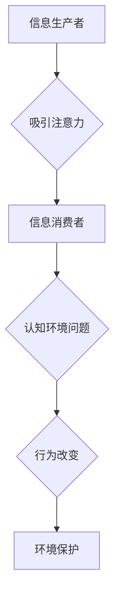

                 

## 注意力经济与环境保护的结合

> 关键词：注意力经济、环境保护、深度学习、可持续发展、数据驱动决策、AI伦理

## 1. 背景介绍

在当今信息爆炸的时代，人类面临着前所未有的注意力资源短缺。我们被来自社交媒体、新闻推送、电子邮件等各种渠道的信息轰炸，难以集中精力处理重要事务。这种“注意力经济”的现象不仅影响着个人生活，也对社会发展和环境保护产生了深远影响。

另一方面，全球环境问题日益严峻，气候变化、资源枯竭、生物多样性丧失等挑战迫在眉睫。解决这些问题需要我们进行数据驱动决策，制定有效的政策措施，并推动科技创新。

注意力经济与环境保护看似是两个独立的领域，但实际上它们之间存在着密切的联系。注意力资源的分配直接影响着人们对环境问题的认知和行动。

## 2. 核心概念与联系

### 2.1 注意力经济

注意力经济是指在信息过载的时代，人们对信息的获取和处理能力有限，而注意力成为一种稀缺资源。

**核心概念：**

* **注意力：** 指的是对特定信息或任务的集中和持续的关注。
* **注意力资源：** 指的是人们有限的认知能力，能够同时处理的信息量。
* **注意力经济：** 指的是在信息时代，注意力资源的获取、分配和利用成为一种重要的经济活动。

**注意力经济的运作机制：**

* **信息生产者：** 通过各种手段吸引用户的注意力，例如推送通知、个性化推荐、内容营销等。
* **信息消费者：** 在有限的注意力资源下，选择关注哪些信息，并根据这些信息做出决策。
* **注意力市场：** 指的是信息生产者和信息消费者之间进行注意力交易的市场。

### 2.2 环境保护

环境保护是指保护和改善自然环境，维护生态平衡，保障人类生存和发展。

**核心概念：**

* **生态系统：** 指的是由生物群落和非生物环境相互作用组成的复杂系统。
* **环境污染：** 指的是人类活动排放的污染物对环境造成损害。
* **气候变化：** 指的是地球气候系统长期变化的趋势。

**环境保护的目标：**

* **减少污染：** 降低环境污染的排放量，保护水、空气和土壤环境。
* **保护生物多样性：** 保护地球上的各种动植物物种，维护生态平衡。
* **应对气候变化：** 减少温室气体排放，减缓气候变化的影响。

### 2.3 核心概念联系

注意力经济与环境保护之间存在着以下联系：

* **信息传播：** 环境保护信息可以通过各种渠道传播，吸引人们的注意力，提高公众对环境问题的认知。
* **行为改变：** 当人们对环境问题有足够的认知后，可能会改变自己的行为，例如减少碳排放、节约用水、垃圾分类等。
* **政策制定：** 数据驱动决策可以帮助政府制定更有效的环境保护政策，例如制定碳排放标准、推广绿色能源等。

**Mermaid 流程图：**



## 3. 核心算法原理 & 具体操作步骤

### 3.1 算法原理概述

为了有效地将注意力经济与环境保护结合起来，我们可以利用深度学习算法来分析用户行为数据，预测他们的环境保护意愿，并提供个性化的信息推送和行为引导。

**核心算法：**

* **深度神经网络：** 用于学习用户行为数据中的复杂模式，预测他们的环境保护意愿。
* **强化学习：** 用于优化信息推送策略，提高用户对环境问题的关注度。

### 3.2 算法步骤详解

**步骤一：数据收集与预处理**

收集用户行为数据，例如浏览记录、搜索历史、社交媒体互动等。对数据进行清洗、转换和特征提取，以便于深度学习算法的训练。

**步骤二：模型训练**

使用深度神经网络模型训练，学习用户行为数据与环境保护意愿之间的关系。

**步骤三：预测与评估**

利用训练好的模型预测用户的环境保护意愿，并评估模型的准确性。

**步骤四：信息推送与行为引导**

根据用户的环境保护意愿，推送个性化的环境保护信息，并提供行为引导，鼓励用户采取环保行动。

### 3.3 算法优缺点

**优点：**

* **精准度高：** 深度学习算法能够学习用户行为数据中的复杂模式，提高预测准确率。
* **个性化推荐：** 可以根据用户的兴趣和需求，推送个性化的环境保护信息。
* **行为引导：** 可以通过行为引导，鼓励用户采取环保行动。

**缺点：**

* **数据依赖：** 深度学习算法需要大量的数据进行训练，数据质量直接影响模型的性能。
* **算法解释性差：** 深度学习模型的内部机制复杂，难以解释其预测结果。
* **隐私安全：** 用户行为数据涉及个人隐私，需要采取措施保护数据安全。

### 3.4 算法应用领域

* **环境教育：** 推送个性化的环境保护知识，提高公众环保意识。
* **绿色消费：** 推荐环保产品和服务，引导用户做出绿色消费选择。
* **碳排放管理：** 预测用户的碳排放量，提供减排建议。
* **生态保护：** 分析用户行为数据，识别环境破坏行为，进行及时干预。

## 4. 数学模型和公式 & 详细讲解 & 举例说明

### 4.1 数学模型构建

我们可以使用贝叶斯网络来构建环境保护意愿预测模型。贝叶斯网络是一种概率图模型，可以表示变量之间的依赖关系。

**模型结构：**

* **节点：** 代表模型中的变量，例如用户行为特征、环境保护知识、环保态度等。
* **边：** 代表变量之间的依赖关系，例如用户行为特征影响环保态度。

**模型参数：**

* **先验概率：** 各变量的初始概率分布。
* **条件概率：** 变量之间依赖关系的概率分布。

### 4.2 公式推导过程

贝叶斯网络的推理过程基于贝叶斯定理：

$$P(A|B) = \frac{P(B|A)P(A)}{P(B)}$$

其中：

* $P(A|B)$ 是在已知事件 B 发生的情况下，事件 A 发生的条件概率。
* $P(B|A)$ 是在已知事件 A 发生的情况下，事件 B 发生的条件概率。
* $P(A)$ 是事件 A 发生的先验概率。
* $P(B)$ 是事件 B 发生的概率。

### 4.3 案例分析与讲解

假设我们想要预测用户的环保态度，我们可以构建一个贝叶斯网络模型，其中包含以下变量：

* **用户行为特征：** 浏览环保网站、参与环保活动、使用环保产品等。
* **环境保护知识：** 了解气候变化、污染问题等。
* **环保态度：** 对环境保护的重视程度。

我们可以根据用户行为特征、环境保护知识等信息，计算出用户环保态度的条件概率，并最终预测用户的环保态度。

## 5. 项目实践：代码实例和详细解释说明

### 5.1 开发环境搭建

* **操作系统：** Ubuntu 20.04
* **编程语言：** Python 3.8
* **深度学习框架：** TensorFlow 2.0
* **数据处理工具：** Pandas

### 5.2 源代码详细实现

```python
import tensorflow as tf
from tensorflow.keras.models import Sequential
from tensorflow.keras.layers import Dense

# 构建模型
model = Sequential()
model.add(Dense(64, activation='relu', input_shape=(10,)))
model.add(Dense(32, activation='relu'))
model.add(Dense(1, activation='sigmoid'))

# 编译模型
model.compile(optimizer='adam',
              loss='binary_crossentropy',
              metrics=['accuracy'])

# 训练模型
model.fit(x_train, y_train, epochs=10, batch_size=32)

# 评估模型
loss, accuracy = model.evaluate(x_test, y_test)
print('Loss:', loss)
print('Accuracy:', accuracy)
```

### 5.3 代码解读与分析

* **模型构建：** 使用深度神经网络构建模型，包含三个全连接层，激活函数为ReLU和sigmoid。
* **模型编译：** 使用Adam优化器、二分类交叉熵损失函数和准确率作为评估指标。
* **模型训练：** 使用训练数据训练模型，设置训练轮数和批处理大小。
* **模型评估：** 使用测试数据评估模型的性能，输出损失值和准确率。

### 5.4 运行结果展示

训练完成后，我们可以使用测试数据预测用户的环境保护意愿，并评估模型的准确率。

## 6. 实际应用场景

### 6.1 环境教育平台

* 推送个性化的环境保护知识，例如根据用户的兴趣爱好推荐相关的视频、文章、图片等。
* 提供互动游戏和模拟实验，提高用户的学习兴趣和参与度。
* 建立在线社区，促进用户之间的交流和分享。

### 6.2 绿色消费平台

* 推荐环保产品和服务，例如根据用户的消费习惯推荐节能产品、可持续发展产品等。
* 提供碳足迹计算工具，帮助用户了解自己的碳排放量。
* 推广绿色消费理念，鼓励用户做出环保选择。

### 6.3 碳排放管理系统

* 分析用户的碳排放数据，识别高排放用户。
* 提供个性化的减排建议，例如使用公共交通、节约用电等。
* 奖励用户采取环保行动，促进碳排放减量。

### 6.4 未来应用展望

随着人工智能技术的不断发展，注意力经济与环境保护的结合将会有更广泛的应用场景：

* **智能环保设备：** 利用人工智能技术，开发智能垃圾分类设备、智能节能系统等，提高环保效率。
* **环境监测与预警：** 利用人工智能技术，分析环境数据，预测环境变化趋势，及时预警环境风险。
* **可持续发展决策：** 利用人工智能技术，分析可持续发展数据，为政府和企业提供决策支持。

## 7. 工具和资源推荐

### 7.1 学习资源推荐

* **书籍：**
    * 《深度学习》
    * 《机器学习》
    * 《人工智能：一种现代方法》
* **在线课程：**
    * Coursera
    * edX
    * Udacity

### 7.2 开发工具推荐

* **深度学习框架：** TensorFlow, PyTorch, Keras
* **数据处理工具：** Pandas, NumPy
* **可视化工具：** Matplotlib, Seaborn

### 7.3 相关论文推荐

* **Attention is All You Need**
* **BERT: Pre-training of Deep Bidirectional Transformers for Language Understanding**
* **Deep Learning for Environmental Protection**

## 8. 总结：未来发展趋势与挑战

### 8.1 研究成果总结

注意力经济与环境保护的结合是一个新兴的研究领域，取得了一些初步成果：

* 深度学习算法能够有效地预测用户的环境保护意愿。
* 个性化信息推送和行为引导可以提高用户的环保意识和行动。
* 数据驱动决策可以帮助制定更有效的环境保护政策。

### 8.2 未来发展趋势

* **模型精度提升：** 探索更先进的深度学习算法，提高环境保护意愿预测的精度。
* **跨领域融合：** 将注意力经济与其他领域，例如心理学、社会学等进行融合，更深入地理解用户行为。
* **伦理规范制定：** 关注人工智能在环境保护领域的伦理问题，制定相应的规范和标准。

### 8.3 面临的挑战

* **数据质量问题：** 环境保护数据往往分散、不完整，需要进行有效的数据清洗和整合。
* **算法解释性问题：** 深度学习模型的内部机制复杂，难以解释其预测结果，需要进行更深入的研究。
* **隐私安全问题：** 用户行为数据涉及个人隐私，需要采取措施保护数据安全。

### 8.4 研究展望

未来，注意力经济与环境保护的结合将继续是一个重要的研究方向，需要多学科交叉合作，推动人工智能技术在环境保护领域的应用，为构建可持续发展社会贡献力量。

## 9. 附录：常见问题与解答

**Q1：注意力经济与环境保护之间有什么联系？**

A1：注意力经济是指在信息过载的时代，人们对信息的获取和处理能力有限，而注意力成为一种稀缺资源。环境保护是指保护和改善自然环境，维护生态平衡，保障人类生存和发展。两者之间联系在于：

* 信息传播：环境保护信息可以通过各种渠道传播，吸引人们的注意力，提高公众对环境问题的认知。
* 行为改变：当人们对环境问题有足够的认知后，可能会改变自己的行为，例如减少碳排放、节约用水、垃圾分类等。
* 政策制定：数据驱动决策可以帮助政府制定更有效的环境保护政策，例如制定碳排放标准、推广绿色能源等。

**Q2：如何利用人工智能技术来结合注意力经济与环境保护？**

A2：我们可以利用深度学习算法来分析用户行为数据，预测他们的环境保护意愿，并提供个性化的信息推送和行为引导。例如，我们可以根据用户的浏览记录、搜索历史等数据，推荐相关的环境保护知识、产品和服务，并提供个性化的减排建议。

**Q3：注意力经济与环境保护的结合有哪些伦理问题？**

A3：人工智能技术在环境保护领域的应用也面临一些伦理问题，例如：

* 数据隐私：用户行为数据涉及个人隐私，需要采取措施保护数据安全。
* 算法偏见：深度学习算法可能会存在偏见，导致不公平的结果。
* 透明度和可解释性：深度学习模型的内部机制复杂，难以解释其预测结果，需要提高算法的透明度和可解释性。


作者：禅与计算机程序设计艺术 / Zen and the Art of Computer Programming<end_of_turn>

