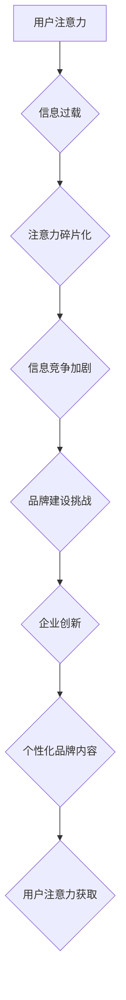

                 

## 1. 背景介绍

在当今数字时代，信息爆炸和碎片化成为常态。人们每天接触的海量信息中，只有极少部分能够获得他们的关注。这种“注意力经济”的兴起对企业品牌建设提出了前所未有的挑战。传统品牌建设模式，依靠广告投放、口碑传播等方式，在信息过载的时代显得越来越无效。企业需要寻找新的方式，在竞争激烈的市场中抓住用户的注意力，建立牢固的品牌认知和忠诚度。

## 2. 核心概念与联系

### 2.1 注意力经济

注意力经济是指在信息过剩的时代，人们对信息的筛选和选择能力成为稀缺资源，而能够吸引和获取用户注意力的能力则成为企业竞争的关键。

### 2.2 品牌建设

品牌建设是指企业通过一系列的策略和行动，塑造和提升品牌形象，建立品牌认知度、品牌忠诚度和品牌价值。

### 2.3 联系

注意力经济对品牌建设的影响主要体现在以下几个方面：

* **用户注意力碎片化:** 用户的注意力越来越分散，难以集中在单一的信息上，企业需要找到更有效的方式来吸引和留住用户的注意力。
* **信息竞争加剧:** 在海量信息中，企业需要找到更具吸引力和差异化的方式来突出自己的品牌，才能在竞争中脱颖而出。
* **个性化需求提升:** 用户对信息的个性化需求越来越高，企业需要根据用户的不同需求和喜好，提供更精准和有效的品牌内容。

**Mermaid 流程图**



## 3. 核心算法原理 & 具体操作步骤

### 3.1 算法原理概述

在注意力经济下，企业需要利用算法来分析用户行为，预测用户需求，并提供个性化的品牌内容。常见的算法包括：

* **推荐算法:** 基于用户的历史行为和偏好，推荐相关的内容，例如商品推荐、新闻推荐等。
* **内容分发算法:** 根据用户的兴趣和行为，将内容分发到不同的平台和渠道，例如社交媒体、搜索引擎等。
* **个性化广告算法:** 根据用户的兴趣和行为，投放个性化的广告，提高广告点击率和转化率。

### 3.2 算法步骤详解

以推荐算法为例，其具体操作步骤如下：

1. **数据收集:** 收集用户的行为数据，例如浏览历史、购买记录、点赞评论等。
2. **数据预处理:** 对收集到的数据进行清洗、转换和特征提取，以便于算法训练。
3. **模型训练:** 选择合适的推荐算法模型，例如协同过滤、内容基准、深度学习等，并利用训练数据进行模型训练。
4. **模型评估:** 使用测试数据评估模型的性能，例如准确率、召回率、覆盖率等。
5. **模型部署:** 将训练好的模型部署到线上环境，用于实时推荐内容。

### 3.3 算法优缺点

**优点:**

* **精准推荐:** 能够根据用户的兴趣和需求，推荐更精准的内容。
* **提高用户体验:** 提供个性化的内容体验，提升用户粘性和满意度。
* **提升商业价值:** 通过精准推荐，提高转化率和销售额。

**缺点:**

* **数据依赖:** 推荐算法依赖于海量用户数据，数据质量直接影响算法效果。
* **算法黑盒:** 一些复杂的推荐算法难以解释，难以理解其推荐机制。
* **隐私安全:** 用户数据收集和使用需要谨慎处理，避免泄露用户隐私。

### 3.4 算法应用领域

推荐算法广泛应用于以下领域：

* **电商:** 商品推荐、用户画像、个性化营销
* **社交媒体:** 内容推荐、好友推荐、兴趣标签
* **视频平台:** 视频推荐、用户分类、内容分发
* **音乐平台:** 音乐推荐、用户喜好分析、个性化播放列表

## 4. 数学模型和公式 & 详细讲解 & 举例说明

### 4.1 数学模型构建

推荐算法通常基于以下数学模型：

* **协同过滤:** 基于用户的相似度或物品的相似度进行推荐。

* **内容基准:** 基于物品的特征和用户的兴趣偏好进行推荐。

* **深度学习:** 利用神经网络模型学习用户和物品之间的复杂关系，进行推荐。

### 4.2 公式推导过程

以协同过滤为例，其核心公式为：

$$
r_{ui} = \frac{ \sum_{j \in N(u)} \frac{s_{uj} * r_{uj}}{ \sqrt{ \sum_{k \in N(u)} s_{uk}^2 }} }{ \sum_{j \in N(u)} \frac{s_{uj}}{ \sqrt{ \sum_{k \in N(u)} s_{uk}^2 }} }
$$

其中：

* $r_{ui}$: 用户 $u$ 对物品 $i$ 的评分
* $s_{uj}$: 用户 $u$ 和用户 $j$ 的相似度
* $r_{uj}$: 用户 $j$ 对物品 $i$ 的评分
* $N(u)$: 用户 $u$ 的邻居用户集合

### 4.3 案例分析与讲解

假设用户 $A$ 和用户 $B$ 都喜欢电影 $X$ 和 $Y$，但用户 $A$ 对电影 $Z$ 的评分较高，而用户 $B$ 对电影 $Z$ 的评分较低。根据协同过滤算法，如果用户 $C$ 喜欢的电影与用户 $A$ 和用户 $B$ 喜欢的电影相似，那么算法会预测用户 $C$ 也可能喜欢电影 $X$ 和 $Y$，但对电影 $Z$ 的评分可能更接近用户 $A$ 的评分。

## 5. 项目实践：代码实例和详细解释说明

### 5.1 开发环境搭建

* Python 3.x
* TensorFlow 或 PyTorch
* Jupyter Notebook

### 5.2 源代码详细实现

```python
# 导入必要的库
import numpy as np
from sklearn.metrics.pairwise import cosine_similarity

# 定义用户-物品评分矩阵
ratings = np.array([
    [5, 4, 3, 0],
    [4, 5, 0, 3],
    [3, 0, 5, 4],
    [0, 3, 4, 5]
])

# 计算用户之间的相似度
user_similarity = cosine_similarity(ratings)

# 获取用户 A 的邻居用户
user_a_index = 0
neighbors = np.argsort(user_similarity[user_a_index])[::-1][1:]

# 预测用户 A 对物品 3 的评分
predicted_rating = np.average([ratings[neighbor, 2] for neighbor in neighbors], weights=user_similarity[user_a_index][neighbors])

# 打印预测评分
print(f"Predicted rating for user A on item 3: {predicted_rating}")
```

### 5.3 代码解读与分析

* 代码首先定义了一个用户-物品评分矩阵，其中每个元素代表用户对物品的评分。
* 然后使用 cosine_similarity 函数计算用户之间的相似度。
* 通过获取用户 A 的邻居用户，并利用邻居用户的评分信息，预测用户 A 对物品 3 的评分。

### 5.4 运行结果展示

运行上述代码，可以得到用户 A 对物品 3 的预测评分。

## 6. 实际应用场景

### 6.1 电商平台

* **商品推荐:** 根据用户的浏览历史、购买记录等数据，推荐相关的商品。
* **个性化营销:** 根据用户的兴趣和行为，推送个性化的广告和促销信息。
* **用户画像:** 分析用户的购买行为和偏好，构建用户画像，为精准营销提供数据支持。

### 6.2 社交媒体平台

* **内容推荐:** 根据用户的兴趣和行为，推荐相关的文章、视频、图片等内容。
* **好友推荐:** 根据用户的兴趣和社交关系，推荐潜在的好友。
* **兴趣标签:** 分析用户的行为数据，自动生成用户的兴趣标签，帮助用户发现新的兴趣爱好。

### 6.3 视频平台

* **视频推荐:** 根据用户的观看历史、点赞评论等数据，推荐相关的视频。
* **用户分类:** 根据用户的观看习惯，将用户分类为不同的群体，例如喜剧爱好者、科幻爱好者等。
* **内容分发:** 根据用户的兴趣和行为，将视频分发到不同的平台和渠道。

### 6.4 未来应用展望

随着人工智能技术的不断发展，注意力经济对品牌建设的影响将更加深远。未来，企业将更加注重以下方面：

* **个性化体验:** 提供更加个性化的品牌内容和服务，满足用户的差异化需求。
* **沉浸式互动:** 利用虚拟现实、增强现实等技术，创造更加沉浸式的品牌体验。
* **数据驱动决策:** 利用大数据分析和人工智能算法，更加精准地洞察用户需求，制定品牌策略。

## 7. 工具和资源推荐

### 7.1 学习资源推荐

* **书籍:**
    * 《深度学习》
    * 《机器学习实战》
    * 《推荐系统实践》
* **在线课程:**
    * Coursera: 深度学习
    * Udacity: 机器学习工程师
    * edX: 数据科学

### 7.2 开发工具推荐

* **Python:** 
    * TensorFlow
    * PyTorch
    * Scikit-learn
* **云平台:**
    * AWS
    * Azure
    * Google Cloud

### 7.3 相关论文推荐

* **Collaborative Filtering for Implicit Feedback Datasets**
* **Deep Learning for Recommender Systems**
* **Content-Based Recommendation Systems**

## 8. 总结：未来发展趋势与挑战

### 8.1 研究成果总结

注意力经济对品牌建设的影响日益显著，人工智能技术为企业提供了新的工具和方法，帮助企业更好地理解用户需求，提供个性化的品牌体验。

### 8.2 未来发展趋势

未来，注意力经济和人工智能技术将继续融合发展，品牌建设将更加注重以下方面：

* **个性化:** 提供更加个性化的品牌内容和服务，满足用户的差异化需求。
* **沉浸式:** 利用虚拟现实、增强现实等技术，创造更加沉浸式的品牌体验。
* **数据驱动:** 利用大数据分析和人工智能算法，更加精准地洞察用户需求，制定品牌策略。

### 8.3 面临的挑战

* **数据隐私:** 用户数据收集和使用需要谨慎处理，避免泄露用户隐私。
* **算法解释:** 一些复杂的推荐算法难以解释，难以理解其推荐机制。
* **用户信任:** 用户对算法推荐的信任度需要不断提升。

### 8.4 研究展望

未来研究方向包括：

* **开发更加透明和可解释的推荐算法。**
* **探索新的技术手段，创造更加沉浸式的品牌体验。**
* **研究用户对算法推荐的信任机制，提升用户信任度。**

## 9. 附录：常见问题与解答

* **Q: 如何评估推荐算法的性能？**

* **A:** 推荐算法的性能通常使用以下指标评估：准确率、召回率、覆盖率、NDCG 等。

* **Q: 如何处理缺失数据？**

* **A:** 缺失数据可以采用多种方法处理，例如平均值填充、插值法、矩阵分解等。

* **Q: 如何避免算法推荐的偏差？**

* **A:** 避免算法推荐的偏差需要从数据收集、算法设计、模型训练等各个环节进行控制，例如使用多样化的数据样本、避免算法过度拟合等。


作者：禅与计算机程序设计艺术 / Zen and the Art of Computer Programming 
<end_of_turn>

