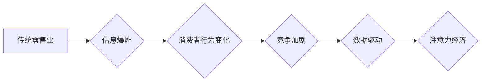

                 

## 1. 背景介绍

在当今数字时代，人们的生活方式发生了根本性的改变。互联网、移动设备和社交媒体的普及，使得信息获取和消费方式发生了巨大转变。人们的注意力成为了最宝贵的资源，而如何获取和利用注意力，成为了企业竞争的关键。

传统零售业长期以来依赖于线下门店和广告投放来吸引顾客，但随着线上购物的兴起，传统零售业面临着前所未有的挑战。消费者越来越倾向于在线购物，线下门店的客流量下降，广告投放效果也越来越不佳。

注意力经济的兴起，为传统零售业提供了新的机遇和挑战。注意力经济的核心是理解和利用人们的注意力，通过提供个性化、有价值的内容和体验，吸引和留住用户的注意力。

## 2. 核心概念与联系

### 2.1 注意力经济

注意力经济是指在信息爆炸的时代，人们的注意力成为了最稀缺的资源，而企业通过提供有价值的内容和体验，来获取和利用用户的注意力，从而实现商业价值的经济模式。

### 2.2 传统零售业

传统零售业是指以线下门店为主要销售渠道的零售业，其核心业务是通过提供商品和服务，满足消费者的需求。

### 2.3 联系

注意力经济对传统零售业的影响主要体现在以下几个方面：

* **消费者行为变化:** 消费者越来越倾向于在线购物，线下门店的客流量下降。
* **竞争加剧:** 线上零售平台的竞争日益激烈，传统零售业需要寻找新的竞争优势。
* **数据驱动:** 数据分析和个性化推荐成为零售业的重要工具，帮助企业更好地了解消费者需求，提供更精准的服务。

**Mermaid 流程图**



## 3. 核心算法原理 & 具体操作步骤

### 3.1 算法原理概述

注意力机制是一种模仿人类注意力机制的算法，它能够学习到输入数据中最重要的部分，并对这些部分给予更多的关注。

注意力机制的核心思想是通过一个注意力权重来分配输入数据的权重，从而突出重要的信息，抑制不重要的信息。

### 3.2 算法步骤详解

1. **输入数据:** 将输入数据（例如文本、图像）转换为向量表示。
2. **计算注意力权重:** 使用一个注意力函数计算每个输入数据元素的注意力权重。
3. **加权求和:** 将每个输入数据元素与其注意力权重相乘，然后求和，得到输出向量。

### 3.3 算法优缺点

**优点:**

* 可以学习到输入数据中最重要的部分，提高模型的准确性。
* 可以处理长序列数据，例如文本和视频。

**缺点:**

* 计算复杂度较高。
* 需要大量的训练数据。

### 3.4 算法应用领域

注意力机制在自然语言处理、计算机视觉、机器翻译等领域都有广泛的应用。

## 4. 数学模型和公式 & 详细讲解 & 举例说明

### 4.1 数学模型构建

注意力机制的数学模型可以表示为以下公式：

$$
\text{Attention}(Q, K, V) = \text{softmax}\left(\frac{Q K^T}{\sqrt{d_k}}\right) V
$$

其中：

* $Q$：查询向量
* $K$：键向量
* $V$：值向量
* $d_k$：键向量的维度
* $\text{softmax}$：softmax函数

### 4.2 公式推导过程

公式推导过程如下：

1. 计算查询向量 $Q$ 和键向量 $K$ 的点积，并除以 $\sqrt{d_k}$。
2. 应用 softmax 函数对点积结果进行归一化，得到注意力权重。
3. 将注意力权重与值向量 $V$ 进行加权求和，得到输出向量。

### 4.3 案例分析与讲解

例如，在机器翻译中，可以使用注意力机制来学习到源语言和目标语言之间的对应关系。

查询向量 $Q$ 表示目标语言中的当前词，键向量 $K$ 表示源语言中的所有词，值向量 $V$ 表示源语言中的所有词的嵌入向量。

通过计算注意力权重，模型可以学习到源语言中与目标语言中的当前词最相关的词，并将其作为翻译的参考。

## 5. 项目实践：代码实例和详细解释说明

### 5.1 开发环境搭建

* Python 3.6+
* TensorFlow 2.0+
* PyTorch 1.0+

### 5.2 源代码详细实现

```python
import tensorflow as tf

# 定义注意力机制
def attention_mechanism(query, keys, values, mask=None):
    # 计算查询向量和键向量的点积
    scores = tf.matmul(query, keys, transpose_b=True)

    # 应用 softmax 函数对点积结果进行归一化
    attention_weights = tf.nn.softmax(scores, axis=-1)

    # 将注意力权重与值向量进行加权求和
    context_vector = tf.matmul(attention_weights, values)

    return context_vector, attention_weights

# 示例代码
query = tf.constant([[1, 2, 3], [4, 5, 6]])
keys = tf.constant([[7, 8, 9], [10, 11, 12]])
values = tf.constant([[13, 14, 15], [16, 17, 18]])

context_vector, attention_weights = attention_mechanism(query, keys, values)

print("Context Vector:", context_vector)
print("Attention Weights:", attention_weights)
```

### 5.3 代码解读与分析

* `attention_mechanism` 函数实现了注意力机制的核心逻辑。
* `scores` 计算了查询向量和键向量的点积，表示不同键向量与查询向量的相关性。
* `attention_weights` 使用 softmax 函数对 `scores` 进行归一化，得到每个键向量的注意力权重。
* `context_vector` 通过将注意力权重与值向量进行加权求和，得到最终的上下文向量。

### 5.4 运行结果展示

运行上述代码，可以得到 `context_vector` 和 `attention_weights` 的输出结果。

## 6. 实际应用场景

### 6.1 个性化推荐

注意力机制可以用于个性化推荐，例如电商平台可以根据用户的浏览历史、购买记录等信息，学习到用户感兴趣的商品，并推荐相关商品。

### 6.2 内容过滤

注意力机制可以用于内容过滤，例如社交媒体平台可以根据用户的兴趣爱好，过滤掉不感兴趣的内容，并推荐相关内容。

### 6.3 智能客服

注意力机制可以用于智能客服，例如聊天机器人可以根据用户的聊天记录，理解用户的意图，并提供相应的帮助。

### 6.4 未来应用展望

注意力机制在未来将有更广泛的应用，例如：

* **医疗诊断:** 帮助医生更快、更准确地诊断疾病。
* **金融风险控制:** 帮助金融机构识别和控制风险。
* **自动驾驶:** 帮助自动驾驶汽车更好地感知周围环境。

## 7. 工具和资源推荐

### 7.1 学习资源推荐

* **书籍:**
    * 《深度学习》
    * 《自然语言处理》
* **在线课程:**
    * Coursera
    * edX
* **博客:**
    * TensorFlow Blog
    * PyTorch Blog

### 7.2 开发工具推荐

* **TensorFlow:** 开源深度学习框架
* **PyTorch:** 开源深度学习框架
* **Keras:** 高级深度学习API

### 7.3 相关论文推荐

* **Attention Is All You Need:** https://arxiv.org/abs/1706.03762
* **BERT: Pre-training of Deep Bidirectional Transformers for Language Understanding:** https://arxiv.org/abs/1810.04805

## 8. 总结：未来发展趋势与挑战

### 8.1 研究成果总结

注意力机制是一种强大的机器学习算法，在自然语言处理、计算机视觉等领域取得了显著的成果。

### 8.2 未来发展趋势

* **更有效的注意力机制:** 研究更有效的注意力机制，例如可解释性更强、计算效率更高的注意力机制。
* **多模态注意力机制:** 研究能够处理多种模态数据的注意力机制，例如文本、图像、音频等。
* **动态注意力机制:** 研究能够根据任务需求动态调整注意力权重的注意力机制。

### 8.3 面临的挑战

* **计算复杂度:** 现有的注意力机制计算复杂度较高，难以应用于大规模数据。
* **可解释性:** 注意力机制的决策过程难以解释，这限制了其在一些领域应用的推广。
* **数据依赖性:** 注意力机制需要大量的训练数据，这在一些领域难以满足。

### 8.4 研究展望

未来，注意力机制的研究将继续深入，并应用于更多领域，为人工智能的发展做出更大的贡献。

## 9. 附录：常见问题与解答

### 9.1 什么是注意力机制？

注意力机制是一种模仿人类注意力机制的算法，它能够学习到输入数据中最重要的部分，并对这些部分给予更多的关注。

### 9.2 注意力机制的应用场景有哪些？

注意力机制在自然语言处理、计算机视觉、机器翻译等领域都有广泛的应用。

### 9.3 注意力机制的优缺点是什么？

**优点:**

* 可以学习到输入数据中最重要的部分，提高模型的准确性。
* 可以处理长序列数据，例如文本和视频。

**缺点:**

* 计算复杂度较高。
* 需要大量的训练数据。


作者：禅与计算机程序设计艺术 / Zen and the Art of Computer Programming 
<end_of_turn>

