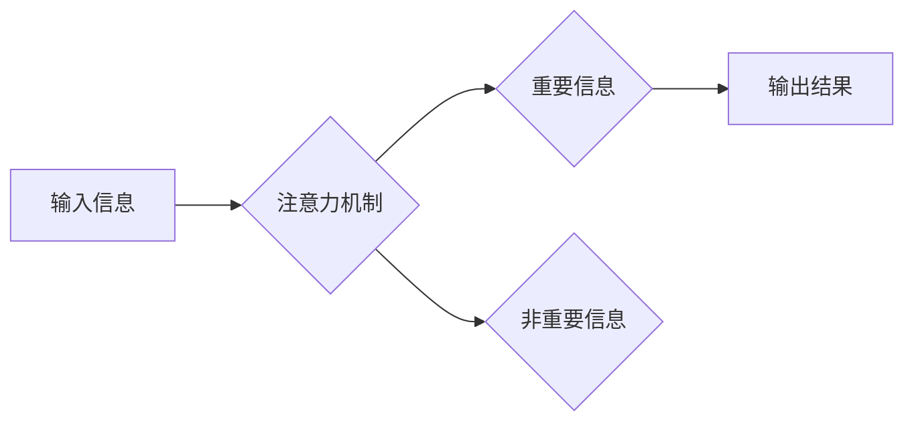

                 

## 1. 背景介绍

在当今信息爆炸的时代，注意力已经成为至关重要的认知能力。然而，现代生活节奏快、信息纷繁，人们的注意力却日益涣散，注意力缺陷和认知疲劳问题日益突出。这不仅影响了学习、工作效率，也损害了人们的幸福感和生活质量。

注意力训练，即通过特定的训练方法来增强和改善注意力能力，近年来备受关注。越来越多的研究表明，注意力训练能够有效提升专注力、记忆力、执行功能等认知能力，并改善情绪状态、减轻压力、提升幸福感。

## 2. 核心概念与联系

### 2.1 注意力机制

注意力机制是人工智能领域近年来发展迅速的关键技术之一，它模拟了人类大脑对重要信息进行筛选和聚焦的过程。注意力机制的核心思想是，在处理信息时，并非所有信息都具有同等重要性，我们可以通过赋予不同信息不同的权重，从而集中处理最重要的信息。

**Mermaid 流程图:**



### 2.2 注意力训练与大脑健康

注意力训练通过特定的训练方法，可以改变大脑的结构和功能，从而提升注意力能力。研究表明，注意力训练可以：

* **增强大脑皮层厚度:** 注意力训练可以增加大脑前额叶皮层、顶叶皮层等与注意力相关的脑区厚度，从而提高信息处理能力。
* **改变神经元连接:** 注意力训练可以促进大脑不同区域之间神经元连接的加强，从而提高信息传递效率。
* **调节神经递质水平:** 注意力训练可以调节大脑中多巴胺、去甲肾上腺素等神经递质的水平，从而改善情绪状态、提升专注力。

## 3. 核心算法原理 & 具体操作步骤

### 3.1 算法原理概述

注意力机制的核心算法是**注意力权重计算**。通过对输入信息进行编码和解码，计算出每个信息的重要性权重，并根据这些权重对信息进行加权求和，从而得到最终的输出结果。常见的注意力机制算法包括：

* **Soft Attention:** 使用softmax函数计算注意力权重，使得权重分布在所有输入信息上，并满足归一化条件。
* **Hard Attention:** 直接选择一个或几个最相关的输入信息，忽略其他信息，从而实现更强的聚焦效果。

### 3.2 算法步骤详解

**Soft Attention:**

1. **输入编码:** 将输入信息编码成一个固定长度的向量表示。
2. **查询、键、值矩阵:** 将编码后的向量表示分解成查询向量、键向量和值向量。
3. **注意力权重计算:** 计算查询向量与所有键向量的相似度，并使用softmax函数将其归一化，得到每个输入信息的注意力权重。
4. **加权求和:** 根据注意力权重对所有值向量进行加权求和，得到最终的输出向量。

**Hard Attention:**

1. **输入编码:** 将输入信息编码成一个固定长度的向量表示。
2. **查询、键、值矩阵:** 将编码后的向量表示分解成查询向量、键向量和值向量。
3. **注意力权重计算:** 计算查询向量与所有键向量的相似度，选择相似度最高的几个键向量作为注意力位置。
4. **值向量选择:** 根据注意力位置选择对应的值向量，忽略其他值向量。

### 3.3 算法优缺点

**Soft Attention:**

* **优点:** 能够对所有输入信息进行加权处理，避免信息丢失。
* **缺点:** 权重分布较为平滑，难以实现强烈的聚焦效果。

**Hard Attention:**

* **优点:** 可以选择最相关的输入信息，实现更强的聚焦效果。
* **缺点:** 可能会忽略部分重要信息，导致信息损失。

### 3.4 算法应用领域

注意力机制在人工智能领域有着广泛的应用，例如：

* **自然语言处理:** 机器翻译、文本摘要、问答系统等。
* **计算机视觉:** 图像识别、目标检测、图像 Captioning 等。
* **语音识别:** 语音转文本、语音合成等。

## 4. 数学模型和公式 & 详细讲解 & 举例说明

### 4.1 数学模型构建

**Soft Attention:**

假设输入序列为 $X = \{x_1, x_2, ..., x_n\}$, 编码后的向量表示为 $h_i \in R^d$, 其中 $d$ 为向量维度。查询向量为 $q \in R^d$, 键向量为 $k_i \in R^d$, 值向量为 $v_i \in R^d$.

注意力权重计算公式:

$$
a_{i} = \frac{exp(score(q, k_i))}{\sum_{j=1}^{n} exp(score(q, k_j))}
$$

其中 $score(q, k_i)$ 为查询向量 $q$ 与键向量 $k_i$ 的相似度，例如使用点积计算:

$$
score(q, k_i) = q^T k_i
$$

最终输出向量计算公式:

$$
output = \sum_{i=1}^{n} a_i v_i
$$

**Hard Attention:**

Hard Attention 选择一个或几个最相关的输入信息作为注意力位置，其选择机制通常基于注意力权重排序。

### 4.2 公式推导过程

Soft Attention 的注意力权重计算公式基于 softmax 函数，其目的是将所有输入信息的相似度转换为概率分布，使得权重分布在所有输入信息上，并满足归一化条件。

Hard Attention 的选择机制通常基于贪婪算法，选择注意力权重最高的输入信息作为注意力位置。

### 4.3 案例分析与讲解

**机器翻译:**

在机器翻译任务中，注意力机制可以帮助模型关注源语言中与目标语言单词相关的关键信息，从而提高翻译质量。例如，在翻译句子 "The cat sat on the mat" 时，注意力机制可以帮助模型关注 "cat" 和 "sat" 等关键信息，忽略 "the" 和 "on" 等非关键信息。

**图像 Captioning:**

在图像 Captioning 任务中，注意力机制可以帮助模型关注图像中与描述相关的关键区域，从而生成更准确的图像描述。例如，在描述一张包含猫和狗的图像时，注意力机制可以帮助模型关注猫和狗的区域，忽略背景信息。

## 5. 项目实践：代码实例和详细解释说明

### 5.1 开发环境搭建

* Python 3.x
* TensorFlow 或 PyTorch 深度学习框架
* Jupyter Notebook 或 VS Code 开发环境

### 5.2 源代码详细实现

以下是一个使用 TensorFlow 实现 Soft Attention 的简单代码示例:

```python
import tensorflow as tf

# 定义输入序列
input_sequence = tf.random.normal(shape=(10, 5, 128))

# 定义编码器
encoder = tf.keras.Sequential([
    tf.keras.layers.LSTM(128),
    tf.keras.layers.Dense(128)
])
encoded_sequences = encoder(input_sequence)

# 定义查询、键、值矩阵
query = tf.keras.layers.Dense(128)(encoded_sequences)
key = tf.keras.layers.Dense(128)(encoded_sequences)
value = tf.keras.layers.Dense(128)(encoded_sequences)

# 计算注意力权重
attention_weights = tf.nn.softmax(tf.matmul(query, key, transpose_b=True), axis=-1)

# 加权求和
output = tf.matmul(attention_weights, value)

# 打印输出结果
print(output.shape)
```

### 5.3 代码解读与分析

* 首先，定义输入序列和编码器模型。
* 然后，使用三个全连接层分别生成查询、键、值矩阵。
* 计算注意力权重，使用 softmax 函数将相似度转换为概率分布。
* 最后，根据注意力权重对值向量进行加权求和，得到最终输出向量。

### 5.4 运行结果展示

运行上述代码，会输出一个形状为 (10, 128) 的张量，表示注意力机制后的输出向量。

## 6. 实际应用场景

### 6.1  注意力训练应用

注意力训练可以应用于以下场景：

* **提高学习效率:** 通过注意力训练，可以增强专注力，提高学习效率，更好地理解和记忆知识。
* **改善工作表现:** 注意力训练可以帮助人们集中注意力，提高工作效率，减少错误率。
* **减轻压力和焦虑:** 注意力训练可以帮助人们更好地管理情绪，减轻压力和焦虑，提升幸福感。

### 6.2  注意力机制应用

注意力机制在人工智能领域有着广泛的应用，例如：

* **智能客服:** 注意力机制可以帮助智能客服更好地理解用户的需求，提供更精准的回复。
* **个性化推荐:** 注意力机制可以帮助推荐系统更好地理解用户的偏好，提供更个性化的推荐。
* **医疗诊断:** 注意力机制可以帮助医生更好地分析医学图像，提高诊断准确率。

### 6.4 未来应用展望

随着人工智能技术的不断发展，注意力机制和注意力训练将会在更多领域得到应用，例如：

* **教育:** 个性化学习、智能辅导等。
* **医疗:** 疾病诊断、药物研发等。
* **金融:** 风险管理、欺诈检测等。

## 7. 工具和资源推荐

### 7.1 学习资源推荐

* **书籍:**
    * 《深度学习》
    * 《注意力机制》
* **在线课程:**
    * Coursera: 深度学习
    * Udacity: 自然语言处理
* **博客:**
    * TensorFlow Blog
    * PyTorch Blog

### 7.2 开发工具推荐

* **TensorFlow:** 开源深度学习框架
* **PyTorch:** 开源深度学习框架
* **Jupyter Notebook:** 交互式编程环境
* **VS Code:** 代码编辑器

### 7.3 相关论文推荐

* **Attention Is All You Need:** https://arxiv.org/abs/1706.03762
* **BERT: Pre-training of Deep Bidirectional Transformers for Language Understanding:** https://arxiv.org/abs/1810.04805

## 8. 总结：未来发展趋势与挑战

### 8.1 研究成果总结

注意力机制和注意力训练在人工智能领域取得了显著的成果，在自然语言处理、计算机视觉、语音识别等领域取得了突破性的进展。

### 8.2 未来发展趋势

* **更强大的注意力机制:** 研究更强大的注意力机制，例如自注意力机制、多头注意力机制等，提高模型的表达能力和泛化能力。
* **注意力训练的个性化:** 研究个性化的注意力训练方法，根据用户的不同需求和特点，定制训练方案。
* **注意力训练与脑科学的结合:** 将注意力训练与脑科学研究结合，更深入地理解注意力机制，开发更有效的训练方法。

### 8.3 面临的挑战

* **计算资源:** 训练大型注意力模型需要大量的计算资源，这对于资源有限的机构和个人来说是一个挑战。
* **数据标注:** 训练注意力模型需要大量的标注数据，数据标注成本高昂，也是一个挑战。
* **可解释性:** 注意力机制的决策过程较为复杂，难以解释，这对于模型的应用和信任度是一个挑战。

### 8.4 研究展望

未来，注意力机制和注意力训练将会继续发展，在更多领域得到应用，为人类社会带来更多福祉。


## 9. 附录：常见问题与解答

**Q1: 注意力训练需要多长时间才能看到效果？**

**A1:** 注意力训练的效果因人而异，一般需要持续进行一段时间才能看到明显的效果。建议每周进行至少3次训练，每次训练时间为20-30分钟。

**Q2: 注意力训练有哪些风险？**

**A2:** 注意力训练一般来说是安全的，但如果训练过程中出现头痛、疲劳等不适症状，应及时停止训练并咨询医生。

**Q3: 注意力训练适合所有人群吗？**

**A3:** 注意力训练一般来说适合大多数人群，但对于患有注意力缺陷障碍等疾病的人群，应在医生的指导下进行训练。


作者：禅与计算机程序设计艺术 / Zen and the Art of Computer Programming 
<end_of_turn>

