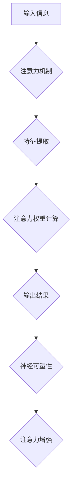

                 

## 1. 背景介绍

在当今信息爆炸的时代，注意力已成为至关重要的认知能力。我们每天都被来自各种渠道的信息轰炸，如何有效地集中注意力、过滤干扰，并保持持续的专注力，直接关系到我们的学习效率、工作成果以及生活质量。

然而，现代社会的生活节奏快、压力大，人们的注意力持续时间越来越短，容易被各种诱惑分散。这不仅影响了个人效率，也可能导致认知能力下降、学习障碍、情绪波动等问题。

近年来，越来越多的研究表明，注意力并非是固定的先天能力，而是可以通过训练和练习来增强。大脑具有强大的神经可塑性，这意味着我们能够通过特定的训练方法改变大脑结构和功能，从而提高注意力水平。

## 2. 核心概念与联系

### 2.1 注意力机制

注意力机制是人工智能领域近年来发展迅速的热点方向之一。它模拟了人类大脑对重要信息进行筛选和聚焦的过程，能够帮助模型更好地理解和处理复杂的信息。

注意力机制的核心思想是赋予模型“关注”的能力，即模型能够根据输入信息的重要性，选择性地关注某些部分，而忽略其他部分。这使得模型能够更加高效地处理信息，并提高对关键信息的识别能力。

### 2.2 神经可塑性

神经可塑性是指大脑神经元连接和功能在使用和学习过程中不断变化的能力。当我们学习新知识或技能时，大脑会形成新的神经连接，或者强化已经存在的连接。

神经可塑性是学习和记忆的基础，也是注意力训练能够有效提升注意力水平的关键机制。通过注意力训练，我们可以刺激大脑神经元之间的连接，增强神经回路的强度，从而提高注意力能力。

### 2.3 训练与增强

注意力训练是指通过特定的练习和训练方法，来增强大脑的注意力能力。这些训练方法通常基于认知心理学和神经科学的研究成果，旨在刺激大脑神经元活动，强化注意力相关的脑区连接，从而提高注意力水平。

注意力训练可以采用多种形式，例如：

* **冥想练习:** 冥想可以帮助我们平静思绪，提高专注力，并增强对当下体验的觉察能力。
* **专注力游戏:** 一些专门设计的注意力游戏可以帮助我们训练专注力、反应速度和信息处理能力。
* **认知训练软件:** 许多认知训练软件提供各种注意力训练任务，例如记忆训练、视觉搜索、注意力切换等。

**Mermaid 流程图**



## 3. 核心算法原理 & 具体操作步骤

### 3.1 算法原理概述

注意力机制的核心算法原理是通过一个注意力权重来决定模型对输入信息的关注程度。注意力权重可以看作是一个“注意力分数”，它表示模型对某个输入信息的重要性程度。

注意力机制通常由以下几个步骤组成：

1. **特征提取:** 对输入信息进行特征提取，得到一系列特征向量。
2. **注意力权重计算:** 计算每个特征向量对应的注意力权重。
3. **加权求和:** 根据注意力权重对特征向量进行加权求和，得到最终的输出结果。

### 3.2 算法步骤详解

1. **特征提取:** 使用卷积神经网络 (CNN) 或循环神经网络 (RNN) 等深度学习模型对输入信息进行特征提取。

2. **注意力权重计算:** 使用一个注意力网络来计算每个特征向量的注意力权重。注意力网络通常由一个查询 (Query)、键 (Key) 和值 (Value) 三个向量组成。

    * 查询向量表示模型当前的关注点。
    * 键向量表示每个特征向量的“标签”。
    * 值向量表示每个特征向量的实际信息。

    注意力权重计算公式通常是通过计算查询向量与每个键向量的相似度来得到。

3. **加权求和:** 根据注意力权重对特征向量进行加权求和，得到最终的输出结果。

### 3.3 算法优缺点

**优点:**

* 可以有效地提高模型对重要信息的识别能力。
* 可以帮助模型处理长序列数据，例如文本和语音。
* 可以提高模型的解释性，因为注意力权重可以直观地反映模型对输入信息的关注程度。

**缺点:**

* 计算复杂度较高，训练时间较长。
* 需要大量的训练数据才能达到最佳效果。

### 3.4 算法应用领域

注意力机制在人工智能领域有着广泛的应用，例如：

* **自然语言处理:** 机器翻译、文本摘要、问答系统等。
* **计算机视觉:** 图像识别、目标检测、图像 Captioning 等。
* **语音识别:** 语音转文本、语音合成等。

## 4. 数学模型和公式 & 详细讲解 & 举例说明

### 4.1 数学模型构建

注意力机制的数学模型通常基于一个注意力得分函数，该函数计算每个输入元素与查询向量的相似度。

假设我们有一个输入序列 $X = \{x_1, x_2, ..., x_n\}$，一个查询向量 $q$，以及一个键向量 $k_i$ 对应每个输入元素 $x_i$。

注意力得分函数通常定义为：

$$
\text{score}(q, k_i) = \frac{q \cdot k_i}{\|q\| \|k_i\|}
$$

其中，$q \cdot k_i$ 表示查询向量 $q$ 与键向量 $k_i$ 的点积， $\|q\|$ 和 $\|k_i\|$ 分别表示查询向量 $q$ 和键向量 $k_i$ 的范数。

### 4.2 公式推导过程

注意力得分函数的推导过程基于以下几个假设：

* 查询向量 $q$ 代表模型当前的关注点。
* 键向量 $k_i$ 代表每个输入元素 $x_i$ 的特征信息。
* 点积操作可以用来衡量两个向量的相似度。

通过点积操作，我们可以计算查询向量 $q$ 与每个键向量 $k_i$ 的相似度，从而得到每个输入元素 $x_i$ 的注意力权重。

### 4.3 案例分析与讲解

假设我们有一个句子 "The cat sat on the mat"，我们想用注意力机制来识别句子中的关键信息。

我们可以将每个单词作为输入元素，使用一个词嵌入模型来得到每个单词的特征向量。然后，我们可以使用一个查询向量来表示模型当前的关注点，例如 "sat"。

通过计算查询向量与每个单词特征向量的点积，我们可以得到每个单词的注意力权重。例如，"sat" 的注意力权重会比较高，而 "The" 和 "on" 的注意力权重会比较低。

通过注意力权重，我们可以识别出句子中的关键信息，即 "cat sat on the mat"。

## 5. 项目实践：代码实例和详细解释说明

### 5.1 开发环境搭建

为了实现注意力机制的代码实例，我们需要搭建一个开发环境。

推荐使用 Python 语言和 TensorFlow 或 PyTorch 深度学习框架。

需要安装以下软件包：

* Python 3.x
* TensorFlow 或 PyTorch
* NumPy
* Pandas

### 5.2 源代码详细实现

以下是一个使用 TensorFlow 实现简单注意力机制的代码实例：

```python
import tensorflow as tf

# 定义输入序列
input_sequence = tf.constant([[1, 2, 3], [4, 5, 6], [7, 8, 9]])

# 定义查询向量
query_vector = tf.constant([0.1, 0.2, 0.3])

# 计算注意力权重
attention_weights = tf.matmul(input_sequence, query_vector, transpose_b=True) / tf.sqrt(tf.cast(tf.shape(query_vector)[0], tf.float32))

# softmax归一化注意力权重
attention_weights = tf.nn.softmax(attention_weights, axis=1)

# 打印注意力权重
print(attention_weights)
```

### 5.3 代码解读与分析

这段代码首先定义了一个输入序列和一个查询向量。然后，它使用矩阵乘法计算每个输入元素与查询向量的相似度，得到注意力权重。最后，它使用 softmax 函数对注意力权重进行归一化，使其总和为 1。

### 5.4 运行结果展示

运行这段代码后，会输出一个注意力权重矩阵，其中每个元素表示输入元素与查询向量的相似度。

## 6. 实际应用场景

### 6.1 医疗诊断

注意力机制可以用于分析医学图像，例如 X 光片、CT 扫描和 MRI 图像，帮助医生识别潜在的疾病。

### 6.2 金融风险评估

注意力机制可以用于分析金融数据，例如股票价格、交易记录和新闻报道，帮助金融机构识别潜在的风险。

### 6.3 自动驾驶

注意力机制可以用于分析来自传感器的数据，例如摄像头图像、雷达数据和激光雷达数据，帮助自动驾驶汽车识别周围环境和做出决策。

### 6.4 未来应用展望

注意力机制在未来将有更广泛的应用，例如：

* **个性化教育:** 根据学生的学习进度和需求，提供个性化的学习内容和教学方法。
* **智能客服:** 通过分析用户的聊天记录，提供更精准和有效的客服服务。
* **创意写作:** 帮助作家生成更具创意和吸引力的文本内容。

## 7. 工具和资源推荐

### 7.1 学习资源推荐

* **书籍:**
    * "深度学习" by Ian Goodfellow, Yoshua Bengio, and Aaron Courville
    * "Attention Is All You Need" by Vaswani et al.
* **在线课程:**
    * Coursera: Deep Learning Specialization
    * Udacity: Deep Learning Nanodegree

### 7.2 开发工具推荐

* **TensorFlow:** https://www.tensorflow.org/
* **PyTorch:** https://pytorch.org/
* **Keras:** https://keras.io/

### 7.3 相关论文推荐

* "Attention Is All You Need" by Vaswani et al.
* "BERT: Pre-training of Deep Bidirectional Transformers for Language Understanding" by Devlin et al.
* "Transformer-XL: Attentive Language Models Beyond a Fixed-Length Context" by Dai et al.

## 8. 总结：未来发展趋势与挑战

### 8.1 研究成果总结

注意力机制在人工智能领域取得了显著的进展，并在自然语言处理、计算机视觉等领域取得了优异的性能。

### 8.2 未来发展趋势

未来注意力机制的发展趋势包括：

* **更有效的注意力机制:** 研究更有效的注意力机制，例如自注意力机制、多头注意力机制和可变形注意力机制。
* **注意力机制的解释性:** 研究注意力机制的解释性，使其能够更好地解释模型的决策过程。
* **注意力机制的应用扩展:** 将注意力机制应用到更多领域，例如机器人、药物发现和材料科学。

### 8.3 面临的挑战

注意力机制也面临一些挑战，例如：

* **计算复杂度:** 一些注意力机制的计算复杂度较高，难以在资源有限的设备上运行。
* **数据依赖性:** 注意力机制通常需要大量的训练数据才能达到最佳效果。
* **可解释性:** 注意力机制的决策过程相对复杂，难以解释其背后的逻辑。

### 8.4 研究展望

未来，我们将继续研究注意力机制，探索其更深层次的原理和应用潜力，并努力解决其面临的挑战，推动人工智能技术的发展。

## 9. 附录：常见问题与解答

### 9.1 什么是注意力机制？

注意力机制是一种模拟人类大脑对重要信息进行筛选和聚焦的过程的算法。它可以帮助模型更好地理解和处理复杂的信息。

### 9.2 注意力机制的优势是什么？

注意力机制的优势包括：

* 可以有效地提高模型对重要信息的识别能力。
* 可以帮助模型处理长序列数据，例如文本和语音。
* 可以提高模型的解释性，因为注意力权重可以直观地反映模型对输入信息的关注程度。

### 9.3 注意力机制的应用领域有哪些？

注意力机制在人工智能领域有着广泛的应用，例如：

* 自然语言处理: 机器翻译、文本摘要、问答系统等。
* 计算机视觉: 图像识别、目标检测、图像 Captioning 等。
* 语音识别: 语音转文本、语音合成等。


作者：禅与计算机程序设计艺术 / Zen and the Art of Computer Programming 
<end_of_turn>

