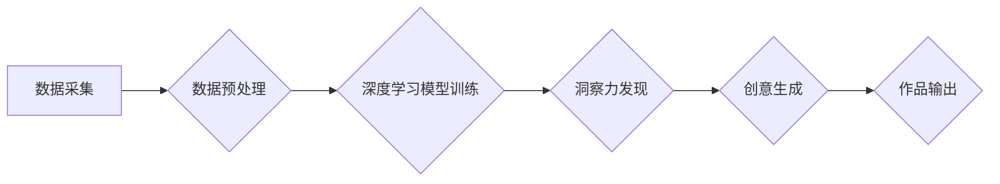

                 

## 洞察力与创造力：灵感的科学解析

> 关键词：人工智能、洞察力、创造力、灵感、算法、神经网络、机器学习、深度学习、认知科学

## 1. 背景介绍

在当今数据爆炸的时代，人工智能 (AI) 正在以惊人的速度发展，其能力不断突破人类的想象。从自动驾驶汽车到医疗诊断，从艺术创作到科学发现，AI 正在改变着我们生活的方方面面。然而，AI 的发展并非仅仅依靠算法和数据，更需要洞察力和创造力来引导其前进。

洞察力是指从纷繁复杂的现象中发现隐藏的规律和本质，并从中获得新的理解和见解的能力。创造力则是指能够产生新颖、独特、有价值的思想、概念或作品的能力。这两项能力是人类智慧的核心，也是推动社会进步的强大动力。

然而，传统人工智能算法往往局限于已有的数据和规则，难以真正理解和解释世界，更难以产生真正的新颖的创意。因此，如何赋予 AI 洞察力和创造力，使其能够像人类一样思考、学习和创新，成为了一个重要的研究课题。

## 2. 核心概念与联系

### 2.1 洞察力与创造力的关系

洞察力和创造力是相互关联、相互促进的。洞察力为创造力提供基础，它帮助我们发现问题、识别机会和理解世界的本质。而创造力则将洞察力转化为行动，将新的想法付诸实践。

### 2.2 AI 洞察力和创造力的实现

AI 的洞察力和创造力可以通过以下几种方式实现：

* **深度学习:** 深度学习算法能够从海量数据中学习复杂的模式和关系，从而提高 AI 的洞察力。
* **强化学习:** 强化学习算法能够通过与环境交互学习，不断优化策略，从而提高 AI 的创造力。
* **进化算法:** 进化算法模拟自然选择的过程，通过迭代和变异，不断优化解决方案，从而提高 AI 的创造力。
* **迁移学习:** 迁移学习算法能够将已有的知识和经验迁移到新的任务中，从而提高 AI 的洞察力和创造力。

**Mermaid 流程图:**



## 3. 核心算法原理 & 具体操作步骤

### 3.1 算法原理概述

本文将重点介绍深度学习算法在 AI 洞察力和创造力中的应用。深度学习算法是一种模仿人类大脑神经网络结构的算法，它能够从数据中学习复杂的特征和模式。

### 3.2 算法步骤详解

1. **数据采集:** 收集大量相关的数据，例如文本、图像、音频等。
2. **数据预处理:** 对数据进行清洗、转换和格式化，使其能够被深度学习模型所接受。
3. **模型构建:** 根据具体任务选择合适的深度学习模型架构，例如卷积神经网络 (CNN)、循环神经网络 (RNN) 或生成对抗网络 (GAN)。
4. **模型训练:** 使用训练数据训练深度学习模型，调整模型参数，使其能够准确地识别和理解数据中的模式。
5. **模型评估:** 使用测试数据评估模型的性能，例如准确率、召回率、F1-score 等。
6. **模型部署:** 将训练好的模型部署到实际应用场景中，例如用于图像识别、文本生成、语音识别等。

### 3.3 算法优缺点

**优点:**

* 能够学习复杂的特征和模式。
* 性能优于传统机器学习算法。
* 能够处理海量数据。

**缺点:**

* 需要大量的训练数据。
* 训练时间长，计算资源消耗大。
* 模型解释性差，难以理解模型的决策过程。

### 3.4 算法应用领域

深度学习算法在各个领域都有广泛的应用，例如：

* **计算机视觉:** 图像识别、物体检测、图像分割、人脸识别等。
* **自然语言处理:** 文本分类、情感分析、机器翻译、文本生成等。
* **语音识别:** 语音转文本、语音合成等。
* **医疗诊断:** 疾病预测、影像分析等。
* **金融分析:** 风险评估、欺诈检测等。

## 4. 数学模型和公式 & 详细讲解 & 举例说明

### 4.1 数学模型构建

深度学习模型的核心是神经网络，它由多个层级的神经元组成。每个神经元接收来自上一层的输入信号，并通过激活函数进行处理，输出到下一层。

**神经网络模型:**

$$
y = f(W_1x_1 + b_1)
$$

其中：

* $y$ 是输出值。
* $x_1$ 是输入值。
* $W_1$ 是权重矩阵。
* $b_1$ 是偏置项。
* $f$ 是激活函数。

### 4.2 公式推导过程

深度学习模型的训练过程是通过反向传播算法来实现的。反向传播算法通过计算误差，并根据误差调整模型参数，使得模型的输出值与真实值之间的差距最小化。

**反向传播算法:**

$$
\Delta W = \eta \frac{\partial Loss}{\partial W}
$$

其中：

* $\Delta W$ 是权重更新量。
* $\eta$ 是学习率。
* $Loss$ 是损失函数。

### 4.3 案例分析与讲解

例如，在图像识别任务中，深度学习模型可以学习到图像中不同物体特征的表示，并将其用于分类。训练过程中，模型会根据图像标签进行调整，使得模型能够准确地识别出图像中的物体。

## 5. 项目实践：代码实例和详细解释说明

### 5.1 开发环境搭建

* Python 3.x
* TensorFlow 或 PyTorch 深度学习框架
* Jupyter Notebook 或 VS Code 开发环境

### 5.2 源代码详细实现

```python
import tensorflow as tf

# 定义模型架构
model = tf.keras.models.Sequential([
    tf.keras.layers.Conv2D(32, (3, 3), activation='relu', input_shape=(28, 28, 1)),
    tf.keras.layers.MaxPooling2D((2, 2)),
    tf.keras.layers.Conv2D(64, (3, 3), activation='relu'),
    tf.keras.layers.MaxPooling2D((2, 2)),
    tf.keras.layers.Flatten(),
    tf.keras.layers.Dense(10, activation='softmax')
])

# 编译模型
model.compile(optimizer='adam',
              loss='sparse_categorical_crossentropy',
              metrics=['accuracy'])

# 训练模型
model.fit(x_train, y_train, epochs=5)

# 评估模型
loss, accuracy = model.evaluate(x_test, y_test)
print('Test loss:', loss)
print('Test accuracy:', accuracy)
```

### 5.3 代码解读与分析

这段代码定义了一个简单的卷积神经网络模型，用于手写数字识别任务。模型包含两个卷积层、两个最大池化层、一个全连接层和一个softmax输出层。

### 5.4 运行结果展示

训练完成后，模型可以用于识别新的手写数字图像。

## 6. 实际应用场景

### 6.1 医疗诊断

深度学习算法可以用于分析医学影像，例如 X 光片、CT 扫描和 MRI 图像，帮助医生诊断疾病。

### 6.2 金融风险评估

深度学习算法可以用于分析金融数据，例如股票价格、交易记录和客户行为，帮助金融机构评估风险和识别欺诈行为。

### 6.3 自动驾驶汽车

深度学习算法可以用于训练自动驾驶汽车的感知系统，帮助汽车识别道路、交通信号和行人。

### 6.4 未来应用展望

随着深度学习算法的不断发展，其在 AI 洞察力和创造力中的应用将更加广泛和深入。例如，未来可能出现能够自动生成创意内容、解决复杂科学问题、甚至进行艺术创作的 AI 系统。

## 7. 工具和资源推荐

### 7.1 学习资源推荐

* **书籍:**
    * 深度学习 (Deep Learning) - Ian Goodfellow, Yoshua Bengio, Aaron Courville
    * 构建深度学习模型 (Hands-On Machine Learning with Scikit-Learn, Keras & TensorFlow) - Aurélien Géron
* **在线课程:**
    * TensorFlow 官方教程: https://www.tensorflow.org/tutorials
    * PyTorch 官方教程: https://pytorch.org/tutorials/

### 7.2 开发工具推荐

* **TensorFlow:** https://www.tensorflow.org/
* **PyTorch:** https://pytorch.org/
* **Keras:** https://keras.io/

### 7.3 相关论文推荐

* **ImageNet Classification with Deep Convolutional Neural Networks** - Alex Krizhevsky, Ilya Sutskever, Geoffrey E. Hinton
* **Generative Adversarial Nets** - Ian Goodfellow, Jean Pouget-Abadie, Mehdi Mirza, Bing Xu, David Warde-Farley, Sherjil Ozair, Aaron Courville, Yoshua Bengio

## 8. 总结：未来发展趋势与挑战

### 8.1 研究成果总结

近年来，深度学习算法在 AI 洞察力和创造力方面取得了显著的进展。例如，在图像识别、文本生成和音乐创作等领域，深度学习模型已经能够达到或超过人类水平。

### 8.2 未来发展趋势

未来，AI 洞察力和创造力将继续朝着以下方向发展:

* **更强大的模型:** 研究人员将继续开发更强大、更复杂的深度学习模型，例如 Transformer 模型和生成式对抗网络 (GAN)。
* **更丰富的应用场景:** 深度学习算法将应用于更多领域，例如科学研究、艺术创作和教育。
* **更强的解释性:** 研究人员将致力于提高深度学习模型的解释性，使其能够更好地解释自己的决策过程。

### 8.3 面临的挑战

尽管深度学习算法取得了巨大进展，但仍面临一些挑战:

* **数据依赖性:** 深度学习算法需要大量的训练数据，而获取高质量数据的成本很高。
* **计算资源:** 训练大型深度学习模型需要大量的计算资源，这对于资源有限的机构来说是一个挑战。
* **伦理问题:** AI 洞察力和创造力的发展也引发了一些伦理问题，例如算法偏见和数据隐私。

### 8.4 研究展望

未来，研究人员将继续探索深度学习算法的潜力，并致力于解决其面临的挑战，以推动 AI 洞察力和创造力的发展，为人类社会带来更多福祉。

## 9. 附录：常见问题与解答

**Q1: 深度学习算法真的能够像人类一样思考吗?**

A1: 目前，深度学习算法仍然无法像人类一样思考。它们只能通过学习数据中的模式来进行预测和生成，缺乏人类的意识、情感和理解能力。

**Q2: 深度学习算法的训练需要多长时间?**

A2: 深度学习算法的训练时间取决于模型的复杂度、数据集的大小和计算资源等因素。训练大型模型可能需要数天甚至数周的时间。

**Q3: 深度学习算法容易出现偏见吗?**

A3: 是的，深度学习算法容易出现偏见，因为它们是根据训练数据进行学习的，而训练数据可能包含社会偏见。


作者：禅与计算机程序设计艺术 / Zen and the Art of Computer Programming 
<end_of_turn>

