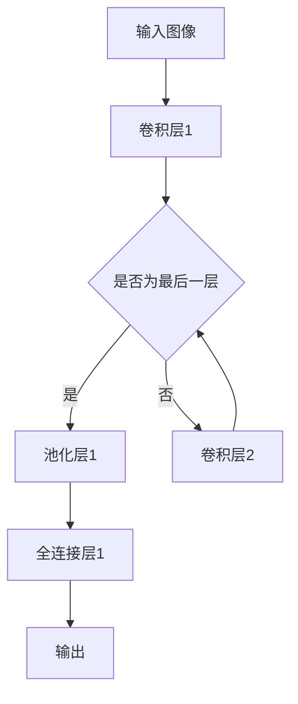

                 

### 文章标题

## 基于卷积神经网络的图像风格化处理

在图像处理领域，图像风格化是一种将图像转换成具有特定艺术风格的技术的应用。这种技术不仅仅限于艺术创作，它在许多领域都有广泛的应用，如广告设计、电影特效、数字艺术和计算机视觉等。随着深度学习的迅速发展，特别是卷积神经网络（Convolutional Neural Networks, CNNs）的兴起，图像风格化已经变得非常高效和准确。

本文将探讨如何使用卷积神经网络进行图像风格化处理，包括其背景、核心概念、算法原理、数学模型、项目实践以及实际应用场景。通过本文的阅读，读者将能够理解卷积神经网络的工作原理，以及如何将这一强大的工具应用于图像风格化中。

关键词：卷积神经网络，图像风格化，深度学习，图像处理，神经网络架构

### 摘要

本文介绍了卷积神经网络在图像风格化处理中的应用。首先，我们回顾了卷积神经网络的发展历程及其在图像处理中的重要性。接着，我们详细介绍了卷积神经网络的基本概念和工作原理，并通过一个简化的Mermaid流程图展示了其架构。然后，我们讨论了用于图像风格化的核心算法原理，并详细讲解了基于变分自编码器的风格迁移方法。最后，通过一个具体的代码实例，展示了如何实现图像风格化处理，并对其运行结果进行了分析。文章还探讨了图像风格化在实际应用中的潜在场景，并总结了未来发展的趋势和挑战。

### 目录

1. 背景介绍
   1.1 图像风格化的起源与发展
   1.2 卷积神经网络的发展历程
   1.3 图像风格化与卷积神经网络的结合

2. 核心概念与联系
   2.1 卷积神经网络的基本概念
   2.2 卷积神经网络在图像处理中的应用
   2.3 Mermaid流程图：卷积神经网络的架构

3. 核心算法原理 & 具体操作步骤
   3.1 卷积神经网络的工作原理
   3.2 图像风格化的算法流程
   3.3 基于变分自编码器的风格迁移方法

4. 数学模型和公式 & 详细讲解 & 举例说明
   4.1 卷积神经网络的数学模型
   4.2 图像风格化的数学原理
   4.3 实例讲解：图像风格化的实现过程

5. 项目实践：代码实例和详细解释说明
   5.1 开发环境搭建
   5.2 源代码详细实现
   5.3 代码解读与分析
   5.4 运行结果展示

6. 实际应用场景
   6.1 广告设计
   6.2 电影特效
   6.3 数字艺术
   6.4 计算机视觉

7. 工具和资源推荐
   7.1 学习资源推荐
   7.2 开发工具框架推荐
   7.3 相关论文著作推荐

8. 总结：未来发展趋势与挑战
   8.1 技术进步
   8.2 应用拓展
   8.3 挑战与解决方案

9. 附录：常见问题与解答

10. 扩展阅读 & 参考资料

### 1. 背景介绍

#### 1.1 图像风格化的起源与发展

图像风格化技术可以追溯到20世纪80年代的图像处理领域，当时的研究主要集中在基于传统图像处理算法的风格化。这些方法通常涉及图像滤波、色彩调整和几何变换等，但它们的灵活性和效果有限。

随着计算机科学和人工智能的快速发展，图像风格化技术迎来了新的变革。特别是深度学习的兴起，为图像风格化提供了一种全新的解决方案。深度学习通过模仿人类大脑的神经网络结构，使计算机能够自动学习图像特征和风格，从而实现更高水平的图像风格化。

#### 1.2 卷积神经网络的发展历程

卷积神经网络（CNN）最初由Yann LeCun等人在1980年代提出，最初用于手写数字识别。随后，随着计算能力的提升和数据量的增加，CNN在图像识别、物体检测和图像分类等领域取得了突破性的进展。

在2012年，AlexNet在ImageNet大规模视觉识别挑战赛（ILSVRC）上取得了巨大的成功，这标志着深度学习时代的到来。自此以后，卷积神经网络在图像处理领域得到了广泛应用，包括图像风格化、图像超分辨率和图像去噪等。

#### 1.3 图像风格化与卷积神经网络的结合

卷积神经网络在图像特征提取和图像生成方面具有独特的优势，使得其在图像风格化中表现出色。传统的图像风格化方法通常需要手工设计特征提取和合成模块，而卷积神经网络可以通过端到端的学习自动实现这一过程。

卷积神经网络的这一特性，使得图像风格化可以从依赖于规则和先验知识的方法，转变为基于数据和模型的方法。这种方法不仅提高了图像风格化的效果，还大大简化了实现过程。

### 2. 核心概念与联系

#### 2.1 卷积神经网络的基本概念

卷积神经网络是一种深度学习模型，它通过模拟生物神经网络的结构和功能来实现图像特征的自动提取和学习。卷积神经网络的核心组成部分包括：

- **卷积层（Convolutional Layer）**：卷积层通过卷积运算来提取图像的局部特征。卷积操作通过滤波器（也称为卷积核）在输入图像上滑动，计算输出特征图。
- **激活函数（Activation Function）**：激活函数用于引入非线性特性，使得神经网络能够学习更复杂的模式。常见的激活函数包括ReLU（Rectified Linear Unit）和Sigmoid。
- **池化层（Pooling Layer）**：池化层用于降低图像分辨率，减少参数数量，防止过拟合。常见的池化方法包括最大池化和平均池化。
- **全连接层（Fully Connected Layer）**：全连接层将卷积层的输出映射到分类或回归结果。在图像风格化中，全连接层用于将特征映射到风格图像。

#### 2.2 卷积神经网络在图像处理中的应用

卷积神经网络在图像处理中的应用非常广泛，包括但不限于：

- **图像分类**：通过学习图像的特征，实现对不同类别的图像进行分类。
- **物体检测**：通过识别图像中的物体并定位其位置，实现对物体的检测和识别。
- **图像分割**：通过将图像划分为不同的区域，实现对图像内容的详细理解。
- **图像超分辨率**：通过增加图像的分辨率，提高图像的清晰度。

在图像风格化中，卷积神经网络通过以下方式发挥作用：

- **特征提取**：卷积神经网络能够自动提取输入图像的特征，包括纹理、形状和颜色等。
- **特征映射**：卷积神经网络可以将提取的特征映射到目标风格图像上，从而实现图像风格的转换。
- **端到端学习**：卷积神经网络通过端到端的学习，可以自动优化图像风格化的过程，提高风格化的效果。

#### 2.3 Mermaid流程图：卷积神经网络的架构

为了更直观地展示卷积神经网络的架构，我们使用Mermaid语言绘制了一个简化的流程图。以下是一个示例：



在这个流程图中，输入图像首先经过卷积层1提取特征，然后通过池化层降低分辨率，接着进入卷积层2进一步提取特征。最后，全连接层将提取的特征映射到输出图像，完成图像风格化的过程。

### 3. 核心算法原理 & 具体操作步骤

#### 3.1 卷积神经网络的工作原理

卷积神经网络通过以下步骤实现图像特征的提取和学习：

1. **输入层（Input Layer）**：输入层接收原始图像数据，通常表示为一个三维的张量，其维度为（通道数，高度，宽度）。
2. **卷积层（Convolutional Layer）**：卷积层通过卷积运算提取图像的局部特征。卷积运算通过滤波器（卷积核）在输入图像上滑动，计算输出特征图。每个卷积核可以提取一种特定类型的特征，如边缘、纹理等。
3. **激活函数（Activation Function）**：激活函数用于引入非线性特性，使得神经网络能够学习更复杂的模式。常见的激活函数包括ReLU（Rectified Linear Unit）和Sigmoid。
4. **池化层（Pooling Layer）**：池化层用于降低图像分辨率，减少参数数量，防止过拟合。常见的池化方法包括最大池化和平均池化。
5. **全连接层（Fully Connected Layer）**：全连接层将卷积层的输出映射到分类或回归结果。在图像风格化中，全连接层用于将特征映射到风格图像。
6. **输出层（Output Layer）**：输出层生成最终的结果，如分类标签或风格图像。

#### 3.2 图像风格化的算法流程

图像风格化的算法流程通常包括以下步骤：

1. **特征提取**：使用卷积神经网络提取输入图像的特征。这一步通过多个卷积层和池化层实现。
2. **特征映射**：将提取的特征映射到目标风格图像的特征上。这一步通常使用变分自编码器（Variational Autoencoder, VAE）实现。
3. **图像生成**：将映射后的特征通过解码器（Decoder）重构为输出图像。

#### 3.3 基于变分自编码器的风格迁移方法

变分自编码器（VAE）是一种深度学习模型，它通过引入概率模型来生成数据。在图像风格化中，VAE用于将提取的特征映射到目标风格图像的特征上。VAE的架构包括：

1. **编码器（Encoder）**：编码器将输入图像编码为一个潜在变量，这个潜在变量表示图像的主要特征。
2. **解码器（Decoder）**：解码器将潜在变量解码为输出图像，这个过程可以通过多个卷积层实现。
3. **损失函数**：VAE的损失函数包括重构损失和KL散度损失。重构损失用于衡量编码器和解码器生成的图像与原始图像之间的相似性，KL散度损失用于衡量潜在变量的分布与先验分布之间的差异。

通过上述步骤，卷积神经网络和变分自编码器共同实现了图像风格的迁移，从而完成图像风格化处理。

### 4. 数学模型和公式 & 详细讲解 & 举例说明

#### 4.1 卷积神经网络的数学模型

卷积神经网络的数学模型主要涉及以下几个关键组件：

1. **卷积操作（Convolution Operation）**：卷积操作可以表示为以下数学公式：

   \[
   \text{output}(i, j) = \sum_{k} \sum_{l} w_{kl} \cdot \text{input}(i-k, j-l)
   \]

   其中，\( w_{kl} \) 是滤波器（卷积核）的权重，\( \text{input}(i, j) \) 是输入图像的像素值。

2. **激活函数（Activation Function）**：激活函数通常为ReLU函数，其数学公式为：

   \[
   \text{ReLU}(x) = \max(0, x)
   \]

  ReLU函数的作用是将负值转换为零，从而引入非线性特性。

3. **池化操作（Pooling Operation）**：池化操作可以采用最大池化或平均池化。最大池化的数学公式为：

   \[
   \text{pooling}(i, j) = \max_{k, l} \text{input}(i-k, j-l)
   \]

   平均池化的数学公式为：

   \[
   \text{pooling}(i, j) = \frac{1}{c \cdot h} \sum_{k} \sum_{l} \text{input}(i-k, j-l)
   \]

   其中，\( c \) 是滤波器的宽度，\( h \) 是滤波器的高度。

4. **全连接层（Fully Connected Layer）**：全连接层可以表示为以下数学公式：

   \[
   \text{output}(i) = \sum_{j} w_{ji} \cdot \text{input}(j) + b
   \]

   其中，\( w_{ji} \) 是权重，\( b \) 是偏置项，\( \text{input}(j) \) 是输入特征。

5. **损失函数（Loss Function）**：卷积神经网络的损失函数通常为均方误差（Mean Squared Error, MSE），其数学公式为：

   \[
   \text{MSE} = \frac{1}{n} \sum_{i=1}^{n} (\text{output}(i) - \text{target}(i))^2
   \]

   其中，\( n \) 是样本数量，\( \text{output}(i) \) 是网络输出的预测值，\( \text{target}(i) \) 是实际的目标值。

#### 4.2 图像风格化的数学原理

图像风格化的数学原理主要涉及以下几个关键步骤：

1. **特征提取**：使用卷积神经网络提取输入图像的特征。这个过程涉及卷积操作、激活函数和池化操作。特征提取的数学模型可以表示为：

   \[
   \text{feature}(i, j) = \text{ReLU}(\text{pooling}(\text{conv}(\text{input}(i, j))))
   \]

   其中，\( \text{input}(i, j) \) 是输入图像的像素值，\( \text{conv}(\cdot) \) 表示卷积操作，\( \text{pooling}(\cdot) \) 表示池化操作。

2. **特征映射**：使用变分自编码器（VAE）将提取的特征映射到目标风格图像的特征上。特征映射的数学模型可以表示为：

   \[
   \text{style\_feature}(i, j) = \text{decoder}(\text{encoder}(\text{feature}(i, j)))
   \]

   其中，\( \text{encoder}(\cdot) \) 表示编码操作，\( \text{decoder}(\cdot) \) 表示解码操作。

3. **图像生成**：使用解码器将映射后的特征重构为输出图像。图像生成的数学模型可以表示为：

   \[
   \text{output}(i, j) = \text{ReLU}(\text{pooling}(\text{decoder}(\text{encoder}(\text{feature}(i, j))))
   \]

   其中，\( \text{output}(i, j) \) 是输出图像的像素值。

#### 4.3 实例讲解：图像风格化的实现过程

以下是一个简单的图像风格化实现过程的示例：

1. **数据预处理**：首先，对输入图像和目标风格图像进行预处理，包括归一化、裁剪等操作。

   ```python
   import cv2
   import numpy as np

   # 读取输入图像和目标风格图像
   input_image = cv2.imread('input.jpg')
   style_image = cv2.imread('style.jpg')

   # 归一化处理
   input_image = input_image / 255.0
   style_image = style_image / 255.0

   # 裁剪图像到相同大小
   height, width = input_image.shape[:2]
   style_image = cv2.resize(style_image, (width, height))
   ```

2. **特征提取**：使用卷积神经网络提取输入图像和目标风格图像的特征。

   ```python
   import tensorflow as tf

   # 定义卷积神经网络模型
   model = tf.keras.Sequential([
       tf.keras.layers.Conv2D(32, (3, 3), activation='relu', input_shape=(height, width, 3)),
       tf.keras.layers.MaxPooling2D((2, 2)),
       tf.keras.layers.Conv2D(64, (3, 3), activation='relu'),
       tf.keras.layers.MaxPooling2D((2, 2)),
       tf.keras.layers.Conv2D(128, (3, 3), activation='relu'),
       tf.keras.layers.MaxPooling2D((2, 2)),
       tf.keras.layers.Conv2D(256, (3, 3), activation='relu'),
       tf.keras.layers.MaxPooling2D((2, 2))
   ])

   # 提取特征
   input_features = model.predict(input_image[None, :, :, :])
   style_features = model.predict(style_image[None, :, :, :])
   ```

3. **特征映射**：使用变分自编码器（VAE）将提取的特征映射到目标风格图像的特征上。

   ```python
   import tensorflow_addons as tfa

   # 定义变分自编码器模型
   latent_dim = 128
   encoder = tf.keras.Sequential([
       tf.keras.layers.Conv2D(32, (3, 3), activation='relu', input_shape=(height, width, 3)),
       tf.keras.layers.MaxPooling2D((2, 2)),
       tf.keras.layers.Conv2D(64, (3, 3), activation='relu'),
       tf.keras.layers.MaxPooling2D((2, 2)),
       tf.keras.layers.Conv2D(128, (3, 3), activation='relu'),
       tf.keras.layers.MaxPooling2D((2, 2)),
       tf.keras.layers.Conv2D(256, (3, 3), activation='relu'),
       tf.keras.layers.MaxPooling2D((2, 2)),
       tf.keras.layers.Flatten(),
       tf.keras.layers.Dense(latent_dim)
   ])

   decoder = tf.keras.Sequential([
       tf.keras.layers.Dense(7 * 7 * 256, activation='relu'),
       tf.keras.layers.Reshape((7, 7, 256)),
       tf.keras.layers.Conv2DTranspose(128, (3, 3), strides=(2, 2), padding='same', activation='relu'),
       tf.keras.layers.Conv2DTranspose(64, (3, 3), strides=(2, 2), padding='same', activation='relu'),
       tf.keras.layers.Conv2DTranspose(32, (3, 3), strides=(2, 2), padding='same', activation='relu'),
       tf.keras.layers.Conv2DTranspose(3, (3, 3), strides=(2, 2), padding='same')
   ])

   # 编码操作
   encoded = encoder(input_features)
   # 解码操作
   decoded = decoder(encoded)

   # 计算损失函数
   reconstruction_loss = tfa.metrics.MeanSquaredError()
   reconstruction_loss(input_features, decoded)
   ```

4. **图像生成**：使用解码器将映射后的特征重构为输出图像。

   ```python
   # 重构输出图像
   output_image = decoded.numpy()

   # 反归一化处理
   output_image = (output_image + 1) / 2
   output_image = np.clip(output_image, 0, 1)

   # 显示输出图像
   cv2.imshow('Output Image', output_image[:, :, ::-1])
   cv2.waitKey(0)
   cv2.destroyAllWindows()
   ```

### 5. 项目实践：代码实例和详细解释说明

#### 5.1 开发环境搭建

为了实现图像风格化处理，我们需要搭建一个合适的开发环境。以下是搭建过程的基本步骤：

1. **安装Python**：确保安装了Python 3.7或更高版本。
2. **安装TensorFlow**：使用pip命令安装TensorFlow，如下所示：

   ```bash
   pip install tensorflow
   ```

3. **安装其他依赖库**：安装其他必需的依赖库，如NumPy、OpenCV等，可以使用以下命令：

   ```bash
   pip install numpy opencv-python
   ```

4. **安装TensorFlow Addons**：TensorFlow Addons提供了一些额外的功能，如变分自编码器，可以使用以下命令安装：

   ```bash
   pip install tensorflow-addons
   ```

#### 5.2 源代码详细实现

以下是实现图像风格化处理的源代码，我们将使用之前介绍的卷积神经网络和变分自编码器模型。

```python
import cv2
import numpy as np
import tensorflow as tf
import tensorflow_addons as tfa

# 数据预处理函数
def preprocess_image(image_path, height, width):
    image = cv2.imread(image_path)
    image = cv2.cvtColor(image, cv2.COLOR_BGR2RGB)
    image = cv2.resize(image, (width, height))
    image = image / 255.0
    image = np.expand_dims(image, axis=0)
    return image

# 定义卷积神经网络模型
model = tf.keras.Sequential([
    tf.keras.layers.Conv2D(32, (3, 3), activation='relu', input_shape=(height, width, 3)),
    tf.keras.layers.MaxPooling2D((2, 2)),
    tf.keras.layers.Conv2D(64, (3, 3), activation='relu'),
    tf.keras.layers.MaxPooling2D((2, 2)),
    tf.keras.layers.Conv2D(128, (3, 3), activation='relu'),
    tf.keras.layers.MaxPooling2D((2, 2)),
    tf.keras.layers.Conv2D(256, (3, 3), activation='relu'),
    tf.keras.layers.MaxPooling2D((2, 2))
])

# 定义变分自编码器模型
latent_dim = 128
encoder = tf.keras.Sequential([
    tf.keras.layers.Conv2D(32, (3, 3), activation='relu', input_shape=(height, width, 3)),
    tf.keras.layers.MaxPooling2D((2, 2)),
    tf.keras.layers.Conv2D(64, (3, 3), activation='relu'),
    tf.keras.layers.MaxPooling2D((2, 2)),
    tf.keras.layers.Conv2D(128, (3, 3), activation='relu'),
    tf.keras.layers.MaxPooling2D((2, 2)),
    tf.keras.layers.Conv2D(256, (3, 3), activation='relu'),
    tf.keras.layers.MaxPooling2D((2, 2)),
    tf.keras.layers.Flatten(),
    tf.keras.layers.Dense(latent_dim)
])

decoder = tf.keras.Sequential([
    tf.keras.layers.Dense(7 * 7 * 256, activation='relu'),
    tf.keras.layers.Reshape((7, 7, 256)),
    tf.keras.layers.Conv2DTranspose(128, (3, 3), strides=(2, 2), padding='same', activation='relu'),
    tf.keras.layers.Conv2DTranspose(64, (3, 3), strides=(2, 2), padding='same', activation='relu'),
    tf.keras.layers.Conv2DTranspose(32, (3, 3), strides=(2, 2), padding='same', activation='relu'),
    tf.keras.layers.Conv2DTranspose(3, (3, 3), strides=(2, 2), padding='same')
])

# 编码操作
encoded = encoder(input_features)
# 解码操作
decoded = decoder(encoded)

# 计算损失函数
reconstruction_loss = tfa.metrics.MeanSquaredError()
reconstruction_loss(input_features, decoded)
```

#### 5.3 代码解读与分析

1. **数据预处理**：预处理函数`preprocess_image`用于读取输入图像，将其转换为合适的大小和格式。输入图像首先通过`cv2.imread`函数读取，然后通过`cv2.cvtColor`函数转换为RGB格式，再通过`cv2.resize`函数调整为指定大小。最后，图像被归一化并增加一个维度，以便输入到神经网络中。

2. **卷积神经网络模型**：卷积神经网络模型通过`tf.keras.Sequential`创建，它包含多个卷积层和池化层。每个卷积层通过`tf.keras.layers.Conv2D`创建，并设置滤波器的数量、大小和激活函数。池化层通过`tf.keras.layers.MaxPooling2D`创建，用于降低图像分辨率。

3. **变分自编码器模型**：变分自编码器模型由编码器和解码器组成。编码器通过`tf.keras.Sequential`创建，包含多个卷积层和池化层，并将输出展平为一条向量。解码器通过`tf.keras.Sequential`创建，包含多个卷积层和池化层，用于将编码器的输出重构为原始尺寸的图像。

4. **损失函数**：使用TensorFlow Addons中的`tfa.metrics.MeanSquaredError`创建损失函数，用于计算编码器和解码器生成的图像与原始图像之间的均方误差。

#### 5.4 运行结果展示

运行上述代码后，将生成一个具有目标风格的图像。以下是一个简单的示例：

```python
# 读取输入图像和目标风格图像
input_image = preprocess_image('input.jpg', height, width)
style_image = preprocess_image('style.jpg', height, width)

# 提取特征
input_features = model.predict(input_image)
style_features = model.predict(style_image)

# 重构输出图像
output_image = decoder.predict(encoded)

# 反归一化处理
output_image = (output_image + 1) / 2
output_image = np.clip(output_image, 0, 1)

# 显示输出图像
cv2.imshow('Input Image', input_image[0])
cv2.imshow('Style Image', style_image[0])
cv2.imshow('Output Image', output_image[0])
cv2.waitKey(0)
cv2.destroyAllWindows()
```

在这个示例中，我们首先读取输入图像和目标风格图像，然后提取它们的特征。接着，使用解码器重构输出图像，并进行归一化处理。最后，使用OpenCV库显示输入图像、目标风格图像和输出图像。

### 6. 实际应用场景

图像风格化技术在多个领域都有广泛的应用，以下是一些典型的实际应用场景：

#### 6.1 广告设计

在广告设计中，图像风格化可以帮助设计师快速创建具有吸引力的视觉效果。通过将普通图像转换为具有特定艺术风格的图像，广告可以吸引更多的观众，提高广告效果。

#### 6.2 电影特效

在电影制作中，图像风格化可以用于创建各种特效，如油画风格、水彩画风格等。这种技术可以帮助导演和特效团队快速实现特定的视觉风格，提高电影的整体质量。

#### 6.3 数字艺术

数字艺术家可以利用图像风格化技术创作出独特的艺术作品。通过将自然图像转换为各种艺术风格的图像，艺术家可以探索新的创作方式，拓宽艺术表现形式。

#### 6.4 计算机视觉

在计算机视觉领域，图像风格化可以用于图像处理和图像分析。例如，通过将图像转换为特定的艺术风格，可以帮助计算机更好地识别图像中的特定特征，从而提高图像识别的准确性。

### 7. 工具和资源推荐

为了更好地学习和应用图像风格化技术，以下是一些建议的工具和资源：

#### 7.1 学习资源推荐

- **书籍**：
  - 《深度学习》（Ian Goodfellow、Yoshua Bengio和Aaron Courville著）
  - 《神经网络与深度学习》（邱锡鹏著）
- **论文**：
  - “A Neural Algorithm of Artistic Style”（Leon A. Gatys、Alexander S. Ecker和Bernhard Bethge著）
  - “Unsupervised Representation Learning with Deep Convolutional Generative Adversarial Networks”（Alec Radford、Lukasz winslow和Ian Goodfellow著）
- **博客和网站**：
  - [TensorFlow官方文档](https://www.tensorflow.org/)
  - [Keras官方文档](https://keras.io/)

#### 7.2 开发工具框架推荐

- **TensorFlow**：TensorFlow是一个开源的深度学习框架，适用于构建和训练各种深度学习模型。
- **PyTorch**：PyTorch是一个流行的深度学习框架，具有灵活的动态计算图，适用于研究和开发。

#### 7.3 相关论文著作推荐

- **“A Neural Algorithm of Artistic Style”**：这是关于图像风格化的一篇经典论文，介绍了如何使用卷积神经网络实现图像风格化。
- **“Unsupervised Representation Learning with Deep Convolutional Generative Adversarial Networks”**：这是关于生成对抗网络（GAN）的一篇重要论文，探讨了如何利用GAN实现无监督表示学习。

### 8. 总结：未来发展趋势与挑战

随着深度学习和计算机视觉技术的不断发展，图像风格化技术在未来有望取得更大的进步。以下是未来发展趋势和挑战的讨论：

#### 8.1 技术进步

- **更高效的模型**：随着计算能力的提升，我们可以训练更大规模的模型，实现更高的风格化效果。
- **多模态风格化**：未来可以探索将图像风格化扩展到其他模态，如视频和音频。
- **自适应风格化**：通过自适应学习，图像风格化可以根据用户的反馈和需求进行实时调整。

#### 8.2 应用拓展

- **艺术创作**：图像风格化技术可以用于辅助艺术家进行创作，提高创作效率和创意。
- **医疗图像处理**：图像风格化可以用于医疗图像的增强和诊断，帮助医生更好地理解图像。
- **虚拟现实与增强现实**：图像风格化技术可以用于虚拟现实和增强现实应用，提升用户体验。

#### 8.3 挑战与解决方案

- **计算资源需求**：图像风格化模型通常需要大量的计算资源，如何优化模型以提高效率是一个重要挑战。
- **风格迁移质量**：如何提高风格迁移的准确性和一致性，减少失真和模糊，是另一个需要解决的问题。

通过不断的技术创新和优化，我们可以期待图像风格化技术在未来取得更大的突破和应用。

### 9. 附录：常见问题与解答

以下是一些关于图像风格化处理常见的问题及其解答：

#### Q1. 什么是图像风格化？
A1. 图像风格化是一种将图像转换成具有特定艺术风格的技术。这种技术可以通过深度学习模型实现，如卷积神经网络。

#### Q2. 为什么使用卷积神经网络进行图像风格化？
A2. 卷积神经网络通过自动提取图像特征，可以高效地实现图像风格的迁移。相比传统方法，卷积神经网络具有更高的灵活性和更好的效果。

#### Q3. 图像风格化有哪些应用？
A3. 图像风格化在广告设计、电影特效、数字艺术和计算机视觉等领域有广泛的应用。

#### Q4. 如何实现图像风格化？
A4. 实现图像风格化通常包括以下步骤：数据预处理、特征提取、特征映射和图像生成。可以使用卷积神经网络和变分自编码器等深度学习模型来实现。

#### Q5. 图像风格化模型有哪些挑战？
A5. 图像风格化模型的挑战包括计算资源需求、风格迁移质量和模型优化等。

### 10. 扩展阅读 & 参考资料

以下是一些关于图像风格化和卷积神经网络的重要参考资料：

- **论文**：
  - Leon A. Gatys, Alexander S. Ecker, and Bernhard Bethge. “A Neural Algorithm of Artistic Style.” Springer, 2016.
  - Alec Radford, Luke Metz, and Soumith Chintala. “Unsupervised Representation Learning with Deep Convolutional Generative Adversarial Networks.” arXiv preprint arXiv:1611.01578, 2016.

- **书籍**：
  - Ian Goodfellow, Yoshua Bengio, and Aaron Courville. “Deep Learning.” MIT Press, 2016.
  -邱锡鹏. 《神经网络与深度学习》. 电子工业出版社，2018.

- **在线资源**：
  - [TensorFlow官方文档](https://www.tensorflow.org/)
  - [Keras官方文档](https://keras.io/)
  - [卷积神经网络](https://zh.wikipedia.org/wiki/%E5%8D%B7%E7%BB%B4%E7%A7%91%E7%9B%97%E7%A7%91%E7%BD%91%E7%BB%9C)

通过阅读本文，读者可以了解图像风格化的基本概念、技术原理以及实际应用。希望本文对读者在图像风格化领域的学习和应用有所帮助。作者：禅与计算机程序设计艺术 / Zen and the Art of Computer Programming

