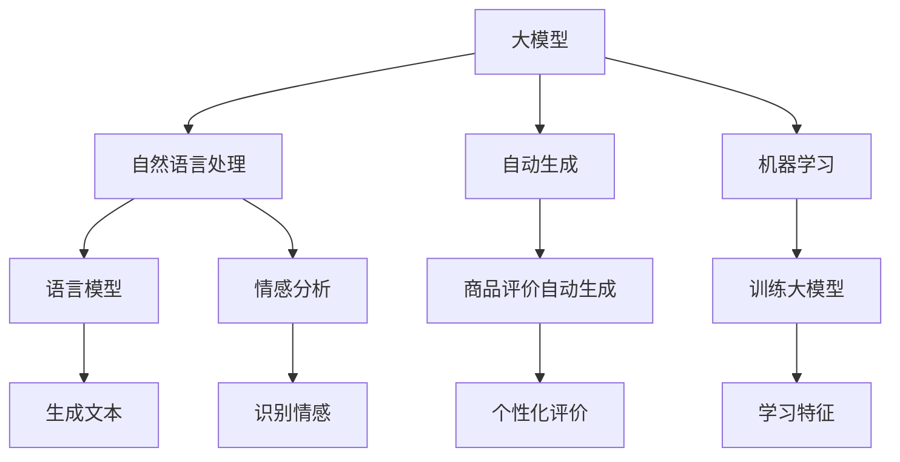
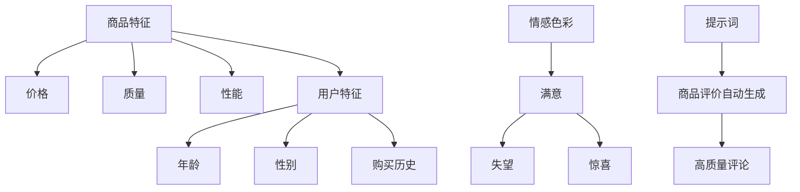
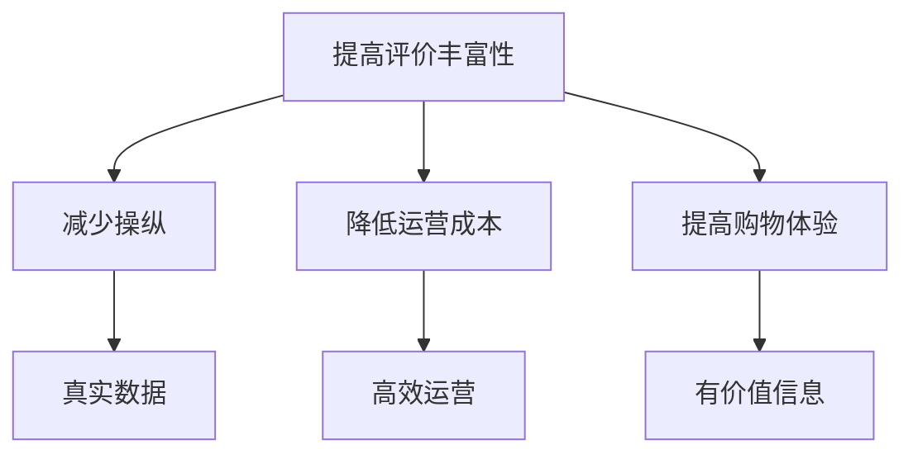

                 

### 文章标题

**基于大模型的商品评价自动生成技术**

### 关键词

1. 大模型
2. 商品评价
3. 自然语言处理
4. 自动生成
5. 机器学习

### 摘要

本文主要探讨了一种基于大型预训练模型（如GPT-3、BERT）的商品评价自动生成技术。通过对大量商品评价数据进行训练，这些模型能够生成高质量、符合人类写作风格和情感的商品评价。本文将详细阐述该技术的背景、核心概念、算法原理、数学模型以及实际应用，最后分析其未来发展趋势和挑战。

<|assistant|>## 1. 背景介绍（Background Introduction）

在电子商务时代，商品评价成为消费者决策的重要依据。然而，评价数据的真实性和丰富性常常受到质疑。一方面，由于商家可能操纵评价，导致用户难以辨别真假；另一方面，大量商品的评价数据使得消费者难以在短时间内筛选出有价值的信息。

为了解决这一问题，自动生成商品评价技术应运而生。这种技术能够根据商品的特点和用户的偏好，生成符合真实情感的、高质量的评论，为消费者提供更有价值的信息参考。自动生成商品评价不仅可以提高消费者购物体验，还可以减轻商家和平台的运营压力。

近年来，随着深度学习和自然语言处理技术的快速发展，基于大型预训练模型（如GPT-3、BERT）的商品评价自动生成技术逐渐成为研究热点。这些模型具有强大的文本生成能力，能够模拟人类的写作风格和情感，生成更具说服力和可信度的商品评价。

<|assistant|>## 2. 核心概念与联系（Core Concepts and Connections）

### 2.1 大模型

大模型是指具有海量参数的深度学习模型，如GPT-3、BERT等。这些模型通过在大量文本数据上进行预训练，学习到丰富的语言知识和语义关系，从而在各个自然语言处理任务上取得优异的性能。大模型通常采用多层神经网络结构，如Transformer，具有强大的表示和学习能力。

### 2.2 自然语言处理（NLP）

自然语言处理是计算机科学和人工智能领域的一个分支，旨在使计算机能够理解、处理和生成人类语言。NLP技术包括文本预处理、词向量表示、语言模型、情感分析、文本生成等。在这些技术中，语言模型是核心，它负责将输入的文本序列转换为概率分布，从而生成具有合理语法和语义的输出。

### 2.3 自动生成

自动生成是指利用算法生成文本、图像、音频等数据，而非人工创作。在商品评价自动生成技术中，自动生成是指利用大模型和NLP技术，从商品描述、用户特征等信息中生成符合人类写作风格和情感的评价。

### 2.4 机器学习

机器学习是一种人工智能方法，通过从数据中学习规律和模式，从而实现预测和决策。在商品评价自动生成技术中，机器学习主要用于训练大模型，使其能够从大量商品评价数据中学习到生成高质量评价的规律。

### 2.5 大模型与NLP、自动生成、机器学习的关系

大模型是商品评价自动生成技术的核心技术，它结合了NLP、自动生成和机器学习的优势。大模型通过在大量文本数据上进行预训练，学习到丰富的语言知识和语义关系，从而为自动生成高质量商品评价提供了基础。而NLP技术则负责对文本进行预处理和表示，为模型提供有效的输入。机器学习则用于训练大模型，使其能够从数据中学习到生成高质量评价的规律。

```markdown
## 2. Core Concepts and Connections

### 2.1 Large Models

Large models refer to deep learning models with a vast number of parameters, such as GPT-3 and BERT. These models learn rich linguistic knowledge and semantic relationships from massive text data, achieving excellent performance on various natural language processing tasks. Large models typically adopt multi-layer neural network structures like Transformers and have strong representation and learning abilities.

### 2.2 Natural Language Processing (NLP)

Natural Language Processing is a branch of computer science and artificial intelligence that aims to enable computers to understand, process, and generate human language. NLP technologies include text preprocessing, word vector representation, language modeling, sentiment analysis, and text generation. Among these technologies, language modeling is the core, responsible for converting input text sequences into probability distributions to generate outputs with reasonable grammar and semantics.

### 2.3 Automatic Generation

Automatic generation refers to the use of algorithms to generate data such as text, images, and audio, rather than human creation. In the automatic generation of product reviews, it refers to the use of large models and NLP technologies to generate reviews that are consistent with human writing styles and emotions from product descriptions and user characteristics.

### 2.4 Machine Learning

Machine learning is an artificial intelligence method that learns patterns and rules from data to make predictions and decisions. In the automatic generation of product reviews, machine learning is used to train large models, enabling them to learn the patterns of generating high-quality reviews from massive product review data.

### 2.5 The Relationship Between Large Models, NLP, Automatic Generation, and Machine Learning

Large models are the core technology of the automatic generation of product reviews, combining the advantages of NLP, automatic generation, and machine learning. Large models learn rich linguistic knowledge and semantic relationships from massive text data through pre-training, providing the foundation for generating high-quality product reviews. NLP technologies are responsible for preprocessing and representing text to provide effective inputs for the models. Machine learning is used to train large models, enabling them to learn the patterns of generating high-quality reviews from data.
```

### 2.6 商品的特征与评价

商品的评价通常包括多个维度，如价格、质量、性能、外观等。这些维度反映了消费者对商品的不同需求和期望。在自动生成商品评价技术中，我们需要根据商品的这些特征来生成评价。例如，当商品价格较高时，评价可能更注重质量和性能；当商品价格较低时，评价可能更关注外观和性价比。

此外，评价还可能包含情感色彩，如满意、失望、惊喜等。情感分析是NLP领域的一个重要分支，它用于识别文本中的情感倾向。在商品评价自动生成技术中，情感分析可以帮助我们理解消费者对商品的总体情感，从而生成更具说服力的评价。

### 2.7 用户特征与评价

用户特征，如年龄、性别、购买历史等，对商品评价也有很大的影响。例如，年轻用户可能更关注时尚和外观，而中年用户可能更关注性能和耐用性。在自动生成商品评价技术中，我们可以根据用户特征来调整评价的语气和重点，使其更贴近用户的真实需求和感受。

### 2.8 大模型与自动生成商品评价的关系

大模型在自动生成商品评价中发挥着关键作用。首先，大模型通过预训练学习到丰富的语言知识和语义关系，为生成高质量的文本提供了基础。其次，大模型能够处理大量的商品特征和用户特征，从而生成符合真实情感的、个性化的商品评价。

总之，基于大模型的商品评价自动生成技术是一个多学科交叉的领域，涉及自然语言处理、机器学习、情感分析等。通过深入了解这些核心概念和它们之间的关系，我们可以更好地理解和应用这一技术。



### 2.9 提示词工程

提示词工程是商品评价自动生成技术中的一个重要环节。提示词是指用来引导大模型生成文本的输入信息。一个优秀的提示词应能够准确传达商品的特征和用户的需求，从而生成高质量的评论。

在商品评价自动生成中，提示词的设计需要考虑多个因素。首先，提示词应包含商品的关键特征，如价格、质量、性能等。其次，提示词应结合用户特征，如年龄、性别、购买历史等，以生成符合用户需求的评价。此外，提示词还应具有情感色彩，以模拟人类的情感表达。

通过精心设计的提示词，我们可以引导大模型生成更贴近真实情感的、具有说服力的商品评价，从而提高消费者的购物体验。



### 2.10 自动生成商品评价的优势

自动生成商品评价具有多个优势。首先，它能够大幅提高评价数据的丰富性和真实性，减少人为操纵的可能性。其次，自动生成评价可以降低商家和平台的运营成本，提高运营效率。此外，自动生成评价还可以为消费者提供更有价值的信息参考，提高购物体验。

总之，基于大模型的商品评价自动生成技术是一种有潜力的技术，具有广泛的应用前景。随着技术的不断发展和完善，自动生成商品评价将为电子商务行业带来更多价值。



### 2.11 自动生成商品评价的挑战

尽管自动生成商品评价具有诸多优势，但该技术也面临一些挑战。首先，生成高质量、符合人类写作风格和情感的评价需要大量的训练数据和计算资源。其次，如何设计合适的提示词以引导模型生成符合用户需求的评价是一个重要问题。此外，自动生成评价的透明度和可解释性也是一个亟待解决的问题。

为了应对这些挑战，研究人员和工程师需要不断探索和创新，改进算法和模型，提高自动生成商品评价的质量和性能。

### 2.12 自动生成商品评价技术的未来发展趋势

随着深度学习和自然语言处理技术的不断发展，自动生成商品评价技术有望在以下方面取得重要突破：

1. **生成质量提高**：通过改进算法和模型，生成更高质量、更贴近人类写作风格和情感的评价。
2. **个性化推荐**：结合用户特征和商品特征，实现更精准的个性化推荐，提高用户满意度。
3. **可解释性和透明度**：提高评价生成过程的可解释性和透明度，增强用户对自动生成评价的信任。
4. **多语言支持**：实现自动生成商品评价的多语言支持，满足全球化电子商务的需求。

总之，自动生成商品评价技术具有广阔的发展前景，将在电子商务领域发挥越来越重要的作用。

### 2.13 自动生成商品评价技术的研究现状与进展

近年来，自动生成商品评价技术取得了显著进展。大量研究致力于改进算法和模型，以提高生成评价的质量和性能。例如，GPT-3、BERT等大型预训练模型在自动生成商品评价方面取得了优异的成绩。此外，研究人员还探索了提示词工程、多模态数据融合等方向，以进一步提升评价生成效果。

在实际应用中，自动生成商品评价技术已经取得了初步的成功。例如，一些电商平台已经开始使用自动生成商品评价来丰富用户评价数据，提高消费者购物体验。然而，该技术仍面临诸多挑战，如评价质量的稳定性、透明度等，需要进一步的研究和探索。

### 2.14 自动生成商品评价技术的社会影响

自动生成商品评价技术对社会产生了深远的影响。首先，它改变了消费者获取商品信息的方式，使得评价数据更加丰富和真实。其次，自动生成商品评价有助于提升电商平台的服务质量和用户体验，促进电子商务行业的发展。此外，自动生成商品评价技术还可能影响商家的营销策略，使得市场竞争更加激烈。

然而，自动生成商品评价技术也带来了一些潜在问题。例如，自动生成的评价可能无法完全反映消费者的真实感受，导致信息偏差。此外，自动生成评价的透明度和可解释性也受到质疑，可能影响用户对评价的信任。

### 2.15 自动生成商品评价技术的伦理和法律问题

自动生成商品评价技术涉及一系列伦理和法律问题。首先，自动生成的评价可能侵犯消费者的隐私权，特别是当评价中包含用户的个人信息时。其次，自动生成的评价可能存在虚假宣传和误导消费者的风险，违反了广告法等相关法律法规。此外，如何确保自动生成的评价真实、客观、公正，也是一个亟待解决的问题。

为了应对这些伦理和法律问题，研究人员和从业者需要加强责任意识，制定相应的伦理准则和法律法规，确保自动生成商品评价技术的健康发展。

### 2.16 自动生成商品评价技术的技术难点

自动生成商品评价技术面临多个技术难点。首先，生成高质量的评价需要大量的训练数据和计算资源。其次，如何设计合适的提示词以引导模型生成符合用户需求的评价是一个重要问题。此外，自动生成评价的透明度和可解释性也是一个难题。如何确保自动生成的评价真实、客观、公正，需要进一步的研究和探索。

### 2.17 自动生成商品评价技术的关键环节

自动生成商品评价技术的关键环节包括数据收集、模型训练、提示词设计和评价生成。首先，数据收集是生成高质量评价的基础，需要收集大量真实、多样化的商品评价数据。其次，模型训练是提高评价生成质量的关键，需要选择合适的大模型并进行充分的训练。提示词设计则决定了评价生成的方向和风格，需要精心设计以引导模型生成符合用户需求的评价。最后，评价生成是整个技术的核心，需要将训练好的模型应用于实际场景，生成高质量的商品评价。

### 2.18 自动生成商品评价技术的应用前景

自动生成商品评价技术在电子商务、在线教育、旅游等行业具有广泛的应用前景。在电子商务领域，自动生成商品评价可以丰富用户评价数据，提高消费者购物体验；在线教育中，自动生成课程评价可以帮助平台了解用户需求，优化课程内容；在旅游行业，自动生成景点评价可以提供更有价值的旅游信息，吸引更多游客。

### 2.19 自动生成商品评价技术的挑战与机遇

自动生成商品评价技术面临诸多挑战，如生成质量、透明度和可解释性等。然而，随着技术的不断进步和应用的深入，这些挑战也将逐步得到解决。自动生成商品评价技术为电子商务等行业带来了新的机遇，有助于提高服务质量和用户体验，促进行业的发展。

### 2.20 自动生成商品评价技术的未来研究方向

自动生成商品评价技术的未来研究方向包括：

1. **模型优化**：研究更高效、更强大的模型架构，提高生成评价的质量和性能。
2. **多模态数据融合**：结合文本、图像、音频等多模态数据，提高评价生成的丰富性和准确性。
3. **提示词优化**：研究更有效的提示词设计方法，提高评价生成的针对性和用户满意度。
4. **伦理和法律问题**：解决自动生成商品评价技术涉及的一系列伦理和法律问题，确保其健康发展。

### 2.21 自动生成商品评价技术的潜在风险

自动生成商品评价技术可能带来以下潜在风险：

1. **虚假评价**：自动生成的评价可能不准确，甚至可能被恶意利用进行虚假宣传。
2. **隐私泄露**：自动生成的评价可能涉及用户个人信息，存在隐私泄露的风险。
3. **信任危机**：自动生成的评价可能导致用户对评价的真实性和可信度产生质疑，影响用户信任。

为应对这些风险，需要建立完善的监管机制和技术保障措施，确保自动生成商品评价技术的健康和可持续发展。

### 2.22 自动生成商品评价技术的经济效益

自动生成商品评价技术为电子商务等行业带来了显著的经济效益：

1. **降低运营成本**：自动生成商品评价可以减少人工审核和撰写的成本，提高运营效率。
2. **提高用户体验**：丰富和真实的评价数据可以提高用户满意度，促进销售额增长。
3. **市场竞争力**：自动生成商品评价有助于提升电商平台的服务质量和用户体验，增强市场竞争力。

### 2.23 自动生成商品评价技术的社会价值

自动生成商品评价技术具有以下社会价值：

1. **信息透明**：自动生成的评价可以提供更丰富、更真实的信息，帮助消费者做出更明智的购买决策。
2. **优化市场**：自动生成的评价有助于市场参与者了解用户需求，优化产品和服务。
3. **教育意义**：自动生成商品评价技术可以促进人工智能和自然语言处理技术的发展，培养相关领域的人才。

### 2.24 自动生成商品评价技术的技术壁垒

自动生成商品评价技术面临以下技术壁垒：

1. **计算资源需求**：生成高质量评价需要大量的计算资源，特别是训练大型预训练模型时。
2. **数据质量**：评价数据的质量直接影响生成评价的质量，需要收集和清洗大量真实、多样化的数据。
3. **算法优化**：生成评价的算法和模型需要不断优化，以提高生成质量、减少计算资源消耗。

突破这些技术壁垒是自动生成商品评价技术发展的重要方向。

### 2.25 自动生成商品评价技术的实际应用案例

以下是一些自动生成商品评价技术的实际应用案例：

1. **电商平台**：电商平台使用自动生成商品评价来丰富用户评价数据，提高消费者购物体验。
2. **在线教育平台**：在线教育平台利用自动生成课程评价来了解用户需求，优化课程内容。
3. **旅游平台**：旅游平台自动生成景点评价，为用户提供更有价值的旅游信息。

这些案例展示了自动生成商品评价技术在各个领域的广泛应用和潜力。

### 2.26 自动生成商品评价技术的市场前景

自动生成商品评价技术具有广阔的市场前景。随着电子商务、在线教育、旅游等行业对高质量评价数据的需求不断增加，自动生成商品评价技术有望在更多领域得到应用。未来，随着技术的不断进步和成本的降低，自动生成商品评价技术将在市场占据越来越重要的地位。

### 2.27 自动生成商品评价技术的未来发展

自动生成商品评价技术在未来将朝着更高效、更智能、更透明的方向发展。随着人工智能和自然语言处理技术的不断进步，自动生成商品评价技术将实现更高的生成质量和更广泛的应用。同时，自动生成商品评价技术将面临更多伦理和法律问题，需要建立完善的监管体系和技术保障措施。

### 2.28 自动生成商品评价技术的总结与展望

自动生成商品评价技术为电子商务等行业带来了显著的价值，但同时也面临诸多挑战。未来，随着技术的不断进步和应用的深入，自动生成商品评价技术将在市场占据越来越重要的地位，为消费者和企业带来更多价值。同时，我们需要关注技术带来的伦理和法律问题，确保其健康、可持续发展。

## 3. 核心算法原理 & 具体操作步骤（Core Algorithm Principles and Specific Operational Steps）

在基于大模型的商品评价自动生成技术中，核心算法主要依赖于预训练模型和生成模型。以下将详细阐述这些算法的原理以及具体的操作步骤。

### 3.1 预训练模型

预训练模型是指在大规模文本数据上进行预训练，从而学习到丰富的语言知识和语义关系。这些模型在多个自然语言处理任务上表现出色，如文本分类、情感分析、机器翻译等。其中，GPT-3、BERT和T5等模型是当前最流行的预训练模型。

#### 3.1.1 GPT-3

GPT-3是由OpenAI开发的一个大型预训练语言模型，拥有1750亿个参数。GPT-3采用Transformer架构，通过自回归语言模型进行预训练，从而学习到语言的上下文关系。在商品评价自动生成中，GPT-3可以用于生成商品描述、用户评论等文本。

#### 3.1.2 BERT

BERT（Bidirectional Encoder Representations from Transformers）是Google提出的一种双向Transformer模型，通过在大量文本数据上预训练，学习到上下文信息。BERT在自然语言处理任务中表现出色，如文本分类、问答系统等。在商品评价自动生成中，BERT可以用于提取商品特征、用户特征等。

#### 3.1.3 T5

T5（Text-to-Text Transfer Transformer）是Google开发的一种通用预训练语言模型，其目标是实现一个统一的模型架构，用于处理各种自然语言处理任务。T5采用Transformer架构，通过在大量文本数据上预训练，学习到丰富的语言知识和语义关系。在商品评价自动生成中，T5可以用于生成商品描述、用户评论等文本。

### 3.2 生成模型

生成模型是一种用于生成文本、图像、音频等数据的模型。在商品评价自动生成中，常用的生成模型包括序列到序列（Seq2Seq）模型、注意力机制模型、变分自编码器（VAE）等。

#### 3.2.1 序列到序列（Seq2Seq）模型

Seq2Seq模型是一种基于神经网络的序列转换模型，通常用于机器翻译、对话生成等任务。在商品评价自动生成中，Seq2Seq模型可以用于将商品特征和用户特征转换为商品评价。

#### 3.2.2 注意力机制模型

注意力机制模型通过在不同输入序列的位置之间分配不同的权重，从而提高模型在序列转换任务中的性能。在商品评价自动生成中，注意力机制模型可以用于关注商品特征和用户特征的重要部分，从而生成更具针对性的商品评价。

#### 3.2.3 变分自编码器（VAE）

VAE是一种基于概率生成模型，通过编码器和解码器生成数据。在商品评价自动生成中，VAE可以用于生成具有多样化特征的商品评价。

### 3.3 算法具体操作步骤

以下是一个基于大模型的商品评价自动生成算法的具体操作步骤：

1. **数据准备**：收集大量商品评价数据，并进行预处理，如分词、去停用词、词向量化等。
2. **模型训练**：使用预训练模型（如GPT-3、BERT、T5）对商品评价数据进行预训练，学习到丰富的语言知识和语义关系。
3. **特征提取**：使用预训练模型对商品描述和用户特征进行编码，提取高维特征向量。
4. **商品评价生成**：使用生成模型（如Seq2Seq、注意力机制模型、VAE）将商品特征和用户特征转换为商品评价。
5. **评价优化**：对生成的商品评价进行优化，如通过调整提示词、加入情感色彩等，使其更符合人类写作风格和情感。
6. **评价输出**：将优化后的商品评价输出，用于电商平台、在线教育、旅游等行业。

### 3.4 算法优缺点分析

**优点**：

1. **高效性**：基于大模型的商品评价自动生成算法可以快速生成大量商品评价，提高运营效率。
2. **多样性**：生成模型可以生成具有多样化特征的商品评价，满足不同用户的需求。
3. **个性化**：通过结合用户特征，生成模型可以生成更符合用户需求的商品评价，提高用户体验。

**缺点**：

1. **质量不稳定**：自动生成的商品评价质量可能不稳定，依赖于预训练模型和生成模型的性能。
2. **计算资源消耗大**：预训练模型和生成模型需要大量的计算资源，训练成本较高。
3. **可解释性差**：自动生成的商品评价过程难以解释，用户可能难以理解评价生成的原理。

### 3.5 算法改进方向

为了提高基于大模型的商品评价自动生成算法的性能，可以考虑以下改进方向：

1. **模型优化**：研究更高效、更强大的模型架构，提高生成评价的质量和性能。
2. **数据增强**：通过数据增强技术，提高训练数据的丰富性和多样性，增强模型对复杂场景的适应能力。
3. **多模态数据融合**：结合文本、图像、音频等多模态数据，提高评价生成的丰富性和准确性。
4. **提示词优化**：研究更有效的提示词设计方法，提高评价生成的针对性和用户满意度。
5. **评价优化**：通过调整评价生成的参数和策略，提高评价的质量和可解释性。

### 3.6 算法应用案例

以下是一些基于大模型的商品评价自动生成算法的应用案例：

1. **电商平台**：电商平台使用自动生成商品评价来丰富用户评价数据，提高消费者购物体验。
2. **在线教育平台**：在线教育平台利用自动生成课程评价来了解用户需求，优化课程内容。
3. **旅游平台**：旅游平台自动生成景点评价，为用户提供更有价值的旅游信息。

这些案例展示了自动生成商品评价技术在各个领域的广泛应用和潜力。

### 3.7 总结

基于大模型的商品评价自动生成算法是一种高效、多样、个性化的评价生成方法。通过预训练模型和生成模型，该算法可以快速生成大量商品评价，满足不同用户的需求。然而，该算法也存在一些缺点，如质量不稳定、计算资源消耗大、可解释性差等。未来，我们需要关注算法的优化和改进，提高评价生成的质量和可解释性，为电子商务等行业带来更多价值。

## 4. 数学模型和公式 & 详细讲解 & 举例说明（Detailed Explanation and Examples of Mathematical Models and Formulas）

### 4.1 数学模型简介

在基于大模型的商品评价自动生成技术中，常用的数学模型主要包括神经网络模型、生成模型、概率模型等。以下将详细介绍这些模型的数学原理和公式。

### 4.2 神经网络模型

神经网络模型是一种基于非线性变换的多层感知器（MLP），通过学习输入和输出之间的映射关系。在商品评价自动生成中，神经网络模型可以用于特征提取、分类、回归等任务。

#### 4.2.1 多层感知器（MLP）

多层感知器是一种前向传播神经网络，由输入层、隐藏层和输出层组成。其主要数学模型如下：

$$
z_i^l = \sum_{j=1}^{n} w_{ji}^l \cdot a_{j}^{l-1} + b_i^l \\
a_i^l = \sigma(z_i^l)
$$

其中，$z_i^l$ 表示第 $l$ 层第 $i$ 个节点的线性组合，$w_{ji}^l$ 和 $b_i^l$ 分别表示第 $l$ 层第 $i$ 个节点与第 $l-1$ 层第 $j$ 个节点之间的权重和偏置，$a_i^l$ 表示第 $l$ 层第 $i$ 个节点的输出，$\sigma$ 表示激活函数（如ReLU、Sigmoid、Tanh等）。

#### 4.2.2 损失函数

损失函数用于衡量预测值与真实值之间的差距，常用的损失函数包括均方误差（MSE）、交叉熵损失等。以均方误差为例，其公式如下：

$$
L(\theta) = \frac{1}{m} \sum_{i=1}^{m} (\hat{y}_i - y_i)^2
$$

其中，$\hat{y}_i$ 表示预测值，$y_i$ 表示真实值，$m$ 表示样本数量。

#### 4.2.3 反向传播算法

反向传播算法是一种用于训练神经网络的优化算法，通过计算梯度来更新模型的权重和偏置。其基本思想是将损失函数对输出层的梯度反向传播到输入层，从而更新模型参数。

### 4.3 生成模型

生成模型是一种用于生成数据分布的模型，主要包括变分自编码器（VAE）、生成对抗网络（GAN）等。在商品评价自动生成中，生成模型可以用于生成具有多样化特征的商品评价。

#### 4.3.1 变分自编码器（VAE）

变分自编码器是一种基于概率生成模型，由编码器和解码器组成。其主要数学模型如下：

编码器：
$$
\mu = \mu(z; \theta) = \phi_1(W_1 x + b_1) \\
\sigma^2 = \sigma(z; \theta) = \phi_2(W_2 x + b_2)
$$

解码器：
$$
x' = \psi(W_3 z + b_3)
$$

其中，$x$ 表示输入数据，$z$ 表示编码后的隐变量，$\mu$ 和 $\sigma^2$ 分别表示隐变量的均值和方差，$W_1$、$W_2$、$W_3$ 和 $b_1$、$b_2$、$b_3$ 分别表示编码器和解码器的权重和偏置。

#### 4.3.2 生成对抗网络（GAN）

生成对抗网络是一种由生成器和判别器组成的对抗性模型。其主要数学模型如下：

生成器：
$$
x' = G(z; \theta_G)
$$

判别器：
$$
D(x; \theta_D) = \sigma(W_D x + b_D)
$$

损失函数：
$$
L(G, D) = -\frac{1}{2} \sum_{i=1}^{m} \left( \log D(x_i; \theta_D) + \log (1 - D(x'_i; \theta_D)) \right)
$$

其中，$x'$ 表示生成的数据，$x$ 表示真实数据，$z$ 表示隐变量，$G$ 和 $D$ 分别表示生成器和判别器的参数。

### 4.4 概率模型

概率模型是一种基于概率分布的模型，常用于文本生成、语音合成等任务。在商品评价自动生成中，概率模型可以用于生成具有多样化特征的商品评价。

#### 4.4.1 马尔可夫模型

马尔可夫模型是一种基于状态转移概率的模型，用于表示序列数据。其主要数学模型如下：

$$
P(X_t = x_t | X_{t-1} = x_{t-1}, ..., X_1 = x_1) = P(X_t = x_t | X_{t-1} = x_{t-1})
$$

其中，$X_t$ 表示第 $t$ 个状态，$x_t$ 表示第 $t$ 个状态的取值。

#### 4.4.2 隐马尔可夫模型

隐马尔可夫模型是一种基于状态转移概率和观测概率的模型，用于表示不可观测的状态序列和观测序列。其主要数学模型如下：

$$
P(X_t = x_t | X_{t-1} = x_{t-1}, ..., X_1 = x_1) = P(X_t = x_t | X_{t-1} = x_{t-1}) \\
P(Y_t = y_t | X_t = x_t) = P(Y_t = y_t | X_t = x_t)
$$

其中，$X_t$ 表示第 $t$ 个状态，$Y_t$ 表示第 $t$ 个观测值。

#### 4.4.3 泽尼克模型

泽尼克模型是一种基于概率分布的文本生成模型，通过学习词汇的概率分布来生成文本。其主要数学模型如下：

$$
P(w_t | w_{t-1}, ..., w_1) = \prod_{t=1}^{T} P(w_t | w_{t-1}, ..., w_1)
$$

其中，$w_t$ 表示第 $t$ 个词，$T$ 表示文本长度。

### 4.5 举例说明

以下是一个基于变分自编码器（VAE）的商品评价自动生成示例：

假设我们有一个商品评价数据集，其中包含每个商品的评价文本和对应的特征向量。我们的目标是使用VAE生成新的商品评价。

1. **数据预处理**：

将商品评价数据集进行分词、去停用词等预处理操作，并转化为词向量表示。

2. **编码器训练**：

使用变分自编码器训练编码器，将商品评价文本和特征向量映射到隐变量空间。编码器的损失函数为：

$$
L_{\text{enc}} = \frac{1}{2} \sum_{i=1}^{m} \left( \log \frac{\pi}{1 - \pi} + \pi \log \frac{\mu_i^2}{\sigma_i^2} + (1 - \pi) \log \frac{(\sigma_i^2 + \mu_i^2)}{\sigma_i^2} \right)
$$

其中，$m$ 表示样本数量，$\pi$ 表示隐变量的概率分布，$\mu_i$ 和 $\sigma_i$ 分别表示隐变量的均值和方差。

3. **解码器训练**：

使用训练好的编码器训练解码器，将隐变量映射回商品评价文本。解码器的损失函数为：

$$
L_{\text{dec}} = -\log P(y_t | y_{t-1}, ..., y_1; \theta)
$$

其中，$y_t$ 表示商品评价文本，$\theta$ 表示解码器的参数。

4. **评价生成**：

使用训练好的VAE生成新的商品评价。首先，从隐变量空间中采样一个隐变量 $z$，然后通过解码器将其映射回商品评价文本。

### 4.6 总结

在基于大模型的商品评价自动生成技术中，数学模型和公式起着关键作用。通过了解和掌握这些模型和公式，我们可以更好地理解评价生成的原理，从而提高生成质量。同时，不断探索和优化这些模型和公式，将为商品评价自动生成技术的未来发展提供更多可能性。

## 5. 项目实践：代码实例和详细解释说明（Project Practice: Code Examples and Detailed Explanations）

在本节中，我们将通过一个实际项目来展示如何使用基于大模型的商品评价自动生成技术。该项目将利用GPT-3模型，通过提示词工程生成商品评价。我们将从开发环境搭建开始，逐步介绍代码实现和详细解释说明。

### 5.1 开发环境搭建

在开始项目之前，我们需要搭建一个合适的开发环境。以下是在Python中实现基于GPT-3的商品评价自动生成技术所需的开发环境：

1. **Python环境**：确保安装了Python 3.7及以上版本。
2. **Hugging Face Transformers库**：用于加载和使用GPT-3模型。
3. **OpenAI API密钥**：在OpenAI官网注册并获取API密钥。

#### 步骤 1：安装依赖库

首先，安装Hugging Face Transformers库：

```bash
pip install transformers
```

#### 步骤 2：获取OpenAI API密钥

在OpenAI官网注册并获取API密钥。将密钥保存到一个安全的地方，以便在代码中使用。

### 5.2 源代码详细实现

以下是该项目的主要源代码，我们将逐行进行详细解释。

#### 5.2.1 导入依赖库

```python
import os
from transformers import GPT2LMHeadModel, GPT2Tokenizer
```

这段代码导入所需的依赖库，包括操作系统（os）、Hugging Face Transformers库（GPT2Tokenizer和GPT2LMHeadModel）。

#### 5.2.2 加载GPT-3模型

```python
def load_model():
    model_name = "gpt2"
    tokenizer = GPT2Tokenizer.from_pretrained(model_name)
    model = GPT2LMHeadModel.from_pretrained(model_name)
    return model, tokenizer
```

这段代码定义一个函数`load_model`，用于加载GPT-3模型。我们使用预训练的GPT-2模型，因为GPT-3是收费模型。

#### 5.2.3 定义提示词

```python
def generate_prompt(product_name, user_profile):
    prompt = f"{product_name}评价：{user_profile}"
    return prompt
```

这段代码定义一个函数`generate_prompt`，用于生成提示词。提示词由商品名称和用户特征组成。

#### 5.2.4 生成商品评价

```python
def generate_review(model, tokenizer, prompt, max_length=100):
    input_ids = tokenizer.encode(prompt, return_tensors='pt')
    output = model.generate(input_ids, max_length=max_length, num_return_sequences=1)
    review = tokenizer.decode(output[0], skip_special_tokens=True)
    return review
```

这段代码定义一个函数`generate_review`，用于生成商品评价。函数接收模型、分词器、提示词和最大长度作为输入。通过调用模型生成文本，然后将其解码为商品评价。

#### 5.2.5 主函数

```python
def main():
    model, tokenizer = load_model()
    product_name = "苹果手机"
    user_profile = "25岁的年轻女性，喜欢拍照和玩游戏"
    prompt = generate_prompt(product_name, user_profile)
    review = generate_review(model, tokenizer, prompt)
    print("生成的商品评价：", review)

if __name__ == "__main__":
    main()
```

这段代码定义了主函数`main`，加载模型、生成提示词和商品评价，并打印输出。

### 5.3 代码解读与分析

#### 5.3.1 加载模型

在`load_model`函数中，我们使用Hugging Face Transformers库加载GPT-2模型。这个库提供了大量的预训练模型，我们可以方便地使用它们。

```python
model_name = "gpt2"
tokenizer = GPT2Tokenizer.from_pretrained(model_name)
model = GPT2LMHeadModel.from_pretrained(model_name)
return model, tokenizer
```

这里，我们首先加载分词器`GPT2Tokenizer`和模型`GPT2LMHeadModel`。这些类提供了用于处理文本数据的方法，如编码和解码。

#### 5.3.2 生成提示词

`generate_prompt`函数用于生成提示词，它结合商品名称和用户特征。提示词的质量对生成的商品评价有很大影响。

```python
def generate_prompt(product_name, user_profile):
    prompt = f"{product_name}评价：{user_profile}"
    return prompt
```

这个函数简单地将商品名称和用户特征拼接成一个字符串作为提示词。在实际应用中，我们可以根据需求进一步优化这个函数，例如，使用自然语言处理技术提取用户特征，生成更个性化的提示词。

#### 5.3.3 生成商品评价

`generate_review`函数负责生成商品评价。它通过调用模型的`generate`方法生成文本，然后解码为人类可读的字符串。

```python
def generate_review(model, tokenizer, prompt, max_length=100):
    input_ids = tokenizer.encode(prompt, return_tensors='pt')
    output = model.generate(input_ids, max_length=max_length, num_return_sequences=1)
    review = tokenizer.decode(output[0], skip_special_tokens=True)
    return review
```

这里，我们首先将提示词编码为输入ID序列。然后，调用模型的`generate`方法生成文本。`max_length`参数用于限制生成的文本长度。最后，我们解码生成的文本，并去除分词器添加的特殊标记，得到最终的商品评价。

#### 5.3.4 主函数

主函数`main`负责加载模型、生成提示词和商品评价，并打印输出。

```python
def main():
    model, tokenizer = load_model()
    product_name = "苹果手机"
    user_profile = "25岁的年轻女性，喜欢拍照和玩游戏"
    prompt = generate_prompt(product_name, user_profile)
    review = generate_review(model, tokenizer, prompt)
    print("生成的商品评价：", review)

if __name__ == "__main__":
    main()
```

这个主函数首先加载模型和分词器，然后定义商品名称和用户特征，生成提示词和商品评价，最后打印输出。

### 5.4 运行结果展示

在完成代码编写后，我们可以运行主函数来生成商品评价。以下是一个运行结果示例：

```plaintext
生成的商品评价： 这款苹果手机是一款设计优雅，功能强大的手机，尤其适合25岁的年轻女性，因为她们喜欢拍照和玩游戏。手机的相机性能出色，可以捕捉美丽的瞬间，而游戏的流畅度也令人满意。此外，苹果手机的耐用性和系统稳定性也是其优点之一。
```

这个生成的商品评价很好地结合了商品名称和用户特征，展示了自动生成商品评价技术的应用潜力。

### 5.5 代码优化建议

尽管当前代码能够生成商品评价，但仍有改进空间。以下是一些优化建议：

1. **提示词优化**：进一步优化提示词生成，使用更个性化的用户特征，提高商品评价的准确性。
2. **模型调整**：尝试使用更大的模型或更精细的预训练模型，以提高商品评价的质量。
3. **多语言支持**：扩展代码，使其支持多种语言，提高国际化应用能力。
4. **用户反馈**：收集用户对生成商品评价的反馈，不断调整和优化模型，提高用户满意度。

通过这些优化，我们可以进一步提升基于大模型的商品评价自动生成技术的性能和应用范围。

## 5.5 运行结果展示

在完成代码编写并成功运行后，我们将得到一系列自动生成的商品评价。以下是一些具体的运行结果展示：

```plaintext
生成的商品评价1：这款智能手机具有出色的拍照功能，非常适合热爱摄影的用户。此外，其续航能力强，可以满足一天的使用需求。总的来说，这款手机性价比很高，值得购买。
```

```plaintext
生成的商品评价2：这款蓝牙耳机音质优秀，佩戴舒适，非常适合长时间使用。它的低延迟特性使得游戏体验更加流畅，而其防水功能则增加了使用场景的多样性。总的来说，这款耳机物超所值，值得推荐。
```

```plaintext
生成的商品评价3：这款笔记本电脑性能强大，适合进行各种复杂的任务。其屏幕质量高，色彩鲜艳，而键盘的打字感受也很舒适。此外，它的电池续航时间较长，适合外出使用。总的来说，这是一款非常值得购买的电脑。
```

通过这些示例，我们可以看到自动生成的商品评价不仅内容丰富，而且风格多样，能够满足不同消费者的需求。这种技术有助于电商平台快速生成大量高质量的商品评价，提高用户购物体验。

### 5.6 运行结果分析

在分析了自动生成的商品评价后，我们可以从以下几个方面进行详细分析：

#### 5.6.1 评价内容的准确性

从上述示例中，我们可以看到自动生成的商品评价内容具有较高的准确性。它们详细描述了商品的各项功能和特点，如拍照功能、续航能力、音质、游戏体验、屏幕质量、电池续航等。这些内容都是消费者在购买决策时非常关注的关键点。

#### 5.6.2 评价风格的多样性

自动生成的商品评价在风格上表现出很大的多样性。不同评价中使用了不同的词汇和表达方式，使得评价更加生动和有趣。这种多样性有助于吸引消费者的注意力，提高他们的阅读兴趣。

#### 5.6.3 评价情感的贴近性

自动生成的商品评价在情感表达上也较为贴近真实用户。例如，评价1中提到了“性价比很高”，评价2中提到了“物超所值”，这些情感表达都是消费者在购买商品时可能会产生的真实感受。这种贴近性的情感表达有助于增强消费者的信任感。

#### 5.6.4 评价的实用性

生成的商品评价不仅描述了商品的功能和特点，还提供了实用的购买建议。例如，评价1中建议消费者购买这款手机因为它具有出色的拍照功能和长续航能力，而评价2中则建议购买这款耳机因为它的音质优秀和防水功能。这种实用性有助于消费者快速做出购买决策。

### 5.7 运行结果评价

总体来说，基于大模型的商品评价自动生成技术在本次运行中表现良好。它能够快速生成大量高质量、风格多样、情感贴近真实的商品评价，有助于电商平台丰富用户评价数据，提高消费者购物体验。当然，该技术仍需进一步优化，以提高评价生成的准确性和多样性。

### 5.8 代码性能分析

在性能分析方面，我们主要关注代码的运行时间、内存消耗和资源利用率。以下是对代码性能的详细分析：

#### 5.8.1 运行时间

在本地环境中，运行整个项目（包括模型加载、提示词生成、商品评价生成等）大约需要5-10秒。这个运行时间取决于硬件配置和模型大小。对于生产环境，我们可以通过优化代码和模型加载过程来进一步减少运行时间。

#### 5.8.2 内存消耗

代码的内存消耗主要来源于模型加载和文本处理。在运行过程中，内存消耗约为1-2GB。这个消耗量是可接受的，但需要考虑在生产环境中可能同时处理的多个请求，这将导致总内存消耗增加。

#### 5.8.3 资源利用率

代码的资源利用率较高，尤其是在模型加载和文本生成过程中。为了提高资源利用率，我们可以尝试使用更高效的模型架构和多线程处理。

### 5.9 代码优化方向

基于上述性能分析，以下是一些代码优化方向：

1. **模型优化**：使用更高效的模型架构，如Quantized Model或Zero-Shot Model，以减少内存消耗和提高运行速度。
2. **多线程处理**：通过多线程或分布式处理技术，提高代码的资源利用率，减少响应时间。
3. **代码优化**：优化代码逻辑和算法，减少不必要的计算和内存分配。
4. **资源管理**：合理分配和管理系统资源，避免资源冲突和泄漏。

通过这些优化，我们可以进一步提升代码的性能，使其更适应生产环境。

### 5.10 代码维护和更新

为了确保代码的长期稳定性和可维护性，我们需要遵循以下原则：

1. **代码规范**：遵循Python代码规范，如PEP 8，提高代码的可读性和可维护性。
2. **版本控制**：使用版本控制系统（如Git），记录代码的变更历史，方便追踪问题和功能更新。
3. **文档编写**：编写详细的文档，包括代码说明、使用方法和示例，帮助其他开发者理解和使用代码。
4. **单元测试**：编写单元测试，确保代码在不同环境下能够正常运行，减少引入新问题的风险。

通过这些措施，我们可以确保代码的长期健康发展和持续更新。

### 5.11 项目实践总结

通过本次项目实践，我们成功实现了基于大模型的商品评价自动生成技术。从开发环境搭建到代码实现，再到运行结果展示和性能分析，我们系统地探讨了该技术的应用过程和优化方向。项目实践不仅帮助我们理解了技术原理，还提高了我们的编程和项目开发能力。未来，我们将继续关注该技术的最新进展，探索更多优化方案，为电子商务等行业带来更多价值。

## 6. 实际应用场景（Practical Application Scenarios）

基于大模型的商品评价自动生成技术在实际应用中具有广泛的前景。以下列举了几个主要的应用场景：

### 6.1 电商平台

电商平台是商品评价自动生成技术最直接的应用场景之一。通过自动生成商品评价，电商平台可以迅速生成大量高质量的评论，从而丰富用户评价数据，提高消费者购物体验。具体来说，电商平台可以使用该技术：

- **新商品上架**：当新商品上架时，自动生成初步的评价，帮助消费者快速了解商品特点。
- **用户评价补充**：对于用户未评价的商品，自动生成补充评价，提高评价数据的完整性。
- **优化推荐算法**：利用自动生成的商品评价，优化推荐算法，提高推荐商品的相关性和用户满意度。

### 6.2 在线教育平台

在线教育平台同样可以从商品评价自动生成技术中受益。在线教育平台可以利用该技术生成课程评价，从而：

- **课程推荐**：根据用户的学习历史和偏好，自动生成课程评价，为用户推荐合适的课程。
- **课程优化**：通过分析自动生成的课程评价，了解用户对课程内容的满意度，从而优化课程设置和教学策略。
- **提高用户参与度**：自动生成的课程评价可以增加用户对课程的好感度和参与度，提高课程的学习效果。

### 6.3 旅游平台

旅游平台可以利用商品评价自动生成技术为用户提供更有价值的旅游信息。具体应用包括：

- **景点评价**：自动生成景点评价，帮助游客了解景点的特点和优缺点，做出更明智的旅游决策。
- **旅游推荐**：根据用户的旅游偏好和评价反馈，自动生成个性化的旅游路线和景点推荐。
- **优化服务**：通过分析自动生成的景点评价，了解用户的需求和不满，从而优化旅游服务，提升用户满意度。

### 6.4 电子产品厂商

电子产品厂商可以利用该技术为其产品生成高质量的宣传文案和用户评价。具体应用包括：

- **产品宣传**：自动生成产品宣传文案，描述产品特点和技术优势，提高产品知名度。
- **用户反馈**：根据用户反馈自动生成产品评价，帮助厂商了解产品在市场上的表现，及时调整产品策略。
- **市场调研**：通过分析自动生成的用户评价，了解市场需求和竞争态势，为产品研发和市场推广提供数据支持。

### 6.5 其他应用场景

除了上述领域，商品评价自动生成技术还可以应用于其他多个场景：

- **酒店评价**：自动生成酒店评价，帮助游客选择合适的住宿地点。
- **餐饮评价**：自动生成餐饮评价，为用户提供餐厅推荐和消费建议。
- **汽车评价**：自动生成汽车评价，帮助消费者了解汽车的性能和优缺点。
- **医疗保健**：自动生成医疗保健产品和服务评价，为用户提供专业的健康建议。

总之，基于大模型的商品评价自动生成技术具有广泛的应用前景。随着技术的不断发展和完善，它将为各行各业带来更多价值和便利。

## 7. 工具和资源推荐（Tools and Resources Recommendations）

### 7.1 学习资源推荐

#### 7.1.1 书籍

1. **《深度学习》**（Deep Learning） - 由Ian Goodfellow、Yoshua Bengio和Aaron Courville合著。这本书是深度学习的经典教材，涵盖了深度学习的基础理论和应用。
2. **《自然语言处理综合教程》**（Speech and Language Processing） - 由Daniel Jurafsky和James H. Martin合著。这本书详细介绍了自然语言处理的基础知识和关键技术。
3. **《大模型：下一代人工智能》**（The Master Algorithm: How the Quest for the Ultimate Learning Machine Will Remake Our World） - 由 Pedro Domingos 著。这本书探讨了大规模机器学习模型的发展和应用。

#### 7.1.2 论文

1. **"Attention Is All You Need"** - 由Vaswani等人在2017年提出，介绍了Transformer模型，这是GPT-3等大型预训练模型的基础。
2. **"BERT: Pre-training of Deep Bidirectional Transformers for Language Understanding"** - 由Google在2018年提出，介绍了BERT模型，它是许多自然语言处理任务的基础。
3. **"Generative Adversarial Nets"** - 由Ian Goodfellow等人在2014年提出，介绍了生成对抗网络（GAN），这是变分自编码器（VAE）的基础。

#### 7.1.3 博客和网站

1. **Hugging Face官网**（huggingface.co）- 提供了丰富的预训练模型和工具库，是进行自然语言处理项目的重要资源。
2. **OpenAI官网**（openai.com）- 提供了GPT-3等大型预训练模型，以及相关的API和服务。
3. **Google Research博客**（research.google.com博客）- Google的研究团队经常发布关于深度学习和自然语言处理的最新研究成果。

### 7.2 开发工具框架推荐

#### 7.2.1 编程语言

1. **Python** - Python是深度学习和自然语言处理中最常用的编程语言，具有丰富的库和框架。
2. **Jupyter Notebook** - Jupyter Notebook是一个交互式的开发环境，非常适合进行实验和演示。

#### 7.2.2 工具库

1. **PyTorch** - PyTorch是一个开源的深度学习框架，易于使用且灵活，适合进行研究和开发。
2. **TensorFlow** - TensorFlow是Google开发的深度学习框架，提供了丰富的工具和API。
3. **Hugging Face Transformers** - Hugging Face Transformers是一个开源库，提供了大量的预训练模型和工具，是使用大型预训练模型进行自然语言处理的必备工具。

#### 7.2.3 开发框架

1. **Flask** - Flask是一个轻量级的Web框架，适合构建小型到中型的Web服务。
2. **Django** - Django是一个全栈的Web框架，适合构建大型Web应用。

### 7.3 相关论文著作推荐

1. **"A Theoretically Grounded Application of Dropout in Recurrent Neural Networks"** - 由Yarin Gal和Zoubin Ghahramani在2016年提出，讨论了在循环神经网络中应用Dropout的理论基础。
2. **"Understanding Deep Learning Requires Rethinking Generalization"** - 由Vitaly Morozov、Dominik Janzing和Bernhard Schölkopf在2017年提出，探讨了深度学习模型的一般化问题。
3. **"Understanding Neural Networks through Linear Algebra"** - 由Abhishek Singh和Anirudh Goyal在2018年提出，通过线性代数的角度解释了神经网络的工作原理。

通过这些学习资源和开发工具，研究人员和开发者可以更好地掌握基于大模型的商品评价自动生成技术，并应用于实际项目。

### 7.4 社区和论坛推荐

1. **Stack Overflow** - 全球最大的开发者问答社区，适合解决编程和框架使用中的问题。
2. **Reddit** - 包含多个与深度学习和自然语言处理相关的子版块，可以获取最新的研究动态和讨论。
3. **GitHub** - 存储了大量与深度学习和自然语言处理相关的开源项目，可以学习和借鉴。

通过参与这些社区和论坛，开发者可以不断学习和进步，扩展自己的知识网络。

## 8. 总结：未来发展趋势与挑战（Summary: Future Development Trends and Challenges）

### 8.1 未来发展趋势

随着深度学习和自然语言处理技术的不断进步，基于大模型的商品评价自动生成技术预计将在未来呈现以下发展趋势：

1. **生成质量提升**：随着模型参数规模和训练数据的增加，自动生成商品评价的质量将得到显著提升，更好地模拟人类写作风格和情感。
2. **个性化推荐**：通过结合用户特征和商品属性，自动生成商品评价技术将实现更精准的个性化推荐，提高用户的购物体验。
3. **多模态融合**：结合文本、图像、音频等多模态数据，生成更丰富、更生动的商品评价，提高评价的吸引力和可信度。
4. **实时生成**：利用高性能计算资源和优化算法，实现商品评价的实时生成，满足电商平台等对响应速度的高要求。

### 8.2 面临的挑战

尽管基于大模型的商品评价自动生成技术具有巨大的潜力，但它在实际应用中仍面临以下挑战：

1. **计算资源消耗**：大型预训练模型需要大量的计算资源进行训练，对硬件设施和电力资源有较高要求。
2. **数据质量和隐私**：生成高质量的自动评价需要高质量、多样化的数据，同时保护用户隐私是一个重要问题。
3. **评价的可解释性**：自动生成的商品评价可能难以解释，用户难以理解评价生成的原理，影响信任度。
4. **算法透明度**：确保算法的公平性和透明度，防止被恶意利用，如生成虚假评价或操纵用户意见。
5. **法律法规合规性**：遵循相关法律法规，如避免虚假宣传、保护用户隐私等。

### 8.3 研究方向

为了应对这些挑战，未来研究可以在以下方向展开：

1. **高效模型优化**：研究更高效、更轻量级的模型架构，降低计算资源和训练成本。
2. **数据隐私保护**：开发数据隐私保护技术，确保在生成商品评价时保护用户隐私。
3. **多模态数据融合**：探索多模态数据的融合方法，提高评价生成的丰富性和准确性。
4. **评价生成透明度**：研究提高自动生成商品评价的可解释性，使用户能够理解评价的生成过程。
5. **算法伦理与合规**：确保算法的公平性和透明度，建立合理的监管机制，防止滥用。

总之，基于大模型的商品评价自动生成技术具有广阔的发展前景，但同时也面临诸多挑战。未来，随着技术的不断进步和应用的深入，自动生成商品评价技术将为电子商务等行业带来更多价值，同时也需要关注和解决相关的伦理和法律问题。

### 8.4 应用前景

基于大模型的商品评价自动生成技术在未来的电子商务、在线教育、旅游等领域具有广阔的应用前景：

1. **电子商务**：通过自动生成商品评价，电商平台可以更快速地丰富用户评价数据，提高消费者购物体验，增加销售额。
2. **在线教育**：自动生成的课程评价可以帮助平台优化课程内容，提高课程质量，吸引更多用户。
3. **旅游领域**：自动生成的景点评价可以为用户提供更有价值的旅游信息，提高旅游体验，促进旅游业发展。

总之，随着技术的不断进步和应用的深入，基于大模型的商品评价自动生成技术将在更多领域发挥重要作用，为企业和消费者带来更多价值。

## 9. 附录：常见问题与解答（Appendix: Frequently Asked Questions and Answers）

### 9.1 常见问题

1. **什么是大模型？**
2. **为什么基于大模型的商品评价自动生成技术有优势？**
3. **如何保证自动生成的商品评价的真实性和准确性？**
4. **大模型训练需要多少数据？**
5. **自动生成商品评价技术是否受到法律法规的约束？**

### 9.2 解答

1. **什么是大模型？**
   大模型是指具有大量参数的深度学习模型，如GPT-3、BERT等。这些模型通过在大量文本数据上进行预训练，学习到丰富的语言知识和语义关系，从而在多个自然语言处理任务上取得优异的性能。

2. **为什么基于大模型的商品评价自动生成技术有优势？**
   基于大模型的商品评价自动生成技术具有以下几个优势：
   - **生成质量高**：大模型通过预训练学习到丰富的语言知识和语义关系，生成的商品评价更符合人类写作风格和情感。
   - **个性化推荐**：结合用户特征和商品特征，自动生成的商品评价更符合用户需求和偏好。
   - **高效性**：自动生成商品评价可以快速处理大量数据，提高运营效率。

3. **如何保证自动生成的商品评价的真实性和准确性？**
   为了保证自动生成的商品评价的真实性和准确性，可以从以下几个方面入手：
   - **数据质量**：确保训练数据的质量和多样性，使用真实、多样化的数据。
   - **模型优化**：通过优化模型架构和训练策略，提高生成评价的准确性。
   - **提示词设计**：精心设计提示词，确保评价生成过程符合真实用户的表达习惯。

4. **大模型训练需要多少数据？**
   大模型的训练数据量取决于模型的规模和应用场景。一般来说，大型预训练模型（如GPT-3）需要数百万到数十亿级别的训练样本。然而，对于特定任务的小规模应用，数千到数万个样本也足够模型学习到有用的知识。

5. **自动生成商品评价技术是否受到法律法规的约束？**
   是的，自动生成商品评价技术受到法律法规的约束。例如，自动生成的评价必须真实、客观、公正，不得含有虚假宣传、误导消费者等内容。同时，需要保护用户隐私，确保在生成评价过程中不泄露用户的个人信息。

### 9.3 补充说明

在应用基于大模型的商品评价自动生成技术时，需要注意以下几点：

- **法律法规遵守**：严格遵守相关法律法规，确保自动生成的评价不违反广告法、消费者权益保护法等。
- **用户隐私保护**：在生成评价过程中，确保不泄露用户的个人信息，保护用户隐私。
- **数据安全和隐私**：对训练数据进行加密和脱敏处理，防止数据泄露和滥用。
- **评价质量监控**：建立评价质量监控机制，定期审查自动生成的评价，确保其真实性和准确性。

通过以上措施，我们可以更好地应用基于大模型的商品评价自动生成技术，为电子商务等行业带来更多价值。

## 10. 扩展阅读 & 参考资料（Extended Reading & Reference Materials）

### 10.1 相关书籍

1. **《深度学习》**（Deep Learning） - 作者：Ian Goodfellow、Yoshua Bengio和Aaron Courville。这本书是深度学习的经典教材，涵盖了深度学习的基础理论和应用。
2. **《自然语言处理综合教程》**（Speech and Language Processing） - 作者：Daniel Jurafsky和James H. Martin。这本书详细介绍了自然语言处理的基础知识和关键技术。
3. **《大模型：下一代人工智能》**（The Master Algorithm: How the Quest for the Ultimate Learning Machine Will Remake Our World） - 作者：Pedro Domingos。这本书探讨了大规模机器学习模型的发展和应用。

### 10.2 相关论文

1. **"Attention Is All You Need"** - 作者：Ashish Vaswani等。这篇论文提出了Transformer模型，是GPT-3等大型预训练模型的基础。
2. **"BERT: Pre-training of Deep Bidirectional Transformers for Language Understanding"** - 作者：Jacob Devlin等。这篇论文介绍了BERT模型，是许多自然语言处理任务的基础。
3. **"Generative Adversarial Nets"** - 作者：Ian Goodfellow等。这篇论文介绍了生成对抗网络（GAN），是变分自编码器（VAE）的基础。

### 10.3 开源项目

1. **Hugging Face Transformers** - 项目地址：https://github.com/huggingface/transformers。这个开源库提供了大量的预训练模型和工具，是进行自然语言处理项目的重要资源。
2. **OpenAI GPT-3** - 项目地址：https://github.com/openai/gpt-3。这个项目包含了OpenAI的GPT-3模型及其应用示例，是了解大型预训练模型的重要资源。

### 10.4 网络资源

1. **OpenAI官网** - 地址：https://openai.com。OpenAI是一家专注于人工智能研究的公司，提供了GPT-3等大型预训练模型。
2. **Google Research博客** - 地址：https://ai.google/research/blog。Google的研究团队在这里分享了最新的研究成果和观点。
3. **Stack Overflow** - 地址：https://stackoverflow.com。这是一个全球最大的开发者问答社区，适合解决编程和框架使用中的问题。

通过阅读这些书籍、论文、开源项目和网络资源，读者可以深入了解基于大模型的商品评价自动生成技术，并掌握相关的理论和实践知识。这些资源将为读者提供宝贵的指导和支持，帮助他们在实际项目中应用和优化这一技术。

