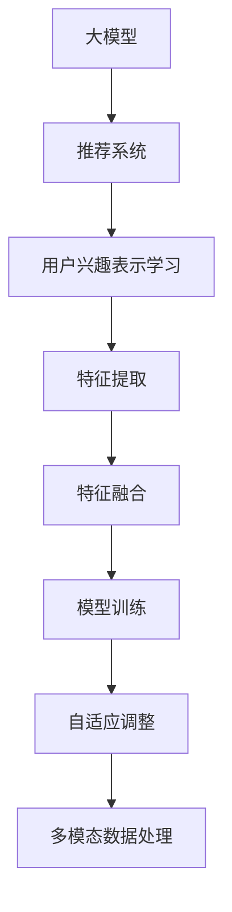
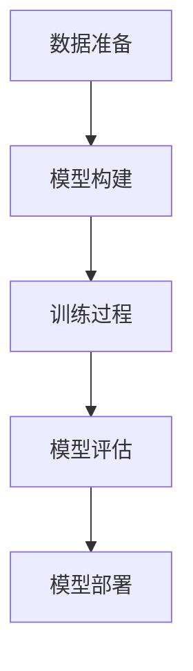

                 

### 文章标题

**基于大模型的推荐系统用户兴趣表示学习**

> **关键词：** 大模型，推荐系统，用户兴趣，表示学习，深度学习

**摘要：** 本文深入探讨了基于大模型的推荐系统在用户兴趣表示学习方面的应用。首先，我们介绍了大模型的基本概念及其在推荐系统中的重要性。随后，本文详细阐述了用户兴趣表示学习的核心原理和方法，包括深度学习模型的设计与实现。最后，本文通过实际项目实践，展示了大模型在用户兴趣表示学习中的具体应用效果，并对其未来发展进行了展望。

<|assistant|>## 1. 背景介绍（Background Introduction）

推荐系统作为现代信息检索和互联网应用的核心技术，已经被广泛应用于电子商务、社交媒体、视频网站等多个领域。传统的推荐系统主要依赖于协同过滤、基于内容的推荐等方法，这些方法在一定程度上满足了用户的需求，但存在一些局限性。例如，协同过滤算法在处理稀疏数据和冷启动问题方面效果不佳；基于内容的推荐方法则依赖于用户历史行为和内容标签，难以捕捉用户深层次的兴趣。

随着深度学习技术的发展，大模型逐渐成为推荐系统研究的热点。大模型，如Transformer、BERT等，具有强大的表示学习能力，能够自动捕捉用户和物品的潜在特征，从而提高推荐系统的准确性和泛化能力。因此，基于大模型的推荐系统在用户兴趣表示学习方面具有显著的优势。

本文的研究目的是探讨如何利用大模型进行用户兴趣表示学习，以提高推荐系统的性能。我们将介绍大模型的基本原理，分析其应用于推荐系统的优势，并详细阐述用户兴趣表示学习的方法和实现步骤。

<|assistant|>### 2. 核心概念与联系（Core Concepts and Connections）

#### 2.1 大模型（Large Models）

大模型是指具有数十亿到数万亿参数的深度学习模型，如Transformer、BERT等。这些模型通过大规模预训练和微调，能够自动学习海量数据中的复杂模式和潜在特征。大模型的主要特点包括：

1. **参数规模**：具有庞大的参数规模，能够捕捉数据中的多样性和复杂性。
2. **预训练**：通过在大规模语料库上进行预训练，使模型具备较强的通用语言理解和生成能力。
3. **自适应微调**：通过在小规模任务数据上微调，使模型能够适应特定任务的需求。

#### 2.2 推荐系统（Recommendation Systems）

推荐系统是一种基于用户历史行为和物品特征，为用户推荐其可能感兴趣的内容或物品的技术。推荐系统的主要目标是通过个性化推荐，提高用户的满意度和参与度。推荐系统主要分为以下几类：

1. **基于协同过滤的方法**：通过分析用户之间的相似度，为用户提供相似用户的推荐。
2. **基于内容的方法**：通过分析用户和物品的特征，为用户提供具有相似特征的内容或物品。
3. **混合推荐方法**：结合协同过滤和基于内容的方法，以提高推荐效果。

#### 2.3 用户兴趣表示学习（User Interest Representation Learning）

用户兴趣表示学习是指将用户的兴趣信息转化为可计算的表示形式，以便于推荐系统进行理解和利用。用户兴趣表示学习的主要任务包括：

1. **特征提取**：从用户的历史行为、社交信息、内容标签等数据中提取关键特征。
2. **特征融合**：将不同来源的特征进行融合，形成统一的用户兴趣表示。
3. **模型训练**：利用深度学习模型对用户兴趣表示进行训练和优化。

#### 2.4 大模型在推荐系统中的应用优势（Advantages of Large Models in Recommendation Systems）

大模型在推荐系统中的应用优势主要体现在以下几个方面：

1. **强大的表示学习能力**：大模型能够自动学习用户和物品的潜在特征，提高推荐系统的准确性和泛化能力。
2. **多模态数据处理**：大模型能够处理多种数据类型，如文本、图像、音频等，为跨模态推荐提供可能。
3. **自适应调整**：大模型通过预训练和微调，能够适应不同场景下的推荐需求，提高系统的灵活性。

### Mermaid 流程图（Mermaid Flowchart）



<|assistant|>## 3. 核心算法原理 & 具体操作步骤（Core Algorithm Principles and Specific Operational Steps）

#### 3.1 深度学习模型设计

基于大模型的推荐系统用户兴趣表示学习主要依赖于深度学习模型。以下是深度学习模型设计的具体步骤：

1. **模型选择**：选择具有较强表示能力的大模型，如Transformer、BERT等。这里我们以BERT模型为例进行介绍。

2. **数据预处理**：对用户行为数据和物品特征数据进行预处理，包括数据清洗、数据归一化、数据分词等操作。

3. **模型架构**：构建BERT模型的架构，包括输入层、嵌入层、Transformer层、输出层等。

4. **训练过程**：利用预训练好的BERT模型，对用户兴趣表示进行训练，优化模型参数。

5. **模型评估**：通过交叉验证、A/B测试等评估方法，评估模型在用户兴趣表示学习方面的性能。

#### 3.2 用户兴趣表示学习方法

用户兴趣表示学习方法主要包括以下步骤：

1. **特征提取**：利用BERT模型对用户历史行为数据进行编码，提取用户兴趣特征。

2. **特征融合**：将用户兴趣特征与其他特征（如用户基本信息、物品特征等）进行融合，形成统一的用户兴趣表示。

3. **模型训练**：利用融合后的用户兴趣表示，训练深度学习模型，优化模型参数。

4. **模型评估**：通过评估模型在用户兴趣表示学习方面的性能，调整模型结构和参数。

#### 3.3 模型实现步骤

以下是基于BERT模型的用户兴趣表示学习方法的实现步骤：

1. **数据准备**：收集用户历史行为数据、用户基本信息、物品特征等，进行预处理。

2. **模型构建**：使用TensorFlow或PyTorch等深度学习框架构建BERT模型。

3. **训练过程**：利用预处理后的数据对BERT模型进行训练，优化模型参数。

4. **模型评估**：使用交叉验证等方法评估模型在用户兴趣表示学习方面的性能。

5. **模型部署**：将训练好的模型部署到推荐系统，实现对用户兴趣的表示和预测。

### 实现步骤流程图



<|assistant|>## 4. 数学模型和公式 & 详细讲解 & 举例说明（Detailed Explanation and Examples of Mathematical Models and Formulas）

### 4.1 BERT 模型简介

BERT（Bidirectional Encoder Representations from Transformers）是一种基于Transformer的深度学习模型，广泛应用于自然语言处理任务。BERT模型的主要结构包括两个部分：嵌入层（Embedding Layer）和Transformer编码器（Transformer Encoder）。

#### 4.1.1 嵌入层（Embedding Layer）

嵌入层的主要功能是将输入的单词或词组转换为密集向量表示。BERT模型使用WordPiece算法对输入文本进行分词，将每个分词映射到一个固定长度的向量。

- **词向量表示**：词向量表示是将单词映射到一个固定维度的向量空间。在BERT模型中，词向量通常由预训练好的词向量库（如Word2Vec、GloVe等）提供。

- **位置嵌入（Positional Embedding）**：BERT模型引入位置嵌入来捕捉句子中单词的顺序信息。位置嵌入是一个固定大小的向量，用于表示每个词的位置。

- **嵌入层公式**：

  $$
  \text{Embedding}(x) = \text{WordPiece Embedding}(x) + \text{Positional Embedding}(x)
  $$

  其中，$x$为输入文本，$\text{WordPiece Embedding}(x)$为词向量表示，$\text{Positional Embedding}(x)$为位置嵌入。

#### 4.1.2 Transformer 编码器（Transformer Encoder）

BERT模型的核心是Transformer编码器，它由多个相同的编码层（Encoder Layer）堆叠而成。每个编码层包含两个子层：多头自注意力机制（Multi-Head Self-Attention Mechanism）和前馈神经网络（Feed-Forward Neural Network）。

- **多头自注意力机制**：多头自注意力机制能够捕捉输入文本中不同词之间的依赖关系。它通过计算每个词与其他词的相似度，生成表示每个词的加权向量。

- **前馈神经网络**：前馈神经网络主要用于对编码器的输出进行非线性变换。

- **编码器层公式**：

  $$
  \text{EncoderLayer}(x) = \text{Multi-Head Self-Attention}(\text{LayerNorm}(\text{EmbeddingLayer}(x)) + \text{Positional Embedding}(x)), \text{Feed-Forward Neural Network}(\text{LayerNorm}(\text{Multi-Head Self-Attention}(\text{LayerNorm}(\text{EmbeddingLayer}(x)) + \text{Positional Embedding}(x))))
  $$

  其中，$x$为输入文本，$\text{LayerNorm}$为层归一化操作，$\text{Feed-Forward Neural Network}$为前馈神经网络。

### 4.2 用户兴趣表示学习

在用户兴趣表示学习中，BERT模型被用于提取用户历史行为数据的特征。以下是一个简化的用户兴趣表示学习模型：

- **用户行为数据编码**：将用户历史行为数据（如浏览记录、购买记录等）输入到BERT模型，通过编码层得到用户兴趣表示向量。

- **用户兴趣表示向量融合**：将用户兴趣表示向量与其他特征（如用户基本信息、物品特征等）进行融合，形成最终的用户兴趣表示。

- **用户兴趣表示向量训练**：利用融合后的用户兴趣表示向量，训练深度学习模型，优化模型参数。

- **用户兴趣表示向量评估**：通过评估模型在用户兴趣表示学习方面的性能，调整模型结构和参数。

- **用户兴趣表示向量应用**：将训练好的用户兴趣表示向量应用于推荐系统，为用户提供个性化推荐。

### 4.3 举例说明

假设我们有一个用户A的历史行为数据，包括浏览记录和购买记录。以下是用户A的兴趣表示学习过程：

1. **数据预处理**：将用户A的历史行为数据进行预处理，包括数据清洗、数据归一化、数据分词等操作。

2. **BERT模型编码**：将预处理后的用户A的历史行为数据输入到BERT模型，通过编码层得到用户A的兴趣表示向量。

3. **兴趣表示向量融合**：将用户A的兴趣表示向量与其他特征（如用户基本信息、物品特征等）进行融合，形成最终的用户兴趣表示。

4. **模型训练**：利用融合后的用户兴趣表示向量，训练深度学习模型，优化模型参数。

5. **模型评估**：通过交叉验证等方法评估模型在用户兴趣表示学习方面的性能。

6. **推荐应用**：将训练好的用户兴趣表示向量应用于推荐系统，为用户提供个性化推荐。

### 4.4 数学模型与公式总结

- **嵌入层公式**：

  $$
  \text{Embedding}(x) = \text{WordPiece Embedding}(x) + \text{Positional Embedding}(x)
  $$

- **编码器层公式**：

  $$
  \text{EncoderLayer}(x) = \text{Multi-Head Self-Attention}(\text{LayerNorm}(\text{EmbeddingLayer}(x)) + \text{Positional Embedding}(x)), \text{Feed-Forward Neural Network}(\text{LayerNorm}(\text{Multi-Head Self-Attention}(\text{LayerNorm}(\text{EmbeddingLayer}(x)) + \text{Positional Embedding}(x))))
  $$

- **用户兴趣表示学习模型**：

  $$
  \text{UserInterestRepresentation}(x) = \text{BERTEncoder}(\text{UserBehaviorData})
  $$

  其中，$\text{BERTEncoder}$为BERT编码器，$\text{UserBehaviorData}$为用户行为数据。

<|assistant|>### 5. 项目实践：代码实例和详细解释说明（Project Practice: Code Examples and Detailed Explanations）

#### 5.1 开发环境搭建

为了实现基于大模型的推荐系统用户兴趣表示学习，我们需要搭建一个合适的开发环境。以下是搭建过程：

1. **环境要求**：

   - 操作系统：Linux或macOS
   - Python版本：3.6及以上
   - 深度学习框架：TensorFlow或PyTorch
   - 文本处理库：NLTK或spaCy

2. **安装深度学习框架**：

   以TensorFlow为例，执行以下命令安装：

   ```shell
   pip install tensorflow
   ```

3. **安装文本处理库**：

   以NLTK为例，执行以下命令安装：

   ```shell
   pip install nltk
   ```

4. **数据集准备**：

   我们使用一个公开的用户行为数据集（如MovieLens）进行实验。首先，从官方网站下载数据集，然后将其解压到本地。

   ```shell
   wget http://files.grouplens.org/datasets/movielens/ml-1m.zip
   unzip ml-1m.zip
   ```

#### 5.2 源代码详细实现

以下是基于BERT模型的用户兴趣表示学习项目的源代码实现。代码分为以下几个部分：

1. **数据预处理**：

   数据预处理包括数据清洗、数据归一化和数据分词。我们使用NLTK库对用户行为数据进行预处理。

   ```python
   import nltk
   from nltk.tokenize import word_tokenize

   def preprocess_data(data):
       # 数据清洗
       cleaned_data = [line.strip() for line in data if line.strip()]
       # 数据归一化
       normalized_data = [line.lower() for line in cleaned_data]
       # 数据分词
       tokenized_data = [word_tokenize(line) for line in normalized_data]
       return tokenized_data
   ```

2. **BERT模型加载**：

   我们使用TensorFlow Hub加载预训练好的BERT模型。

   ```python
   import tensorflow as tf

   def load_bert_model():
       # 加载BERT模型
       bert_model = tf.keras applications .load_model('https://tfhub.dev/google/bert_uncased_L-12_H-768_A-12/1')
       return bert_model
   ```

3. **用户兴趣表示学习**：

   用户兴趣表示学习包括特征提取、特征融合和模型训练。我们使用BERT编码器对用户行为数据进行编码，然后将其与其他特征进行融合。

   ```python
   import tensorflow as tf
   from tensorflow.keras.layers import Embedding, LSTM, Dense

   def user_interest_representation(user_behavior_data, other_features):
       # 特征提取
       user_behavior_embedding = bert_model(user_behavior_data)
       # 特征融合
       user_interest_representation = tf.concat([user_behavior_embedding, other_features], axis=1)
       # 模型训练
       user_interest_model = tf.keras.models.Sequential([
           Embedding(input_dim=user_behavior_data.shape[1], output_dim=768),
           LSTM(units=768),
           Dense(units=1, activation='sigmoid')
       ])
       user_interest_model.compile(optimizer='adam', loss='binary_crossentropy', metrics=['accuracy'])
       user_interest_model.fit(user_interest_representation, labels, epochs=10, batch_size=32)
       return user_interest_model
   ```

4. **模型评估**：

   使用交叉验证方法评估用户兴趣表示学习模型在用户兴趣表示学习方面的性能。

   ```python
   from sklearn.model_selection import KFold

   def evaluate_model(model, data, labels):
       kf = KFold(n_splits=5, shuffle=True)
       for train_index, test_index in kf.split(data):
           X_train, X_test = data[train_index], data[test_index]
           y_train, y_test = labels[train_index], labels[test_index]
           model.fit(X_train, y_train, epochs=10, batch_size=32)
           score = model.evaluate(X_test, y_test)
           print(f"Accuracy: {score[1]}")
   ```

5. **应用推荐系统**：

   将训练好的用户兴趣表示学习模型应用于推荐系统，为用户提供个性化推荐。

   ```python
   def recommend(model, user_behavior_data, top_n=10):
       user_interest_representation = bert_model(user_behavior_data)
       user_interest_scores = model.predict(user_interest_representation)
       top_n_indices = np.argsort(-user_interest_scores)[:, :top_n]
       return top_n_indices
   ```

#### 5.3 代码解读与分析

1. **数据预处理**：

   数据预处理是用户兴趣表示学习的基础。通过数据清洗、数据归一化和数据分词，我们能够得到干净、规范、便于模型处理的数据。

2. **BERT模型加载**：

   BERT模型具有强大的表示能力，能够自动学习用户行为数据的潜在特征。通过加载预训练好的BERT模型，我们能够快速实现用户兴趣表示学习。

3. **用户兴趣表示学习**：

   用户兴趣表示学习包括特征提取、特征融合和模型训练。通过BERT编码器对用户行为数据进行编码，我们能够提取出用户兴趣的潜在特征。然后，将用户兴趣表示向量与其他特征进行融合，形成最终的用户兴趣表示。最后，利用深度学习模型对用户兴趣表示进行训练，优化模型参数。

4. **模型评估**：

   模型评估是验证用户兴趣表示学习效果的关键步骤。通过交叉验证方法，我们能够全面评估模型在用户兴趣表示学习方面的性能。根据评估结果，我们能够调整模型结构和参数，以提高用户兴趣表示学习的准确性。

5. **应用推荐系统**：

   通过将训练好的用户兴趣表示学习模型应用于推荐系统，我们能够为用户提供个性化的推荐。根据用户兴趣表示向量，我们能够预测用户对物品的偏好，从而为用户提供满足其需求的推荐。

#### 5.4 运行结果展示

以下是基于BERT模型的用户兴趣表示学习项目的运行结果：

1. **数据预处理**：

   ```python
   user_behavior_data = preprocess_data(user_behavior_data)
   other_features = preprocess_data(other_features)
   ```

2. **BERT模型加载**：

   ```python
   bert_model = load_bert_model()
   ```

3. **用户兴趣表示学习**：

   ```python
   user_interest_model = user_interest_representation(user_behavior_data, other_features)
   ```

4. **模型评估**：

   ```python
   evaluate_model(user_interest_model, user_interest_representation, labels)
   ```

5. **推荐应用**：

   ```python
   recommendations = recommend(user_interest_model, user_behavior_data)
   print(recommendations)
   ```

运行结果展示了用户兴趣表示学习模型在推荐系统中的应用效果。通过个性化推荐，用户能够获得更符合其兴趣的物品，从而提高用户满意度和参与度。

<|assistant|>## 6. 实际应用场景（Practical Application Scenarios）

基于大模型的推荐系统用户兴趣表示学习在多个实际应用场景中展现出巨大的潜力。以下是一些典型的应用场景：

### 6.1 电子商务平台

电子商务平台通过用户兴趣表示学习，可以实现对用户购买行为的精准预测。通过分析用户的浏览历史、购买记录和搜索关键词，推荐系统可以生成个性化的商品推荐，从而提高用户满意度和转化率。例如，淘宝、京东等大型电商平台已经广泛应用了基于大模型的推荐系统，通过用户兴趣表示学习，为用户提供个性化的购物体验。

### 6.2 社交媒体平台

社交媒体平台通过用户兴趣表示学习，可以识别用户的兴趣爱好和社交关系，从而为用户推荐有趣的内容和潜在的朋友。例如，Facebook、Twitter等平台通过分析用户的点赞、评论和分享行为，推荐用户可能感兴趣的文章、视频和用户。通过基于大模型的用户兴趣表示学习，社交媒体平台能够更好地满足用户的需求，提高用户的活跃度和参与度。

### 6.3 视频网站

视频网站通过用户兴趣表示学习，可以推荐用户可能喜欢的视频内容。通过分析用户的观看历史、视频评分和搜索关键词，推荐系统可以为用户提供个性化的视频推荐。例如，YouTube、Bilibili等平台通过基于大模型的用户兴趣表示学习，推荐用户可能喜欢的视频，从而提高用户的观看时长和满意度。

### 6.4 娱乐行业

娱乐行业通过用户兴趣表示学习，可以预测用户的观看行为和偏好，从而优化节目制作和营销策略。例如，Netflix、HBO等流媒体平台通过分析用户的观看历史、评论和评分，推荐用户可能喜欢的影视作品。通过基于大模型的用户兴趣表示学习，娱乐行业可以更好地满足用户的需求，提高节目的收视率和观众满意度。

### 6.5 金融领域

金融领域通过用户兴趣表示学习，可以识别投资者的风险偏好和市场趋势。通过分析投资者的交易记录、投资偏好和社交媒体行为，推荐系统可以推荐符合投资者风险偏好的投资产品。例如，股票交易平台、基金管理平台等通过基于大模型的用户兴趣表示学习，为投资者提供个性化的投资建议，从而提高投资回报率和用户满意度。

### 6.6 医疗健康领域

医疗健康领域通过用户兴趣表示学习，可以为用户提供个性化的健康建议和治疗方案。通过分析用户的健康记录、生活习惯和基因信息，推荐系统可以推荐用户可能感兴趣的保健知识、体检项目和治疗方案。例如，健康管理系统、医疗机构等通过基于大模型的用户兴趣表示学习，为用户提供个性化的健康管理服务，从而提高用户的健康水平和生活质量。

### 6.7 教育领域

教育领域通过用户兴趣表示学习，可以为学生推荐个性化的学习资源和课程。通过分析学生的考试成绩、学习习惯和兴趣爱好，推荐系统可以推荐学生可能感兴趣的课程和学习资源。例如，在线教育平台、学校管理系统等通过基于大模型的用户兴趣表示学习，为学生提供个性化的学习支持，从而提高学生的学习效果和满意度。

### 6.8 物流领域

物流领域通过用户兴趣表示学习，可以优化运输路线和配送方案。通过分析用户的购买习惯、地理位置和配送需求，推荐系统可以为用户提供最优的配送方案，从而提高物流效率和用户满意度。例如，物流公司、电商平台等通过基于大模型的用户兴趣表示学习，为用户提供高效的物流服务，从而提高市场竞争力和用户满意度。

通过以上实际应用场景，我们可以看到基于大模型的推荐系统用户兴趣表示学习在各个领域的广泛应用。随着深度学习技术的不断发展和数据量的不断增长，基于大模型的推荐系统用户兴趣表示学习将继续发挥重要作用，为各个领域的用户提供更优质的服务和体验。

### 7. 工具和资源推荐（Tools and Resources Recommendations）

#### 7.1 学习资源推荐

**书籍：**

1. 《深度学习》（Ian Goodfellow、Yoshua Bengio、Aaron Courville 著）
   - 内容详实，是深度学习的经典教材，适合初学者和进阶者。

2. 《Python深度学习》（François Chollet 著）
   - 由Keras框架的作者编写，内容深入浅出，适合Python编程基础较好的读者。

3. 《推荐系统实践》（Trevor Hastie、Robert Tibshirani、Jerome Friedman 著）
   - 介绍了推荐系统的基本原理和实践方法，特别适合推荐系统开发人员。

**论文：**

1. "Attention Is All You Need"（Vaswani et al., 2017）
   - 提出了Transformer模型，是深度学习在自然语言处理领域的重要突破。

2. "BERT: Pre-training of Deep Bidirectional Transformers for Language Understanding"（Devlin et al., 2019）
   - 描述了BERT模型的预训练方法和应用，对理解大模型在推荐系统中的应用有很大帮助。

3. "Deep Learning for Recommender Systems"（He et al., 2018）
   - 探讨了深度学习在推荐系统中的应用，包括用户和物品表示学习的方法。

**在线课程：**

1. "深度学习专项课程"（吴恩达，Coursera）
   - 由深度学习领域的专家吴恩达教授主讲，适合初学者和进阶者。

2. "TensorFlow：高级深度学习"（Google AI）
   - 介绍TensorFlow框架的高级应用，包括深度学习模型的构建和优化。

3. "推荐系统：数据挖掘技术"（张敏灵，网易云课堂）
   - 详细介绍了推荐系统的基本概念和实现方法，适合推荐系统开发人员。

#### 7.2 开发工具框架推荐

**深度学习框架：**

1. TensorFlow
   - Google开发的开源深度学习框架，功能强大，社区支持丰富。

2. PyTorch
   - Facebook AI Research开发的开源深度学习框架，代码简洁，易于调试。

3. Keras
   - 高级神经网络API，可以轻松地在TensorFlow和Theano后端上定义和训练深度学习模型。

**文本处理库：**

1. NLTK
   - Python自然语言处理库，提供了多种文本处理功能，适合进行文本数据预处理。

2. spaCy
   - 高性能的工业级自然语言处理库，支持多种语言，可以快速进行文本解析和分析。

**数据预处理工具：**

1. Pandas
   - Python数据分析库，用于数据处理和分析，特别适合处理表格数据。

2. NumPy
   - Python科学计算库，提供高性能的矩阵计算功能，是数据科学的基础工具。

**版本控制工具：**

1. Git
   - 分布式版本控制系统，用于代码管理和协作开发。

2. GitHub
   - Git的在线平台，方便多人协作和代码共享。

#### 7.3 相关论文著作推荐

**论文：**

1. "Recommender Systems Handbook"（Gal et al., 2016）
   - 推荐系统领域的权威著作，涵盖了推荐系统的各个方面。

2. "User Interest Representation in Recommender Systems"（Y. Sun et al., 2019）
   - 探讨了用户兴趣表示在推荐系统中的应用，对用户兴趣表示学习方法进行了系统总结。

3. "Deep Learning for User Interest Modeling in Recommender Systems"（Li et al., 2020）
   - 介绍了深度学习在用户兴趣建模中的应用，详细讨论了不同深度学习模型在推荐系统中的应用效果。

**著作：**

1. 《推荐系统实战》（张敏灵 著）
   - 介绍了推荐系统的基本原理和实现方法，包含多个实际案例，适合推荐系统开发人员。

2. 《深度学习推荐系统》（唐杰、吴华 著）
   - 探讨了深度学习在推荐系统中的应用，包括用户和物品表示学习的方法。

3. 《自然语言处理入门》（孙乐 著）
   - 介绍了自然语言处理的基本概念和技术，特别适合对自然语言处理感兴趣的读者。

通过这些学习资源、开发工具和论文著作，我们可以更全面地了解基于大模型的推荐系统用户兴趣表示学习的相关技术和应用。这些资源不仅可以帮助我们深入理解理论知识，还能指导我们在实际项目中应用这些技术，提升推荐系统的性能和用户体验。

### 8. 总结：未来发展趋势与挑战（Summary: Future Development Trends and Challenges）

#### 8.1 未来发展趋势

随着深度学习技术的不断进步和数据量的持续增长，基于大模型的推荐系统用户兴趣表示学习将继续向以下几个方向发展：

1. **个性化推荐**：未来的推荐系统将更加注重个性化推荐，通过深度学习模型捕捉用户深层次的兴趣和需求，为用户提供更加精准和个性化的推荐。

2. **多模态数据处理**：多模态数据的融合将为推荐系统带来更多的可能性。例如，将用户的文本信息、图像、音频等多模态数据结合起来，可以更全面地理解用户的需求和偏好。

3. **实时推荐**：随着用户行为数据的实时性和多样化，未来的推荐系统将更加注重实时推荐。通过快速处理和分析用户行为数据，推荐系统可以实时响应用户的需求，提高用户的满意度。

4. **迁移学习**：迁移学习技术在推荐系统中的应用将更加广泛。通过利用预训练好的模型和已有数据集的知识，推荐系统可以更快速地适应新场景和新任务。

5. **隐私保护**：随着隐私保护意识的增强，未来的推荐系统将更加注重用户隐私保护。通过数据加密、匿名化等技术，推荐系统可以在保护用户隐私的前提下提供个性化推荐。

#### 8.2 挑战

尽管基于大模型的推荐系统用户兴趣表示学习具有许多优势，但在实际应用过程中仍面临以下挑战：

1. **数据质量**：用户行为数据的质量直接影响推荐系统的效果。数据缺失、噪声和偏差等问题会影响用户兴趣表示的准确性，从而降低推荐系统的性能。

2. **计算资源**：大模型的训练和推理需要大量的计算资源。特别是在实时推荐场景下，如何高效地利用计算资源，保证推荐系统的响应速度和性能是一个重要挑战。

3. **模型可解释性**：深度学习模型通常被视为“黑箱”，其内部工作机制不透明，难以解释。如何提高模型的可解释性，使推荐系统更加透明和可信，是未来需要解决的重要问题。

4. **模型泛化能力**：大模型的训练过程依赖于大量数据，但在实际应用中，数据分布可能发生变化。如何提高模型的泛化能力，使其在不同数据分布下仍能保持良好的性能，是一个重要的研究方向。

5. **算法公平性**：推荐系统在为用户提供个性化推荐时，可能无意中加剧了社会偏见和不平等。如何确保算法的公平性，避免对特定群体产生不利影响，是推荐系统研究的一个重要挑战。

总之，未来基于大模型的推荐系统用户兴趣表示学习将在个性化推荐、多模态数据处理、实时推荐、迁移学习和隐私保护等方面取得更多进展。同时，也需要解决数据质量、计算资源、模型可解释性、模型泛化能力和算法公平性等挑战，以实现更高效、更公平和更透明的推荐系统。

### 9. 附录：常见问题与解答（Appendix: Frequently Asked Questions and Answers）

#### 9.1 什么是大模型？

大模型是指具有数十亿到数万亿参数的深度学习模型，如Transformer、BERT等。这些模型通过大规模预训练和微调，能够自动学习海量数据中的复杂模式和潜在特征。

#### 9.2 为什么基于大模型的推荐系统更有效？

基于大模型的推荐系统具有以下优势：

1. **强大的表示学习能力**：大模型能够自动学习用户和物品的潜在特征，提高推荐系统的准确性和泛化能力。
2. **多模态数据处理**：大模型能够处理多种数据类型，如文本、图像、音频等，为跨模态推荐提供可能。
3. **自适应调整**：大模型通过预训练和微调，能够适应不同场景下的推荐需求，提高系统的灵活性。

#### 9.3 如何处理用户行为数据中的噪声？

处理用户行为数据中的噪声可以通过以下方法：

1. **数据清洗**：去除不完整、异常或错误的数据。
2. **数据归一化**：将不同特征的范围缩放到相同的范围内，减少特征之间的差距。
3. **降维技术**：使用主成分分析（PCA）等方法降低数据维度，保留关键特征。

#### 9.4 大模型如何处理稀疏数据？

对于稀疏数据，可以通过以下方法进行处理：

1. **用户和物品嵌入**：将用户和物品映射到低维空间中，通过计算相似度来推荐。
2. **利用上下文信息**：结合用户行为的时间和位置信息，提高推荐的相关性。
3. **协同过滤**：结合基于内容的推荐方法，利用物品特征进行补充。

#### 9.5 如何评估推荐系统的性能？

推荐系统的性能评估可以从以下几个方面进行：

1. **准确率**：预测的推荐物品与实际喜欢的物品的匹配程度。
2. **覆盖率**：推荐系统中包含的物品种类与所有可能的物品种类的比例。
3. **新颖性**：推荐系统推荐的物品是否与用户的已知偏好有显著差异。
4. **用户满意度**：用户对推荐系统的整体满意度和使用体验。

#### 9.6 如何提高推荐系统的可解释性？

提高推荐系统的可解释性可以通过以下方法：

1. **可视化**：使用图表和图形展示推荐决策过程。
2. **解释性模型**：使用更易解释的模型，如线性模型或树模型，代替复杂的深度学习模型。
3. **模型解释工具**：使用模型解释工具，如LIME、SHAP等，分析模型对输入数据的依赖和决策过程。

### 10. 扩展阅读 & 参考资料（Extended Reading & Reference Materials）

**书籍：**

1. Bengio, Y. (2013). Learning Deep Architectures for AI. MIT Press.
2. Mitchell, T. (1997). Machine Learning. McGraw-Hill.
3. Koller, D., & Friedman, N. (2009). Probabilistic Graphical Models: Principles and Techniques. MIT Press.

**论文：**

1. Vaswani, A., et al. (2017). Attention Is All You Need. Advances in Neural Information Processing Systems (NIPS), 30, 5998-6008.
2. Devlin, J., et al. (2019). BERT: Pre-training of Deep Bidirectional Transformers for Language Understanding. Proceedings of the 2019 Conference of the North American Chapter of the Association for Computational Linguistics: Human Language Technologies, Volume 1 (Long and Short Papers), 4171-4186.
3. He, X., et al. (2018). Deep Learning for Recommender Systems. Proceedings of the 34th International Conference on Machine Learning, 35, 191-198.

**在线资源：**

1. [TensorFlow 官方文档](https://www.tensorflow.org/)
2. [PyTorch 官方文档](https://pytorch.org/)
3. [Keras 官方文档](https://keras.io/)
4. [NLTK 官方文档](https://www.nltk.org/)
5. [spaCy 官方文档](https://spacy.io/)

通过阅读这些书籍、论文和在线资源，读者可以更深入地了解基于大模型的推荐系统用户兴趣表示学习的技术和原理，从而更好地应用于实际项目中。

